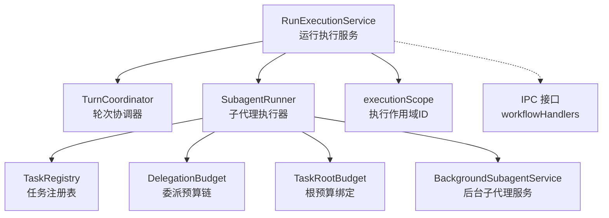
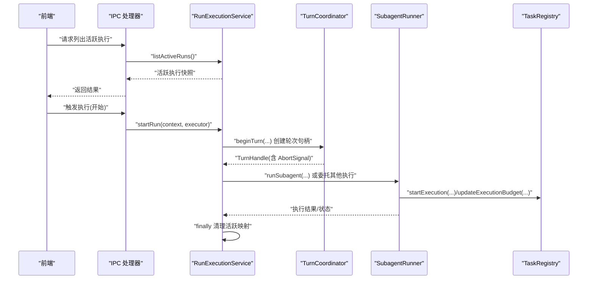
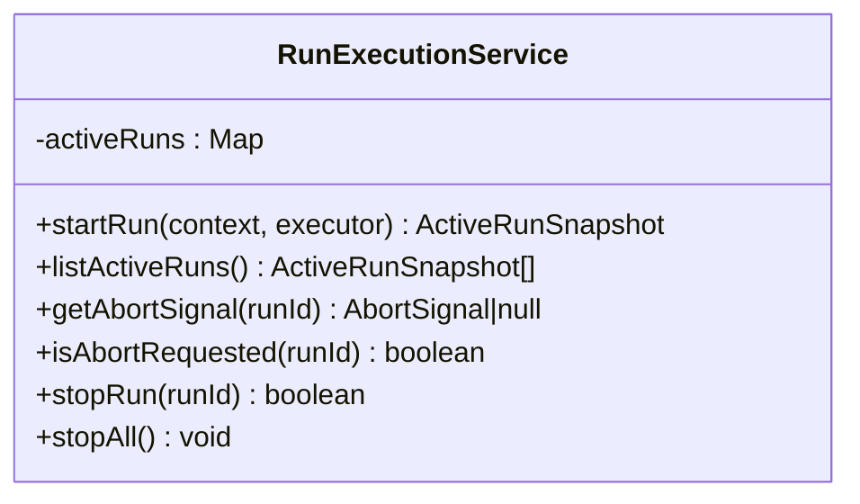
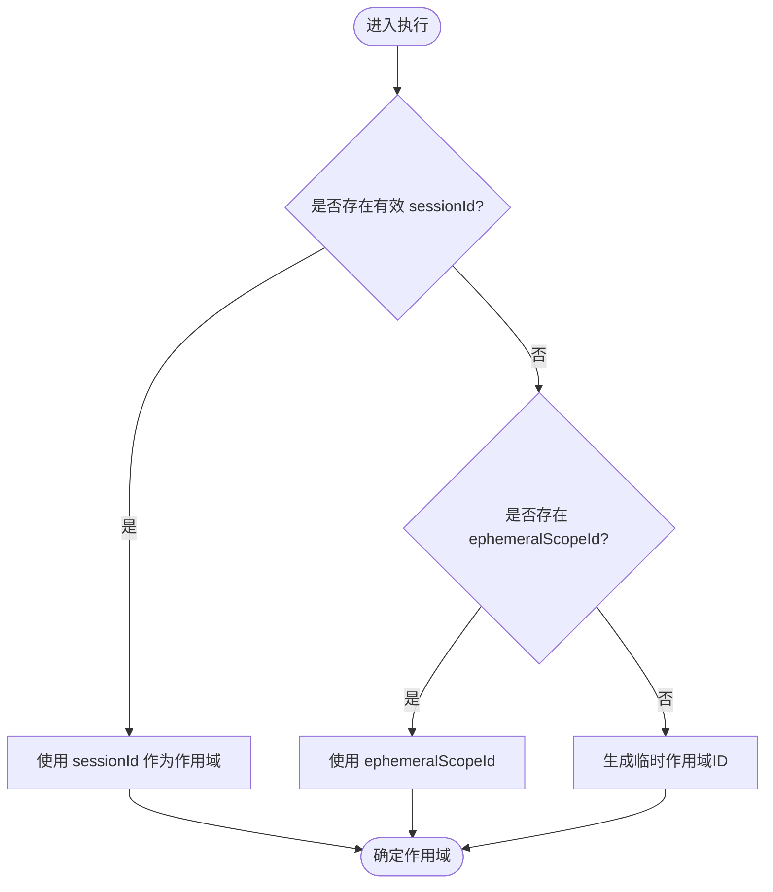
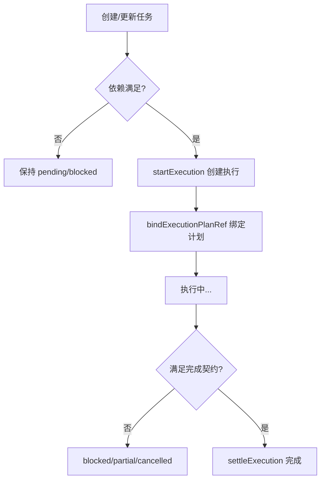
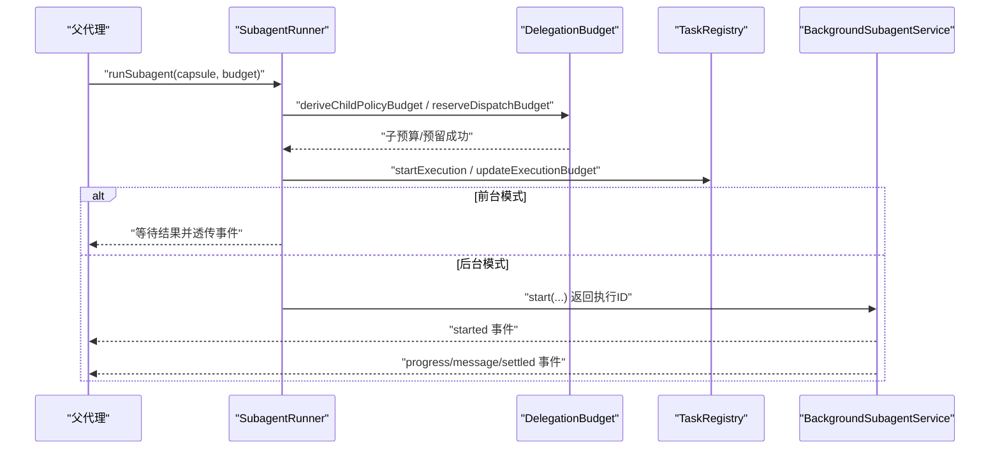
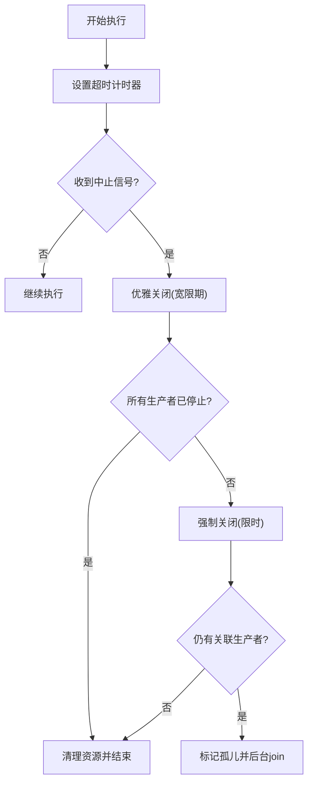
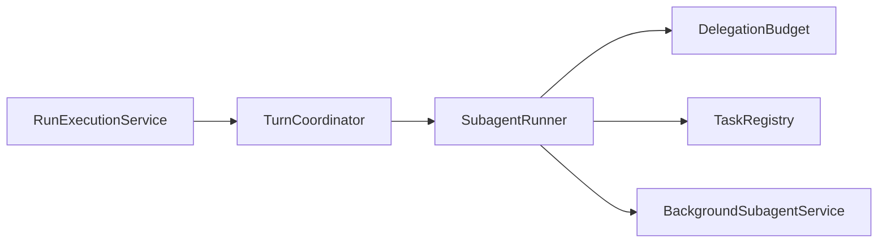

# RunExecutionService 运行执行服务

<cite>
**本文引用的文件**
- [RunExecutionService.ts](file://src/main/workflow/debugger/RunExecutionService.ts)
- [TurnCoordinator.ts](file://src/main/workflow/debugger/TurnCoordinator.ts)
- [SubagentRunner.ts](file://src/main/workflow/debugger/SubagentRunner.ts)
- [DelegationBudget.ts](file://src/main/workflow/debugger/DelegationBudget.ts)
- [TaskRootBudget.ts](file://src/main/workflow/debugger/TaskRootBudget.ts)
- [BackgroundSubagentService.ts](file://src/main/workflow/debugger/BackgroundSubagentService.ts)
- [executionScope.ts](file://src/main/workflow/debugger/executionScope.ts)
- [TaskRegistry.ts](file://src/main/agent-runtime/tasks/TaskRegistry.ts)
- [workflowHandlers.ts](file://src/main/ipc/workflowHandlers.ts)
</cite>

## 目录
1. [简介](#简介)
2. [项目结构](#项目结构)
3. [核心组件](#核心组件)
4. [架构总览](#架构总览)
5. [详细组件分析](#详细组件分析)
6. [依赖关系分析](#依赖关系分析)
7. [性能与约束](#性能与约束)
8. [故障排查指南](#故障排查指南)
9. [结论](#结论)

## 简介
本文件围绕 RunExecutionService 运行执行服务，系统化阐述其生命周期管理、执行范围隔离、资源与预算控制、执行计划制定与调度、以及监控诊断能力。重点覆盖：
- 执行范围定义与作用域隔离（会话级、子代理级、临时作用域）
- 资源分配与清理策略（AbortController、超时、生产者归并）
- 执行计划制定与任务分解（任务注册、依赖解析、DAG、并行调度）
- 监控与诊断（事件流、进度跟踪、错误收集、预算审计）
- 约束保障（超时、工具调用上限、子代理深度、工作墙时限制）

## 项目结构
RunExecutionService 位于调试器工作流模块中，作为“运行期执行”的轻量控制器，负责启动、中止、查询活跃执行，并与 TurnCoordinator、SubagentRunner、TaskRegistry 等协作完成更复杂的执行编排。

图表来源
- [RunExecutionService.ts:16-82](file://src/main/workflow/debugger/RunExecutionService.ts#L16-L82)
- [TurnCoordinator.ts:205-605](file://src/main/workflow/debugger/TurnCoordinator.ts#L205-L605)
- [SubagentRunner.ts:71-680](file://src/main/workflow/debugger/SubagentRunner.ts#L71-L680)
- [DelegationBudget.ts:1-59](file://src/main/workflow/debugger/DelegationBudget.ts#L1-L59)
- [TaskRootBudget.ts:1-96](file://src/main/workflow/debugger/TaskRootBudget.ts#L1-L96)
- [BackgroundSubagentService.ts:37-427](file://src/main/workflow/debugger/BackgroundSubagentService.ts#L37-L427)
- [executionScope.ts:1-36](file://src/main/workflow/debugger/executionScope.ts#L1-L36)
- [workflowHandlers.ts:84-105](file://src/main/ipc/workflowHandlers.ts#L84-L105)

章节来源
- [RunExecutionService.ts:16-82](file://src/main/workflow/debugger/RunExecutionService.ts#L16-L82)
- [workflowHandlers.ts:84-105](file://src/main/ipc/workflowHandlers.ts#L84-L105)

## 核心组件
- RunExecutionService：维护活跃执行集合，提供 startRun/listActiveRuns/getAbortSignal/isAbortRequested/stopRun/stopAll 等能力，确保执行可被外部中断并在完成后自动清理。
- TurnCoordinator：以 TurnHandle 为单位封装轮次生命周期，内置超时计时器、生产者注册/加入、优雅关闭与孤儿处理。
- SubagentRunner：将委派胶囊编译为子代理执行，建立子会话作用域、预算继承与限制、事件透传、结果持久化与契约校验。
- DelegationBudget：构建父子预算链，支持恢复预算、预留槽位与持久化观察者刷新。
- TaskRootBudget：将策略预算绑定到任务根预算，合并历史使用量并持久化。
- BackgroundSubagentService：承载后台执行的生命周期、消息通道、状态机推进、结果落盘与投影刷新。
- executionScope：生成/解析执行作用域 ID，区分会话级与临时作用域。
- TaskRegistry：任务与执行的持久化登记、依赖校验、状态迁移、预算更新、消息队列与计划引用绑定。

章节来源
- [RunExecutionService.ts:16-82](file://src/main/workflow/debugger/RunExecutionService.ts#L16-L82)
- [TurnCoordinator.ts:205-605](file://src/main/workflow/debugger/TurnCoordinator.ts#L205-L605)
- [SubagentRunner.ts:71-680](file://src/main/workflow/debugger/SubagentRunner.ts#L71-L680)
- [DelegationBudget.ts:1-59](file://src/main/workflow/debugger/DelegationBudget.ts#L1-L59)
- [TaskRootBudget.ts:1-96](file://src/main/workflow/debugger/TaskRootBudget.ts#L1-L96)
- [BackgroundSubagentService.ts:37-427](file://src/main/workflow/debugger/BackgroundSubagentService.ts#L37-L427)
- [executionScope.ts:1-36](file://src/main/workflow/debugger/executionScope.ts#L1-L36)
- [TaskRegistry.ts:29-200](file://src/main/agent-runtime/tasks/TaskRegistry.ts#L29-L200)

## 架构总览
下图展示从 IPC 入口到执行服务的调用链，以及执行过程中与 TurnCoordinator、SubagentRunner、TaskRegistry 的交互。

图表来源
- [workflowHandlers.ts:84-105](file://src/main/ipc/workflowHandlers.ts#L84-L105)
- [RunExecutionService.ts:19-44](file://src/main/workflow/debugger/RunExecutionService.ts#L19-L44)
- [TurnCoordinator.ts:507-555](file://src/main/workflow/debugger/TurnCoordinator.ts#L507-L555)
- [SubagentRunner.ts:80-429](file://src/main/workflow/debugger/SubagentRunner.ts#L80-L429)
- [TaskRegistry.ts:99-151](file://src/main/agent-runtime/tasks/TaskRegistry.ts#L99-L151)

## 详细组件分析

### RunExecutionService 运行执行服务
- 职责：维护当前活跃执行集合，提供统一的中断与清理入口；对外暴露 listActiveRuns 供 IPC 查询。
- 关键行为：
  - startRun：若 runId 已存在则复用；否则创建 AbortController，包装 executor(signal)，在 finally 中安全移除条目。
  - stopRun/stopAll：通过 AbortController 中断单个或全部执行，并等待 Promise  settle。
  - getAbortSignal/isAbortRequested：供上层检查或传递中断信号。
- 设计要点：
  - 无锁 Map + AbortController 实现轻量并发控制。
  - 使用 finally 保证即使异常也能清理活跃映射，避免泄漏。
  - 与 IPC 层集成，暴露 listActiveRuns 用于前端展示。

图表来源
- [RunExecutionService.ts:16-82](file://src/main/workflow/debugger/RunExecutionService.ts#L16-L82)

章节来源
- [RunExecutionService.ts:16-82](file://src/main/workflow/debugger/RunExecutionService.ts#L16-L82)
- [workflowHandlers.ts:93-105](file://src/main/ipc/workflowHandlers.ts#L93-L105)

### 执行范围与作用域隔离
- 作用域 ID 解析：优先使用 sessionId，其次 ephemeralScopeId，否则生成临时作用域 ID；支持识别瞬态作用域（ephemeral 前缀或包含 ::subagent::）。
- 子代理作用域：子代理使用独立 sessionId 段隔离上下文与消息，避免污染父线程持久化。
- 任务作用域：通过 delegated task scope 将子代理的执行绑定到父任务树，限制嵌套委派的目标范围。

图表来源
- [executionScope.ts:8-35](file://src/main/workflow/debugger/executionScope.ts#L8-L35)
- [SubagentRunner.ts:157-160](file://src/main/workflow/debugger/SubagentRunner.ts#L157-L160)
- [SubagentRunner.ts:487-504](file://src/main/workflow/debugger/SubagentRunner.ts#L487-L504)

章节来源
- [executionScope.ts:1-36](file://src/main/workflow/debugger/executionScope.ts#L1-L36)
- [SubagentRunner.ts:157-160](file://src/main/workflow/debugger/SubagentRunner.ts#L157-L160)
- [SubagentRunner.ts:487-504](file://src/main/workflow/debugger/SubagentRunner.ts#L487-L504)

### 执行计划制定与任务分解
- 任务注册与依赖：TaskRegistry 支持 blockedBy/blocks 建模 DAG，创建任务时校验依赖存在且无环，更新任务时校验依赖满足方可进入 in_progress。
- 执行启动：startExecution 校验祖先状态、当前执行唯一性、根预算可用性，并继承/计算预算，写入执行记录。
- 计划绑定：通过 bindExecutionPlanRef 将冻结的计划引用绑定到执行，便于追踪与回溯。
- 结果结算：settleExecution 校验终态、结果契约（completionRequirements），更新任务与执行状态。

图表来源
- [TaskRegistry.ts:34-97](file://src/main/agent-runtime/tasks/TaskRegistry.ts#L34-L97)
- [TaskRegistry.ts:99-151](file://src/main/agent-runtime/tasks/TaskRegistry.ts#L99-L151)
- [TaskRegistry.ts:193-196](file://src/main/agent-runtime/tasks/TaskRegistry.ts#L193-L196)

章节来源
- [TaskRegistry.ts:34-97](file://src/main/agent-runtime/tasks/TaskRegistry.ts#L34-L97)
- [TaskRegistry.ts:99-151](file://src/main/agent-runtime/tasks/TaskRegistry.ts#L99-L151)
- [TaskRegistry.ts:193-196](file://src/main/agent-runtime/tasks/TaskRegistry.ts#L193-L196)

### 并行调度与子代理执行
- 子代理预算：deriveChildPolicyBudget 根据父预算与请求预算推导子预算，支持恢复预算；policyBudgetChain 遍历父子链进行限额检查。
- 预留槽位：reserveDispatchBudget 原子检查并预留子代理槽位，flushPolicyBudgetObservers 确保持久化观察者在外部生效前完成。
- 消费槽位：consumeReservedSubagentSlot 在子代理实际启动时消费预留。
- 事件透传：SubagentRunner 将子代理的工具调用、助手增量、完成事件透传到父 trace，并统计聚合工具调用次数。
- 后台执行：BackgroundSubagentService 提供消息通道、状态推进、结果持久化与投影刷新，支持 beforeParentProviderRequestMessages 拉取子执行消息。

图表来源
- [SubagentRunner.ts:134-153](file://src/main/workflow/debugger/SubagentRunner.ts#L134-L153)
- [DelegationBudget.ts:7-23](file://src/main/workflow/debugger/DelegationBudget.ts#L7-L23)
- [DelegationBudget.ts:37-59](file://src/main/workflow/debugger/DelegationBudget.ts#L37-L59)
- [TaskRegistry.ts:99-151](file://src/main/agent-runtime/tasks/TaskRegistry.ts#L99-L151)
- [BackgroundSubagentService.ts:65-134](file://src/main/workflow/debugger/BackgroundSubagentService.ts#L65-L134)

章节来源
- [SubagentRunner.ts:134-153](file://src/main/workflow/debugger/SubagentRunner.ts#L134-L153)
- [DelegationBudget.ts:7-59](file://src/main/workflow/debugger/DelegationBudget.ts#L7-L59)
- [BackgroundSubagentService.ts:65-134](file://src/main/workflow/debugger/BackgroundSubagentService.ts#L65-L134)

### 资源分配与清理策略
- 超时控制：TurnHandle 构造时根据 maxWallTimeMs 设置 wallTimer，到期后触发 abortAndJoin(reason='timeout')；子代理也基于剩余墙时设置 deadlineTimer。
- 生产者归并：TurnHandle.registerProducer 管理异步生产者，abortAndJoin 会先尝试优雅关闭（graceMs），再强制（forceAfterMs），最终可能标记 orphaned 并后台继续 join。
- 资源释放：SubagentRunner 在 finally 中清理进程、撤销租约、释放工件访问、注销生产者与监听器；BackgroundSubagentService 在 settled 后清理 live 映射与订阅。

图表来源
- [TurnCoordinator.ts:233-274](file://src/main/workflow/debugger/TurnCoordinator.ts#L233-L274)
- [TurnCoordinator.ts:374-483](file://src/main/workflow/debugger/TurnCoordinator.ts#L374-L483)
- [SubagentRunner.ts:394-410](file://src/main/workflow/debugger/SubagentRunner.ts#L394-L410)
- [BackgroundSubagentService.ts:123-133](file://src/main/workflow/debugger/BackgroundSubagentService.ts#L123-L133)

章节来源
- [TurnCoordinator.ts:233-274](file://src/main/workflow/debugger/TurnCoordinator.ts#L233-L274)
- [TurnCoordinator.ts:374-483](file://src/main/workflow/debugger/TurnCoordinator.ts#L374-L483)
- [SubagentRunner.ts:394-410](file://src/main/workflow/debugger/SubagentRunner.ts#L394-L410)
- [BackgroundSubagentService.ts:123-133](file://src/main/workflow/debugger/BackgroundSubagentService.ts#L123-L133)

### 监控与诊断能力
- 事件流：TurnCoordinator 的 emitEvent 仅在 turn 存活且代数匹配时转发；SubagentRunner 将子代理事件（started/delta/completed/tool.*）透传到父 trace。
- 进度跟踪：BackgroundSubagentService 通过 appendExecutionMessage/consumeExecutionMessages 维护双向消息队列，beforeParentProviderRequestMessages 拉取子执行消息注入父上下文。
- 错误收集：SubagentRunner 捕获异常并转换为失败/取消状态；TaskRegistry.settleExecution 校验结果契约，缺失要求时阻塞完成。
- 预算审计：DelegationBudget 的 registerPolicyBudgetObserver 与 flushPolicyBudgetObservers 确保预算变更持久化；TaskRootBudget 合并历史用量并持久化根预算。

章节来源
- [TurnCoordinator.ts:341-347](file://src/main/workflow/debugger/TurnCoordinator.ts#L341-L347)
- [SubagentRunner.ts:179-192](file://src/main/workflow/debugger/SubagentRunner.ts#L179-L192)
- [SubagentRunner.ts:286-382](file://src/main/workflow/debugger/SubagentRunner.ts#L286-L382)
- [BackgroundSubagentService.ts:151-212](file://src/main/workflow/debugger/BackgroundSubagentService.ts#L151-L212)
- [DelegationBudget.ts:37-59](file://src/main/workflow/debugger/DelegationBudget.ts#L37-L59)
- [TaskRootBudget.ts:18-80](file://src/main/workflow/debugger/TaskRootBudget.ts#L18-L80)

### 执行约束、超时控制与资源限制
- 策略预算：maxToolCalls、maxSubagents、maxChildDepth、maxWallTimeMs 在 TurnCoordinator 中严格校验；子代理创建时再次校验 depth、children、aggregateToolCalls、wall 时间。
- 根预算：TaskRootBudget 将策略预算绑定到任务根预算，合并历史用量并持久化，防止重复计费。
- 任务执行预算：TaskRegistry.updateExecutionBudget 仅允许单调递增计数与收窄上限，确保预算不可逆收缩。
- 超时：TurnHandle 与子代理均基于 wallStartedAt + maxWallTimeMs 设置定时器，到期触发中止。

章节来源
- [TurnCoordinator.ts:65-126](file://src/main/workflow/debugger/TurnCoordinator.ts#L65-L126)
- [TurnCoordinator.ts:160-191](file://src/main/workflow/debugger/TurnCoordinator.ts#L160-L191)
- [TaskRootBudget.ts:18-80](file://src/main/workflow/debugger/TaskRootBudget.ts#L18-L80)
- [TaskRegistry.ts:154-191](file://src/main/agent-runtime/tasks/TaskRegistry.ts#L154-L191)

## 依赖关系分析
- RunExecutionService 低耦合地管理活跃执行，依赖 AbortController 与 Promise 语义，不直接持有业务逻辑。
- TurnCoordinator 集中轮次生命周期，屏蔽复杂的生产者管理与超时逻辑，向上提供简洁的 begin/end/abort API。
- SubagentRunner 依赖 DelegationBudget、TaskRegistry、BackgroundSubagentService 完成子代理执行、预算与持久化。
- BackgroundSubagentService 通过 TaskRegistry 的消息通道与状态机驱动后台执行，解耦 UI 与执行细节。

图表来源
- [RunExecutionService.ts:16-82](file://src/main/workflow/debugger/RunExecutionService.ts#L16-L82)
- [TurnCoordinator.ts:205-605](file://src/main/workflow/debugger/TurnCoordinator.ts#L205-L605)
- [SubagentRunner.ts:71-680](file://src/main/workflow/debugger/SubagentRunner.ts#L71-L680)
- [DelegationBudget.ts:1-59](file://src/main/workflow/debugger/DelegationBudget.ts#L1-L59)
- [TaskRegistry.ts:29-200](file://src/main/agent-runtime/tasks/TaskRegistry.ts#L29-L200)
- [BackgroundSubagentService.ts:37-427](file://src/main/workflow/debugger/BackgroundSubagentService.ts#L37-L427)

## 性能与约束
- 并发控制：TurnHandle 的生产者归并机制避免长时间挂起；grace/force 双阶段关闭提升响应性与可靠性。
- 预算节流：reserveDispatchBudget 原子预留子代理槽位，避免超发；flushPolicyBudgetObservers 确保持久化顺序一致。
- 内存与IO：子代理使用独立会话作用域隔离上下文，减少污染；BackgroundSubagentService 对消息进行分页与字符数限制，避免过大负载。
- 超时保护：全局与局部双重超时，确保资源及时回收。

[本节为通用指导，无需特定文件来源]

## 故障排查指南
- 执行未清理：检查 RunExecutionService.startRun 的 finally 分支是否执行；确认 activeRuns 映射是否删除。
- 子代理未停止：查看 TurnHandle.abortAndJoin 的 grace/force 阶段是否超时；确认生产者是否注册与注销。
- 预算超限：检查 policyBudgetChain 中的 maxToolCalls/maxSubagents/maxChildDepth/maxWallTimeMs；确认 reserveDispatchBudget 与 consumeReservedSubagentSlot 是否成对调用。
- 任务无法完成：核对 TaskRegistry.settleExecution 的结果契约（completionRequirements）是否满足；检查 validateResultRef 是否通过。
- 后台执行卡住：通过 BackgroundSubagentService.messages 与 beforeParentProviderRequestMessages 拉取消息；确认 registry.consumeExecutionMessages 与 ack 是否正确推进。

章节来源
- [RunExecutionService.ts:35-43](file://src/main/workflow/debugger/RunExecutionService.ts#L35-L43)
- [TurnCoordinator.ts:374-483](file://src/main/workflow/debugger/TurnCoordinator.ts#L374-L483)
- [DelegationBudget.ts:7-23](file://src/main/workflow/debugger/DelegationBudget.ts#L7-L23)
- [TaskRegistry.ts:126-151](file://src/main/agent-runtime/tasks/TaskRegistry.ts#L126-L151)
- [BackgroundSubagentService.ts:283-342](file://src/main/workflow/debugger/BackgroundSubagentService.ts#L283-L342)

## 结论
RunExecutionService 作为运行执行服务的轻量控制器，结合 TurnCoordinator 的轮次生命周期管理、SubagentRunner 的子代理执行与预算控制、TaskRegistry 的任务与执行持久化、以及 BackgroundSubagentService 的后台执行能力，形成了一套完整的执行框架。该框架具备明确的作用域隔离、严格的资源与预算约束、健壮的超时与清理策略，以及完善的监控与诊断能力，能够满足复杂多代理协作场景下的可靠执行需求。