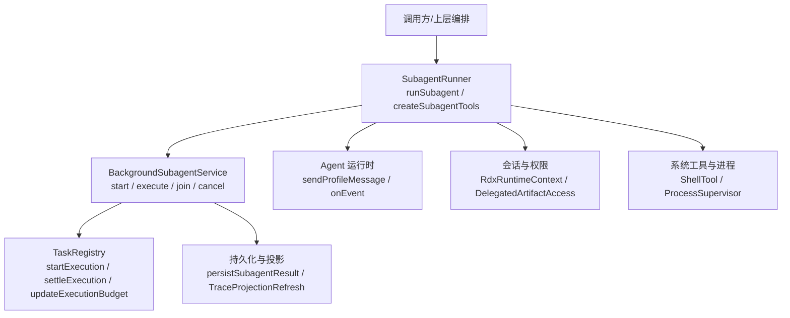
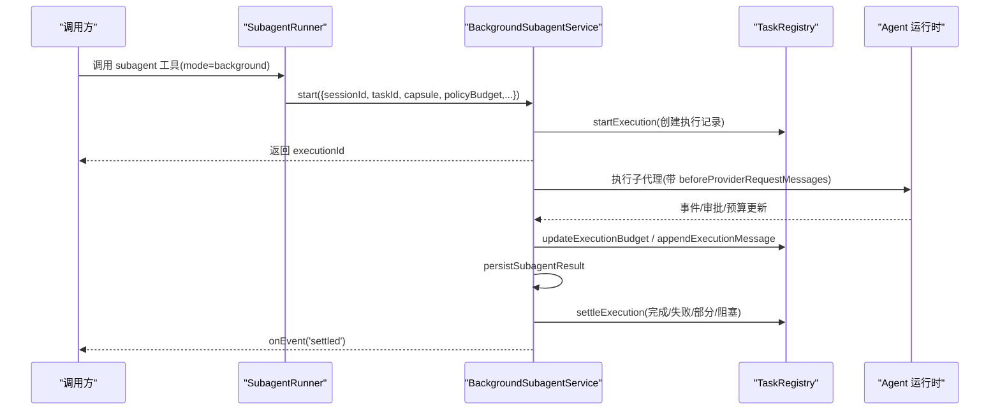
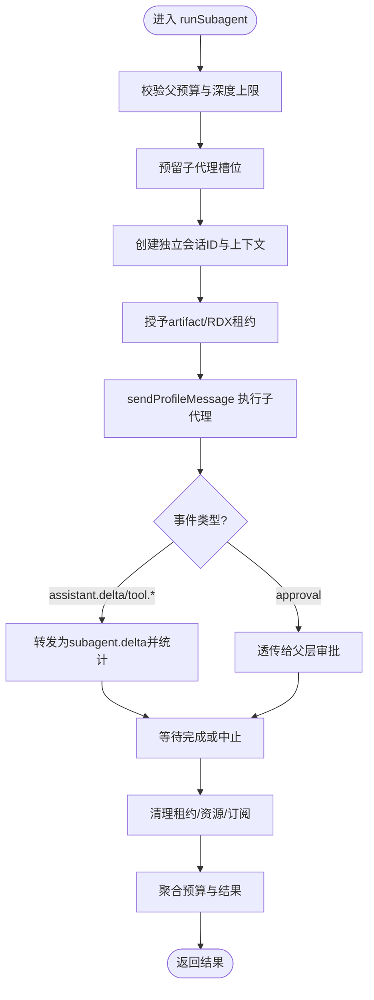
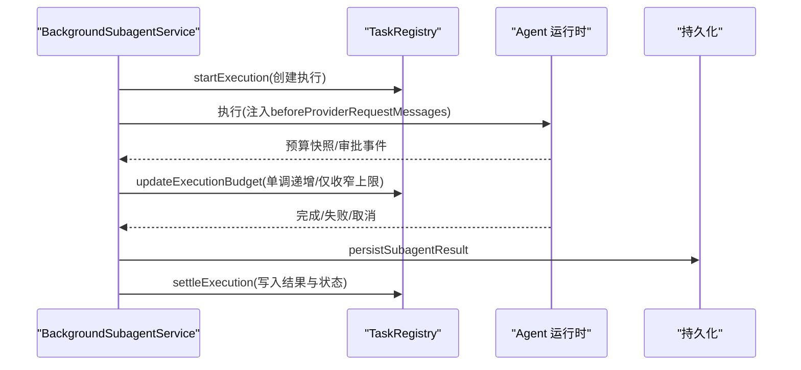
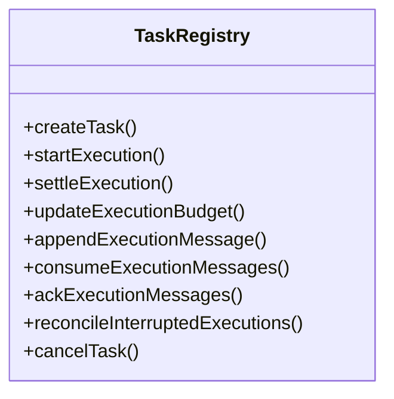
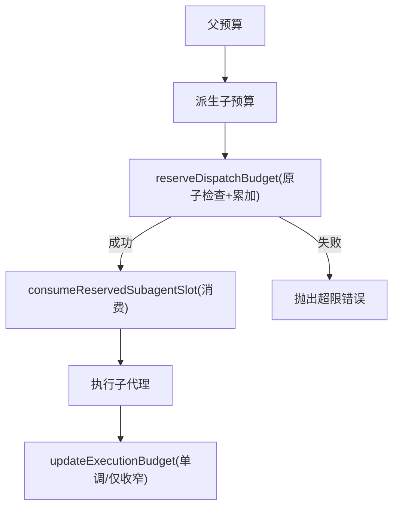
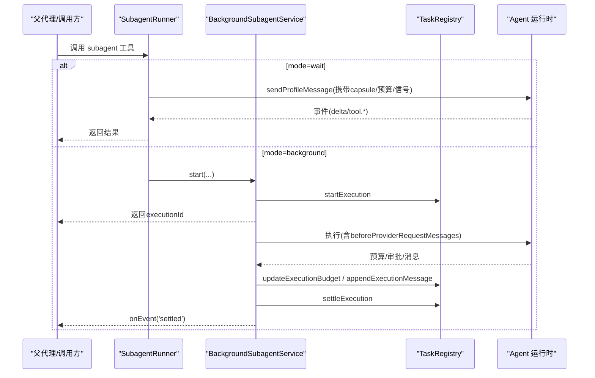
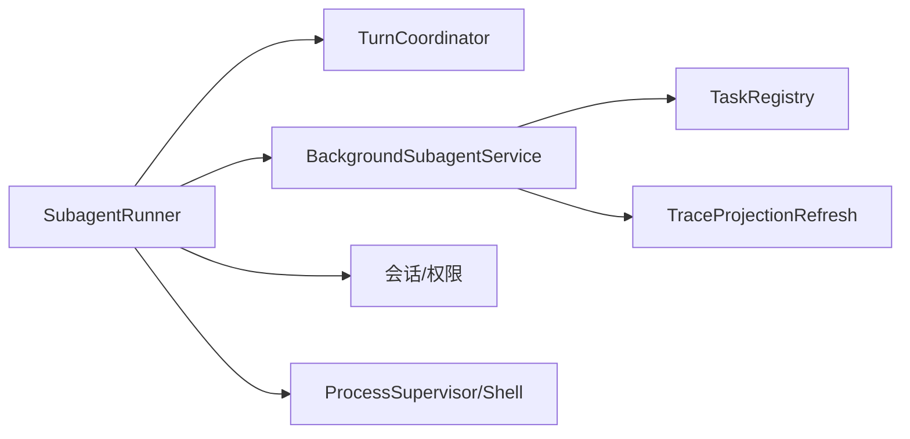

# SubagentRunner 子代理执行器

<cite>
**本文引用的文件**
- [SubagentRunner.ts](file://src/main/workflow/debugger/SubagentRunner.ts)
- [BackgroundSubagentService.ts](file://src/main/workflow/debugger/BackgroundSubagentService.ts)
- [TaskRegistry.ts](file://src/main/agent-runtime/tasks/TaskRegistry.ts)
- [TurnCoordinator.ts](file://src/main/workflow/debugger/TurnCoordinator.ts)
- [DelegationBudget.test.ts](file://src/main/workflow/debugger/DelegationBudget.test.ts)
- [BackgroundApprovalAcceptance.test.ts](file://src/main/workflow/debugger/BackgroundApprovalAcceptance.test.ts)
- [BackgroundSubagentAcceptance.test.ts](file://src/main/workflow/debugger/BackgroundSubagentAcceptance.test.ts)
- [ShellTool.ts](file://src/main/agent-runtime/tools/primitives/ShellTool.ts)
- [ToolResourceArbiter.ts](file://src/main/workflow/debugger/ToolResourceArbiter.ts)
</cite>

## 目录
1. [简介](#简介)
2. [项目结构](#项目结构)
3. [核心组件](#核心组件)
4. [架构总览](#架构总览)
5. [详细组件分析](#详细组件分析)
6. [依赖关系分析](#依赖关系分析)
7. [性能与并发控制](#性能与并发控制)
8. [故障排查指南](#故障排查指南)
9. [结论](#结论)
10. [附录](#附录)

## 简介
本文件围绕 SubagentRunner 子代理执行器，系统性解析其创建、调度与管理机制，覆盖并行执行模型、资源隔离策略、结果聚合算法、后台子代理服务（异步任务调度、生命周期管理、错误恢复）、工具创建与父代理通信、上下文传递等关键技术点。文档同时给出主代理与子代理交互的完整时序图，并总结并发控制、内存限制与性能优化方案。

## 项目结构
- SubagentRunner：负责子代理实例的创建、预算校验、事件透传、会话隔离、工具封装与同步/后台模式切换。
- BackgroundSubagentService：提供后台执行能力，维护 TaskRegistry、消息通道、持久化结果、取消与加入、以及请求前消息合并。
- TaskRegistry：任务与执行的持久化注册表，负责状态机、预算继承与校验、消息队列、撤销/恢复、根预算绑定。
- TurnCoordinator：定义轮次级预算与子代理预算、预留槽位、消费与观察机制。
- 其他支撑：Shell 工具进程隔离与输出限流、资源仲裁器用于并发访问控制。

图表来源
- [SubagentRunner.ts:80-429](file://src/main/workflow/debugger/SubagentRunner.ts#L80-L429)
- [BackgroundSubagentService.ts:65-281](file://src/main/workflow/debugger/BackgroundSubagentService.ts#L65-L281)
- [TaskRegistry.ts:99-196](file://src/main/agent-runtime/tasks/TaskRegistry.ts#L99-L196)
- [ShellTool.ts:112-213](file://src/main/agent-runtime/tools/primitives/ShellTool.ts#L112-L213)

章节来源
- [SubagentRunner.ts:1-680](file://src/main/workflow/debugger/SubagentRunner.ts#L1-L680)
- [BackgroundSubagentService.ts:1-427](file://src/main/workflow/debugger/BackgroundSubagentService.ts#L1-L427)
- [TaskRegistry.ts:1-408](file://src/main/agent-runtime/tasks/TaskRegistry.ts#L1-L408)

## 核心组件
- SubagentRunner
  - runSubagent：构建子代理上下文、预算派生、会话隔离、事件转发、超时与中止传播、结果持久化与聚合。
  - createSubagentTools：暴露 subagent 工具，支持 wait/background 两种模式；在 background 模式下委托给 BackgroundSubagentService。
- BackgroundSubagentService
  - start：创建执行记录、绑定根预算、启动执行、注册取消所有者、发送开始消息、触发 onEvent('started')。
  - execute：注入 beforeProviderRequestMessages 以合并子执行消息与父消息；监听预算变化并落库；处理审批事件；持久化结果并 settle。
  - 工具集：background_query/wait/result/message/join/cancel，提供对后台执行的可观测与控制能力。
- TaskRegistry
  - 任务/执行状态机：startExecution/settleExecution/updateExecutionStatus/updateExecutionBudget。
  - 预算继承与校验：inheritBudget/validateBudget/validateRootBudget。
  - 消息通道：append/consume/ack，保证方向性与单调性。
  - 中断恢复：reconcileInterruptedExecutions 将非当前进程的执行标记为 interrupted/blocked。
- TurnCoordinator
  - PolicyBudgetState/SubagentBudgetState：父子共享预算链、预留槽位、消费与观察。
  - reserveDispatchBudget/consumeReservedSubagentSlot：原子预留与消费，避免重复计费。

章节来源
- [SubagentRunner.ts:80-429](file://src/main/workflow/debugger/SubagentRunner.ts#L80-L429)
- [BackgroundSubagentService.ts:65-281](file://src/main/workflow/debugger/BackgroundSubagentService.ts#L65-L281)
- [TaskRegistry.ts:99-196](file://src/main/agent-runtime/tasks/TaskRegistry.ts#L99-L196)
- [TurnCoordinator.ts:65-191](file://src/main/workflow/debugger/TurnCoordinator.ts#L65-L191)

## 架构总览
子代理执行分为两条路径：
- 同步等待模式（mode=wait）：SubagentRunner.runSubagent 直接调用 sendProfileMessage，阻塞等待结果，期间持续转发事件、统计工具调用、维护预算与上下文。
- 后台模式（mode=background）：SubagentRunner 调用 BackgroundSubagentService.start，立即返回 executionId；后台服务在独立生命周期中运行，通过 TaskRegistry 持久化进度与结果，并提供查询/等待/取消等工具。

图表来源
- [SubagentRunner.ts:431-679](file://src/main/workflow/debugger/SubagentRunner.ts#L431-L679)
- [BackgroundSubagentService.ts:65-281](file://src/main/workflow/debugger/BackgroundSubagentService.ts#L65-L281)
- [TaskRegistry.ts:99-196](file://src/main/agent-runtime/tasks/TaskRegistry.ts#L99-L196)

## 详细组件分析

### SubagentRunner：子代理创建、调度与结果聚合
- 预算与深度控制
  - 校验父预算允许子代理创建，计算 childPolicyBudget，设置 wallTime 截止定时器，防止超时报错。
  - 使用 reserveDispatchBudget 预留子代理槽位，consumeReservedSubagentSlot 实际消费，避免重复计费。
- 会话与上下文隔离
  - 生成独立 subagentSessionId，避免污染父会话消息与上下文。
  - 根据 DelegationCapsule 授予 artifact 访问与 RDX 租约，确保能力不越权。
- 事件透传与统计
  - 将 assistant.delta、tool.started/completed/denied 等事件转换为 subagent.delta 上报父层，并去重统计 toolCallId，累计到 parentBudget.aggregateToolCalls。
- 结果聚合与持久化
  - 同步模式：直接 await 子代理结果，清理资源后返回。
  - 后台模式：由 BackgroundSubagentService 持久化结果，并通过 normalize/project 统一 envelope。
- 工具封装
  - createSubagentTools 暴露 subagent 工具，参数包含 DelegationCapsule JSON Schema 扩展（taskId、parentExecutionId、mode）。
  - 授权检查：基于 turn.runtimePlan.profileDelegates 限制可委派的目标 profile。

图表来源
- [SubagentRunner.ts:80-429](file://src/main/workflow/debugger/SubagentRunner.ts#L80-L429)

章节来源
- [SubagentRunner.ts:80-429](file://src/main/workflow/debugger/SubagentRunner.ts#L80-L429)
- [SubagentRunner.ts:431-679](file://src/main/workflow/debugger/SubagentRunner.ts#L431-L679)

### BackgroundSubagentService：后台执行、消息通道与恢复
- 启动流程
  - 查找根任务与子树，确定 rootBudgetId，必要时绑定新根预算。
  - 创建执行记录，注册取消所有者，发送开始消息，触发 onEvent('started')。
- 执行与消息合并
  - beforeProviderRequestMessages：从 TaskRegistry 读取 to_child 消息与子执行 to_parent 消息，按字符与条数限制打包，提交时 ack。
  - 审批事件：waiting/running 状态切换，确保 UI 与投影刷新。
- 预算与结果
  - 监听 policyBudget 变化，周期性 updateExecutionBudget。
  - 持久化结果，normalize 为 envelope，settleExecution 写入最终状态。
- 工具集
  - background_query/wait/result/message/join/cancel，提供只读/编排两类能力，支持安全边界与范围校验。

图表来源
- [BackgroundSubagentService.ts:65-281](file://src/main/workflow/debugger/BackgroundSubagentService.ts#L65-L281)
- [TaskRegistry.ts:154-196](file://src/main/agent-runtime/tasks/TaskRegistry.ts#L154-L196)

章节来源
- [BackgroundSubagentService.ts:65-281](file://src/main/workflow/debugger/BackgroundSubagentService.ts#L65-L281)
- [BackgroundSubagentService.ts:370-405](file://src/main/workflow/debugger/BackgroundSubagentService.ts#L370-L405)

### TaskRegistry：任务执行状态机与预算治理
- 关键操作
  - startExecution：校验依赖、祖先状态、根预算可用性，继承预算并创建执行记录。
  - settleExecution：校验结果契约（outputs/disposition），写入任务与执行状态。
  - updateExecutionBudget：计数器单调递增，上限仅可收窄，防篡改。
  - 消息通道：append/consume/ack，保证方向与序列单调。
  - 中断恢复：reconcileInterruptedExecutions 将非当前进程的执行置为 interrupted/blocked。
- 预算继承
  - inheritBudget：取最小上限、最大计数，合并 startedAt 与 deadlineAt。

图表来源
- [TaskRegistry.ts:99-196](file://src/main/agent-runtime/tasks/TaskRegistry.ts#L99-L196)
- [TaskRegistry.ts:197-283](file://src/main/agent-runtime/tasks/TaskRegistry.ts#L197-L283)
- [TaskRegistry.ts:364-408](file://src/main/agent-runtime/tasks/TaskRegistry.ts#L364-L408)

章节来源
- [TaskRegistry.ts:99-196](file://src/main/agent-runtime/tasks/TaskRegistry.ts#L99-L196)
- [TaskRegistry.ts:197-283](file://src/main/agent-runtime/tasks/TaskRegistry.ts#L197-L283)
- [TaskRegistry.ts:364-408](file://src/main/agent-runtime/tasks/TaskRegistry.ts#L364-L408)

### 预算与并发控制：TurnCoordinator 与 DelegationBudget
- 父子预算链：policyBudgetChain 串联父子预算，reserveDispatchBudget 先检查所有上限再批量累加，避免中间态不一致。
- 预留与消费：SubagentRunner 预留子代理槽位，随后 consumeReservedSubagentSlot 消费，避免重复计费。
- 子代理预算：SubagentBudgetState 限制深度、子代理数量、聚合工具调用与聚合时长，防止无限递归与资源耗尽。

图表来源
- [TurnCoordinator.ts:84-134](file://src/main/workflow/debugger/TurnCoordinator.ts#L84-L134)
- [DelegationBudget.test.ts:1-23](file://src/main/workflow/debugger/DelegationBudget.test.ts#L1-L23)

章节来源
- [TurnCoordinator.ts:84-134](file://src/main/workflow/debugger/TurnCoordinator.ts#L84-L134)
- [DelegationBudget.test.ts:1-23](file://src/main/workflow/debugger/DelegationBudget.test.ts#L1-L23)

### 工具创建、父代理通信与上下文传递
- 工具创建：SubagentRunner.createSubagentTools 暴露 subagent 工具；BackgroundSubagentService.createTools 暴露后台任务工具。
- 父代理通信：通过 parentOnEvent 透传审批、工具事件、delta 文本；后台模式通过 TaskRegistry 的消息通道实现双向通信。
- 上下文传递：DelegationCapsule 编译为额外提示段；RDX 租约与 artifact 访问在子会话中生效；会话 ID 分段隔离消息与上下文。

章节来源
- [SubagentRunner.ts:431-679](file://src/main/workflow/debugger/SubagentRunner.ts#L431-L679)
- [BackgroundSubagentService.ts:370-405](file://src/main/workflow/debugger/BackgroundSubagentService.ts#L370-L405)

### 完整时序图：主代理与子代理交互

图表来源
- [SubagentRunner.ts:80-429](file://src/main/workflow/debugger/SubagentRunner.ts#L80-L429)
- [BackgroundSubagentService.ts:65-281](file://src/main/workflow/debugger/BackgroundSubagentService.ts#L65-L281)
- [TaskRegistry.ts:99-196](file://src/main/agent-runtime/tasks/TaskRegistry.ts#L99-L196)

## 依赖关系分析
- SubagentRunner 依赖：
  - TurnCoordinator：预算与槽位管理。
  - BackgroundSubagentService：后台执行入口。
  - TaskRegistry：任务/执行/消息/预算持久化。
  - 会话与权限：RdxRuntimeContextRegistry、DelegatedArtifactAccess。
  - 系统工具：ShellInvocationService、ProcessSupervisor。
- BackgroundSubagentService 依赖：
  - TaskRegistry：执行状态机与消息通道。
  - 持久化：persistSubagentResult。
  - 投影刷新：TraceProjectionRefreshService。
- Shell 工具与资源仲裁：
  - ShellTool：进程隔离、输出限流、超时与中止。
  - ToolResourceArbiter：读写锁与隔离，防止并发冲突。

图表来源
- [SubagentRunner.ts:1-680](file://src/main/workflow/debugger/SubagentRunner.ts#L1-L680)
- [BackgroundSubagentService.ts:1-427](file://src/main/workflow/debugger/BackgroundSubagentService.ts#L1-L427)
- [TaskRegistry.ts:1-408](file://src/main/agent-runtime/tasks/TaskRegistry.ts#L1-L408)
- [ShellTool.ts:112-213](file://src/main/agent-runtime/tools/primitives/ShellTool.ts#L112-L213)
- [ToolResourceArbiter.ts:28-50](file://src/main/workflow/debugger/ToolResourceArbiter.ts#L28-L50)

章节来源
- [SubagentRunner.ts:1-680](file://src/main/workflow/debugger/SubagentRunner.ts#L1-L680)
- [BackgroundSubagentService.ts:1-427](file://src/main/workflow/debugger/BackgroundSubagentService.ts#L1-L427)
- [TaskRegistry.ts:1-408](file://src/main/agent-runtime/tasks/TaskRegistry.ts#L1-L408)
- [ShellTool.ts:112-213](file://src/main/agent-runtime/tools/primitives/ShellTool.ts#L112-L213)
- [ToolResourceArbiter.ts:28-50](file://src/main/workflow/debugger/ToolResourceArbiter.ts#L28-L50)

## 性能与并发控制
- 并发模型
  - 子代理可并发创建，但域租约与工具副作用由下游资源锁与领域准入控制保证互斥。
  - 后台执行通过 TaskRegistry 串行化状态变更，避免竞态。
- 内存与输出限制
  - Shell 工具输出环形缓冲与字节上限，防止大输出导致内存膨胀。
  - 消息通道限制条数与字符数，避免单次合并过大。
- 预算与时间控制
  - 子代理 wallTime 截止定时器，超出即中止。
  - 预算链原子预留与消费，避免重复计费；子代理预算限制深度、子代理数、聚合工具调用与聚合时长。
- 资源仲裁
  - ToolResourceArbiter 提供读写锁与隔离，确保写操作独占、读操作共享，并在资源释放后自动排水。

章节来源
- [ShellTool.ts:112-213](file://src/main/agent-runtime/tools/primitives/ShellTool.ts#L112-L213)
- [BackgroundSubagentService.ts:159-212](file://src/main/workflow/debugger/BackgroundSubagentService.ts#L159-L212)
- [TurnCoordinator.ts:84-134](file://src/main/workflow/debugger/TurnCoordinator.ts#L84-L134)
- [ToolResourceArbiter.ts:28-50](file://src/main/workflow/debugger/ToolResourceArbiter.ts#L28-L50)

## 故障排查指南
- 常见错误与定位
  - 预算超限：POLICY_LIMIT_EXCEEDED/SUBAGENT_BUDGET 相关错误，检查 maxToolCalls/maxSubagents/maxChildDepth/maxWallTimeMs。
  - 会话缺失：ARTIFACT_SESSION_DENIED/RDX_LEASE_DELEGATE_DENIED，确认存在父会话且具备相应能力。
  - 任务范围拒绝：TASK_SCOPE_DENIED，核对 delegated scope 与目标 task 是否在子树内。
  - 后台执行未找到：BACKGROUND_EXECUTION_NOT_FOUND，确认执行归属与任务子树。
- 审批与阻塞
  - approval.requested/answered 事件驱动状态切换，若长时间 waiting，检查审批是否被响应。
- 恢复与重试
  - 重启后中断执行会被标记为 interrupted/blocked，需显式恢复或重新规划。
- 测试用例参考
  - 背景任务审批与结果投影、预算继承与保留等场景可在相关测试文件中验证行为。

章节来源
- [BackgroundApprovalAcceptance.test.ts:12-30](file://src/main/workflow/debugger/BackgroundApprovalAcceptance.test.ts#L12-L30)
- [BackgroundApprovalAcceptance.test.ts:44-92](file://src/main/workflow/debugger/BackgroundApprovalAcceptance.test.ts#L44-L92)
- [BackgroundSubagentAcceptance.test.ts:84-95](file://src/main/workflow/debugger/BackgroundSubagentAcceptance.test.ts#L84-L95)

## 结论
SubagentRunner 提供了强大的子代理执行能力：通过预算链与槽位预留实现安全的并发控制；通过会话隔离与上下文传递保障权限与数据边界；通过 TaskRegistry 与消息通道实现后台任务的持久化与可观测；结合 Shell 工具与资源仲裁器，确保系统稳定性与性能。整体设计兼顾了可扩展性、可恢复性与可审计性，适合复杂多代理协作场景。

## 附录
- 术语
  - 子代理：由父代理创建的隔离执行单元，拥有独立会话与预算。
  - 后台执行：不阻塞父调用的子代理执行，通过 executionId 进行查询与等待。
  - 预算链：父子共享的预算状态集合，用于全局限额与局部约束。
- 最佳实践
  - 明确设置子代理预算与截止时间，避免资源泄漏。
  - 使用 background 模式执行长耗时任务，并通过工具集监控与取消。
  - 谨慎授予 artifact 与 RDX 租约，遵循最小权限原则。