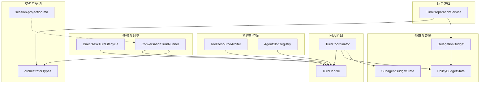
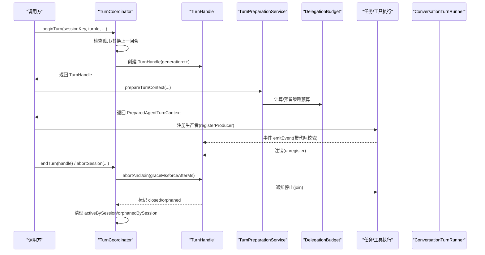
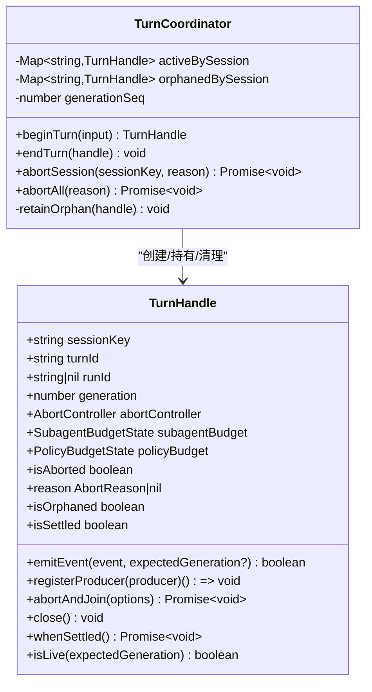
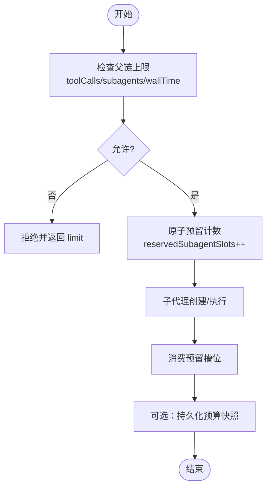
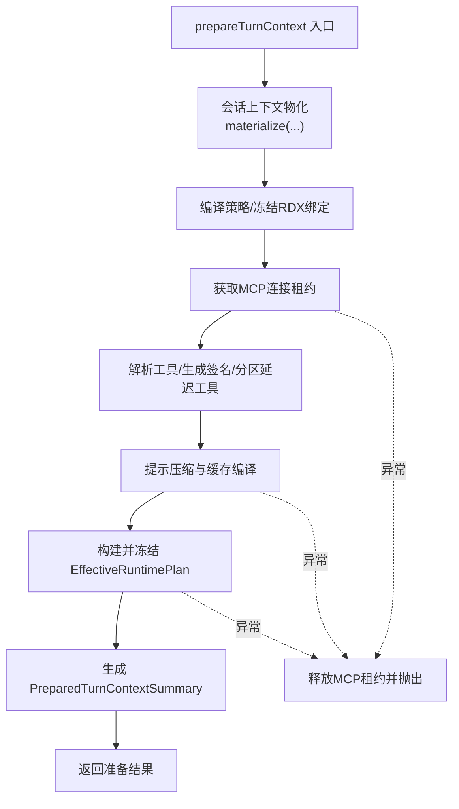
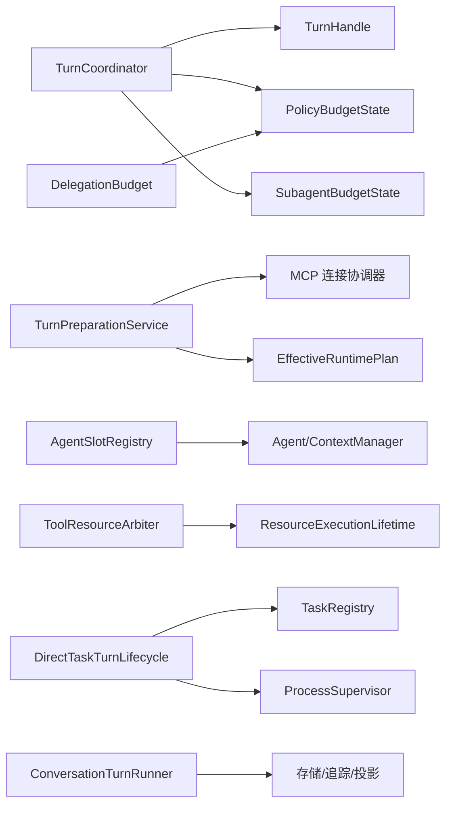
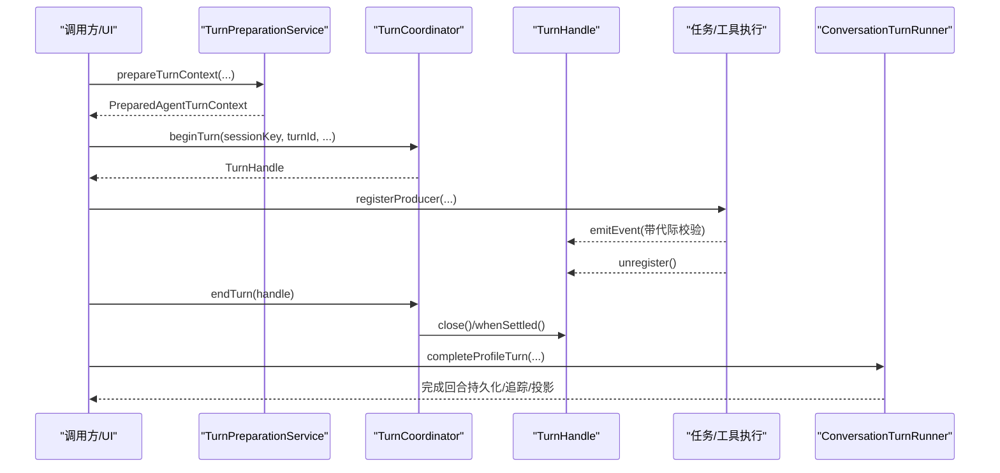

# TurnCoordinator 回合协调器

<cite>
**本文引用的文件**
- [TurnCoordinator.ts](file://src/main/workflow/debugger/TurnCoordinator.ts)
- [DelegationBudget.ts](file://src/main/workflow/debugger/DelegationBudget.ts)
- [TurnPreparationService.ts](file://src/main/workflow/debugger/TurnPreparationService.ts)
- [AgentSlotRegistry.ts](file://src/main/workflow/debugger/AgentSlotRegistry.ts)
- [ToolResourceArbiter.ts](file://src/main/workflow/debugger/ToolResourceArbiter.ts)
- [DirectTaskTurnLifecycle.ts](file://src/main/workflow/debugger/DirectTaskTurnLifecycle.ts)
- [ConversationTurnRunner.ts](file://src/main/conversation/ConversationTurnRunner.ts)
- [orchestratorTypes.ts](file://src/main/workflow/debugger/orchestratorTypes.ts)
- [session-projection.md](file://docs/contracts/session-projection.md)
</cite>

## 目录
1. [简介](#简介)
2. [项目结构](#项目结构)
3. [核心组件](#核心组件)
4. [架构总览](#架构总览)
5. [详细组件分析](#详细组件分析)
6. [依赖关系分析](#依赖关系分析)
7. [性能与内存管理](#性能与内存管理)
8. [故障排查指南](#故障排查指南)
9. [结论](#结论)
10. [附录](#附录)

## 简介
本文件围绕 TurnCoordinator 回合协调器，系统化阐述回合制执行模型的设计理念与实现细节。重点覆盖：
- 回合生命周期管理：开始、中止、收尾、孤儿处理与代际（generation）保护
- 并发控制：会话级活跃回合互斥、生产者注册/注销、优雅退出与强制回收
- 资源隔离：MCP 连接租约、工具作用域、策略预算链、子代理预算
- 回合准备服务：上下文构建、工具签名生成、运行时环境初始化、提示词压缩与缓存
- 活跃回合跟踪、会话键映射、临时作用域管理
- 完整流程图：从回合准备到结束的各阶段
- 并发安全保证、内存管理与性能监控的实现要点

## 项目结构
围绕 TurnCoordinator 的关键代码分布在主进程工作流调试器模块中，并与会话、设置、工具、任务调度等子系统协作：
- 回合协调与句柄：TurnCoordinator、TurnHandle
- 预算与委派：PolicyBudgetState、SubagentBudgetState、DelegationBudget
- 回合准备：TurnPreparationService（上下文物化、工具签名、运行时计划冻结）
- 执行期资源仲裁：ToolResourceArbiter（读共享/写独占）、AgentSlotRegistry（Agent 槽位与状态）
- 任务生命周期：DirectTaskTurnLifecycle（任务执行收尾、交接确认）
- 对话运行宿主：ConversationTurnRunner（完成回合、事件发布、持久化）
- 类型契约：orchestratorTypes（执行期上下文、摘要等）
- 会话投影契约：session-projection.md（多会话并行、Active Session 门控）

图表来源
- [TurnCoordinator.ts:205-605](file://src/main/workflow/debugger/TurnCoordinator.ts#L205-L605)
- [DelegationBudget.ts:1-59](file://src/main/workflow/debugger/DelegationBudget.ts#L1-L59)
- [TurnPreparationService.ts:110-434](file://src/main/workflow/debugger/TurnPreparationService.ts#L110-L434)
- [AgentSlotRegistry.ts:1-222](file://src/main/workflow/debugger/AgentSlotRegistry.ts#L1-L222)
- [ToolResourceArbiter.ts:1-50](file://src/main/workflow/debugger/ToolResourceArbiter.ts#L1-L50)
- [DirectTaskTurnLifecycle.ts:75-123](file://src/main/workflow/debugger/DirectTaskTurnLifecycle.ts#L75-L123)
- [ConversationTurnRunner.ts:124-144](file://src/main/conversation/ConversationTurnRunner.ts#L124-L144)
- [orchestratorTypes.ts:148-171](file://src/main/workflow/debugger/orchestratorTypes.ts#L148-L171)
- [session-projection.md:1-23](file://docs/contracts/session-projection.md#L1-L23)

章节来源
- [TurnCoordinator.ts:1-605](file://src/main/workflow/debugger/TurnCoordinator.ts#L1-L605)
- [TurnPreparationService.ts:1-434](file://src/main/workflow/debugger/TurnPreparationService.ts#L1-L434)
- [AgentSlotRegistry.ts:1-222](file://src/main/workflow/debugger/AgentSlotRegistry.ts#L1-L222)
- [ToolResourceArbiter.ts:1-50](file://src/main/workflow/debugger/ToolResourceArbiter.ts#L1-L50)
- [DirectTaskTurnLifecycle.ts:75-123](file://src/main/workflow/debugger/DirectTaskTurnLifecycle.ts#L75-L123)
- [ConversationTurnRunner.ts:124-144](file://src/main/conversation/ConversationTurnRunner.ts#L124-L144)
- [orchestratorTypes.ts:148-171](file://src/main/workflow/debugger/orchestratorTypes.ts#L148-L171)
- [session-projection.md:1-23](file://docs/contracts/session-projection.md#L1-L23)

## 核心组件
- TurnCoordinator：按会话维护活跃回合句柄，负责 begin/end/abort/abortAll，并处理孤儿回合的保留与清理。
- TurnHandle：封装单个回合的生命周期，包含 AbortController、生产者集合、wall-clock 超时、代际令牌、策略/子代理预算、事件发射门控。
- PolicyBudgetState/SubagentBudgetState：回合级与子代理级预算（工具调用、子代理数、深度、墙钟时间），支持父子链式继承与预留槽位。
- DelegationBudget：派生子代理预算链、原子预留与消费、可观察持久化。
- TurnPreparationService：回合准备服务，负责上下文物化、工具签名、运行时计划冻结、提示压缩、缓存编译与度量统计。
- AgentSlotRegistry：Agent 槽位与状态注册表，提供 rehydrate/flush、会话同步清理、隔离执行缓存。
- ToolResourceArbiter：基于项目/会话作用域的读写仲裁器，确保不安全工具效果串行化。
- DirectTaskTurnLifecycle：任务执行收尾、交接绑定确认、进程加入与未确认进程检测。
- ConversationTurnRunner：完成回合的主流程入口之一，负责会话更新、追踪与会话投影。

章节来源
- [TurnCoordinator.ts:18-605](file://src/main/workflow/debugger/TurnCoordinator.ts#L18-L605)
- [DelegationBudget.ts:1-59](file://src/main/workflow/debugger/DelegationBudget.ts#L1-L59)
- [TurnPreparationService.ts:93-434](file://src/main/workflow/debugger/TurnPreparationService.ts#L93-L434)
- [AgentSlotRegistry.ts:1-222](file://src/main/workflow/debugger/AgentSlotRegistry.ts#L1-L222)
- [ToolResourceArbiter.ts:1-50](file://src/main/workflow/debugger/ToolResourceArbiter.ts#L1-L50)
- [DirectTaskTurnLifecycle.ts:75-123](file://src/main/workflow/debugger/DirectTaskTurnLifecycle.ts#L75-L123)
- [ConversationTurnRunner.ts:124-144](file://src/main/conversation/ConversationTurnRunner.ts#L124-L144)

## 架构总览
TurnCoordinator 作为会话级“回合锁”，将每个会话的活跃回合抽象为 TurnHandle；通过 generation 令牌防止旧轮次写入污染新轮次；通过生产者注册/注销机制统一管控异步任务生命周期；结合策略预算与子代理预算限制资源消耗；配合回合准备服务在请求进入前冻结运行时计划与工具集，确保执行期一致性。

图表来源
- [TurnCoordinator.ts:507-605](file://src/main/workflow/debugger/TurnCoordinator.ts#L507-L605)
- [TurnCoordinator.ts:205-491](file://src/main/workflow/debugger/TurnCoordinator.ts#L205-L491)
- [TurnPreparationService.ts:113-434](file://src/main/workflow/debugger/TurnPreparationService.ts#L113-L434)
- [DelegationBudget.ts:1-59](file://src/main/workflow/debugger/DelegationBudget.ts#L1-L59)
- [ConversationTurnRunner.ts:124-144](file://src/main/conversation/ConversationTurnRunner.ts#L124-L144)

## 详细组件分析

### TurnCoordinator 与 TurnHandle
- 会话级活跃回合管理：activeBySession 保存当前回合句柄；orphanedBySession 保留尚未完全退出的孤儿句柄，直到所有生产者 settle。
- 代际保护：generationSeq 递增，TurnHandle.isLive(expectedGeneration) 用于丢弃过期写入；emitEvent 也受代际与关闭状态保护。
- 生产者管理：registerProducer 返回注销函数；abortAndJoin 先优雅等待 graceMs，再强制 forceAfterMs，若仍有未退出则标记 orphaned 并在后台继续 join。
- 超时控制：构造时根据 maxWallTimeMs 设置 wallTimer，超时会触发 abortAndJoin(reason='timeout')。
- 会话中止：abortSession/abortAll 会批量中止并保留孤儿直至 settle。

图表来源
- [TurnCoordinator.ts:205-605](file://src/main/workflow/debugger/TurnCoordinator.ts#L205-L605)

章节来源
- [TurnCoordinator.ts:18-605](file://src/main/workflow/debugger/TurnCoordinator.ts#L18-L605)

### 预算与委派（PolicyBudgetState、SubagentBudgetState、DelegationBudget）
- 回合级预算：记录 toolCalls、subagents、childDepth、wallStartedAt、max* 上限；reserveDispatchBudget 在链上原子检查并预留；consumeReservedSubagentSlot 消费预留。
- 子代理预算：depth、childrenSpawned、aggregateToolCalls、wallStartedAt、budget；assertSubagentBudgetAllowsChild 在创建子代理前校验。
- 委派预算链：deriveChildPolicyBudget 基于父预算与请求预算派生子预算；policyBudgetChain 遍历父子链；flushPolicyBudgetObservers 持久化快照。

图表来源
- [TurnCoordinator.ts:84-134](file://src/main/workflow/debugger/TurnCoordinator.ts#L84-L134)
- [TurnCoordinator.ts:150-191](file://src/main/workflow/debugger/TurnCoordinator.ts#L150-L191)
- [DelegationBudget.ts:1-59](file://src/main/workflow/debugger/DelegationBudget.ts#L1-L59)

章节来源
- [TurnCoordinator.ts:84-191](file://src/main/workflow/debugger/TurnCoordinator.ts#L84-L191)
- [DelegationBudget.ts:1-59](file://src/main/workflow/debugger/DelegationBudget.ts#L1-L59)

### 回合准备服务（TurnPreparationService）
- 输入参数：requestId、turnId、agentId、内容、路由能力、请求计划、提示计划、有效配置、工具白名单、可见回合 ID、活动分支等。
- 关键步骤：
  - 会话上下文物化：materialize(visibleTurnIds, activeBranchId)，得到消息、选择回合数、重放/过滤制品数量及决策。
  - 策略编译与权限：compileEffectivePolicy，冻结 RDX 绑定，校验技能交集与工具白名单。
  - MCP 连接租约：acquireConnections，失败路径释放租约。
  - 工具解析与签名：resolveRuntimeTools、createToolSignature，分区延迟激活工具，预激活任务工具。
  - 提示压缩与缓存：workerPool 压缩消息，promptCacheCompiler 编译缓存键与断点信息。
  - 运行时计划冻结：buildEffectiveRuntimePlan，注入知识读取根、可见工具名、MCP 描述符哈希、压缩阈值等。
  - 输出摘要：PreparedTurnContextSummary 包含路由、控制、用量、缓存、延续策略等。
- 错误与取消：signal 检查、预算不足、上下文无法容纳用户消息等异常路径。

图表来源
- [TurnPreparationService.ts:113-434](file://src/main/workflow/debugger/TurnPreparationService.ts#L113-L434)

章节来源
- [TurnPreparationService.ts:1-434](file://src/main/workflow/debugger/TurnPreparationService.ts#L1-L434)

### 活跃回合跟踪、会话键映射、临时作用域
- 会话键映射：TurnHandle.sessionKey 唯一标识会话；TurnCoordinator.activeBySession 以 sessionKey 索引活跃句柄；orphanedBySession 保留孤儿句柄直至完全 settle。
- 临时作用域：AgentSlotRegistry 使用 agentSlotKey(sessionOrScopeId, agentId) 区分不同执行范围（含子代理 scope）；rehydrate/flush 在回合边界重置内存消息，避免跨 turn 泄漏。
- 资源隔离：ToolResourceArbiter 基于 projectRoot/session 生成 key，对不安全工具效果进行串行化；readShared 允许多读，writeExclusive 独占写。

章节来源
- [TurnCoordinator.ts:493-605](file://src/main/workflow/debugger/TurnCoordinator.ts#L493-L605)
- [AgentSlotRegistry.ts:42-222](file://src/main/workflow/debugger/AgentSlotRegistry.ts#L42-L222)
- [ToolResourceArbiter.ts:1-50](file://src/main/workflow/debugger/ToolResourceArbiter.ts#L1-L50)

### 任务执行收尾与交接确认（DirectTaskTurnLifecycle）
- 收尾逻辑：根据 turnId 与 generation 查找 direct/handoff 执行，join 进程，必要时结算未完成任务与未归还交接。
- 接收端交接：registerReceivingHandoffTurnOwner 登记接收转交任务的拥有者，监听取消回调并中止对应 turn，确保进程退出确认。

章节来源
- [DirectTaskTurnLifecycle.ts:75-123](file://src/main/workflow/debugger/DirectTaskTurnLifecycle.ts#L75-L123)

### 对话运行宿主（ConversationTurnRunner）
- completeProfileTurn 作为完成回合的宿主方法之一，负责会话 turnControls 更新、追踪会话 ID 推导、中止控制器创建等。
- 与 TurnCoordinator 协作：通过 host.registerActiveTurn/clearActiveTurn 等接口参与活跃回合管理（由上层编排）。

章节来源
- [ConversationTurnRunner.ts:124-144](file://src/main/conversation/ConversationTurnRunner.ts#L124-L144)

## 依赖关系分析
- TurnCoordinator 依赖：
  - TurnHandle：封装单回合生命周期
  - PolicyBudgetState/SubagentBudgetState：预算约束
  - DelegationBudget：父子预算链与预留/消费
- TurnPreparationService 依赖：
  - MCP 连接协调器、工具解析、提示缓存编译器、运行时计划构建器、会话上下文日志
- AgentSlotRegistry：
  - 与 Agent/ContextManager 交互，提供 rehydrate/flush/syncSession
- ToolResourceArbiter：
  - 与 ResourceExecutionLifetime 集成，保障资源生命周期
- DirectTaskTurnLifecycle：
  - 与 TaskRegistry、ProcessSupervisor 协作，确保进程退出确认
- ConversationTurnRunner：
  - 与存储适配器、追踪服务、会话投影系统交互

图表来源
- [TurnCoordinator.ts:205-605](file://src/main/workflow/debugger/TurnCoordinator.ts#L205-L605)
- [TurnPreparationService.ts:113-434](file://src/main/workflow/debugger/TurnPreparationService.ts#L113-L434)
- [AgentSlotRegistry.ts:1-222](file://src/main/workflow/debugger/AgentSlotRegistry.ts#L1-L222)
- [ToolResourceArbiter.ts:1-50](file://src/main/workflow/debugger/ToolResourceArbiter.ts#L1-L50)
- [DirectTaskTurnLifecycle.ts:75-123](file://src/main/workflow/debugger/DirectTaskTurnLifecycle.ts#L75-L123)
- [ConversationTurnRunner.ts:124-144](file://src/main/conversation/ConversationTurnRunner.ts#L124-L144)

## 性能与内存管理
- 并发安全
  - 会话级互斥：同一 sessionKey 仅一个活跃 TurnHandle；beginTurn 会中止并等待上一回合（或孤儿 settle）。
  - 生产者集合：Map 注册/注销，abortAndJoin 内循环追踪并等待所有生产者 settle，避免竞态。
  - 代际令牌：emitEvent/isLive 基于 generation 丢弃过期写入，防止乱序污染。
- 资源隔离
  - MCP 租约：准备阶段获取，异常路径释放；执行期通过 mcpPoolKey 固定池，避免可变项目指针漂移。
  - 工具作用域：ToolResourceArbiter 对不安全效果串行化，读共享/写独占，避免并发副作用。
  - 策略预算链：父子预算链限制工具调用、子代理数、深度与墙钟时间，防止资源滥用。
- 内存管理
  - AgentSlotRegistry：回合边界 rehydrate/flush，避免内存中的历史累积；会话切换时清空 slot 与状态。
  - TurnHandle：wallTimer 与 AbortController 及时释放；orphaned 句柄后台 join 后清理 producers。
- 性能监控
  - 准备阶段产出 PreparedTurnContextSummary，包含 token 用量、压缩状态、缓存命中、延续策略等。
  - 对话运行宿主与 LLM 服务聚合 usage 并广播至 UI（见 DebuggerLlmService 的使用量记录与广播）。

章节来源
- [TurnCoordinator.ts:205-605](file://src/main/workflow/debugger/TurnCoordinator.ts#L205-L605)
- [TurnPreparationService.ts:236-434](file://src/main/workflow/debugger/TurnPreparationService.ts#L236-L434)
- [AgentSlotRegistry.ts:182-222](file://src/main/workflow/debugger/AgentSlotRegistry.ts#L182-L222)
- [ToolResourceArbiter.ts:1-50](file://src/main/workflow/debugger/ToolResourceArbiter.ts#L1-L50)
- [DelegationBudget.ts:1-59](file://src/main/workflow/debugger/DelegationBudget.ts#L1-L59)

## 故障排查指南
- 常见错误与定位
  - TURN_ORPHANED：上一回合未能及时 settle，阻塞新回合；检查生产者是否正确注销与 join。
  - POLICY_MAX_WALL_TIME_ZERO：策略配置非法，需大于零。
  - SUBAGENT_BUDGET：子代理深度/数量/工具调用/墙钟超限；调整预算或优化子任务粒度。
  - PROMPT_OVERHEAD_EXCEEDS_BUDGET：系统提示、技能与工具模式超出预算；减少工具定义或压缩上下文。
  - CONTEXT_CANNOT_FIT：准备后未保留当前用户消息；检查压缩逻辑与消息拼接。
  - TASK_CANCELLATION_UNCONFIRMED：接收端交接任务未停止或进程未退出；检查 abortAndJoin 与进程加入逻辑。
- 排查步骤建议
  - 查看 TurnHandle 的 isAborted/isOrphaned/reason，确认中止原因与孤儿状态。
  - 检查策略预算链与子代理预算，确认预留与消费是否匹配。
  - 审查 MCP 租约获取与释放路径，确保异常时释放。
  - 核对 AgentSlotRegistry 的 rehydrate/flush 是否在回合边界调用。
  - 关注会话投影门控，确保事件只进入 Active Session。

章节来源
- [TurnCoordinator.ts:78-134](file://src/main/workflow/debugger/TurnCoordinator.ts#L78-L134)
- [TurnCoordinator.ts:507-605](file://src/main/workflow/debugger/TurnCoordinator.ts#L507-L605)
- [TurnPreparationService.ts:229-310](file://src/main/workflow/debugger/TurnPreparationService.ts#L229-L310)
- [DirectTaskTurnLifecycle.ts:104-123](file://src/main/workflow/debugger/DirectTaskTurnLifecycle.ts#L104-L123)
- [session-projection.md:1-23](file://docs/contracts/session-projection.md#L1-L23)

## 结论
TurnCoordinator 通过会话级回合句柄、代际令牌、生产者集合与优雅退出机制，构建了稳健的回合制执行模型；配合策略与子代理预算、MCP 租约与工具作用域仲裁，实现了严格的资源隔离与并发安全；TurnPreparationService 在请求进入前冻结运行时计划与工具集，确保执行期一致性与可观测性。整体设计兼顾了可扩展性、可维护性与性能，适用于复杂的多会话、多代理、多工具的协同场景。

## 附录
- 回合执行完整流程（从准备到结束）

图表来源
- [TurnPreparationService.ts:113-434](file://src/main/workflow/debugger/TurnPreparationService.ts#L113-L434)
- [TurnCoordinator.ts:507-605](file://src/main/workflow/debugger/TurnCoordinator.ts#L507-L605)
- [ConversationTurnRunner.ts:124-144](file://src/main/conversation/ConversationTurnRunner.ts#L124-L144)