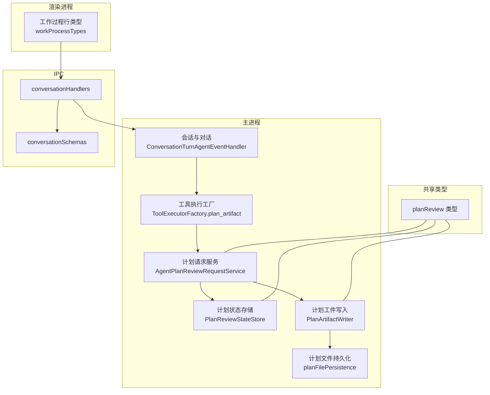
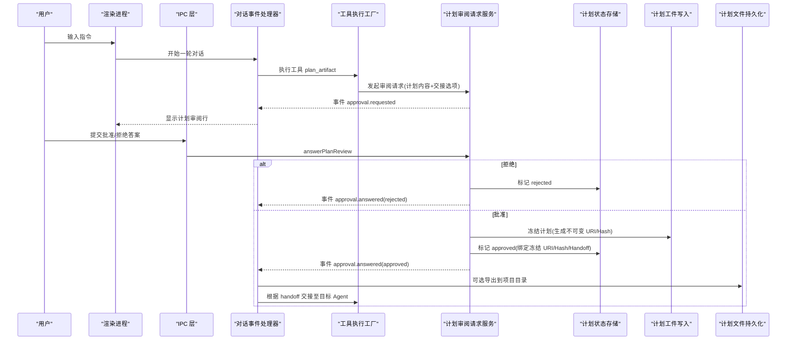
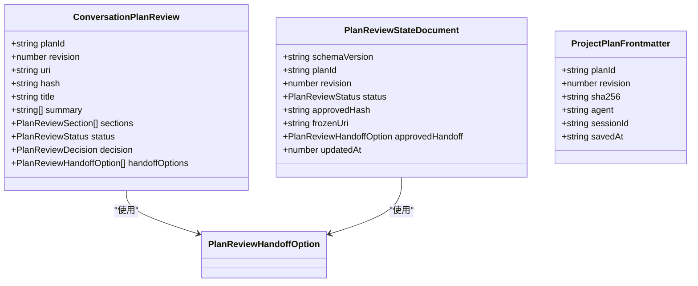
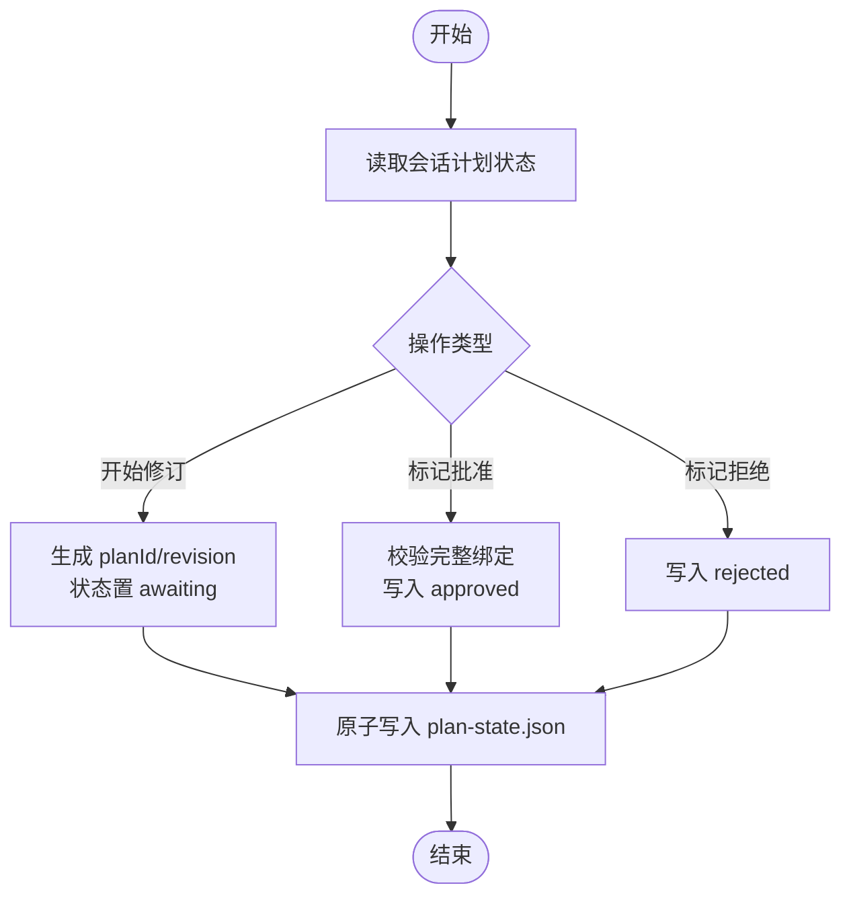
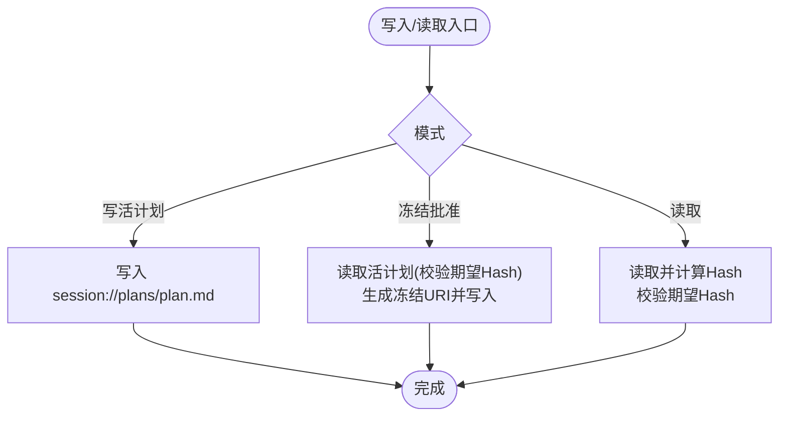
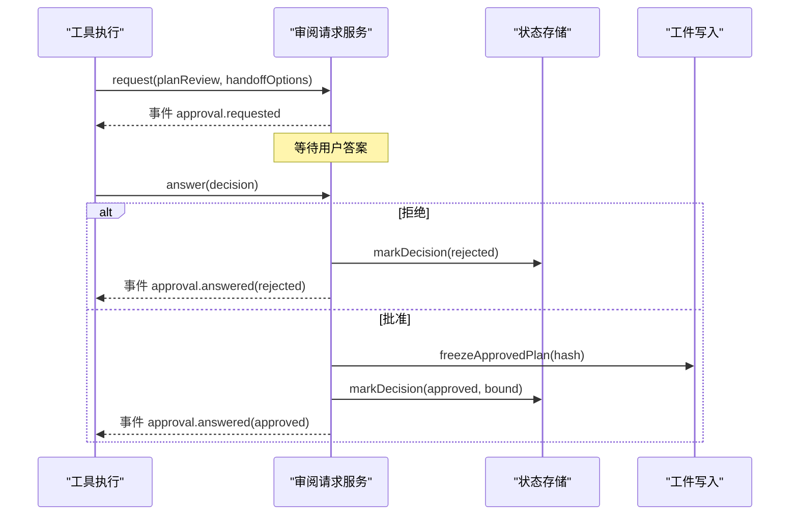
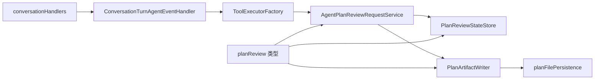

# 计划审查系统

<cite>
**本文引用的文件**
- [README.md](file://README.md)
- [package.json](file://package.json)
- [src/shared/types/planReview.ts](file://src/shared/types/planReview.ts)
- [src/main/sessions/PlanReviewStateStore.ts](file://src/main/sessions/PlanReviewStateStore.ts)
- [src/main/sessions/sessionPlanArtifact.ts](file://src/main/sessions/sessionPlanArtifact.ts)
- [src/main/sessions/planFilePersistence.ts](file://src/main/sessions/planFilePersistence.ts)
- [src/main/agent-runtime/interactions/AgentPlanReviewRequestService.ts](file://src/main/agent-runtime/interactions/AgentPlanReviewRequestService.ts)
- [src/main/workflow/debugger/ToolExecutorFactory.ts](file://src/main/workflow/debugger/ToolExecutorFactory.ts)
- [src/main/conversation/ConversationTurnAgentEventHandler.ts](file://src/main/conversation/ConversationTurnAgentEventHandler.ts)
- [src/main/ipc/conversationHandlers.ts](file://src/main/ipc/conversationHandlers.ts)
- [src/main/ipc/validation/conversationSchemas.ts](file://src/main/ipc/validation/conversationSchemas.ts)
- [src/renderer/features/transcript/workProcessTypes.ts](file://src/renderer/features/transcript/workProcessTypes.ts)
- [resources/agent-runtime/skills/renderdoc-execution/SKILL.md](file://resources/agent-runtime/skills/renderdoc-execution/SKILL.md)
</cite>

## 目录
1. [简介](#简介)
2. [项目结构](#项目结构)
3. [核心组件](#核心组件)
4. [架构总览](#架构总览)
5. [详细组件分析](#详细组件分析)
6. [依赖关系分析](#依赖关系分析)
7. [性能与可靠性](#性能与可靠性)
8. [故障排查指南](#故障排查指南)
9. [结论](#结论)

## 简介
本仓库是一个面向 RenderDoc .rdc 捕获分析的 Electron 桌面应用，提供“通用 Agent 协作入口 + 可审计的图形调试流程”。其中“计划审查系统”是贯穿会话、工具执行、持久化与用户审批的关键环节：Agent 在运行过程中产出“计划”，通过工作流工具触发人类审阅；用户批准或拒绝后，系统将冻结并绑定已批准的计划，再按策略交接给目标 Agent 继续执行。该机制确保关键执行路径具备可追溯、可回滚、可审计的特性。

## 项目结构
- 主进程负责 IPC、会话编排、Provider 与外部能力接入。
- 渲染进程负责界面、交互与状态投影。
- 共享层定义跨层类型与契约。
- 资源目录包含内置 Agent、Skill、Prompt 等。
- 脚本目录提供构建、验证与启动工具。

图表来源
- [src/main/conversation/ConversationTurnAgentEventHandler.ts:453-557](file://src/main/conversation/ConversationTurnAgentEventHandler.ts#L453-L557)
- [src/main/agent-runtime/interactions/AgentPlanReviewRequestService.ts:75-212](file://src/main/agent-runtime/interactions/AgentPlanReviewRequestService.ts#L75-L212)
- [src/main/sessions/PlanReviewStateStore.ts:13-99](file://src/main/sessions/PlanReviewStateStore.ts#L13-L99)
- [src/main/sessions/sessionPlanArtifact.ts:14-65](file://src/main/sessions/sessionPlanArtifact.ts#L14-L65)
- [src/main/sessions/planFilePersistence.ts:8-42](file://src/main/sessions/planFilePersistence.ts#L8-L42)
- [src/main/workflow/debugger/ToolExecutorFactory.ts:427-453](file://src/main/workflow/debugger/ToolExecutorFactory.ts#L427-L453)
- [src/main/ipc/conversationHandlers.ts:174-180](file://src/main/ipc/conversationHandlers.ts#L174-L180)
- [src/main/ipc/validation/conversationSchemas.ts:146-178](file://src/main/ipc/validation/conversationSchemas.ts#L146-L178)
- [src/shared/types/planReview.ts:1-113](file://src/shared/types/planReview.ts#L1-L113)
- [src/renderer/features/transcript/workProcessTypes.ts:195-248](file://src/renderer/features/transcript/workProcessTypes.ts#L195-L248)

章节来源
- [README.md:1-90](file://README.md#L1-L90)
- [package.json:1-137](file://package.json#L1-L137)

## 核心组件
- 计划类型与决策模型：统一描述计划元数据、审阅状态、交接选项与用户决策。
- 计划状态存储：维护每个会话的计划审阅生命周期（等待、批准、拒绝、被替代），并校验批准态完整性。
- 计划工件写入：将当前计划写为会话内“活计划”，并在批准后冻结为不可变副本，附带时间戳与哈希。
- 计划文件持久化：将计划导出到项目目录，带 YAML frontmatter 元数据与原子写入校验。
- 计划审阅请求服务：管理待决审阅请求、用户答案处理、事件广播、批准后的计划冻结与会话 Turn 绑定。
- 工具执行入口：当 Agent 调用 plan_artifact 时，组装计划内容、收集允许的手移交接选项，并发起审阅请求。
- 对话事件处理器：将审阅请求与回答映射为工作过程行，驱动 UI 展示与后续流转。
- IPC 层：对前端传入的审阅答案进行严格校验并路由到会话服务。

章节来源
- [src/shared/types/planReview.ts:1-113](file://src/shared/types/planReview.ts#L1-L113)
- [src/main/sessions/PlanReviewStateStore.ts:13-99](file://src/main/sessions/PlanReviewStateStore.ts#L13-L99)
- [src/main/sessions/sessionPlanArtifact.ts:14-65](file://src/main/sessions/sessionPlanArtifact.ts#L14-L65)
- [src/main/sessions/planFilePersistence.ts:8-42](file://src/main/sessions/planFilePersistence.ts#L8-L42)
- [src/main/agent-runtime/interactions/AgentPlanReviewRequestService.ts:75-212](file://src/main/agent-runtime/interactions/AgentPlanReviewRequestService.ts#L75-L212)
- [src/main/workflow/debugger/ToolExecutorFactory.ts:427-453](file://src/main/workflow/debugger/ToolExecutorFactory.ts#L427-L453)
- [src/main/conversation/ConversationTurnAgentEventHandler.ts:453-557](file://src/main/conversation/ConversationTurnAgentEventHandler.ts#L453-L557)
- [src/main/ipc/conversationHandlers.ts:174-180](file://src/main/ipc/conversationHandlers.ts#L174-L180)
- [src/main/ipc/validation/conversationSchemas.ts:146-178](file://src/main/ipc/validation/conversationSchemas.ts#L146-L178)

## 架构总览
计划审查系统围绕“工具触发 -> 人类审阅 -> 状态持久化 -> 冻结计划 -> 任务交接”的主线展开。Agent 在执行中通过 plan_artifact 提交计划，系统将其转为审阅请求；用户在 UI 中查看计划并做出批准或拒绝；批准后系统冻结计划并记录状态，随后根据手移交接选项将控制权交给目标 Agent 继续执行。

图表来源
- [src/main/workflow/debugger/ToolExecutorFactory.ts:427-453](file://src/main/workflow/debugger/ToolExecutorFactory.ts#L427-L453)
- [src/main/agent-runtime/interactions/AgentPlanReviewRequestService.ts:75-212](file://src/main/agent-runtime/interactions/AgentPlanReviewRequestService.ts#L75-L212)
- [src/main/sessions/PlanReviewStateStore.ts:54-99](file://src/main/sessions/PlanReviewStateStore.ts#L54-L99)
- [src/main/sessions/sessionPlanArtifact.ts:39-65](file://src/main/sessions/sessionPlanArtifact.ts#L39-L65)
- [src/main/sessions/planFilePersistence.ts:27-42](file://src/main/sessions/planFilePersistence.ts#L27-L42)
- [src/main/conversation/ConversationTurnAgentEventHandler.ts:453-557](file://src/main/conversation/ConversationTurnAgentEventHandler.ts#L453-L557)
- [src/main/ipc/conversationHandlers.ts:174-180](file://src/main/ipc/conversationHandlers.ts#L174-L180)

## 详细组件分析

### 计划类型与决策模型
- 计划审阅状态：awaiting、approved、rejected、superseded。
- 计划审阅项：标题、摘要、分段内容、状态、决策、交接选项。
- 决策类型：批准（含目标 agent 与标签）或拒绝（含反馈）。
- 项目计划前缀：包含 planId、revision、sha256、agent、sessionId、savedAt。
- 读取/保存/导出接口：用于安全地读取、保存到项目目录与导出。

图表来源
- [src/shared/types/planReview.ts:1-113](file://src/shared/types/planReview.ts#L1-L113)

章节来源
- [src/shared/types/planReview.ts:1-113](file://src/shared/types/planReview.ts#L1-L113)

### 计划状态存储
- 职责：按会话维度维护计划审阅状态，支持开始新修订、标记决定（批准/拒绝）、路径解析与原子写入。
- 约束：批准态必须携带完整的冻结计划绑定（URI、Hash、Handoff），其他状态不得携带批准信息。
- 版本控制：schemaVersion 固定，便于未来演进。

图表来源
- [src/main/sessions/PlanReviewStateStore.ts:13-99](file://src/main/sessions/PlanReviewStateStore.ts#L13-L99)

章节来源
- [src/main/sessions/PlanReviewStateStore.ts:13-99](file://src/main/sessions/PlanReviewStateStore.ts#L13-L99)

### 计划工件写入与冻结
- 活计划：会话内唯一 URI，可被多次覆盖更新。
- 冻结计划：基于期望 Hash 读取活计划内容，生成带时间戳与短哈希的不可变 URI 并写入。
- 读取校验：读取时计算实际 Hash 并与期望值比对，不一致则报错。

图表来源
- [src/main/sessions/sessionPlanArtifact.ts:14-65](file://src/main/sessions/sessionPlanArtifact.ts#L14-L65)

章节来源
- [src/main/sessions/sessionPlanArtifact.ts:14-65](file://src/main/sessions/sessionPlanArtifact.ts#L14-L65)

### 计划文件持久化
- 目标路径校验：仅允许绝对路径，禁止符号链接，目标需为文件。
- 文档格式：YAML frontmatter + Markdown 正文。
- 原子写入与校验：写入后再次读取对比，失败则回滚原文件或删除临时文件。

章节来源
- [src/main/sessions/planFilePersistence.ts:8-42](file://src/main/sessions/planFilePersistence.ts#L8-L42)

### 计划审阅请求服务
- 待决请求：以 turnId::toolCallId 为键管理，支持取消、覆盖与超时。
- 答案处理：
  - 拒绝：校验反馈非空，标记 rejected，返回结构化结果。
  - 批准：校验 handoff 是否属于声明的继续动作，冻结计划，记录 approved 状态，注入 TurnHandle 的 approvedPlan，返回结构化结果。
- 事件广播：approval.requested / approval.answered，供上层投影与 UI 消费。

图表来源
- [src/main/agent-runtime/interactions/AgentPlanReviewRequestService.ts:75-212](file://src/main/agent-runtime/interactions/AgentPlanReviewRequestService.ts#L75-L212)
- [src/main/sessions/PlanReviewStateStore.ts:54-99](file://src/main/sessions/PlanReviewStateStore.ts#L54-L99)
- [src/main/sessions/sessionPlanArtifact.ts:39-65](file://src/main/sessions/sessionPlanArtifact.ts#L39-L65)

章节来源
- [src/main/agent-runtime/interactions/AgentPlanReviewRequestService.ts:75-212](file://src/main/agent-runtime/interactions/AgentPlanReviewRequestService.ts#L75-L212)

### 工具执行入口（plan_artifact）
- 参数校验：title、summary（1-4 行）、content 必填。
- 上下文要求：必须有活跃的对话交互桥与会话。
- 交接选项：从有效计划配置中提取允许的 continue actions，过滤空值。
- 触发审阅：构造 ConversationPlanReview 并调用审阅请求服务。

章节来源
- [src/main/workflow/debugger/ToolExecutorFactory.ts:427-453](file://src/main/workflow/debugger/ToolExecutorFactory.ts#L427-L453)

### 对话事件处理器与工作过程行
- 审阅请求：将 approval.requested 转换为工作过程行 planReview，设置 pending 状态，暂停可见响应。
- 审阅回答：将 approval.answered 转换为 planReview 行，更新状态为 approved/rejected/cancelled。
- 与其他暂停（如 ask_user）互不干扰，保证多暂停场景下的正确性。

章节来源
- [src/main/conversation/ConversationTurnAgentEventHandler.ts:453-557](file://src/main/conversation/ConversationTurnAgentEventHandler.ts#L453-L557)
- [src/renderer/features/transcript/workProcessTypes.ts:195-248](file://src/renderer/features/transcript/workProcessTypes.ts#L195-L248)

### IPC 层与参数校验
- 路由：conversation:answerPlanReview 转发到会话服务。
- 校验：严格限制字段长度与类型，区分 approve/reject 分支，防止越权与畸形输入。

章节来源
- [src/main/ipc/conversationHandlers.ts:174-180](file://src/main/ipc/conversationHandlers.ts#L174-L180)
- [src/main/ipc/validation/conversationSchemas.ts:146-178](file://src/main/ipc/validation/conversationSchemas.ts#L146-L178)

### 技能与执行约定
- 执行技能要求：消费绑定的计划 URI/hash，按策略执行，保留证据，必要时回交规划者。
- 计划模板：六块内容（目标与边界、输入与参考依据、候选方向与选择依据、执行策略与依赖、决策与循环、交付与回评估），强调可验证性与可回退。

章节来源
- [resources/agent-runtime/skills/renderdoc-execution/SKILL.md:1-19](file://resources/agent-runtime/skills/renderdoc-execution/SKILL.md#L1-L19)

## 依赖关系分析
- 低耦合：审阅请求服务依赖状态存储与工件写入，但不直接感知 UI；UI 通过 IPC 与服务解耦。
- 强一致性：批准态必须绑定冻结计划，避免“口头批准”与“实际执行”不一致。
- 可审计：所有计划变更均带哈希与时间戳，支持回溯与对比。
- 可扩展：交接选项由配置驱动，新增 Agent 只需声明 handoff 即可参与审阅后流转。

图表来源
- [src/main/workflow/debugger/ToolExecutorFactory.ts:427-453](file://src/main/workflow/debugger/ToolExecutorFactory.ts#L427-L453)
- [src/main/agent-runtime/interactions/AgentPlanReviewRequestService.ts:75-212](file://src/main/agent-runtime/interactions/AgentPlanReviewRequestService.ts#L75-L212)
- [src/main/sessions/PlanReviewStateStore.ts:13-99](file://src/main/sessions/PlanReviewStateStore.ts#L13-L99)
- [src/main/sessions/sessionPlanArtifact.ts:14-65](file://src/main/sessions/sessionPlanArtifact.ts#L14-L65)
- [src/main/sessions/planFilePersistence.ts:8-42](file://src/main/sessions/planFilePersistence.ts#L8-L42)
- [src/main/conversation/ConversationTurnAgentEventHandler.ts:453-557](file://src/main/conversation/ConversationTurnAgentEventHandler.ts#L453-L557)
- [src/main/ipc/conversationHandlers.ts:174-180](file://src/main/ipc/conversationHandlers.ts#L174-L180)
- [src/shared/types/planReview.ts:1-113](file://src/shared/types/planReview.ts#L1-L113)

## 性能与可靠性
- 原子写入：状态与计划文件均采用原子写入与校验，降低损坏风险。
- 哈希校验：冻结与读取均基于 SHA-256，确保一致性与防篡改。
- 最小上下文：审阅请求仅携带必要元数据与摘要，减少内存占用与传输成本。
- 幂等与覆盖：同一 turn/toolCallId 的新请求会覆盖旧待决请求，避免重复审批。
- 错误快速失败：非法参数、缺失会话、未授权 handoff 立即返回错误，便于定位问题。

[本节为通用指导，无需特定文件引用]

## 故障排查指南
- 无法开始审阅：检查是否存在活跃的对话轮次与 toolCallId；确认会话上下文有效。
- 批准失败：确认选择的 handoff 是否在声明的继续动作列表中；确保会话拥有 turn 所有权。
- 计划读取失败：核对期望 Hash 与实际文件 Hash 是否一致；检查计划文件是否存在。
- 导出失败：确认目标路径为绝对路径且非符号链接；检查文件系统权限。
- UI 无审阅行：确认事件是否正确广播；检查工作过程行类型是否匹配 planReview。

章节来源
- [src/main/agent-runtime/interactions/AgentPlanReviewRequestService.ts:134-212](file://src/main/agent-runtime/interactions/AgentPlanReviewRequestService.ts#L134-L212)
- [src/main/sessions/sessionPlanArtifact.ts:50-65](file://src/main/sessions/sessionPlanArtifact.ts#L50-L65)
- [src/main/sessions/planFilePersistence.ts:8-42](file://src/main/sessions/planFilePersistence.ts#L8-L42)
- [src/main/conversation/ConversationTurnAgentEventHandler.ts:453-557](file://src/main/conversation/ConversationTurnAgentEventHandler.ts#L453-L557)

## 结论
计划审查系统通过“工具触发 -> 人类审阅 -> 状态持久化 -> 冻结计划 -> 任务交接”的闭环，实现了关键执行路径的可控与可审计。其设计强调一致性（哈希绑定）、安全性（路径与权限校验）、可观测性（事件与 UI 投影）与可演进性（配置驱动的交接选项）。在实际使用中，应严格遵循计划模板与技能约定，确保每次执行都有明确的目标、输入、策略与交付物，从而提升整体调试与分析质量。