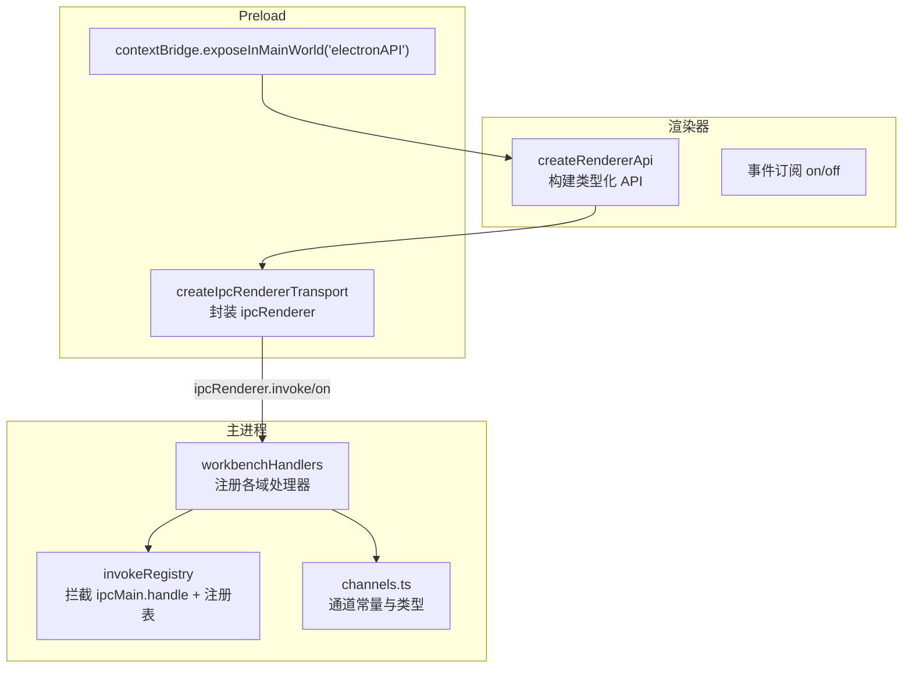
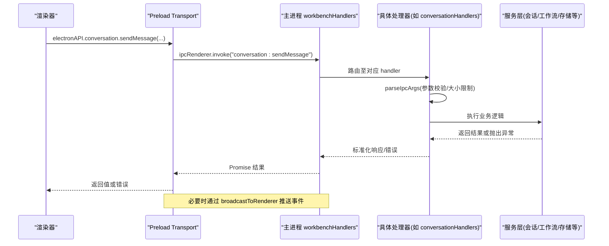
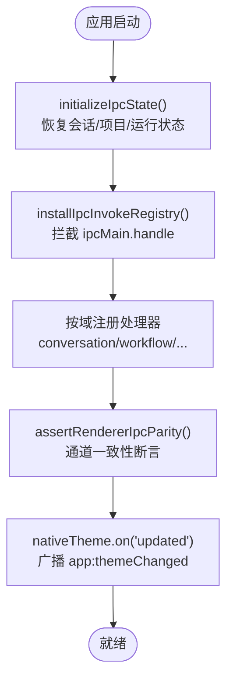
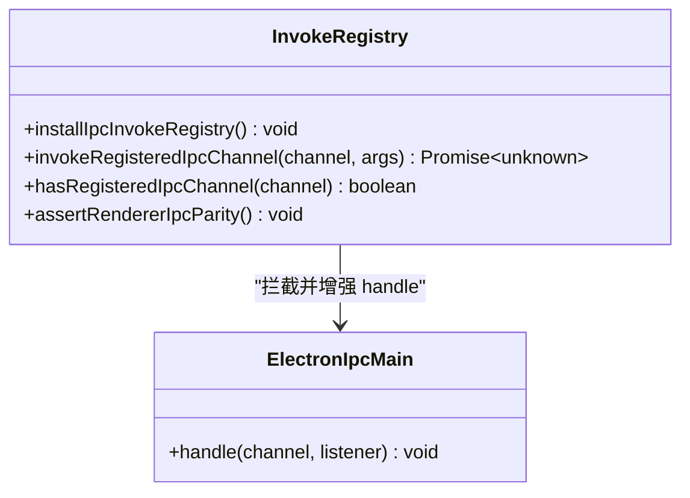
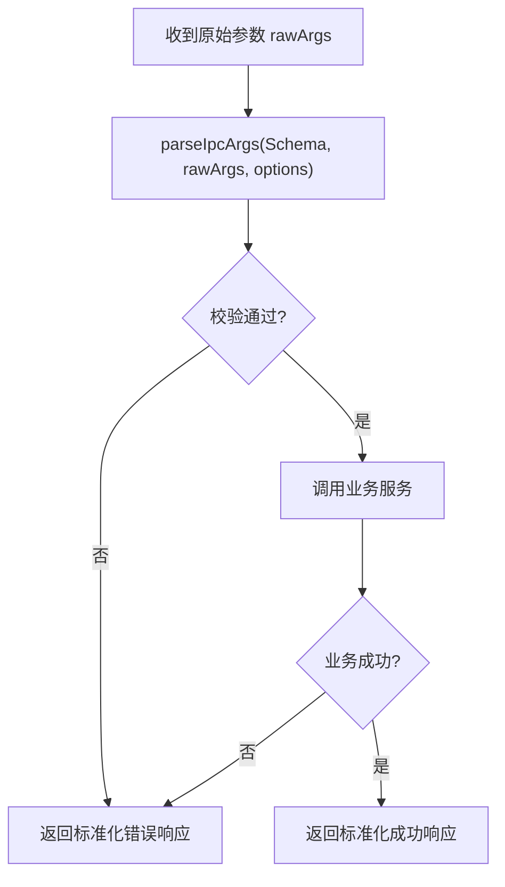
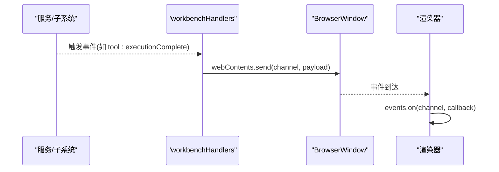
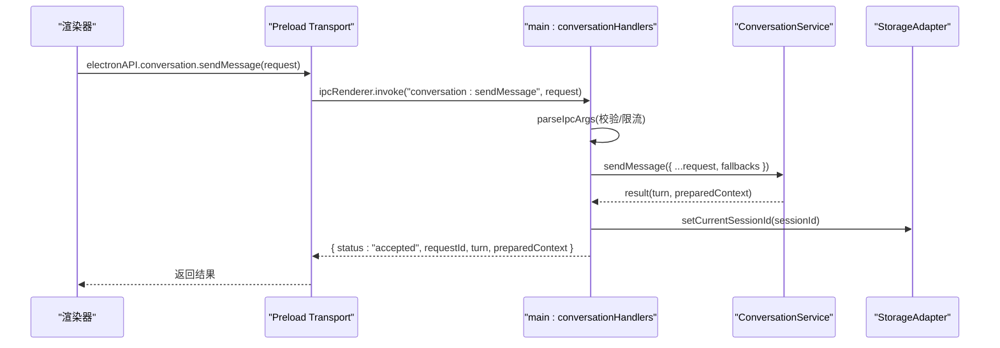
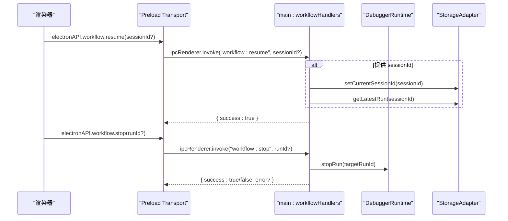
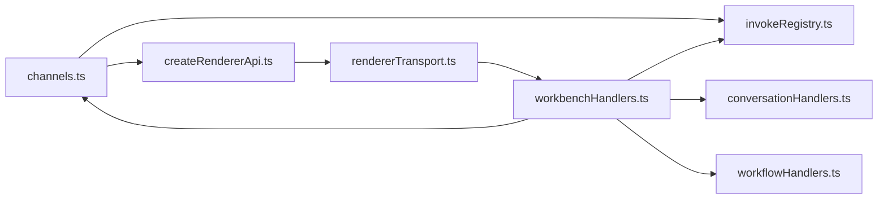

# IPC 通信机制

<cite>
**本文引用的文件**
- [src/main/ipc/handlers.ts](file://src/main/ipc/handlers.ts)
- [src/main/ipc/workbenchHandlers.ts](file://src/main/ipc/workbenchHandlers.ts)
- [src/main/ipc/invokeRegistry.ts](file://src/main/ipc/invokeRegistry.ts)
- [src/preload/index.ts](file://src/preload/index.ts)
- [src/preload/rendererTransport.ts](file://src/preload/rendererTransport.ts)
- [src/shared/renderer-api/channels.ts](file://src/shared/renderer-api/channels.ts)
- [src/shared/renderer-api/createRendererApi.ts](file://src/shared/renderer-api/createRendererApi.ts)
- [src/shared/renderer-api/transport.ts](file://src/shared/renderer-api/transport.ts)
- [src/main/ipc/conversationHandlers.ts](file://src/main/ipc/conversationHandlers.ts)
- [src/main/ipc/workflowHandlers.ts](file://src/main/ipc/workflowHandlers.ts)
</cite>

## 目录
1. [简介](#简介)
2. [项目结构](#项目结构)
3. [核心组件](#核心组件)
4. [架构总览](#架构总览)
5. [详细组件分析](#详细组件分析)
6. [依赖关系分析](#依赖关系分析)
7. [性能考虑](#性能考虑)
8. [故障排查指南](#故障排查指南)
9. [结论](#结论)
10. [附录](#附录)

## 简介
本文件系统性解析 RDC-Agent 的 IPC 通信机制，覆盖主进程与渲染器之间的消息路由、类型安全、错误处理、处理器注册与管理、调用注册表（invokeRegistry）的动态加载与生命周期管理。文档提供从前端请求到后端处理的完整链路图，并给出性能优化与调试技巧，帮助读者快速理解与扩展该 IPC 体系。

## 项目结构
IPC 相关代码主要分布在以下位置：
- 共享层：定义渲染器可使用的通道常量、传输接口与 API 构造器
- Preload 层：将 Electron ipcRenderer 封装为安全的 RendererApiTransport，并通过 contextBridge 暴露给渲染器
- 主进程：集中注册各业务域 IPC 处理器，维护全局上下文与广播能力，并提供 invoke 注册表以支持动态调用

图表来源
- [src/shared/renderer-api/createRendererApi.ts:33-76](file://src/shared/renderer-api/createRendererApi.ts#L33-L76)
- [src/preload/rendererTransport.ts:9-44](file://src/preload/rendererTransport.ts#L9-L44)
- [src/preload/index.ts:8-15](file://src/preload/index.ts#L8-L15)
- [src/main/ipc/workbenchHandlers.ts:259-281](file://src/main/ipc/workbenchHandlers.ts#L259-L281)
- [src/main/ipc/invokeRegistry.ts:9-21](file://src/main/ipc/invokeRegistry.ts#L9-L21)
- [src/shared/renderer-api/channels.ts:1-244](file://src/shared/renderer-api/channels.ts#L1-L244)

章节来源
- [src/main/ipc/handlers.ts:1-7](file://src/main/ipc/handlers.ts#L1-L7)
- [src/main/ipc/workbenchHandlers.ts:52-77](file://src/main/ipc/workbenchHandlers.ts#L52-L77)
- [src/main/ipc/invokeRegistry.ts:1-51](file://src/main/ipc/invokeRegistry.ts#L1-L51)
- [src/preload/index.ts:1-26](file://src/preload/index.ts#L1-L26)
- [src/preload/rendererTransport.ts:1-45](file://src/preload/rendererTransport.ts#L1-L45)
- [src/shared/renderer-api/channels.ts:1-244](file://src/shared/renderer-api/channels.ts#L1-L244)
- [src/shared/renderer-api/createRendererApi.ts:1-77](file://src/shared/renderer-api/createRendererApi.ts#L1-L77)
- [src/shared/renderer-api/transport.ts:1-12](file://src/shared/renderer-api/transport.ts#L1-L12)

## 核心组件
- 通道契约与类型安全
  - channels.ts 集中声明所有渲染器可调用的 invoke 通道和事件通道，并提供类型守卫函数，确保前后端通道一致且强类型。
- Preload 传输层
  - rendererTransport.ts 将 ipcRenderer 包装为 RendererApiTransport，统一 invoke 与 subscribe 语义，并在内部维护监听器映射，避免重复绑定与内存泄漏。
- 渲染器 API 构造
  - createRendererApi.ts 基于 transport 生成类型化的 electronAPI，按领域划分方法（如 conversation、workflow、settings 等），并对事件订阅进行白名单校验。
- 主进程处理器注册中心
  - workbenchHandlers.ts 负责初始化 IPC 状态、安装 invoke 注册表、桥接系统主题变化、以及按域批量注册 IPC 处理器，并在启动末尾执行“渲染器-主进程通道一致性断言”。
- 调用注册表（invokeRegistry）
  - invokeRegistry.ts 通过拦截 ipcMain.handle 收集所有已注册的 channel，提供运行时查询、断言与统一调用入口，保障“渲染器声明的通道在主进程均有实现”。

章节来源
- [src/shared/renderer-api/channels.ts:1-244](file://src/shared/renderer-api/channels.ts#L1-L244)
- [src/preload/rendererTransport.ts:9-44](file://src/preload/rendererTransport.ts#L9-L44)
- [src/shared/renderer-api/createRendererApi.ts:33-76](file://src/shared/renderer-api/createRendererApi.ts#L33-L76)
- [src/main/ipc/workbenchHandlers.ts:259-281](file://src/main/ipc/workbenchHandlers.ts#L259-L281)
- [src/main/ipc/invokeRegistry.ts:9-51](file://src/main/ipc/invokeRegistry.ts#L9-L51)

## 架构总览
下图展示从渲染器发起调用到主进程处理器执行的完整链路，包括参数校验、业务处理、结果返回与事件广播。

图表来源
- [src/preload/rendererTransport.ts:29-32](file://src/preload/rendererTransport.ts#L29-L32)
- [src/main/ipc/conversationHandlers.ts:43-78](file://src/main/ipc/conversationHandlers.ts#L43-L78)
- [src/main/ipc/workbenchHandlers.ts:79-87](file://src/main/ipc/workbenchHandlers.ts#L79-L87)

## 详细组件分析

### 处理器注册与管理（handlers.ts 与 workbenchHandlers.ts）
- handlers.ts 作为导出门面，仅转发 initializeIpcState、registerIPCHandlers、setMainWindow、stopAllActiveRuns 等关键入口，便于外部模块按需引入。
- workbenchHandlers.ts 是 IPC 组合根：
  - 初始化 IPC 状态：恢复当前 session/project/run，恢复中断运行，检测可恢复会话。
  - 安装 invoke 注册表：在首次注册时拦截 ipcMain.handle，建立本地 Map 记录所有已注册通道。
  - 按域批量注册处理器：conversation、workflow、project、session、device、shell、web、toolEvidence、trace、rdcRuntime 等。
  - 启动后断言：assertRendererIpcParity 检查渲染器声明的所有通道是否都在主进程有实现，缺失则抛错。
  - 主题桥接：监听 nativeTheme 更新并向渲染器广播 app:themeChanged。
  - 工具执行追踪：订阅 rdcCliInvokerService 的执行完成事件，写入日志与证据，并广播 tool:executionComplete。

图表来源
- [src/main/ipc/workbenchHandlers.ts:52-77](file://src/main/ipc/workbenchHandlers.ts#L52-L77)
- [src/main/ipc/workbenchHandlers.ts:259-281](file://src/main/ipc/workbenchHandlers.ts#L259-L281)
- [src/main/ipc/invokeRegistry.ts:9-21](file://src/main/ipc/invokeRegistry.ts#L9-L21)

章节来源
- [src/main/ipc/handlers.ts:1-7](file://src/main/ipc/handlers.ts#L1-L7)
- [src/main/ipc/workbenchHandlers.ts:52-77](file://src/main/ipc/workbenchHandlers.ts#L52-L77)
- [src/main/ipc/workbenchHandlers.ts:259-281](file://src/main/ipc/workbenchHandlers.ts#L259-L281)

### 调用注册表（invokeRegistry）
- 动态加载：installIpcInvokeRegistry 在首次调用时替换 ipcMain.handle，使每次注册都同时写入本地 Map，形成“调用注册表”。
- 运行时查询：hasRegisteredIpcChannel 判断某通道是否已注册；invokeRegisteredIpcChannel 通过 Map 查找并调用处理器，自动构造 IpcMainInvokeEvent 的 sender。
- 生命周期与一致性：assertRendererIpcParity 在启动阶段对比 RENDERER_INVOKE_CHANNELS 与已注册通道集合，缺失即抛错，保证前后端契约一致。

图表来源
- [src/main/ipc/invokeRegistry.ts:9-51](file://src/main/ipc/invokeRegistry.ts#L9-L51)

章节来源
- [src/main/ipc/invokeRegistry.ts:1-51](file://src/main/ipc/invokeRegistry.ts#L1-L51)

### 类型安全与参数校验
- 通道类型安全：channels.ts 使用 const 对象枚举所有通道，并通过类型推导生成 RendererInvokeChannel/RendererEventChannel，配合 isRendererInvokeChannel/isRendererEventChannel 做运行时白名单校验。
- 参数校验：各处理器统一使用 parseIpcArgs 对入参进行结构化校验，支持最大字节限制、字段补齐（padTo）等策略，失败时立即拒绝，避免进入业务层。
- 错误归一化：处理器捕获异常并转换为标准响应格式（如包含 success/error 字段），便于渲染器统一处理。

图表来源
- [src/main/ipc/conversationHandlers.ts:43-78](file://src/main/ipc/conversationHandlers.ts#L43-L78)
- [src/main/ipc/workflowHandlers.ts:21-33](file://src/main/ipc/workflowHandlers.ts#L21-L33)

章节来源
- [src/shared/renderer-api/channels.ts:220-244](file://src/shared/renderer-api/channels.ts#L220-L244)
- [src/main/ipc/conversationHandlers.ts:43-78](file://src/main/ipc/conversationHandlers.ts#L43-L78)
- [src/main/ipc/workflowHandlers.ts:21-33](file://src/main/ipc/workflowHandlers.ts#L21-L33)

### 事件广播与双向通信
- 事件通道：channels.ts 定义渲染器可订阅的事件通道（如 workflow:runStatusChanged、tool:executionComplete、app:themeChanged）。
- 广播机制：workbenchHandlers.ts 提供 broadcastToRenderer，通过 rendererEventHub 与 BrowserWindow.webContents.send 向所有窗口广播事件。
- 典型场景：工具执行完成、运行状态变更、主题切换等，均通过事件通道通知渲染器刷新 UI。

图表来源
- [src/main/ipc/workbenchHandlers.ts:79-87](file://src/main/ipc/workbenchHandlers.ts#L79-L87)
- [src/main/ipc/workbenchHandlers.ts:190-237](file://src/main/ipc/workbenchHandlers.ts#L190-L237)
- [src/shared/renderer-api/channels.ts:178-218](file://src/shared/renderer-api/channels.ts#L178-L218)

章节来源
- [src/main/ipc/workbenchHandlers.ts:79-87](file://src/main/ipc/workbenchHandlers.ts#L79-L87)
- [src/main/ipc/workbenchHandlers.ts:190-237](file://src/main/ipc/workbenchHandlers.ts#L190-L237)
- [src/shared/renderer-api/channels.ts:178-218](file://src/shared/renderer-api/channels.ts#L178-L218)

### 前端调用示例流程（以对话发送为例）

图表来源
- [src/preload/rendererTransport.ts:29-32](file://src/preload/rendererTransport.ts#L29-L32)
- [src/main/ipc/conversationHandlers.ts:43-78](file://src/main/ipc/conversationHandlers.ts#L43-L78)

章节来源
- [src/main/ipc/conversationHandlers.ts:43-78](file://src/main/ipc/conversationHandlers.ts#L43-L78)

### 工作流控制流程（resume/stop）

图表来源
- [src/main/ipc/workflowHandlers.ts:35-82](file://src/main/ipc/workflowHandlers.ts#L35-L82)

章节来源
- [src/main/ipc/workflowHandlers.ts:35-82](file://src/main/ipc/workflowHandlers.ts#L35-L82)

## 依赖关系分析
- 通道契约驱动：channels.ts 是所有通道的单一事实来源，渲染器 API 与主进程处理器均依赖其类型与常量。
- 注册表耦合：workbenchHandlers 依赖 invokeRegistry 提供的拦截与断言能力；invokeRegistry 依赖 channels 中的 RENDERER_INVOKE_CHANNELS 进行一致性检查。
- 传输解耦：preload 的 rendererTransport 仅依赖 Electron ipcRenderer，不感知业务通道，便于替换或测试。
- 处理器内聚：每个业务域处理器独立注册，职责清晰，通过 workbenchHandlers 统一装配。

图表来源
- [src/shared/renderer-api/channels.ts:1-244](file://src/shared/renderer-api/channels.ts#L1-L244)
- [src/shared/renderer-api/createRendererApi.ts:33-76](file://src/shared/renderer-api/createRendererApi.ts#L33-L76)
- [src/preload/rendererTransport.ts:9-44](file://src/preload/rendererTransport.ts#L9-L44)
- [src/main/ipc/workbenchHandlers.ts:259-281](file://src/main/ipc/workbenchHandlers.ts#L259-L281)
- [src/main/ipc/invokeRegistry.ts:9-51](file://src/main/ipc/invokeRegistry.ts#L9-L51)
- [src/main/ipc/conversationHandlers.ts:43-78](file://src/main/ipc/conversationHandlers.ts#L43-L78)
- [src/main/ipc/workflowHandlers.ts:21-33](file://src/main/ipc/workflowHandlers.ts#L21-L33)

章节来源
- [src/shared/renderer-api/channels.ts:1-244](file://src/shared/renderer-api/channels.ts#L1-L244)
- [src/main/ipc/workbenchHandlers.ts:259-281](file://src/main/ipc/workbenchHandlers.ts#L259-L281)
- [src/main/ipc/invokeRegistry.ts:9-51](file://src/main/ipc/invokeRegistry.ts#L9-L51)

## 性能考虑
- 参数体积限制：parseIpcArgs 支持 maxBytes 限制，避免大载荷阻塞事件循环。建议对图片/附件类通道设置合理上限，并在前端分片上传。
- 事件去重与订阅管理：rendererTransport 维护监听器映射，避免重复绑定；建议在组件卸载时主动移除监听，防止内存泄漏。
- 批量操作与节流：对于高频事件（如 trace、日志），可在主进程侧合并或采样后再广播，减少渲染器压力。
- 异步与错误隔离：处理器内部 try/catch 包裹业务调用，失败时返回标准化错误，避免未捕获异常导致进程崩溃。
- 启动顺序：先安装 invoke 注册表再注册处理器，确保断言能覆盖全部通道；将耗时初始化（如恢复会话）放在 initializeIpcState 中，避免阻塞注册流程。

[本节为通用指导，无需特定文件引用]

## 故障排查指南
- 通道缺失报错
  - 现象：启动时报“Renderer IPC parity violation; missing handlers: ...”
  - 原因：渲染器声明了某通道，但主进程未注册对应处理器
  - 处理：在对应域处理器文件中注册该通道，或在 channels.ts 中移除未使用的通道
  - 参考
    - [src/main/ipc/invokeRegistry.ts:45-51](file://src/main/ipc/invokeRegistry.ts#L45-L51)
    - [src/main/ipc/workbenchHandlers.ts:259-281](file://src/main/ipc/workbenchHandlers.ts#L259-L281)

- 参数校验失败
  - 现象：调用立即返回错误，日志提示字段缺失或超限
  - 原因：parseIpcArgs 校验失败（字段类型不符、大小超限、padTo 不足）
  - 处理：修正前端传参，调整 Schema 或增大 maxBytes
  - 参考
    - [src/main/ipc/conversationHandlers.ts:43-78](file://src/main/ipc/conversationHandlers.ts#L43-L78)
    - [src/main/ipc/workflowHandlers.ts:21-33](file://src/main/ipc/workflowHandlers.ts#L21-L33)

- 事件未送达
  - 现象：渲染器 on(channel) 未触发
  - 排查：确认主进程是否调用 broadcastToRenderer；确认频道名与 channels.ts 一致；确认窗口未被销毁
  - 参考
    - [src/main/ipc/workbenchHandlers.ts:79-87](file://src/main/ipc/workbenchHandlers.ts#L79-L87)
    - [src/shared/renderer-api/channels.ts:178-218](file://src/shared/renderer-api/channels.ts#L178-L218)

- 主题切换无效
  - 现象：系统主题变更后渲染器未收到 app:themeChanged
  - 排查：确认 registerNativeThemeBridge 已执行；确认渲染器订阅了该事件
  - 参考
    - [src/main/ipc/workbenchHandlers.ts:248-257](file://src/main/ipc/workbenchHandlers.ts#L248-L257)

章节来源
- [src/main/ipc/invokeRegistry.ts:45-51](file://src/main/ipc/invokeRegistry.ts#L45-L51)
- [src/main/ipc/workbenchHandlers.ts:248-257](file://src/main/ipc/workbenchHandlers.ts#L248-L257)
- [src/main/ipc/conversationHandlers.ts:43-78](file://src/main/ipc/conversationHandlers.ts#L43-L78)
- [src/main/ipc/workflowHandlers.ts:21-33](file://src/main/ipc/workflowHandlers.ts#L21-L33)
- [src/shared/renderer-api/channels.ts:178-218](file://src/shared/renderer-api/channels.ts#L178-L218)

## 结论
该 IPC 体系通过“通道契约 + 预加载传输 + 主进程注册表 + 参数校验 + 事件广播”的组合，实现了高内聚、低耦合、类型安全且可扩展的前后端通信。invokeRegistry 提供了强大的运行时治理能力，确保前后端通道一致；workbenchHandlers 作为组合根，统一管理生命周期与广播；各域处理器职责清晰，易于维护与扩展。遵循本文的性能与排障建议，可进一步提升稳定性与可观测性。

## 附录
- 常用通道分类（节选）
  - 应用外壳：app:getMeta、dialog:selectFiles、window:minimize 等
  - 对话：conversation:sendMessage、conversation:getHistory 等
  - 工作流：workflow:getState、workflow:resume、workflow:stop 等
  - 知识/记忆/调查：knowledge:*、memory:*、investigation:*
  - 设备/会话/项目/运行：device:*、session:*、project:*、run:*
  - 运行时/追踪：runtimeLog:list、trace:*
- 事件通道（节选）
  - workflow:runStatusChanged、tool:executionComplete、app:themeChanged、llm:stream 等

[本节为概念性说明，无需特定文件引用]