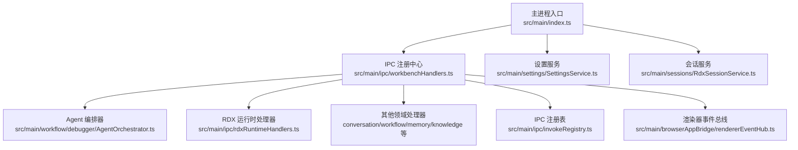
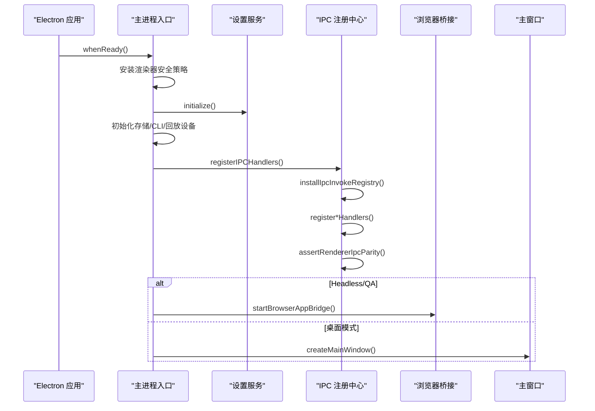
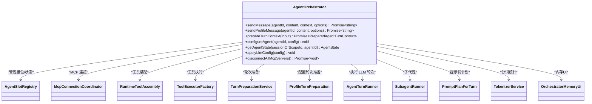
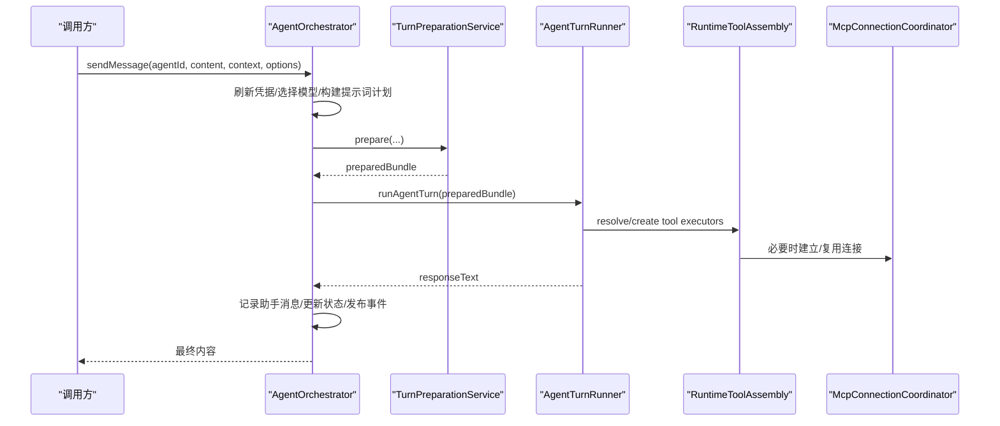
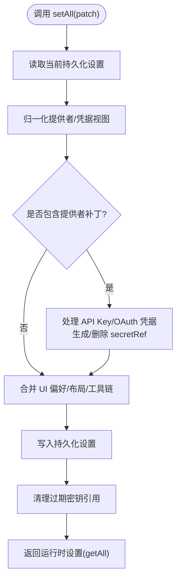
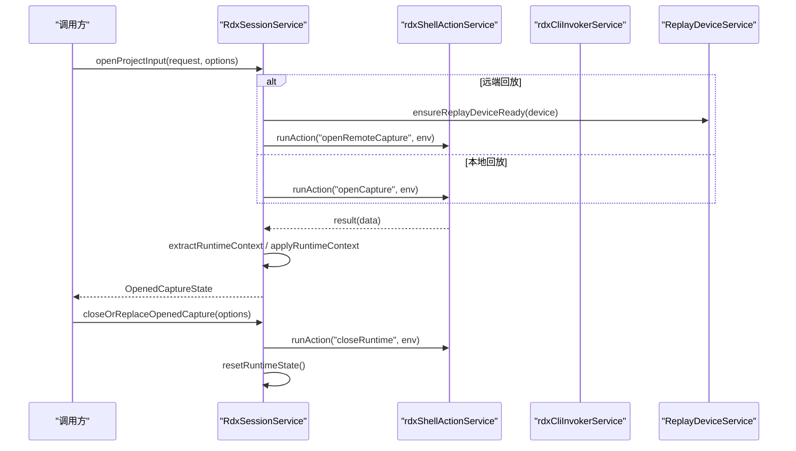
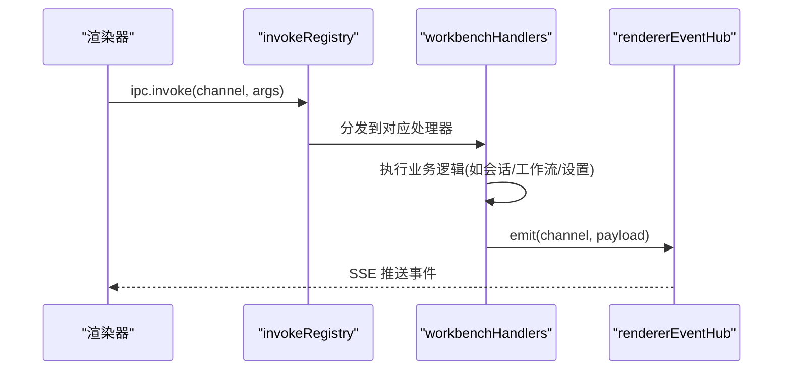
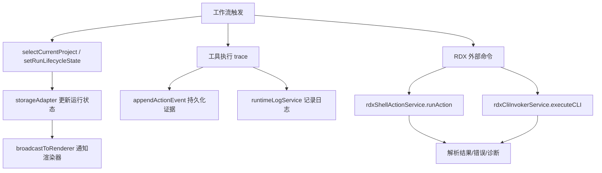
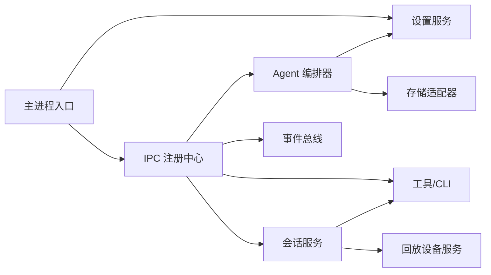

# 主进程架构

<cite>
**本文引用的文件**
- [src/main/index.ts](file://src/main/index.ts)
- [src/main/workflow/debugger/AgentOrchestrator.ts](file://src/main/workflow/debugger/AgentOrchestrator.ts)
- [src/main/settings/SettingsService.ts](file://src/main/settings/SettingsService.ts)
- [src/main/sessions/RdxSessionService.ts](file://src/main/sessions/RdxSessionService.ts)
- [src/main/ipc/handlers.ts](file://src/main/ipc/handlers.ts)
- [src/main/ipc/workbenchHandlers.ts](file://src/main/ipc/workbenchHandlers.ts)
- [src/main/ipc/invokeRegistry.ts](file://src/main/ipc/invokeRegistry.ts)
- [src/main/browserAppBridge/rendererEventHub.ts](file://src/main/browserAppBridge/rendererEventHub.ts)
</cite>

## 目录
1. [简介](#简介)
2. [项目结构](#项目结构)
3. [核心组件](#核心组件)
4. [架构总览](#架构总览)
5. [详细组件分析](#详细组件分析)
6. [依赖关系分析](#依赖关系分析)
7. [性能考量](#性能考量)
8. [故障排查指南](#故障排查指南)
9. [结论](#结论)
10. [附录](#附录)

## 简介
本文件面向 Electron 主进程，系统性解析 RDC-Agent 的主进程架构与关键业务逻辑。重点覆盖：
- AgentOrchestrator 任务编排引擎：消息路由、提示词计划、工具装配与执行、子代理与后台任务、状态与事件发布。
- SettingsService 配置管理服务：设置持久化、提供者凭据管理、LLM 配置注入、窗口布局与工具链配置。
- RdxSessionService 会话生命周期管理：捕获打开/关闭、本地/远端回放设备、运行时上下文与预览窗口、错误恢复与清理。
- IPC 处理器架构与消息路由：统一注册、渲染器通道对等性校验、SSE 事件总线、跨窗口广播。
- 工作流编排、工具执行、外部命令调用：RDX CLI 调用、Shell Action 编排、工具追踪与审计。
- 服务注册发现、依赖注入、事件总线：集中式初始化、模块按需加载、事件驱动解耦。

## 项目结构
主进程入口负责应用生命周期、安全策略、单实例锁、用户数据目录、窗口创建、IPC 注册与服务初始化；各子系统通过模块化方式组织，按职责划分到 workflow、settings、sessions、ipc、tools 等目录。

图表来源
- [src/main/index.ts:560-628](file://src/main/index.ts#L560-L628)
- [src/main/ipc/workbenchHandlers.ts:259-281](file://src/main/ipc/workbenchHandlers.ts#L259-L281)
- [src/main/ipc/invokeRegistry.ts:9-21](file://src/main/ipc/invokeRegistry.ts#L9-L21)
- [src/main/browserAppBridge/rendererEventHub.ts:15-51](file://src/main/browserAppBridge/rendererEventHub.ts#L15-L51)

章节来源
- [src/main/index.ts:1-727](file://src/main/index.ts#L1-L727)

## 核心组件
- AgentOrchestrator：对外暴露 sendMessage/sendProfileMessage/prepareTurnContext 等能力，内部组合 TurnPreparationService、AgentTurnRunner、SubagentRunner、ToolExecutorFactory、PromptPlanForTurn、McpConnectionCoordinator 等，完成从消息到 LLM 调用的完整编排。
- SettingsService：提供 getAll/setAll/getLlmConfig 等接口，负责设置读取/写入、提供者凭据存储、窗口布局保存、LLM 配置编译与注入。
- RdxSessionService：管理捕获的打开/关闭、本地/远端回放设备连接、运行时上下文（contextId、ownerLeaseId）、人类预览窗口生命周期，以及与 rdxShellActionService 和 rdxCliInvokerService 的交互。
- IPC 层：workbenchHandlers 作为组合根，注册各域处理器；invokeRegistry 提供统一的 ipcMain.handle 包装与通道对等性校验；rendererEventHub 提供 SSE 事件总线用于跨窗口广播。

章节来源
- [src/main/workflow/debugger/AgentOrchestrator.ts:75-145](file://src/main/workflow/debugger/AgentOrchestrator.ts#L75-L145)
- [src/main/settings/SettingsService.ts:94-139](file://src/main/settings/SettingsService.ts#L94-L139)
- [src/main/sessions/RdxSessionService.ts:53-78](file://src/main/sessions/RdxSessionService.ts#L53-L78)
- [src/main/ipc/workbenchHandlers.ts:43-101](file://src/main/ipc/workbenchHandlers.ts#L43-L101)
- [src/main/ipc/invokeRegistry.ts:1-51](file://src/main/ipc/invokeRegistry.ts#L1-L51)
- [src/main/browserAppBridge/rendererEventHub.ts:1-53](file://src/main/browserAppBridge/rendererEventHub.ts#L1-L53)

## 架构总览
主进程启动流程：
- 安装渲染器安全策略（CSP、权限拒绝）。
- 计算并锁定 userData 目录，确保单实例运行。
- 初始化设置服务、存储适配器、RDX CLI 编目、ReplayDeviceService。
- 注册 IPC 处理器，恢复中断运行，预加载 LLM 配置。
- 可选启动 BrowserAppBridge（Headless/QA），或创建主窗口。
- 监听窗口事件、菜单快捷键、导航白名单。

图表来源
- [src/main/index.ts:124-161](file://src/main/index.ts#L124-L161)
- [src/main/index.ts:560-628](file://src/main/index.ts#L560-L628)
- [src/main/ipc/workbenchHandlers.ts:259-281](file://src/main/ipc/workbenchHandlers.ts#L259-L281)
- [src/main/ipc/invokeRegistry.ts:9-21](file://src/main/ipc/invokeRegistry.ts#L9-L21)

## 详细组件分析

### AgentOrchestrator 任务编排引擎
- 角色与职责：聚合 AgentSlotRegistry、MCP 连接协调、工具装配与执行、提示词计划、轮次准备与执行、子代理与后台任务、内存 UI、状态更新与事件发布。
- 关键流程：
  - sendMessage：选择有效模型与提供者、刷新凭据、构建提示词计划、准备上下文、执行轮次、记录助手消息、更新状态并发布。
  - sendProfileMessage：支持传入已准备的轮次、冻结请求计划、额外提示段、终端上下文回调等高级场景。
  - 工具与 MCP：通过 RuntimeToolAssembly 与 ToolExecutorFactory 动态装配工具，支持延迟激活与允许列表控制；MCP 服务器状态查询与断开。
  - 状态与事件：updateAgentStatus 将状态变更写入 slots，并通过 runtimeLogService 与 workflowProjectionPublisher 发布。

图表来源
- [src/main/workflow/debugger/AgentOrchestrator.ts:75-145](file://src/main/workflow/debugger/AgentOrchestrator.ts#L75-L145)
- [src/main/workflow/debugger/AgentOrchestrator.ts:195-366](file://src/main/workflow/debugger/AgentOrchestrator.ts#L195-L366)
- [src/main/workflow/debugger/AgentOrchestrator.ts:384-634](file://src/main/workflow/debugger/AgentOrchestrator.ts#L384-L634)

图表来源
- [src/main/workflow/debugger/AgentOrchestrator.ts:195-366](file://src/main/workflow/debugger/AgentOrchestrator.ts#L195-L366)
- [src/main/workflow/debugger/AgentOrchestrator.ts:384-634](file://src/main/workflow/debugger/AgentOrchestrator.ts#L384-L634)

章节来源
- [src/main/workflow/debugger/AgentOrchestrator.ts:75-145](file://src/main/workflow/debugger/AgentOrchestrator.ts#L75-L145)
- [src/main/workflow/debugger/AgentOrchestrator.ts:195-366](file://src/main/workflow/debugger/AgentOrchestrator.ts#L195-L366)
- [src/main/workflow/debugger/AgentOrchestrator.ts:384-634](file://src/main/workflow/debugger/AgentOrchestrator.ts#L384-L634)
- [src/main/workflow/debugger/AgentOrchestrator.ts:682-688](file://src/main/workflow/debugger/AgentOrchestrator.ts#L682-L688)

### SettingsService 配置管理服务
- 职责：读取/合并/持久化设置；提供者凭据存储与解密；窗口布局增量保存；LLM 配置编译与注入；Agent 定义与提供者定义的提交与版本控制。
- 关键点：
  - initialize 时重建并迁移设置，清理过期密钥引用。
  - setAll 中处理 API Key 与 OAuth 账户凭据，生成/删除 secretRef，并返回运行时设置。
  - getLlmConfig 过滤已启用且验证通过的提供者，组装 provider 列表与 agentRoutes。
  - persistWindowLayout/persistWindowLayoutAsync 针对高频窗口事件做窄写优化。

图表来源
- [src/main/settings/SettingsService.ts:249-383](file://src/main/settings/SettingsService.ts#L249-L383)
- [src/main/settings/SettingsService.ts:458-487](file://src/main/settings/SettingsService.ts#L458-L487)

章节来源
- [src/main/settings/SettingsService.ts:94-139](file://src/main/settings/SettingsService.ts#L94-L139)
- [src/main/settings/SettingsService.ts:249-383](file://src/main/settings/SettingsService.ts#L249-L383)
- [src/main/settings/SettingsService.ts:458-487](file://src/main/settings/SettingsService.ts#L458-L487)

### RdxSessionService 会话生命周期管理
- 职责：打开/关闭捕获、本地/远端回放设备准备、运行时上下文（contextId、ownerLeaseId）管理、人类预览窗口生命周期、错误诊断与恢复。
- 关键点：
  - openProjectInput：根据设备类型走本地或远端路径，调用 rdxShellActionService.runAction('openCapture'/'openRemoteCapture')，提取运行时上下文并应用。
  - teardownRuntime：优先通过 closeRuntime action 优雅关闭，失败则抛出错误以保留所有权；resetRuntimeState 清理所有状态。
  - humanPreview：open/close 通过 rdxShellActionService 或 rdxCliInvokerService 控制预览开关，维护 HumanPreviewSnapshot。
  - 远程设备：ensureReplayDeviceReady 保证设备处于可用状态，必要时激活设备。

图表来源
- [src/main/sessions/RdxSessionService.ts:69-212](file://src/main/sessions/RdxSessionService.ts#L69-L212)
- [src/main/sessions/RdxSessionService.ts:710-753](file://src/main/sessions/RdxSessionService.ts#L710-L753)
- [src/main/sessions/RdxSessionService.ts:231-300](file://src/main/sessions/RdxSessionService.ts#L231-L300)

章节来源
- [src/main/sessions/RdxSessionService.ts:53-78](file://src/main/sessions/RdxSessionService.ts#L53-L78)
- [src/main/sessions/RdxSessionService.ts:69-212](file://src/main/sessions/RdxSessionService.ts#L69-L212)
- [src/main/sessions/RdxSessionService.ts:710-753](file://src/main/sessions/RdxSessionService.ts#L710-L753)

### IPC 处理器架构与消息路由
- 组合根：workbenchHandlers 集中注册各域处理器（conversation、workflow、memory、knowledge、investigation、command、shell、web、toolEvidence、trace、rdxRuntime 等），并安装 invokeRegistry。
- 通道注册：invokeRegistry 包装 ipcMain.handle，收集已注册通道，支持 assertRendererIpcParity 校验渲染器侧声明的通道是否全部在主进程实现。
- 事件总线：rendererEventHub 基于 SSE 向连接的客户端推送事件，workbenchHandlers 通过 broadcastToRenderer 将运行状态、主题变化、工具执行结果等广播至所有窗口。

图表来源
- [src/main/ipc/invokeRegistry.ts:9-21](file://src/main/ipc/invokeRegistry.ts#L9-L21)
- [src/main/ipc/invokeRegistry.ts:32-49](file://src/main/ipc/invokeRegistry.ts#L32-L49)
- [src/main/ipc/workbenchHandlers.ts:79-101](file://src/main/ipc/workbenchHandlers.ts#L79-L101)
- [src/main/browserAppBridge/rendererEventHub.ts:15-51](file://src/main/browserAppBridge/rendererEventHub.ts#L15-L51)

章节来源
- [src/main/ipc/handlers.ts:1-7](file://src/main/ipc/handlers.ts#L1-L7)
- [src/main/ipc/workbenchHandlers.ts:43-101](file://src/main/ipc/workbenchHandlers.ts#L43-L101)
- [src/main/ipc/workbenchHandlers.ts:259-281](file://src/main/ipc/workbenchHandlers.ts#L259-L281)
- [src/main/ipc/invokeRegistry.ts:1-51](file://src/main/ipc/invokeRegistry.ts#L1-L51)
- [src/main/browserAppBridge/rendererEventHub.ts:1-53](file://src/main/browserAppBridge/rendererEventHub.ts#L1-L53)

### 工作流编排、工具执行、外部命令调用
- 工作流：workbenchHandlers 中的 selectCurrentProject、setRunLifecycleState、appendActionEvent 等函数驱动运行生命周期，并与 storageAdapter 同步状态，同时广播给渲染器。
- 工具执行：通过 rdxCliInvokerService 的 onInvocationTrace 订阅工具执行结果，转换为 ActionEvent 持久化并广播；AgentOrchestrator 通过 RuntimeToolAssembly/ToolExecutorFactory 动态装配与执行工具。
- 外部命令：RdxSessionService 使用 rdxShellActionService.runAction 与 rdxCliInvokerService.executeCLI 调用 RDX 原生能力（打开捕获、预览开关、关闭运行时等），并处理诊断信息与错误恢复。

图表来源
- [src/main/ipc/workbenchHandlers.ts:136-178](file://src/main/ipc/workbenchHandlers.ts#L136-L178)
- [src/main/ipc/workbenchHandlers.ts:190-237](file://src/main/ipc/workbenchHandlers.ts#L190-L237)
- [src/main/sessions/RdxSessionService.ts:231-300](file://src/main/sessions/RdxSessionService.ts#L231-L300)
- [src/main/sessions/RdxSessionService.ts:710-753](file://src/main/sessions/RdxSessionService.ts#L710-L753)

章节来源
- [src/main/ipc/workbenchHandlers.ts:136-178](file://src/main/ipc/workbenchHandlers.ts#L136-L178)
- [src/main/ipc/workbenchHandlers.ts:190-237](file://src/main/ipc/workbenchHandlers.ts#L190-L237)
- [src/main/sessions/RdxSessionService.ts:231-300](file://src/main/sessions/RdxSessionService.ts#L231-L300)
- [src/main/sessions/RdxSessionService.ts:710-753](file://src/main/sessions/RdxSessionService.ts#L710-L753)

## 依赖关系分析
- 主进程入口依赖：settingsService、rdxCliInvokerService、replayDeviceService、runtimeLogService、browserAppBridge、shutdownCoordinator、agentOrchestrator、turnCoordinator、processSupervisor。
- IPC 层依赖：workbenchHandlers 组合多个领域处理器，invokeRegistry 提供通道注册与对等性校验，rendererEventHub 提供事件广播。
- 服务间耦合：AgentOrchestrator 依赖 settingsService、storageAdapter、providerRuntimeCredentialService、workflowProjectionPublisher；RdxSessionService 依赖 rdxShellActionService、rdxCliInvokerService、replayDeviceService、settingsService。

图表来源
- [src/main/index.ts:560-628](file://src/main/index.ts#L560-L628)
- [src/main/ipc/workbenchHandlers.ts:259-281](file://src/main/ipc/workbenchHandlers.ts#L259-L281)
- [src/main/workflow/debugger/AgentOrchestrator.ts:75-145](file://src/main/workflow/debugger/AgentOrchestrator.ts#L75-L145)
- [src/main/sessions/RdxSessionService.ts:53-78](file://src/main/sessions/RdxSessionService.ts#L53-L78)

章节来源
- [src/main/index.ts:560-628](file://src/main/index.ts#L560-L628)
- [src/main/ipc/workbenchHandlers.ts:259-281](file://src/main/ipc/workbenchHandlers.ts#L259-L281)
- [src/main/workflow/debugger/AgentOrchestrator.ts:75-145](file://src/main/workflow/debugger/AgentOrchestrator.ts#L75-L145)
- [src/main/sessions/RdxSessionService.ts:53-78](file://src/main/sessions/RdxSessionService.ts#L53-L78)

## 性能考量
- 设置写入优化：persistWindowLayout/persistWindowLayoutAsync 仅写入 layout.window，避免全量归一化与凭据水合，降低高频窗口事件开销。
- 工具执行追踪：onInvocationTrace 批量追加证据并广播，减少重复 IO；日志记录附带 sessionId/projectId/runId 便于定位。
- 会话清理：teardownRuntime 优先优雅关闭，失败快速回滚并抛错，避免资源泄漏；resetRuntimeState 集中清理状态。
- 事件广播：rendererEventHub 使用 SSE 心跳保持连接，避免频繁轮询；多窗口广播通过遍历窗口 webContents.send。

[本节为通用指导，不直接分析具体文件]

## 故障排查指南
- 设置初始化失败：检查 readJsonFile/readJsonFileAsync 与 writeSettings/writeSettingsAsync 的异常路径；确认 schemaVersion 与迁移逻辑。
- 提供者凭据问题：hasProviderSecret/getProviderOAuthSecret 返回空或掩码预览为空，需检查 secretStorageService 与 secretRef 映射。
- 会话打开失败：openProjectInput 抛出 LOCAL_REPLAY_UNSUPPORTED 或 RDX action failed，查看 diagnostic 与 error 字段；确认 replayDevice 状态与 activateDevice 结果。
- 运行时关闭失败：teardownRuntime 抛出 RDX_CLOSE_FAILED，表示 closeRuntime 未确认；检查 shellInvocationService.hasUnconfirmedProcesses 与上下文租约。
- IPC 通道缺失：assertRendererIpcParity 抛出缺少处理器通道错误，需在 workbenchHandlers 中补充对应 register*Handlers。

章节来源
- [src/main/settings/SettingsService.ts:103-139](file://src/main/settings/SettingsService.ts#L103-L139)
- [src/main/settings/SettingsService.ts:141-206](file://src/main/settings/SettingsService.ts#L141-L206)
- [src/main/sessions/RdxSessionService.ts:69-212](file://src/main/sessions/RdxSessionService.ts#L69-L212)
- [src/main/sessions/RdxSessionService.ts:710-753](file://src/main/sessions/RdxSessionService.ts#L710-L753)
- [src/main/ipc/invokeRegistry.ts:45-49](file://src/main/ipc/invokeRegistry.ts#L45-L49)

## 结论
RDC-Agent 主进程采用模块化、事件驱动与服务化设计：
- AgentOrchestrator 将提示词计划、工具装配、LLM 调用与子代理编排整合为统一入口，支持测试模式与凭据刷新。
- SettingsService 提供强一致的设置持久化与凭据管理，支撑 LLM 配置与工具链动态切换。
- RdxSessionService 封装 RDX 运行时上下文与设备生命周期，保障捕获打开/关闭的可靠性与可恢复性。
- IPC 层通过 invokeRegistry 与 rendererEventHub 实现通道对等性与跨窗口事件广播，提升可观测性与调试效率。
整体架构清晰、职责分离明确，适合扩展新的领域处理器与工具能力。

[本节为总结性内容，不直接分析具体文件]

## 附录
- 关键入口与导出：
  - 主进程入口导出 rdxSessionService，供外部模块使用。
  - IPC handlers 通过 workbenchHandlers 统一注册，避免分散维护。
- 环境变量与模式：
  - HEADLESS/BROWSER_QA/TEST_MODE 影响窗口创建与安全策略。
  - USER_DATA/HOME 控制用户数据目录与隔离环境。
- 安全策略：
  - CSP 限制脚本与样式来源，禁止 object-src，限制 connect-src 到受信任域名。
  - 默认拒绝权限请求，导航白名单仅允许开发服务器与 file 协议。

[本节为补充信息，不直接分析具体文件]