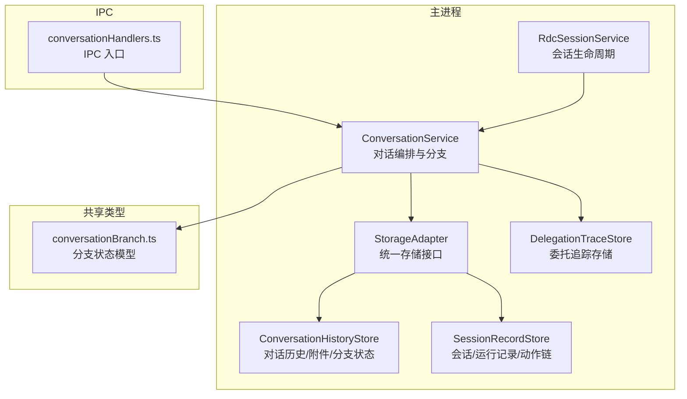
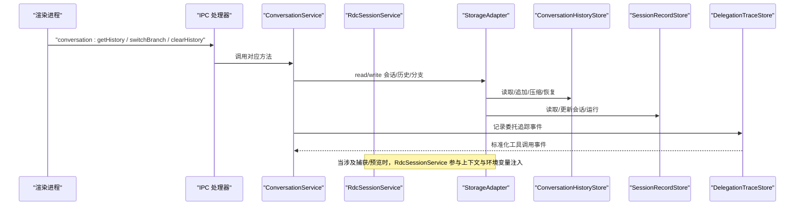
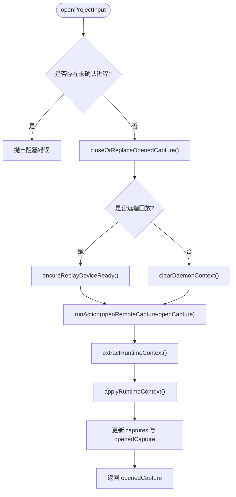
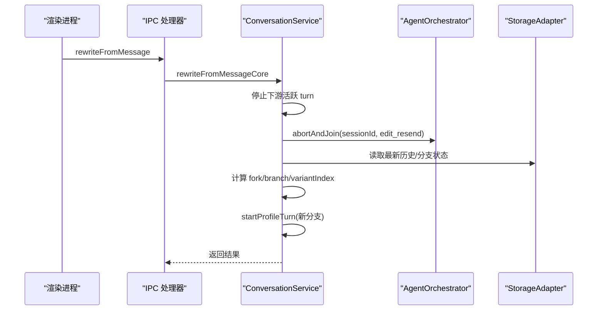
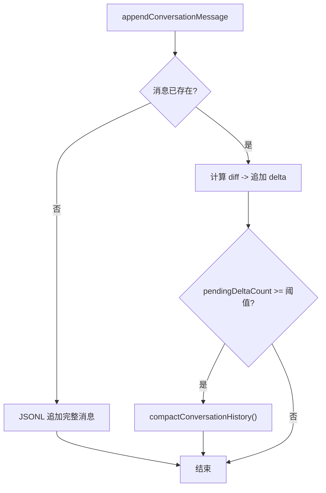
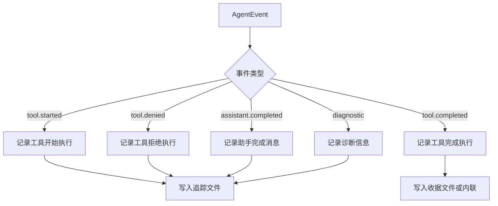
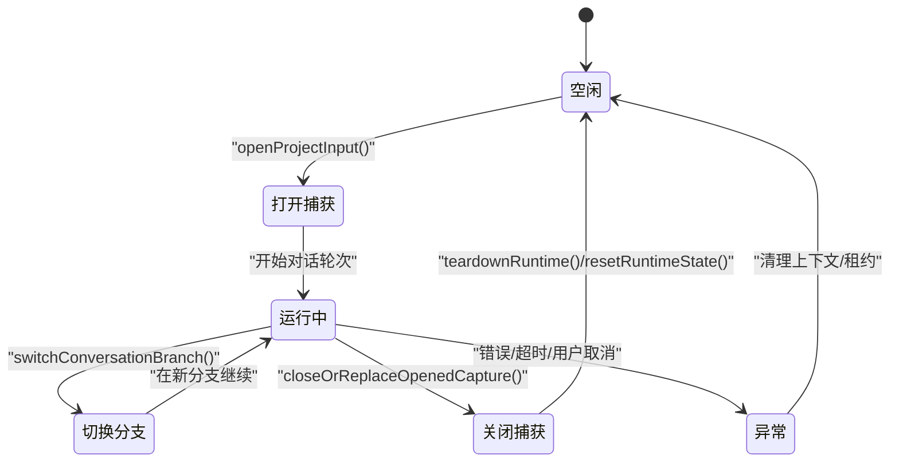
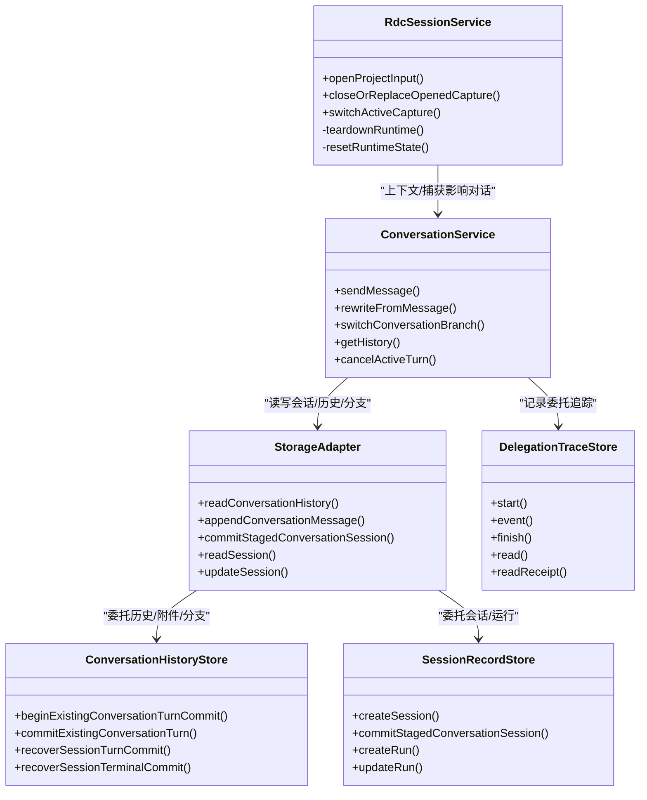

# 会话管理系统

<cite>
**本文引用的文件**
- [RdcSessionService.ts](file://src/main/sessions/RdcSessionService.ts)
- [ConversationService.ts](file://src/main/conversation/ConversationService.ts)
- [StorageAdapter.ts](file://src/main/sessions/StorageAdapter.ts)
- [ConversationHistoryStore.ts](file://src/main/sessions/ConversationHistoryStore.ts)
- [SessionRecordStore.ts](file://src/main/sessions/SessionRecordStore.ts)
- [conversationBranchResolver.ts](file://src/shared/conversation/conversationBranchResolver.ts)
- [conversationBranch.ts](file://src/shared/types/conversationBranch.ts)
- [storageCommitTypes.ts](file://src/main/sessions/storageCommitTypes.ts)
- [conversationHandlers.ts](file://src/main/ipc/conversationHandlers.ts)
- [DelegationTraceStore.ts](file://src/main/conversation/DelegationTraceStore.ts)
- [SubagentRunner.ts](file://src/main/workflow/debugger/SubagentRunner.ts)
</cite>

## 更新摘要
**变更内容**
- 移除了旧的子代理专用事件处理器（subagent.started, subagent.delta, subagent.completed）
- 统一使用标准工具调用事件配合委托元数据进行跟踪
- 移除了嵌套的子代理子块管理函数如 upsertSubagentChild
- 更新了委托追踪机制以支持新的标准化事件处理

## 目录
1. [简介](#简介)
2. [项目结构](#项目结构)
3. [核心组件](#核心组件)
4. [架构总览](#架构总览)
5. [详细组件分析](#详细组件分析)
6. [依赖关系分析](#依赖关系分析)
7. [性能考量](#性能考量)
8. [故障排查指南](#故障排查指南)
9. [结论](#结论)
10. [附录](#附录)

## 简介
本文件系统性地解析 RDC-Agent 的会话管理子系统，重点覆盖：
- RdxSessionService 的会话生命周期（创建、切换、销毁）与运行时上下文管理
- ConversationService 的对话历史管理（消息存储、分支管理、状态同步）
- StorageAdapter 的数据持久化策略（存储格式、备份恢复、数据迁移）
- 会话状态转换图与数据结构定义
- 性能优化建议与常见问题解决方案

**更新** 本次更新重点关注子代理事件处理系统的重构，移除了专用的子代理事件处理器，统一采用标准工具调用事件进行跟踪。

## 项目结构
会话管理相关代码主要分布在 main 进程模块中：
- sessions：会话与运行时上下文、存储适配层、提交与恢复机制
- conversation：对话编排、分支管理、幂等发送、后台续跑、手递手交接
- shared/types：跨进程共享的类型定义（如分支状态）
- ipc：主进程 IPC 处理器，暴露给渲染进程的会话操作入口

**图表来源**
- [RdcSessionService.ts:24-290](file://src/main/sessions/RdcSessionService.ts#L24-L290)
- [ConversationService.ts:73-837](file://src/main/conversation/ConversationService.ts#L73-L837)
- [StorageAdapter.ts:40-450](file://src/main/sessions/StorageAdapter.ts#L40-L450)
- [DelegationTraceStore.ts:139-218](file://src/main/conversation/DelegationTraceStore.ts#L139-L218)

## 核心组件
- RdcSessionService：负责打开/关闭/替换捕获、切换活动捕获、人类预览窗口、运行时上下文环境注入与清理。维护当前会话的捕获描述符、设备信息、远程状态、人类预览快照等。
- ConversationService：负责对话发送、重写并重发、取消活跃轮次、获取/清空/撤销历史、分支切换、上下文解析、幂等请求指纹、后台续跑、手递手交接协调。
- StorageAdapter：统一封装项目、会话、运行、对话历史、上下文、交接状态的读写；提供原子写入、增量 delta、压缩、缓存、恢复等能力。
- ConversationHistoryStore：实现 JSONL 追加式对话历史、delta 合并、压缩、附件清单、分支状态、提交日志（turn/terminal）与崩溃恢复。
- SessionRecordStore：会话与运行记录的创建、更新、删除、路径管理、动作链事件、案例/运行持久化。
- DelegationTraceStore：统一的委托追踪存储，使用标准工具调用事件进行跟踪，替代了旧的专用子代理事件处理器。
- 分支状态模型：ConversationBranchState/Fork/Branch 用于多分支对话视图控制。

**章节来源**
- [RdcSessionService.ts:24-290](file://src/main/sessions/RdcSessionService.ts#L24-L290)
- [ConversationService.ts:73-837](file://src/main/conversation/ConversationService.ts#L73-L837)
- [StorageAdapter.ts:40-450](file://src/main/sessions/StorageAdapter.ts#L40-L450)
- [DelegationTraceStore.ts:139-218](file://src/main/conversation/DelegationTraceStore.ts#L139-L218)

## 架构总览
会话管理由"会话生命周期"和"对话编排"两条主线组成，底层通过 StorageAdapter 进行持久化。IPC 层将 UI 请求路由到 ConversationService，RdcSessionService 在需要时介入捕获与运行时上下文。委托追踪系统现在使用标准化的工具调用事件进行跟踪。

**图表来源**
- [conversationHandlers.ts:44-172](file://src/main/ipc/conversationHandlers.ts#L44-L172)
- [ConversationService.ts:114-717](file://src/main/conversation/ConversationService.ts#L114-L717)
- [DelegationTraceStore.ts:150-186](file://src/main/conversation/DelegationTraceStore.ts#L150-L186)

## 详细组件分析

### RdcSessionService：会话生命周期管理
职责要点
- 打开捕获：区分本地/远端回放，准备设备、执行 openCapture/openRemoteCapture，提取运行时上下文并注册到会话租约。
- 切换活动捕获：校验捕获存在且已打开，更新 activeCaptureId。
- 关闭/替换捕获：优雅关闭运行时上下文，清理租约与人类预览状态。
- 人类预览窗口：打开/关闭预览，处理错误与状态回退。
- 构建环境变量：为子进程注入 RDX_CONTEXT_ID、RDX_RUNTIME_OWNER、RDX_OWNER_LEASE_ID、RDX_REPLAY_SESSION_ID、RDX_CAPTURE_FILE_ID。

关键流程（打开捕获）

**图表来源**
- [RdcSessionService.ts:95-146](file://src/main/sessions/RdcSessionService.ts#L95-L146)

**章节来源**
- [RdcSessionService.ts:95-146](file://src/main/sessions/RdcSessionService.ts#L95-L146)
- [RdcSessionService.ts:147-170](file://src/main/sessions/RdcSessionService.ts#L147-L170)
- [RdcSessionService.ts:221-238](file://src/main/sessions/RdcSessionService.ts#L221-L238)

### ConversationService：对话历史与分支管理
职责要点
- 发送消息：幂等请求指纹、预检查、启动 profile turn、并发控制、后台续跑。
- 重写并重发：停止下游活跃轮次、重建分支、创建新分支变体、继续执行。
- 分支切换：中止活跃轮次、同步 slot、持久化分支状态、重算可见消息并推送投影。
- 历史管理：读取历史（含委托交互恢复）、清空历史、撤销上一轮。
- 上下文解析：结合当前项目/会话/运行、打开捕获、回放设备等。

关键流程（重写并重发）

**图表来源**
- [ConversationService.ts:549-679](file://src/main/conversation/ConversationService.ts#L549-L679)
- [conversationHandlers.ts:85-109](file://src/main/ipc/conversationHandlers.ts#L85-L109)

**章节来源**
- [ConversationService.ts:523-547](file://src/main/conversation/ConversationService.ts#L523-L547)
- [ConversationService.ts:549-679](file://src/main/conversation/ConversationService.ts#L549-L679)
- [ConversationService.ts:681-717](file://src/main/conversation/ConversationService.ts#L681-L717)

### StorageAdapter：数据持久化策略
职责要点
- 统一接口：项目、会话、运行、对话历史、上下文、交接状态。
- 原子写入：使用临时文件 + rename 保证一致性。
- 增量 delta：对 assistant 消息的流式更新以 delta 形式追加，达到阈值后压缩。
- 缓存与失效：内存缓存会话历史，按 mtime/size 失效。
- 恢复机制：turn/terminal 提交日志在重启后自动前滚或回滚。
- 附件管理：导入/复制/分类/清单持久化，支持回滚。

关键流程（追加与压缩）

**图表来源**
- [ConversationHistoryStore.ts:242-323](file://src/main/sessions/ConversationHistoryStore.ts#L242-L323)

**章节来源**
- [StorageAdapter.ts:360-382](file://src/main/sessions/StorageAdapter.ts#L360-L382)

### 委托追踪系统：标准化事件处理
**更新** 委托追踪系统现已重构，移除了专用的子代理事件处理器，统一使用标准工具调用事件进行跟踪。

职责要点
- 标准化事件处理：使用 `tool.started`、`tool.completed`、`tool.denied` 等标准事件类型
- 委托元数据跟踪：通过父工具调用ID关联子代理执行上下文
- 追踪数据存储：JSONL 格式存储委托执行步骤和结果
- 收据管理：大对象收据外置存储，避免追踪文件过大
- 安全处理：敏感信息脱敏和凭证文本过滤

关键流程（事件处理）

**图表来源**
- [DelegationTraceStore.ts:150-186](file://src/main/conversation/DelegationTraceStore.ts#L150-L186)

**章节来源**
- [DelegationTraceStore.ts:139-218](file://src/main/conversation/DelegationTraceStore.ts#L139-L218)
- [SubagentRunner.ts:283-332](file://src/main/workflow/debugger/SubagentRunner.ts#L283-L332)

### 会话状态转换图

**图表来源**
- [RdcSessionService.ts:95-170](file://src/main/sessions/RdcSessionService.ts#L95-L170)
- [ConversationService.ts:681-717](file://src/main/conversation/ConversationService.ts#L681-L717)

### 数据结构定义
- 分支状态 ConversationBranchState：包含 sessionId、根分支、活动叶子分支、分叉集合。
- 分叉 ConversationFork：锚点消息、活动分支、分支列表。
- 分支 ConversationBranch：分支 ID、父分支、变体索引、锚点用户消息、根轮次 ID。
- 提交日志：
  - ConversationTurnCommitJournal：turn 级提交前后快照、附件、阶段。
  - ConversationTerminalCommitJournal：终端提交前后快照、上下文、分支。
  - ConversationDeltaRecord：消息增量更新记录。
- 委托追踪 DelegationTraceStep：标准化的工具调用步骤，包含工具名称、参数、状态等信息。

**章节来源**
- [conversationBranch.ts:1-44](file://src/shared/types/conversationBranch.ts#L1-L44)
- [storageCommitTypes.ts:6-73](file://src/main/sessions/storageCommitTypes.ts#L6-L73)
- [DelegationTraceStore.ts:10-14](file://src/main/conversation/DelegationTraceStore.ts#L10-L14)

## 依赖关系分析
- RdcSessionService 依赖 rdxShellActionService、replayDeviceService、settingsService、runtimeLogService 等外部服务，并通过 RdcRuntimeContextRegistry 管理会话级租约。
- ConversationService 依赖 storageAdapter、agentOrchestrator、traceService、workflowProjectionPublisher、sessionContextJournal 等，协调对话编排与投影发布。
- StorageAdapter 组合多个 Store（ProjectWorkspaceStore、SessionRecordStore、ConversationHistoryStore、SessionContextStore、ExecutionOfferStore），并通过 StorageIo 提供原子 IO。
- DelegationTraceStore 依赖 storageAdapter 进行会话路径解析，workflowProjectionPublisher 进行委托状态变更通知。

**图表来源**
- [RdcSessionService.ts:24-290](file://src/main/sessions/RdcSessionService.ts#L24-L290)
- [ConversationService.ts:73-837](file://src/main/conversation/ConversationService.ts#L73-L837)
- [StorageAdapter.ts:40-450](file://src/main/sessions/StorageAdapter.ts#L40-L450)
- [DelegationTraceStore.ts:139-218](file://src/main/conversation/DelegationTraceStore.ts#L139-L218)

**章节来源**
- [RdcSessionService.ts:24-290](file://src/main/sessions/RdcSessionService.ts#L24-L290)
- [ConversationService.ts:73-837](file://src/main/conversation/ConversationService.ts#L73-L837)
- [StorageAdapter.ts:40-450](file://src/main/sessions/StorageAdapter.ts#L40-L450)

## 性能考量
- 对话历史增量更新：使用 delta 追加减少大对象写入，达到阈值后压缩，降低 I/O 压力与磁盘碎片。
- 内存缓存：会话历史按文件 mtime/size 缓存，避免重复读取。
- 原子写入：临时文件 + rename 确保崩溃安全，减少部分写入导致的损坏。
- 并发控制：会话内单轮并发限制，防止同一会话重复准备；后台续跑在空闲时触发。
- 附件处理：分类与清单管理，避免重复拷贝；提交时批量写入清单。
- 分支切换：中止活跃轮次并同步 slot，避免状态不一致导致的额外计算。
- 委托追踪优化：大对象收据外置存储，避免追踪文件过大；使用增量解析避免重复读取。

## 故障排查指南
常见问题与定位
- 无法打开捕获：检查是否有未确认进程导致阻塞；查看 openCapture/openRemoteCapture 返回值与诊断信息。
- 预览不可用：检查 humanPreview 状态与 lastError；确认 preview off 确认成功。
- 对话重写失败：确认目标消息为用户消息；下游活跃 turn 已停止；分支状态修复后重试。
- 分支切换无效：确认 forkId/branchId 有效；检查分支状态是否持久化；重新计算可见消息。
- 历史丢失或不一致：检查 turn/terminal 提交日志是否残留；利用 recoverSessionTurnCommit/recoverSessionTerminalCommit 恢复。
- 附件导入失败：确认源文件可读；分类拒绝码；回滚导入附件。
- 委托追踪缺失：检查委托追踪文件是否存在；验证父工具调用ID匹配；确认事件类型是否正确。

**章节来源**
- [RdcSessionService.ts:95-170](file://src/main/sessions/RdcSessionService.ts#L95-L170)
- [ConversationService.ts:549-679](file://src/main/conversation/ConversationService.ts#L549-L679)
- [DelegationTraceStore.ts:193-218](file://src/main/conversation/DelegationTraceStore.ts#L193-L218)

## 结论
该会话管理系统通过清晰的职责划分与稳健的持久化策略，实现了：
- 可靠的会话生命周期管理（捕获打开/切换/关闭）
- 强大的对话编排能力（幂等发送、重写并重发、分支切换、后台续跑）
- 高可用的数据持久化（原子写入、增量 delta、压缩、崩溃恢复）
- 一致的分支视图（分支状态与可见消息同步）
- 标准化的委托追踪（统一工具调用事件，简化事件处理逻辑）

**更新** 本次重构移除了专用的子代理事件处理器，统一采用标准工具调用事件进行跟踪，简化了事件处理逻辑，提高了系统的可维护性和扩展性。

建议在扩展新功能时遵循现有模式：使用 StorageAdapter 统一存取、保持幂等与原子性、完善错误诊断与恢复逻辑、使用标准化的事件系统进行追踪。

## 附录
- IPC 入口参考：conversationHandlers.ts 暴露 getHistory、switchBranch、clearHistory、rewriteFromMessage 等接口。
- 分支状态模型：conversationBranch.ts 定义了分支、分叉、状态及切换请求/结果。
- 提交日志类型：storageCommitTypes.ts 定义了 turn/terminal 提交日志与 delta 记录。
- 委托追踪接口：DelegationTraceStore 提供了标准化的委托追踪 API，支持事件记录、查询和收据管理。

**章节来源**
- [conversationHandlers.ts:44-172](file://src/main/ipc/conversationHandlers.ts#L44-L172)
- [conversationBranch.ts:1-44](file://src/shared/types/conversationBranch.ts#L1-L44)
- [storageCommitTypes.ts:6-73](file://src/main/sessions/storageCommitTypes.ts#L6-L73)
- [DelegationTraceStore.ts:139-218](file://src/main/conversation/DelegationTraceStore.ts#L139-L218)