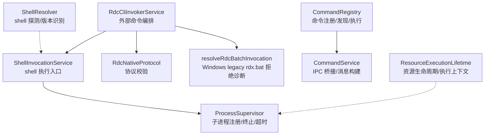
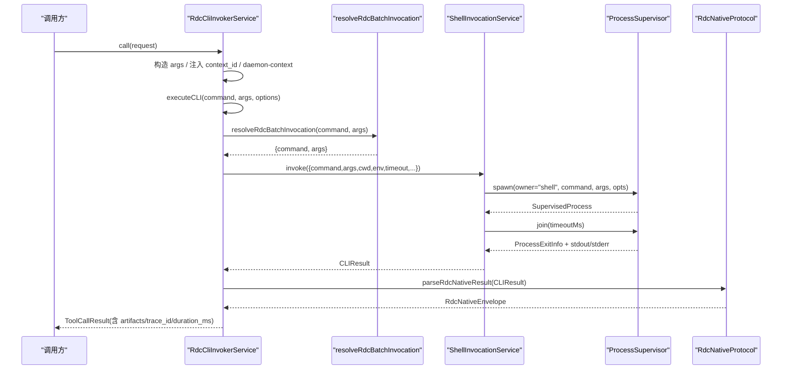
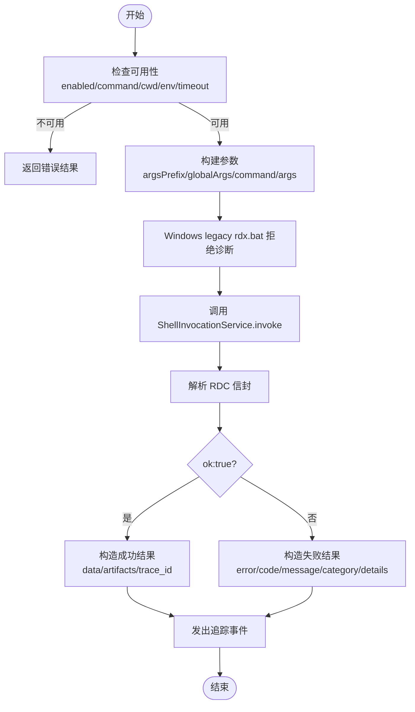
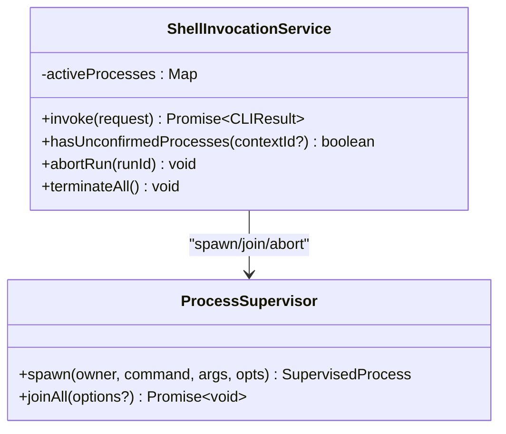
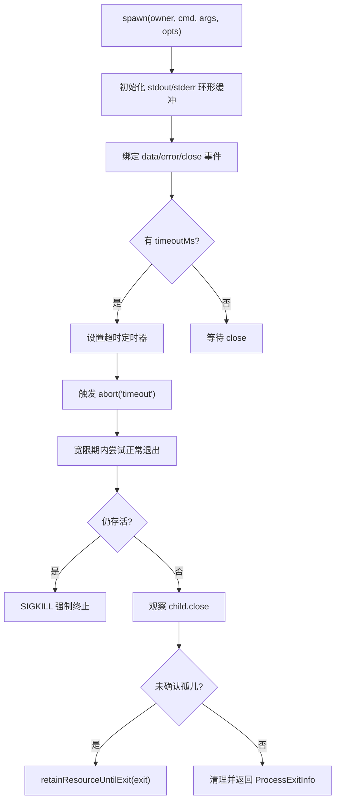
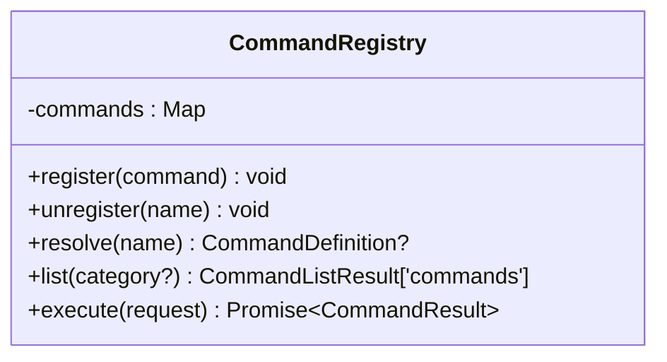
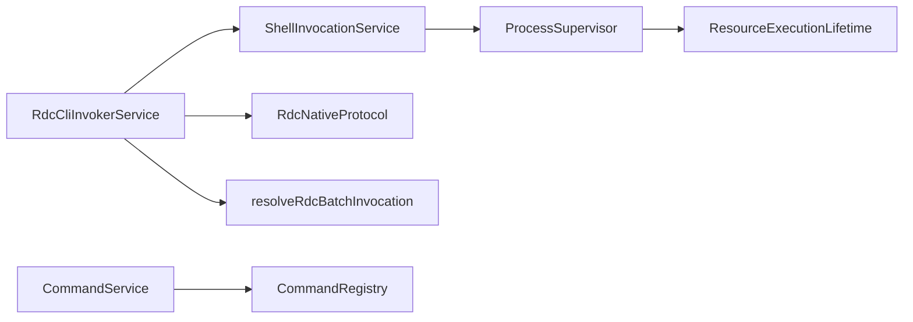
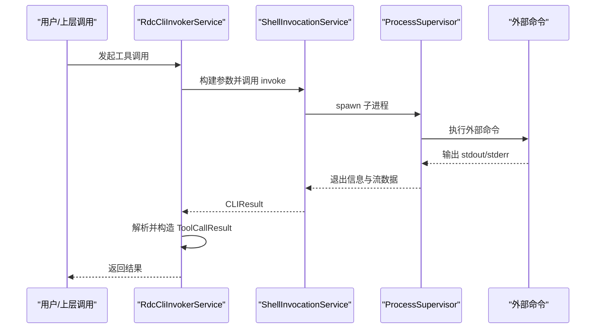
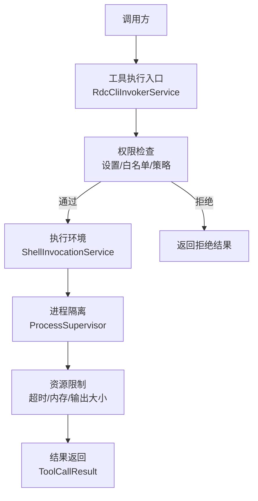

# 工具执行系统

<cite>
**本文引用的文件**
- [RdcCliInvokerService.ts](file://src/main/tools/RdcCliInvokerService.ts)
- [ShellInvocationService.ts](file://src/main/tools/ShellInvocationService.ts)
- [ProcessSupervisor.ts](file://src/main/runtime/ProcessSupervisor.ts)
- [CommandRegistry.ts](file://src/main/commands/CommandRegistry.ts)
- [CommandService.ts](file://src/main/commands/CommandService.ts)
- [RdcNativeProtocol.ts](file://src/main/tools/RdcNativeProtocol.ts)
- [resolveRdcBatchInvocation.ts](file://src/main/tools/resolveRdcBatchInvocation.ts)
- [ResourceExecutionLifetime.ts](file://src/main/runtime/ResourceExecutionLifetime.ts)
- [ShellResolver.ts](file://src/main/runtime/ShellResolver.ts)
- [RdcCliInvokerService.test.ts](file://src/main/tools/RdcCliInvokerService.test.ts)
- [ShellInvocationService.test.ts](file://src/main/tools/ShellInvocationService.test.ts)
</cite>

## 目录
1. [简介](#简介)
2. [项目结构](#项目结构)
3. [核心组件](#核心组件)
4. [架构总览](#架构总览)
5. [详细组件分析](#详细组件分析)
6. [依赖关系分析](#依赖关系分析)
7. [性能考虑](#性能考虑)
8. [故障排查指南](#故障排查指南)
9. [结论](#结论)
10. [附录](#附录)

## 简介
本文件系统聚焦于“工具执行子系统”，围绕以下目标展开：
- 深入解析 RdcCliInvokerService 的外部命令调用机制，包括进程管理、参数传递与输出处理。
- 详细说明 ShellInvocationService 的 shell 执行环境，涵盖进程隔离、超时控制、异常退出码映射与孤儿进程处理。
- 解释 CommandRegistry 的命令注册与发现机制，包括别名支持、分类列举与执行路由。
- 提供工具执行流程图与权限模型图，展示从工具调用到结果返回的完整过程。
- 总结安全考虑与性能优化建议。

## 项目结构
工具执行相关代码主要分布在 main 模块下：
- tools：封装外部 CLI 与 shell 执行能力（RdcCliInvokerService、ShellInvocationService）。
- runtime：进程生命周期与资源管理（ProcessSupervisor、ResourceExecutionLifetime），以及 shell 探测（ShellResolver）。
- commands：命令注册与执行桥接（CommandRegistry、CommandService）。
- shared/types：跨层共享的类型定义（如 ToolCatalog、CLIResult 等）。

图表来源
- [RdcCliInvokerService.ts:42-221](file://src/main/tools/RdcCliInvokerService.ts#L42-L221)
- [ShellInvocationService.ts:29-127](file://src/main/tools/ShellInvocationService.ts#L29-L127)
- [ProcessSupervisor.ts:140-425](file://src/main/runtime/ProcessSupervisor.ts#L140-L425)
- [RdcNativeProtocol.ts:1-35](file://src/main/tools/RdcNativeProtocol.ts#L1-L35)
- [resolveRdcBatchInvocation.ts:1-21](file://src/main/tools/resolveRdcBatchInvocation.ts#L1-L21)
- [CommandRegistry.ts:18-116](file://src/main/commands/CommandRegistry.ts#L18-L116)
- [CommandService.ts:17-74](file://src/main/commands/CommandService.ts#L17-L74)
- [ShellResolver.ts:84-288](file://src/main/runtime/ShellResolver.ts#L84-L288)
- [ResourceExecutionLifetime.ts:1-21](file://src/main/runtime/ResourceExecutionLifetime.ts#L1-L21)

章节来源
- [RdcCliInvokerService.ts:42-221](file://src/main/tools/RdcCliInvokerService.ts#L42-L221)
- [ShellInvocationService.ts:29-127](file://src/main/tools/ShellInvocationService.ts#L29-L127)
- [ProcessSupervisor.ts:140-425](file://src/main/runtime/ProcessSupervisor.ts#L140-L425)
- [CommandRegistry.ts:18-116](file://src/main/commands/CommandRegistry.ts#L18-L116)
- [CommandService.ts:17-74](file://src/main/commands/CommandService.ts#L17-L74)
- [RdcNativeProtocol.ts:1-35](file://src/main/tools/RdcNativeProtocol.ts#L1-L35)
- [resolveRdcBatchInvocation.ts:1-21](file://src/main/tools/resolveRdcBatchInvocation.ts#L1-L21)
- [ShellResolver.ts:84-288](file://src/main/runtime/ShellResolver.ts#L84-L288)
- [ResourceExecutionLifetime.ts:1-21](file://src/main/runtime/ResourceExecutionLifetime.ts#L1-L21)

## 核心组件
- RdcCliInvokerService：负责将上层工具调用转换为外部 rdc-tool CLI 命令，完成参数归一化、上下文注入、超时控制、结果解析与追踪事件上报。
- ShellInvocationService：统一封装 shell 执行，基于 ProcessSupervisor 启动子进程，处理 stdout/stderr、超时、信号、孤儿进程与取消。
- ProcessSupervisor：统一的子进程注册表，提供树杀、环形缓冲区、超时强制终止、未确认孤儿检测与优雅关闭。
- CommandRegistry：维护命令定义与别名，支持按类别列举、解析输入并路由执行。
- CommandService：在 IPC 层桥接命令执行，并将结果包装为对话消息。
- RdcNativeProtocol：对 rdc-tool CLI 的标准 JSON 信封进行严格校验，确保 ok:true、result_kind 与 data 存在，并校验 context_id 归属。
- resolveRdcBatchInvocation：在 Windows 平台检测 legacy rdx.bat 并返回拒绝诊断，不转发至 PowerShell 脚本。
- ShellResolver：跨平台探测可用 shell（PowerShell/zsh/bash/sh），生成非交互参数并缓存版本信息。
- ResourceExecutionLifetime：通过异步本地存储跟踪当前执行上下文，保证资源在进程退出前不被提前释放。

章节来源
- [RdcCliInvokerService.ts:42-367](file://src/main/tools/RdcCliInvokerService.ts#L42-L367)
- [ShellInvocationService.ts:29-127](file://src/main/tools/ShellInvocationService.ts#L29-L127)
- [ProcessSupervisor.ts:140-425](file://src/main/runtime/ProcessSupervisor.ts#L140-L425)
- [CommandRegistry.ts:18-116](file://src/main/commands/CommandRegistry.ts#L18-L116)
- [CommandService.ts:17-74](file://src/main/commands/CommandService.ts#L17-L74)
- [RdcNativeProtocol.ts:1-35](file://src/main/tools/RdcNativeProtocol.ts#L1-L35)
- [resolveRdcBatchInvocation.ts:1-21](file://src/main/tools/resolveRdcBatchInvocation.ts#L1-L21)
- [ShellResolver.ts:84-288](file://src/main/runtime/ShellResolver.ts#L84-L288)
- [ResourceExecutionLifetime.ts:1-21](file://src/main/runtime/ResourceExecutionLifetime.ts#L1-L21)

## 架构总览
下图展示了从工具调用到外部命令执行的端到端流程，包含参数组装、shell 执行、进程管理与结果回传。

图表来源
- [RdcCliInvokerService.ts:248-355](file://src/main/tools/RdcCliInvokerService.ts#L248-L355)
- [resolveRdcBatchInvocation.ts:1-21](file://src/main/tools/resolveRdcBatchInvocation.ts#L1-L21)
- [ShellInvocationService.ts:32-105](file://src/main/tools/ShellInvocationService.ts#L32-L105)
- [ProcessSupervisor.ts:167-394](file://src/main/runtime/ProcessSupervisor.ts#L167-L394)
- [RdcNativeProtocol.ts:12-34](file://src/main/tools/RdcNativeProtocol.ts#L12-L34)

## 详细组件分析

### RdcCliInvokerService：外部命令编排与结果处理
- 可用性检查：根据设置项判断是否启用、命令是否存在、工作目录与超时配置是否有效。
- 参数归一化：将 --context-id 转换为 --daemon-context；合并全局参数与前缀参数。
- 上下文注入：自动注入 context_id、runtime_owner、owner_lease_id 等运行时元数据。
- 批量调用适配：在 Windows 上拒绝 legacy rdx.bat，不转发到 PowerShell 脚本执行。
- 结果解析：使用 RdcNativeProtocol 校验标准信封，区分成功与失败路径，构造 ToolCallResult 并触发追踪事件。
- 生命周期：支持 abortRun/terminateAll 透传到 ShellInvocationService。

图表来源
- [RdcCliInvokerService.ts:49-221](file://src/main/tools/RdcCliInvokerService.ts#L49-L221)
- [RdcCliInvokerService.ts:248-355](file://src/main/tools/RdcCliInvokerService.ts#L248-L355)
- [resolveRdcBatchInvocation.ts:1-21](file://src/main/tools/resolveRdcBatchInvocation.ts#L1-L21)
- [RdcNativeProtocol.ts:12-34](file://src/main/tools/RdcNativeProtocol.ts#L12-L34)

章节来源
- [RdcCliInvokerService.ts:42-367](file://src/main/tools/RdcCliInvokerService.ts#L42-L367)
- [RdcCliInvokerService.test.ts:1-48](file://src/main/tools/RdcCliInvokerService.test.ts#L1-L48)

### ShellInvocationService：shell 执行环境与隔离
- 执行入口：接收 command/args/cwd/env/timeout/runId/contextId/abortSignal。
- 进程创建：通过 ProcessSupervisor.spawn 创建受管进程，设置环境变量（如 PYTHONIOENCODING）、隐藏窗口、隔离进程组（非 Windows）。
- 输出与状态：收集 stdout/stderr，处理 spawn_failed、timeout、unconfirmed_orphan 等退出原因。
- 退出码映射：将信号退出映射为 128+signal，缺失时默认失败。
- 生命周期：记录活跃进程，支持按 runId 中止与全部终止；清理孤儿进程。

图表来源
- [ShellInvocationService.ts:29-127](file://src/main/tools/ShellInvocationService.ts#L29-L127)
- [ProcessSupervisor.ts:140-425](file://src/main/runtime/ProcessSupervisor.ts#L140-L425)

章节来源
- [ShellInvocationService.ts:29-127](file://src/main/tools/ShellInvocationService.ts#L29-L127)
- [ShellInvocationService.test.ts:1-43](file://src/main/tools/ShellInvocationService.test.ts#L1-L43)

### ProcessSupervisor：进程管理与资源限制
- 进程注册：每个子进程分配唯一 id，记录 owner、pid、startedAt、stdout/stderr 环形缓冲。
- 树杀策略：POSIX 使用进程组 kill(-pid)，Windows 使用 taskkill /T /F。
- 超时与强制终止：先 SIGTERM，等待宽限期后 SIGKILL；若未观察到 close，标记 unconfirmed_orphan。
- 取消支持：监听 AbortSignal，立即触发 abort(reason)。
- 资源保留：结合 ResourceExecutionLifetime，确保在退出观察前不释放资源。

图表来源
- [ProcessSupervisor.ts:167-394](file://src/main/runtime/ProcessSupervisor.ts#L167-L394)
- [ResourceExecutionLifetime.ts:1-21](file://src/main/runtime/ResourceExecutionLifetime.ts#L1-L21)

章节来源
- [ProcessSupervisor.ts:140-425](file://src/main/runtime/ProcessSupervisor.ts#L140-L425)
- [ResourceExecutionLifetime.ts:1-21](file://src/main/runtime/ResourceExecutionLifetime.ts#L1-L21)

### CommandRegistry：命令注册与发现
- 注册与注销：支持同名覆盖、别名注册与注销。
- 解析与执行：解析 "/command args" 输入，查找命令并执行，捕获异常并返回错误信息。
- 列表与分类：去重列出所有命令，支持按 category 过滤，便于 UI 自动补全。

图表来源
- [CommandRegistry.ts:18-116](file://src/main/commands/CommandRegistry.ts#L18-L116)

章节来源
- [CommandRegistry.ts:18-116](file://src/main/commands/CommandRegistry.ts#L18-L116)
- [CommandService.ts:17-74](file://src/main/commands/CommandService.ts#L17-L74)

### ShellResolver：shell 探测与版本识别
- 候选选择：优先 PowerShell 7（pwsh），其次 Windows PowerShell 5.1，再回退到 POSIX sh。
- 版本探测：对 pwsh/powershell 执行版本查询；对 zsh/bash/sh 执行最小探针。
- 安全过滤：拒绝不支持的交互式 shell（fish/csh/nu 等）与 WindowsApps 占位符。
- 非交互参数：为不同 shell 生成可靠的非交互执行参数。

章节来源
- [ShellResolver.ts:84-288](file://src/main/runtime/ShellResolver.ts#L84-L288)

## 依赖关系分析
- RdcCliInvokerService 依赖 ShellInvocationService 执行外部命令，依赖 RdcNativeProtocol 校验响应，依赖 resolveRdcBatchInvocation 做 Windows 兼容。
- ShellInvocationService 依赖 ProcessSupervisor 管理子进程生命周期。
- CommandService 依赖 CommandRegistry 执行命令并构建系统消息。
- ProcessSupervisor 依赖 ResourceExecutionLifetime 保持资源直到退出被观察。

图表来源
- [RdcCliInvokerService.ts:42-367](file://src/main/tools/RdcCliInvokerService.ts#L42-L367)
- [ShellInvocationService.ts:29-127](file://src/main/tools/ShellInvocationService.ts#L29-L127)
- [ProcessSupervisor.ts:140-425](file://src/main/runtime/ProcessSupervisor.ts#L140-L425)
- [CommandService.ts:17-74](file://src/main/commands/CommandService.ts#L17-L74)
- [CommandRegistry.ts:18-116](file://src/main/commands/CommandRegistry.ts#L18-L116)
- [RdcNativeProtocol.ts:1-35](file://src/main/tools/RdcNativeProtocol.ts#L1-L35)
- [resolveRdcBatchInvocation.ts:1-21](file://src/main/tools/resolveRdcBatchInvocation.ts#L1-L21)
- [ResourceExecutionLifetime.ts:1-21](file://src/main/runtime/ResourceExecutionLifetime.ts#L1-L21)

章节来源
- [RdcCliInvokerService.ts:42-367](file://src/main/tools/RdcCliInvokerService.ts#L42-L367)
- [ShellInvocationService.ts:29-127](file://src/main/tools/ShellInvocationService.ts#L29-L127)
- [ProcessSupervisor.ts:140-425](file://src/main/runtime/ProcessSupervisor.ts#L140-L425)
- [CommandService.ts:17-74](file://src/main/commands/CommandService.ts#L17-L74)
- [CommandRegistry.ts:18-116](file://src/main/commands/CommandRegistry.ts#L18-L116)
- [RdcNativeProtocol.ts:1-35](file://src/main/tools/RdcNativeProtocol.ts#L1-L35)
- [resolveRdcBatchInvocation.ts:1-21](file://src/main/tools/resolveRdcBatchInvocation.ts#L1-L21)
- [ResourceExecutionLifetime.ts:1-21](file://src/main/runtime/ResourceExecutionLifetime.ts#L1-L21)

## 性能考虑
- 环形缓冲：ProcessSupervisor 使用固定大小的 stdout/stderr 环形缓冲，避免大输出导致内存膨胀。
- 超时与强制终止：合理设置 timeoutMs，配合宽限期与 SIGKILL，防止僵尸进程占用资源。
- 进程组隔离：在非 Windows 平台使用 detached 进程组，便于快速终止整个进程树。
- 参数归一化与最小化：减少不必要的参数传递，降低子进程启动开销。
- 缓存 shell 探测：ShellResolver 缓存已探测的 shell 版本，避免重复探测带来的额外开销。
- 批量调用适配：Windows 上拒绝 legacy rdx.bat，不转为 PowerShell 脚本执行。

[本节为通用指导，无需特定文件引用]

## 故障排查指南
- 命令不可用：检查 RdcCliInvokerService 的可用性判断（enabled、command、workingDirectory、timeoutMs），必要时调整设置。
- 进程启动失败：关注 ShellInvocationService 的 spawn_failed 分支，查看 stderr 与错误信息。
- 超时问题：确认 timeoutMs 是否合理；若频繁超时，考虑优化外部命令或增加超时时间。
- 孤儿进程：当出现 unconfirmed_orphan，说明强制终止后未观察到 close；可通过 hasUnconfirmedProcesses 与 terminateAll 清理。
- 协议校验失败：RdcNativeProtocol 会校验 exitCode、JSON 格式、ok 字段、result_kind 与 data；失败时检查外部命令输出是否符合规范。
- 上下文不一致：当 response.context_id 与请求不一致，会抛出上下文不匹配错误，需确保 daemon 上下文正确传递。

章节来源
- [RdcCliInvokerService.ts:49-221](file://src/main/tools/RdcCliInvokerService.ts#L49-L221)
- [ShellInvocationService.ts:32-105](file://src/main/tools/ShellInvocationService.ts#L32-L105)
- [ProcessSupervisor.ts:251-394](file://src/main/runtime/ProcessSupervisor.ts#L251-L394)
- [RdcNativeProtocol.ts:12-34](file://src/main/tools/RdcNativeProtocol.ts#L12-L34)

## 结论
该工具执行系统通过分层设计实现了安全可控的外部命令执行：
- RdcCliInvokerService 负责高层编排与协议校验，确保调用语义清晰、结果可追溯。
- ShellInvocationService 与 ProcessSupervisor 提供稳健的进程管理，具备超时、信号、孤儿进程与资源保留能力。
- CommandRegistry 提供灵活的命令注册与发现机制，便于扩展与维护。
- 整体架构兼顾安全性与性能，适合在生产环境中运行需要执行外部工具的场景。

[本节为总结性内容，无需特定文件引用]

## 附录

### 工具执行流程图（端到端）

图表来源
- [RdcCliInvokerService.ts:248-355](file://src/main/tools/RdcCliInvokerService.ts#L248-L355)
- [ShellInvocationService.ts:32-105](file://src/main/tools/ShellInvocationService.ts#L32-L105)
- [ProcessSupervisor.ts:167-394](file://src/main/runtime/ProcessSupervisor.ts#L167-L394)

### 权限模型图（概念性）

[此图为概念性示意，不直接映射具体源码文件，故无图表来源]