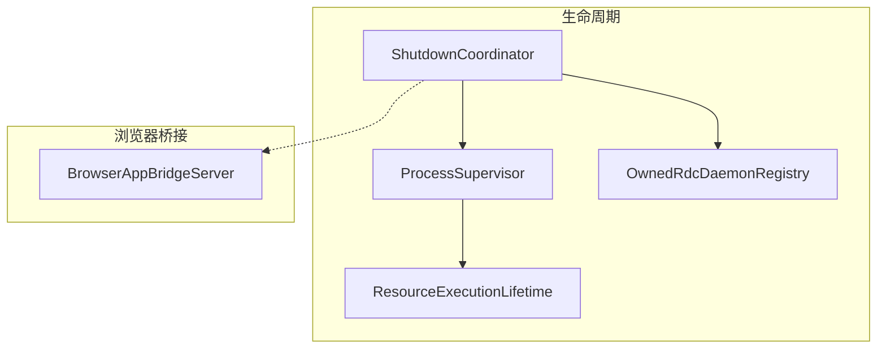
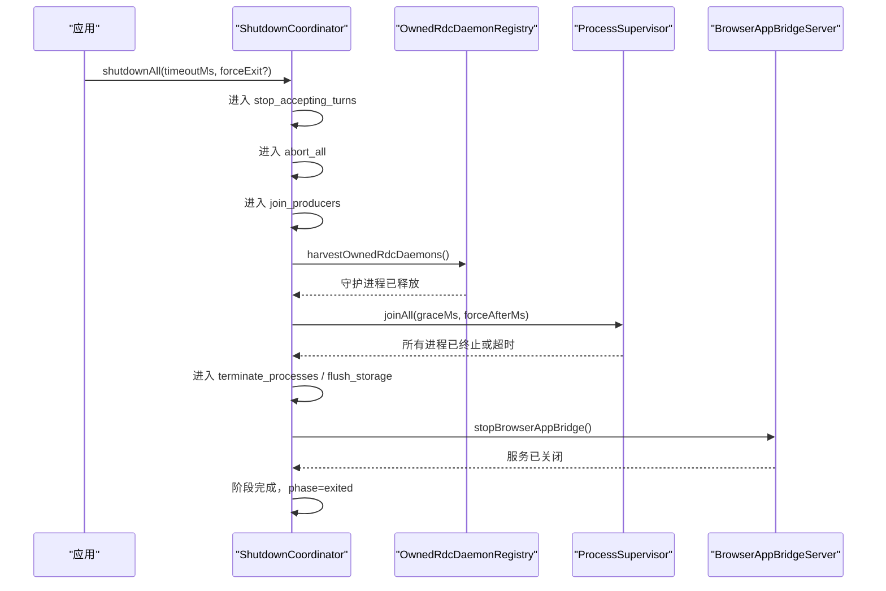
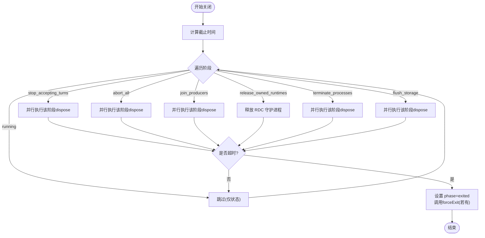
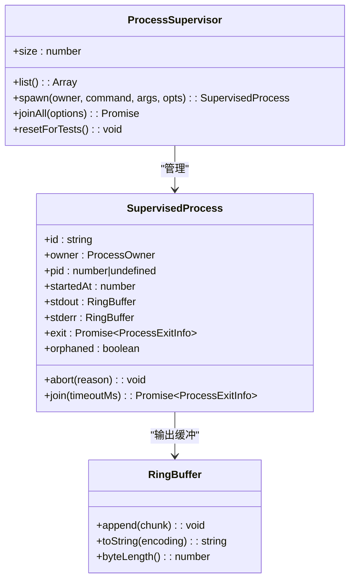
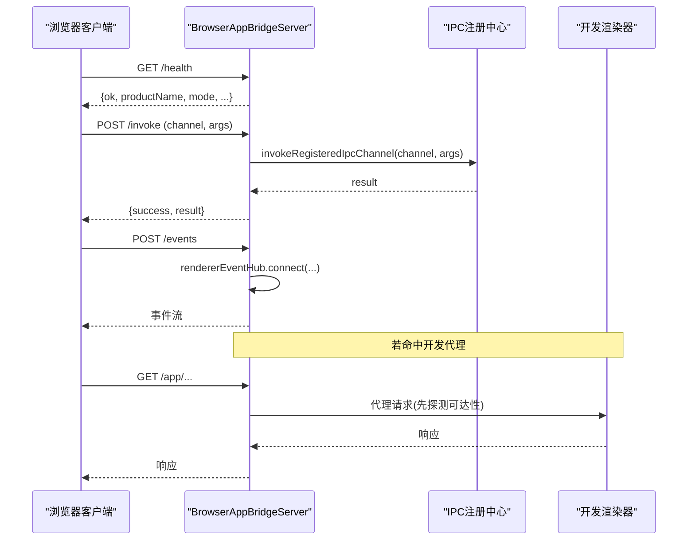
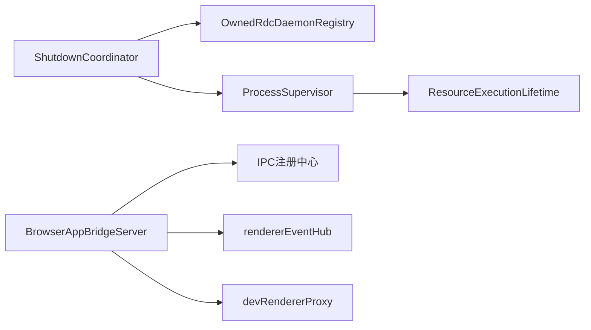
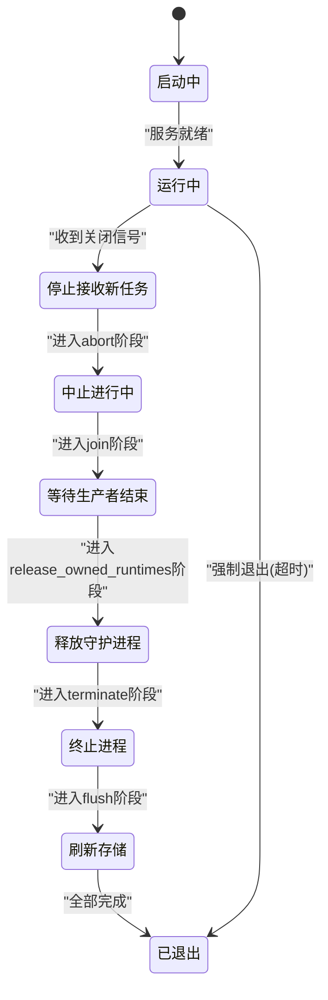
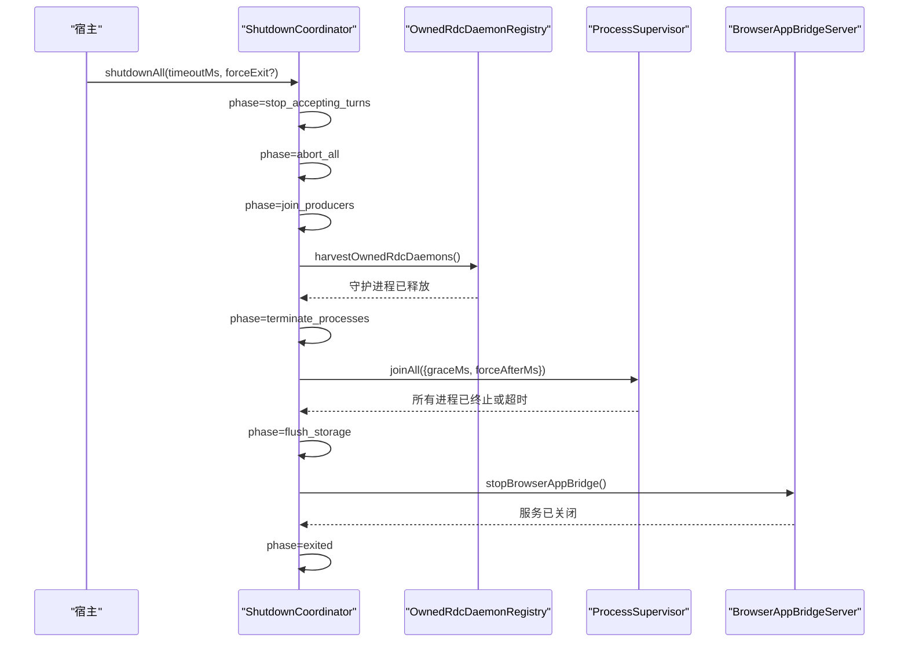

# 生命周期管理

<cite>
**本文引用的文件**
- [ShutdownCoordinator.ts](file://src/main/lifecycle/ShutdownCoordinator.ts)
- [ShutdownCoordinator.test.ts](file://src/main/lifecycle/ShutdownCoordinator.test.ts)
- [ProcessSupervisor.ts](file://src/main/runtime/ProcessSupervisor.ts)
- [ProcessSupervisor.test.ts](file://src/main/runtime/ProcessSupervisor.test.ts)
- [ResourceExecutionLifetime.ts](file://src/main/runtime/ResourceExecutionLifetime.ts)
- [BrowserAppBridgeServer.ts](file://src/main/browserAppBridge/BrowserAppBridgeServer.ts)
- [OwnedRdcDaemonRegistry.ts](file://src/main/sessions/OwnedRdcDaemonRegistry.ts)
</cite>

## 更新摘要
**所做更改**
- 更新了 ShutdownCoordinator 的阶段定义，新增 `release_owned_runtimes` 阶段
- 添加了 RDC 守护进程释放机制的详细说明
- 更新了关闭流程时序图以反映新的阶段顺序
- 增强了故障恢复与资源泄漏防护章节

## 目录
1. [简介](#简介)
2. [项目结构](#项目结构)
3. [核心组件](#核心组件)
4. [架构总览](#架构总览)
5. [详细组件分析](#详细组件分析)
6. [依赖关系分析](#依赖关系分析)
7. [性能考量](#性能考量)
8. [故障恢复与资源泄漏防护](#故障恢复与资源泄漏防护)
9. [结论](#结论)
10. [附录：状态图与流程图](#附录状态图与流程图)

## 简介
本文件聚焦应用的生命周期管理，围绕三个关键组件展开：
- ShutdownCoordinator：统一的优雅关闭协调器，负责阶段化清理、超时控制与强制退出。
- ProcessSupervisor：子进程统一注册与生命周期管理，支持监控、自动重启（由调用方驱动）、资源回收与树级终止。
- BrowserAppBridgeServer：浏览器桥接 HTTP 服务，提供健康检查、静态资源托管、IPC 转发、事件推送与开发渲染器代理。

文档将给出从启动到关闭的完整流程、状态转换、清理顺序、超时策略以及故障恢复与资源泄漏防护策略。

## 项目结构
生命周期相关代码主要分布在以下模块：
- src/main/lifecycle：关闭协调器实现与测试
- src/main/runtime：进程监管器、执行上下文资源保留工具
- src/main/browserAppBridge：浏览器桥接服务器实现
- src/main/sessions：RDC 守护进程所有权管理

图表来源
- [ShutdownCoordinator.ts:29-36](file://src/main/lifecycle/ShutdownCoordinator.ts#L29-L36)
- [ProcessSupervisor.ts:140-425](file://src/main/runtime/ProcessSupervisor.ts#L140-L425)
- [ResourceExecutionLifetime.ts:1-21](file://src/main/runtime/ResourceExecutionLifetime.ts#L1-L21)
- [OwnedRdcDaemonRegistry.ts:93-136](file://src/main/sessions/OwnedRdcDaemonRegistry.ts#L93-L136)
- [BrowserAppBridgeServer.ts:434-515](file://src/main/browserAppBridge/BrowserAppBridgeServer.ts#L434-L515)

章节来源
- [ShutdownCoordinator.ts:1-116](file://src/main/lifecycle/ShutdownCoordinator.ts#L1-L116)
- [ProcessSupervisor.ts:1-424](file://src/main/runtime/ProcessSupervisor.ts#L1-L424)
- [ResourceExecutionLifetime.ts:1-21](file://src/main/runtime/ResourceExecutionLifetime.ts#L1-L21)
- [OwnedRdcDaemonRegistry.ts:1-252](file://src/main/sessions/OwnedRdcDaemonRegistry.ts#L1-L252)
- [BrowserAppBridgeServer.ts:1-516](file://src/main/browserAppBridge/BrowserAppBridgeServer.ts#L1-L516)

## 核心组件
- ShutdownCoordinator
  - 职责：维护关闭阶段状态机；按固定顺序并行执行各阶段的 dispose；支持整体超时与强制退出回调；保证幂等关闭。
  - 关键能力：阶段化清理、依赖倒序（通过阶段顺序约束）、超时控制、失败隔离（单项失败不影响其他）。
- ProcessSupervisor
  - 职责：统一 spawn 子进程；维护进程注册表；提供 abort/join/joinAll；环形缓冲 stdout/stderr；跨平台树级终止；超时与强制终止。
  - 关键能力：进程监控、自动重启（由上层在 exit 后触发）、资源回收（joinAll）、孤儿进程保护。
- BrowserAppBridgeServer
  - 职责：启动本地 HTTP 服务；鉴权与 CORS；静态资源托管；/invoke 转发至 IPC；/events 事件推送；/health 健康检查；开发渲染器代理。
  - 关键能力：启动、连接管理（CORS/令牌/通道白名单）、断开处理（错误与超时）、优雅停止。
- OwnedRdcDaemonRegistry
  - 职责：管理应用拥有的 RDC 守护进程；记录守护进程元数据；提供守护进程的发现、停止和清理功能。
  - 关键能力：守护进程所有权跟踪、优雅停止、强制终止、残留进程清理。

章节来源
- [ShutdownCoordinator.ts:5-116](file://src/main/lifecycle/ShutdownCoordinator.ts#L5-L116)
- [ProcessSupervisor.ts:18-74](file://src/main/runtime/ProcessSupervisor.ts#L18-L74)
- [BrowserAppBridgeServer.ts:37-74](file://src/main/browserAppBridge/BrowserAppBridgeServer.ts#L37-L74)
- [OwnedRdcDaemonRegistry.ts:16-34](file://src/main/sessions/OwnedRdcDaemonRegistry.ts#L16-L34)

## 架构总览
应用生命周期分为"运行期"和"关闭期"。运行期由各个子系统独立管理自身资源；关闭期由 ShutdownCoordinator 统一调度，按阶段依次清理，确保依赖倒置与有序释放。

**更新** 新增了 `release_owned_runtimes` 阶段，确保在终止进程前正确释放 RDC 守护进程。

图表来源
- [ShutdownCoordinator.ts:67-90](file://src/main/lifecycle/ShutdownCoordinator.ts#L67-L90)
- [OwnedRdcDaemonRegistry.ts:93-136](file://src/main/sessions/OwnedRdcDaemonRegistry.ts#L93-L136)
- [ProcessSupervisor.ts:396-415](file://src/main/runtime/ProcessSupervisor.ts#L396-L415)
- [BrowserAppBridgeServer.ts:501-515](file://src/main/browserAppBridge/BrowserAppBridgeServer.ts#L501-L515)

## 详细组件分析

### ShutdownCoordinator：优雅关闭协调器
- 阶段定义与顺序
  - 运行态 running → stop_accepting_turns → abort_all → join_producers → **release_owned_runtimes** → terminate_processes → flush_storage → exited
  - 阶段顺序即"依赖倒序"，先停止接受新任务，再中止进行中任务，再等待生产者结束，**然后释放拥有的 RDC 守护进程**，最后终止进程与刷新存储。
- 超时与强制退出
  - 每个阶段剩余时间 = deadline - now；若剩余时间耗尽则跳过后续阶段并进入 exited。
  - 可选 forceExit 回调在 deadline 到达时触发，用于强制退出宿主进程。
- 容错与幂等
  - 同一时刻多次调用 shutdownAll 返回同一个 Promise，避免重复关闭。
  - 单个 disposable 抛出异常仅记录日志，不中断其他同阶段清理。

**更新** 新增的 `release_owned_runtimes` 阶段确保在终止进程前先释放 RDC 守护进程，防止守护进程成为孤儿进程。

图表来源
- [ShutdownCoordinator.ts:67-90](file://src/main/lifecycle/ShutdownCoordinator.ts#L67-L90)

章节来源
- [ShutdownCoordinator.ts:5-116](file://src/main/lifecycle/ShutdownCoordinator.ts#L5-L116)
- [ShutdownCoordinator.test.ts:4-90](file://src/main/lifecycle/ShutdownCoordinator.test.ts#L4-L90)

### ProcessSupervisor：进程管理与资源回收
- 进程注册与监控
  - spawn(owner, command, args, opts) 创建子进程并注册到内部 Map；stdout/stderr 使用 RingBuffer 限制内存占用。
  - 监听 error/close 事件，统一收敛为 exit Promise，附带 reason/code/signal/durationMs。
- 终止策略
  - abort(reason)：优先 SIGTERM 优雅终止，随后 DEFAULT_GRACE_MS 后升级为 SIGKILL（Windows 使用 taskkill /T /F）。
  - join(timeoutMs)：若未指定超时直接等待 exit；若指定超时则在到期后 abort，并观察 close；若仍未观察到 close，标记 orphaned 并返回 unconfirmed_orphan。
  - joinAll(options)：对所有进程发起 abort，然后并行 join 并设置全局超时，确保最终回收。
- 自动重启
  - 组件本身不提供重启逻辑；调用方可在 exit 完成后根据业务策略再次 spawn，从而实现"自动重启"。
- 资源回收与孤儿保护
  - 当 join 因超时触发 abort 且未观察到 close，会调用 retainResourceUntilExit(exitPromise)，使当前执行上下文保持引用直到进程真正退出，防止资源提前释放。

图表来源
- [ProcessSupervisor.ts:51-74](file://src/main/runtime/ProcessSupervisor.ts#L51-L74)
- [ProcessSupervisor.ts:140-424](file://src/main/runtime/ProcessSupervisor.ts#L140-L424)

章节来源
- [ProcessSupervisor.ts:1-424](file://src/main/runtime/ProcessSupervisor.ts#L1-L424)
- [ProcessSupervisor.test.ts:1-87](file://src/main/runtime/ProcessSupervisor.test.ts#L1-L87)
- [ResourceExecutionLifetime.ts:1-21](file://src/main/runtime/ResourceExecutionLifetime.ts#L1-L21)

### OwnedRdcDaemonRegistry：RDC 守护进程管理
- 守护进程所有权跟踪
  - rememberOwnedRdcDaemon：记录应用拥有的 RDC 守护进程信息，包括 contextId、PID、启动时间等。
  - forgetOwnedRdcDaemon：在守护进程成功停止后移除记录。
  - listOwnedRdcDaemons：列出所有记录的守护进程。
- 守护进程发现与清理
  - harvestOwnedRdcDaemons：扫描中间目录发现守护进程，尝试优雅停止，失败时强制终止。
  - stopOwnedDaemon：通过 CLI 命令停止守护进程，验证上下文匹配性。
  - killVerifiedOwnedPids：验证并强制终止残留的守护进程和 worker 进程。
- 安全验证
  - isAppRdcContextId：验证 contextId 格式符合应用拥有的守护进程规范。
  - 命令行验证：确保目标 PID 确实是对应的守护进程或 worker。

**新增** 此组件在 `release_owned_runtimes` 阶段被调用，确保 RDC 守护进程在进程终止前正确关闭。

章节来源
- [OwnedRdcDaemonRegistry.ts:1-252](file://src/main/sessions/OwnedRdcDaemonRegistry.ts#L1-L252)

### BrowserAppBridgeServer：浏览器桥接服务生命周期
- 启动
  - startBrowserAppBridge(options)：校验环境变量 RDC_AGENT_BROWSER_QA=1；生成 bridgeToken/qaBootstrapToken；创建 HTTP Server；附加 WebSocket 代理；绑定端口（支持 EADDRINUSE 回退）；暴露 /health、/app、/assets、/invoke、/events 等路由。
  - 安全：CORS 白名单、同源校验、Bearer/Cookie 双因子鉴权、通道白名单、请求体大小限制。
- 连接管理
  - /events：建立 SSE 事件推送，基于 rendererEventHub.connect。
  - /invoke：校验 channel 与 body 大小，转发到 IPC 注册中心 invokeRegisteredIpcChannel。
  - /health：返回应用版本、指纹、模式、渲染器可达性等信息。
  - 开发渲染器代理：shouldProxyToDevRenderer 命中时，先探测目标可用性，再代理 HTTP/WebSocket。
- 断开处理
  - 请求错误统一捕获并返回 JSON 错误；超时与过大负载直接销毁流。
  - stopBrowserAppBridge()：清空全局状态并关闭 HTTP Server。

图表来源
- [BrowserAppBridgeServer.ts:335-428](file://src/main/browserAppBridge/BrowserAppBridgeServer.ts#L335-L428)
- [BrowserAppBridgeServer.ts:434-499](file://src/main/browserAppBridge/BrowserAppBridgeServer.ts#L434-L499)
- [BrowserAppBridgeServer.ts:501-515](file://src/main/browserAppBridge/BrowserAppBridgeServer.ts#L501-L515)

章节来源
- [BrowserAppBridgeServer.ts:1-516](file://src/main/browserAppBridge/BrowserAppBridgeServer.ts#L1-L516)

## 依赖关系分析
- ShutdownCoordinator 与 OwnedRdcDaemonRegistry
  - 关闭阶段 release_owned_runtimes 调用 OwnedRdcDaemonRegistry.harvestOwnedRdcDaemons，确保 RDC 守护进程在进程终止前正确释放。
- ShutdownCoordinator 与 ProcessSupervisor
  - 关闭阶段 terminate_processes 通常调用 ProcessSupervisor.joinAll，确保子进程被终止并回收。
- ProcessSupervisor 与 ResourceExecutionLifetime
  - 当进程超时强制终止但未观察到 close 时，通过 retainResourceUntilExit 延长当前执行上下文的存活期，避免资源过早释放。
- BrowserAppBridgeServer 与其他模块
  - 通过 invokeRegisteredIpcChannel 与 IPC 层交互；通过 rendererEventHub 进行事件广播；通过 devRendererProxy 代理开发渲染器流量。

**更新** 新增了 ShutdownCoordinator 与 OwnedRdcDaemonRegistry 之间的依赖关系。

图表来源
- [ShutdownCoordinator.ts:67-90](file://src/main/lifecycle/ShutdownCoordinator.ts#L67-L90)
- [OwnedRdcDaemonRegistry.ts:93-136](file://src/main/sessions/OwnedRdcDaemonRegistry.ts#L93-L136)
- [ProcessSupervisor.ts:396-415](file://src/main/runtime/ProcessSupervisor.ts#L396-L415)
- [ResourceExecutionLifetime.ts:1-21](file://src/main/runtime/ResourceExecutionLifetime.ts#L1-L21)
- [BrowserAppBridgeServer.ts:357-428](file://src/main/browserAppBridge/BrowserAppBridgeServer.ts#L357-L428)

章节来源
- [ShutdownCoordinator.ts:67-90](file://src/main/lifecycle/ShutdownCoordinator.ts#L67-L90)
- [OwnedRdcDaemonRegistry.ts:93-136](file://src/main/sessions/OwnedRdcDaemonRegistry.ts#L93-L136)
- [ProcessSupervisor.ts:396-415](file://src/main/runtime/ProcessSupervisor.ts#L396-L415)
- [BrowserAppBridgeServer.ts:357-428](file://src/main/browserAppBridge/BrowserAppBridgeServer.ts#L357-L428)

## 性能考量
- 阶段内并行清理：ShutdownCoordinator 对同阶段 dispose 使用 Promise.allSettled 并行执行，缩短关闭耗时。
- 环形缓冲：ProcessSupervisor 的 stdout/stderr 使用 RingBuffer 限制最大字节数，避免长输出导致内存增长。
- 超时与强制终止：各组件均提供超时机制，避免阻塞式等待导致整体卡死。
- 最小化 I/O：BrowserAppBridgeServer 对静态资源采用流式读取，减少内存峰值。
- 守护进程批量处理：OwnedRdcDaemonRegistry 使用批量方式处理多个守护进程，提高清理效率。

[本节为通用性能建议，不直接分析具体文件]

## 故障恢复与资源泄漏防护
- 阶段化清理的健壮性
  - 单个 dispose 抛错仅记录日志，不会中断其他清理任务。
- 守护进程释放的可靠性
  - OwnedRdcDaemonRegistry 提供双重保障：先尝试优雅停止，失败时强制终止残留进程。
  - 通过命令行验证确保只终止正确的守护进程和 worker 进程。
- 进程孤儿保护
  - 当 join 超时触发 abort 且未观察到 close，标记 orphaned 并通过 retainResourceUntilExit 延长当前执行上下文，确保资源不被提前释放。
- 强制退出兜底
  - ShutdownCoordinator 支持 forceExit 回调，在 deadline 到达时强制结束宿主进程，避免僵尸进程。
- 服务停止的安全性
  - BrowserAppBridgeServer 停止时清空全局状态并关闭 HTTP Server，避免残留句柄。

**更新** 增强了守护进程释放的可靠性说明，确保 RDC 守护进程不会成为孤儿进程。

章节来源
- [ShutdownCoordinator.ts:89-112](file://src/main/lifecycle/ShutdownCoordinator.ts#L89-L112)
- [OwnedRdcDaemonRegistry.ts:138-203](file://src/main/sessions/OwnedRdcDaemonRegistry.ts#L138-L203)
- [ProcessSupervisor.ts:302-343](file://src/main/runtime/ProcessSupervisor.ts#L302-L343)
- [ResourceExecutionLifetime.ts:5-8](file://src/main/runtime/ResourceExecutionLifetime.ts#L5-L8)
- [BrowserAppBridgeServer.ts:501-515](file://src/main/browserAppBridge/BrowserAppBridgeServer.ts#L501-L515)

## 结论
本生命周期方案通过四个阶段协同工作，实现了可预测、可控、可观测的应用启停：
- ShutdownCoordinator 以阶段化、带超时的方式组织关闭流程，确保依赖倒序与幂等。
- **OwnedRdcDaemonRegistry 确保 RDC 守护进程在进程终止前正确释放，防止守护进程成为孤儿进程。**
- ProcessSupervisor 提供健壮的进程生命周期管理，包含监控、终止、回收与孤儿保护。
- BrowserAppBridgeServer 提供安全的浏览器桥接服务，具备完善的鉴权、限流与代理能力，并在关闭时彻底释放资源。
结合上述机制，系统能够在正常关闭与异常场景下均保持稳定与一致性，有效降低资源泄漏风险。

**更新** 强调了 RDC 守护进程管理在生命周期中的重要作用。

[本节为总结性内容，不直接分析具体文件]

## 附录：状态图与流程图

### 应用生命周期状态图（概念）

**更新** 新增了 `release_owned_runtimes` 状态节点。

[此图为概念示意，不对应具体源码结构]

### 关闭流程时序图（含组件交互）

**更新** 新增了 OwnedRdcDaemonRegistry 在关闭流程中的作用。

图表来源
- [ShutdownCoordinator.ts:67-90](file://src/main/lifecycle/ShutdownCoordinator.ts#L67-L90)
- [OwnedRdcDaemonRegistry.ts:93-136](file://src/main/sessions/OwnedRdcDaemonRegistry.ts#L93-L136)
- [ProcessSupervisor.ts:396-415](file://src/main/runtime/ProcessSupervisor.ts#L396-L415)
- [BrowserAppBridgeServer.ts:501-515](file://src/main/browserAppBridge/BrowserAppBridgeServer.ts#L501-L515)