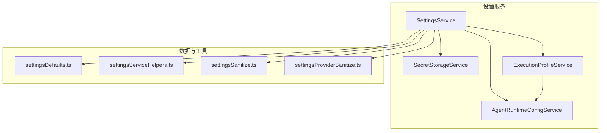
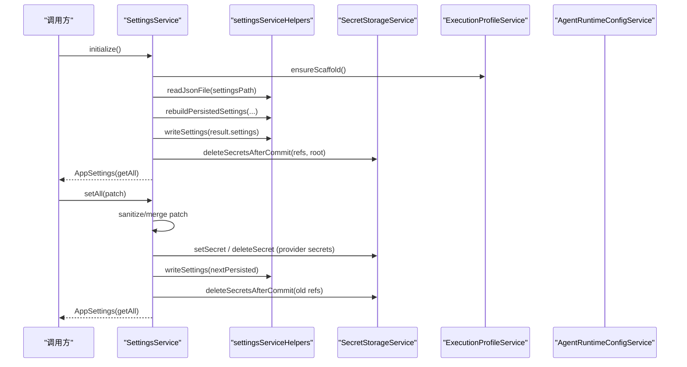
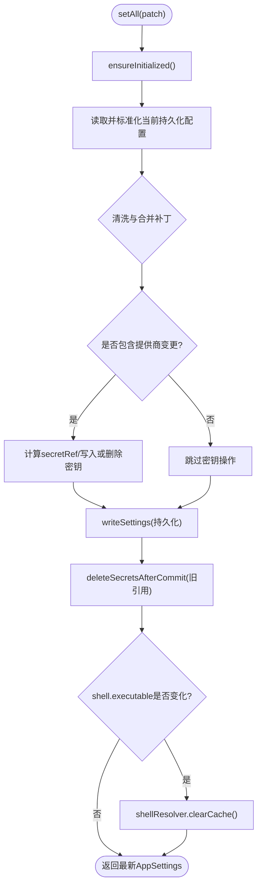
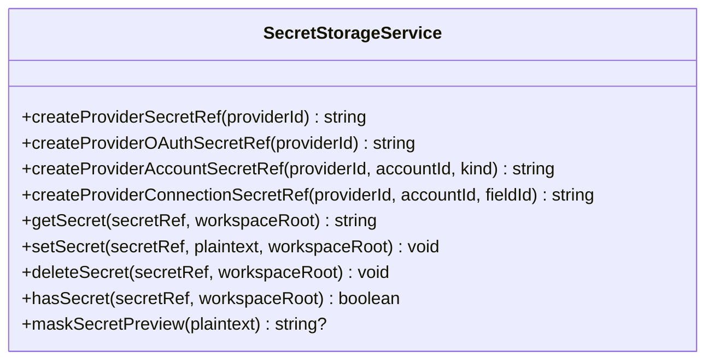
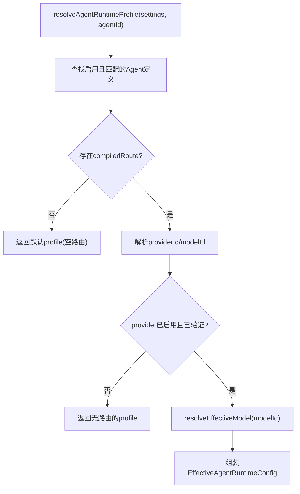
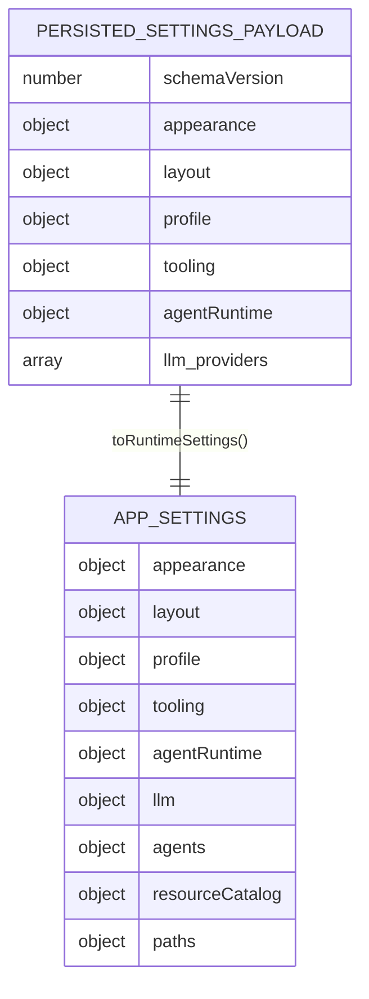
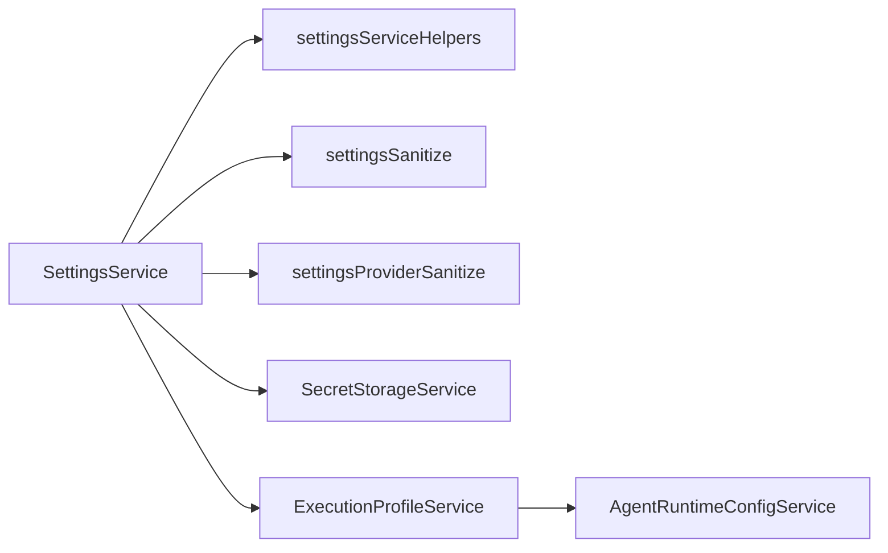

# 设置管理服务

<cite>
**本文引用的文件**
- [SettingsService.ts](file://src/main/settings/SettingsService.ts)
- [SecretStorageService.ts](file://src/main/settings/SecretStorageService.ts)
- [ExecutionProfileService.ts](file://src/main/settings/ExecutionProfileService.ts)
- [settingsDefaults.ts](file://src/main/settings/settingsDefaults.ts)
- [settingsServiceHelpers.ts](file://src/main/settings/settingsServiceHelpers.ts)
- [settingsSanitize.ts](file://src/main/settings/settingsSanitize.ts)
- [settingsProviderSanitize.ts](file://src/main/settings/settingsProviderSanitize.ts)
- [AgentRuntimeConfigService.ts](file://src/main/settings/AgentRuntimeConfigService.ts)
</cite>

## 目录
1. [简介](#简介)
2. [项目结构](#项目结构)
3. [核心组件](#核心组件)
4. [架构总览](#架构总览)
5. [详细组件分析](#详细组件分析)
6. [依赖关系分析](#依赖关系分析)
7. [性能考量](#性能考量)
8. [故障排查指南](#故障排查指南)
9. [结论](#结论)
10. [附录](#附录)

## 简介
本文件聚焦于 RDC-Agent 的设置管理系统，围绕以下目标展开：
- SettingsService 的配置加载、校验、持久化与“热更新”机制
- SecretStorageService 的敏感信息加密存储、访问控制与安全审计
- ExecutionProfileService 的执行配置文件管理（模板、环境适配、版本兼容）
- 提供配置结构图与变更流程图，展示设置的完整生命周期
- 给出最佳实践与安全建议

## 项目结构
设置管理相关代码集中在 src/main/settings 目录下，采用“服务 + 辅助工具”的分层组织方式：
- 服务层：SettingsService、SecretStorageService、ExecutionProfileService、AgentRuntimeConfigService
- 数据与默认值：settingsDefaults.ts
- 读写与迁移：settingsServiceHelpers.ts
- 校验与清洗：settingsSanitize.ts、settingsProviderSanitize.ts

图表来源
- [SettingsService.ts:94-139](file://src/main/settings/SettingsService.ts#L94-L139)
- [SecretStorageService.ts:72-144](file://src/main/settings/SecretStorageService.ts#L72-L144)
- [ExecutionProfileService.ts:11-68](file://src/main/settings/ExecutionProfileService.ts#L11-L68)
- [settingsServiceHelpers.ts:176-355](file://src/main/settings/settingsServiceHelpers.ts#L176-L355)
- [settingsSanitize.ts:146-278](file://src/main/settings/settingsSanitize.ts#L146-L278)
- [settingsProviderSanitize.ts:474-672](file://src/main/settings/settingsProviderSanitize.ts#L474-L672)

章节来源
- [SettingsService.ts:94-139](file://src/main/settings/SettingsService.ts#L94-L139)
- [settingsServiceHelpers.ts:176-355](file://src/main/settings/settingsServiceHelpers.ts#L176-L355)

## 核心组件
- SettingsService：应用配置的入口服务，负责初始化、读取、合并、校验、持久化、窗口布局快速写入、提供商凭据处理、代理路由编译等。
- SecretStorageService：基于 Electron safeStorage 的敏感信息存储，提供加解密、文件权限加固、损坏隔离、掩码预览等能力。
- ExecutionProfileService：根据当前设置解析执行所需的 Agent 运行时配置（系统提示、模型、工具白名单、技能、MCP 服务器等），并生成诊断。
- AgentRuntimeConfigService：扫描内置/用户/项目级资源（技能、MCP 描述符），提供清单与可见性过滤。

章节来源
- [SettingsService.ts:94-518](file://src/main/settings/SettingsService.ts#L94-L518)
- [SecretStorageService.ts:1-262](file://src/main/settings/SecretStorageService.ts#L1-L262)
- [ExecutionProfileService.ts:1-69](file://src/main/settings/ExecutionProfileService.ts#L1-L69)
- [AgentRuntimeConfigService.ts:61-237](file://src/main/settings/AgentRuntimeConfigService.ts#L61-L237)

## 架构总览
设置管理的整体流程如下：
- 启动时通过 SettingsService.initialize 完成路径初始化、执行配置脚手架确保、读取并重建持久化配置、清理废弃密钥。
- 读路径 getAll/toRuntimeSettings 将持久化配置标准化、注入提供商凭据、合并资源目录与代理路由，输出运行时 AppSettings。
- 写路径 setAll 对补丁进行严格清洗、合并、保存，并在必要时触发 shell 解析器缓存刷新与旧密钥清理。
- 窗口布局采用快速写入接口，避免全量 provider 归一化开销。
- 敏感信息统一由 SecretStorageService 管理，仅以引用形式存在于设置元数据中。

图表来源
- [SettingsService.ts:103-139](file://src/main/settings/SettingsService.ts#L103-L139)
- [SettingsService.ts:249-383](file://src/main/settings/SettingsService.ts#L249-L383)
- [settingsServiceHelpers.ts:176-355](file://src/main/settings/settingsServiceHelpers.ts#L176-L355)
- [SecretStorageService.ts:146-247](file://src/main/settings/SecretStorageService.ts#L146-L247)

## 详细组件分析

### SettingsService — 配置加载、验证、持久化与热更新
- 初始化与重建
  - 初始化运行时路径，确保执行配置脚手架存在。
  - 读取持久化配置，断言 schemaVersion 不高于当前支持版本，执行硬重建以修复历史遗留问题并清理废弃密钥。
- 读取与转换
  - getAll 读取持久化配置，标准化为 NormalizedPersistedSettings，再转换为运行时 AppSettings，期间会注入提供商凭据、资源目录与代理路由。
- 写入与合并
  - setAll 接收 AppSettingsPatch，逐项清洗与合并（外观、布局、工具、代理运行时权限/上下文、LLM 提供商）。
  - 对 API Key 模式：若检测到新密钥或账户变化，则生成新的 secretRef 并写入 SecretStorageService；同时标记旧引用待删除。
  - 对 OAuth/Account 模式：通过 ProviderConnectionSchema 与连接字段校验，决定是否满足连接要求。
  - 写入完成后，清理被替换的旧密钥，并返回最新的全量设置。
- 窗口布局快速写入
  - persistWindowLayout/persistWindowLayoutAsync 仅针对 layout.window 做最小化增量写入，跳过 provider 归一化与密钥水合，降低高频写入成本。
- “热更新”行为
  - 设置变更后立即返回最新的 AppSettings，供上层消费；部分影响运行时的配置（如 shell 可执行路径）会触发关联服务缓存失效（例如 shellResolver.clearCache）。

图表来源
- [SettingsService.ts:249-383](file://src/main/settings/SettingsService.ts#L249-L383)
- [settingsServiceHelpers.ts:327-355](file://src/main/settings/settingsServiceHelpers.ts#L327-L355)
- [settingsSanitize.ts:146-163](file://src/main/settings/settingsSanitize.ts#L146-L163)

章节来源
- [SettingsService.ts:103-139](file://src/main/settings/SettingsService.ts#L103-L139)
- [SettingsService.ts:249-383](file://src/main/settings/SettingsService.ts#L249-L383)
- [SettingsService.ts:212-247](file://src/main/settings/SettingsService.ts#L212-L247)
- [settingsServiceHelpers.ts:176-355](file://src/main/settings/settingsServiceHelpers.ts#L176-L355)
- [settingsSanitize.ts:146-278](file://src/main/settings/settingsSanitize.ts#L146-L278)

### SecretStorageService — 敏感信息处理
- 加密存储
  - 使用 Electron safeStorage 对明文进行加密后以 base64 编码存储在 provider-secrets.json 中。
  - 写入采用临时文件 + 原子重命名，保证幂等与一致性；写入后尝试 fsync 目录以确保落盘。
- 访问控制
  - 平台级权限加固：在类 Unix 上设置文件权限 0o600；在 Windows 上尝试使用 icacls 限制为当前用户完全控制。
  - 读取时对 encoding 字段进行校验，拒绝非 safeStorage 的条目，防止未知格式泄露。
- 安全审计与容错
  - 提供 maskSecretPreview 用于界面显示掩码。
  - 文件损坏时自动隔离到 .corrupt-{timestamp} 文件，抛出专用错误以便上层恢复。
  - 提供多种 ref 生成策略（provider api-key、oauth、account、connection field），便于细粒度隔离。
- 生命周期
  - setSecret/getSecret/deleteSecret/hasSecret 覆盖增删改查；copySecret 支持在同一工作区复制密钥记录。

图表来源
- [SecretStorageService.ts:72-262](file://src/main/settings/SecretStorageService.ts#L72-L262)

章节来源
- [SecretStorageService.ts:1-262](file://src/main/settings/SecretStorageService.ts#L1-L262)

### ExecutionProfileService — 执行配置文件管理
- 配置模板与环境适配
  - ensureScaffold 确保 Agent 运行时配置脚手架存在。
  - normalizeResourceCatalog 聚合可用技能与 MCP 服务器清单，作为运行时资源目录的一部分。
  - resolveAgentRuntimeProfile 根据当前设置与 Agent 定义，产出 EffectiveAgentRuntimeConfig（系统提示、提供商/模型、温度、工具白名单、技能、MCP 服务器等）。
- 版本兼容与诊断
  - getDiagnostics 检查是否存在已配置的提供商，若无则返回警告，提示无法执行 Agent。
  - 内部通过 settings.agents.definitions 中的 compiledRoute 解析有效模型，结合 EffectiveModelResolver 进行别名/可用性判定。

图表来源
- [ExecutionProfileService.ts:11-68](file://src/main/settings/ExecutionProfileService.ts#L11-L68)
- [settingsProviderSanitize.ts:742-767](file://src/main/settings/settingsProviderSanitize.ts#L742-L767)

章节来源
- [ExecutionProfileService.ts:1-69](file://src/main/settings/ExecutionProfileService.ts#L1-L69)
- [AgentRuntimeConfigService.ts:61-237](file://src/main/settings/AgentRuntimeConfigService.ts#L61-L237)

### 配置结构与数据流
- 持久化结构（PersistedSettingsPayload）
  - schemaVersion、appearance、layout、profile、tooling、agentRuntime、llm.providers
- 运行时结构（AppSettings）
  - 包含上述字段，以及 agents（definitions、modelOptions、globalInstructions、diagnostics）、resourceCatalog（skills/MCP/diagnostics）、paths 等
- 数据流
  - 读取：readJsonFile -> rebuildPersistedSettings/normalizePersistedSettings -> toRuntimeSettings（注入凭据、资源目录、代理路由）
  - 写入：sanitize/merge -> writeSettings -> 清理旧密钥 -> 返回最新 AppSettings

图表来源
- [settingsDefaults.ts:37-55](file://src/main/settings/settingsDefaults.ts#L37-L55)
- [settingsServiceHelpers.ts:357-408](file://src/main/settings/settingsServiceHelpers.ts#L357-L408)

章节来源
- [settingsDefaults.ts:33-193](file://src/main/settings/settingsDefaults.ts#L33-L193)
- [settingsServiceHelpers.ts:357-408](file://src/main/settings/settingsServiceHelpers.ts#L357-L408)

## 依赖关系分析
- SettingsService 依赖：
  - settingsServiceHelpers：JSON 读写、schema 版本断言、重建与标准化、写入与密钥清理
  - settingsSanitize：各子项的强类型清洗与边界约束
  - settingsProviderSanitize：提供商定义、认证模式、连接模式、模型集合的规范化与状态判定
  - SecretStorageService：敏感信息的加解密与存储
  - ExecutionProfileService：资源目录与执行配置
  - AgentRuntimeConfigService：技能与 MCP 清单
- 耦合与内聚
  - 高内聚：每个服务职责清晰，SecretStorageService 专注安全存储，ExecutionProfileService 专注执行配置
  - 低耦合：通过明确的输入输出类型与函数式工具（sanitize/normalize）解耦业务逻辑与 IO

图表来源
- [SettingsService.ts:34-90](file://src/main/settings/SettingsService.ts#L34-L90)
- [ExecutionProfileService.ts:1-68](file://src/main/settings/ExecutionProfileService.ts#L1-L68)

章节来源
- [SettingsService.ts:34-90](file://src/main/settings/SettingsService.ts#L34-L90)
- [ExecutionProfileService.ts:1-68](file://src/main/settings/ExecutionProfileService.ts#L1-L68)

## 性能考量
- 窗口布局快速写入：persistWindowLayout/persistWindowLayoutAsync 仅写入 window 布局，避免昂贵的 provider 归一化与密钥水合，适合高频事件（移动/调整大小）。
- 异步写入：writeSettingsAsync 使用 promises 与随机后缀临时文件，减少阻塞与冲突。
- 缓存失效：当 shell.executable 变化时主动清除 shellResolver 缓存，避免后续执行失败。
- 密钥清理：仅在必要时删除旧密钥引用，减少不必要的磁盘 IO。

[本节为通用性能讨论，无需特定文件分析]

## 故障排查指南
- 存储不可用
  - 现象：safeStorage 不可用导致无法存储凭证
  - 处理：抛出 SecretStorageUnavailableError，应提示用户或降级
  - 参考位置
    - [SecretStorageService.ts:38-42](file://src/main/settings/SecretStorageService.ts#L38-L42)
- 存储损坏
  - 现象：读取 provider-secrets.json 失败或结构异常
  - 处理：隔离到 .corrupt-{timestamp} 文件，抛出 SecretStoreCorruptError，附带 quarantinePath
  - 参考位置
    - [SecretStorageService.ts:77-85](file://src/main/settings/SecretStorageService.ts#L77-L85)
    - [SecretStorageService.ts:93-104](file://src/main/settings/SecretStorageService.ts#L93-L104)
- 版本不兼容
  - 现象：持久化配置 schemaVersion 高于当前支持版本
  - 处理：抛出 StorageSchemaError，阻止继续运行，需升级或回滚
  - 参考位置
    - [settingsServiceHelpers.ts:112-126](file://src/main/settings/settingsServiceHelpers.ts#L112-L126)
- 提供商未配置
  - 现象：无已配置的提供商，Agent 无法执行
  - 处理：ExecutionProfileService.getDiagnostics 返回 warning，提示缺少配置
  - 参考位置
    - [ExecutionProfileService.ts:44-52](file://src/main/settings/ExecutionProfileService.ts#L44-L52)

章节来源
- [SecretStorageService.ts:38-104](file://src/main/settings/SecretStorageService.ts#L38-L104)
- [settingsServiceHelpers.ts:112-126](file://src/main/settings/settingsServiceHelpers.ts#L112-L126)
- [ExecutionProfileService.ts:44-52](file://src/main/settings/ExecutionProfileService.ts#L44-L52)

## 结论
RDC-Agent 的设置管理系统以 SettingsService 为核心，配合 SecretStorageService 的安全存储与 ExecutionProfileService 的执行配置解析，形成从加载、校验、持久化到热更新的完整闭环。通过严格的清洗与标准化、原子写入与损坏隔离、以及细粒度的密钥引用管理，系统在安全性、可靠性与性能之间取得良好平衡。建议在集成与扩展时遵循现有模式，保持配置结构的稳定演进与向后兼容。

[本节为总结，无需特定文件分析]

## 附录

### 最佳实践
- 始终通过 SettingsService 提供的接口进行设置读写，避免直接操作 JSON 文件
- 使用 sanitize 工具链对输入进行强类型清洗，确保边界安全
- 敏感信息一律通过 SecretStorageService 管理，不在设置文件中保留明文
- 对高频写入场景优先使用快速写入接口（如窗口布局）
- 在修改 shell.executable 等关键路径时，注意触发相关缓存失效

### 安全建议
- 定期备份 provider-secrets.json 所在目录，并确保操作系统级权限正确
- 谨慎处理损坏的密钥文件，先隔离再恢复，避免污染主文件
- 对来自外部的配置输入进行严格校验，拒绝未知或危险字段
- 在日志与调试输出中避免打印敏感信息，使用掩码预览替代

[本节为通用指导，无需特定文件分析]