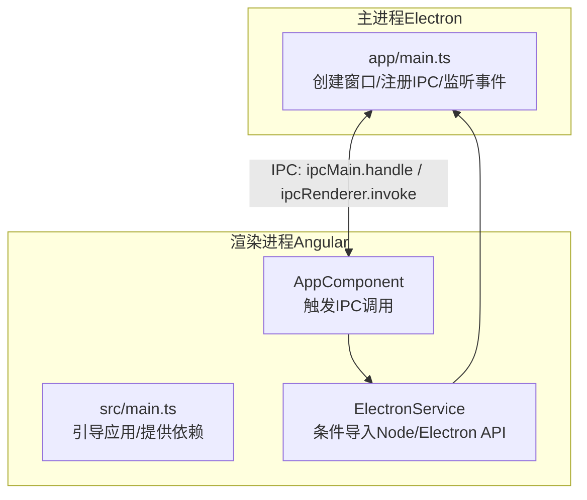
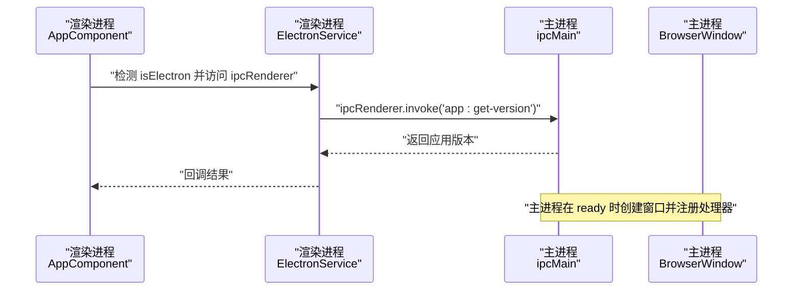
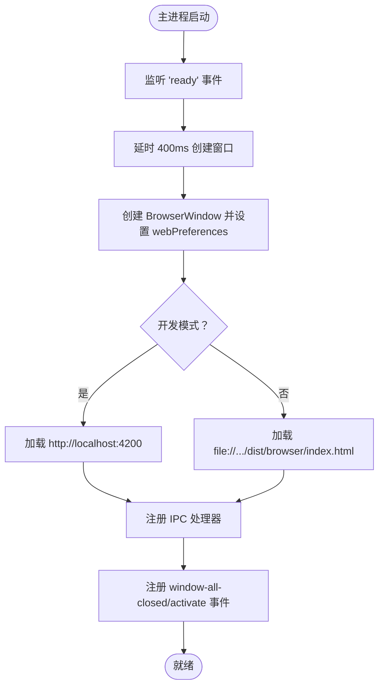
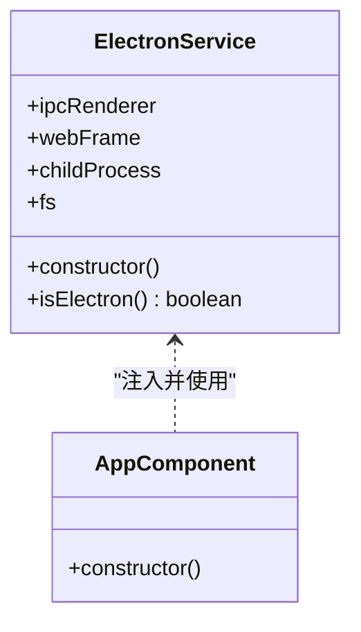
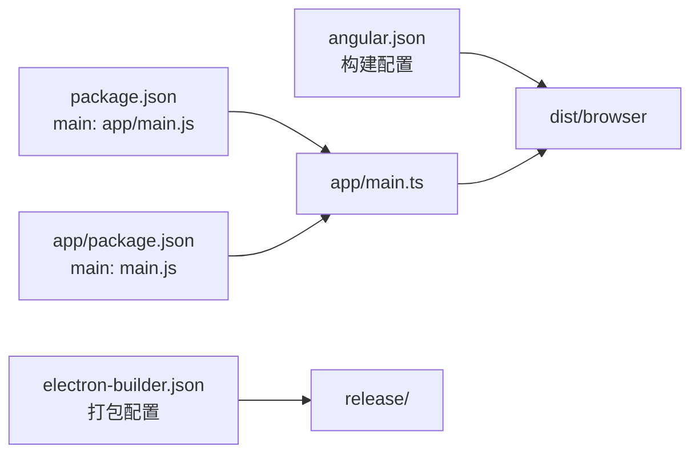

# 双进程架构

<cite>
**本文引用的文件**
- [app/main.ts](file://app/main.ts)
- [src/main.ts](file://src/main.ts)
- [src/app/core/services/electron/electron.service.ts](file://src/app/core/services/electron/electron.service.ts)
- [src/app/app.component.ts](file://src/app/app.component.ts)
- [package.json](file://package.json)
- [angular.json](file://angular.json)
- [electron-builder.json](file://electron-builder.json)
- [src/index.html](file://src/index.html)
- [app/package.json](file://app/package.json)
- [src/environments/environment.ts](file://src/environments/environment.ts)
</cite>

## 目录
1. [引言](#引言)
2. [项目结构](#项目结构)
3. [核心组件](#核心组件)
4. [架构总览](#架构总览)
5. [详细组件分析](#详细组件分析)
6. [依赖关系分析](#依赖关系分析)
7. [性能考量](#性能考量)
8. [故障排查指南](#故障排查指南)
9. [结论](#结论)
10. [附录](#附录)

## 引言
本文件面向“双进程架构”（Electron 主进程与渲染进程）提供系统化、可操作的架构文档。重点阐述：
- 主进程职责：窗口管理、系统级操作（文件系统、系统 API）、应用生命周期控制
- 渲染进程职责：UI 展示、用户交互、路由与组件逻辑
- 进程间通信（IPC）：ipcMain 与 ipcRenderer 的注册与调用、消息模式与数据序列化
- 条件导入机制：在渲染进程中安全访问 Node.js API 的实现原理
- 生命周期管理、错误处理策略与性能优化建议

## 项目结构
该项目采用典型的 Electron + Angular 双进程架构：
- 主进程入口位于 app/main.ts，负责创建 BrowserWindow、加载页面、注册 IPC 处理器、监听应用事件
- 渲染进程入口位于 src/main.ts，通过 Angular 启动应用，挂载路由与组件
- ElectronService 在渲染进程中提供条件导入能力，按需访问 Electron 与 Node.js 能力
- 构建与打包由 angular.json 与 electron-builder.json 配置驱动

图表来源
- [app/main.ts:1-94](file://app/main.ts#L1-L94)
- [src/main.ts:1-57](file://src/main.ts#L1-L57)
- [src/app/app.component.ts:1-35](file://src/app/app.component.ts#L1-L35)
- [src/app/core/services/electron/electron.service.ts:1-57](file://src/app/core/services/electron/electron.service.ts#L1-L57)

章节来源
- [app/main.ts:1-94](file://app/main.ts#L1-L94)
- [src/main.ts:1-57](file://src/main.ts#L1-L57)
- [angular.json:1-188](file://angular.json#L1-L188)

## 核心组件
- 主进程入口与窗口管理
  - 创建 BrowserWindow，设置 webPreferences（含 nodeIntegration、contextIsolation、webSecurity 等）
  - 开发模式下加载本地 Angular 开发服务器，生产模式下加载 dist/browser/index.html
  - 注册 IPC 处理器（如 app:get-version），监听 ready/window-all-closed/activate 等事件
- 渲染进程入口与应用启动
  - 使用 Angular 应用引导器启动应用，提供 HttpClient、路由、翻译等服务
  - 通过 ElectronService 访问 IPC 与 Node.js 能力
- ElectronService（条件导入）
  - 通过 window.process.type 判断是否运行于 Electron 渲染进程
  - 使用 window.require 动态加载 electron 与 Node.js 模块（如 fs、child_process）
  - 提供 ipcRenderer/webFrame/fs/childProcess 等属性，供上层组件安全使用
- 应用根组件
  - 在构造函数中检测 Electron 环境，并通过 ipcRenderer.invoke 调用主进程处理器
  - 打印环境信息与版本号，便于调试

章节来源
- [app/main.ts:1-94](file://app/main.ts#L1-L94)
- [src/main.ts:1-57](file://src/main.ts#L1-L57)
- [src/app/core/services/electron/electron.service.ts:1-57](file://src/app/core/services/electron/electron.service.ts#L1-L57)
- [src/app/app.component.ts:1-35](file://src/app/app.component.ts#L1-L35)

## 架构总览
双进程架构的关键交互链路如下：
- 主进程负责创建窗口、加载页面、注册 IPC 处理器
- 渲染进程通过 ElectronService 条件导入 Electron 与 Node.js 能力
- 渲染进程通过 ipcRenderer.invoke 调用主进程 ipcMain.handle 注册的处理器
- 主进程返回结果，渲染进程消费响应

图表来源
- [src/app/app.component.ts:18-32](file://src/app/app.component.ts#L18-L32)
- [src/app/core/services/electron/electron.service.ts:18-50](file://src/app/core/services/electron/electron.service.ts#L18-L50)
- [app/main.ts:64-71](file://app/main.ts#L64-L71)

## 详细组件分析

### 主进程（app/main.ts）
- 窗口创建与偏好
  - 使用 screen 获取主屏尺寸，创建 BrowserWindow 并设置宽高
  - webPreferences 中启用 nodeIntegration，禁用 contextIsolation，关闭 webSecurity（开发模式）
  - 生产模式下加载本地文件协议 URL，开发模式下加载 http://localhost:4200
- 生命周期事件
  - ready：延时 400ms 创建窗口，避免透明窗口黑背景问题
  - window-all-closed：非 macOS 平台退出应用
  - activate：dock 图标点击且无窗口时重建窗口
- IPC 注册
  - 使用 ipcMain.handle('app:get-version') 返回应用版本

图表来源
- [app/main.ts:9-62](file://app/main.ts#L9-L62)
- [app/main.ts:64-88](file://app/main.ts#L64-L88)

章节来源
- [app/main.ts:1-94](file://app/main.ts#L1-L94)

### 渲染进程入口（src/main.ts）
- 应用引导
  - 启用生产模式（若配置为 production）
  - 提供 HttpClient、路由、翻译、模块导入等依赖
- 页面挂载
  - 通过 index.html 中的 <app-root> 挂载根组件

章节来源
- [src/main.ts:1-57](file://src/main.ts#L1-L57)
- [src/index.html:1-15](file://src/index.html#L1-L15)

### 根组件（src/app/app.component.ts）
- 环境检测
  - 通过 ElectronService.isElectron 判断当前运行环境
- IPC 调用
  - 使用 ipcRenderer.invoke('app:get-version') 获取版本号
- 日志输出
  - 输出运行环境、Electron 与 Node.js 能力状态

章节来源
- [src/app/app.component.ts:1-35](file://src/app/app.component.ts#L1-L35)

### 条件导入机制（ElectronService）
- 实现原理
  - 通过 window.process.type 判断是否在 Electron 渲染进程
  - 使用 window.require 动态加载 electron 与 Node.js 模块（如 fs、child_process、electron）
  - 将模块赋值到服务实例属性，供上层组件安全使用
- 安全与兼容性
  - 仅在 Electron 环境下执行 require，避免浏览器环境报错
  - 对第三方 Node.js 依赖的声明与放置有明确要求（见注释说明）

图表来源
- [src/app/core/services/electron/electron.service.ts:12-56](file://src/app/core/services/electron/electron.service.ts#L12-L56)
- [src/app/app.component.ts:14-33](file://src/app/app.component.ts#L14-L33)

章节来源
- [src/app/core/services/electron/electron.service.ts:1-57](file://src/app/core/services/electron/electron.service.ts#L1-L57)

### 进程间通信（IPC）
- 注册与调用
  - 主进程：ipcMain.handle('app:get-version') 注册处理器
  - 渲染进程：ipcRenderer.invoke('app:get-version') 发起请求
- 数据序列化
  - Electron IPC 支持结构化克隆算法，可传递基本类型、数组、对象等
  - 注意避免传递不可序列化对象（如函数、循环引用、DOM 节点）
- 错误处理
  - invoke 返回 Promise，需在渲染侧处理 reject 场景
  - 主进程处理器内部异常会通过 Promise 拒绝传播

章节来源
- [app/main.ts:65-65](file://app/main.ts#L65-L65)
- [src/app/app.component.ts:29-29](file://src/app/app.component.ts#L29-L29)
- [src/app/core/services/electron/electron.service.ts:47-49](file://src/app/core/services/electron/electron.service.ts#L47-L49)

## 依赖关系分析
- 入口与主进程
  - package.json 的 main 指向 app/main.js，作为 Electron 应用入口
  - app/package.json 的 main 指向 app/main.js，用于打包时定位主进程入口
- 构建与打包
  - angular.json 定义了 Angular 构建目标与配置（开发/生产/测试）
  - electron-builder.json 配置了 asar 打包、目标平台与输出目录
- 运行时依赖
  - 主进程与渲染进程共享 Node 与 Electron 版本约束
  - 开发脚本支持热重载与并发启动 Angular 与 Electron

图表来源
- [package.json:25-25](file://package.json#L25-L25)
- [app/package.json:9-9](file://app/package.json#L9-L9)
- [angular.json:25-46](file://angular.json#L25-L46)
- [electron-builder.json:1-61](file://electron-builder.json#L1-L61)

章节来源
- [package.json:1-108](file://package.json#L1-L108)
- [angular.json:1-188](file://angular.json#L1-L188)
- [electron-builder.json:1-61](file://electron-builder.json#L1-L61)
- [app/package.json:1-13](file://app/package.json#L1-L13)

## 性能考量
- 窗口初始化延迟
  - 主进程在 ready 事件后延时 400ms 创建窗口，减少透明窗口黑背景风险
- 开发体验
  - 开发模式下启用 electron-debug 与 electron-reloader，提升迭代效率
  - 通过并发脚本同时启动 Angular 开发服务器与 Electron
- 打包与分发
  - 启用 asar 压缩，减少文件体积与加载时间
  - 针对 Windows/Mac/Linux 平台分别配置目标产物（便携版、DMG、AppImage 等）

章节来源
- [app/main.ts:70-71](file://app/main.ts#L70-L71)
- [package.json:27-47](file://package.json#L27-L47)
- [electron-builder.json:2-61](file://electron-builder.json#L2-L61)

## 故障排查指南
- 渲染进程无法访问 Node.js API
  - 确认 ElectronService.isElectron 为真，且已通过 window.require 加载模块
  - 检查 package.json 与 app/package.json 中相关依赖声明位置
- IPC 调用失败
  - 确认主进程已注册对应通道处理器
  - 检查渲染侧 invoke 是否正确传入通道名与参数
  - 关注 Promise 拒绝原因，定位主进程异常
- 窗口黑屏或白屏
  - 检查主进程 ready 事件后的延时创建逻辑
  - 确认 webPreferences 中的 nodeIntegration、contextIsolation、webSecurity 设置
- 开发模式下热重载异常
  - 确认 electron-reloader 配置与 Angular dev-server 端口一致
  - 避免重复 reload（参考注释说明）

章节来源
- [src/app/core/services/electron/electron.service.ts:39-49](file://src/app/core/services/electron/electron.service.ts#L39-L49)
- [app/main.ts:19-25](file://app/main.ts#L19-L25)
- [app/main.ts:64-88](file://app/main.ts#L64-L88)
- [package.json:27-47](file://package.json#L27-L47)

## 结论
本项目通过清晰的双进程分工与 IPC 机制实现了功能与安全的平衡：主进程承担系统级能力与窗口管理，渲染进程专注 UI 与业务逻辑；条件导入机制确保渲染进程在需要时安全地访问 Node.js 与 Electron 能力；完善的生命周期事件与构建配置保障了开发体验与发布质量。

## 附录
- 环境配置
  - APP_CONFIG.production 与 APP_CONFIG.environment 用于控制运行模式与环境标识
- 页面与路由
  - index.html 作为渲染进程入口页，挂载 <app-root>
  - Angular 路由定义了 home/detail 与兜底页面

章节来源
- [src/environments/environment.ts:1-5](file://src/environments/environment.ts#L1-L5)
- [src/index.html:1-15](file://src/index.html#L1-L15)
- [src/main.ts:32-50](file://src/main.ts#L32-L50)