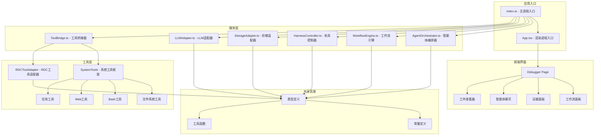
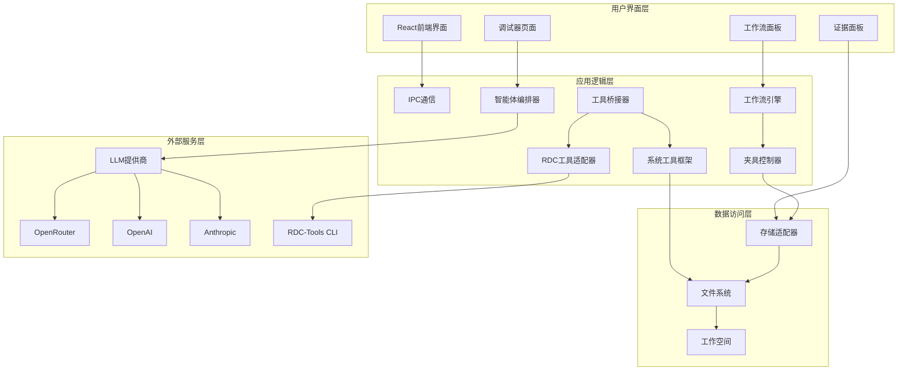
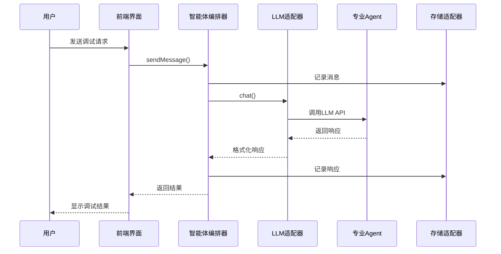
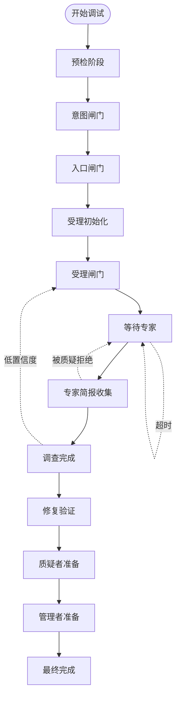
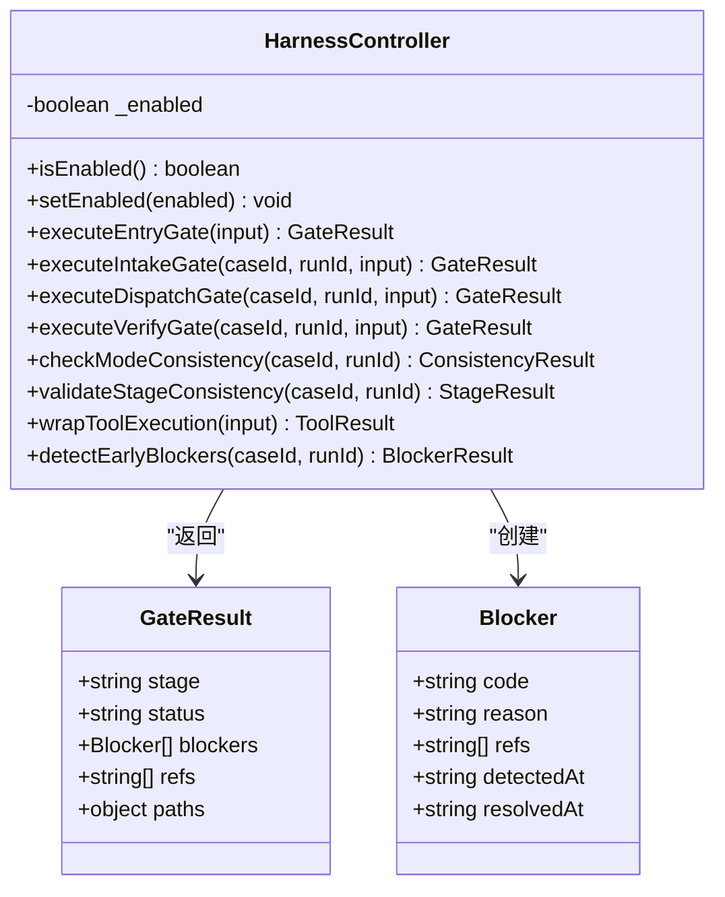
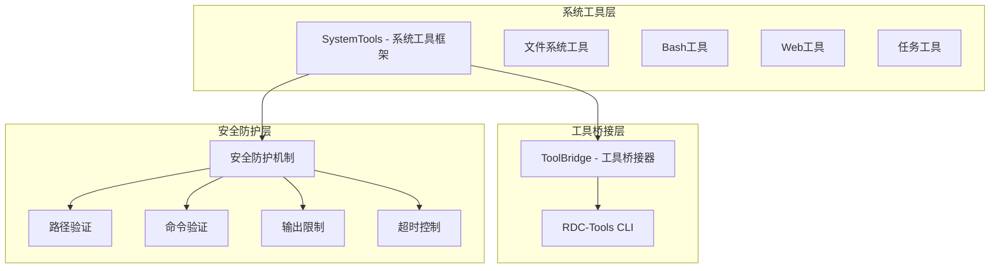

# 垂直调试框架

<cite>
**本文档引用的文件**
- [README.md](file://README.md)
- [package.json](file://package.json)
- [electron.vite.config.ts](file://electron.vite.config.ts)
- [src/main/index.ts](file://src/main/index.ts)
- [src/renderer/App.tsx](file://src/renderer/App.tsx)
- [src/renderer/pages/Debugger/index.tsx](file://src/renderer/pages/Debugger/index.tsx)
- [src/main/services/AgentOrchestrator.ts](file://src/main/services/AgentOrchestrator.ts)
- [src/main/services/WorkflowEngine.ts](file://src/main/services/WorkflowEngine.ts)
- [src/main/services/HarnessController.ts](file://src/main/services/HarnessController.ts)
- [src/main/services/StorageAdapter.ts](file://src/main/services/StorageAdapter.ts)
- [src/main/adapters/LLMAdapter.ts](file://src/main/adapters/LLMAdapter.ts)
- [src/shared/constants/agents.ts](file://src/shared/constants/agents.ts)
- [src/shared/constants/stages.ts](file://src/shared/constants/stages.ts)
- [src/shared/types/agent.ts](file://src/shared/types/agent.ts)
- [src/shared/types/workflow.ts](file://src/shared/types/workflow.ts)
- [src/main/tools/SystemTools/index.ts](file://src/main/tools/SystemTools/index.ts)
- [src/main/tools/SystemTools/BashTools.ts](file://src/main/tools/SystemTools/BashTools.ts)
- [src/main/tools/SystemTools/FsTools.ts](file://src/main/tools/SystemTools/FsTools.ts)
- [src/main/tools/SystemTools/TaskTools.ts](file://src/main/tools/SystemTools/TaskTools.ts)
- [src/main/tools/SystemTools/WebTools.ts](file://src/main/tools/SystemTools/WebTools.ts)
- [src/main/tools/RDCToolAdapter.ts](file://src/main/tools/RDCToolAdapter.ts)
- [src/main/services/ToolBridge.ts](file://src/main/services/ToolBridge.ts)
</cite>

## 更新摘要
**所做更改**
- 新增系统工具框架章节，详细介绍新增的BashTools.ts、FsTools.ts、TaskTools.ts、WebTools.ts等安全工具实现
- 更新核心组件分析，增加系统工具的安全机制和执行流程
- 新增系统工具架构图，展示系统工具与工具适配器的关系
- 更新依赖关系分析，包含新的系统工具依赖

## 目录
1. [简介](#简介)
2. [项目结构](#项目结构)
3. [核心组件](#核心组件)
4. [架构概览](#架构概览)
5. [详细组件分析](#详细组件分析)
6. [系统工具框架](#系统工具框架)
7. [依赖关系分析](#依赖关系分析)
8. [性能考虑](#性能考虑)
9. [故障排除指南](#故障排除指南)
10. [结论](#结论)

## 简介

垂直调试框架（RDC-Agent）是一个基于Electron的RenderDoc调试代理系统，专为图形渲染问题诊断而设计。该框架采用多智能体协作架构，通过12阶段工作流状态机实现系统化的调试流程。

**更新** 新增了完整的系统工具框架，提供安全的文件系统、Web访问、Shell执行和任务管理能力，增强了调试系统的自动化和智能化水平。

该框架的核心特点包括：
- **多智能体协作**：包含9个专业调试Agent，涵盖症状分类、捕获复现、像素取证等多个专业领域
- **受控回转机制**：支持预定义的回转规则，确保调试过程的可控性和可恢复性
- **前置闸门控制**：通过EntryGate、IntakeGate、DispatchGate等闸门确保调试质量
- **完整的生命周期管理**：从预检到最终报告的完整调试流程
- **安全系统工具**：内置多层安全防护的系统工具，支持文件操作、Web访问、Shell执行和任务管理

## 项目结构

**图表来源**
- [src/main/index.ts:1-209](file://src/main/index.ts#L1-L209)
- [src/renderer/App.tsx:1-112](file://src/renderer/App.tsx#L1-L112)
- [src/main/tools/SystemTools/index.ts:1-42](file://src/main/tools/SystemTools/index.ts#L1-L42)

**章节来源**
- [package.json:1-67](file://package.json#L1-L67)
- [electron.vite.config.ts:1-54](file://electron.vite.config.ts#L1-L54)

## 核心组件

### 智能体编排器（AgentOrchestrator）

智能体编排器是整个框架的核心协调者，负责管理9个专业调试Agent的状态和通信。

**主要功能**：
- Agent状态管理：跟踪每个Agent的活动状态
- Prompt模板管理：动态加载和配置Agent的System Prompt
- LLM集成：统一的LLM调用接口
- 事件记录：记录Agent交互和操作历史

**Agent角色分类**：
- Orchestrator（编排器）：rdc-debugger
- Investigator（调查员）：triage_agent, capture_repro_agent等6个Agent
- Verifier（验证者）：skeptic_agent
- Reporter（报告员）：curator_agent

**章节来源**
- [src/main/services/AgentOrchestrator.ts:1-401](file://src/main/services/AgentOrchestrator.ts#L1-L401)
- [src/shared/constants/agents.ts:1-107](file://src/shared/constants/agents.ts#L1-L107)

### 工作流引擎（WorkflowEngine）

工作流引擎实现了12阶段的状态机，确保调试过程的有序进行。

**12个阶段**：
1. Preflight Pending - 预检待处理
2. Intent Gate Passed - 意图闸门通过
3. Entry Gate Passed - 入口闸门通过
4. Accepted Intake Initialized - 接受受理初始化
5. Intake Gate Passed - 受理闸门通过
6. Waiting for Specialist - 等待专家
7. Specialist Briefs Collected - 专家简报收集
8. Expert Investigation Complete - 专家调查完成
9. Fix Verification Complete - 修复验证完成
10. Skeptic Ready - 质疑者准备
11. Curator Ready - 管理者准备
12. Finalized - 最终完成

**回转机制**：
- 支持3种回转触发：specialist_timeout、skeptic_rejected、triage_low_confidence
- 每种触发具有最大重试次数限制
- 部分回转需要用户确认

**章节来源**
- [src/main/services/WorkflowEngine.ts:1-369](file://src/main/services/WorkflowEngine.ts#L1-L369)
- [src/shared/constants/stages.ts:1-65](file://src/shared/constants/stages.ts#L1-L65)

### 夹具控制器（HarnessController）

夹具控制器从传统的"末端审计"升级为"过程控制"，提供前置闸门和运行时监控双重保障。

**前置闸门**：
- EntryGate：检查.RDC文件存在性和平台配置
- IntakeGate：验证数据完整性和参考契约
- DispatchGate：控制专家Agent分派
- VerifyGate：验证修复结果

**运行时监控**：
- 模式一致性检查
- 阶段推进验证
- 工具执行包装
- 早期阻断器检测

**章节来源**
- [src/main/services/HarnessController.ts:1-444](file://src/main/services/HarnessController.ts#L1-L444)

### 存储适配器（StorageAdapter）

存储适配器负责管理workspace目录结构和文件读写，确保调试数据的持久化。

**目录结构**：
- cases/ - 案例管理
- common/knowledge/library/ - 知识库
- common/config/ - 配置文件
- common/skills/ - 技能模板

**数据格式**：
- YAML格式用于配置和元数据
- JSONL格式用于事件链追踪
- 自动时间戳和ID生成

**章节来源**
- [src/main/services/StorageAdapter.ts:1-442](file://src/main/services/StorageAdapter.ts#L1-L442)

## 架构概览

**图表来源**
- [src/main/index.ts:1-209](file://src/main/index.ts#L1-L209)
- [src/renderer/App.tsx:1-112](file://src/renderer/App.tsx#L1-L112)
- [src/main/services/AgentOrchestrator.ts:1-401](file://src/main/services/AgentOrchestrator.ts#L1-L401)
- [src/main/tools/SystemTools/index.ts:1-42](file://src/main/tools/SystemTools/index.ts#L1-L42)

## 详细组件分析

### 智能体通信流程

**图表来源**
- [src/main/services/AgentOrchestrator.ts:200-254](file://src/main/services/AgentOrchestrator.ts#L200-L254)
- [src/main/adapters/LLMAdapter.ts:357-370](file://src/main/adapters/LLMAdapter.ts#L357-L370)

### 工作流状态转换

**图表来源**
- [src/main/services/WorkflowEngine.ts:44-60](file://src/main/services/WorkflowEngine.ts#L44-L60)
- [src/shared/constants/stages.ts:7-30](file://src/shared/constants/stages.ts#L7-L30)

### 闸门控制系统

**图表来源**
- [src/main/services/HarnessController.ts:43-444](file://src/main/services/HarnessController.ts#L43-L444)
- [src/shared/types/workflow.ts:71-80](file://src/shared/types/workflow.ts#L71-L80)

**章节来源**
- [src/main/services/HarnessController.ts:66-236](file://src/main/services/HarnessController.ts#L66-L236)

### LLM适配器架构

**图表来源**
- [src/main/adapters/LLMAdapter.ts:325-425](file://src/main/adapters/LLMAdapter.ts#L325-L425)

**章节来源**
- [src/main/adapters/LLMAdapter.ts:19-425](file://src/main/adapters/LLMAdapter.ts#L19-L425)

## 系统工具框架

**更新** 新增系统工具框架，提供安全的底层操作能力

系统工具框架是RDC-Agent新增的重要功能模块，提供多层安全防护的系统操作能力，包括文件系统操作、Web访问、Shell执行和任务管理。

### 系统工具架构

**图表来源**
- [src/main/tools/SystemTools/index.ts:1-42](file://src/main/tools/SystemTools/index.ts#L1-L42)
- [src/main/tools/SystemTools/BashTools.ts:1-286](file://src/main/tools/SystemTools/BashTools.ts#L1-L286)
- [src/main/tools/SystemTools/FsTools.ts:1-292](file://src/main/tools/SystemTools/FsTools.ts#L1-L292)
- [src/main/tools/SystemTools/TaskTools.ts:1-253](file://src/main/tools/SystemTools/TaskTools.ts#L1-L253)
- [src/main/tools/SystemTools/WebTools.ts:1-200](file://src/main/tools/SystemTools/WebTools.ts#L1-L200)

### 文件系统工具（FsTools）

提供安全的文件系统操作能力，包括文件读取、文件匹配和文本搜索。

**核心功能**：
- fs.read：安全读取文件内容，支持多种编码格式
- fs.glob：递归文件匹配搜索，支持glob模式
- fs.grep：文本搜索，支持正则表达式和递归搜索

**安全特性**：
- 路径白名单验证，防止路径遍历攻击
- 递归搜索跳过node_modules和隐藏目录
- 输出长度限制，防止内存溢出
- 异常文件处理，忽略无法读取的文件

**章节来源**
- [src/main/tools/SystemTools/FsTools.ts:1-292](file://src/main/tools/SystemTools/FsTools.ts#L1-L292)

### Bash工具（BashTools）

提供受限的Shell执行能力，支持安全的命令执行和输出管理。

**核心功能**：
- bash.exec：执行shell命令，支持工作目录和超时控制

**安全特性**：
- 危险命令检测，阻止删除、格式化、系统修改等危险操作
- 路径限制，确保命令在工作区内执行
- 输出截断，防止超大输出导致内存问题
- 超时控制，防止长时间运行的命令
- 环境变量限制，提高执行安全性

**危险命令检测模式**：
- 删除命令：rm、del、rd等
- 格式化命令：format、mkfs等
- 系统修改：fdisk、dd等
- 权限提升：sudo等
- 网络危险：nc、netcat等
- Windows危险：format、diskpart等

**章节来源**
- [src/main/tools/SystemTools/BashTools.ts:1-286](file://src/main/tools/SystemTools/BashTools.ts#L1-L286)

### Web工具（WebTools）

提供Web访问能力，支持HTTP请求和简单的Web搜索。

**核心功能**：
- web.fetch：HTTP GET请求，支持自定义头部
- web.search：Web搜索（占位实现）

**安全特性**：
- 响应大小限制，防止内存溢出
- 超时控制，防止长时间等待
- 重定向处理，支持HTTP重定向
- 输出截断，防止超大响应

**章节来源**
- [src/main/tools/SystemTools/WebTools.ts:1-200](file://src/main/tools/SystemTools/WebTools.ts#L1-L200)

### 任务工具（TaskTools）

提供子任务管理能力，支持任务的创建、更新和查询。

**核心功能**：
- task.create：创建子任务
- task.update：更新任务状态和结果
- task.list：列出任务并支持过滤和排序

**特性**：
- 内存存储，支持任务状态管理
- UUID生成，确保任务ID唯一性
- 时间戳管理，跟踪任务创建和更新时间
- 父子任务关联，支持任务层级关系

**任务状态**：
- pending：待处理
- in_progress：进行中
- completed：已完成
- failed：失败
- cancelled：已取消

**章节来源**
- [src/main/tools/SystemTools/TaskTools.ts:1-253](file://src/main/tools/SystemTools/TaskTools.ts#L1-L253)

### 系统工具集成

系统工具通过ToolBridge与RDC-Tools CLI集成，实现统一的工具调用接口。

**集成流程**：
1. SystemTools创建工具实例
2. ToolBridge接收工具调用请求
3. CLI执行实际的系统操作
4. 结果返回给调用方

**工具分类**：
- Layer 1：RDC核心工具（通过RDCToolAdapter）
- Layer 2：系统工具（通过SystemTools）
- Layer 3：自定义工具（通过ToolBridge）

**章节来源**
- [src/main/tools/SystemTools/index.ts:1-42](file://src/main/tools/SystemTools/index.ts#L1-L42)
- [src/main/services/ToolBridge.ts:1-308](file://src/main/services/ToolBridge.ts#L1-L308)
- [src/main/tools/RDCToolAdapter.ts:1-201](file://src/main/tools/RDCToolAdapter.ts#L1-L201)

## 依赖关系分析

```mermaid
graph TB
subgraph "核心依赖"
Electron["electron@^28.0.0"]
React["react@^18.2.0"]
Typescript["typescript@^5.3.0"]
LangChain["langchain-core"]
Zod["zod"]
UUID["uuid"]
end
subgraph "应用依赖"
ElectronStore["electron-store@^8.1.0"]
YAML["yaml@^2.3.4"]
Zustand["zustand@^4.5.0"]
end
subgraph "构建工具"
ElectronVite["electron-vite@^2.0.0"]
Vite["vite@^5.0.0"]
ReactPlugin["@vitejs/plugin-react"]
end
subgraph "系统工具依赖"
ChildProcess["child_process"]
FS["fs"]
Path["path"]
HTTPS["https"]
HTTP["http"]
end
package_json["package.json"] --> Electron
package_json --> React
package_json --> Typescript
package_json --> LangChain
package_json --> Zod
package_json --> UUID
package_json --> ElectronStore
package_json --> YAML
package_json --> Zustand
electron_vite_config_ts["electron.vite.config.ts"] --> ElectronVite
electron_vite_config_ts --> Vite
electron_vite_config_ts --> ReactPlugin
SystemTools["SystemTools"] --> ChildProcess
SystemTools --> FS
SystemTools --> Path
SystemTools --> HTTPS
SystemTools --> HTTP
```

**图表来源**
- [package.json:16-35](file://package.json#L16-L35)
- [electron.vite.config.ts:22-34](file://electron.vite.config.ts#L22-L34)
- [src/main/tools/SystemTools/BashTools.ts:6-10](file://src/main/tools/SystemTools/BashTools.ts#L6-L10)
- [src/main/tools/SystemTools/WebTools.ts:6-11](file://src/main/tools/SystemTools/WebTools.ts#L6-L11)

**章节来源**
- [package.json:16-67](file://package.json#L16-L67)

## 性能考虑

### 并发处理优化
- **异步I/O操作**：所有文件操作采用异步方式，避免阻塞主线程
- **内存管理**：智能体状态使用Map结构，便于快速查找和更新
- **缓存策略**：Prompt模板和Agent配置支持缓存，减少重复加载
- **系统工具优化**：文件系统工具使用递归搜索优化，跳过不必要的目录

### 网络请求优化
- **连接池管理**：LLM提供商支持连接复用
- **超时控制**：所有网络请求设置合理超时时间
- **错误重试**：关键操作支持有限次重试机制
- **Web工具优化**：响应大小限制，防止内存溢出

### 存储性能
- **批量写入**：事件链采用JSONL格式，支持高效批量写入
- **目录结构优化**：合理的目录层次结构，避免单目录文件过多
- **增量更新**：支持增量更新，减少不必要的文件写入
- **系统工具缓存**：任务工具使用内存存储，提高访问速度

### 系统工具性能
- **输出截断**：防止超大输出导致内存问题
- **路径验证**：使用路径规范化，提高路径比较效率
- **命令限制**：危险命令检测使用预编译正则表达式
- **超时控制**：Shell执行和HTTP请求都有合理的超时设置

## 故障排除指南

### 常见问题诊断

**智能体通信问题**：
1. 检查LLM提供商配置是否正确
2. 验证API密钥是否有效
3. 确认网络连接状态

**工作流阻断问题**：
1. 检查hypothesis_board.yaml中的blocking_issues
2. 验证freeze_state.yaml状态
3. 确认action_chain中是否有异常事件

**存储访问问题**：
1. 检查workspace目录权限
2. 验证磁盘空间充足
3. 确认文件路径正确性

**系统工具问题**：
1. 检查工作区路径配置
2. 验证工具权限设置
3. 确认CLI工具可用性
4. 检查超时和输出限制设置

**章节来源**
- [src/main/services/HarnessController.ts:364-418](file://src/main/services/HarnessController.ts#L364-L418)
- [src/main/services/StorageAdapter.ts:45-64](file://src/main/services/StorageAdapter.ts#L45-L64)

### 调试工具和日志

框架提供了完善的日志记录机制：
- **智能体状态变更**：通过IPC发送到前端界面
- **工作流状态更新**：实时反映调试进度
- **错误堆栈信息**：详细的异常信息记录
- **性能指标**：执行时间和资源使用情况
- **系统工具执行日志**：记录工具调用和执行结果

## 结论

垂直调试框架通过模块化设计和清晰的职责分离，构建了一个功能完备的RenderDoc调试系统。其核心优势包括：

**技术创新点**：
- 多智能体协作架构，模拟人类专家团队
- 受控回转机制，确保调试过程的可控性
- 前置闸门控制，从源头保证调试质量
- 完整的数据生命周期管理
- **新增系统工具框架**，提供安全的底层操作能力

**应用价值**：
- 降低图形渲染问题诊断门槛
- 提高调试效率和准确性
- 标准化调试流程和输出
- 支持团队协作和知识传承
- **增强自动化能力**，通过系统工具实现智能自动化

**系统工具价值**：
- **安全第一**：多层安全防护，防止恶意操作
- **功能全面**：覆盖文件系统、Web访问、Shell执行、任务管理
- **易于集成**：标准化的工具接口，便于扩展
- **性能优化**：合理的超时和输出限制，确保系统稳定

该框架为垂直领域的AI辅助调试提供了优秀的解决方案，具有良好的扩展性和维护性，适合在复杂的图形渲染问题诊断场景中部署使用。新增的系统工具框架进一步增强了框架的实用性和自动化水平，为未来的功能扩展奠定了坚实基础。