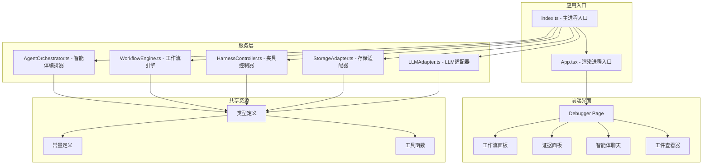
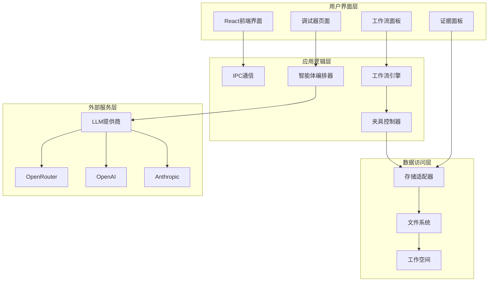
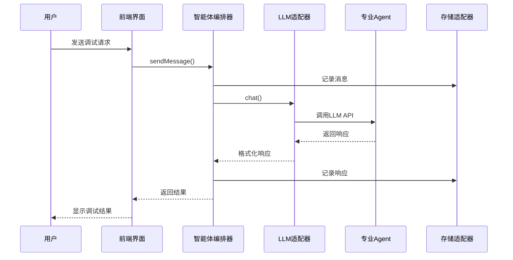
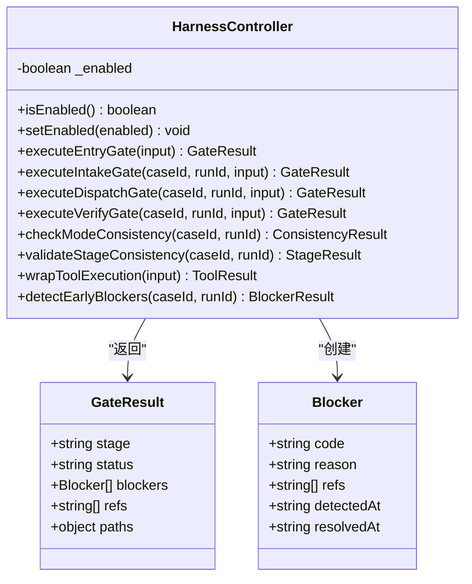
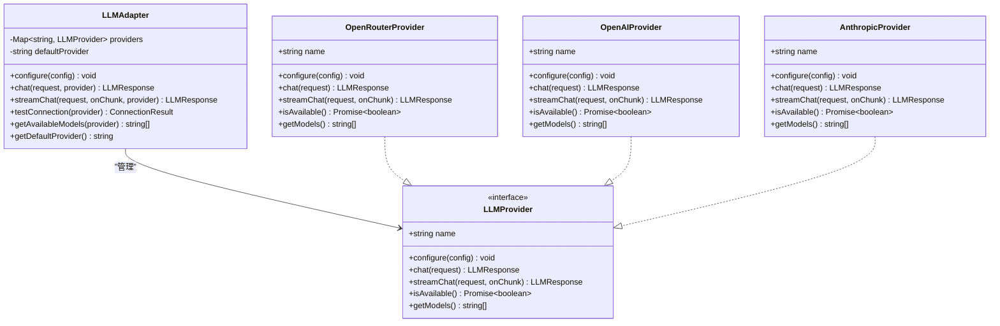

# 垂直调试框架

<cite>
**本文档引用的文件**
- [README.md](file://README.md)
- [package.json](file://package.json)
- [electron.vite.config.ts](file://electron.vite.config.ts)
- [src/main/index.ts](file://src/main/index.ts)
- [src/renderer/App.tsx](file://src/renderer/App.tsx)
- [src/renderer/pages/Debugger/index.tsx](file://src/renderer/pages/Debugger/index.tsx)
- [src/main/services/AgentOrchestrator.ts](file://src/main/services/AgentOrchestrator.ts)
- [src/main/services/WorkflowEngine.ts](file://src/main/services/WorkflowEngine.ts)
- [src/main/services/HarnessController.ts](file://src/main/services/HarnessController.ts)
- [src/main/services/StorageAdapter.ts](file://src/main/services/StorageAdapter.ts)
- [src/main/adapters/LLMAdapter.ts](file://src/main/adapters/LLMAdapter.ts)
- [src/shared/constants/agents.ts](file://src/shared/constants/agents.ts)
- [src/shared/constants/stages.ts](file://src/shared/constants/stages.ts)
- [src/shared/types/agent.ts](file://src/shared/types/agent.ts)
- [src/shared/types/workflow.ts](file://src/shared/types/workflow.ts)
</cite>

## 目录
1. [简介](#简介)
2. [项目结构](#项目结构)
3. [核心组件](#核心组件)
4. [架构概览](#架构概览)
5. [详细组件分析](#详细组件分析)
6. [依赖关系分析](#依赖关系分析)
7. [性能考虑](#性能考虑)
8. [故障排除指南](#故障排除指南)
9. [结论](#结论)

## 简介

垂直调试框架（RDC-Agent）是一个基于Electron的RenderDoc调试代理系统，专为图形渲染问题诊断而设计。该框架采用多智能体协作架构，通过12阶段工作流状态机实现系统化的调试流程。

该框架的核心特点包括：
- **多智能体协作**：包含9个专业调试Agent，涵盖症状分类、捕获复现、像素取证等多个专业领域
- **受控回转机制**：支持预定义的回转规则，确保调试过程的可控性和可恢复性
- **前置闸门控制**：通过EntryGate、IntakeGate、DispatchGate等闸门确保调试质量
- **完整的生命周期管理**：从预检到最终报告的完整调试流程

## 项目结构



**图表来源**
- [src/main/index.ts:1-209](file://src/main/index.ts#L1-L209)
- [src/renderer/App.tsx:1-112](file://src/renderer/App.tsx#L1-L112)

**章节来源**
- [package.json:1-67](file://package.json#L1-L67)
- [electron.vite.config.ts:1-54](file://electron.vite.config.ts#L1-L54)

## 核心组件

### 智能体编排器（AgentOrchestrator）

智能体编排器是整个框架的核心协调者，负责管理9个专业调试Agent的状态和通信。

**主要功能**：
- Agent状态管理：跟踪每个Agent的活动状态
- Prompt模板管理：动态加载和配置Agent的System Prompt
- LLM集成：统一的LLM调用接口
- 事件记录：记录Agent交互和操作历史

**Agent角色分类**：
- Orchestrator（编排器）：rdc-debugger
- Investigator（调查员）：triage_agent, capture_repro_agent等6个Agent
- Verifier（验证者）：skeptic_agent
- Reporter（报告员）：curator_agent

**章节来源**
- [src/main/services/AgentOrchestrator.ts:1-401](file://src/main/services/AgentOrchestrator.ts#L1-L401)
- [src/shared/constants/agents.ts:1-107](file://src/shared/constants/agents.ts#L1-L107)

### 工作流引擎（WorkflowEngine）

工作流引擎实现了12阶段的状态机，确保调试过程的有序进行。

**12个阶段**：
1. Preflight Pending - 预检待处理
2. Intent Gate Passed - 意图闸门通过
3. Entry Gate Passed - 入口闸门通过
4. Accepted Intake Initialized - 接受受理初始化
5. Intake Gate Passed - 受理闸门通过
6. Waiting for Specialist - 等待专家
7. Specialist Briefs Collected - 专家简报收集
8. Expert Investigation Complete - 专家调查完成
9. Fix Verification Complete - 修复验证完成
10. Skeptic Ready - 质疑者准备
11. Curator Ready - 管理者准备
12. Finalized - 最终完成

**回转机制**：
- 支持3种回转触发：specialist_timeout、skeptic_rejected、triage_low_confidence
- 每种触发具有最大重试次数限制
- 部分回转需要用户确认

**章节来源**
- [src/main/services/WorkflowEngine.ts:1-369](file://src/main/services/WorkflowEngine.ts#L1-L369)
- [src/shared/constants/stages.ts:1-65](file://src/shared/constants/stages.ts#L1-L65)

### 夹具控制器（HarnessController）

夹具控制器从传统的"末端审计"升级为"过程控制"，提供前置闸门和运行时监控双重保障。

**前置闸门**：
- EntryGate：检查.RDC文件存在性和平台配置
- IntakeGate：验证数据完整性和参考契约
- DispatchGate：控制专家Agent分派
- VerifyGate：验证修复结果

**运行时监控**：
- 模式一致性检查
- 阶段推进验证
- 工具执行包装
- 早期阻断器检测

**章节来源**
- [src/main/services/HarnessController.ts:1-444](file://src/main/services/HarnessController.ts#L1-L444)

### 存储适配器（StorageAdapter）

存储适配器负责管理workspace目录结构和文件读写，确保调试数据的持久化。

**目录结构**：
- cases/ - 案例管理
- common/knowledge/library/ - 知识库
- common/config/ - 配置文件
- common/skills/ - 技能模板

**数据格式**：
- YAML格式用于配置和元数据
- JSONL格式用于事件链追踪
- 自动时间戳和ID生成

**章节来源**
- [src/main/services/StorageAdapter.ts:1-442](file://src/main/services/StorageAdapter.ts#L1-L442)

## 架构概览



**图表来源**
- [src/main/index.ts:1-209](file://src/main/index.ts#L1-L209)
- [src/renderer/App.tsx:1-112](file://src/renderer/App.tsx#L1-L112)
- [src/main/services/AgentOrchestrator.ts:1-401](file://src/main/services/AgentOrchestrator.ts#L1-L401)

## 详细组件分析

### 智能体通信流程



**图表来源**
- [src/main/services/AgentOrchestrator.ts:200-254](file://src/main/services/AgentOrchestrator.ts#L200-L254)
- [src/main/adapters/LLMAdapter.ts:357-370](file://src/main/adapters/LLMAdapter.ts#L357-L370)

### 工作流状态转换


**图表来源**
- [src/main/services/WorkflowEngine.ts:44-60](file://src/main/services/WorkflowEngine.ts#L44-L60)
- [src/shared/constants/stages.ts:7-30](file://src/shared/constants/stages.ts#L7-L30)

### 闸门控制系统



**图表来源**
- [src/main/services/HarnessController.ts:43-444](file://src/main/services/HarnessController.ts#L43-L444)
- [src/shared/types/workflow.ts:71-80](file://src/shared/types/workflow.ts#L71-L80)

**章节来源**
- [src/main/services/HarnessController.ts:66-236](file://src/main/services/HarnessController.ts#L66-L236)

### LLM适配器架构



**图表来源**
- [src/main/adapters/LLMAdapter.ts:325-425](file://src/main/adapters/LLMAdapter.ts#L325-L425)

**章节来源**
- [src/main/adapters/LLMAdapter.ts:19-425](file://src/main/adapters/LLMAdapter.ts#L19-L425)

## 依赖关系分析

```mermaid
graph TB
subgraph "核心依赖"
Electron[electron@^28.0.0]
React[react@^18.2.0]
Typescript[typescript@^5.3.0]
end
subgraph "应用依赖"
ElectronStore[electron-store@^8.1.0]
UUID[uuid@^9.0.0]
YAML[yaml@^2.3.4]
Zustand[zustand@^4.5.0]
end
subgraph "构建工具"
ElectronVite[electron-vite@^2.0.0]
Vite[vite@^5.0.0]
ReactPlugin[@vitejs/plugin-react]
end
package.json --> Electron
package.json --> React
package.json --> Typescript
package.json --> ElectronStore
package.json --> UUID
package.json --> YAML
package.json --> Zustand
electron.vite.config.ts --> ElectronVite
electron.vite.config.ts --> Vite
electron.vite.config.ts --> ReactPlugin
```

**图表来源**
- [package.json:16-35](file://package.json#L16-L35)
- [electron.vite.config.ts:22-34](file://electron.vite.config.ts#L22-L34)

**章节来源**
- [package.json:16-67](file://package.json#L16-L67)

## 性能考虑

### 并发处理优化
- **异步I/O操作**：所有文件操作采用异步方式，避免阻塞主线程
- **内存管理**：智能体状态使用Map结构，便于快速查找和更新
- **缓存策略**：Prompt模板和Agent配置支持缓存，减少重复加载

### 网络请求优化
- **连接池管理**：LLM提供商支持连接复用
- **超时控制**：所有网络请求设置合理超时时间
- **错误重试**：关键操作支持有限次重试机制

### 存储性能
- **批量写入**：事件链采用JSONL格式，支持高效批量写入
- **目录结构优化**：合理的目录层次结构，避免单目录文件过多
- **增量更新**：支持增量更新，减少不必要的文件写入

## 故障排除指南

### 常见问题诊断

**智能体通信问题**：
1. 检查LLM提供商配置是否正确
2. 验证API密钥是否有效
3. 确认网络连接状态

**工作流阻断问题**：
1. 检查hypothesis_board.yaml中的blocking_issues
2. 验证freeze_state.yaml状态
3. 确认action_chain中是否有异常事件

**存储访问问题**：
1. 检查workspace目录权限
2. 验证磁盘空间充足
3. 确认文件路径正确性

**章节来源**
- [src/main/services/HarnessController.ts:364-418](file://src/main/services/HarnessController.ts#L364-L418)
- [src/main/services/StorageAdapter.ts:45-64](file://src/main/services/StorageAdapter.ts#L45-L64)

### 调试工具和日志

框架提供了完善的日志记录机制：
- **智能体状态变更**：通过IPC发送到前端界面
- **工作流状态更新**：实时反映调试进度
- **错误堆栈信息**：详细的异常信息记录
- **性能指标**：执行时间和资源使用情况

## 结论

垂直调试框架通过模块化设计和清晰的职责分离，构建了一个功能完备的RenderDoc调试系统。其核心优势包括：

**技术创新点**：
- 多智能体协作架构，模拟人类专家团队
- 受控回转机制，确保调试过程的可控性
- 前置闸门控制，从源头保证调试质量
- 完整的数据生命周期管理

**应用价值**：
- 降低图形渲染问题诊断门槛
- 提高调试效率和准确性
- 标准化调试流程和输出
- 支持团队协作和知识传承

该框架为垂直领域的AI辅助调试提供了优秀的解决方案，具有良好的扩展性和维护性，适合在复杂的图形渲染问题诊断场景中部署使用。