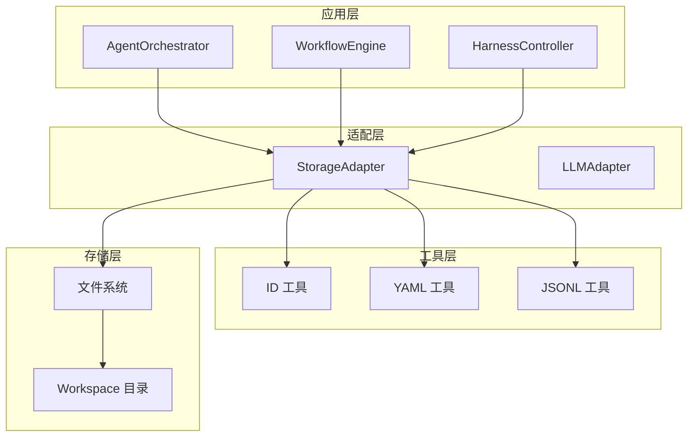
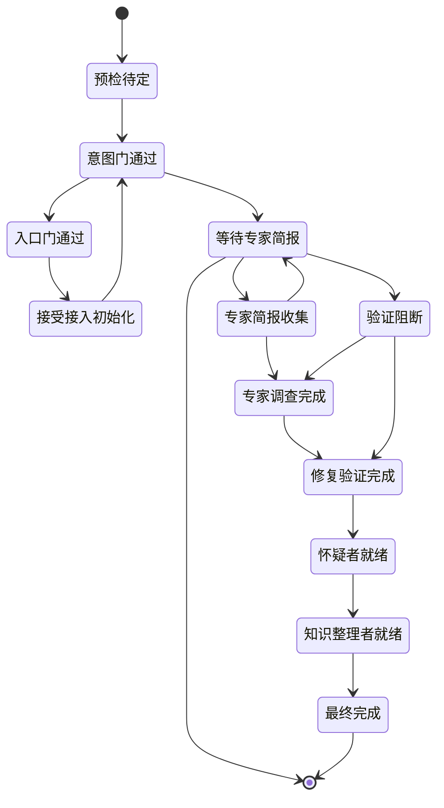
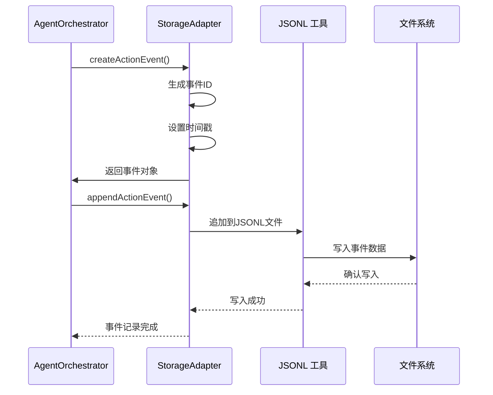
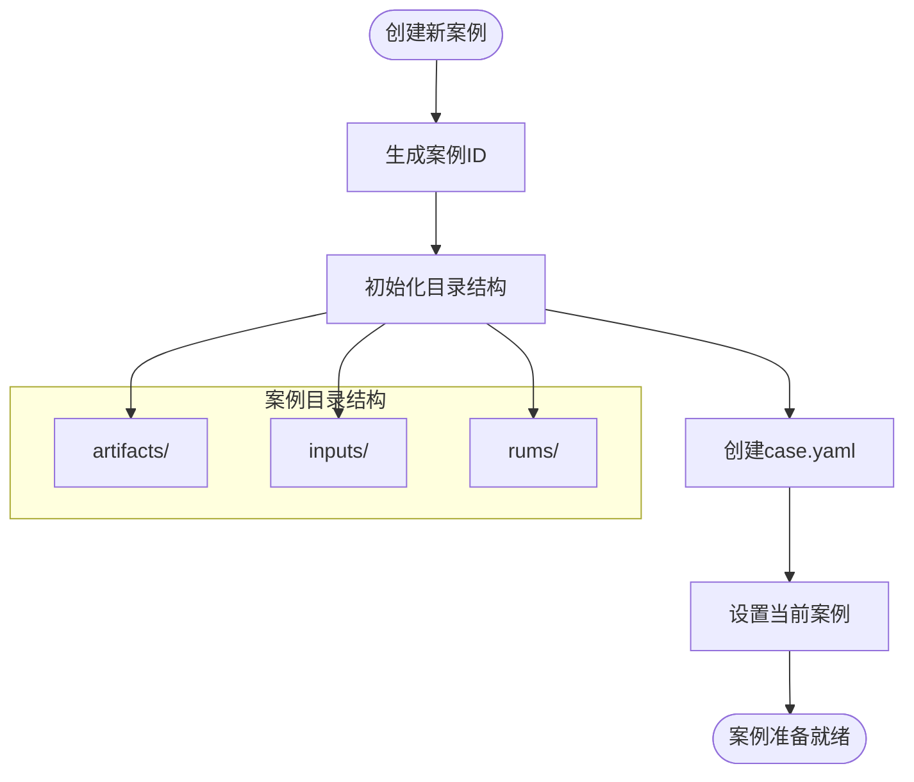
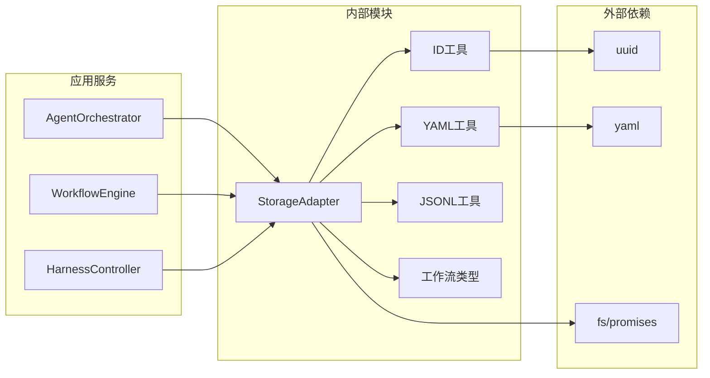

# 存储与持久化

<cite>
**本文档引用的文件**
- [StorageAdapter.ts](file://src/main/services/StorageAdapter.ts)
- [id.ts](file://src/shared/utils/id.ts)
- [yaml.ts](file://src/shared/utils/yaml.ts)
- [jsonl.ts](file://src/shared/utils/jsonl.ts)
- [workflow.ts](file://src/shared/types/workflow.ts)
- [AgentOrchestrator.ts](file://src/main/services/AgentOrchestrator.ts)
- [WorkflowEngine.ts](file://src/main/services/WorkflowEngine.ts)
- [HarnessController.ts](file://src/main/services/HarnessController.ts)
- [LLMAdapter.ts](file://src/main/adapters/LLMAdapter.ts)
- [package.json](file://package.json)
</cite>

## 目录
1. [简介](#简介)
2. [项目结构](#项目结构)
3. [核心组件](#核心组件)
4. [架构概览](#架构概览)
5. [详细组件分析](#详细组件分析)
6. [依赖关系分析](#依赖关系分析)
7. [性能考虑](#性能考虑)
8. [故障排除指南](#故障排除指南)
9. [结论](#结论)

## 简介

RDC-Agent 是一个基于 Electron 的 RenderDoc 调试代理系统，采用垂直框架设计。本项目的核心存储与持久化机制围绕 Workspace 目录结构构建，实现了完整的调试工作流数据管理。该系统通过 StorageAdapter 提供统一的文件系统抽象，支持 YAML 和 JSONL 格式的数据持久化，并建立了严格的工作流状态管理机制。

## 项目结构

项目采用模块化的存储架构，主要分为以下几个层次：

```mermaid
graph TB
subgraph "Workspace 根目录"
WS[workspace/]
end
subgraph "案例管理"
CASES[cases/]
CASE[case_{id}/]
ARTIFACTS[artifacts/]
INPUTS[inputs/]
RUNS[rums/]
end
subgraph "通用知识库"
COMMON[common/]
KNOWLEDGE[knowledge/]
LIBRARY[library/]
SESSIONS[sessions/]
SKILLS[skills/]
CONFIG[config/]
end
subgraph "会话管理"
ACTIONCHAIN[action_chain.jsonl]
CURRENTSESSION[.current_session]
end
WS --> CASES
WS --> COMMON
CASES --> CASE
CASE --> ARTIFACTS
CASE --> INPUTS
CASE --> RUNS
COMMON --> KNOWLEDGE
KNOWLEDGE --> LIBRARY
LIBRARY --> SESSIONS
SESSIONS --> ACTIONCHAIN
SESSIONS --> CURRENTSESSION
```

**图表来源**
- [StorageAdapter.ts:45-64](file://src/main/services/StorageAdapter.ts#L45-L64)
- [StorageAdapter.ts:48-56](file://src/main/services/StorageAdapter.ts#L48-L56)

**章节来源**
- [StorageAdapter.ts:45-64](file://src/main/services/StorageAdapter.ts#L45-L64)
- [StorageAdapter.ts:48-56](file://src/main/services/StorageAdapter.ts#L48-L56)

## 核心组件

### StorageAdapter - 存储适配器

StorageAdapter 是整个存储系统的核心组件，负责管理 workspace 目录结构和文件读写操作。它提供了以下主要功能：

#### 目录初始化
- 自动创建所有必要的目录结构
- 支持开发模式和打包模式的不同路径策略
- 确保目录权限和递归创建

#### 数据持久化格式
- **YAML 格式**: 用于结构化配置和状态数据
- **JSONL 格式**: 用于事件流和日志数据

#### 工作流数据管理
- 案例（Case）管理：创建、读取、更新案例元数据
- 运行（Run）管理：管理调试会话的完整生命周期
- 工件（Artifact）管理：存储各种中间结果和报告
- 事件链管理：跟踪所有系统活动和交互

**章节来源**
- [StorageAdapter.ts:22-442](file://src/main/services/StorageAdapter.ts#L22-L442)

### ID 生成工具

系统使用专门的 ID 生成工具确保数据的唯一性和可追踪性：

#### ID 类型
- **事件 ID**: `evt-{shortId}-{timestamp}`
- **案例 ID**: `case_{date}_{random}`
- **运行 ID**: `run_{random}`
- **会话 ID**: `sess_{caseId}_{runId}`
- **令牌 ID**: `tok-{agentId}-{shortId}`

#### 时间戳管理
- 毫秒级时间戳用于精确的时间追踪
- ISO 8601 格式用于人类可读的时间表示

**章节来源**
- [id.ts:24-90](file://src/shared/utils/id.ts#L24-L90)
- [id.ts:106-115](file://src/shared/utils/id.ts#L106-L115)

### 文件格式工具

#### YAML 工具
提供安全的 YAML 读写功能：
- 自动创建缺失的目录
- 错误处理和日志记录
- 类型安全的数据序列化

#### JSONL 工具
支持高效的事件流存储：
- 行分隔的 JSON 格式
- 追加写入优化
- 重复数据检测

**章节来源**
- [yaml.ts:12-46](file://src/shared/utils/yaml.ts#L12-L46)
- [jsonl.ts:11-85](file://src/shared/utils/jsonl.ts#L11-L85)

## 架构概览

存储系统采用分层架构设计，确保数据的一致性和可维护性：



**图表来源**
- [AgentOrchestrator.ts:24-27](file://src/main/services/AgentOrchestrator.ts#L24-L27)
- [WorkflowEngine.ts:16](file://src/main/services/WorkflowEngine.ts#L16)
- [HarnessController.ts:13-14](file://src/main/services/HarnessController.ts#L13-L14)

## 详细组件分析

### 工作流状态管理

系统实现了完整的 12 阶段工作流状态机，支持受控回转机制：



**图表来源**
- [WorkflowEngine.ts:45-60](file://src/main/services/WorkflowEngine.ts#L45-L60)
- [workflow.ts:6-21](file://src/shared/types/workflow.ts#L6-L21)

#### 状态转换规则
系统定义了明确的状态转换规则和回转机制：

| 当前状态 | 允许转换 | 触发条件 |
|---------|---------|---------|
| 预检待定 | 意图门通过 | 数据完整性检查 |
| 意图门通过 | 入口门通过 | 平台兼容性验证 |
| 等待专家简报 | 专家简报收集 | 专家反馈完成 |
| 专家调查完成 | 修复验证完成 | 修复验证通过 |
| 验证阻断 | 专家调查完成 | 阻断问题解决 |

**章节来源**
- [WorkflowEngine.ts:45-60](file://src/main/services/WorkflowEngine.ts#L45-L60)
- [WorkflowEngine.ts:144-187](file://src/main/services/WorkflowEngine.ts#L144-L187)

### 事件追踪系统

系统通过 action_chain.jsonl 实现完整的事件追踪：



**图表来源**
- [StorageAdapter.ts:331-345](file://src/main/services/StorageAdapter.ts#L331-L345)
- [StorageAdapter.ts:303-310](file://src/main/services/StorageAdapter.ts#L303-L310)

#### 事件类型分类

| 事件类型 | 描述 | 典型场景 |
|---------|------|---------|
| workflow_stage_transition | 工作流阶段转换 | 阶段推进、回转操作 |
| dispatch | 专家分派 | Specialist 调度、任务分配 |
| artifact_write | 工件写入 | 中间结果保存、报告生成 |
| tool_execution | 工具执行 | 外部工具调用、命令执行 |
| session_signoff | 会话签退 | 会话结束、资源释放 |

**章节来源**
- [StorageAdapter.ts:323-345](file://src/main/services/StorageAdapter.ts#L323-L345)
- [StorageAdapter.ts:285-318](file://src/main/services/StorageAdapter.ts#L285-L318)

### 案例管理系统

系统支持多案例并发管理，每个案例都有独立的存储空间：



**图表来源**
- [StorageAdapter.ts:78-112](file://src/main/services/StorageAdapter.ts#L78-L112)
- [StorageAdapter.ts:86-99](file://src/main/services/StorageAdapter.ts#L86-L99)

#### 目录结构设计

每个案例包含以下标准目录：

- **artifacts/**: 存储工件文件和中间结果
- **inputs/captures/**: 存储捕获的数据文件
- **inputs/references/**: 存储参考文件和基准数据
- **runs/**: 存储运行历史和会话数据

**章节来源**
- [StorageAdapter.ts:86-99](file://src/main/services/StorageAdapter.ts#L86-L99)
- [StorageAdapter.ts:117-129](file://src/main/services/StorageAdapter.ts#L117-L129)

## 依赖关系分析

存储系统的关键依赖关系如下：



**图表来源**
- [package.json:16-21](file://package.json#L16-L21)
- [StorageAdapter.ts:6-18](file://src/main/services/StorageAdapter.ts#L6-L18)

### 模块耦合度分析

系统采用了松耦合的设计原则：

- **StorageAdapter** 作为单一职责组件，不依赖具体的应用逻辑
- **工具类** 提供独立的功能，便于测试和维护
- **类型定义** 独立于实现，支持类型安全的开发

**章节来源**
- [package.json:16-21](file://package.json#L16-L21)
- [StorageAdapter.ts:6-18](file://src/main/services/StorageAdapter.ts#L6-L18)

## 性能考虑

### 存储性能优化

1. **异步 I/O 操作**: 所有文件操作都使用异步 API，避免阻塞主线程
2. **批量写入**: 支持批量数据写入，减少磁盘 I/O 次数
3. **缓存策略**: 对频繁访问的数据进行内存缓存
4. **压缩存储**: 对大文件采用适当的压缩策略

### 内存管理

- **流式处理**: 对大型 JSONL 文件采用流式读取
- **垃圾回收**: 及时清理不再使用的数据引用
- **内存限制**: 对大型数据结构实施内存使用限制

## 故障排除指南

### 常见问题及解决方案

#### 文件权限问题
**症状**: 创建目录或写入文件失败
**原因**: 权限不足或路径不存在
**解决方案**: 
- 检查 workspace 目录的写入权限
- 确保应用程序具有足够的系统权限
- 验证磁盘空间充足

#### 数据损坏
**症状**: YAML 或 JSONL 文件解析失败
**原因**: 文件被意外修改或中断写入
**解决方案**:
- 使用备份文件恢复
- 检查文件完整性
- 实施数据校验机制

#### 性能问题
**症状**: 文件操作响应缓慢
**原因**: 磁盘 I/O 瓶颈或内存不足
**解决方案**:
- 优化文件访问模式
- 实施缓存策略
- 考虑使用 SSD 存储

**章节来源**
- [yaml.ts:19-23](file://src/shared/utils/yaml.ts#L19-L23)
- [jsonl.ts:30-34](file://src/shared/utils/jsonl.ts#L30-L34)

## 结论

RDC-Agent 的存储与持久化系统展现了现代软件工程的最佳实践。通过模块化设计、严格的类型安全和完善的错误处理机制，系统实现了可靠的数据管理。关键特性包括：

1. **完整的生命周期管理**: 从案例创建到最终完成的全程数据追踪
2. **灵活的存储格式**: 支持 YAML 和 JSONL 两种格式满足不同需求
3. **强大的工作流控制**: 12 阶段状态机和受控回转机制
4. **可观测性**: 完整的事件追踪和状态监控
5. **可扩展性**: 模块化架构支持功能扩展和定制

该系统为 RenderDoc 调试代理提供了坚实的数据基础，确保了调试过程的可追溯性和结果的可靠性。