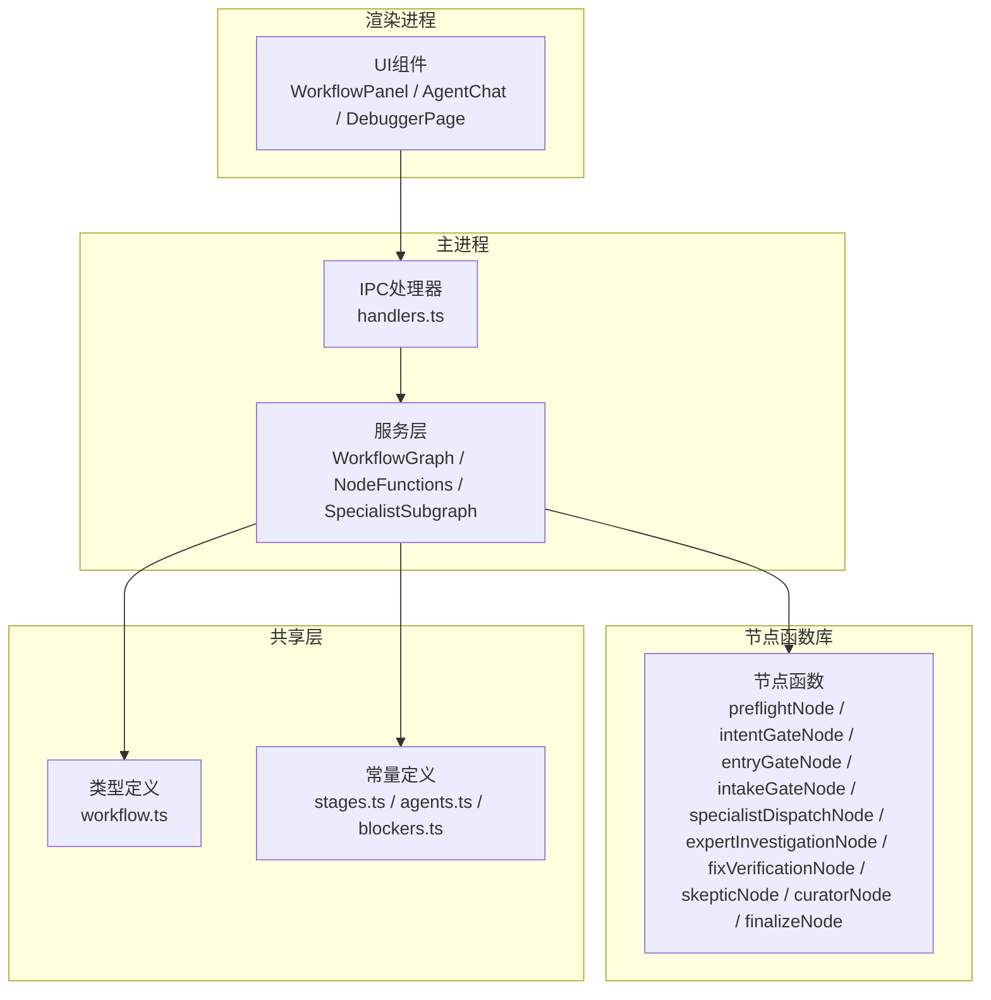
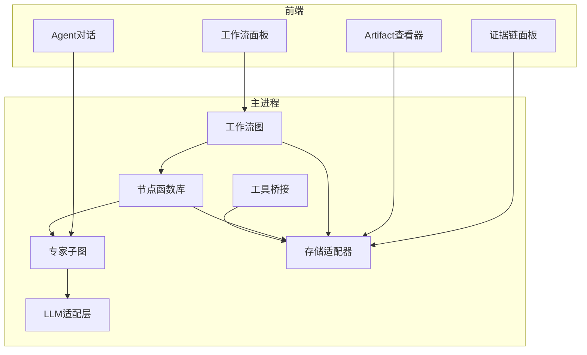
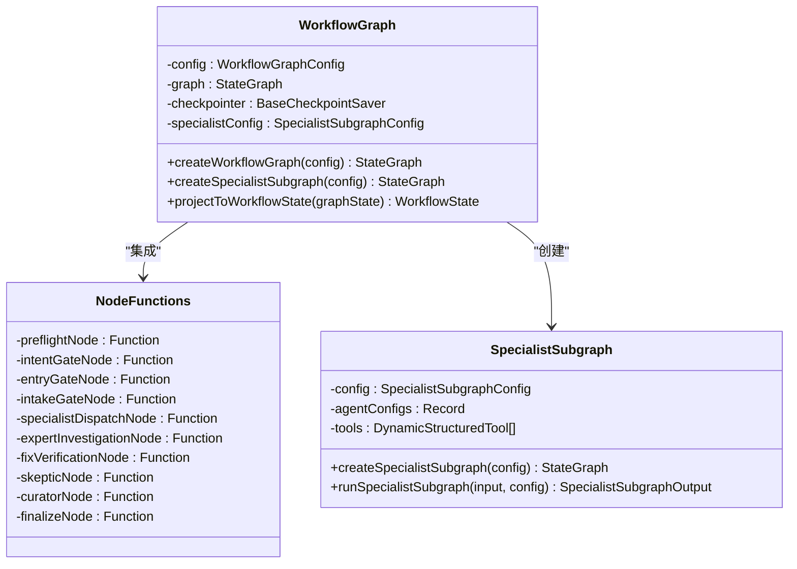
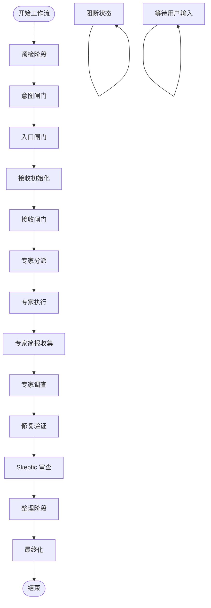
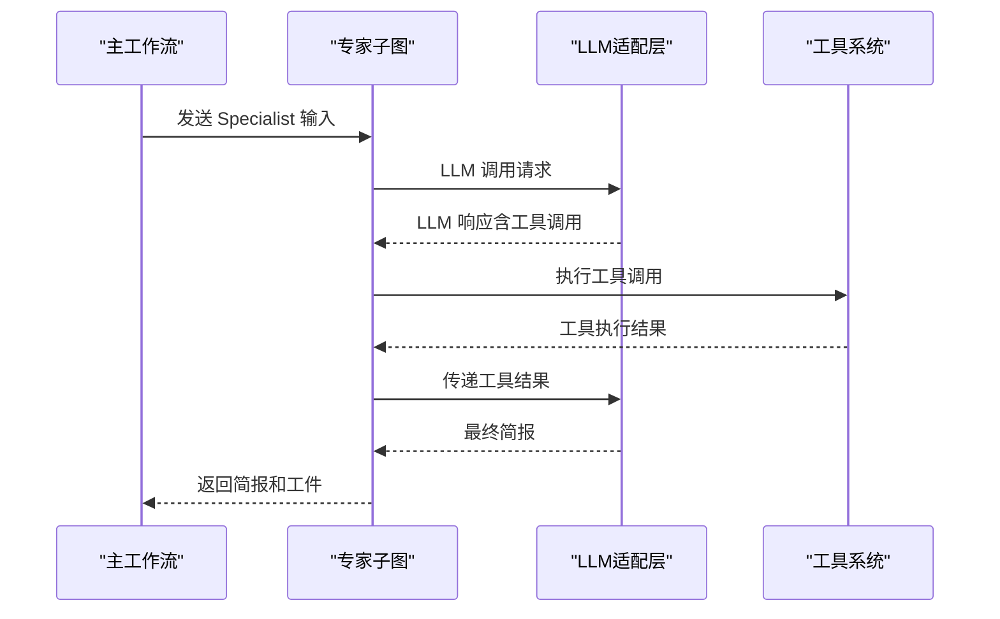
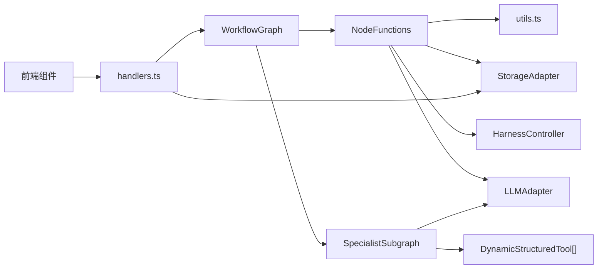

# 工作流引擎

<cite>
**本文档引用的文件**
- [WorkflowGraph.ts](file://src/main/services/WorkflowGraph.ts)
- [NodeFunctions/preflightNode.ts](file://src/main/services/NodeFunctions/preflightNode.ts)
- [NodeFunctions/intentGateNode.ts](file://src/main/services/NodeFunctions/intentGateNode.ts)
- [NodeFunctions/entryGateNode.ts](file://src/main/services/NodeFunctions/entryGateNode.ts)
- [NodeFunctions/intakeInitNode.ts](file://src/main/services/NodeFunctions/intakeInitNode.ts)
- [NodeFunctions/intakeGateNode.ts](file://src/main/services/NodeFunctions/intakeGateNode.ts)
- [NodeFunctions/specialistDispatchNode.ts](file://src/main/services/NodeFunctions/specialistDispatchNode.ts)
- [NodeFunctions/specialistBriefsNode.ts](file://src/main/services/NodeFunctions/specialistBriefsNode.ts)
- [NodeFunctions/expertInvestigationNode.ts](file://src/main/services/NodeFunctions/expertInvestigationNode.ts)
- [NodeFunctions/fixVerificationNode.ts](file://src/main/services/NodeFunctions/fixVerificationNode.ts)
- [NodeFunctions/skepticNode.ts](file://src/main/services/NodeFunctions/skepticNode.ts)
- [NodeFunctions/curatorNode.ts](file://src/main/services/NodeFunctions/curatorNode.ts)
- [NodeFunctions/finalizeNode.ts](file://src/main/services/NodeFunctions/finalizeNode.ts)
- [NodeFunctions/specialistSubgraph.ts](file://src/main/services/NodeFunctions/specialistSubgraph.ts)
- [NodeFunctions/utils.ts](file://src/main/services/NodeFunctions/utils.ts)
- [handlers.ts](file://src/main/ipc/handlers.ts)
- [workflow.ts](file://src/shared/types/workflow.ts)
- [stages.ts](file://src/shared/constants/stages.ts)
- [agents.ts](file://src/shared/constants/agents.ts)
- [index.tsx](file://src/renderer/components/WorkflowPanel/index.tsx)
- [index.tsx](file://src/renderer/components/AgentChat/index.tsx)
- [index.tsx](file://src/renderer/pages/Debugger/index.tsx)
- [package.json](file://package.json)
</cite>

## 更新摘要
**所做更改**
- 新增基于 LangGraph 的全新工作流管理系统
- 添加完整的节点函数库，包括预检、闸门、调查、验证等阶段
- 引入 Specialist 子图实现并行专家分析
- 更新架构图为基于状态图的状态机实现
- 新增证据链和阻断管理机制
- 增强受控回转和中断处理能力

## 目录
1. [简介](#简介)
2. [项目结构](#项目结构)
3. [核心组件](#核心组件)
4. [架构总览](#架构总览)
5. [详细组件分析](#详细组件分析)
6. [依赖关系分析](#依赖关系分析)
7. [性能考虑](#性能考虑)
8. [故障排除指南](#故障排除指南)
9. [结论](#结论)

## 简介
本项目是一个基于 Electron 的渲染调试 Agent 工作流系统，采用"过程控制器 + 多智能体编排"的垂直框架设计。系统围绕 12 阶段工作流状态机展开，结合前置闸门控制、运行时一致性校验与受控回转机制，确保调试流程的规范性与可追溯性。新版本采用基于 LangGraph 的全新工作流管理系统，实现了更加灵活和可扩展的状态机架构，支持并行专家分析、智能路由和中断处理等功能。

## 项目结构
项目采用主进程-渲染进程分离的架构，核心逻辑位于主进程的服务层，前端通过 IPC 与主进程交互。新架构引入了基于 LangGraph 的状态图系统，将传统的工作流引擎重构为模块化的节点函数体系。

**图表来源**
- [handlers.ts:32-76](file://src/main/ipc/handlers.ts#L32-L76)
- [WorkflowGraph.ts:261-366](file://src/main/services/WorkflowGraph.ts#L261-L366)
- [NodeFunctions/utils.ts:128-143](file://src/main/services/NodeFunctions/utils.ts#L128-L143)

**章节来源**
- [package.json:1-67](file://package.json#L1-L67)

## 核心组件
- **工作流图（WorkflowGraph）**：基于 LangGraph StateGraph 实现的 12 阶段状态机，支持条件路由、并行执行和中断处理。
- **节点函数库（NodeFunctions）**：模块化的节点函数集合，涵盖预检、闸门、调查、验证等完整工作流阶段。
- **专家子图（SpecialistSubgraph）**：为每个 Specialist Agent 提供独立的 LLM 循环和工具调用能力。
- **证据链管理**：完整的事件记录系统，跟踪工作流状态转换、工具执行和 Agent 交互。
- **阻断管理**：智能阻断检测和处理机制，支持 critical 和 non-critical 阻断器。
- **受控回转**：基于触发条件的有限回转机制，支持专家分析、修复验证和 Skeptic 审查的重试。
- **IPC 处理器（handlers.ts）**：注册主进程 IPC 处理函数，串联前端 UI 与后端服务。

**章节来源**
- [WorkflowGraph.ts:261-366](file://src/main/services/WorkflowGraph.ts#L261-L366)
- [NodeFunctions/utils.ts:145-167](file://src/main/services/NodeFunctions/utils.ts#L145-L167)
- [handlers.ts:32-76](file://src/main/ipc/handlers.ts#L32-L76)

## 架构总览
系统以"LangGraph 状态机"为核心，通过模块化的节点函数实现完整的调试工作流。每个阶段都有对应的节点函数处理业务逻辑，Specialist 子图支持并行专家分析，证据链系统确保全程可追溯。

**图表来源**
- [WorkflowGraph.ts:282-366](file://src/main/services/WorkflowGraph.ts#L282-L366)
- [NodeFunctions/specialistSubgraph.ts:106-300](file://src/main/services/NodeFunctions/specialistSubgraph.ts#L106-L300)

## 详细组件分析

### 工作流图（WorkflowGraph）
基于 LangGraph 的全新工作流管理系统，实现了更加灵活和可扩展的状态机架构。

- **状态注解（State Annotation）**：定义了完整的状态结构，包括身份字段、阶段字段、用户输入、RDC 上下文、证据链、工件、Specialist 追踪、阻断器、回转追踪和元数据。
- **节点函数集成**：导入并集成所有节点函数，包括预检、闸门、调查、验证等阶段的处理逻辑。
- **条件路由**：每个阶段后都有对应的路由函数，根据状态决定下一步执行的节点。
- **中断处理**：支持 validation_blocked 和 awaiting_user_input 两种中断类型，实现暂停和恢复机制。
- **并行执行**：Specialist 分派阶段支持 Send 命令实现并行执行多个 Specialist。

**图表来源**
- [WorkflowGraph.ts:86-204](file://src/main/services/WorkflowGraph.ts#L86-L204)
- [WorkflowGraph.ts:261-366](file://src/main/services/WorkflowGraph.ts#L261-L366)

**章节来源**
- [WorkflowGraph.ts:261-366](file://src/main/services/WorkflowGraph.ts#L261-L366)
- [workflow.ts:22-80](file://src/shared/types/workflow.ts#L22-L80)

### 节点函数库（NodeFunctions）

#### 预检节点（preflightNode）
验证环境就绪状态，检查 RDC-Agent-Tools 路径和捕获文件。

- **环境检查**：验证 RDC_TOOLS_PATH 环境变量和工具路径存在性
- **捕获文件验证**：检查 .rdc 文件格式和可访问性
- **证据记录**：记录预检完成事件和相关检查结果
- **阻断处理**：根据检查结果创建相应的阻断器

#### 闸门节点（Gate Nodes）
委托 HarnessController 执行具体的闸门检查。

- **IntakeGate**：验证 case_input、capture_refs 和 fix_reference 的完整性
- **EntryGate**：校验 .rdc 文件存在性和平台模式
- **IntentGate**：分析用户意图和推荐专家 Agent
- **路由决策**：根据检查结果决定下一阶段或阻断状态

#### 专家分派节点（specialistDispatchNode）
使用 Send() 并行分派到 Specialist，支持智能选择和配置。

- **智能选择**：根据用户意图和问题类型选择合适的 Specialist
- **并行执行**：使用 LangGraph Send 命令并行分派多个 Specialist
- **状态管理**：跟踪 activeSpecialists、pendingBriefs 和 collectedBriefs
- **证据记录**：记录分派事件和相关上下文信息

#### 专家调查节点（expertInvestigationNode）
综合分析所有 Specialist 的简报，形成专家诊断。

- **系统提示构建**：为 rdc-debugger 构建专业的分析提示
- **综合分析**：整合所有 Specialist 的发现和证据
- **工件创建**：生成专家调查报告工件
- **路由决策**：根据分析结果决定是否进入修复验证阶段

#### 修复验证节点（fixVerificationNode）
验证修复方案的有效性，支持自动验证和重试机制。

- **验证分析**：基于专家调查结果验证修复方案
- **状态跟踪**：记录验证状态和重试计数
- **阻断处理**：根据验证结果创建相应的阻断器
- **回转机制**：支持最多2次的回转重试

#### Skeptic 节点（skepticNode）
独立验证整个调查过程，提供批判性审查。

- **独立审查**：使用 skeptic_agent 对整个调查过程进行审查
- **逻辑验证**：检查证据充分性、逻辑一致性等
- **用户确认**：在多次拒绝后要求用户确认
- **回转处理**：支持最多2次的回转到修复验证阶段

**图表来源**
- [NodeFunctions/preflightNode.ts:37-133](file://src/main/services/NodeFunctions/preflightNode.ts#L37-L133)
- [NodeFunctions/specialistDispatchNode.ts:149-236](file://src/main/services/NodeFunctions/specialistDispatchNode.ts#L149-L236)
- [NodeFunctions/expertInvestigationNode.ts:85-193](file://src/main/services/NodeFunctions/expertInvestigationNode.ts#L85-L193)

**章节来源**
- [NodeFunctions/preflightNode.ts:37-152](file://src/main/services/NodeFunctions/preflightNode.ts#L37-L152)
- [NodeFunctions/specialistDispatchNode.ts:149-315](file://src/main/services/NodeFunctions/specialistDispatchNode.ts#L149-L315)
- [NodeFunctions/expertInvestigationNode.ts:85-226](file://src/main/services/NodeFunctions/expertInvestigationNode.ts#L85-L226)
- [NodeFunctions/fixVerificationNode.ts:92-243](file://src/main/services/NodeFunctions/fixVerificationNode.ts#L92-L243)
- [NodeFunctions/skepticNode.ts:112-273](file://src/main/services/NodeFunctions/skepticNode.ts#L112-L273)

### 专家子图（SpecialistSubgraph）
为每个 Specialist Agent 提供独立的 LLM 循环和工具调用能力。

- **独立状态管理**：每个 Specialist 有独立的消息历史、工具调用和迭代计数
- **LLM 调用循环**：支持多轮对话和工具调用的循环处理
- **工具执行**：自动处理工具调用结果和工件提取
- **超时控制**：限制最大迭代次数防止无限循环
- **状态输出**：返回简报、工件和执行状态给主工作流

**图表来源**
- [NodeFunctions/specialistSubgraph.ts:115-192](file://src/main/services/NodeFunctions/specialistSubgraph.ts#L115-L192)
- [NodeFunctions/specialistSubgraph.ts:195-248](file://src/main/services/NodeFunctions/specialistSubgraph.ts#L195-L248)

**章节来源**
- [NodeFunctions/specialistSubgraph.ts:106-338](file://src/main/services/NodeFunctions/specialistSubgraph.ts#L106-L338)

### 证据链和阻断管理
全新的证据链系统确保工作流全程可追溯，阻断管理机制提供智能的错误处理。

- **证据链事件**：标准化的事件格式，包含事件类型、Agent ID、状态和负载
- **阻断器系统**：区分 critical 和 non-critical 阻断器，支持自动和手动解决
- **状态投影**：将 LangGraph 状态投影到 IPC 传输格式
- **工具执行记录**：自动记录所有工具调用的详细信息

**章节来源**
- [NodeFunctions/utils.ts:15-265](file://src/main/services/NodeFunctions/utils.ts#L15-L265)

### IPC 处理器与前端集成
新的 IPC 处理器支持 LangGraph 工作流的初始化和状态管理。

- **工作流图初始化**：创建检查点保存器和编译工作流图
- **状态通知**：实时向前端推送工作流状态变化
- **中断处理**：识别和处理 LangGraph 中断结果
- **线程管理**：使用 sessionId 作为线程标识符

**章节来源**
- [handlers.ts:32-76](file://src/main/ipc/handlers.ts#L32-L76)

## 依赖关系分析
新架构引入了更清晰的模块化依赖关系：

- **核心依赖**：WorkflowGraph 依赖所有节点函数和 SpecialistSubgraph
- **节点函数依赖**：各节点函数依赖 utils 工具函数和相应的服务层组件
- **IPC 依赖**：handlers.ts 依赖 WorkflowGraph 和存储适配器
- **前端依赖**：前端组件监听 IPC 事件并更新 UI 状态

**图表来源**
- [WorkflowGraph.ts:261-366](file://src/main/services/WorkflowGraph.ts#L261-L366)
- [NodeFunctions/utils.ts:128-143](file://src/main/services/NodeFunctions/utils.ts#L128-L143)

**章节来源**
- [handlers.ts:32-76](file://src/main/ipc/handlers.ts#L32-L76)

## 性能考虑
新架构在性能方面的改进：

- **并行执行**：Specialist 分派支持并行处理，显著提升专家分析效率
- **增量状态更新**：LangGraph 的增量状态更新减少内存占用
- **检查点持久化**：支持工作流状态的持久化和恢复
- **工具调用优化**：专家子图的工具调用循环减少不必要的 API 调用
- **内存管理**：独立的 Specialist 状态管理避免状态膨胀

## 故障排除指南
针对新架构的故障排除：

- **工作流图初始化失败**：检查 LangGraph 依赖和检查点配置
- **节点函数执行错误**：查看对应节点函数的日志和错误处理
- **专家子图超时**：调整 MAX_ITERATIONS 参数或检查工具调用
- **并行执行问题**：验证 Specialist 配置和工具可用性
- **证据链缺失**：检查 utils.ts 中的证据创建函数调用

**章节来源**
- [NodeFunctions/specialistSubgraph.ts:277-283](file://src/main/services/NodeFunctions/specialistSubgraph.ts#L277-L283)
- [NodeFunctions/utils.ts:145-167](file://src/main/services/NodeFunctions/utils.ts#L145-L167)

## 结论
新版本的工作流引擎以 LangGraph 为基础，实现了更加现代化和可扩展的工作流管理系统。通过模块化的节点函数设计、并行专家分析能力和智能的证据链管理，系统在保持原有严格控制特性的基础上，大大提升了灵活性和可维护性。Specialist 子图的引入使得专家分析更加专业化和自动化，而完整的阻断管理和受控回转机制确保了系统的鲁棒性。前端通过直观的面板和对话组件，将复杂的多 Agent 工作流整合为易用的调试体验。未来可以在工具生态扩展、性能优化和用户体验改进方面继续提升。