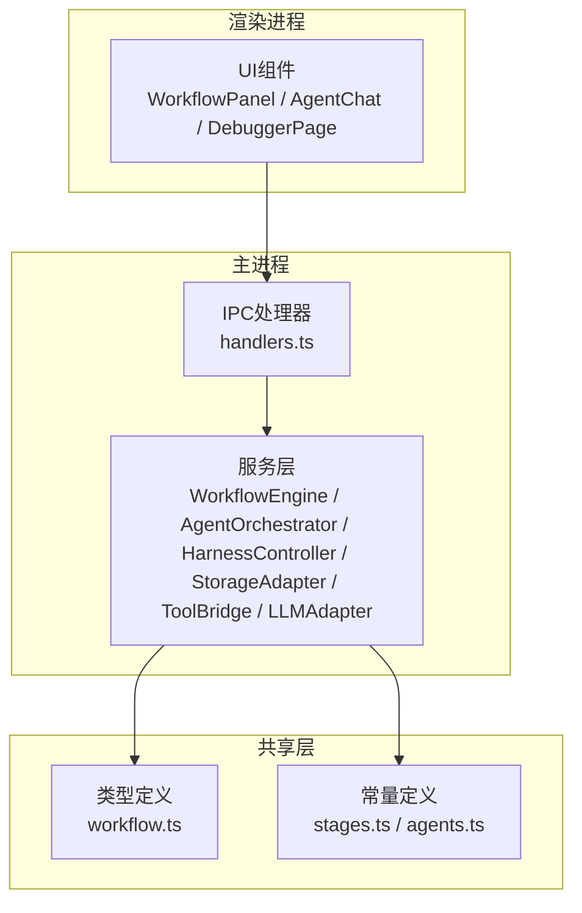
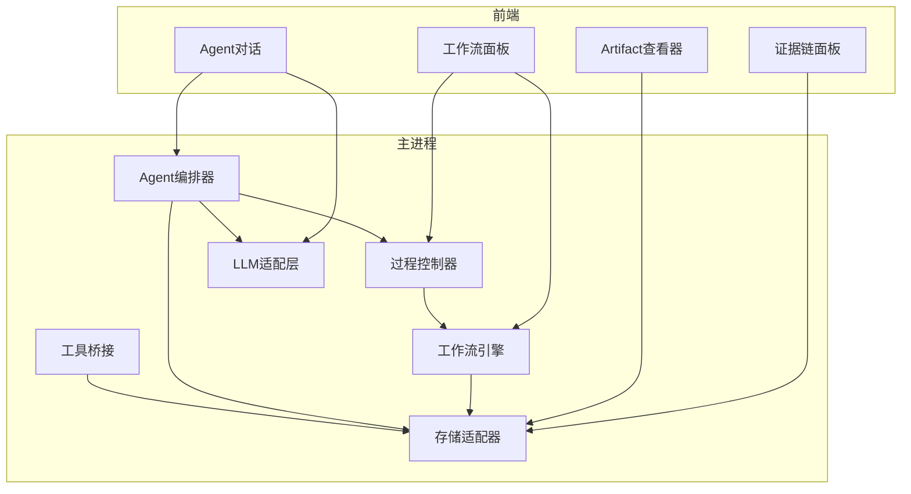
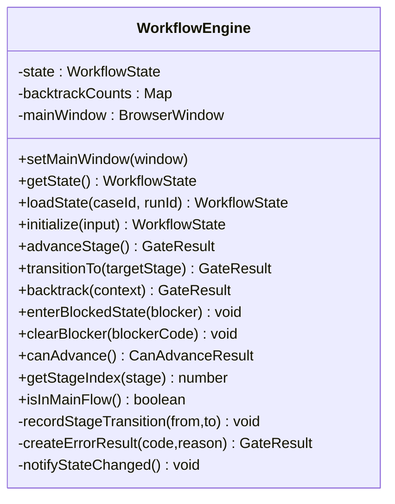
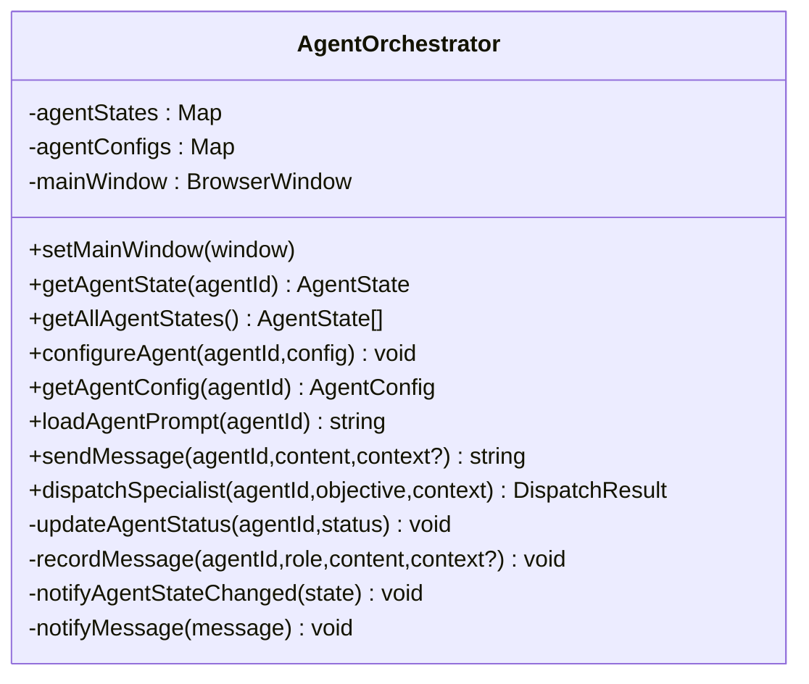
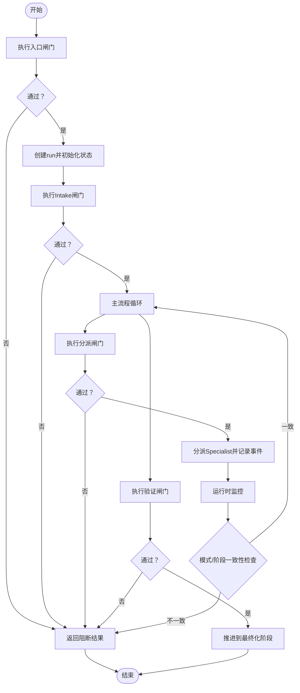
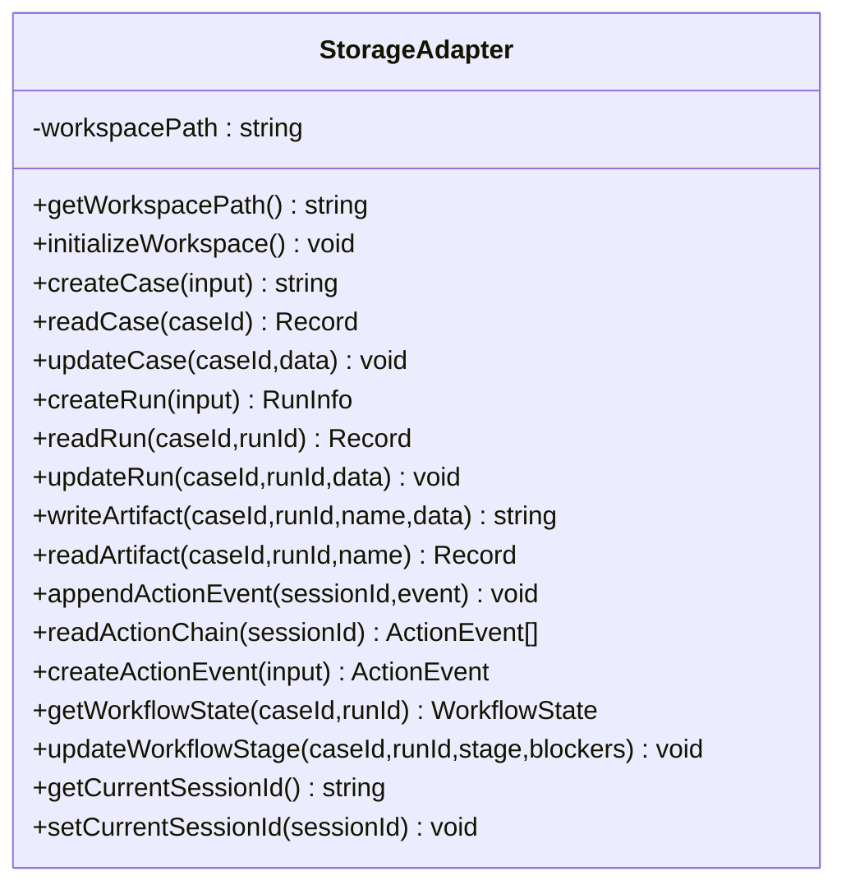
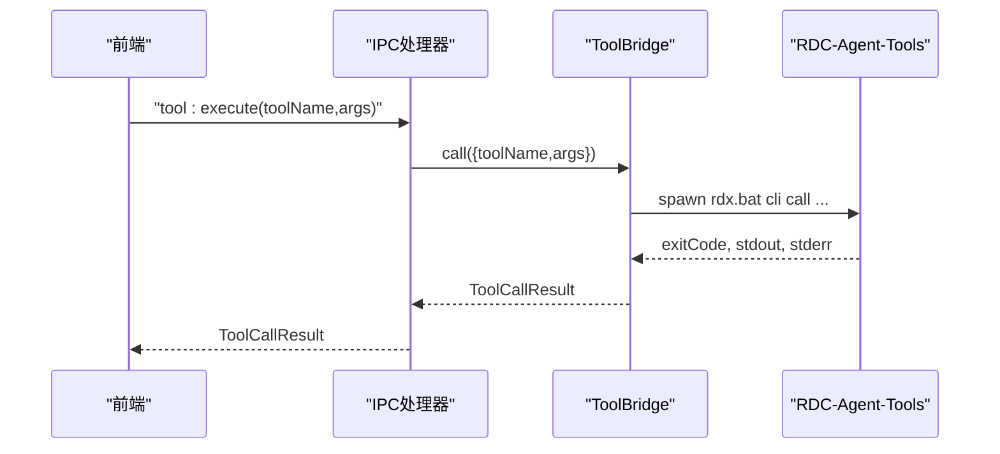
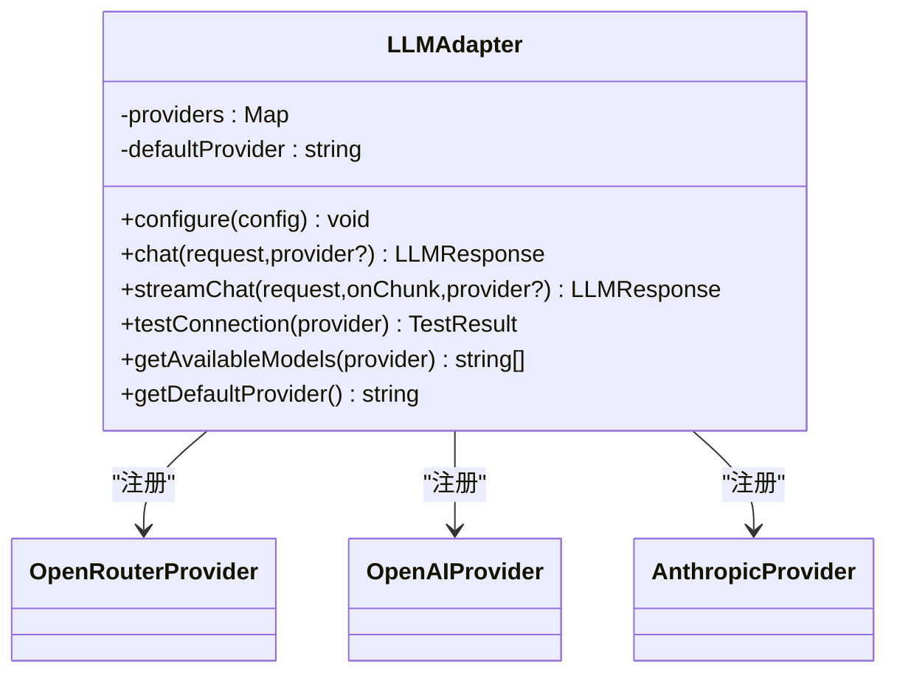
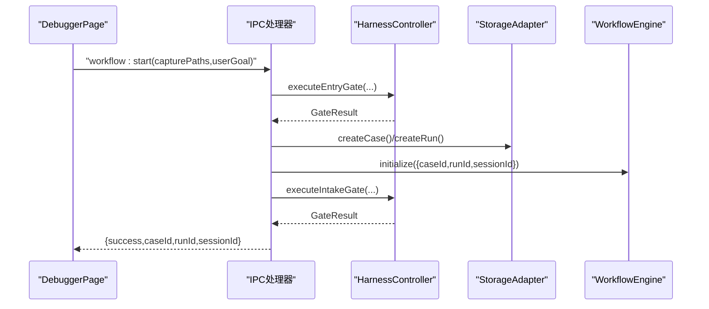
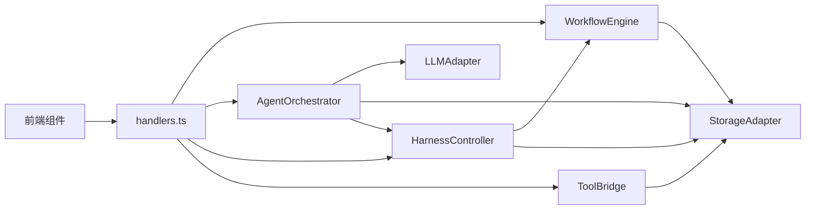

# 工作流引擎

<cite>
**本文档引用的文件**
- [WorkflowEngine.ts](file://src/main/services/WorkflowEngine.ts)
- [AgentOrchestrator.ts](file://src/main/services/AgentOrchestrator.ts)
- [HarnessController.ts](file://src/main/services/HarnessController.ts)
- [StorageAdapter.ts](file://src/main/services/StorageAdapter.ts)
- [ToolBridge.ts](file://src/main/services/ToolBridge.ts)
- [LLMAdapter.ts](file://src/main/adapters/LLMAdapter.ts)
- [handlers.ts](file://src/main/ipc/handlers.ts)
- [workflow.ts](file://src/shared/types/workflow.ts)
- [stages.ts](file://src/shared/constants/stages.ts)
- [agents.ts](file://src/shared/constants/agents.ts)
- [index.tsx](file://src/renderer/components/WorkflowPanel/index.tsx)
- [index.tsx](file://src/renderer/components/AgentChat/index.tsx)
- [index.tsx](file://src/renderer/pages/Debugger/index.tsx)
- [package.json](file://package.json)
</cite>

## 目录
1. [简介](#简介)
2. [项目结构](#项目结构)
3. [核心组件](#核心组件)
4. [架构总览](#架构总览)
5. [详细组件分析](#详细组件分析)
6. [依赖关系分析](#依赖关系分析)
7. [性能考虑](#性能考虑)
8. [故障排除指南](#故障排除指南)
9. [结论](#结论)

## 简介
本项目是一个基于 Electron 的渲染调试 Agent 工作流系统，采用“过程控制器 + 多智能体编排”的垂直框架设计。系统围绕 12 阶段工作流状态机展开，结合前置闸门控制、运行时一致性校验与受控回转机制，确保调试流程的规范性与可追溯性。后端通过 LLM 适配层与工具桥接层连接外部能力，前端提供可视化的工作流面板、Agent 对话与证据链展示。

## 项目结构
项目采用主进程-渲染进程分离的架构，核心逻辑位于主进程的服务层，前端通过 IPC 与主进程交互。

**图表来源**
- [handlers.ts:18-267](file://src/main/ipc/handlers.ts#L18-L267)
- [WorkflowEngine.ts:62-369](file://src/main/services/WorkflowEngine.ts#L62-L369)
- [AgentOrchestrator.ts:29-401](file://src/main/services/AgentOrchestrator.ts#L29-L401)
- [HarnessController.ts:43-444](file://src/main/services/HarnessController.ts#L43-L444)
- [StorageAdapter.ts:22-442](file://src/main/services/StorageAdapter.ts#L22-L442)
- [ToolBridge.ts:13-308](file://src/main/services/ToolBridge.ts#L13-L308)
- [LLMAdapter.ts:325-425](file://src/main/adapters/LLMAdapter.ts#L325-L425)

**章节来源**
- [package.json:1-67](file://package.json#L1-L67)

## 核心组件
- 工作流引擎（WorkflowEngine）：实现 12 阶段状态机与受控回转，负责状态持久化与 UI 通知。
- Agent 编排器（AgentOrchestrator）：管理多 Agent 角色、系统提示词与模型配置，负责 Specialist 分派与消息记录。
- 过程控制器（HarnessController）：前置闸门与运行时一致性校验，封装工具执行并检测早期阻断。
- 存储适配器（StorageAdapter）：管理 workspace 目录结构、run/case/artifact/action_chain 的读写。
- 工具桥接（ToolBridge）：与 RDC-Agent-Tools CLI/MCP 通信，封装命令执行与结果解析。
- LLM 适配层（LLMAdapter）：统一 OpenRouter/OpenAI/Anthropic 等提供商接口。
- IPC 处理器（handlers.ts）：注册主进程 IPC 处理函数，串联前端 UI 与后端服务。

**章节来源**
- [WorkflowEngine.ts:62-369](file://src/main/services/WorkflowEngine.ts#L62-L369)
- [AgentOrchestrator.ts:29-401](file://src/main/services/AgentOrchestrator.ts#L29-L401)
- [HarnessController.ts:43-444](file://src/main/services/HarnessController.ts#L43-L444)
- [StorageAdapter.ts:22-442](file://src/main/services/StorageAdapter.ts#L22-L442)
- [ToolBridge.ts:13-308](file://src/main/services/ToolBridge.ts#L13-L308)
- [LLMAdapter.ts:325-425](file://src/main/adapters/LLMAdapter.ts#L325-L425)
- [handlers.ts:18-267](file://src/main/ipc/handlers.ts#L18-L267)

## 架构总览
系统以“过程控制器”为核心，贯穿“入口闸门 → Intake 闸门 → Specialist 分派 → 验证闸门 → 最终化”的主流程；同时具备“阻断态”与“等待用户输入”等特殊状态，配合受控回转规则实现稳健的容错与恢复。

**图表来源**
- [handlers.ts:18-267](file://src/main/ipc/handlers.ts#L18-L267)
- [WorkflowEngine.ts:62-369](file://src/main/services/WorkflowEngine.ts#L62-L369)
- [AgentOrchestrator.ts:29-401](file://src/main/services/AgentOrchestrator.ts#L29-L401)
- [HarnessController.ts:43-444](file://src/main/services/HarnessController.ts#L43-L444)
- [StorageAdapter.ts:22-442](file://src/main/services/StorageAdapter.ts#L22-L442)
- [ToolBridge.ts:13-308](file://src/main/services/ToolBridge.ts#L13-L308)
- [LLMAdapter.ts:325-425](file://src/main/adapters/LLMAdapter.ts#L325-L425)

## 详细组件分析

### 工作流引擎（WorkflowEngine）
- 状态机与转换：定义 12 主阶段与“阻断/等待输入”等特殊状态，提供推进与指定转换接口，并记录阶段转换事件。
- 受控回转：基于触发条件（如 Specialist 超时、Skeptic 拒绝、低置信度）进行有限次回转，必要时要求用户确认。
- 阻断管理：维护 blockers 列表，当出现 critical blocker 时自动进入 validation_blocked。
- UI 通知：通过主窗口向渲染进程推送状态变更事件，驱动前端面板刷新。

**图表来源**
- [WorkflowEngine.ts:62-369](file://src/main/services/WorkflowEngine.ts#L62-L369)

**章节来源**
- [WorkflowEngine.ts:62-369](file://src/main/services/WorkflowEngine.ts#L62-L369)
- [workflow.ts:22-80](file://src/shared/types/workflow.ts#L22-L80)
- [stages.ts:7-31](file://src/shared/constants/stages.ts#L7-L31)

### Agent 编排器（AgentOrchestrator）
- 角色与分类：内置 9 个 Agent 角色，分为编排者、调查者、验证者与报告者四类，具备不同的写入范围。
- Prompt 管理：优先从 workspace 加载自定义技能模板，否则使用默认描述；支持按角色动态加载。
- Specialist 分派：执行分派闸门检查，生成 capability token 并记录 dispatch 事件，随后调用 LLM 获取响应并记录 artifact_write 事件。
- 状态与消息：维护 Agent 状态与消息链，通过 IPC 通知前端更新 UI。

**图表来源**
- [AgentOrchestrator.ts:29-401](file://src/main/services/AgentOrchestrator.ts#L29-L401)
- [agents.ts:11-107](file://src/shared/constants/agents.ts#L11-L107)

**章节来源**
- [AgentOrchestrator.ts:29-401](file://src/main/services/AgentOrchestrator.ts#L29-L401)
- [agents.ts:11-107](file://src/shared/constants/agents.ts#L11-L107)

### 过程控制器（HarnessController）
- 前置闸门：EntryGate（校验 .rdc 文件存在性与平台模式），IntakeGate（校验 case_input、capture_refs、fix_reference），DispatchGate（校验模式一致性与目标 Agent 有效性），VerifyGate（校验修复验证结构）。
- 运行时监控：模式一致性检查（multi_agent 与 dispatch 证据一致性）、阶段一致性检查（workflow_stage 与 action_chain 推断值一致性）。
- 工具执行包装：统一记录工具执行事件到 action_chain，包含耗时、参数与结果摘要。
- 早期阻断检测：实时扫描 hypothesis_board 与 freeze_state，发现 blockers 自动更新工作流状态。

**图表来源**
- [HarnessController.ts:66-236](file://src/main/services/HarnessController.ts#L66-L236)
- [HarnessController.ts:244-314](file://src/main/services/HarnessController.ts#L244-L314)
- [HarnessController.ts:320-358](file://src/main/services/HarnessController.ts#L320-L358)
- [HarnessController.ts:364-418](file://src/main/services/HarnessController.ts#L364-L418)

**章节来源**
- [HarnessController.ts:43-444](file://src/main/services/HarnessController.ts#L43-L444)

### 存储适配器（StorageAdapter）
- 目录结构：统一管理 workspace 下 cases/common/config 等目录，按 case/run/artifacts/notes/logs 等层级组织。
- Case/Run 管理：创建/读取/更新 case 与 run，写入 run.yaml、capture_refs.yaml、hypothesis_board.yaml。
- Artifact 管理：提供 YAML/JSONL 读写工具，统一 action_chain 存储格式。
- 工作流状态同步：从 run.runtime 中读取/更新 workflow_stage，并在出现 blockers 时同步至 hypothesis_board。

**图表来源**
- [StorageAdapter.ts:22-442](file://src/main/services/StorageAdapter.ts#L22-L442)

**章节来源**
- [StorageAdapter.ts:22-442](file://src/main/services/StorageAdapter.ts#L22-L442)

### 工具桥接（ToolBridge）
- 路径与可用性：根据打包状态定位 resources/tools，检查 rdx.bat 是否存在。
- 目录加载：读取 tool_catalog.json 作为工具目录清单。
- CLI 执行：封装 cmd.exe 调用，支持超时、stdout/stderr 捕获与结果解析。
- 工具调用：提供 openCapture/openReplay/getSessionContext 等常用工具的便捷方法。

**图表来源**
- [handlers.ts:190-195](file://src/main/ipc/handlers.ts#L190-L195)
- [ToolBridge.ts:140-201](file://src/main/services/ToolBridge.ts#L140-L201)

**章节来源**
- [ToolBridge.ts:13-308](file://src/main/services/ToolBridge.ts#L13-L308)
- [handlers.ts:182-195](file://src/main/ipc/handlers.ts#L182-L195)

### LLM 适配层（LLMAdapter）
- 提供商抽象：OpenRouter（必须）、OpenAI、Anthropic 等，统一 chat/stream 接口。
- 模型与消息归一化：处理多模态内容与不同提供商的消息格式差异。
- 连接测试与模型查询：支持测试提供商连通性与列出可用模型。

**图表来源**
- [LLMAdapter.ts:325-425](file://src/main/adapters/LLMAdapter.ts#L325-L425)

**章节来源**
- [LLMAdapter.ts:19-193](file://src/main/adapters/LLMAdapter.ts#L19-L193)
- [LLMAdapter.ts:198-320](file://src/main/adapters/LLMAdapter.ts#L198-L320)
- [LLMAdapter.ts:325-425](file://src/main/adapters/LLMAdapter.ts#L325-L425)

### 前端组件与页面
- 工作流面板（WorkflowPanel）：按阶段分组显示进度，监听 workflow:stateChanged 与 evidence:eventAdded 更新 UI。
- Agent 对话（AgentChat）：显示消息历史，监听 agent:message 与 agent:statusChanged，支持发送用户消息。
- 调试页（DebuggerPage）：欢迎界面支持拖拽与选择 .rdc 文件，启动后切换到调试工作区。

**图表来源**
- [handlers.ts:45-106](file://src/main/ipc/handlers.ts#L45-L106)
- [HarnessController.ts:66-143](file://src/main/services/HarnessController.ts#L66-L143)
- [StorageAdapter.ts:78-236](file://src/main/services/StorageAdapter.ts#L78-L236)
- [WorkflowEngine.ts:92-115](file://src/main/services/WorkflowEngine.ts#L92-L115)

**章节来源**
- [index.tsx:1-100](file://src/renderer/components/WorkflowPanel/index.tsx#L1-L100)
- [index.tsx:1-155](file://src/renderer/components/AgentChat/index.tsx#L1-L155)
- [index.tsx:1-119](file://src/renderer/pages/Debugger/index.tsx#L1-L119)

## 依赖关系分析
- 组件耦合：WorkflowEngine 与 StorageAdapter 强耦合（状态持久化），HarnessController 依赖 WorkflowEngine 与 StorageAdapter（一致性校验与阻断传播）。
- 外部依赖：LLM 适配层依赖网络访问；ToolBridge 依赖本地工具二进制；IPC 处理器作为前后端桥梁。
- 循环依赖：当前文件未见循环导入，但需注意服务间通过单例共享引用，避免在构造函数中相互依赖。

**图表来源**
- [handlers.ts:18-267](file://src/main/ipc/handlers.ts#L18-L267)
- [WorkflowEngine.ts:16-17](file://src/main/services/WorkflowEngine.ts#L16-L17)
- [HarnessController.ts:13-14](file://src/main/services/HarnessController.ts#L13-L14)
- [AgentOrchestrator.ts:24-26](file://src/main/services/AgentOrchestrator.ts#L24-L26)
- [StorageAdapter.ts:8-20](file://src/main/services/StorageAdapter.ts#L8-L20)
- [ToolBridge.ts:6-11](file://src/main/services/ToolBridge.ts#L6-L11)
- [LLMAdapter.ts:6-14](file://src/main/adapters/LLMAdapter.ts#L6-L14)

**章节来源**
- [handlers.ts:18-267](file://src/main/ipc/handlers.ts#L18-L267)

## 性能考虑
- I/O 优化：action_chain 使用 JSONL 追加写入，避免大文件频繁重写；artifact 采用 YAML，按需读写。
- 状态持久化：工作流状态与 blockers 同步写入 run.runtime 与 hypothesis_board，减少重复计算。
- LLM 调用：提供流式接口与超时控制，建议在 UI 层实现分片渲染与取消机制。
- 工具执行：CLI 调用带超时与进程管理，避免僵尸进程；批量工具调用建议合并或异步化。

## 故障排除指南
- 闸门阻断：检查 EntryGate/IntakeGate/DispatchGate/VerifyGate 的输入参数与 workspace 文件是否存在。
- 阻断态无法推进：确认 blockers 是否被清除，或是否存在 critical blocker 导致停留在 validation_blocked。
- Agent 分派失败：确认分派闸门检查结果，检查 capability token 生成与 Specialist 状态。
- 工具调用异常：检查 rdx.bat 是否存在、工具目录是否正确、CLI 输出是否包含错误信息。
- LLM 连接问题：测试提供商连通性，确认 API Key 配置与模型列表可用。

**章节来源**
- [HarnessController.ts:66-236](file://src/main/services/HarnessController.ts#L66-L236)
- [WorkflowEngine.ts:252-277](file://src/main/services/WorkflowEngine.ts#L252-L277)
- [ToolBridge.ts:140-201](file://src/main/services/ToolBridge.ts#L140-L201)
- [LLMAdapter.ts:393-405](file://src/main/adapters/LLMAdapter.ts#L393-L405)

## 结论
该工作流引擎以“过程控制器 + 多智能体编排”为核心，通过严格的前置闸门与运行时监控保障流程质量，结合受控回转与阻断态机制提升鲁棒性。存储与事件链的设计使得整个调试过程可追踪、可审计。前端通过直观的面板与对话组件，将复杂的状态机与工具链整合为易用的调试体验。后续可在以下方面持续优化：增强 UI 的交互反馈与错误提示、引入更细粒度的并发控制与资源隔离、扩展更多提供商与工具生态。