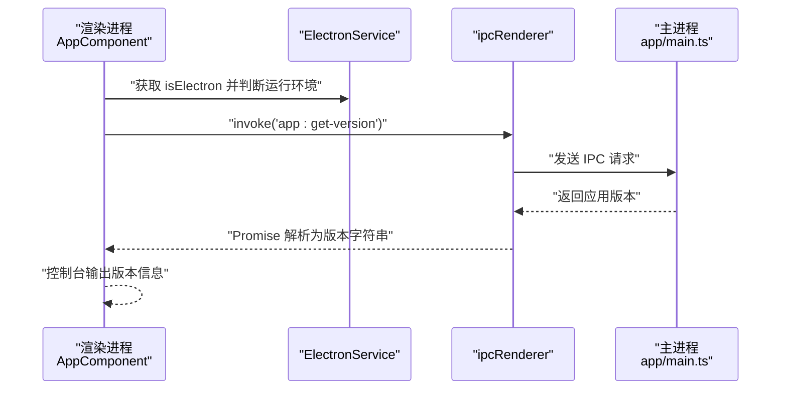
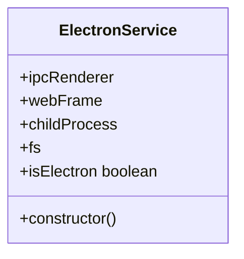
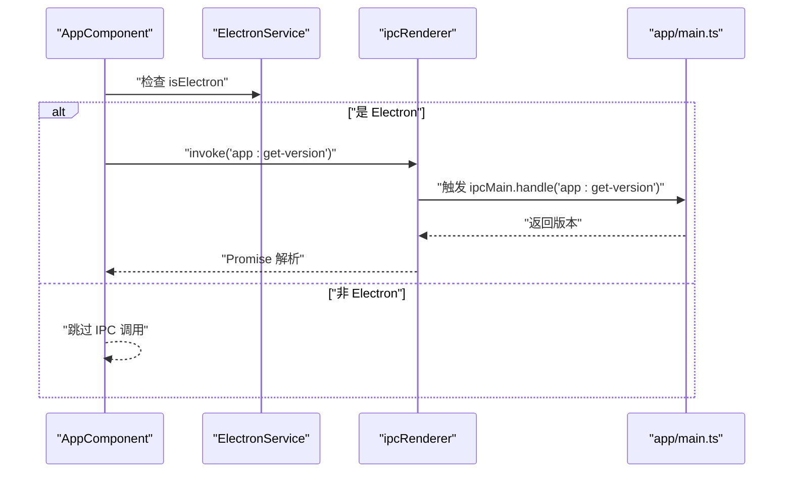
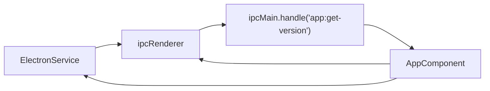

# 数据流设计

<cite>
**本文引用的文件**
- [src/app/core/services/electron/electron.service.ts](file://src/app/core/services/electron/electron.service.ts)
- [src/app/core/core.module.ts](file://src/app/core/core.module.ts)
- [src/app/app.component.ts](file://src/app/app.component.ts)
- [src/main.ts](file://src/main.ts)
- [app/main.ts](file://app/main.ts)
- [src/app/home/home.component.ts](file://src/app/home/home.component.ts)
- [src/app/detail/detail.component.ts](file://src/app/detail/detail.component.ts)
- [src/app/shared/shared.module.ts](file://src/app/shared/shared.module.ts)
- [src/app/shared/directives/webview/webview.directive.ts](file://src/app/shared/directives/webview/webview.directive.ts)
- [src/app/shared/components/page-not-found/page-not-found.component.ts](file://src/app/shared/components/page-not-found/page-not-found.component.ts)
- [src/environments/environment.ts](file://src/environments/environment.ts)
- [package.json](file://package.json)
- [angular.json](file://angular.json)
</cite>

## 目录
1. [引言](#引言)
2. [项目结构](#项目结构)
3. [核心组件](#核心组件)
4. [架构总览](#架构总览)
5. [详细组件分析](#详细组件分析)
6. [依赖关系分析](#依赖关系分析)
7. [性能考虑](#性能考虑)
8. [故障排查指南](#故障排查指南)
9. [结论](#结论)
10. [附录](#附录)

## 引言
本文件围绕该 Electron + Angular 应用的数据流设计进行系统性技术说明，重点覆盖以下方面：
- 用户交互到状态更新的完整数据路径
- ElectronService 作为渲染进程与主进程之间的数据桥接层，如何通过 IPC 将请求转发至主进程并返回结果
- 组件间通信模式：父子、兄弟与跨层级通信
- 状态管理模式：本地状态、服务层共享与持久化策略
- 数据流优化建议与性能监控方法

该仓库采用 Angular 单页应用（SPA）与 Electron 主进程结合的方式运行，渲染进程通过 ElectronService 访问 Electron 的 IPC 能力，并在主进程中注册处理函数以响应渲染进程的调用。

## 项目结构
项目采用 Angular 工程与 Electron 主进程分离的组织方式：
- 渲染进程（Angular 应用）位于 src/ 目录，包含核心模块、页面组件、共享模块与指令等
- 主进程（Electron）位于 app/ 目录，包含主进程入口与窗口生命周期逻辑
- 构建与脚本由根目录 package.json 管理，angular.json 定义构建与开发服务器配置

```mermaid
graph TB
subgraph "渲染进程Angular"
A["src/main.ts<br/>引导应用与路由"]
B["src/app/app.component.ts<br/>根组件"]
C["src/app/core/services/electron/electron.service.ts<br/>ElectronService"]
D["src/app/home/home.component.ts<br/>首页组件"]
E["src/app/detail/detail.component.ts<br/>详情组件"]
F["src/app/shared/shared.module.ts<br/>共享模块"]
G["src/app/shared/directives/webview/webview.directive.ts<br/>Webview 指令"]
end
subgraph "主进程Electron"
M["app/main.ts<br/>主进程入口与IPC处理"]
end
A --> B
B --> C
B --> D
B --> E
D --> F
E --> F
C <- --> M
```

图表来源
- [src/main.ts:21-56](file://src/main.ts#L21-L56)
- [src/app/app.component.ts:14-34](file://src/app/app.component.ts#L14-L34)
- [src/app/core/services/electron/electron.service.ts:12-56](file://src/app/core/services/electron/electron.service.ts#L12-L56)
- [src/app/home/home.component.ts:12-18](file://src/app/home/home.component.ts#L12-L18)
- [src/app/detail/detail.component.ts:12-20](file://src/app/detail/detail.component.ts#L12-L20)
- [src/app/shared/shared.module.ts:8-13](file://src/app/shared/shared.module.ts#L8-L13)
- [src/app/shared/directives/webview/webview.directive.ts:3-9](file://src/app/shared/directives/webview/webview.directive.ts#L3-L9)
- [app/main.ts:64-93](file://app/main.ts#L64-L93)

章节来源
- [src/main.ts:21-56](file://src/main.ts#L21-L56)
- [angular.json:24-82](file://angular.json#L24-L82)
- [package.json:27-47](file://package.json#L27-L47)

## 核心组件
- ElectronService：在渲染进程中提供条件导入的 Electron 能力（如 ipcRenderer、fs、child_process），并在检测到运行于 Electron 环境时初始化这些能力；同时提供 isElectron 判断，用于区分浏览器与 Electron 运行环境
- 根组件 AppComponent：在构造函数中使用 ElectronService 判断运行环境，并通过 ipcRenderer.invoke 向主进程发起版本查询请求
- 主进程 app/main.ts：在 ipcMain 上注册 handle 回调，接收来自渲染进程的 IPC 请求并返回结果
- 页面组件：Home、Detail、PageNotFound 均为轻量组件，负责视图与路由导航
- 共享模块与指令：提供国际化、表单与通用指令支持

章节来源
- [src/app/core/services/electron/electron.service.ts:12-56](file://src/app/core/services/electron/electron.service.ts#L12-L56)
- [src/app/app.component.ts:18-33](file://src/app/app.component.ts#L18-L33)
- [app/main.ts:65-65](file://app/main.ts#L65-L65)
- [src/app/home/home.component.ts:12-18](file://src/app/home/home.component.ts#L12-L18)
- [src/app/detail/detail.component.ts:12-20](file://src/app/detail/detail.component.ts#L12-L20)
- [src/app/shared/shared.module.ts:8-13](file://src/app/shared/shared.module.ts#L8-L13)
- [src/app/shared/directives/webview/webview.directive.ts:3-9](file://src/app/shared/directives/webview/webview.directive.ts#L3-L9)

## 架构总览
渲染进程与主进程之间通过 Electron 的 IPC 实现松耦合通信。渲染进程通过 ElectronService 的 ipcRenderer.invoke 发起请求，主进程在 app/main.ts 中通过 ipcMain.handle 注册处理函数，完成业务逻辑后返回结果。此模式既保证了渲染进程的安全隔离，又提供了必要的系统级能力访问。



图表来源
- [src/app/app.component.ts:24-29](file://src/app/app.component.ts#L24-L29)
- [src/app/core/services/electron/electron.service.ts:18-50](file://src/app/core/services/electron/electron.service.ts#L18-L50)
- [app/main.ts:65-65](file://app/main.ts#L65-L65)

## 详细组件分析

### ElectronService：渲染进程桥接层
- 角色与职责
  - 在渲染进程中按需加载 Electron 的 Node 集成能力（ipcRenderer、webFrame、fs、childProcess）
  - 提供 isElectron 判定，避免在浏览器环境中执行仅 Electron 可用的逻辑
  - 为后续扩展更多 IPC 调用提供统一入口
- 设计要点
  - 条件导入：仅在 Electron 环境下才挂载相关模块，避免打包到浏览器端
  - 安全提示：注释强调了 Node 依赖在不同 package.json 中的声明要求，以及 ipcRenderer.invoke 的常见用途
- 扩展建议
  - 新增 IPC 调用时，优先在 ElectronService 中封装，保持调用点集中、便于测试与维护
  - 对于需要双向通信或高频事件，可考虑使用 ipcRenderer.on/oneway 或自定义事件通道



图表来源
- [src/app/core/services/electron/electron.service.ts:12-56](file://src/app/core/services/electron/electron.service.ts#L12-L56)

章节来源
- [src/app/core/services/electron/electron.service.ts:12-56](file://src/app/core/services/electron/electron.service.ts#L12-L56)

### 根组件与 IPC 请求流程
- 流程概述
  - 根组件在构造函数中注入 ElectronService
  - 使用 isElectron 判断当前运行环境
  - 在 Electron 环境下，通过 ipcRenderer.invoke('app:get-version') 获取应用版本
  - 主进程在 app/main.ts 中注册对应 handle，返回 app.getVersion()
- 错误处理与边界
  - 若非 Electron 环境，跳过 IPC 调用，避免异常
  - 子进程执行示例展示了如何在渲染进程中安全地调用系统命令（注意生产环境的安全与权限）



图表来源
- [src/app/app.component.ts:18-33](file://src/app/app.component.ts#L18-L33)
- [app/main.ts:65-65](file://app/main.ts#L65-L65)

章节来源
- [src/app/app.component.ts:18-33](file://src/app/app.component.ts#L18-L33)
- [app/main.ts:65-65](file://app/main.ts#L65-L65)

### 页面组件与路由
- 组件职责
  - Home、Detail、PageNotFound 均为展示型组件，负责模板与路由导航
  - 通过路由配置实现页面切换，未直接参与数据桥接逻辑
- 通信模式
  - 父子通信：根组件与页面组件无直接父子绑定，主要通过路由参数与状态管理间接传递
  - 兄弟组件通信：页面内无兄弟组件，跨层级通过路由与服务共享
  - 跨层级通信：通过 ElectronService 与主进程交互，形成跨进程通信

章节来源
- [src/app/home/home.component.ts:12-18](file://src/app/home/home.component.ts#L12-L18)
- [src/app/detail/detail.component.ts:12-20](file://src/app/detail/detail.component.ts#L12-L20)
- [src/app/shared/components/page-not-found/page-not-found.component.ts:9-15](file://src/app/shared/components/page-not-found/page-not-found.component.ts#L9-L15)
- [src/main.ts:32-50](file://src/main.ts#L32-L50)

### 共享模块与指令
- 共享模块
  - 导入并导出国际化与表单模块，为页面组件提供通用能力
- 指令
  - Webview 指令目前为空实现，可作为未来扩展点（例如封装 webview 生命周期或属性绑定）

章节来源
- [src/app/shared/shared.module.ts:8-13](file://src/app/shared/shared.module.ts#L8-L13)
- [src/app/shared/directives/webview/webview.directive.ts:3-9](file://src/app/shared/directives/webview/webview.directive.ts#L3-L9)

## 依赖关系分析
- 运行时依赖
  - Electron 主进程与渲染进程通过 ipcMain.handle 与 ipcRenderer.invoke 形成稳定的请求-响应链路
  - ElectronService 作为桥接层，集中管理 Node 集成能力，降低各组件对 Electron 的直接耦合
- 构建与脚本
  - 根 package.json 提供开发、构建与打包脚本，支持热重载与多平台打包
  - angular.json 定义构建目标、样式与资源路径，确保渲染进程正确打包



图表来源
- [src/app/core/services/electron/electron.service.ts:18-50](file://src/app/core/services/electron/electron.service.ts#L18-L50)
- [src/app/app.component.ts:24-29](file://src/app/app.component.ts#L24-L29)
- [app/main.ts:65-65](file://app/main.ts#L65-L65)

章节来源
- [package.json:27-47](file://package.json#L27-L47)
- [angular.json:24-82](file://angular.json#L24-L82)

## 性能考虑
- IPC 调用频率与批量处理
  - 高频调用应合并或节流，避免阻塞渲染线程
  - 对于一次性读取的系统信息，尽量缓存结果，减少重复 IPC
- 资源与窗口
  - 主进程窗口创建时已启用必要的 webPreferences，注意在生产环境关闭不必要的 Node 集成以提升安全性
- 构建与运行
  - 生产配置开启 AOT 与优化，有助于减小包体与提升启动速度
  - 开发阶段利用 Angular DevServer 与 Electron 重载工具，缩短迭代周期

## 故障排查指南
- Electron 环境判断失败
  - 确认 isElectron 判定逻辑是否被正确执行，避免在浏览器中调用仅 Electron 可用的能力
- IPC 调用无响应
  - 检查主进程是否已注册对应的 handle，确认通道名称一致
  - 在渲染进程捕获 Promise 拒绝并记录错误日志，定位问题
- Node 依赖不可用
  - 根据 ElectronService 注释中的说明，确保依赖同时出现在根 package.json 与 app/package.json 的 dependencies 中
- 子进程执行异常
  - 检查命令是否存在且具备执行权限，避免在渲染进程中滥用高权限操作

章节来源
- [src/app/core/services/electron/electron.service.ts:39-49](file://src/app/core/services/electron/electron.service.ts#L39-L49)
- [src/app/app.component.ts:24-33](file://src/app/app.component.ts#L24-L33)
- [app/main.ts:65-65](file://app/main.ts#L65-L65)

## 结论
该应用通过 ElectronService 将渲染进程与主进程解耦，借助 IPC 实现安全可控的数据与能力桥接。组件间通信以路由与服务为主，未引入复杂的状态管理库，满足当前规模的功能需求。建议在后续迭代中：
- 明确 IPC 调用边界，统一在 ElectronService 中封装
- 对高频数据与系统信息进行缓存与去抖
- 在生产环境进一步收紧 Node 集成与上下文隔离策略
- 建立 IPC 调用的可观测性与性能基线，持续优化用户体验

## 附录
- 环境配置
  - APP_CONFIG 由环境文件提供，可用于区分开发/生产行为
- 路由与页面
  - 根路由重定向至 home，未匹配路由指向 404 页面组件
- 共享能力
  - 国际化与表单模块在共享模块中集中提供，便于复用

章节来源
- [src/environments/environment.ts:1-5](file://src/environments/environment.ts#L1-L5)
- [src/main.ts:32-50](file://src/main.ts#L32-L50)
- [src/app/shared/shared.module.ts:8-13](file://src/app/shared/shared.module.ts#L8-L13)