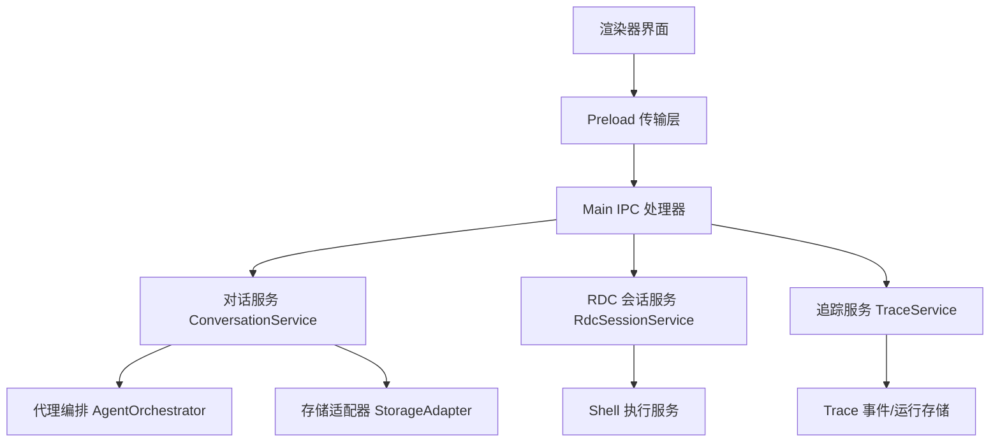
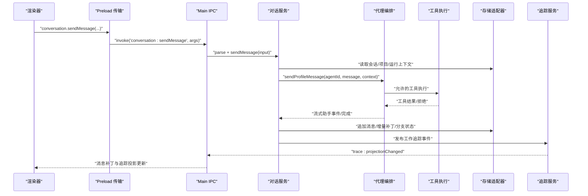
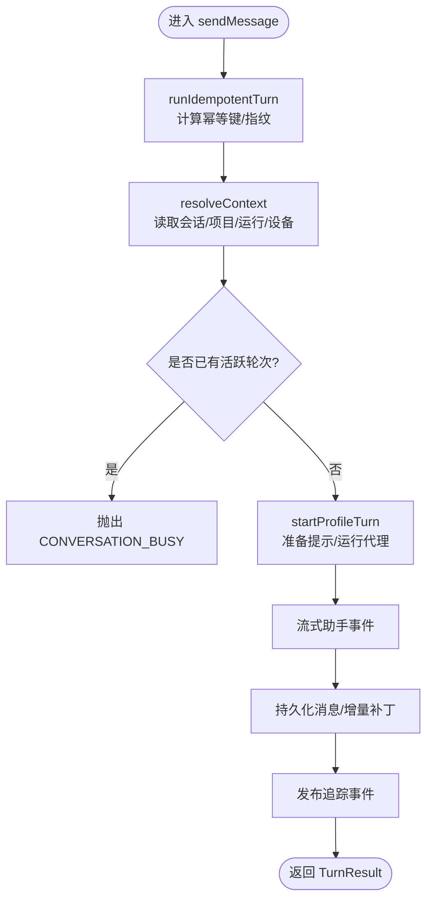
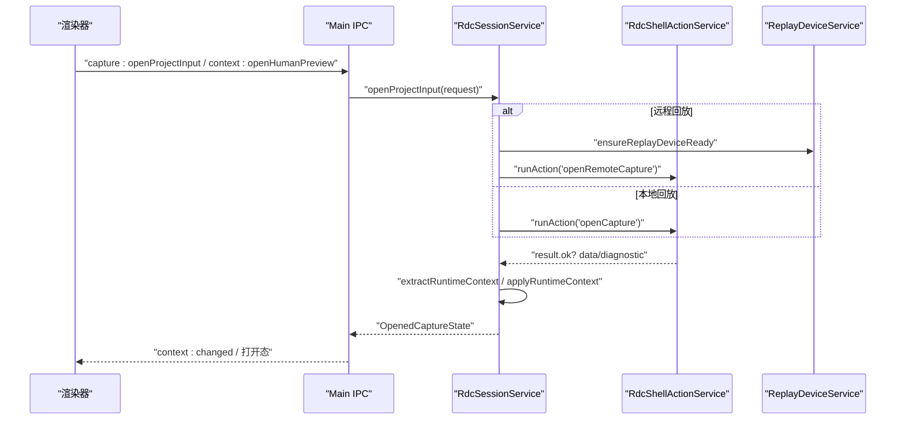
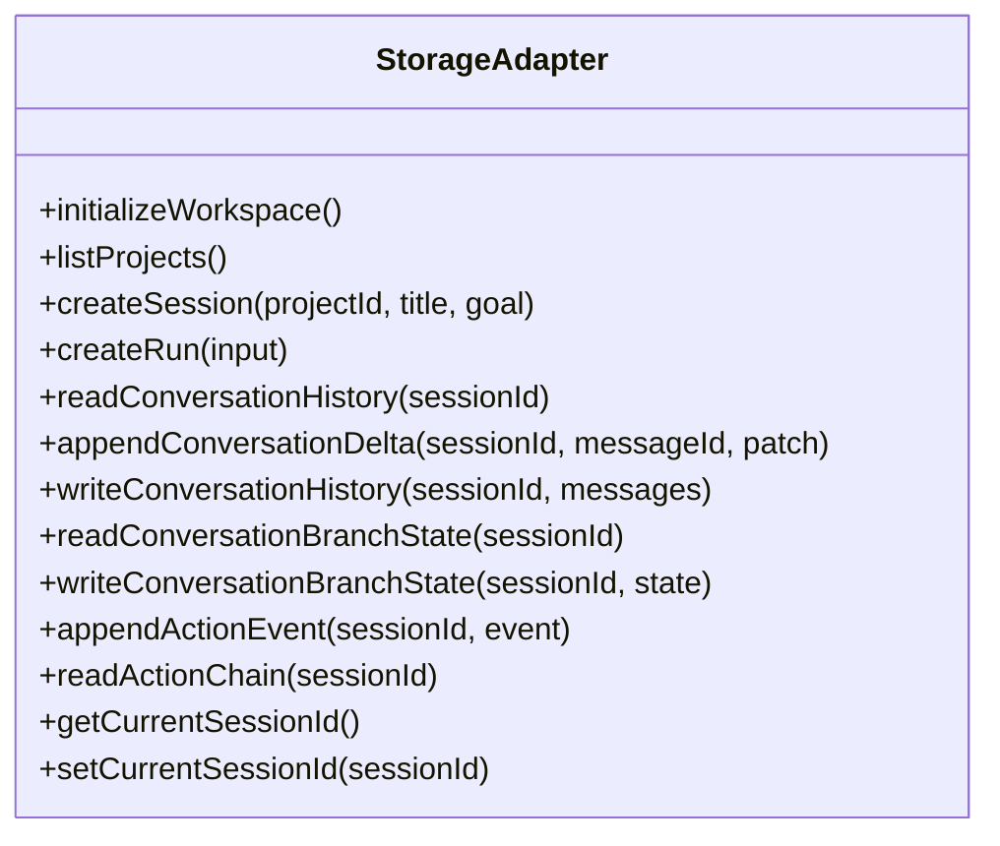
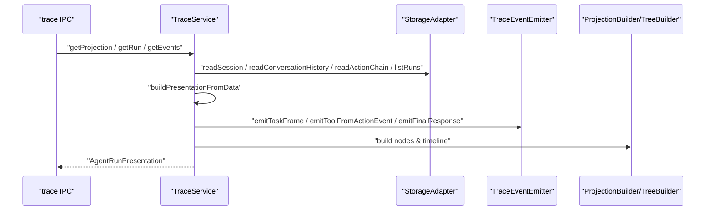
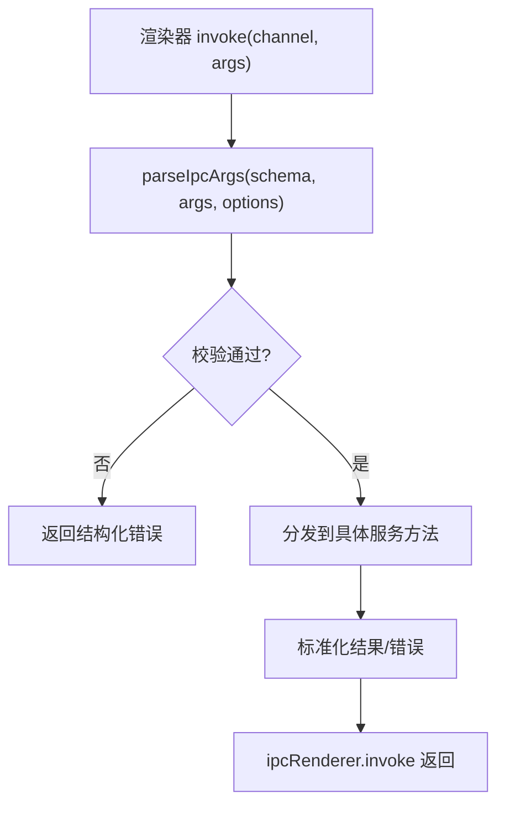
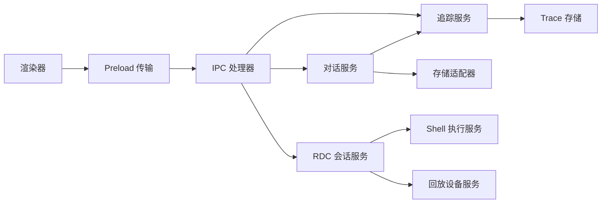
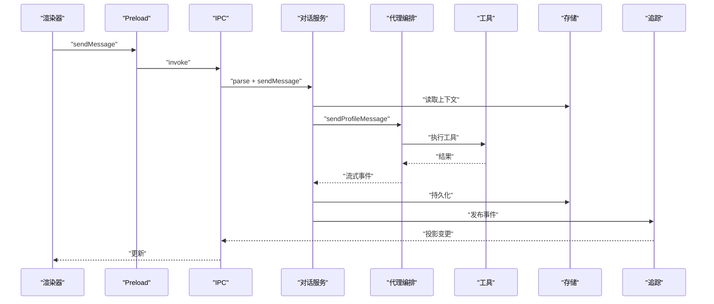
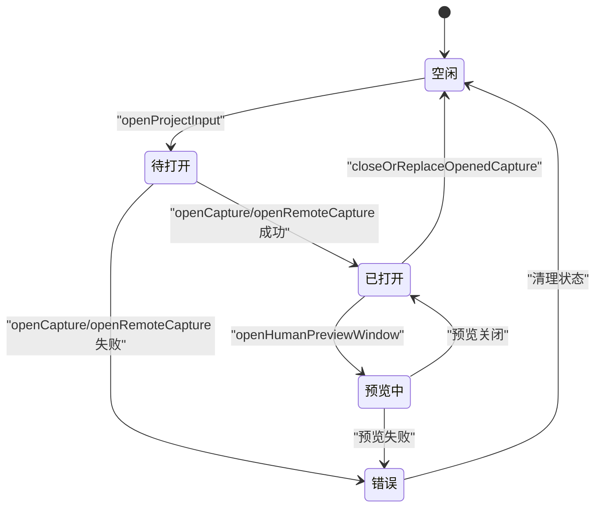

# 数据流设计

<cite>
**本文引用的文件**
- [data-flow.md](file://docs/architecture/data-flow.md)
- [IPC README](file://src/main/ipc/README.md)
- [conversationHandlers.ts](file://src/main/ipc/conversationHandlers.ts)
- [handlers.ts](file://src/main/ipc/handlers.ts)
- [conversationSchemas.ts](file://src/main/ipc/validation/conversationSchemas.ts)
- [ConversationService.ts](file://src/main/conversation/ConversationService.ts)
- [RdcSessionService.ts](file://src/main/sessions/RdcSessionService.ts)
- [StorageAdapter.ts](file://src/main/sessions/StorageAdapter.ts)
- [TraceService.ts](file://src/main/agent-trace/TraceService.ts)
- [agentic-trace-protocol.md](file://docs/architecture/agentic-trace-protocol.md)
- [rendererTransport.ts](file://src/preload/rendererTransport.ts)
- [AgentOrchestrator.ts](file://src/main/workflow/debugger/AgentOrchestrator.ts)
</cite>

## 目录
1. [引言](#引言)
2. [项目结构](#项目结构)
3. [核心组件](#核心组件)
4. [架构总览](#架构总览)
5. [详细组件分析](#详细组件分析)
6. [依赖关系分析](#依赖关系分析)
7. [性能考量](#性能考量)
8. [故障排查指南](#故障排查指南)
9. [结论](#结论)
10. [附录](#附录)

## 引言
本文件聚焦 RDC-Agent 的数据流转机制，覆盖从用户输入到 AI 响应的完整路径，并深入说明 IPC 消息格式、类型定义与校验、错误处理、会话状态管理、对话历史存储、实时数据同步、Agentic Trace 追踪数据流、调试信息收集与处理，以及序列化、压缩与缓存策略。文档提供数据流图与状态转换图，帮助开发者理解复杂的数据流转过程。

## 项目结构
RDC-Agent 采用分层与领域划分相结合的组织方式：
- 渲染层（Renderer）通过 Preload 暴露的 API 调用 Main 进程能力。
- Main 进程负责 IPC 路由、会话编排、工具执行、持久化与追踪投影。
- 共享类型与协议位于 shared/types 与 docs/architecture，保证跨进程契约一致。
- 存储层 StorageAdapter 统一封装项目、会话、运行记录、动作事件与对话历史的读写。

图表来源
- [data-flow.md:5-78](file://docs/architecture/data-flow.md#L5-L78)
- [IPC README:1-10](file://src/main/ipc/README.md#L1-L10)

章节来源
- [data-flow.md:1-87](file://docs/architecture/data-flow.md#L1-L87)
- [IPC README:1-10](file://src/main/ipc/README.md#L1-L10)

## 核心组件
- 对话服务 ConversationService：负责发送消息、重写消息、分支切换、取消活跃轮次、回答用户输入与工具审批、后台继续任务等。
- RDC 会话服务 RdcSessionService：管理本地/远程回放设备、打开/关闭捕获、人类预览窗口、运行时上下文生命周期。
- 存储适配器 StorageAdapter：统一项目、会话、运行、动作事件、对话历史、分支状态、附件、上下文日志等持久化操作。
- 追踪服务 TraceService：构建渲染器友好的 AgentRunPresentation，聚合运行、事件、右侧面板投影。
- 代理编排 AgentOrchestrator：协调提示计划、工具装配、执行、子代理与后台任务。
- IPC 处理器：将渲染器请求解析、校验后转发至对应服务，返回标准化结果。

章节来源
- [ConversationService.ts:78-109](file://src/main/conversation/ConversationService.ts#L78-L109)
- [RdcSessionService.ts:53-67](file://src/main/sessions/RdcSessionService.ts#L53-L67)
- [StorageAdapter.ts:41-66](file://src/main/sessions/StorageAdapter.ts#L41-L66)
- [TraceService.ts:103-114](file://src/main/agent-trace/TraceService.ts#L103-L114)
- [AgentOrchestrator.ts:75-145](file://src/main/workflow/debugger/AgentOrchestrator.ts#L75-L145)
- [conversationHandlers.ts:39-78](file://src/main/ipc/conversationHandlers.ts#L39-L78)

## 架构总览
下图展示“用户输入到 AI 响应”的端到端数据流，包括会话上下文准备、代理执行、工具调用、结果回写与追踪投影。

图表来源
- [data-flow.md:5-31](file://docs/architecture/data-flow.md#L5-L31)
- [conversationHandlers.ts:43-78](file://src/main/ipc/conversationHandlers.ts#L43-L78)
- [ConversationService.ts:545-569](file://src/main/conversation/ConversationService.ts#L545-L569)
- [TraceService.ts:141-152](file://src/main/agent-trace/TraceService.ts#L141-L152)

## 详细组件分析

### 组件A：对话服务 ConversationService
职责
- 接收并校验 IPC 请求，计算幂等指纹，避免重复提交。
- 解析会话上下文（项目、会话、当前运行、回放设备）。
- 启动或重写对话轮次，支持分支编辑与重发。
- 管理活跃轮次、后台继续任务、取消与中止。
- 与追踪服务协作，发布工作追踪事件。

关键流程
- 发送消息：进入 runIdempotentTurn -> resolveContext -> startProfileTurn。
- 重写消息：停止下游轮次 -> 创建新分支 -> 重新运行。
- 切换分支：停止活跃轮次 -> 同步槽位 -> 更新分支状态 -> 重建投影。

图表来源
- [ConversationService.ts:445-543](file://src/main/conversation/ConversationService.ts#L445-L543)
- [ConversationService.ts:545-569](file://src/main/conversation/ConversationService.ts#L545-L569)
- [ConversationService.ts:571-702](file://src/main/conversation/ConversationService.ts#L571-L702)
- [ConversationService.ts:704-741](file://src/main/conversation/ConversationService.ts#L704-L741)

章节来源
- [ConversationService.ts:78-109](file://src/main/conversation/ConversationService.ts#L78-L109)
- [ConversationService.ts:128-174](file://src/main/conversation/ConversationService.ts#L128-L174)
- [ConversationService.ts:176-239](file://src/main/conversation/ConversationService.ts#L176-L239)
- [ConversationService.ts:279-379](file://src/main/conversation/ConversationService.ts#L279-L379)
- [ConversationService.ts:381-443](file://src/main/conversation/ConversationService.ts#L381-L443)
- [ConversationService.ts:445-543](file://src/main/conversation/ConversationService.ts#L445-L543)
- [ConversationService.ts:545-702](file://src/main/conversation/ConversationService.ts#L545-L702)
- [ConversationService.ts:704-780](file://src/main/conversation/ConversationService.ts#L704-L780)

### 组件B：RDC 会话服务 RdcSessionService
职责
- 管理捕获生命周期（打开/关闭/替换），支持本地与远程回放设备。
- 维护运行时上下文（contextId、replaySessionId、ownerLeaseId 等）。
- 控制人类预览窗口（open/close），并处理失败诊断。
- 通过 Shell 执行服务调用配置的 rdc-tool CLI 动作。

关键流程
- 打开捕获：准备设备 -> 调用 openCapture/openRemoteCapture -> 提取运行时上下文 -> 应用上下文 -> 生成 openedCaptureState。
- 关闭/替换：优雅关闭 -> 清理状态 -> 重置运行时上下文。

图表来源
- [data-flow.md:33-63](file://docs/architecture/data-flow.md#L33-L63)
- [RdcSessionService.ts:69-212](file://src/main/sessions/RdcSessionService.ts#L69-L212)
- [RdcSessionService.ts:231-300](file://src/main/sessions/RdcSessionService.ts#L231-L300)

章节来源
- [RdcSessionService.ts:69-212](file://src/main/sessions/RdcSessionService.ts#L69-L212)
- [RdcSessionService.ts:231-300](file://src/main/sessions/RdcSessionService.ts#L231-L300)
- [RdcSessionService.ts:345-404](file://src/main/sessions/RdcSessionService.ts#L345-L404)
- [RdcSessionService.ts:450-527](file://src/main/sessions/RdcSessionService.ts#L450-L527)
- [RdcSessionService.ts:710-779](file://src/main/sessions/RdcSessionService.ts#L710-L779)

### 组件C：存储适配器 StorageAdapter
职责
- 统一管理项目、会话、运行、动作事件、对话历史、分支状态、附件、上下文日志。
- 提供原子化的会话/轮次提交与回滚接口。
- 维护会话选择与当前项目/会话 ID。

关键能力
- 会话与运行：createSession/listSessions/createRun/listRuns/getLatestRun。
- 对话历史：read/write/appendDelta/compact/import/export。
- 分支状态：read/write/clear。
- 动作事件：append/read action chain。
- 上下文日志：write/read session context journal。

图表来源
- [StorageAdapter.ts:41-66](file://src/main/sessions/StorageAdapter.ts#L41-L66)
- [StorageAdapter.ts:127-175](file://src/main/sessions/StorageAdapter.ts#L127-L175)
- [StorageAdapter.ts:219-289](file://src/main/sessions/StorageAdapter.ts#L219-L289)
- [StorageAdapter.ts:359-414](file://src/main/sessions/StorageAdapter.ts#L359-L414)
- [StorageAdapter.ts:429-446](file://src/main/sessions/StorageAdapter.ts#L429-L446)

章节来源
- [StorageAdapter.ts:41-66](file://src/main/sessions/StorageAdapter.ts#L41-L66)
- [StorageAdapter.ts:127-175](file://src/main/sessions/StorageAdapter.ts#L127-L175)
- [StorageAdapter.ts:219-289](file://src/main/sessions/StorageAdapter.ts#L219-L289)
- [StorageAdapter.ts:359-414](file://src/main/sessions/StorageAdapter.ts#L359-L414)
- [StorageAdapter.ts:429-446](file://src/main/sessions/StorageAdapter.ts#L429-L446)

### 组件D：追踪服务 TraceService
职责
- 构建渲染器友好的 AgentRunPresentation，包含运行视图、时间线、右侧面板投影。
- 聚合会话内的运行摘要、对话消息、动作事件，映射为统一的追踪节点。
- 维护 trace 事件与运行的持久化存储，支持导出与增量查询。

关键流程
- buildPresentation：读取 traceState、对话历史、动作事件、运行列表 -> 构建运行视图与时间线 -> 生成右侧面板。
- buildConversationPresentation：基于对话消息构建轻量投影。

图表来源
- [TraceService.ts:116-152](file://src/main/agent-trace/TraceService.ts#L116-L152)
- [TraceService.ts:154-377](file://src/main/agent-trace/TraceService.ts#L154-L377)
- [agentic-trace-protocol.md:38-49](file://docs/architecture/agentic-trace-protocol.md#L38-L49)

章节来源
- [TraceService.ts:103-152](file://src/main/agent-trace/TraceService.ts#L103-L152)
- [TraceService.ts:154-377](file://src/main/agent-trace/TraceService.ts#L154-L377)
- [agentic-trace-protocol.md:1-74](file://docs/architecture/agentic-trace-protocol.md#L1-L74)

### 组件E：IPC 处理器与类型校验
职责
- 注册渲染器与主进程之间的 IPC 通道，解析并校验参数。
- 将请求转发给对应服务，返回标准化结果或错误。
- 维护最大负载限制，防止过大消息导致内存压力。

关键通道
- conversation:sendMessage / rewriteFromMessage / getHistory / switchBranch / clearHistory / undoLastTurn / cancelActiveTurn / answerUserInput / answerToolApproval / stageAttachments / releaseAttachments / getAttachmentPreview / getToolImagePreview。

校验规则
- 使用 Zod schema 对请求体进行严格校验，限制字段长度、数量与类型。
- 对附件、预览、会话 ID、分支 ID 等进行边界检查。

图表来源
- [conversationHandlers.ts:43-78](file://src/main/ipc/conversationHandlers.ts#L43-L78)
- [conversationHandlers.ts:80-162](file://src/main/ipc/conversationHandlers.ts#L80-L162)
- [conversationHandlers.ts:164-241](file://src/main/ipc/conversationHandlers.ts#L164-L241)
- [conversationSchemas.ts:6-92](file://src/main/ipc/validation/conversationSchemas.ts#L6-L92)
- [conversationSchemas.ts:94-158](file://src/main/ipc/validation/conversationSchemas.ts#L94-L158)

章节来源
- [conversationHandlers.ts:39-241](file://src/main/ipc/conversationHandlers.ts#L39-L241)
- [conversationSchemas.ts:6-158](file://src/main/ipc/validation/conversationSchemas.ts#L6-L158)
- [handlers.ts:1-7](file://src/main/ipc/handlers.ts#L1-L7)

## 依赖关系分析
- 渲染器通过 preload 的 rendererTransport 建立 IPC 通道，屏蔽底层 ipcRenderer 细节。
- IPC 处理器依赖 zod 校验与业务服务，确保输入安全与服务解耦。
- 对话服务依赖存储适配器与追踪服务，实现状态持久化与可视化。
- RDC 会话服务依赖 Shell 执行与回放设备服务，封装外部命令与设备状态。
- 追踪服务依赖存储适配器与事件发射器，构建渲染器友好的投影。

图表来源
- [rendererTransport.ts:9-45](file://src/preload/rendererTransport.ts#L9-L45)
- [conversationHandlers.ts:39-78](file://src/main/ipc/conversationHandlers.ts#L39-L78)
- [RdcSessionService.ts:69-212](file://src/main/sessions/RdcSessionService.ts#L69-L212)
- [TraceService.ts:103-152](file://src/main/agent-trace/TraceService.ts#L103-L152)

章节来源
- [rendererTransport.ts:9-45](file://src/preload/rendererTransport.ts#L9-L45)
- [conversationHandlers.ts:39-241](file://src/main/ipc/conversationHandlers.ts#L39-L241)
- [RdcSessionService.ts:69-212](file://src/main/sessions/RdcSessionService.ts#L69-L212)
- [TraceService.ts:103-152](file://src/main/agent-trace/TraceService.ts#L103-L152)

## 性能考量
- 幂等性：通过 requestId 与指纹去重，避免重复执行与资源浪费。
- 增量更新：对话历史支持 appendDelta，减少全量写入与传输开销。
- 流式输出：代理执行与助手事件流式返回，提升交互体验。
- 存储优化：会话与运行记录按项目/会话组织，动作事件追加写入，便于增量读取。
- 投影构建：追踪服务按需构建渲染器友好视图，避免在渲染器侧重建原始数据。

[本节为通用指导，不直接分析具体文件]

## 故障排查指南
常见问题与定位要点
- 请求冲突：REQUEST_ID_CONFLICT 表示 requestId 已绑定不同指纹或内容，需检查客户端幂等键生成逻辑。
- 会话繁忙：CONVERSATION_BUSY 表示同一会话已有活跃轮次，需等待或取消。
- 关闭失败：RDC_TOOL_CLOSE_FAILED 表示原生进程未确认关闭，需检查 shell 动作与进程退出。
- 预览不可用：human preview 状态为 unavailable/error 时，检查 RDC 动作返回与诊断信息。
- 追踪投影异常：确认会话拥有者范围、分支状态与事件完整性。

建议步骤
- 查看 IPC 校验错误与最大负载限制，调整消息大小。
- 检查会话上下文与当前运行 ID 是否正确设置。
- 核对 RDC 动作配置与设备连接状态。
- 使用 trace:getProjection / getEvents 获取最新投影与事件，定位断点。

章节来源
- [ConversationService.ts:474-543](file://src/main/conversation/ConversationService.ts#L474-L543)
- [RdcSessionService.ts:231-300](file://src/main/sessions/RdcSessionService.ts#L231-L300)
- [RdcSessionService.ts:710-779](file://src/main/sessions/RdcSessionService.ts#L710-L779)
- [agentic-trace-protocol.md:38-49](file://docs/architecture/agentic-trace-protocol.md#L38-L49)

## 结论
RDC-Agent 的数据流以对话服务为核心，结合 RDC 会话服务、存储适配器与追踪服务，形成从用户输入到 AI 响应的完整闭环。IPC 层通过严格校验保障安全与稳定，存储层提供原子化与增量能力，追踪服务构建渲染器友好的可视化投影。通过幂等性、流式输出与投影按需构建，系统在性能与可观测性上取得平衡。

[本节为总结，不直接分析具体文件]

## 附录

### IPC 消息格式与类型定义
- 会话消息发送：conversation:sendMessage，参数包含 requestId、projectId/sessionId/currentRunId、agentId/profileId、message、attachments、turnControls、configurationCommit。
- 重写消息：conversation:rewriteFromMessage，扩展 messageId。
- 历史记录：conversation:getHistory/clearHistory/undoLastTurn。
- 分支切换：conversation:switchBranch，包含 sessionId/forkId/branchId。
- 取消轮次：conversation:cancelActiveTurn，可选 requestId/sessionId/turnId。
- 用户输入与工具审批：conversation:answerUserInput / conversation:answerToolApproval。
- 附件与预览：conversation:stageAttachments / releaseAttachments / getAttachmentPreview / getToolImagePreview。

校验规则
- 使用 Zod schema 严格校验字段类型、长度与数量，限制附件数量与字节大小。
- 会话 ID、分支 ID、预览 ID 等标识符进行长度与格式校验。

章节来源
- [conversationSchemas.ts:6-92](file://src/main/ipc/validation/conversationSchemas.ts#L6-L92)
- [conversationSchemas.ts:94-158](file://src/main/ipc/validation/conversationSchemas.ts#L94-L158)
- [conversationHandlers.ts:43-241](file://src/main/ipc/conversationHandlers.ts#L43-L241)

### 会话状态管理与对话历史存储
- 会话状态：StorageAdapter 维护项目、会话、运行、上下文日志与分支状态。
- 对话历史：支持读取、写入、增量补丁、压缩与导入导出。
- 分支状态：记录 fork 与 branch 关系，支持切换与修复。

章节来源
- [StorageAdapter.ts:127-175](file://src/main/sessions/StorageAdapter.ts#L127-L175)
- [StorageAdapter.ts:287-304](file://src/main/sessions/StorageAdapter.ts#L287-L304)
- [StorageAdapter.ts:359-414](file://src/main/sessions/StorageAdapter.ts#L359-L414)

### 实时数据同步机制
- 追踪事件：TraceService 通过事件发射器发布 task_frame、tool_execution、final_response 等事件。
- 投影变更：trace:projectionChanged 通知渲染器刷新右侧面板与时间线。
- 会话上下文：RdcSessionService 在捕获打开/关闭时推送 context:changed。

章节来源
- [TraceService.ts:154-377](file://src/main/agent-trace/TraceService.ts#L154-L377)
- [agentic-trace-protocol.md:26-49](file://docs/architecture/agentic-trace-protocol.md#L26-L49)
- [data-flow.md:64-81](file://docs/architecture/data-flow.md#L64-L81)

### Agentic Trace 追踪数据流与调试信息
- 存储：append-only JSONL 记录，会话级右侧面板状态通过 TraceStateStore 投影。
- 共享类型：AgentRunPresentation、TraceEvent、TraceNode、ProgressTask 等。
- 渲染器消费：AgentRunView、TraceRightPanel 与注册卡片，不重建原始存储。

章节来源
- [agentic-trace-protocol.md:1-74](file://docs/architecture/agentic-trace-protocol.md#L1-L74)
- [TraceService.ts:103-152](file://src/main/agent-trace/TraceService.ts#L103-L152)

### 数据序列化、压缩与缓存策略
- 序列化：IPC 参数通过 zod schema 序列化与校验，确保跨进程一致性。
- 压缩：对话历史支持 compactConversationHistory，减少存储体积。
- 缓存：StorageAdapter 维护对话历史缓存与会话选择，减少重复 IO。

章节来源
- [StorageAdapter.ts:389-391](file://src/main/sessions/StorageAdapter.ts#L389-L391)
- [conversationSchemas.ts:6-92](file://src/main/ipc/validation/conversationSchemas.ts#L6-L92)

### 数据流图与状态转换图

#### 数据流图（用户输入到 AI 响应）

图表来源
- [data-flow.md:5-31](file://docs/architecture/data-flow.md#L5-L31)
- [conversationHandlers.ts:43-78](file://src/main/ipc/conversationHandlers.ts#L43-L78)
- [ConversationService.ts:545-569](file://src/main/conversation/ConversationService.ts#L545-L569)
- [TraceService.ts:141-152](file://src/main/agent-trace/TraceService.ts#L141-L152)

#### 状态转换图（捕获生命周期）

图表来源
- [RdcSessionService.ts:69-212](file://src/main/sessions/RdcSessionService.ts#L69-L212)
- [RdcSessionService.ts:231-300](file://src/main/sessions/RdcSessionService.ts#L231-L300)
- [RdcSessionService.ts:710-779](file://src/main/sessions/RdcSessionService.ts#L710-L779)