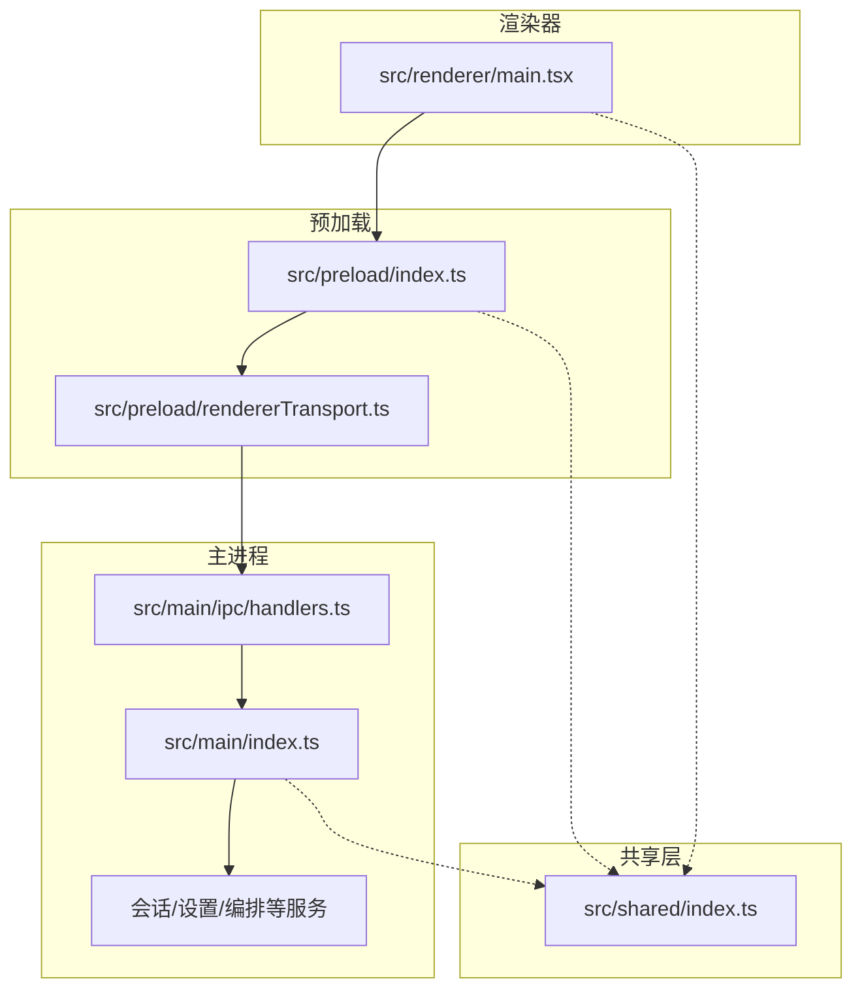
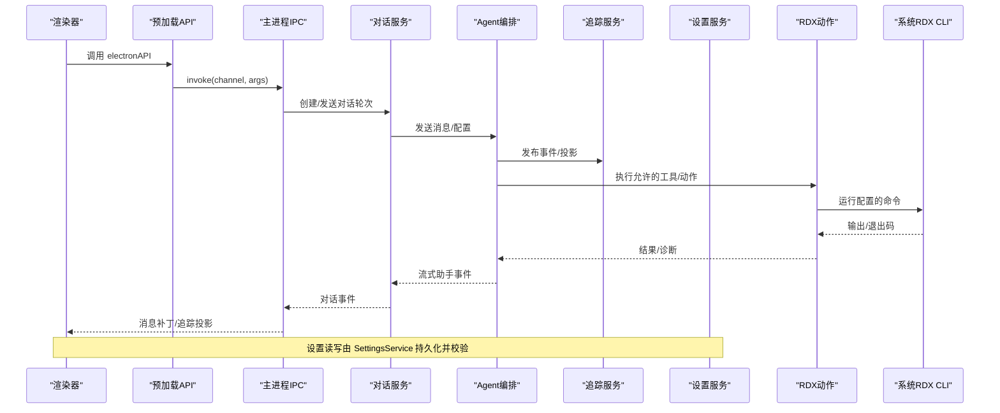
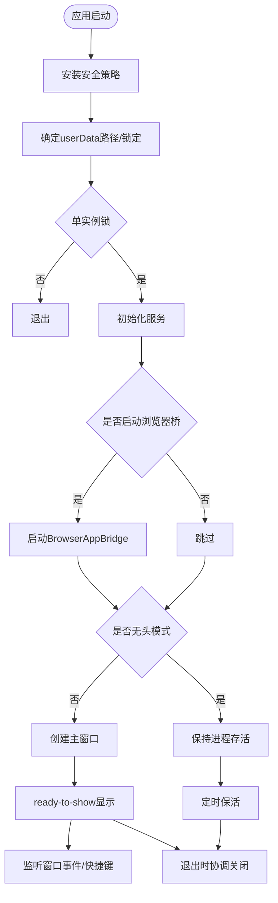
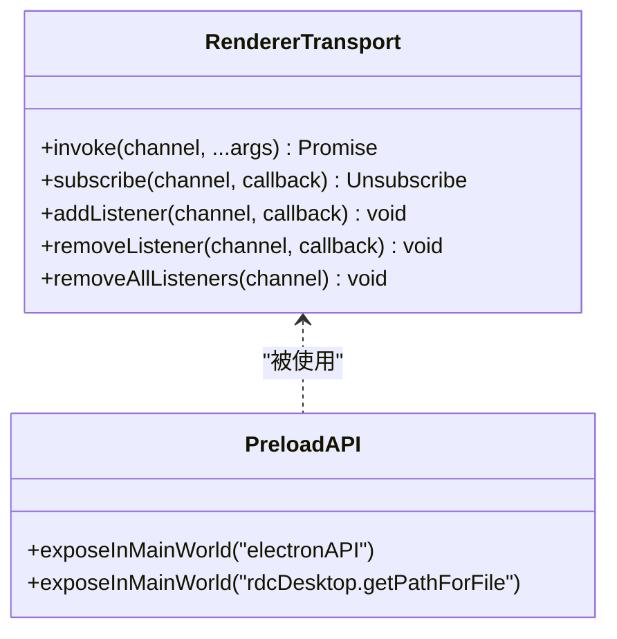
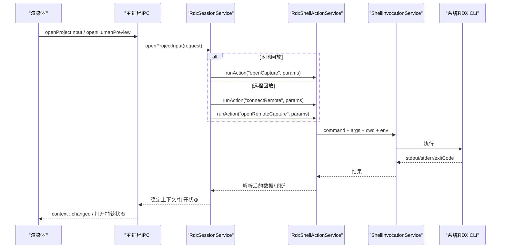
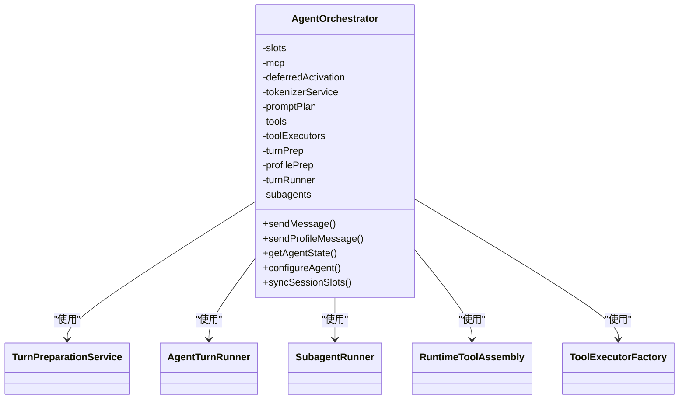
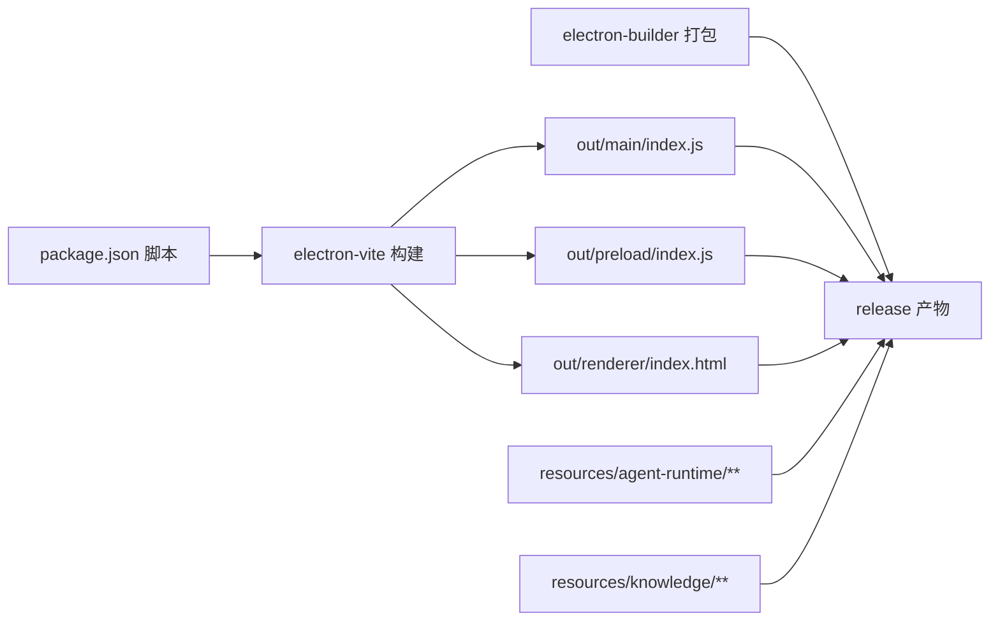

# 整体架构概览

<cite>
**本文引用的文件**
- [README.md](file://README.md)
- [package.json](file://package.json)
- [electron.vite.config.ts](file://electron.vite.config.ts)
- [src/main/index.ts](file://src/main/index.ts)
- [src/preload/index.ts](file://src/preload/index.ts)
- [src/preload/rendererTransport.ts](file://src/preload/rendererTransport.ts)
- [src/renderer/main.tsx](file://src/renderer/main.tsx)
- [src/shared/index.ts](file://src/shared/index.ts)
- [src/main/ipc/handlers.ts](file://src/main/ipc/handlers.ts)
- [docs/architecture/overview.md](file://docs/architecture/overview.md)
- [docs/architecture/data-flow.md](file://docs/architecture/data-flow.md)
- [electron-builder.json](file://electron-builder.json)
- [src/main/settings/SettingsService.ts](file://src/main/settings/SettingsService.ts)
- [src/main/conversation/ConversationService.ts](file://src/main/conversation/ConversationService.ts)
- [src/main/workflow/debugger/AgentOrchestrator.ts](file://src/main/workflow/debugger/AgentOrchestrator.ts)
- [src/main/sessions/RdxSessionService.ts](file://src/main/sessions/RdxSessionService.ts)
</cite>

## 目录
1. [简介](#简介)
2. [项目结构](#项目结构)
3. [核心组件](#核心组件)
4. [架构总览](#架构总览)
5. [详细组件分析](#详细组件分析)
6. [依赖关系分析](#依赖关系分析)
7. [性能与可靠性考虑](#性能与可靠性考虑)
8. [故障排查指南](#故障排查指南)
9. [结论](#结论)
10. [附录：开发与构建部署](#附录开发与构建部署)

## 简介
RDC-Agent 是基于 Electron 的桌面工作台，面向 RenderDoc .rdc 捕获文件的分析与调试。它将通用 Agent 协作入口与可审计的图形调试流程整合在同一界面中，并通过用户配置的外部 RDX CLI 执行本机能力。应用采用四层代码结构：主进程、预加载脚本、渲染器、共享层，通过 IPC 进行受控通信，并以会话管理、设置管理、Agent 编排为核心服务，驱动对话、追踪与外部工具调用。

## 项目结构
仓库按职责划分为四个主要代码层与资源/文档/脚本：
- src/main：Electron 主进程、IPC 处理器、工作流编排、设置、会话、追踪、外部能力调用等。
- src/preload：向渲染器暴露受控 API（contextBridge），封装 IPC 传输。
- src/renderer：React UI、交互状态、浏览器会话桥接与工作区呈现。
- src/shared：跨层类型、常量、主题与纯工具函数。
- resources：随应用分发的 Core Prompt、Agent/Skill/Hook 等资源。
- docs：产品、架构、工作流与 UI 文档。
- scripts：开发、验证、启动与发布脚本。

图表来源
- [electron.vite.config.ts:8-61](file://electron.vite.config.ts#L8-L61)
- [src/main/index.ts:338-373](file://src/main/index.ts#L338-L373)
- [src/preload/index.ts:8-15](file://src/preload/index.ts#L8-L15)
- [src/preload/rendererTransport.ts:9-44](file://src/preload/rendererTransport.ts#L9-L44)
- [src/renderer/main.tsx:1-16](file://src/renderer/main.tsx#L1-L16)
- [src/shared/index.ts:1-5](file://src/shared/index.ts#L1-L5)

章节来源
- [README.md:38-46](file://README.md#L38-L46)
- [electron.vite.config.ts:8-61](file://electron.vite.config.ts#L8-L61)

## 核心组件
- 主进程入口：负责安全策略、窗口生命周期、单实例锁、userData 隔离、服务初始化、IPC 注册、关闭协调。
- 预加载桥：通过 contextBridge 暴露 window.electronAPI，封装 ipcRenderer.invoke/on/off，屏蔽 Node 原生模块直接访问。
- 渲染器：React 应用入口，安装浏览器会话桥与性能探针，挂载 App。
- 共享层：统一类型、常量、主题与工具，作为跨层契约。
- 会话管理：RdxSessionService 管理 RDX 运行时上下文、捕获打开/预览、设备连接与生命周期。
- 设置管理：SettingsService 持久化并规范化设置，处理 Provider、Agent、UI、窗口布局、Secret 等。
- Agent 编排：AgentOrchestrator 聚合 Turn 准备、工具装配、执行、子代理与提示计划，对外暴露发送消息、配置、查询状态等接口。
- 对话服务：ConversationService 管理会话分支、历史、后台继续、取消与终止，串联编排与追踪。
- 追踪系统：TraceService 将对话/工具/动作事件投影为渲染器友好的展示数据。

章节来源
- [src/main/index.ts:125-161](file://src/main/index.ts#L125-L161)
- [src/main/index.ts:338-373](file://src/main/index.ts#L338-L373)
- [src/main/index.ts:560-628](file://src/main/index.ts#L560-L628)
- [src/preload/index.ts:8-15](file://src/preload/index.ts#L8-L15)
- [src/preload/rendererTransport.ts:9-44](file://src/preload/rendererTransport.ts#L9-L44)
- [src/renderer/main.tsx:1-16](file://src/renderer/main.tsx#L1-L16)
- [src/shared/index.ts:1-5](file://src/shared/index.ts#L1-L5)
- [src/main/sessions/RdxSessionService.ts:53-200](file://src/main/sessions/RdxSessionService.ts#L53-L200)
- [src/main/settings/SettingsService.ts:94-139](file://src/main/settings/SettingsService.ts#L94-L139)
- [src/main/workflow/debugger/AgentOrchestrator.ts:75-145](file://src/main/workflow/debugger/AgentOrchestrator.ts#L75-L145)
- [src/main/conversation/ConversationService.ts:78-109](file://src/main/conversation/ConversationService.ts#L78-L109)

## 架构总览
RDC-Agent 的数据流遵循“渲染器 -> 预加载 -> 主进程 IPC -> 服务层 -> 外部能力”的路径，同时支持反向事件推送（如追踪投影、会话变更）。

图表来源
- [docs/architecture/data-flow.md:5-31](file://docs/architecture/data-flow.md#L5-L31)
- [docs/architecture/data-flow.md:33-63](file://docs/architecture/data-flow.md#L33-L63)
- [docs/architecture/data-flow.md:64-80](file://docs/architecture/data-flow.md#L64-L80)
- [src/main/index.ts:560-628](file://src/main/index.ts#L560-L628)
- [src/preload/rendererTransport.ts:9-44](file://src/preload/rendererTransport.ts#L9-L44)

章节来源
- [docs/architecture/overview.md:10-33](file://docs/architecture/overview.md#L10-L33)
- [docs/architecture/data-flow.md:1-87](file://docs/architecture/data-flow.md#L1-L87)

## 详细组件分析

### 主进程与窗口生命周期
主进程负责：
- 安装默认拒绝权限与生产 CSP，限制脚本/样式/连接源。
- 确定 userData 路径，必要时使用临时隔离目录用于 QA。
- 获取单实例锁，避免多实例冲突。
- 创建 BrowserWindow，注入 preload，加载开发或生产渲染器。
- 注册菜单、快捷键、导航白名单、外部链接处理。
- 初始化服务（设置、RDX CLI 目录、IPC、回放设备等）。
- 在 before-quit 阶段通过 ShutdownCoordinator 有序停止所有任务。

图表来源
- [src/main/index.ts:125-161](file://src/main/index.ts#L125-L161)
- [src/main/index.ts:180-235](file://src/main/index.ts#L180-L235)
- [src/main/index.ts:338-373](file://src/main/index.ts#L338-L373)
- [src/main/index.ts:560-628](file://src/main/index.ts#L560-L628)
- [src/main/index.ts:641-667](file://src/main/index.ts#L641-L667)

章节来源
- [src/main/index.ts:125-161](file://src/main/index.ts#L125-L161)
- [src/main/index.ts:180-235](file://src/main/index.ts#L180-L235)
- [src/main/index.ts:338-373](file://src/main/index.ts#L338-L373)
- [src/main/index.ts:560-628](file://src/main/index.ts#L560-L628)
- [src/main/index.ts:641-667](file://src/main/index.ts#L641-L667)

### 预加载与 IPC 传输
预加载脚本仅暴露受控 API，不直接引入 Node 模块；通过 createRendererApi 组合平台能力，并使用 rendererTransport 封装 ipcRenderer.invoke/on/removeListener，提供统一的订阅与调用通道。

图表来源
- [src/preload/index.ts:8-15](file://src/preload/index.ts#L8-L15)
- [src/preload/rendererTransport.ts:9-44](file://src/preload/rendererTransport.ts#L9-L44)

章节来源
- [src/preload/index.ts:1-26](file://src/preload/index.ts#L1-L26)
- [src/preload/rendererTransport.ts:1-45](file://src/preload/rendererTransport.ts#L1-L45)

### 渲染器与应用入口
渲染器入口安装浏览器会话桥与交互性能探针，随后挂载 React App。渲染器通过 window.electronAPI 与主进程通信，不直接访问系统资源。

章节来源
- [src/renderer/main.tsx:1-16](file://src/renderer/main.tsx#L1-L16)

### 共享层契约
共享层导出类型、常量、主题与工具，供主进程、预加载与渲染器共同引用，确保跨层契约一致。

章节来源
- [src/shared/index.ts:1-5](file://src/shared/index.ts#L1-L5)

### 会话管理（RdxSessionService）
会话服务负责：
- 打开本地或远程捕获，维护捕获描述符与状态。
- 通过 rdxShellActionService 调用配置的 shell actions（openCapture/openRemoteCapture/connectRemote/openPreview/closeRuntime）。
- 解析返回数据，构造稳定的 RdxRuntimeContext，更新 opened capture 与预览。
- 处理错误并生成结构化诊断，保证 fail-closed。

图表来源
- [docs/architecture/data-flow.md:33-63](file://docs/architecture/data-flow.md#L33-L63)
- [src/main/sessions/RdxSessionService.ts:69-200](file://src/main/sessions/RdxSessionService.ts#L69-L200)

章节来源
- [src/main/sessions/RdxSessionService.ts:53-200](file://src/main/sessions/RdxSessionService.ts#L53-L200)

### 设置管理（SettingsService）
设置服务负责：
- 初始化运行时路径、执行配置文件、读取并重建持久化设置。
- 规范化 Provider、Agent、UI、窗口布局、RDX 动作等。
- 安全地读取/检查 Provider Secret，清理过期引用。
- 暴露到 IPC 供渲染器编辑器只读查看，写操作在主进程完成。

章节来源
- [src/main/settings/SettingsService.ts:94-139](file://src/main/settings/SettingsService.ts#L94-L139)
- [src/main/settings/SettingsService.ts:141-200](file://src/main/settings/SettingsService.ts#L141-L200)

### Agent 编排（AgentOrchestrator）
编排器作为门面，聚合：
- 槽位与角色配置、MCP 连接协调、延迟激活跟踪。
- Tokenizer、PromptPlan、工具装配、工具执行工厂。
- Turn 准备、Profile Turn 准备、Turn Runner、子代理与后台代理。
- 对外暴露 sendMessage/sendProfileMessage/getAgentState/configureAgent/prepareTurnContext 等接口。

图表来源
- [src/main/workflow/debugger/AgentOrchestrator.ts:75-145](file://src/main/workflow/debugger/AgentOrchestrator.ts#L75-L145)

章节来源
- [src/main/workflow/debugger/AgentOrchestrator.ts:1-200](file://src/main/workflow/debugger/AgentOrchestrator.ts#L1-L200)

### 对话服务（ConversationService）
对话服务管理：
- 会话分支、历史、可见消息投影。
- 后台继续、手递（handoff）、取消/中止活跃轮次。
- 与 AgentOrchestrator 协作，接收流式助手事件，发布追踪投影。
- 与 StorageAdapter 交互，持久化消息与上下文日志。

章节来源
- [src/main/conversation/ConversationService.ts:78-109](file://src/main/conversation/ConversationService.ts#L78-L109)
- [src/main/conversation/ConversationService.ts:111-200](file://src/main/conversation/ConversationService.ts#L111-L200)

### 追踪投影（TraceService）
追踪服务从对话消息、动作事件、工件与运行摘要构建渲染器友好的 AgentRunPresentation，并通过 trace:* IPC 暴露查询接口。

章节来源
- [docs/architecture/data-flow.md:64-80](file://docs/architecture/data-flow.md#L64-L80)

## 依赖关系分析
- 构建与入口：electron-vite 分别构建 main、preload、renderer，main 入口为 src/main/index.ts，worker 为 turnPreparationWorker。
- 打包：electron-builder 输出 release，包含 out/**/* 与 resources/agent-runtime/knowledge，部分 hooks 单独 unpack。
- 脚本：package.json 提供 dev/build/start/pack/dist 及大量 check 命令，统一通过 launch-rdc-agent.mjs 进入不同模式。

图表来源
- [package.json:19-76](file://package.json#L19-L76)
- [electron.vite.config.ts:8-61](file://electron.vite.config.ts#L8-L61)
- [electron-builder.json:1-46](file://electron-builder.json#L1-L46)

章节来源
- [package.json:1-136](file://package.json#L1-L136)
- [electron.vite.config.ts:1-63](file://electron.vite.config.ts#L1-L63)
- [electron-builder.json:1-46](file://electron-builder.json#L1-L46)

## 性能与可靠性考虑
- 安全策略：默认拒绝权限，严格 CSP，限制 connect-src 至必要域名，禁用 unsafe-inline/style-attr 在生产环境。
- 单实例与 userData 隔离：防止多实例竞争，QA 模式使用临时隔离目录。
- 优雅关闭：ShutdownCoordinator 分阶段停止对话、子代理、进程、MCP、回放设备与桥。
- 失败收敛：RDX 动作失败返回结构化诊断，避免仅透传 stderr。
- 流式处理：Agent 运行流式返回助手事件，减少阻塞。
- 资源隔离：工具与 MCP 按需装配与延迟激活，降低启动开销。

章节来源
- [src/main/index.ts:125-161](file://src/main/index.ts#L125-L161)
- [src/main/index.ts:180-235](file://src/main/index.ts#L180-L235)
- [src/main/index.ts:641-667](file://src/main/index.ts#L641-L667)
- [src/main/sessions/RdxSessionService.ts:159-186](file://src/main/sessions/RdxSessionService.ts#L159-L186)

## 故障排查指南
- 无法加载渲染器：检查开发模式下 ELECTRON_RENDERER_URL 与端口占用，确认 allowlist 与 CSP。
- 多实例冲突：确认 userData 锁与 single-instance lock，查看日志中的重复实例提示。
- 设置重建失败：检查 settings 路径与 schema 版本，必要时启用只重建模式。
- RDX 动作失败：查看结构化诊断 message/classification/fix_hint，确认 shell action 配置与系统 CLI 可用。
- 会话中断：通过 ConversationService 取消/中止活跃轮次，检查后台继续与 handoff 状态。
- 追踪为空：确认 TraceService 已收到 conversation/tool/action 事件，并通过 trace:* 查询投影。

章节来源
- [src/main/index.ts:395-418](file://src/main/index.ts#L395-L418)
- [src/main/index.ts:560-628](file://src/main/index.ts#L560-L628)
- [src/main/sessions/RdxSessionService.ts:159-186](file://src/main/sessions/RdxSessionService.ts#L159-L186)
- [docs/architecture/data-flow.md:64-80](file://docs/architecture/data-flow.md#L64-L80)

## 结论
RDC-Agent 以清晰的分层与严格的边界设计，将 Electron 主进程、预加载桥、渲染器与共享层解耦，通过 IPC 实现受控通信。会话管理、设置管理与 Agent 编排构成核心服务，驱动对话、追踪与外部工具调用。该架构兼顾安全性、可维护性与可扩展性，适合持续演进与团队协作。

## 附录：开发与构建部署
- 开发环境：Node.js >= 22.13.0，pnpm 11.7.0，仓库统一 pnpm store 位于 ~/.cache/rdc-agent。
- 启动开发：pnpm run dev 或 scripts/start-rdc-agent.*，支持 desktop-dev 与 browser 模式。
- 构建与打包：pnpm run build 生成 out 目录；pnpm run pack/dist 使用 electron-builder 产出安装包。
- 发布产物：包含编译后输入与 resources/agent-runtime/knowledge，不包含源码与包管理器。
- 验证命令：typecheck/test/check:* 系列命令保障架构、fidelity、共享导出、提供者系统等一致性。

章节来源
- [README.md:48-82](file://README.md#L48-L82)
- [package.json:19-76](file://package.json#L19-L76)
- [electron-builder.json:1-46](file://electron-builder.json#L1-L46)