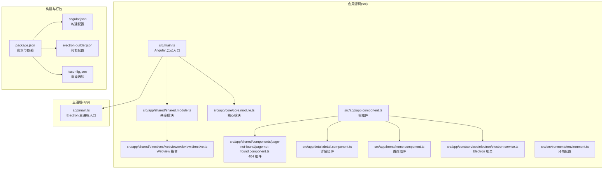
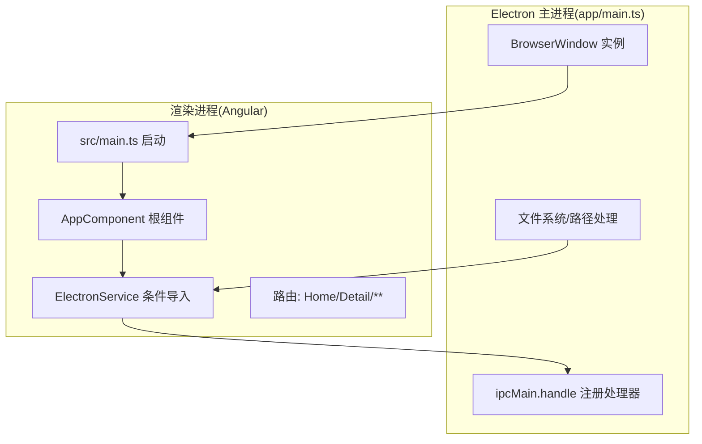
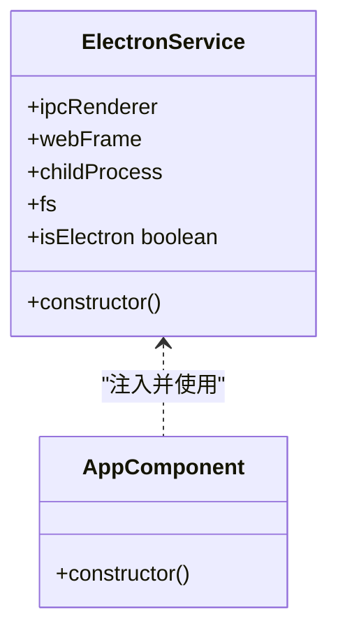
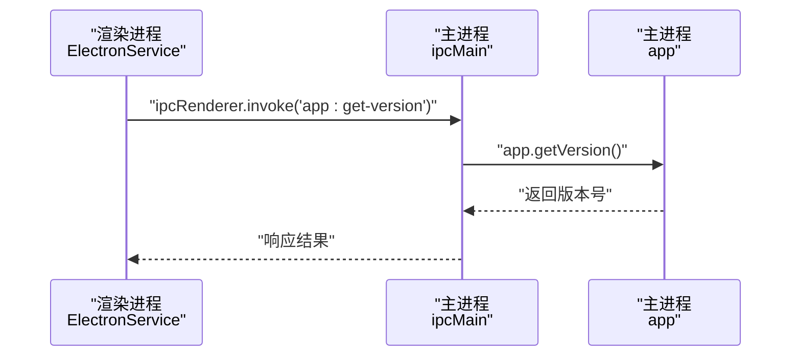
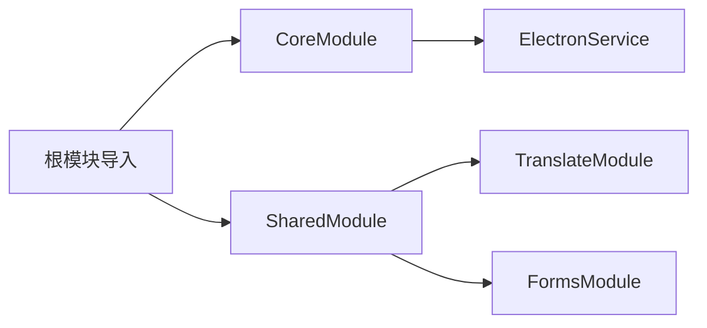
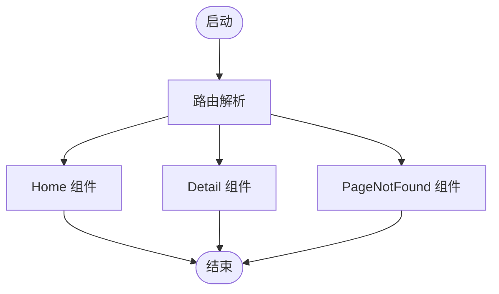
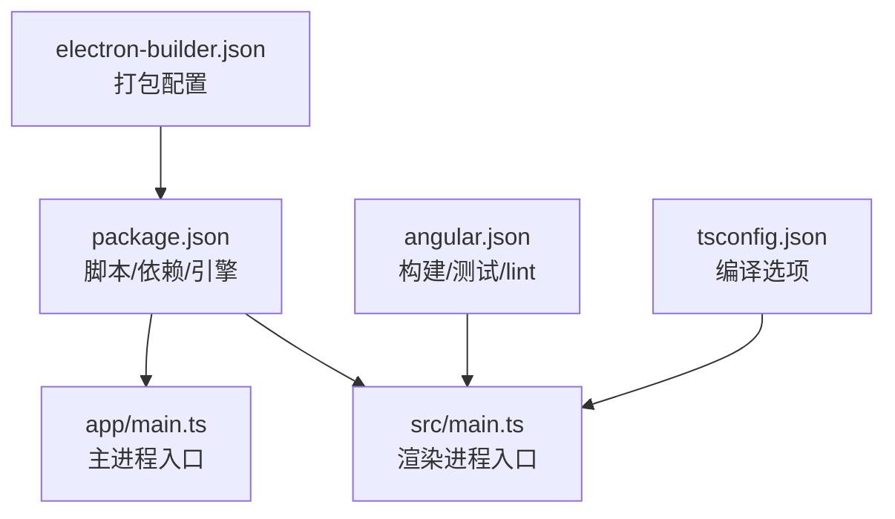

# 架构设计

<cite>
**本文引用的文件**
- [src/app/core/core.module.ts](file://src/app/core/core.module.ts)
- [src/app/shared/shared.module.ts](file://src/app/shared/shared.module.ts)
- [src/app/core/services/electron/electron.service.ts](file://src/app/core/services/electron/electron.service.ts)
- [src/app/core/services/index.ts](file://src/app/core/services/index.ts)
- [src/main.ts](file://src/main.ts)
- [src/app/app.component.ts](file://src/app/app.component.ts)
- [src/app/home/home.component.ts](file://src/app/home/home.component.ts)
- [src/app/detail/detail.component.ts](file://src/app/detail/detail.component.ts)
- [src/app/shared/directives/webview/webview.directive.ts](file://src/app/shared/directives/webview/webview.directive.ts)
- [src/app/shared/components/page-not-found/page-not-found.component.ts](file://src/app/shared/components/page-not-found/page-not-found.component.ts)
- [src/environments/environment.ts](file://src/environments/environment.ts)
- [app/main.ts](file://app/main.ts)
- [angular.json](file://angular.json)
- [package.json](file://package.json)
- [electron-builder.json](file://electron-builder.json)
- [tsconfig.json](file://tsconfig.json)
</cite>

## 目录
1. [引言](#引言)
2. [项目结构](#项目结构)
3. [核心组件](#核心组件)
4. [架构总览](#架构总览)
5. [详细组件分析](#详细组件分析)
6. [依赖关系分析](#依赖关系分析)
7. [性能考虑](#性能考虑)
8. [故障排查指南](#故障排查指南)
9. [结论](#结论)
10. [附录](#附录)

## 引言
本项目是一个基于 Angular 与 Electron 的桌面应用，采用双进程架构：Electron 主进程负责系统级能力（如窗口管理、原生菜单、文件系统访问等），渲染进程承载 Angular 应用逻辑与用户界面。通过条件导入机制与 IPC 通道，渲染进程可在受控环境下安全访问 Node.js 能力，同时保持前端开发体验与跨平台打包分发。

## 项目结构
项目采用“按功能域+共享层”的组织方式：
- 根目录包含构建与打包配置、脚本与依赖声明。
- 源码位于 src/，核心模块与共享模块分别定义在 core 与 shared 目录，组件按页面划分（如 home、detail）。
- Electron 主进程入口位于 app/main.ts，Angular 入口位于 src/main.ts。
- 环境配置位于 src/environments，构建配置由 angular.json 管理，打包配置由 electron-builder.json 定义。

图表来源
- [src/main.ts:1-57](file://src/main.ts#L1-L57)
- [src/app/core/core.module.ts:1-11](file://src/app/core/core.module.ts#L1-L11)
- [src/app/shared/shared.module.ts:1-14](file://src/app/shared/shared.module.ts#L1-L14)
- [src/app/core/services/electron/electron.service.ts:1-57](file://src/app/core/services/electron/electron.service.ts#L1-L57)
- [src/app/app.component.ts:1-35](file://src/app/app.component.ts#L1-L35)
- [src/app/home/home.component.ts:1-19](file://src/app/home/home.component.ts#L1-L19)
- [src/app/detail/detail.component.ts:1-21](file://src/app/detail/detail.component.ts#L1-L21)
- [src/app/shared/directives/webview/webview.directive.ts:1-10](file://src/app/shared/directives/webview/webview.directive.ts#L1-L10)
- [src/app/shared/components/page-not-found/page-not-found.component.ts:1-16](file://src/app/shared/components/page-not-found/page-not-found.component.ts#L1-L16)
- [src/environments/environment.ts:1-5](file://src/environments/environment.ts#L1-L5)
- [app/main.ts:1-94](file://app/main.ts#L1-L94)
- [angular.json:1-188](file://angular.json#L1-L188)
- [package.json:1-108](file://package.json#L1-L108)
- [electron-builder.json:1-61](file://electron-builder.json#L1-L61)
- [tsconfig.json:1-34](file://tsconfig.json#L1-L34)

章节来源
- [src/main.ts:1-57](file://src/main.ts#L1-L57)
- [angular.json:1-188](file://angular.json#L1-L188)
- [package.json:1-108](file://package.json#L1-L108)
- [electron-builder.json:1-61](file://electron-builder.json#L1-L61)
- [tsconfig.json:1-34](file://tsconfig.json#L1-L34)

## 核心组件
- CoreModule：应用的核心领域模块，提供基础能力与全局服务容器。当前文件中未声明具体组件，但作为模块容器用于集中注册核心服务与配置。
- SharedModule：共享特性模块，导出国际化与表单相关通用能力，便于在多处复用。
- ElectronService：在渲染进程中封装对 Electron 与 Node.js 能力的条件访问，提供 isElectron 判断与 IPC、子进程、文件系统等能力的延迟注入。
- 根组件 AppComponent：负责初始化翻译、打印环境信息，并在 Electron 环境下通过 IPC 获取应用版本号。
- 页面组件：Home、Detail、PageNotFound 提供路由占位与基础交互。

章节来源
- [src/app/core/core.module.ts:1-11](file://src/app/core/core.module.ts#L1-L11)
- [src/app/shared/shared.module.ts:1-14](file://src/app/shared/shared.module.ts#L1-L14)
- [src/app/core/services/electron/electron.service.ts:1-57](file://src/app/core/services/electron/electron.service.ts#L1-L57)
- [src/app/app.component.ts:1-35](file://src/app/app.component.ts#L1-L35)
- [src/app/home/home.component.ts:1-19](file://src/app/home/home.component.ts#L1-L19)
- [src/app/detail/detail.component.ts:1-21](file://src/app/detail/detail.component.ts#L1-L21)
- [src/app/shared/components/page-not-found/page-not-found.component.ts:1-16](file://src/app/shared/components/page-not-found/page-not-found.component.ts#L1-L16)

## 架构总览
双进程架构的关键在于：
- Electron 主进程：负责创建 BrowserWindow、加载资源、注册 IPC 处理器、暴露系统能力。
- 渲染进程（Angular）：负责 UI 与业务逻辑；通过 ElectronService 条件性访问 Node.js 与 Electron API；使用 IPC 与主进程通信。

图表来源
- [app/main.ts:1-94](file://app/main.ts#L1-L94)
- [src/main.ts:1-57](file://src/main.ts#L1-L57)
- [src/app/app.component.ts:1-35](file://src/app/app.component.ts#L1-L35)
- [src/app/core/services/electron/electron.service.ts:1-57](file://src/app/core/services/electron/electron.service.ts#L1-L57)

## 详细组件分析

### ElectronService 条件导入机制
- 设计目标：在渲染进程中安全地访问 Node.js 与 Electron API，避免在普通浏览器环境中直接引入导致运行时错误。
- 实现要点：
  - 使用 isElectron 判断当前运行环境是否为 Electron 渲染进程。
  - 在 Electron 环境下，通过 window.require 动态加载 electron、fs、child_process 等模块。
  - 在非 Electron 环境下，这些属性不会被赋值，从而避免运行时报错。
  - 通过 IPC（ipcRenderer.invoke）与主进程进行异步通信，主进程使用 ipcMain.handle 注册处理器。

图表来源
- [src/app/core/services/electron/electron.service.ts:1-57](file://src/app/core/services/electron/electron.service.ts#L1-L57)
- [src/app/app.component.ts:1-35](file://src/app/app.component.ts#L1-L35)

章节来源
- [src/app/core/services/electron/electron.service.ts:1-57](file://src/app/core/services/electron/electron.service.ts#L1-L57)
- [src/app/app.component.ts:1-35](file://src/app/app.component.ts#L1-L35)

### IPC 通信流程（渲染进程调用主进程）
- 主进程在 ready 事件后注册 IPC 处理器（示例：app:get-version）。
- 渲染进程通过 ElectronService.ipcRenderer.invoke 调用该处理器，获取应用版本号。
- 流程确保 Node.js 能力仅在主进程侧执行，渲染进程通过消息传递获得结果。

图表来源
- [app/main.ts:64-71](file://app/main.ts#L64-L71)
- [src/app/core/services/electron/electron.service.ts:47-50](file://src/app/core/services/electron/electron.service.ts#L47-L50)
- [src/app/app.component.ts:29](file://src/app/app.component.ts#L29)

章节来源
- [app/main.ts:64-71](file://app/main.ts#L64-L71)
- [src/app/core/services/electron/electron.service.ts:47-50](file://src/app/core/services/electron/electron.service.ts#L47-L50)
- [src/app/app.component.ts:29](file://src/app/app.component.ts#L29)

### 模块化策略：CoreModule 与 SharedModule
- CoreModule：集中存放应用核心服务与全局配置，避免重复实例化；当前文件为空模块容器，便于后续扩展。
- SharedModule：导出国际化与表单相关模块，供业务模块按需导入；有利于跨模块复用与统一配置。

图表来源
- [src/app/core/core.module.ts:1-11](file://src/app/core/core.module.ts#L1-L11)
- [src/app/shared/shared.module.ts:1-14](file://src/app/shared/shared.module.ts#L1-L14)
- [src/main.ts:51-54](file://src/main.ts#L51-L54)

章节来源
- [src/app/core/core.module.ts:1-11](file://src/app/core/core.module.ts#L1-L11)
- [src/app/shared/shared.module.ts:1-14](file://src/app/shared/shared.module.ts#L1-L14)
- [src/main.ts:51-54](file://src/main.ts#L51-L54)

### 路由与页面组件
- 路由定义包含首页、详情页与通配符 404 页面，配合根组件 RouterOutlet 渲染。
- 页面组件均为独立组件，按需导入 RouterLink 与 TranslateModule。

图表来源
- [src/main.ts:32-50](file://src/main.ts#L32-L50)
- [src/app/home/home.component.ts:1-19](file://src/app/home/home.component.ts#L1-L19)
- [src/app/detail/detail.component.ts:1-21](file://src/app/detail/detail.component.ts#L1-L21)
- [src/app/shared/components/page-not-found/page-not-found.component.ts:1-16](file://src/app/shared/components/page-not-found/page-not-found.component.ts#L1-L16)

章节来源
- [src/main.ts:32-50](file://src/main.ts#L32-L50)
- [src/app/home/home.component.ts:1-19](file://src/app/home/home.component.ts#L1-L19)
- [src/app/detail/detail.component.ts:1-21](file://src/app/detail/detail.component.ts#L1-L21)
- [src/app/shared/components/page-not-found/page-not-found.component.ts:1-16](file://src/app/shared/components/page-not-found/page-not-found.component.ts#L1-L16)

### Webview 指令
- WebviewDirective 当前为最小指令定义，可作为未来集成 webview 标签行为的扩展点。

章节来源
- [src/app/shared/directives/webview/webview.directive.ts:1-10](file://src/app/shared/directives/webview/webview.directive.ts#L1-L10)

## 依赖关系分析
- 运行时入口：
  - 渲染进程入口：src/main.ts 导入 CoreModule 与 SharedModule，并提供路由、HTTP 客户端、国际化等。
  - 主进程入口：app/main.ts 创建 BrowserWindow、加载本地或开发服务器资源、注册 IPC 处理器。
- 构建与打包：
  - angular.json 定义了构建目标、测试与 lint 配置。
  - package.json 提供脚本（如开发、打包、测试）、依赖与引擎要求。
  - electron-builder.json 控制打包产物、目标平台与文件过滤规则。
- 编译配置：
  - tsconfig.json 设置严格模式、模块系统与类型支持，确保类型安全与兼容性。

图表来源
- [package.json:1-108](file://package.json#L1-L108)
- [angular.json:1-188](file://angular.json#L1-L188)
- [tsconfig.json:1-34](file://tsconfig.json#L1-L34)
- [electron-builder.json:1-61](file://electron-builder.json#L1-L61)
- [src/main.ts:1-57](file://src/main.ts#L1-L57)
- [app/main.ts:1-94](file://app/main.ts#L1-L94)

章节来源
- [package.json:1-108](file://package.json#L1-L108)
- [angular.json:1-188](file://angular.json#L1-L188)
- [tsconfig.json:1-34](file://tsconfig.json#L1-L34)
- [electron-builder.json:1-61](file://electron-builder.json#L1-L61)
- [src/main.ts:1-57](file://src/main.ts#L1-L57)
- [app/main.ts:1-94](file://app/main.ts#L1-L94)

## 性能考虑
- 开发与生产配置分离：通过 angular.json 的 configurations（dev/production/testing）控制优化级别与输出格式，提升开发效率与发布质量。
- 打包策略：electron-builder.json 启用 asar 并排除源码与映射文件，减少安装包体积与提高安全性。
- 构建工具链：结合 @angular/build 与 Vitest/Playwright，提供快速热重载与端到端测试支持。

## 故障排查指南
- 渲染进程无法访问 Node.js API
  - 确认 isElectron 判断逻辑与 window.require 的使用位置正确。
  - 若在非 Electron 环境下直接 import Node 模块，会导致运行时错误；应通过条件导入或 IPC 代理。
- IPC 调用无响应
  - 检查主进程是否已注册对应通道处理器（如 app:get-version）。
  - 确保渲染进程使用 ipcRenderer.invoke 调用，且主进程使用 ipcMain.handle 注册。
- 开发调试
  - 主进程启用 electron-debug 与 electron-reloader，开发模式下自动打开 DevTools 并监听变更。
- 版本与兼容性
  - package.json 中声明的 Node/TypeScript 版本要求需满足本地环境；tsconfig.json 的严格模式有助于早期发现潜在问题。

章节来源
- [src/app/core/services/electron/electron.service.ts:18-50](file://src/app/core/services/electron/electron.service.ts#L18-L50)
- [app/main.ts:27-38](file://app/main.ts#L27-L38)
- [package.json:96-99](file://package.json#L96-L99)
- [tsconfig.json:4-18](file://tsconfig.json#L4-L18)

## 结论
本项目通过清晰的模块化与条件导入机制，在保证渲染进程前端开发体验的同时，安全地桥接了 Electron 与 Node.js 能力。主进程与渲染进程职责明确、边界清晰，借助 IPC 与构建打包配置实现了高效的开发与稳定的发布流程。建议后续在 CoreModule 中沉淀更多核心服务，并完善 IPC 通道的统一抽象与错误处理策略。

## 附录
- 环境配置：APP_CONFIG 提供生产/开发标识与环境标签，便于在不同环境下调整行为。
- 资源加载：主进程根据是否处于开发模式选择加载本地开发服务器或 dist 目录下的静态资源。

章节来源
- [src/environments/environment.ts:1-5](file://src/environments/environment.ts#L1-L5)
- [app/main.ts:39-51](file://app/main.ts#L39-L51)