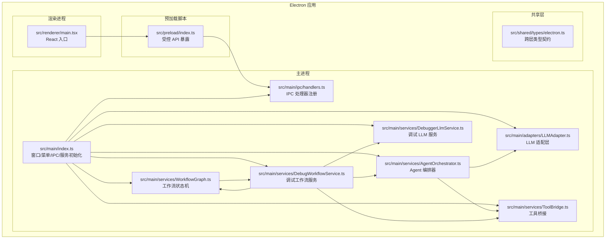
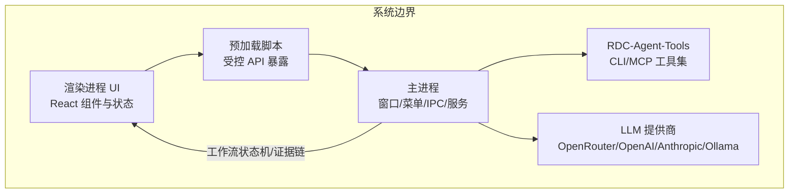
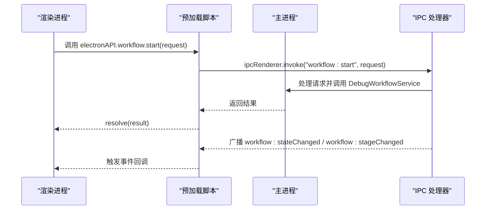
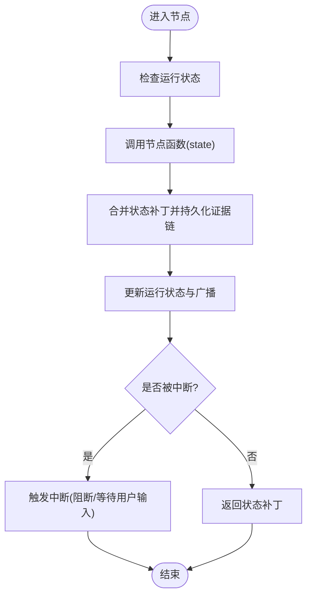
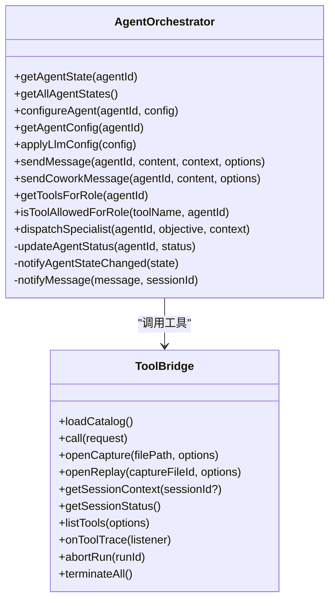
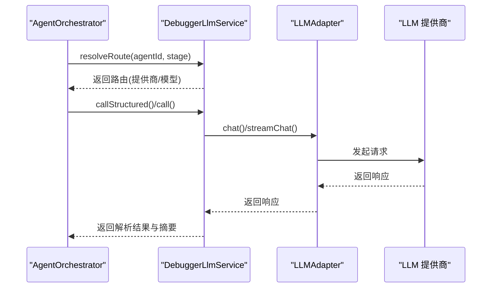
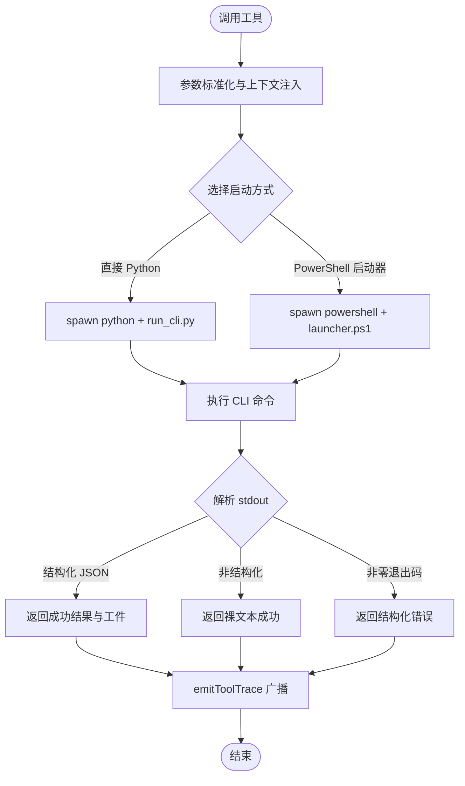
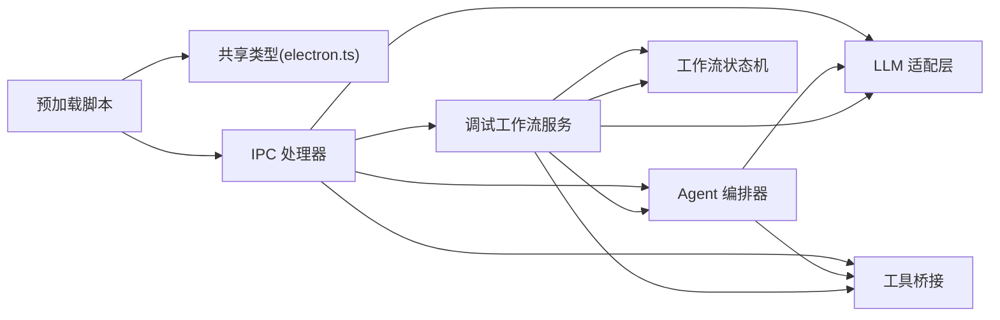

# 架构设计

<cite>
**本文引用的文件**
- [README.md](file://README.md)
- [src/main/index.ts](file://src/main/index.ts)
- [src/preload/index.ts](file://src/preload/index.ts)
- [src/main/ipc/handlers.ts](file://src/main/ipc/handlers.ts)
- [src/main/services/WorkflowGraph.ts](file://src/main/services/WorkflowGraph.ts)
- [src/main/services/DebugWorkflowService.ts](file://src/main/services/DebugWorkflowService.ts)
- [src/main/services/AgentOrchestrator.ts](file://src/main/services/AgentOrchestrator.ts)
- [src/main/services/DebuggerLlmService.ts](file://src/main/services/DebuggerLlmService.ts)
- [src/main/adapters/LLMAdapter.ts](file://src/main/adapters/LLMAdapter.ts)
- [src/main/services/ToolBridge.ts](file://src/main/services/ToolBridge.ts)
- [src/shared/types/electron.ts](file://src/shared/types/electron.ts)
- [docs/architecture/vertical-framework-implementation-plan.md](file://docs/architecture/vertical-framework-implementation-plan.md)
- [docs/product/vertical-debugger-overview.md](file://docs/product/vertical-debugger-overview.md)
- [src/main/services/NodeFunctions/utils.ts](file://src/main/services/NodeFunctions/utils.ts)
</cite>

## 目录
1. [简介](#简介)
2. [项目结构](#项目结构)
3. [核心组件](#核心组件)
4. [架构总览](#架构总览)
5. [详细组件分析](#详细组件分析)
6. [依赖分析](#依赖分析)
7. [性能考虑](#性能考虑)
8. [故障排查指南](#故障排查指南)
9. [结论](#结论)
10. [附录](#附录)

## 简介
本文件为 RDC-Agent 的架构设计文档，聚焦于 Electron 主进程、渲染进程与预加载脚本的职责分工，垂直框架（Vertical Framework）的设计理念与实现方式，AI 调试系统与传统调试工具的集成模式，核心设计模式（单例、观察者、策略等）的应用，以及组件间通信机制（IPC、事件驱动、状态管理）。文档同时提供架构决策的技术考量、权衡因素与约束条件，并定义系统边界、模块划分原则与扩展性设计，兼顾初学者与高级开发者的理解需求。

## 项目结构
RDC-Agent 采用标准 Electron 应用布局，分为三部分：
- 主进程（src/main）：窗口生命周期、菜单、IPC、工作流编排、工具桥接与运行期目录管理。
- 预加载脚本（src/preload）：向渲染层暴露受控 API，统一通道与事件监听。
- 渲染进程（src/renderer）：界面、交互、状态展示与用户入口，基于 React + Zustand 状态管理。

共享层（src/shared）：跨层共享的类型、常量与工具函数，保证契约一致性。

图表来源
- [src/main/index.ts:1-377](file://src/main/index.ts#L1-L377)
- [src/preload/index.ts:1-240](file://src/preload/index.ts#L1-L240)
- [src/main/ipc/handlers.ts:1-800](file://src/main/ipc/handlers.ts#L1-L800)
- [src/main/services/WorkflowGraph.ts:1-409](file://src/main/services/WorkflowGraph.ts#L1-L409)
- [src/main/services/DebugWorkflowService.ts:1-800](file://src/main/services/DebugWorkflowService.ts#L1-L800)
- [src/main/services/AgentOrchestrator.ts:1-624](file://src/main/services/AgentOrchestrator.ts#L1-L624)
- [src/main/adapters/LLMAdapter.ts:1-434](file://src/main/adapters/LLMAdapter.ts#L1-L434)
- [src/main/services/DebuggerLlmService.ts:1-615](file://src/main/services/DebuggerLlmService.ts#L1-L615)
- [src/main/services/ToolBridge.ts:1-638](file://src/main/services/ToolBridge.ts#L1-L638)
- [src/shared/types/electron.ts:1-303](file://src/shared/types/electron.ts#L1-L303)

章节来源
- [README.md:14-25](file://README.md#L14-L25)
- [docs/architecture/vertical-framework-implementation-plan.md:11-16](file://docs/architecture/vertical-framework-implementation-plan.md#L11-L16)

## 核心组件
- 主进程入口与窗口管理：负责应用生命周期、窗口创建、菜单、快捷键、导航限制与日志转发。
- 预加载脚本：通过 contextBridge 暴露受控 API，统一事件通道与监听管理。
- IPC 处理器：集中注册对话框、窗口控制、会话/项目/捕获、工作流、Agent、工具、LLM、日志等 IPC 接口。
- 工作流状态机：基于 LangGraph 的状态机，封装节点函数、证据链持久化与广播。
- 调试工作流服务：编排计划生成、用户问答、审批、运行重启与停止，连接工具与证据链。
- Agent 编排器：管理 Agent 角色、系统提示、模型路由与工具约束，广播状态与消息。
- LLM 适配层：统一多提供商（OpenRouter、OpenAI、Anthropic、Ollama 等）调用与流式传输。
- 调试 LLM 服务：解析路由、校验可用性、结构化解析与重试、记录调用摘要与证据。
- 工具桥接：封装 Windows 平台的 CLI/MCP 调用，参数数组模式防注入，进程生命周期与追踪回调。
- 共享类型：定义跨层 API 类型契约，确保主/预加载/渲染层一致性。

章节来源
- [src/main/index.ts:100-176](file://src/main/index.ts#L100-L176)
- [src/preload/index.ts:41-239](file://src/preload/index.ts#L41-L239)
- [src/main/ipc/handlers.ts:187-800](file://src/main/ipc/handlers.ts#L187-L800)
- [src/main/services/WorkflowGraph.ts:325-392](file://src/main/services/WorkflowGraph.ts#L325-L392)
- [src/main/services/DebugWorkflowService.ts:151-318](file://src/main/services/DebugWorkflowService.ts#L151-L318)
- [src/main/services/AgentOrchestrator.ts:96-624](file://src/main/services/AgentOrchestrator.ts#L96-L624)
- [src/main/adapters/LLMAdapter.ts:347-434](file://src/main/adapters/LLMAdapter.ts#L347-L434)
- [src/main/services/DebuggerLlmService.ts:226-615](file://src/main/services/DebuggerLlmService.ts#L226-L615)
- [src/main/services/ToolBridge.ts:25-638](file://src/main/services/ToolBridge.ts#L25-L638)
- [src/shared/types/electron.ts:33-302](file://src/shared/types/electron.ts#L33-L302)

## 架构总览
垂直框架强调以“调试主链”为核心，将工作流、证据链、工具桥接与多 Agent 协作整合为一条可审计的主链。系统边界以内置 RenderDoc 捕获与 RDC-Agent-Tools 为核心，结合 LLM 提供商路由与工具调用，形成“过程控制”的调试体验。

图表来源
- [docs/product/vertical-debugger-overview.md:27-57](file://docs/product/vertical-debugger-overview.md#L27-L57)
- [docs/architecture/vertical-framework-implementation-plan.md:5-16](file://docs/architecture/vertical-framework-implementation-plan.md#L5-L16)

## 详细组件分析

### 电子进程职责与通信机制
- 主进程负责窗口创建、菜单、快捷键、导航白名单、日志转发与服务初始化；通过 setMainWindow 将 BrowserWindow 引用传递给 IPC 层。
- 预加载脚本通过 contextBridge.exposeInMainWorld 暴露 electronAPI，限定有效通道，统一 on/off 事件监听与移除。
- IPC 层集中注册各类 handle/on，覆盖对话框、窗口控制、会话/项目/捕获、工作流、Agent、工具、LLM、日志等，统一广播到渲染进程。

图表来源
- [src/preload/index.ts:41-160](file://src/preload/index.ts#L41-L160)
- [src/main/ipc/handlers.ts:673-690](file://src/main/ipc/handlers.ts#L673-L690)
- [src/main/services/DebugWorkflowService.ts:152-318](file://src/main/services/DebugWorkflowService.ts#L152-L318)

章节来源
- [src/main/index.ts:100-176](file://src/main/index.ts#L100-L176)
- [src/preload/index.ts:14-39](file://src/preload/index.ts#L14-L39)
- [src/main/ipc/handlers.ts:187-800](file://src/main/ipc/handlers.ts#L187-L800)

### 工作流状态机与证据链
- 工作流状态机基于 LangGraph，定义节点与条件边，封装节点函数、证据链持久化与广播，统一状态变更通知。
- 节点函数工具模块提供证据创建、阶段转换、阻断检查、工件生成与时间戳管理。
- 调试工作流服务负责计划生成、用户问答、审批、运行重启与停止，连接工具与证据链，维护运行状态与回溯。

图表来源
- [src/main/services/WorkflowGraph.ts:171-181](file://src/main/services/WorkflowGraph.ts#L171-L181)
- [src/main/services/WorkflowGraph.ts:127-169](file://src/main/services/WorkflowGraph.ts#L127-L169)
- [src/main/services/NodeFunctions/utils.ts:40-149](file://src/main/services/NodeFunctions/utils.ts#L40-L149)

章节来源
- [src/main/services/WorkflowGraph.ts:325-392](file://src/main/services/WorkflowGraph.ts#L325-L392)
- [src/main/services/NodeFunctions/utils.ts:151-173](file://src/main/services/NodeFunctions/utils.ts#L151-L173)

### Agent 编排与工具约束
- AgentOrchestrator 管理 Agent 角色、系统提示、模型路由与工具约束，广播 Agent 状态与消息。
- 通过工具绑定与运行时配置，限制 Specialist 可用工具集合，确保安全与合规。
- 与 ToolBridge 协作，执行工具调用并追踪结果，触发证据链与 UI 事件。

图表来源
- [src/main/services/AgentOrchestrator.ts:96-624](file://src/main/services/AgentOrchestrator.ts#L96-L624)
- [src/main/services/ToolBridge.ts:25-638](file://src/main/services/ToolBridge.ts#L25-L638)

章节来源
- [src/main/services/AgentOrchestrator.ts:36-75](file://src/main/services/AgentOrchestrator.ts#L36-L75)
- [src/main/services/AgentOrchestrator.ts:396-430](file://src/main/services/AgentOrchestrator.ts#L396-L430)
- [src/main/services/ToolBridge.ts:395-517](file://src/main/services/ToolBridge.ts#L395-L517)

### LLM 集成与调试路由
- LLMAdapter 统一多提供商适配，动态装配可用模型供应商，支持 chat/stream 调用与连接测试。
- DebuggerLlmService 解析 Agent 路由、校验提供商/模型密钥可用性，结构化解析响应与重试策略，记录调用摘要与证据链。

图表来源
- [src/main/services/AgentOrchestrator.ts:225-290](file://src/main/services/AgentOrchestrator.ts#L225-L290)
- [src/main/services/DebuggerLlmService.ts:272-367](file://src/main/services/DebuggerLlmService.ts#L272-L367)
- [src/main/adapters/LLMAdapter.ts:366-408](file://src/main/adapters/LLMAdapter.ts#L366-L408)

章节来源
- [src/main/services/DebuggerLlmService.ts:245-270](file://src/main/services/DebuggerLlmService.ts#L245-L270)
- [src/main/adapters/LLMAdapter.ts:347-434](file://src/main/adapters/LLMAdapter.ts#L347-L434)

### 工具桥接与安全执行
- ToolBridge 封装 Windows 平台 CLI/MCP 调用，参数数组模式避免注入风险，支持超时、中止信号与进程追踪。
- 通过 onToolTrace 回调广播工具执行结果，写入证据链并触发 UI 更新。

图表来源
- [src/main/services/ToolBridge.ts:198-365](file://src/main/services/ToolBridge.ts#L198-L365)
- [src/main/services/ToolBridge.ts:374-389](file://src/main/services/ToolBridge.ts#L374-L389)

章节来源
- [src/main/services/ToolBridge.ts:395-517](file://src/main/services/ToolBridge.ts#L395-L517)

### 设计模式应用
- 单例模式：AgentOrchestrator、DebuggerLlmService、ToolBridge、RdxSessionService 等以单例导出，确保全局唯一实例与状态一致性。
- 观察者模式：预加载脚本的事件通道 on/off 与主进程广播（broadcastToRenderer），渲染层订阅事件实现 UI 自动刷新。
- 策略模式：LLMAdapter 根据提供商种类动态创建不同 Provider 实例（OpenRouter、OpenAI、Anthropic、Ollama），统一接口调用。
- 责任链/门禁模式：调试工作流中的前置 Gate（EntryGate、IntakeGate、DispatchGate、VerifyGate）与运行时监控，阻断器（Blocker）早发现早阻断。

章节来源
- [src/main/services/AgentOrchestrator.ts:623-624](file://src/main/services/AgentOrchestrator.ts#L623-L624)
- [src/main/services/DebuggerLlmService.ts:614-615](file://src/main/services/DebuggerLlmService.ts#L614-L615)
- [src/main/services/ToolBridge.ts:637-638](file://src/main/services/ToolBridge.ts#L637-L638)
- [src/main/services/DebugWorkflowService.ts:151-318](file://src/main/services/DebugWorkflowService.ts#L151-L318)

## 依赖分析
- 主进程对服务层的依赖：WorkflowGraph、DebugWorkflowService、AgentOrchestrator、LLMAdapter、DebuggerLlmService、ToolBridge、StorageAdapter、ReplayDeviceService、RuntimeLogService。
- 预加载脚本对共享类型的依赖：electron.ts 定义了完整的 API 契约，确保主/预加载/渲染层一致性。
- 渲染进程对预加载脚本的依赖：通过 electronAPI 访问主进程能力，订阅事件并驱动 UI。

图表来源
- [src/shared/types/electron.ts:33-302](file://src/shared/types/electron.ts#L33-L302)
- [src/main/ipc/handlers.ts:187-800](file://src/main/ipc/handlers.ts#L187-L800)
- [src/main/services/DebugWorkflowService.ts:151-318](file://src/main/services/DebugWorkflowService.ts#L151-L318)
- [src/main/services/AgentOrchestrator.ts:96-624](file://src/main/services/AgentOrchestrator.ts#L96-L624)
- [src/main/services/ToolBridge.ts:25-638](file://src/main/services/ToolBridge.ts#L25-L638)
- [src/main/adapters/LLMAdapter.ts:347-434](file://src/main/adapters/LLMAdapter.ts#L347-L434)

章节来源
- [src/main/ipc/handlers.ts:187-800](file://src/main/ipc/handlers.ts#L187-L800)
- [src/shared/types/electron.ts:33-302](file://src/shared/types/electron.ts#L33-L302)

## 性能考虑
- 工作流状态机：LangGraph 内存检查点（MemorySaver）与节点函数封装减少重复计算，证据链批量持久化降低 IO 压力。
- LLM 调用：结构化解析与重试策略（指数退避）提升鲁棒性；按需启用 JSON 对象响应格式，减少解析成本。
- 工具调用：参数数组模式与超时控制，避免命令注入与长时间阻塞；进程池与中止信号支持运行时回收。
- UI 事件：事件通道白名单与去重（listenerMap），避免重复监听导致的内存泄漏与渲染抖动。

## 故障排查指南
- LLM 路由阻断：检查提供商/模型/密钥配置，使用 testConnection 验证连通性；查看 runtime log 中 llm 调用事件。
- 工具调用失败：确认 Windows 启动器与 Python 环境可用；查看 CLI 输出与错误详情；必要时启用详细日志。
- 工作流阻断：关注 blocked/awaiting_user_input 状态，检查证据链中的 blocker 事件与原因；根据回溯规则进行修复。
- Agent 工具受限：核对 Agent 工具绑定与运行时配置，确保只允许合法工具；检查 dispatch 事件中的 capability token。

章节来源
- [src/main/services/DebuggerLlmService.ts:410-444](file://src/main/services/DebuggerLlmService.ts#L410-L444)
- [src/main/services/ToolBridge.ts:211-218](file://src/main/services/ToolBridge.ts#L211-L218)
- [src/main/services/WorkflowGraph.ts:183-204](file://src/main/services/WorkflowGraph.ts#L183-L204)
- [src/main/services/AgentOrchestrator.ts:396-430](file://src/main/services/AgentOrchestrator.ts#L396-L430)

## 结论
RDC-Agent 以垂直框架为核心，将调试主链、证据链、工具桥接与多 Agent 协作整合为统一的可审计系统。通过 Electron 的主/渲染/预加载三层职责分离与严格的 IPC 事件驱动，配合 LangGraph 状态机、LLM 适配与工具桥接，实现了从“过程控制”到“证据闭环”的调试范式升级。设计强调安全性（工具约束、参数数组）、可观测性（证据链、运行日志）与可扩展性（提供商与工具目录），为复杂图形调试场景提供了工程化的解决方案。

## 附录
- 系统边界：以 RenderDoc 捕获与 RDC-Agent-Tools 为核心，LLM 提供商路由与工具调用构成调试主链。
- 模块划分原则：主进程负责编排与桥接，预加载脚本负责受控 API，渲染进程负责 UI 与状态展示，共享层负责契约与工具。
- 扩展性设计：LLM 提供商与工具目录可插拔；工作流节点可扩展；证据链与运行日志可追溯。