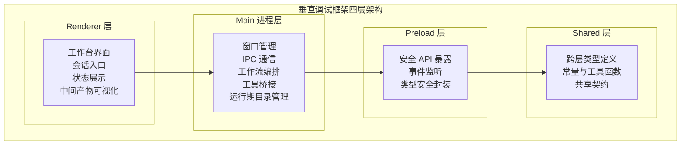
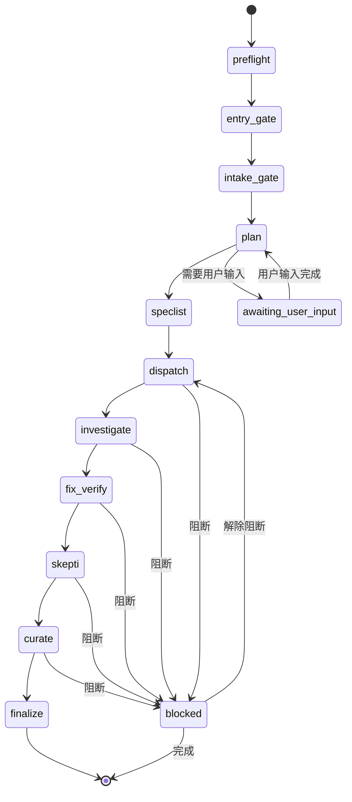
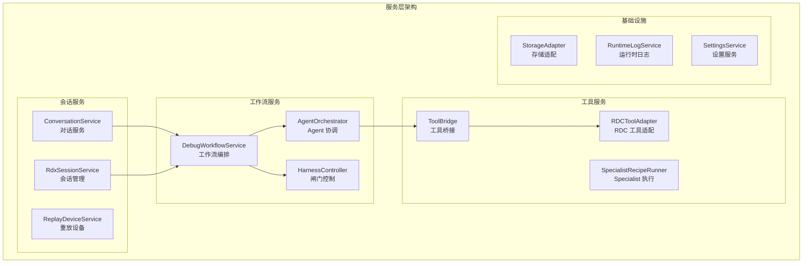
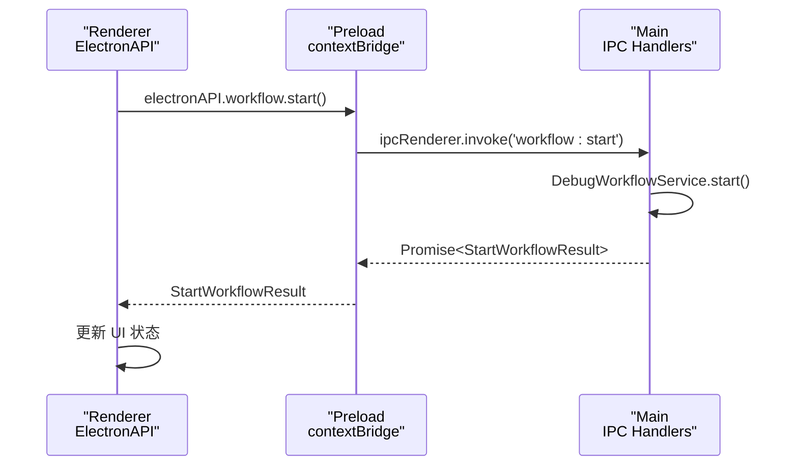
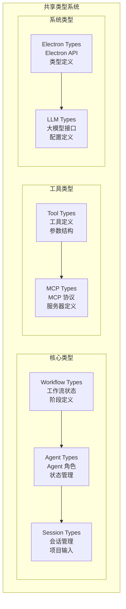
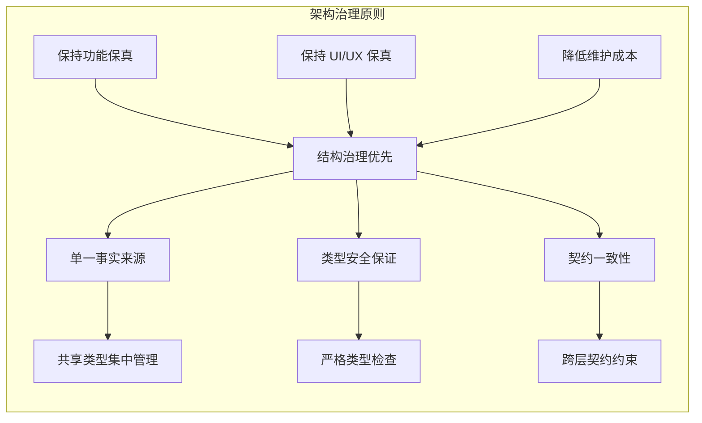

# 架构设计

<cite>
**本文引用的文件**
- [docs/architecture/vertical-framework-implementation-plan.md](file://docs/architecture/vertical-framework-implementation-plan.md)
- [docs/architecture/framework-improvement-notes.md](file://docs/architecture/framework-improvement-notes.md)
- [docs/architecture/spec-driven-development.md](file://docs/architecture/spec-driven-development.md)
- [src/main/index.ts](file://src/main/index.ts)
- [src/preload/index.ts](file://src/preload/index.ts)
- [src/main/services/DebugWorkflowService.ts](file://src/main/services/DebugWorkflowService.ts)
- [src/main/services/ConversationService.ts](file://src/main/services/ConversationService.ts)
- [src/shared/types/workflow.ts](file://src/shared/types/workflow.ts)
</cite>

## 更新摘要
**所做更改**
- 更新架构文档以反映新的垂直调试框架实现规划
- 新增框架改进方向记录的详细分析
- 重新组织架构文档结构，突出垂直框架设计理念
- 增强工作流编排和服务层的技术实现说明
- 完善四层架构（Renderer、Main、Preload、Shared）的职责分工

## 目录
1. [引言](#引言)
2. [垂直调试框架架构](#垂直调试框架架构)
3. [四层架构设计](#四层架构设计)
4. [工作流编排系统](#工作流编排系统)
5. [服务层架构](#服务层架构)
6. [IPC 通信机制](#ipc-通信机制)
7. [共享类型系统](#共享类型系统)
8. [架构演进方向](#架构演进方向)
9. [性能与可靠性](#性能与可靠性)
10. [故障排查指南](#故障排查指南)
11. [结论](#结论)
12. [附录](#附录)

## 引言
本项目采用垂直调试框架架构，专注于 RenderDoc 调试场景的专业化桌面应用。通过明确的四层架构设计（Renderer、Main、Preload、Shared）和严格的规范驱动开发方法，实现了从用户交互到工具执行的完整调试流水线。文档组织已更新为以垂直框架实现规划为核心，辅以框架改进方向记录，形成完整的架构文档体系。

## 垂直调试框架架构
垂直调试框架的核心目标是将 Electron 工作台专门用于 RenderDoc 调试主链，而非通用聊天壳。这种专业化设计确保了调试工作的专注性和专业性。

### 架构目标
- **专注调试主链**：将 `Debugger` 作为真实生产入口，`Analyzer`/`Optimizer` 作为后续模式扩展位
- **统一审计主链**：让工作流、证据链、工具桥接和多 Agent 协作为同一条可审计主链
- **垂直专业化**：用 Electron 工作台承载 RenderDoc 调试主链

### 实现主轴

**图表来源**
- [docs/architecture/vertical-framework-implementation-plan.md:11-16](file://docs/architecture/vertical-framework-implementation-plan.md#L11-L16)

**章节来源**
- [docs/architecture/vertical-framework-implementation-plan.md:5-16](file://docs/architecture/vertical-framework-implementation-plan.md#L5-L16)

## 四层架构设计
四层架构是垂直调试框架的核心设计原则，确保各层职责明确、边界清晰。

### Renderer 层职责
- **工作台界面**：提供直观的调试工作台界面
- **会话入口**：管理调试会话的创建和切换
- **状态展示**：实时显示调试进度和结果
- **中间产物可视化**：展示调试过程中的各种中间结果

### Main 进程层职责
- **窗口管理**：创建和管理 BrowserWindow 实例
- **IPC 通信**：注册和处理 IPC 处理器
- **工作流编排**：协调各个服务组件的工作
- **工具桥接**：连接 RDC 工具生态系统
- **运行期目录管理**：管理调试过程中的文件存储

### Preload 层职责
- **安全 API 暴露**：通过 contextBridge 暴露受限 API
- **事件监听**：管理各类 IPC 事件的监听
- **类型安全封装**：提供类型安全的 API 封装

### Shared 层职责
- **跨层类型**：定义跨层共享的数据类型
- **常量定义**：提供全局常量和配置
- **工具函数**：提供跨层使用的工具函数
- **契约定义**：确保各层间的一致性

**章节来源**
- [docs/architecture/vertical-framework-implementation-plan.md:11-16](file://docs/architecture/vertical-framework-implementation-plan.md#L11-L16)

## 工作流编排系统
工作流编排系统是垂直调试框架的核心，实现了 12 阶段的强制流程控制。

### 12 阶段工作流

**图表来源**
- [docs/architecture/spec-driven-development.md:187-234](file://docs/architecture/spec-driven-development.md#L187-L234)

### 阶段分类
- **planner 阶段**：preflight、entry_gate、intake_gate、plan、speclist
- **generator 阶段**：dispatch、investigate
- **evaluator 阶段**：fix_verify、skepti、curate、finalize

### 工作流状态管理
工作流状态通过 GraphState 进行统一管理，包含以下关键组件：

- **身份信息**：caseId、runId、sessionId
- **阶段信息**：currentStage、stageHistory
- **用户输入**：userGoal、capturePaths、captures
- **证据链**：evidenceChain、artifacts
- **Specialist 追踪**：activeSpecialists、pendingBriefs、collectedBriefs
- **阻断管理**：blockers、interruptReason
- **回转追踪**：backtrackCount
- **结果状态**：finalReport、fixVerified

**章节来源**
- [docs/architecture/spec-driven-development.md:157-186](file://docs/architecture/spec-driven-development.md#L157-L186)
- [src/shared/types/workflow.ts:273-343](file://src/shared/types/workflow.ts#L273-L343)

## 服务层架构
服务层提供了垂直调试框架所需的各类专业服务，确保调试流程的顺利执行。

### 核心服务组件

**图表来源**
- [src/main/services/DebugWorkflowService.ts:151-200](file://src/main/services/DebugWorkflowService.ts#L151-L200)
- [src/main/services/ConversationService.ts:1-200](file://src/main/services/ConversationService.ts#L1-L200)

### 服务初始化流程
服务层采用延迟初始化策略，确保系统启动时的性能和稳定性：

1. **SettingsService 初始化**：加载应用设置和 LLM 配置
2. **RDCToolAdapter 初始化**：加载 RDC 工具目录
3. **WorkflowGraph 初始化**：建立工作流状态图
4. **ReplayDeviceService 初始化**：准备重放设备连接

**章节来源**
- [src/main/index.ts:325-368](file://src/main/index.ts#L325-L368)

## IPC 通信机制
IPC 通信机制是连接 Renderer 和 Main 进程的关键桥梁，通过预定义的通道实现类型安全的通信。

### IPC 通道设计

**图表来源**
- [src/preload/index.ts:65-79](file://src/preload/index.ts#L65-L79)
- [src/main/index.ts:9-10](file://src/main/index.ts#L9-L10)

### 事件监听机制
Preload 层提供了完善的事件监听机制，支持多种类型的 IPC 事件：

- **工作流事件**：stateChanged、stageChanged、runStatusChanged
- **Agent 事件**：message、statusChanged
- **工具事件**：executionComplete
- **证据链事件**：eventAdded
- **系统事件**：deviceStatusChanged、captureStatusChanged

### 类型安全保证
通过 ElectronAPI 接口定义，确保所有 IPC 调用都具有类型安全保障：

- **参数验证**：所有 IPC 调用都经过严格的参数验证
- **返回值类型**：Promise 返回值具有明确的类型定义
- **事件回调**：事件监听器具有类型安全的回调签名

**章节来源**
- [src/preload/index.ts:14-39](file://src/preload/index.ts#L14-L39)
- [src/preload/index.ts:165-211](file://src/preload/index.ts#L165-L211)

## 共享类型系统
共享类型系统确保了四层架构间的一致性和类型安全，避免了重复定义和契约漂移。

### 类型层次结构

**图表来源**
- [src/shared/types/workflow.ts:1-360](file://src/shared/types/workflow.ts#L1-L360)

### 类型定义原则
- **单一事实来源**：共享类型只保留一份事实来源
- **跨层一致性**：确保各层使用相同的类型定义
- **向后兼容**：类型变更遵循兼容性原则
- **文档化**：所有类型都有详细的 TypeScript JSDoc 注释

### 关键类型定义
- **WorkflowStage**：12 阶段工作流的严格枚举定义
- **GraphState**：LangGraph 图状态的完整状态定义
- **DebugPlan**：调试计划的结构化数据模型
- **ReasoningSummary**：推理摘要的标准化结构

**章节来源**
- [src/shared/types/workflow.ts:9-171](file://src/shared/types/workflow.ts#L9-L171)

## 架构演进方向
框架改进方向记录了当前仓库的架构治理重点和演进原则，确保架构的持续优化和维护。

### 当前改进重点
- **保持四层主骨架**：维持 `src/main`、`src/preload`、`src/renderer`、`src/shared` 的单一主骨架
- **收紧共享契约**：加强共享类型、IPC 和 UI 展示之间的契约约束
- **减少历史包袱**：消除命名混乱、镜像结构和临时兼容分支
- **分离运行期目录**：将运行期目录、构建产物和仓库骨架彻底分开

### 治理方向

**图表来源**
- [docs/architecture/framework-improvement-notes.md:12-23](file://docs/architecture/framework-improvement-notes.md#L12-L23)

### 变更原则
- **不为整理而重写**：避免为了架构整洁而改变业务行为
- **结构治理优先**：架构优化服务于功能保真和维护成本降低
- **渐进式改进**：通过小步快跑的方式持续优化架构

**章节来源**
- [docs/architecture/framework-improvement-notes.md:19-23](file://docs/architecture/framework-improvement-notes.md#L19-L23)

## 性能与可靠性
垂直调试框架在性能和可靠性方面采用了多项优化措施，确保大规模调试场景的稳定运行。

### 性能优化策略
- **延迟初始化**：服务采用延迟初始化，减少启动时间
- **内存管理**：通过 JIT 上下文加载和 artifact 压缩策略优化内存使用
- **并发控制**：通过 Specialist 并行执行和串行化控制平衡性能和一致性
- **缓存机制**：利用检查点持久化和上下文压缩减少重复计算

### 可靠性保障
- **阻断机制**：完善的 Blocker 系统确保调试流程的健壮性
- **回转规则**：定义明确的回转触发条件和最大重试次数
- **证据链追踪**：完整的 ActionEvent 证据链确保可审计性
- **错误处理**：统一的错误处理和恢复机制

### 监控与日志
- **运行时日志**：通过 RuntimeLogService 提供详细的运行时信息
- **性能指标**：监控关键性能指标和瓶颈点
- **健康检查**：定期检查系统健康状态和资源使用情况

## 故障排查指南
针对垂直调试框架的复杂性，提供了系统的故障排查方法和最佳实践。

### 常见问题诊断
- **工作流阻断**：检查 Blocker 状态和相应的解除条件
- **IPC 通信失败**：验证通道名称和参数类型匹配
- **服务初始化失败**：检查依赖服务的可用性和配置正确性
- **工具执行异常**：验证工具权限和运行环境

### 调试工具
- **DevTools 集成**：开发模式下自动启用 Electron DevTools
- **日志分析**：通过运行时日志和系统日志定位问题
- **状态检查**：使用工作流状态 API 检查当前状态
- **事件追踪**：通过证据链事件追踪调试流程

### 性能调优
- **内存使用优化**：监控和优化内存使用模式
- **CPU 使用率控制**：通过并发控制和任务调度优化 CPU 使用
- **I/O 性能优化**：优化文件系统访问和网络请求
- **缓存策略**：合理使用缓存减少重复计算

## 结论
垂直调试框架通过明确的四层架构设计、严格的规范驱动开发和完善的 IPC 通信机制，实现了 RenderDoc 调试场景的专业化解决方案。框架改进方向记录确保了架构的持续演进和维护，为复杂的调试工作流提供了可靠的基础设施。通过类型安全保证、证据链追踪和阻断机制，系统在保证功能完整性的同时，也确保了可审计性和可靠性。

## 附录

### 关键文件路径
- **主进程入口**：`src/main/index.ts`
- **预加载脚本**：`src/preload/index.ts`
- **工作流服务**：`src/main/services/DebugWorkflowService.ts`
- **对话服务**：`src/main/services/ConversationService.ts`
- **共享类型**：`src/shared/types/workflow.ts`

### 架构文档组织
- **垂直框架实现规划**：`docs/architecture/vertical-framework-implementation-plan.md`
- **框架改进方向**：`docs/architecture/framework-improvement-notes.md`
- **规范驱动开发**：`docs/architecture/spec-driven-development.md`

### 相关服务组件
- **工具桥接**：`src/main/services/ToolBridge.ts`
- **会话管理**：`src/main/services/RdxSessionService.ts`
- **重放设备**：`src/main/services/ReplayDeviceService.ts`
- **存储适配**：`src/main/services/StorageAdapter.ts`

**章节来源**
- [docs/architecture/README.md:1-6](file://docs/architecture/README.md#L1-L6)
- [src/main/index.ts:1-377](file://src/main/index.ts#L1-L377)
- [src/preload/index.ts:1-240](file://src/preload/index.ts#L1-L240)