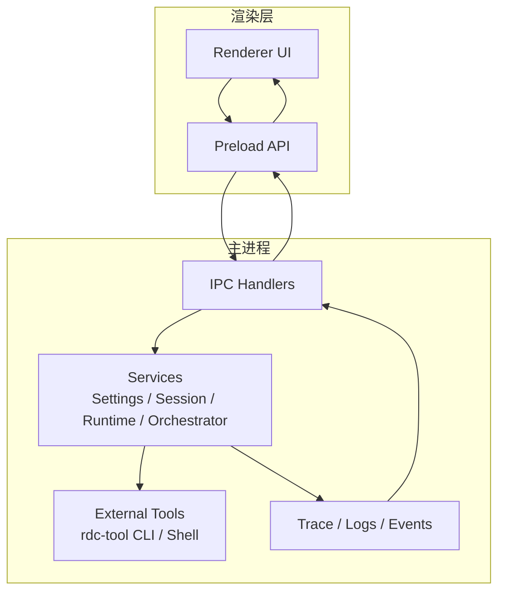
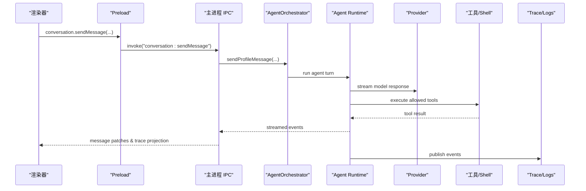
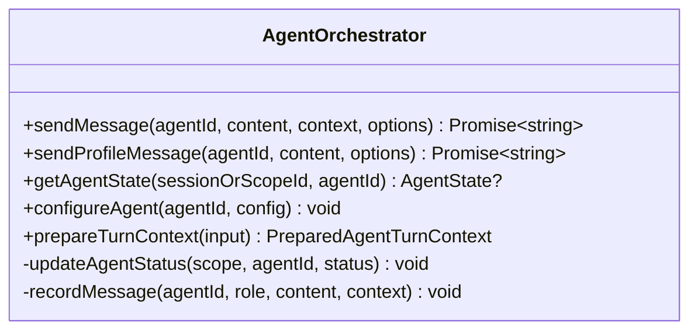
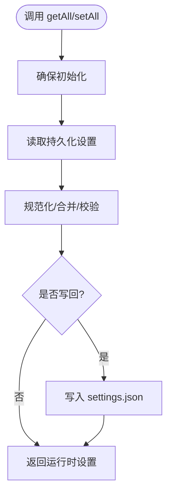
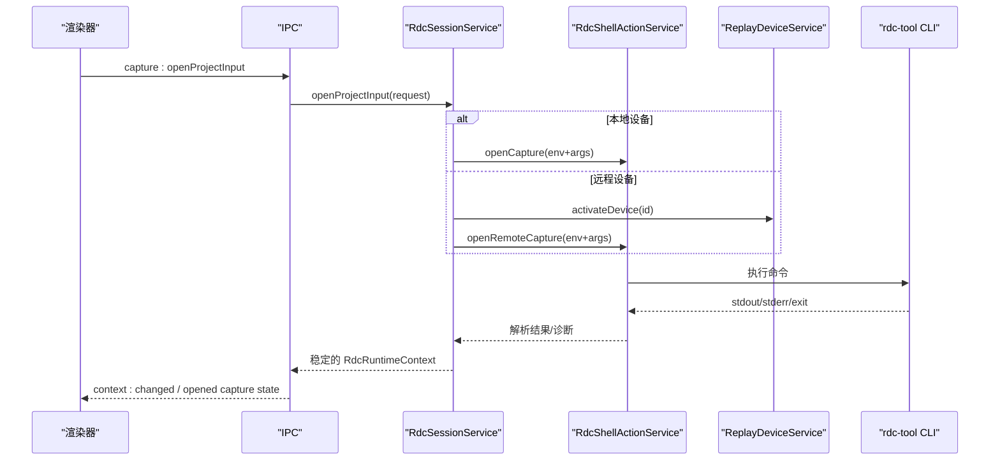
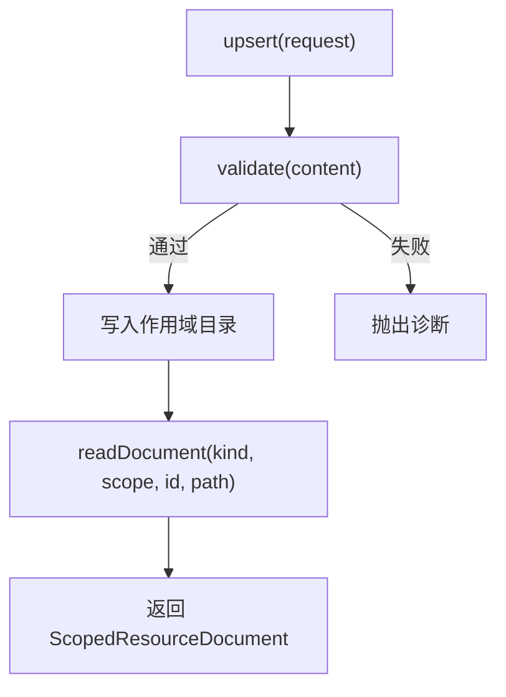
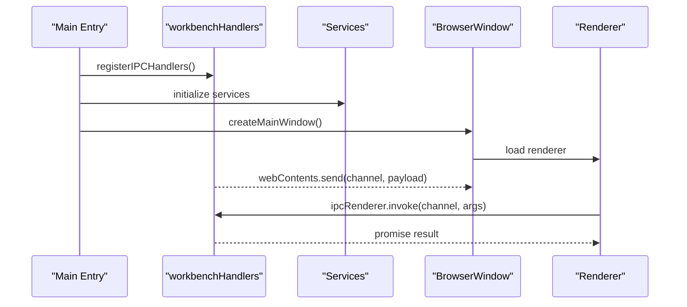
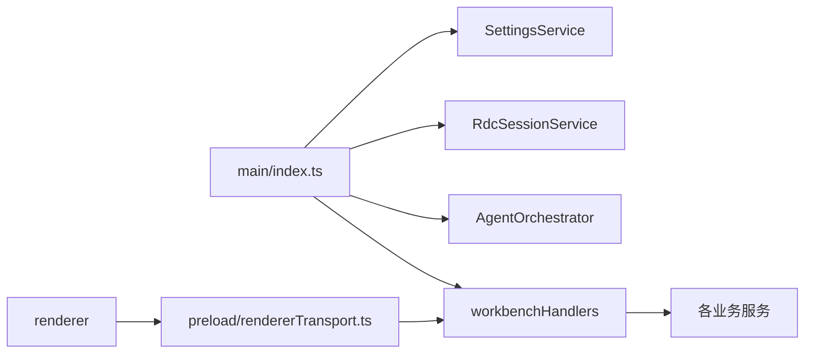

# 架构设计

<cite>
**本文引用的文件**   
- [src/main/index.ts](file://src/main/index.ts)
- [src/main/workflow/debugger/AgentOrchestrator.ts](file://src/main/workflow/debugger/AgentOrchestrator.ts)
- [src/main/settings/SettingsService.ts](file://src/main/settings/SettingsService.ts)
- [src/main/sessions/RdcSessionService.ts](file://src/main/sessions/RdcSessionService.ts)
- [src/main/runtime/RdcRuntimeService.ts](file://src/main/runtime/RdcRuntimeService.ts)
- [src/preload/rendererTransport.ts](file://src/preload/rendererTransport.ts)
- [src/main/ipc/handlers.ts](file://src/main/ipc/handlers.ts)
- [src/main/ipc/workbenchHandlers.ts](file://src/main/ipc/workbenchHandlers.ts)
- [docs/architecture/overview.md](file://docs/architecture/overview.md)
- [docs/architecture/data-flow.md](file://docs/architecture/data-flow.md)
- [docs/architecture/agent-runtime-kernel.md](file://docs/architecture/agent-runtime-kernel.md)
- [README.md](file://README.md)
</cite>

## 目录
1. [简介](#简介)
2. [项目结构](#项目结构)
3. [核心组件](#核心组件)
4. [架构总览](#架构总览)
5. [详细组件分析](#详细组件分析)
6. [依赖关系分析](#依赖关系分析)
7. [性能与可扩展性](#性能与可扩展性)
8. [故障排查指南](#故障排查指南)
9. [结论](#结论)
10. [附录：关键数据流与事件契约](#附录：关键数据流与事件契约)

## 简介
RDC-Agent 是一个基于 Electron 的桌面工作台，面向 RenderDoc `.rdc` capture 的调试与分析。整体采用主进程/渲染器分离、服务导向架构与事件驱动通信的设计原则：
- 主进程负责应用生命周期、IPC 路由、会话与运行时上下文管理、设置持久化、外部工具链（rdc-tool CLI）调用编排、工作流协调与可观测性。
- 渲染器提供 React UI、交互状态与投影展示，通过 preload 暴露受控 API 与 IPC 通道与主进程通信。
- 共享层提供跨进程类型、常量与纯函数工具，保证契约一致性。
- Agent 运行内核围绕“提示计划 -> 请求信封 -> Provider 适配器”的管线执行 LLM 调用，并通过工具策略、权限与 MCP 连接协调完成能力扩展。

本设计文档聚焦整体架构模式、关键组件职责与交互关系、数据流与 IPC 机制、状态管理模式，并辅以架构图与流程图帮助开发者理解系统结构与决策。

## 项目结构
仓库按四层组织：
- src/main：Electron 主进程、IPC handlers、工作流编排、设置、存储、报告、证据、trace、外部能力调用。
- src/preload：受控 window.electronAPI 桥接，向渲染器暴露安全 RPC 与事件订阅。
- src/renderer：React UI、交互状态、浏览器会话桥接与工作区呈现。
- src/shared：跨层类型、常量与纯辅助函数。

图表来源
- [docs/architecture/overview.md:10-23](file://docs/architecture/overview.md#L10-L23)
- [src/main/index.ts:560-628](file://src/main/index.ts#L560-L628)

章节来源
- [docs/architecture/overview.md:1-40](file://docs/architecture/overview.md#L1-L40)
- [README.md:38-46](file://README.md#L38-L46)

## 核心组件
- AgentOrchestrator：Agent 运行的门面，组合 Turn 准备、工具装配、执行器、子代理、提示计划与状态发布；对外暴露 sendMessage/sendProfileMessage/getAgentState/prepareTurnContext 等能力。
- SettingsService：应用设置的读取、校验、持久化与提供者配置归一化；提供窗口布局快速写入、LLM 配置投影、Provider 连接与密钥管理。
- RdcSessionService：RDC 运行时上下文与捕获生命周期管理；封装本地/远程回放设备接入、预览窗口、运行时租约与清理。
- RdcRuntimeService：用户/项目作用域资源清单、验证、导入与信任管理（Agent/Skill/MCP/Hook/Policy/Knowledge/Memory）。
- IPC 层：workbenchHandlers 作为组合根，注册各模块 handler，维护当前 session/project/run 状态并向渲染器广播事件。
- Preload Transport：将渲染器调用映射为 ipcRenderer.invoke/subscribe，屏蔽底层细节。

章节来源
- [src/main/workflow/debugger/AgentOrchestrator.ts:75-145](file://src/main/workflow/debugger/AgentOrchestrator.ts#L75-L145)
- [src/main/settings/SettingsService.ts:94-139](file://src/main/settings/SettingsService.ts#L94-L139)
- [src/main/sessions/RdcSessionService.ts:53-78](file://src/main/sessions/RdcSessionService.ts#L53-L78)
- [src/main/runtime/RdcRuntimeService.ts:24-90](file://src/main/runtime/RdcRuntimeService.ts#L24-L90)
- [src/main/ipc/workbenchHandlers.ts:43-101](file://src/main/ipc/workbenchHandlers.ts#L43-L101)
- [src/preload/rendererTransport.ts:9-44](file://src/preload/rendererTransport.ts#L9-L44)

## 架构总览
RDC-Agent 采用“主进程服务 + 渲染器视图 + 事件总线 + 外部工具链”的服务导向架构。主进程内以 Service 为单位划分职责，通过 IPC 暴露稳定接口；渲染器仅持有投影态，不直接访问文件系统或外部命令。Agent 运行内核遵循“提示计划 -> 请求信封 -> Provider 适配器”的固定路径，工具执行受策略与权限控制，所有事件经 Trace/Logs 可观测。

图表来源
- [docs/architecture/data-flow.md:5-31](file://docs/architecture/data-flow.md#L5-L31)
- [src/main/workflow/debugger/AgentOrchestrator.ts:195-366](file://src/main/workflow/debugger/AgentOrchestrator.ts#L195-L366)

章节来源
- [docs/architecture/data-flow.md:1-87](file://docs/architecture/data-flow.md#L1-L87)
- [src/main/index.ts:560-628](file://src/main/index.ts#L560-L628)

## 详细组件分析

### AgentOrchestrator：Agent 运行编排
- 职责：统一入口，协调 Turn 准备、工具装配、执行、子代理、提示计划、凭证租约与状态发布。
- 关键流程：
  - 接收消息后更新状态为 thinking，解析有效 Profile 与模型路由，构建 PromptPlan 与 RequestPlan。
  - 通过 TurnRunner 执行 Agent Turn，按需激活延迟工具，处理工具结果与终止条件。
  - 记录消息与状态变更，发布到 Trace/Logs，供 UI 投影。
- 错误与边界：
  - 未找到有效 Profile、模型不可用、PromptPlan 不可用时失败关闭。
  - 工具执行受策略与权限限制，文本形状的工具调用不被当作可执行调用。

图表来源
- [src/main/workflow/debugger/AgentOrchestrator.ts:75-145](file://src/main/workflow/debugger/AgentOrchestrator.ts#L75-L145)
- [src/main/workflow/debugger/AgentOrchestrator.ts:195-366](file://src/main/workflow/debugger/AgentOrchestrator.ts#L195-L366)

章节来源
- [src/main/workflow/debugger/AgentOrchestrator.ts:1-799](file://src/main/workflow/debugger/AgentOrchestrator.ts#L1-L799)
- [docs/architecture/agent-runtime-kernel.md:5-16](file://docs/architecture/agent-runtime-kernel.md#L5-L16)

### SettingsService：设置与提供者配置
- 职责：加载、校验、合并与持久化应用设置；管理 Provider 连接、密钥与 LLM 配置投影；支持窗口布局快速写入。
- 关键点：
  - initialize 时重建并写回持久化设置，清理过期密钥。
  - setAll 对 providers、tooling、appearance、layout、agentRuntime 进行规范化与落盘。
  - getLlmConfig 返回已启用且已验证的 Provider 列表与编译后的 Agent 路由。
- 安全与隔离：Secret 材料保留在主进程存储，渲染器仅获得脱敏投影。

图表来源
- [src/main/settings/SettingsService.ts:103-139](file://src/main/settings/SettingsService.ts#L103-L139)
- [src/main/settings/SettingsService.ts:249-383](file://src/main/settings/SettingsService.ts#L249-L383)

章节来源
- [src/main/settings/SettingsService.ts:1-518](file://src/main/settings/SettingsService.ts#L1-L518)

### RdcSessionService：RDC 运行时上下文与捕获生命周期
- 职责：打开/关闭捕获、切换活动捕获、打开/关闭人类预览窗口、管理本地/远程回放设备与会话租约。
- 关键流程：
  - openProjectInput：根据设备类型选择本地或远程动作，调用 RDC shell action，提取运行时上下文并建立租约。
  - closeOrReplaceOpenedCapture：优雅关闭运行时上下文，重置内部状态。
  - ensureReplayDeviceReady：必要时激活远程设备，确保连接可用。
- 错误处理：结构化诊断与 fail-closed 策略，避免残留租约或半开状态。

图表来源
- [docs/architecture/data-flow.md:33-63](file://docs/architecture/data-flow.md#L33-L63)
- [src/main/sessions/RdcSessionService.ts:69-212](file://src/main/sessions/RdcSessionService.ts#L69-L212)

章节来源
- [src/main/sessions/RdcSessionService.ts:1-781](file://src/main/sessions/RdcSessionService.ts#L1-L781)

### RdcRuntimeService：作用域资源与信任管理
- 职责：列出/验证/导入/删除用户与项目作用域的 Agent、Skill、MCP、Hook、Policy、Knowledge、Memory 等资源；管理项目级 MCP 信任。
- 关键点：
  - list/overview 聚合多作用域资源，标记覆盖与无效项。
  - validate/upsert/importFromFile 严格校验格式与作用域安全。
  - trust/revoke 项目级 MCP 信任，结合 HookEngine 与配置服务。

图表来源
- [src/main/runtime/RdcRuntimeService.ts:177-208](file://src/main/runtime/RdcRuntimeService.ts#L177-L208)
- [src/main/runtime/RdcRuntimeService.ts:283-293](file://src/main/runtime/RdcRuntimeService.ts#L283-L293)

章节来源
- [src/main/runtime/RdcRuntimeService.ts:1-302](file://src/main/runtime/RdcRuntimeService.ts#L1-L302)

### IPC 与事件驱动通信
- 主进程入口在 app.whenReady 中安装 CSP、初始化设置、存储服务、注册 IPC handlers，并根据模式启动 BrowserAppBridge 或创建主窗口。
- workbenchHandlers 作为 IPC 组合根，维护当前 session/project/run 状态，恢复中断运行，订阅工具执行追踪并广播给渲染器。
- 渲染器通过 preload 的 createIpcRendererTransport 使用 ipcRenderer.invoke/subscribe 与主进程通信，保持类型与通道一致。

图表来源
- [src/main/index.ts:560-628](file://src/main/index.ts#L560-L628)
- [src/main/ipc/workbenchHandlers.ts:52-101](file://src/main/ipc/workbenchHandlers.ts#L52-L101)
- [src/preload/rendererTransport.ts:9-44](file://src/preload/rendererTransport.ts#L9-L44)

章节来源
- [src/main/index.ts:1-727](file://src/main/index.ts#L1-L727)
- [src/main/ipc/handlers.ts:1-7](file://src/main/ipc/handlers.ts#L1-L7)
- [src/main/ipc/workbenchHandlers.ts:1-200](file://src/main/ipc/workbenchHandlers.ts#L1-L200)
- [src/preload/rendererTransport.ts:1-45](file://src/preload/rendererTransport.ts#L1-L45)

## 依赖关系分析
- 主进程入口依赖：
  - SettingsService：初始化与应用配置。
  - StorageAdapter：工作区与会话存储。
  - RdcSessionService：捕获与运行时上下文。
  - AgentOrchestrator：Agent 运行编排。
  - ProcessSupervisor：进程管理与优雅退出。
  - BrowserAppBridge：真实浏览器会话桥接。
- IPC 层依赖：
  - 各模块 handlers（conversation、capture、settings、shell、trace 等），由 workbenchHandlers 统一注册。
- 渲染器依赖：
  - Preload Transport：ipcRenderer 抽象。
  - 共享类型：确保通道与数据结构一致。

图表来源
- [src/main/index.ts:12-36](file://src/main/index.ts#L12-L36)
- [src/main/ipc/workbenchHandlers.ts:18-34](file://src/main/ipc/workbenchHandlers.ts#L18-L34)
- [src/preload/rendererTransport.ts:9-44](file://src/preload/rendererTransport.ts#L9-L44)

章节来源
- [src/main/index.ts:12-36](file://src/main/index.ts#L12-L36)
- [src/main/ipc/workbenchHandlers.ts:18-34](file://src/main/ipc/workbenchHandlers.ts#L18-L34)

## 性能与可扩展性
- 事件驱动与异步编排：IPC 与 Service 调用均为异步，避免阻塞渲染线程；工具执行与 Provider 流式响应通过事件逐步推进 UI。
- 延迟工具激活：core 工具常驻，extended/mcp 工具按需激活，减少初始负载与 prompt 缓存污染。
- 凭证租约与冻结：每次发送前冻结 Provider 配置与短期凭证，避免并发修改导致的不一致。
- 作用域资源与信任：用户/项目作用域资源清晰隔离，项目级 MCP 信任需显式授权，降低误用风险。
- 可扩展点：
  - 新增 Provider 适配器与路由，通过 EffectiveCatalog 与 PromptPlan 接入。
  - 新增 Shell Action 与 rdc-tool CLI 命令，通过 Settings 配置，无需硬编码。
  - 新增 IPC 通道，需在 workbenchHandlers 注册并在 preload 暴露对应通道。

[本节为通用指导，不直接分析具体文件]

## 故障排查指南
- 启动阶段：
  - 检查 CSP 与权限策略是否正确安装，确保开发/生产模式下渲染器 URL 允许。
  - 确认 userData 锁获取成功，避免多实例冲突。
- IPC 与渲染器：
  - 若渲染器无法收到事件，检查 workbenchHandlers 的 broadcastToRenderer 与 webContents.send 是否正常触发。
  - 若 invoke 无响应，确认对应 channel 已在 workbenchHandlers 注册，且处理器未抛出未捕获异常。
- Agent 运行：
  - 若提示“AGENT_PROFILE_UNAVAILABLE”，检查有效 Profile 是否存在且启用。
  - 若“MODEL_UNAVAILABLE”，检查 Provider 是否已配置且已验证。
  - 若工具执行失败，查看结构化诊断与 ToolExecutionResult，确认权限与 allowlist。
- RDC 会话：
  - 打开捕获失败时，关注结构化诊断（message/classification/fix_hint），优先检查 rdc-tool CLI 配置与设备连接。
  - 远程回放需先 connectRemote，再 openRemoteCapture，确保 remoteId/contextId 正确传递。
- 设置与密钥：
  - 若 Provider 密钥无效，检查 SecretStorageService 中的 secretRef 与账户信息是否匹配。
  - 窗口布局保存失败时，检查 persistWindowLayout/persistWindowLayoutAsync 的写入路径与权限。

章节来源
- [src/main/index.ts:130-161](file://src/main/index.ts#L130-L161)
- [src/main/index.ts:200-235](file://src/main/index.ts#L200-L235)
- [src/main/ipc/workbenchHandlers.ts:52-101](file://src/main/ipc/workbenchHandlers.ts#L52-L101)
- [src/main/workflow/debugger/AgentOrchestrator.ts:246-271](file://src/main/workflow/debugger/AgentOrchestrator.ts#L246-L271)
- [src/main/sessions/RdcSessionService.ts:106-173](file://src/main/sessions/RdcSessionService.ts#L106-L173)
- [src/main/settings/SettingsService.ts:141-206](file://src/main/settings/SettingsService.ts#L141-L206)

## 结论
RDC-Agent 通过主进程服务化、渲染器投影化与事件驱动通信，实现了清晰的职责边界与高可观测性。AgentOrchestrator、SettingsService、RdcSessionService、RdcRuntimeService 分别承担 Agent 编排、设置与提供者管理、RDC 运行时上下文与捕获生命周期、作用域资源与信任管理的核心职责。IPC 层作为稳定契约面，屏蔽了主进程复杂逻辑，使渲染器专注于 UI 与交互。数据流与事件流贯穿整个系统，确保状态一致性与可追溯性。未来扩展可通过新增 Provider、Shell Action、IPC 通道与资源类型实现，同时保持向后兼容与安全边界。

[本节为总结，不直接分析具体文件]

## 附录：关键数据流与事件契约
- Agent Turn 数据流：渲染器 -> Preload -> IPC -> ConversationService -> AgentOrchestrator -> Agent Runtime -> Provider/Tools -> Trace/Logs -> IPC -> 渲染器。
- RDC Shell Actions 数据流：渲染器 -> IPC -> RdcSessionService -> RdcShellActionService -> ShellInvocationService -> rdc-tool CLI -> 解析结果 -> IPC -> 渲染器。
- Trace Projection 数据流：ConversationService -> TraceService -> IPC -> 渲染器。
- Settings 数据流：渲染器 -> IPC -> SettingsService -> 持久化 -> IPC -> 渲染器。

章节来源
- [docs/architecture/data-flow.md:5-87](file://docs/architecture/data-flow.md#L5-L87)
- [docs/architecture/overview.md:10-33](file://docs/architecture/overview.md#L10-L33)