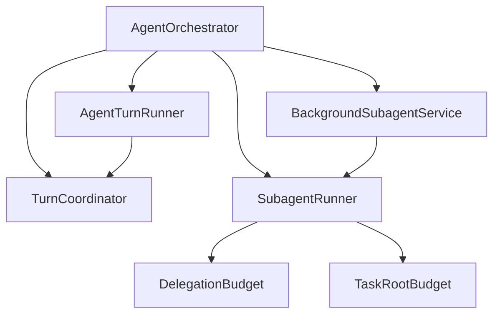
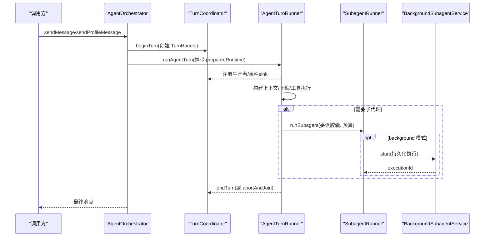
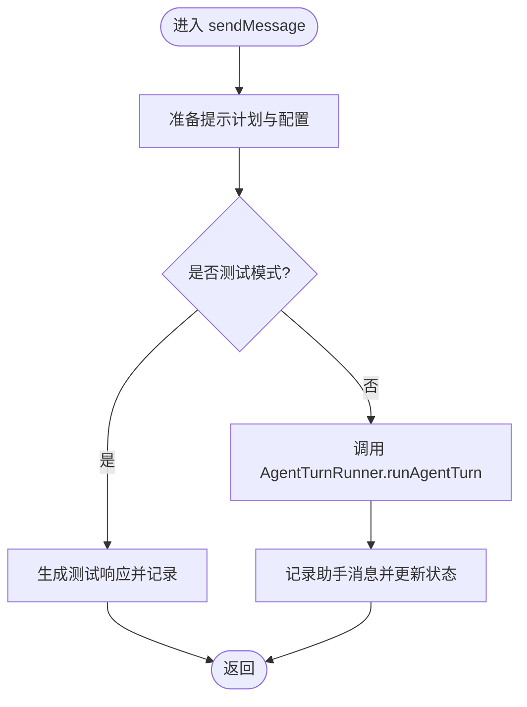
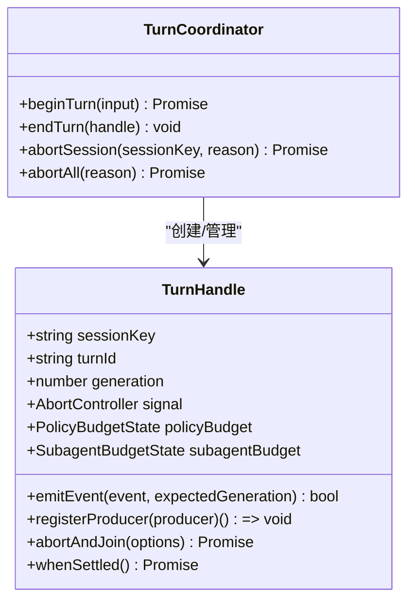
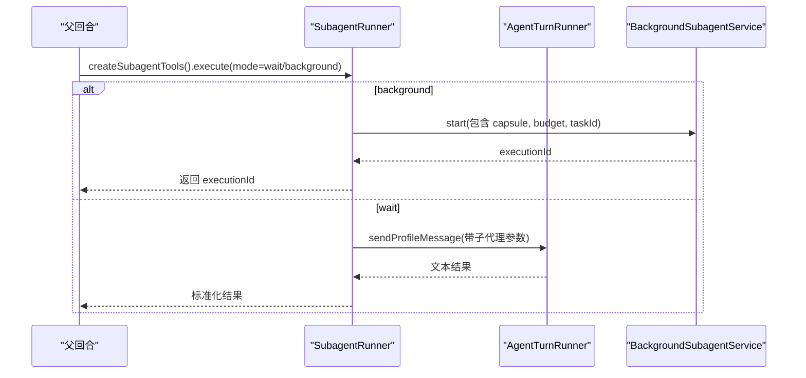
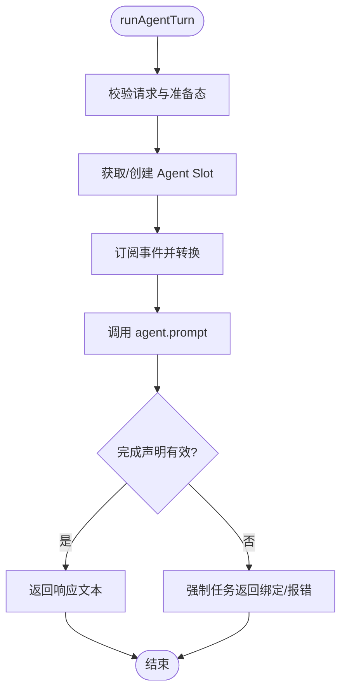
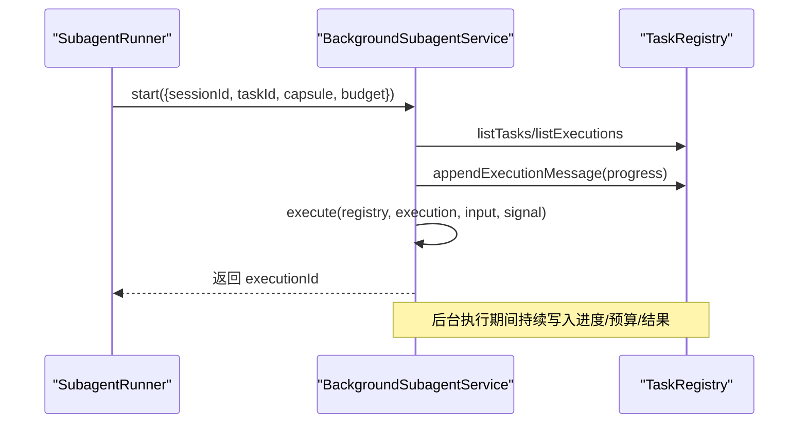
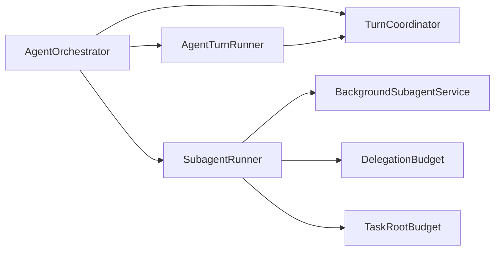
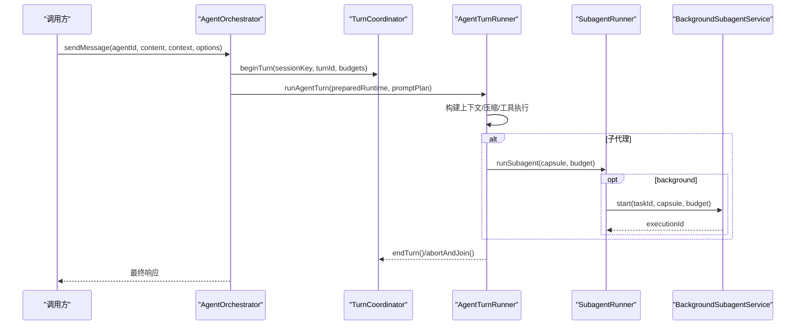

# Agent编排器设计

<cite>
**本文引用的文件**
- [AgentOrchestrator.ts](file://src/main/workflow/debugger/AgentOrchestrator.ts)
- [TurnCoordinator.ts](file://src/main/workflow/debugger/TurnCoordinator.ts)
- [SubagentRunner.ts](file://src/main/workflow/debugger/SubagentRunner.ts)
- [AgentTurnRunner.ts](file://src/main/workflow/debugger/AgentTurnRunner.ts)
- [BackgroundSubagentService.ts](file://src/main/workflow/debugger/BackgroundSubagentService.ts)
- [DelegationBudget.ts](file://src/main/workflow/debugger/DelegationBudget.ts)
- [TaskRootBudget.ts](file://src/main/workflow/debugger/TaskRootBudget.ts)
</cite>

## 目录
1. [简介](#简介)
2. [项目结构](#项目结构)
3. [核心组件](#核心组件)
4. [架构总览](#架构总览)
5. [详细组件分析](#详细组件分析)
6. [依赖关系分析](#依赖关系分析)
7. [性能与并发](#性能与并发)
8. [故障排查指南](#故障排查指南)
9. [结论](#结论)
10. [附录：关键流程与时序图](#附录：关键流程与时序图)

## 简介
本文件面向“Agent编排器”的设计与实现，聚焦以下目标：
- 解析 AgentOrchestrator 的核心职责与编排边界
- 说明 TurnCoordinator 的轮次协调策略、生命周期与取消机制
- 阐述 SubagentRunner 的子任务执行模型与预算控制
- 解释 AgentTurnRunner 的回合执行引擎、上下文压缩与错误恢复
- 描述 BackgroundSubagentService 的后台子代理与持久化执行
- 给出从用户输入到最终响应的完整时序图与架构图
- 总结资源分配策略、并发控制与错误恢复机制

## 项目结构
围绕调试工作流的编排层位于 src/main/workflow/debugger，核心由四个文件组成：
- AgentOrchestrator：编排门面，负责消息路由、配置装配、工具装配、会话状态与子代理调度
- TurnCoordinator：按会话维护 TurnHandle，提供轮次开始/结束、取消、孤儿回收与预算状态
- SubagentRunner：子代理执行器，封装委派胶囊、预算派生、事件透传与结果持久化
- AgentTurnRunner：回合执行引擎，创建/复用 Agent Slot，驱动 LLM 调用、工具执行与上下文压缩
- BackgroundSubagentService：后台子代理服务，基于 TaskRegistry 提供可恢复、可查询的长时执行
- DelegationBudget / TaskRootBudget：委派链式预算与根预算绑定

图表来源
- [AgentOrchestrator.ts:75-145](file://src/main/workflow/debugger/AgentOrchestrator.ts#L75-L145)
- [TurnCoordinator.ts:493-605](file://src/main/workflow/debugger/TurnCoordinator.ts#L493-L605)
- [SubagentRunner.ts:71-103](file://src/main/workflow/debugger/SubagentRunner.ts#L71-L103)
- [AgentTurnRunner.ts:119-120](file://src/main/workflow/debugger/AgentTurnRunner.ts#L119-L120)
- [BackgroundSubagentService.ts:37-52](file://src/main/workflow/debugger/BackgroundSubagentService.ts#L37-L52)

章节来源
- [AgentOrchestrator.ts:75-145](file://src/main/workflow/debugger/AgentOrchestrator.ts#L75-L145)
- [TurnCoordinator.ts:493-605](file://src/main/workflow/debugger/TurnCoordinator.ts#L493-L605)
- [SubagentRunner.ts:71-103](file://src/main/workflow/debugger/SubagentRunner.ts#L71-L103)
- [AgentTurnRunner.ts:119-120](file://src/main/workflow/debugger/AgentTurnRunner.ts#L119-L120)
- [BackgroundSubagentService.ts:37-52](file://src/main/workflow/debugger/BackgroundSubagentService.ts#L37-L52)

## 核心组件
- AgentOrchestrator
  - 统一入口：sendMessage/sendProfileMessage/prepareTurnContext
  - 组装运行时工具、MCP 连接、令牌估算、提示计划、凭证租约
  - 管理 AgentSlot 状态、会话槽位同步、临时作用域清理
  - 将子代理与后台子代理接入同一执行通道
- TurnCoordinator
  - 以 TurnHandle 为单位维护会话级轮次，支持 generation 防重放
  - 统一管理 AbortController、生产者注册/加入、超时与优雅退出
  - 维护 PolicyBudgetState 与 SubagentBudgetState，提供预留与消费
- SubagentRunner
  - 解析委派胶囊、校验目标 profile、派生子代理预算
  - 注入 RDC 能力租约、工件访问授权、任务范围约束
  - 通过 sendProfileMessage 发起子代理回合，透传事件与增量文本
  - 支持 wait/background 两种模式；background 交由 BackgroundSubagentService
- AgentTurnRunner
  - 创建/复用 Agent Slot，计算上下文窗口与压缩阈值
  - 驱动 Agent.prompt，订阅事件并转换为共享事件流
  - 记录使用量、诊断信息、结构化工具调用证据
  - 处理完成声明、任务返回绑定、直接任务结算
- BackgroundSubagentService
  - 基于 TaskRegistry 启动可恢复执行，维护执行会话与根预算
  - 提供 beforeParentProviderRequestMessages 过滤子执行消息
  - 与 SubagentRunner 协作，将子代理执行映射为可观测、可查询的任务执行

章节来源
- [AgentOrchestrator.ts:75-145](file://src/main/workflow/debugger/AgentOrchestrator.ts#L75-L145)
- [TurnCoordinator.ts:18-106](file://src/main/workflow/debugger/TurnCoordinator.ts#L18-L106)
- [SubagentRunner.ts:71-103](file://src/main/workflow/debugger/SubagentRunner.ts#L71-L103)
- [AgentTurnRunner.ts:119-120](file://src/main/workflow/debugger/AgentTurnRunner.ts#L119-L120)
- [BackgroundSubagentService.ts:37-52](file://src/main/workflow/debugger/BackgroundSubagentService.ts#L37-L52)

## 架构总览
编排器采用“门面 + 轮次协调 + 回合执行 + 子代理”的分层设计：
- 门面层（AgentOrchestrator）屏蔽复杂装配细节，暴露稳定接口
- 轮次层（TurnCoordinator）保证单会话串行、可取消、可审计
- 执行层（AgentTurnRunner）负责一次回合的完整生命周期
- 子代理层（SubagentRunner + BackgroundSubagentService）实现任务分解与长时执行

图表来源
- [AgentOrchestrator.ts:195-366](file://src/main/workflow/debugger/AgentOrchestrator.ts#L195-L366)
- [AgentTurnRunner.ts:317-402](file://src/main/workflow/debugger/AgentTurnRunner.ts#L317-L402)
- [SubagentRunner.ts:80-103](file://src/main/workflow/debugger/SubagentRunner.ts#L80-L103)
- [BackgroundSubagentService.ts:65-136](file://src/main/workflow/debugger/BackgroundSubagentService.ts#L65-L136)
- [TurnCoordinator.ts:507-555](file://src/main/workflow/debugger/TurnCoordinator.ts#L507-L555)

## 详细组件分析

### AgentOrchestrator：编排门面
- 职责边界
  - 消息入口：sendMessage 用于顶层会话，sendProfileMessage 用于受控路由/子代理
  - 配置与凭证：刷新提供者凭据、冻结租约、释放 MCP 租约
  - 工具与提示：装配 RuntimeToolAssembly、PromptPlan、Tokenizer 与上下文窗口
  - 子代理集成：构造 SubagentRunner 与 BackgroundSubagentService，桥接工具与事件
- 关键流程
  - sendMessage：准备 prompt plan -> 预编译 profile -> 运行回合 -> 记录助手消息 -> 更新状态
  - sendProfileMessage：支持传入 preparedTurn/promptPlan，避免重复准备；支持终端上下文回调
  - 状态与日志：统一更新 Agent 状态、发布工作流投影、记录运行日志
- 错误与恢复
  - 异常路径统一置错状态并释放租约
  - 临时作用域在 finally 中清理，防止内存泄漏

图表来源
- [AgentOrchestrator.ts:195-366](file://src/main/workflow/debugger/AgentOrchestrator.ts#L195-L366)
- [AgentOrchestrator.ts:384-634](file://src/main/workflow/debugger/AgentOrchestrator.ts#L384-L634)

章节来源
- [AgentOrchestrator.ts:75-145](file://src/main/workflow/debugger/AgentOrchestrator.ts#L75-L145)
- [AgentOrchestrator.ts:195-366](file://src/main/workflow/debugger/AgentOrchestrator.ts#L195-L366)
- [AgentOrchestrator.ts:384-634](file://src/main/workflow/debugger/AgentOrchestrator.ts#L384-L634)

### TurnCoordinator：轮次协调与生命周期
- 轮次句柄 TurnHandle
  - 维护 sessionKey、turnId、generation、AbortController、预算状态
  - 生产者注册/加入：确保所有异步任务在优雅期内停止
  - 超时保护：根据 maxWallTimeMs 自动触发中止
  - 事件守卫：仅对活跃 generation 投递事件，防止乱序
- 协调器 TurnCoordinator
  - beginTurn：终止旧轮次、保留孤儿句柄直到完全结算
  - endTurn：安全关闭并清理
  - abortSession/abortAll：批量中止与会话清理
- 预算与配额
  - PolicyBudgetState：限制 toolCalls、subagents、childDepth、wallTime
  - reserveDispatchBudget/consumeReservedSubagentSlot：原子预留与消费，避免超发
  - SubagentBudgetState：限制深度、子数量、聚合工具调用与聚合时长

图表来源
- [TurnCoordinator.ts:205-491](file://src/main/workflow/debugger/TurnCoordinator.ts#L205-L491)
- [TurnCoordinator.ts:493-605](file://src/main/workflow/debugger/TurnCoordinator.ts#L493-L605)

章节来源
- [TurnCoordinator.ts:18-106](file://src/main/workflow/debugger/TurnCoordinator.ts#L18-L106)
- [TurnCoordinator.ts:205-491](file://src/main/workflow/debugger/TurnCoordinator.ts#L205-L491)
- [TurnCoordinator.ts:493-605](file://src/main/workflow/debugger/TurnCoordinator.ts#L493-L605)

### SubagentRunner：子任务执行模型
- 委派与授权
  - 解析 DelegationCapsule，校验目标 profile 与委派列表
  - 授予工件访问权限、RDC 能力租约、任务范围约束
- 预算与并发
  - 派生子代理预算（继承父策略），检查 depth/children/toolCalls/wallTime
  - 预留子代理槽位，必要时刷新观察者并消费预留
- 执行与事件
  - 通过 sendProfileMessage 发起子代理回合，注入信号与预算
  - 透传 assistant.delta、tool.started/completed/denied 等事件
  - 聚合子代理工具调用计数，回写父预算
- 模式
  - wait：同步等待结果
  - background：交由 BackgroundSubagentService 持久化执行，立即返回 executionId

图表来源
- [SubagentRunner.ts:80-103](file://src/main/workflow/debugger/SubagentRunner.ts#L80-L103)
- [SubagentRunner.ts:431-678](file://src/main/workflow/debugger/SubagentRunner.ts#L431-L678)
- [BackgroundSubagentService.ts:65-136](file://src/main/workflow/debugger/BackgroundSubagentService.ts#L65-L136)

章节来源
- [SubagentRunner.ts:71-103](file://src/main/workflow/debugger/SubagentRunner.ts#L71-L103)
- [SubagentRunner.ts:431-678](file://src/main/workflow/debugger/SubagentRunner.ts#L431-L678)

### AgentTurnRunner：回合执行引擎
- 回合准备
  - 校验 provider/model/requestPlan/preparedRuntime
  - 创建/复用 Agent Slot，计算上下文窗口与压缩阈值
  - 注入工具定义、MCP 连接、提示缓存、凭证租约
- 执行与监控
  - 订阅 Agent 事件，转换为共享事件流
  - 记录结构化工具调用证据、上下文压缩统计、用量明细
  - 处理空响应与文本工具调用未执行的诊断
- 完成与恢复
  - 验证完成声明、任务返回绑定
  - 处理直接任务未完成时的阻断
  - 错误分类与恢复策略（重试/压缩/继续/中止）

图表来源
- [AgentTurnRunner.ts:317-402](file://src/main/workflow/debugger/AgentTurnRunner.ts#L317-L402)
- [AgentTurnRunner.ts:535-558](file://src/main/workflow/debugger/AgentTurnRunner.ts#L535-L558)
- [AgentTurnRunner.ts:764-800](file://src/main/workflow/debugger/AgentTurnRunner.ts#L764-L800)

章节来源
- [AgentTurnRunner.ts:119-120](file://src/main/workflow/debugger/AgentTurnRunner.ts#L119-L120)
- [AgentTurnRunner.ts:317-402](file://src/main/workflow/debugger/AgentTurnRunner.ts#L317-L402)
- [AgentTurnRunner.ts:535-558](file://src/main/workflow/debugger/AgentTurnRunner.ts#L535-L558)
- [AgentTurnRunner.ts:764-800](file://src/main/workflow/debugger/AgentTurnRunner.ts#L764-L800)

### BackgroundSubagentService：后台子代理与持久化
- 任务登记与执行
  - 基于 TaskRegistry 登记任务与执行记录，支持父子执行关系
  - 启动执行前追加进度消息，注入输出要求与恢复状态
- 预算与观察
  - 绑定根预算，观察父/子预算变化并持久化
  - 提供 beforeParentProviderRequestMessages 过滤子执行消息
- 结果与查询
  - 持久化子代理结果，提供 query/join 接口
  - 与 SubagentRunner 协作，将 runSubagent 包装为后台执行

图表来源
- [BackgroundSubagentService.ts:65-136](file://src/main/workflow/debugger/BackgroundSubagentService.ts#L65-L136)
- [BackgroundSubagentService.ts:136-145](file://src/main/workflow/debugger/BackgroundSubagentService.ts#L136-L145)
- [BackgroundSubagentService.ts:408-426](file://src/main/workflow/debugger/BackgroundSubagentService.ts#L408-L426)

章节来源
- [BackgroundSubagentService.ts:37-52](file://src/main/workflow/debugger/BackgroundSubagentService.ts#L37-L52)
- [BackgroundSubagentService.ts:65-136](file://src/main/workflow/debugger/BackgroundSubagentService.ts#L65-L136)
- [BackgroundSubagentService.ts:136-145](file://src/main/workflow/debugger/BackgroundSubagentService.ts#L136-L145)
- [BackgroundSubagentService.ts:408-426](file://src/main/workflow/debugger/BackgroundSubagentService.ts#L408-L426)

## 依赖关系分析
- 耦合与内聚
  - AgentOrchestrator 高内聚于编排职责，低耦合于具体执行细节（委托给 Runner/Coordinator）
  - TurnCoordinator 独立于业务逻辑，专注轮次生命周期与预算
  - SubagentRunner 与 BackgroundSubagentService 通过 TaskRegistry 解耦持久化
- 外部依赖
  - MCP 连接协调、设置服务、存储适配器、提示缓存、令牌服务
  - 事件桥接、钩子系统、工作流投影发布
- 循环依赖规避
  - 通过依赖注入与接口抽象避免循环引用
  - 将工具装配、提示计划、上下文压缩等拆分为独立模块

图表来源
- [AgentOrchestrator.ts:75-145](file://src/main/workflow/debugger/AgentOrchestrator.ts#L75-L145)
- [SubagentRunner.ts:71-103](file://src/main/workflow/debugger/SubagentRunner.ts#L71-L103)
- [BackgroundSubagentService.ts:37-52](file://src/main/workflow/debugger/BackgroundSubagentService.ts#L37-L52)

章节来源
- [AgentOrchestrator.ts:75-145](file://src/main/workflow/debugger/AgentOrchestrator.ts#L75-L145)
- [SubagentRunner.ts:71-103](file://src/main/workflow/debugger/SubagentRunner.ts#L71-L103)
- [BackgroundSubagentService.ts:37-52](file://src/main/workflow/debugger/BackgroundSubagentService.ts#L37-L52)

## 性能与并发
- 上下文压缩与预算
  - 动态计算 contextTokenLimit，结合 system prompt、工具 schema、对话历史进行压缩
  - 记录压缩统计与 token 使用明细，辅助优化提示工程
- 并发控制
  - 通过 TurnCoordinator 的生产者注册/加入机制，确保多路异步任务有序停止
  - 子代理并发受限于 PolicyBudgetState 的 reservedSubagentSlots 与 maxSubagents
  - 后台执行通过 TaskRegistry 隔离，避免阻塞主回合
- 资源分配策略
  - 根预算绑定：TaskRootBudget 将执行与根预算关联，支持跨重启恢复
  - 委派链式预算：DelegationBudget 自上而下派生，保证层级配额一致性
- 建议
  - 合理设置 maxTurns/maxToolCalls/maxWallTimeMs，避免长时间占用
  - 对大模型调用启用 prompt 缓存与上下文压缩，降低延迟与成本
  - 使用 background 模式执行耗时任务，提升用户体验

[本节为通用指导，不直接分析具体文件]

## 故障排查指南
- 常见问题定位
  - 轮次孤儿：若 beginTurn 抛出 TURN_ORPHANED，需等待上一轮 producers 完全结算
  - 预算超限：POLICY_LIMIT_EXCEEDED/SUBAGENT_BUDGET 错误，检查 maxChildDepth/maxSubagents/maxToolCalls/maxWallTimeMs
  - 工具调用失败：检查结构化工具调用证据与诊断事件，确认 provider 能力
  - 后台执行卡住：使用 service.query/join 查看执行状态与进度消息
- 恢复策略
  - 利用 ErrorRecovery 的分类与恢复策略（retry/reactive_compact/continue/abort）
  - 通过 beforeParentProviderRequestMessages 过滤子执行消息，减少干扰
  - 使用 task registry 的 set 状态与预算更新，恢复中断的执行

章节来源
- [TurnCoordinator.ts:507-555](file://src/main/workflow/debugger/TurnCoordinator.ts#L507-L555)
- [TurnCoordinator.ts:18-106](file://src/main/workflow/debugger/TurnCoordinator.ts#L18-L106)
- [AgentTurnRunner.ts:764-800](file://src/main/workflow/debugger/AgentTurnRunner.ts#L764-L800)
- [BackgroundSubagentService.ts:65-136](file://src/main/workflow/debugger/BackgroundSubagentService.ts#L65-L136)

## 结论
本编排器以 AgentOrchestrator 为门面，TurnCoordinator 为轮次中枢，AgentTurnRunner 为执行引擎，SubagentRunner 与 BackgroundSubagentService 为子任务与长时执行支撑。通过严格的预算控制、会话级生命周期管理与事件驱动的调试追踪，实现了从用户输入到最终响应的可靠、可观测、可扩展的 Agent 编排体系。

[本节为总结性内容，不直接分析具体文件]

## 附录：关键流程与时序图

### 从用户输入到最终响应的完整时序

图表来源
- [AgentOrchestrator.ts:195-366](file://src/main/workflow/debugger/AgentOrchestrator.ts#L195-L366)
- [AgentTurnRunner.ts:317-402](file://src/main/workflow/debugger/AgentTurnRunner.ts#L317-L402)
- [SubagentRunner.ts:80-103](file://src/main/workflow/debugger/SubagentRunner.ts#L80-L103)
- [BackgroundSubagentService.ts:65-136](file://src/main/workflow/debugger/BackgroundSubagentService.ts#L65-L136)
- [TurnCoordinator.ts:507-555](file://src/main/workflow/debugger/TurnCoordinator.ts#L507-L555)