# 会话状态管理

<cite>
**本文引用的文件**
- [AgentOrchestrator.ts](file://src/main/workflow/debugger/AgentOrchestrator.ts)
- [SessionResumeService.ts](file://src/main/sessions/SessionResumeService.ts)
- [StorageAdapter.ts](file://src/main/sessions/StorageAdapter.ts)
- [SessionBranchService.ts](file://src/main/sessions/SessionBranchService.ts)
- [SessionArtifactResolver.ts](file://src/main/sessions/SessionArtifactResolver.ts)
- [sessionLifecycle.ts](file://src/main/hooks/sessionLifecycle.ts)
- [sessionRunPersistence.ts](file://src/main/sessions/sessionRunPersistence.ts)
- [ConversationTurnRunner.ts](file://src/main/conversation/ConversationTurnRunner.ts)
- [EffectiveCatalogService.ts](file://src/main/settings/EffectiveCatalogService.ts)
- [projectSessionHandlers.remove.test.ts](file://src/main/ipc/projectSessionHandlers.remove.test.ts)
- [workflowHandlers.ts](file://src/main/ipc/workflowHandlers.ts)
</cite>

## 目录
1. [简介](#简介)
2. [项目结构](#项目结构)
3. [核心组件](#核心组件)
4. [架构总览](#架构总览)
5. [详细组件分析](#详细组件分析)
6. [依赖关系分析](#依赖关系分析)
7. [性能与内存优化](#性能与内存优化)
8. [故障排查指南](#故障排查指南)
9. [结论](#结论)
10. [附录：状态机与序列图](#附录状态机与序列图)

## 简介
本文件围绕 AgentOrchestrator 及其周边子系统，系统化阐述会话状态管理机制。内容覆盖会话生命周期、状态转换、持久化策略、会话隔离与上下文管理、内存优化、恢复机制（断点续传）、状态同步、配额管理与资源清理、垃圾回收等主题，并通过状态机图和序列图展示会话创建、激活、暂停、恢复、销毁的完整流程。

## 项目结构
与会话状态管理直接相关的代码主要分布在以下模块：
- 编排与执行：AgentOrchestrator、ConversationTurnRunner
- 存储与持久化：StorageAdapter、SessionArtifactResolver、sessionRunPersistence
- 恢复与分支：SessionResumeService、SessionBranchService
- 生命周期钩子：sessionLifecycle
- 设置与配额：EffectiveCatalogService（模型配额）
- IPC 入口：workflowHandlers、projectSessionHandlers（测试中体现）

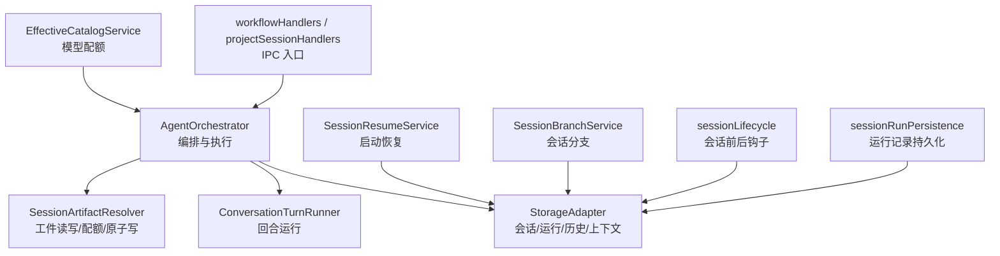

图表来源
- [AgentOrchestrator.ts:75-145](file://src/main/workflow/debugger/AgentOrchestrator.ts#L75-L145)
- [StorageAdapter.ts:41-66](file://src/main/sessions/StorageAdapter.ts#L41-L66)
- [SessionArtifactResolver.ts:285-302](file://src/main/sessions/SessionArtifactResolver.ts#L285-L302)
- [SessionResumeService.ts:22-65](file://src/main/sessions/SessionResumeService.ts#L22-L65)
- [SessionBranchService.ts:12-45](file://src/main/sessions/SessionBranchService.ts#L12-L45)
- [sessionLifecycle.ts:4-34](file://src/main/hooks/sessionLifecycle.ts#L4-L34)
- [sessionRunPersistence.ts:14-34](file://src/main/sessions/sessionRunPersistence.ts#L14-L34)
- [EffectiveCatalogService.ts:190-226](file://src/main/settings/EffectiveCatalogService.ts#L190-L226)
- [workflowHandlers.ts:35-51](file://src/main/ipc/workflowHandlers.ts#L35-L51)

章节来源
- [AgentOrchestrator.ts:75-145](file://src/main/workflow/debugger/AgentOrchestrator.ts#L75-L145)
- [StorageAdapter.ts:41-66](file://src/main/sessions/StorageAdapter.ts#L41-L66)

## 核心组件
- AgentOrchestrator：会话级编排门面，负责消息发送、配置、工具装配、回合运行、子代理、后台任务、MCP 连接、令牌规划、上下文窗口与压缩阈值、状态更新与事件发布。
- StorageAdapter：统一的项目/会话/运行/对话历史/上下文/交接状态存储层，提供创建、读取、更新、删除、追加、提交、回滚等操作。
- SessionArtifactResolver：会话工件（tool outputs、附件等）的安全解析、读写、配额控制、原子写入、哈希校验、路径逃逸防护、临时文件清理与崩溃恢复。
- SessionResumeService：应用启动时检测并恢复上次活跃会话及未完成 run。
- SessionBranchService：基于当前会话创建分支，复制历史消息到新会话。
- sessionLifecycle：会话创建/删除的前后钩子扩展点。
- sessionRunPersistence：运行记录的 v3 持久化与迁移读取。
- EffectiveCatalogService：运行时模型发现中的配额注入与过期处理。
- ConversationTurnRunner：将编排结果落地为对话消息、分支状态、上下文条目与使用量统计。

章节来源
- [AgentOrchestrator.ts:195-366](file://src/main/workflow/debugger/AgentOrchestrator.ts#L195-L366)
- [StorageAdapter.ts:131-446](file://src/main/sessions/StorageAdapter.ts#L131-L446)
- [SessionArtifactResolver.ts:337-581](file://src/main/sessions/SessionArtifactResolver.ts#L337-L581)
- [SessionResumeService.ts:22-65](file://src/main/sessions/SessionResumeService.ts#L22-L65)
- [SessionBranchService.ts:12-45](file://src/main/sessions/SessionBranchService.ts#L12-L45)
- [sessionLifecycle.ts:4-34](file://src/main/hooks/sessionLifecycle.ts#L4-L34)
- [sessionRunPersistence.ts:14-34](file://src/main/sessions/sessionRunPersistence.ts#L14-L34)
- [EffectiveCatalogService.ts:190-226](file://src/main/settings/EffectiveCatalogService.ts#L190-L226)
- [ConversationTurnRunner.ts:124-144](file://src/main/conversation/ConversationTurnRunner.ts#L124-L144)

## 架构总览
AgentOrchestrator 作为会话编排中心，协调 Turn 准备、工具装配、LLM 调用、工具执行、子代理与后台任务，并通过 StorageAdapter 将对话、上下文、运行、工件等状态持久化；SessionArtifactResolver 保证工件安全与配额；SessionResumeService 在启动时恢复未完成的会话；SessionBranchService 支持会话分叉；sessionLifecycle 提供可扩展的生命周期钩子；EffectiveCatalogService 在模型选择中注入配额信息；IPC handlers 暴露对外接口以触发恢复、中止等操作。

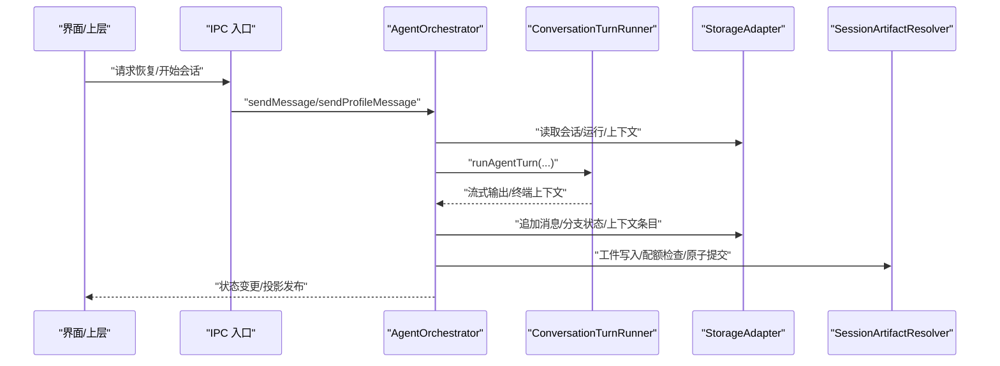

图表来源
- [AgentOrchestrator.ts:195-366](file://src/main/workflow/debugger/AgentOrchestrator.ts#L195-L366)
- [ConversationTurnRunner.ts:124-144](file://src/main/conversation/ConversationTurnRunner.ts#L124-L144)
- [StorageAdapter.ts:205-446](file://src/main/sessions/StorageAdapter.ts#L205-L446)
- [SessionArtifactResolver.ts:471-581](file://src/main/sessions/SessionArtifactResolver.ts#L471-L581)
- [workflowHandlers.ts:35-51](file://src/main/ipc/workflowHandlers.ts#L35-L51)

## 详细组件分析

### AgentOrchestrator：会话编排与状态中枢
- 会话键与隔离：通过 sessionTurnKey(sessionId, ephemeralScopeId) 生成执行范围键，结合 turnCoordinator 维护活跃回合句柄，实现会话级并发隔离与中止。
- 消息与配置：sendMessage/sendProfileMessage 完成凭证刷新、模型路由、提示计划构建、回合运行、最终消息落盘与状态更新。
- 状态与事件：updateAgentStatus 更新槽位状态并发布到工作流投影；recordMessage 将用户/助手消息持久化为 ActionEvent 并通知投影。
- 资源释放：finally 块中释放临时代理状态、MCP 租约与凭证句柄，避免泄漏。

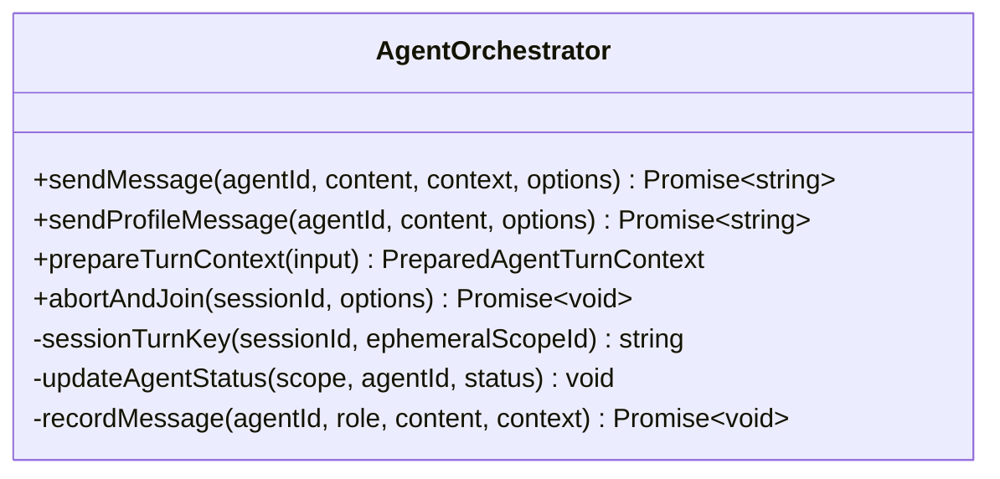

图表来源
- [AgentOrchestrator.ts:75-145](file://src/main/workflow/debugger/AgentOrchestrator.ts#L75-L145)
- [AgentOrchestrator.ts:195-366](file://src/main/workflow/debugger/AgentOrchestrator.ts#L195-L366)
- [AgentOrchestrator.ts:638-653](file://src/main/workflow/debugger/AgentOrchestrator.ts#L638-L653)
- [AgentOrchestrator.ts:725-795](file://src/main/workflow/debugger/AgentOrchestrator.ts#L725-L795)

章节来源
- [AgentOrchestrator.ts:195-366](file://src/main/workflow/debugger/AgentOrchestrator.ts#L195-L366)
- [AgentOrchestrator.ts:638-653](file://src/main/workflow/debugger/AgentOrchestrator.ts#L638-L653)
- [AgentOrchestrator.ts:725-795](file://src/main/workflow/debugger/AgentOrchestrator.ts#L725-L795)

### StorageAdapter：持久化与上下文管理
- 会话与运行：createSession/listSessions/readSession/updateSession/createRun/listRuns/getLatestRun/readPersistedRun。
- 对话历史：read/writeConversationHistory、appendConversationDelta、compactConversationHistory、branch state 读写。
- 上下文与使用量：writeSessionContextJournal、readSessionUsage/writeSessionUsage、clearSessionContextState。
- 工件与附件：getSessionAttachmentsDir、list/import/rollback attachments。
- 当前会话：getCurrentSessionId/setCurrentSessionId，并在切换时通知工件解析器确保一致性。

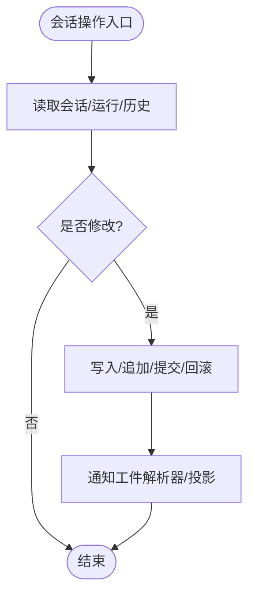

图表来源
- [StorageAdapter.ts:205-446](file://src/main/sessions/StorageAdapter.ts#L205-L446)

章节来源
- [StorageAdapter.ts:205-446](file://src/main/sessions/StorageAdapter.ts#L205-L446)

### SessionArtifactResolver：工件安全、配额与原子写
- 安全解析：严格校验路径逃逸、符号链接、硬链接、可执行/危险 MIME，限制最大文件大小与图片大小。
- 配额管理：reserve/commit/rollback 会话工件配额，支持 maxFileBytes、maxSessionBytes、maxToolOutputFiles。
- 原子写入：先写 .tmp 再原子 rename，失败时清理临时文件并回滚配额。
- 崩溃恢复：ensureReconciled/reconcileUsage 扫描残留 tmp 与损坏配额，重建磁盘真相。

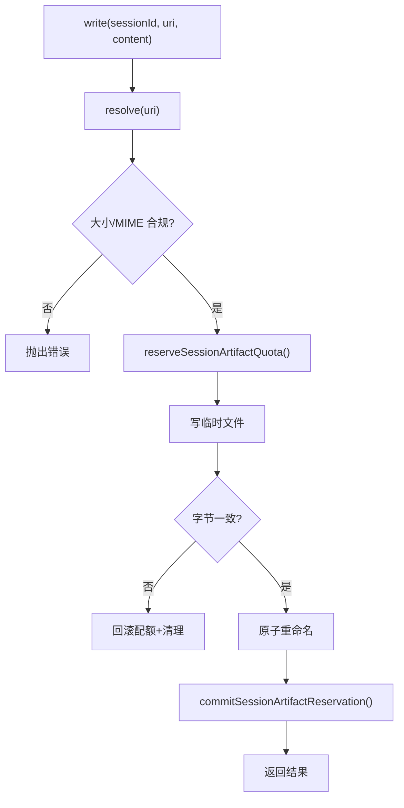

图表来源
- [SessionArtifactResolver.ts:471-581](file://src/main/sessions/SessionArtifactResolver.ts#L471-L581)
- [SessionArtifactResolver.ts:304-326](file://src/main/sessions/SessionArtifactResolver.ts#L304-L326)
- [SessionArtifactResolver.ts:561-581](file://src/main/sessions/SessionArtifactResolver.ts#L561-L581)

章节来源
- [SessionArtifactResolver.ts:337-581](file://src/main/sessions/SessionArtifactResolver.ts#L337-L581)

### SessionResumeService：启动恢复与断点续传
- 获取可恢复会话：读取当前会话 ID、会话记录、最新运行，判断是否存在未完成 run（running/awaiting_input/awaiting_approval）。
- 会话历史加载：readConversationHistory 用于 UI 恢复显示。
- 典型用法：应用启动时调用 getResumableSession，若存在则恢复 currentSessionId 与 latestRun。

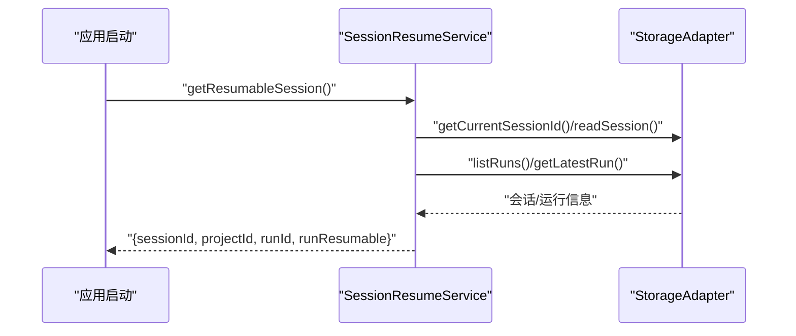

图表来源
- [SessionResumeService.ts:22-65](file://src/main/sessions/SessionResumeService.ts#L22-L65)
- [StorageAdapter.ts:437-446](file://src/main/sessions/StorageAdapter.ts#L437-L446)

章节来源
- [SessionResumeService.ts:22-65](file://src/main/sessions/SessionResumeService.ts#L22-L65)

### SessionBranchService：会话分支
- 创建分支：基于源会话创建新会话，复制历史消息到新会话。
- 列出分支：按项目列出所有会话（包含分支）。

章节来源
- [SessionBranchService.ts:12-45](file://src/main/sessions/SessionBranchService.ts#L12-L45)

### sessionLifecycle：会话生命周期钩子
- 创建前钩子：session.before-start 允许拦截或拒绝创建。
- 删除后钩子：session.after-end 在删除后执行清理逻辑。

章节来源
- [sessionLifecycle.ts:4-34](file://src/main/hooks/sessionLifecycle.ts#L4-L34)

### sessionRunPersistence：运行记录持久化
- 写入：将运行记录以 JSON/YAML 原子写入 run.json/run.yaml。
- 读取：读取并迁移旧格式至 v3。

章节来源
- [sessionRunPersistence.ts:14-34](file://src/main/sessions/sessionRunPersistence.ts#L14-L34)

### ConversationTurnRunner：回合落地与上下文同步
- 回合完成后更新会话 turnControls 并持久化。
- 将终端上下文（消息、执行身份、状态、待交接、完成声明）回调给上层。

章节来源
- [ConversationTurnRunner.ts:124-144](file://src/main/conversation/ConversationTurnRunner.ts#L124-L144)
- [ConversationTurnRunner.ts:495-518](file://src/main/conversation/ConversationTurnRunner.ts#L495-L518)

### EffectiveCatalogService：模型配额注入
- 在模型目录中发现模型时注入配额信息，支持过期清理与审计元数据。

章节来源
- [EffectiveCatalogService.ts:190-226](file://src/main/settings/EffectiveCatalogService.ts#L190-L226)

### IPC 入口：恢复与中止
- workflow:resume：设置当前会话与最新运行。
- projectSessionHandlers（测试中体现）：同步会话槽位、中止后台会话、取消活跃回合。

章节来源
- [workflowHandlers.ts:35-51](file://src/main/ipc/workflowHandlers.ts#L35-L51)
- [projectSessionHandlers.remove.test.ts:75-97](file://src/main/ipc/projectSessionHandlers.remove.test.ts#L75-L97)

## 依赖关系分析
- AgentOrchestrator 依赖 TurnPreparationService、AgentTurnRunner、SubagentRunner、BackgroundSubagentService、Tokenizers、PromptPlan、Settings、StorageAdapter、MCP 协调器等。
- StorageAdapter 聚合 ProjectWorkspaceStore、SessionRecordStore、ConversationHistoryStore、SessionContextStore、HandoffStateStore。
- SessionArtifactResolver 依赖 StorageIo、StorageAdapter、配额服务，负责工件安全与配额。
- SessionResumeService 依赖 StorageAdapter 进行恢复。
- SessionBranchService 依赖 storageAdapter 与 sessionLifecycle。
- ConversationTurnRunner 依赖 storageAdapter 更新会话上下文与使用量。
- EffectiveCatalogService 影响模型选择与配额。

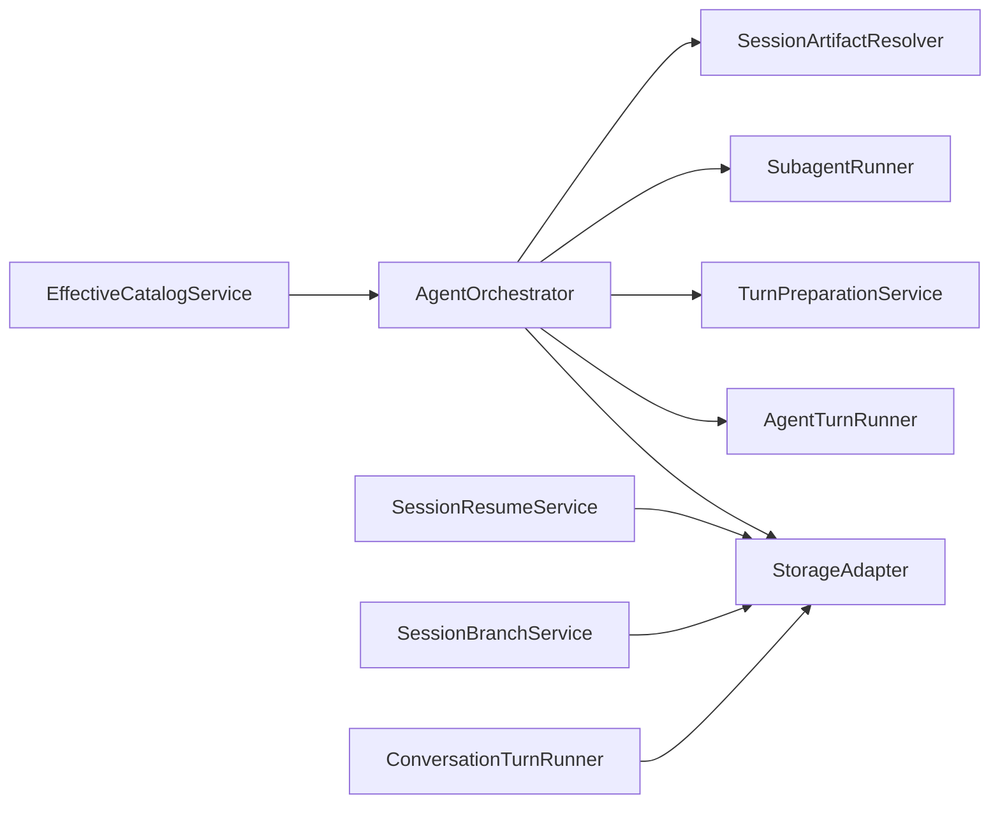

图表来源
- [AgentOrchestrator.ts:75-145](file://src/main/workflow/debugger/AgentOrchestrator.ts#L75-L145)
- [StorageAdapter.ts:41-66](file://src/main/sessions/StorageAdapter.ts#L41-L66)
- [SessionArtifactResolver.ts:285-302](file://src/main/sessions/SessionArtifactResolver.ts#L285-L302)
- [SessionResumeService.ts:22-65](file://src/main/sessions/SessionResumeService.ts#L22-L65)
- [SessionBranchService.ts:12-45](file://src/main/sessions/SessionBranchService.ts#L12-L45)
- [ConversationTurnRunner.ts:124-144](file://src/main/conversation/ConversationTurnRunner.ts#L124-L144)
- [EffectiveCatalogService.ts:190-226](file://src/main/settings/EffectiveCatalogService.ts#L190-L226)

## 性能与内存优化
- 上下文窗口与压缩：通过 planEffectiveModelRequest 计算 contextWindowTokens、compactionThresholdTokens，并在 AgentOrchestrator 中传递给 turnRunner，驱动上下文压缩与预算控制。
- 模型配额：EffectiveCatalogService 注入模型配额并支持过期清理，避免无效模型占用调度资源。
- 工件配额：SessionArtifactResolver 限制单文件大小、会话总大小与工具输出文件数，防止磁盘膨胀。
- 原子写与临时文件清理：减少崩溃导致的脏数据与临时文件残留，提升稳定性。
- 会话切换卫生：在渲染层切换会话时清空投影、缓存与上下文快照，避免跨会话污染。

[本节为通用指导，不直接分析具体文件]

## 故障排查指南
- 工件写入失败：检查 MIME 白名单、大小限制、符号链接/硬链接拒绝、原子重命名失败；查看 SessionArtifactResolver 抛出的错误码。
- 配额超限：确认 maxFileBytes、maxSessionBytes、maxToolOutputFiles 配置；必要时清理 tool-outputs 或调整配额。
- 崩溃恢复：调用 ensureReconciled/reconcileUsage 清理残留 tmp 并重建配额；检查 quota 文件完整性。
- 会话恢复失败：检查 getCurrentSessionId/readSession/listRuns 返回值；确认是否有未完成 run。
- 会话中止：通过 abortAndJoin 或 IPC 中止活跃回合；确认 turnCoordinator 句柄存在。

章节来源
- [SessionArtifactResolver.ts:471-581](file://src/main/sessions/SessionArtifactResolver.ts#L471-L581)
- [SessionArtifactResolver.ts:304-326](file://src/main/sessions/SessionArtifactResolver.ts#L304-L326)
- [SessionResumeService.ts:22-65](file://src/main/sessions/SessionResumeService.ts#L22-L65)
- [AgentOrchestrator.ts:638-653](file://src/main/workflow/debugger/AgentOrchestrator.ts#L638-L653)

## 结论
AgentOrchestrator 通过统一的编排接口协调会话生命周期，配合 StorageAdapter 实现强一致的持久化，借助 SessionArtifactResolver 保障工件安全与配额，利用 SessionResumeService 实现启动恢复与断点续传，并通过 sessionLifecycle 提供扩展点。整体设计强调隔离性、可恢复性与资源可控性，适合高可靠的多会话、多代理场景。

## 附录：状态机与序列图

### 会话状态机（创建→激活→运行→暂停→恢复→销毁）
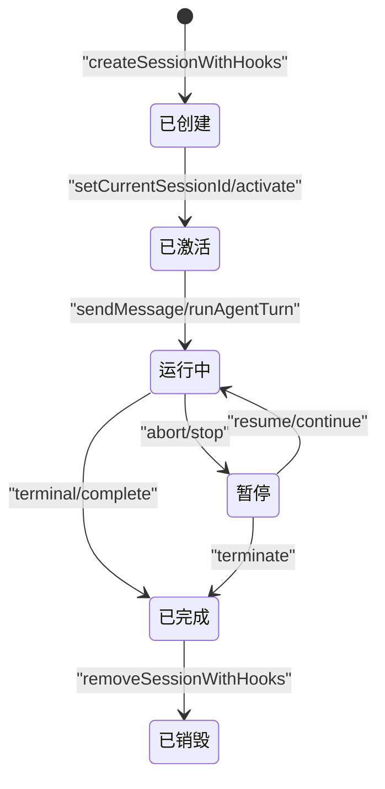

图表来源
- [sessionLifecycle.ts:4-34](file://src/main/hooks/sessionLifecycle.ts#L4-L34)
- [StorageAdapter.ts:437-446](file://src/main/sessions/StorageAdapter.ts#L437-L446)
- [AgentOrchestrator.ts:195-366](file://src/main/workflow/debugger/AgentOrchestrator.ts#L195-L366)
- [AgentOrchestrator.ts:638-653](file://src/main/workflow/debugger/AgentOrchestrator.ts#L638-L653)

### 会话创建与激活序列
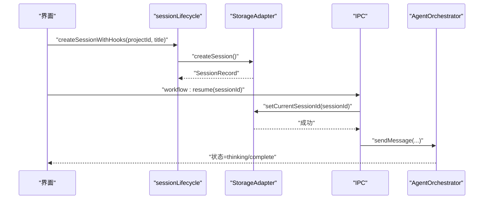

图表来源
- [sessionLifecycle.ts:4-34](file://src/main/hooks/sessionLifecycle.ts#L4-L34)
- [StorageAdapter.ts:437-446](file://src/main/sessions/StorageAdapter.ts#L437-L446)
- [workflowHandlers.ts:35-51](file://src/main/ipc/workflowHandlers.ts#L35-L51)
- [AgentOrchestrator.ts:195-366](file://src/main/workflow/debugger/AgentOrchestrator.ts#L195-L366)

### 会话恢复与断点续传序列
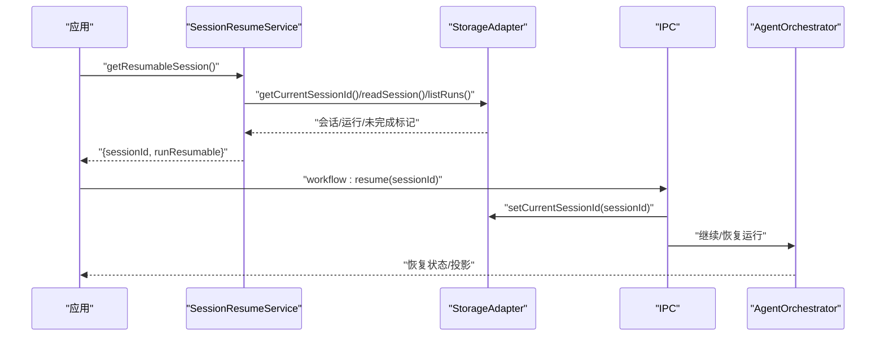

图表来源
- [SessionResumeService.ts:22-65](file://src/main/sessions/SessionResumeService.ts#L22-L65)
- [StorageAdapter.ts:437-446](file://src/main/sessions/StorageAdapter.ts#L437-L446)
- [workflowHandlers.ts:35-51](file://src/main/ipc/workflowHandlers.ts#L35-L51)
- [AgentOrchestrator.ts:638-653](file://src/main/workflow/debugger/AgentOrchestrator.ts#L638-L653)

### 会话销毁与资源清理序列
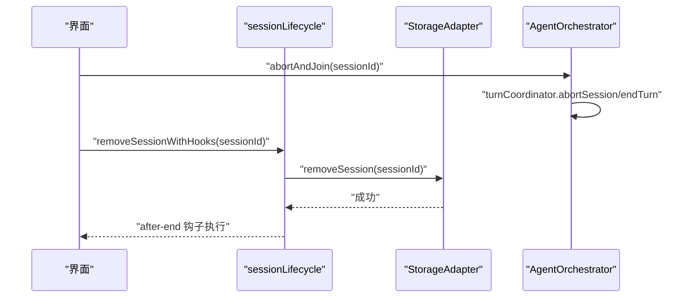

图表来源
- [AgentOrchestrator.ts:638-653](file://src/main/workflow/debugger/AgentOrchestrator.ts#L638-L653)
- [sessionLifecycle.ts:23-34](file://src/main/hooks/sessionLifecycle.ts#L23-L34)
- [StorageAdapter.ts:107-109](file://src/main/sessions/StorageAdapter.ts#L107-L109)