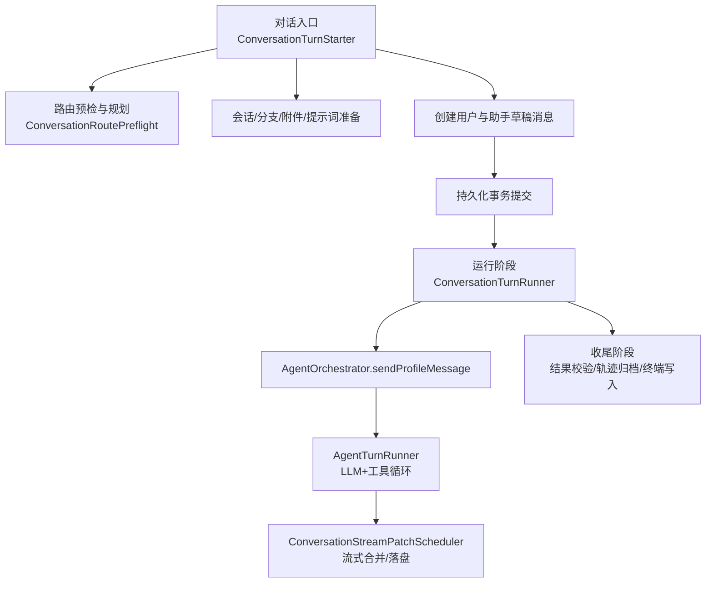
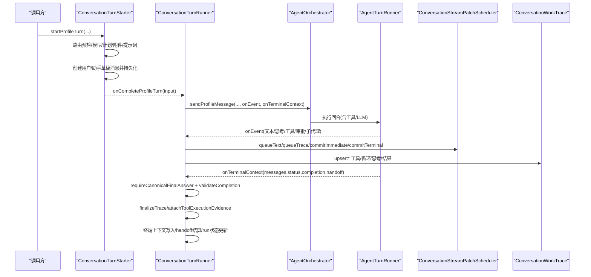
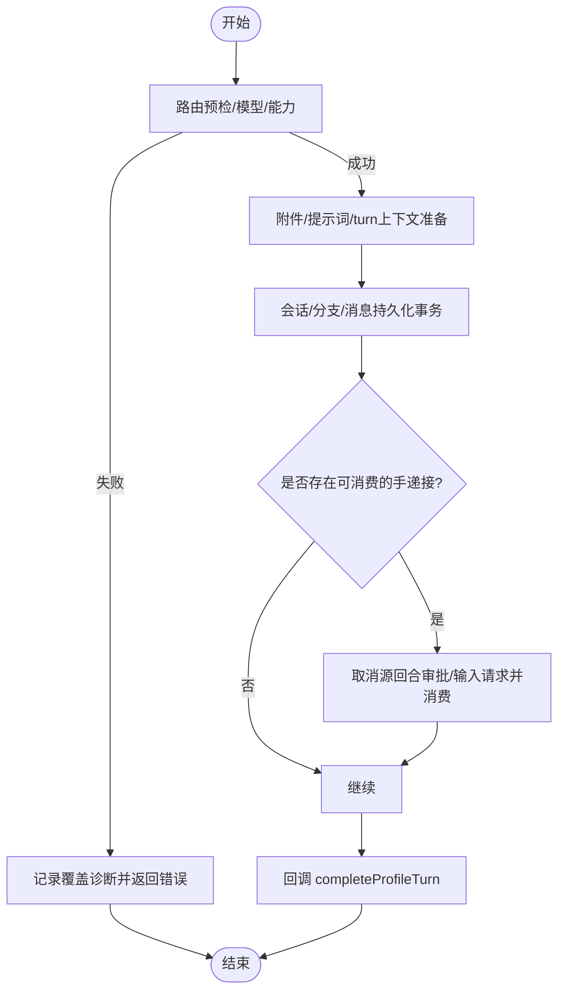
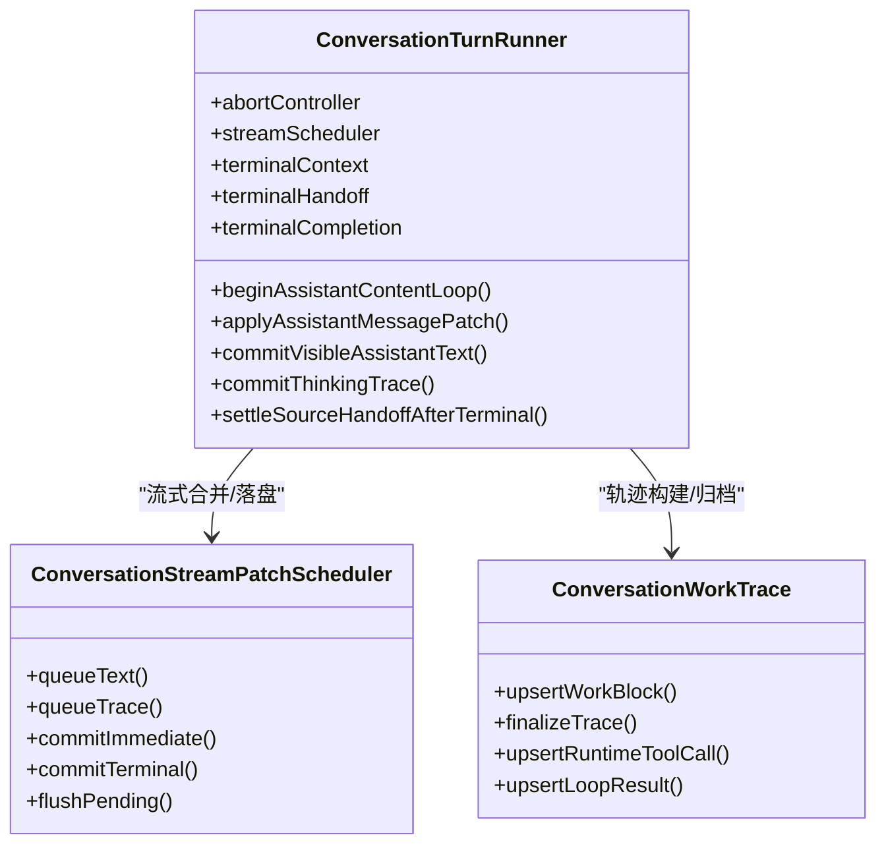
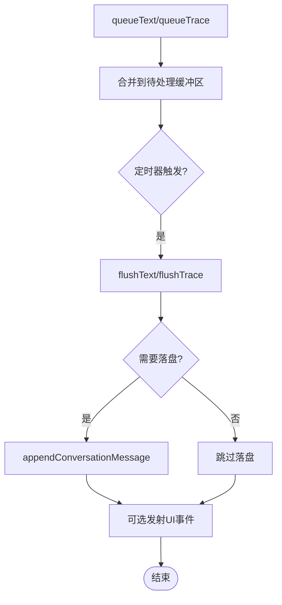
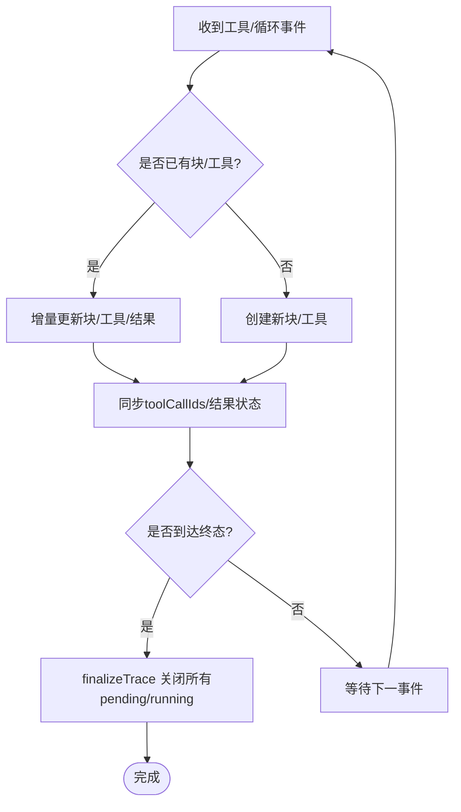
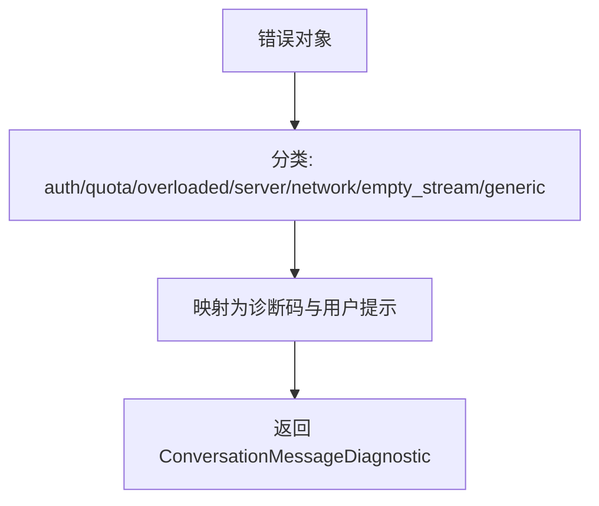
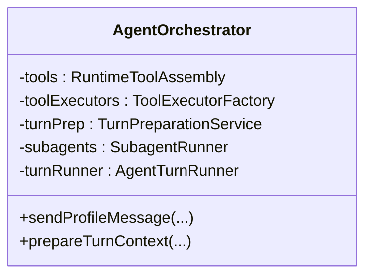
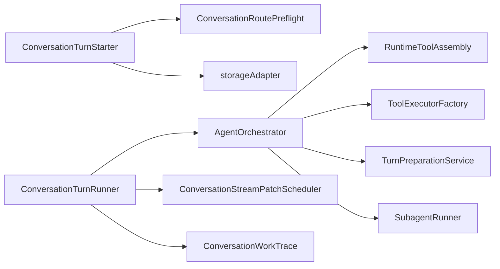

# 回合执行引擎

<cite>
**本文引用的文件**
- [ConversationTurnRunner.ts](file://src/main/conversation/ConversationTurnRunner.ts)
- [ConversationTurnStarter.ts](file://src/main/conversation/ConversationTurnStarter.ts)
- [ConversationRoutePreflight.ts](file://src/main/conversation/ConversationRoutePreflight.ts)
- [ConversationStreamPatchScheduler.ts](file://src/main/conversation/ConversationStreamPatchScheduler.ts)
- [ConversationWorkTrace.ts](file://src/main/conversation/ConversationWorkTrace.ts)
- [ConversationLoopRuntimeState.ts](file://src/main/conversation/ConversationLoopRuntimeState.ts)
- [AgentOrchestrator.ts](file://src/main/workflow/debugger/AgentOrchestrator.ts)
</cite>

## 目录
1. [简介](#简介)
2. [项目结构](#项目结构)
3. [核心组件](#核心组件)
4. [架构总览](#架构总览)
5. [详细组件分析](#详细组件分析)
6. [依赖关系分析](#依赖关系分析)
7. [性能考虑](#性能考虑)
8. [故障排查指南](#故障排查指南)
9. [结论](#结论)
10. [附录](#附录)

## 简介
本文件围绕“回合执行引擎”展开，聚焦 AgentTurnRunner 的完整回合生命周期：从请求准备、路由预检、模型与工具编排、流式输出聚合，到最终状态提交、进度追踪、中断恢复与错误处理。文档以代码级为依据，提供流程图、时序图与类图，帮助读者理解回合各阶段的状态转换、异常路径与优化策略。

## 项目结构
回合执行由“启动—运行—收尾”三段式组成：
- 启动阶段：ConversationTurnStarter 负责会话/分支/附件/提示词/能力规划等准备工作，并创建用户与助手草稿消息，进入持久化事务。
- 运行阶段：ConversationTurnRunner 调用 AgentOrchestrator.sendProfileMessage 驱动 AgentTurnRunner 完成 LLM 交互与工具调用，通过 ConversationStreamPatchScheduler 进行流式合并与落盘。
- 收尾阶段：完成 canonical 答案校验、工作轨迹归档、终端上下文写入、手递交接（handoff）结算、运行状态更新与资源释放。

图表来源
- [ConversationTurnStarter.ts:68-617](file://src/main/conversation/ConversationTurnStarter.ts#L68-L617)
- [ConversationTurnRunner.ts:124-745](file://src/main/conversation/ConversationTurnRunner.ts#L124-L745)
- [AgentOrchestrator.ts:75-145](file://src/main/workflow/debugger/AgentOrchestrator.ts#L75-L145)

章节来源
- [ConversationTurnStarter.ts:68-617](file://src/main/conversation/ConversationTurnStarter.ts#L68-L617)
- [ConversationTurnRunner.ts:124-745](file://src/main/conversation/ConversationTurnRunner.ts#L124-L745)

## 核心组件
- ConversationTurnStarter：回合启动器，负责路由预检、模型选择、计划生成、附件与提示词准备、会话/分支/消息持久化事务，以及回调到 completeProfileTurn。
- ConversationTurnRunner：回合执行器，封装 AbortController 控制、流式补丁调度、可见回复同步、工作轨迹构建、终端上下文写入与 handoff 结算。
- AgentOrchestrator：编排层，装配工具、子代理、提示计划、令牌服务，并将 sendProfileMessage 委托给 AgentTurnRunner。
- ConversationStreamPatchScheduler：流式补丁调度器，按时间窗口合并文本与轨迹更新，控制落盘频率与 UI 发射。
- ConversationWorkTrace：工作轨迹数据结构与操作，维护块、工具调用、思考产物、循环结果与终止状态。
- ConversationLoopRuntimeState：回合内循环状态管理，支持新循环切换与可见回复同步。
- ConversationRoutePreflight：路由与能力预检、诊断码生成、失败分类与用户提示。

章节来源
- [ConversationTurnStarter.ts:68-617](file://src/main/conversation/ConversationTurnStarter.ts#L68-L617)
- [ConversationTurnRunner.ts:124-745](file://src/main/conversation/ConversationTurnRunner.ts#L124-L745)
- [AgentOrchestrator.ts:75-145](file://src/main/workflow/debugger/AgentOrchestrator.ts#L75-L145)
- [ConversationStreamPatchScheduler.ts:42-207](file://src/main/conversation/ConversationStreamPatchScheduler.ts#L42-L207)
- [ConversationWorkTrace.ts:67-686](file://src/main/conversation/ConversationWorkTrace.ts#L67-L686)
- [ConversationLoopRuntimeState.ts:4-28](file://src/main/conversation/ConversationLoopRuntimeState.ts#L4-L28)
- [ConversationRoutePreflight.ts:350-477](file://src/main/conversation/ConversationRoutePreflight.ts#L350-L477)

## 架构总览
回合执行的核心数据与控制流如下：
- 输入：用户消息、会话/项目上下文、配置提交指纹、分支信息、权限/预算等。
- 预处理：路由预检、模型解析、提示计划、附件材料化、会话/分支/消息持久化。
- 执行：sendProfileMessage 驱动 AgentTurnRunner，内部维护 loopSeq、thinking、toolCalls、providerOutputRefs 等状态；通过事件回调将增量写入 ConversationStreamPatchScheduler。
- 收尾：canonical 答案校验、工作轨迹归档、终端上下文写入、handoff 结算、run 状态更新、资源释放。

图表来源
- [ConversationTurnStarter.ts:68-617](file://src/main/conversation/ConversationTurnStarter.ts#L68-L617)
- [ConversationTurnRunner.ts:124-745](file://src/main/conversation/ConversationTurnRunner.ts#L124-L745)
- [AgentOrchestrator.ts:75-145](file://src/main/workflow/debugger/AgentOrchestrator.ts#L75-L145)
- [ConversationStreamPatchScheduler.ts:42-207](file://src/main/conversation/ConversationStreamPatchScheduler.ts#L42-L207)
- [ConversationWorkTrace.ts:67-686](file://src/main/conversation/ConversationWorkTrace.ts#L67-L686)

## 详细组件分析

### 回合启动器（ConversationTurnStarter）
职责
- 解析 agent/profile、加载 provider 表面、刷新运行时凭据。
- 路由预检与能力评估，生成 RequestPlan 与 controls。
- 附件材料化与提示词准备，准备 turn 上下文。
- 在会话/分支上创建用户与助手草稿消息，开启持久化事务。
- 若存在待消费 handoff，则取消源回合的审批/输入请求并消费 handoff。
- 提交后回调 completeProfileTurn 进入运行阶段。

关键流程
- 预检失败：记录覆盖诊断并抛出明确错误码。
- 附件未就绪：拒绝或要求先选择/创建项目会话。
- 配置一致性：对 agent/provider/catalog/route 的版本/哈希进行一致性校验。
- 分支与变体：在 fork/branch 下创建锚点消息与根 turnId。

图表来源
- [ConversationTurnStarter.ts:68-617](file://src/main/conversation/ConversationTurnStarter.ts#L68-L617)
- [ConversationRoutePreflight.ts:350-477](file://src/main/conversation/ConversationRoutePreflight.ts#L350-L477)

章节来源
- [ConversationTurnStarter.ts:68-617](file://src/main/conversation/ConversationTurnStarter.ts#L68-L617)
- [ConversationRoutePreflight.ts:350-477](file://src/main/conversation/ConversationRoutePreflight.ts#L350-L477)

### 回合执行器（ConversationTurnRunner）
职责
- 管理 AbortController 与活跃回合注册，支持用户停止。
- 使用 ConversationStreamPatchScheduler 合并文本与轨迹更新，控制落盘与 UI 发射。
- 维护当前循环状态：loopSeq、currentLoopText、thinking、providerOutputRefs、visibleResponse、outputPhase。
- 接收 AgentTurnRunner 的事件回调，更新工作轨迹与可见回复。
- 终端阶段：校验 canonical 答案、验证完成条件、归档工作轨迹、写入终端上下文、结算 handoff、更新 run 状态、释放资源。

关键机制
- 可见回复同步：仅在 final_answer 且无 thinking/tools/ask 时显示正文，避免干扰。
- 流式合并：文本与轨迹分别按时间窗口合并，减少频繁落盘与渲染。
- 终止语义：stopped/error/complete 三种终态，对应不同 trace 与 UI 行为。
- 错误诊断：统一转换为 ConversationMessageDiagnostic，记录技术信息与用户提示。

图表来源
- [ConversationTurnRunner.ts:124-745](file://src/main/conversation/ConversationTurnRunner.ts#L124-L745)
- [ConversationStreamPatchScheduler.ts:42-207](file://src/main/conversation/ConversationStreamPatchScheduler.ts#L42-L207)
- [ConversationWorkTrace.ts:67-686](file://src/main/conversation/ConversationWorkTrace.ts#L67-L686)

章节来源
- [ConversationTurnRunner.ts:124-745](file://src/main/conversation/ConversationTurnRunner.ts#L124-L745)

### 流式补丁调度器（ConversationStreamPatchScheduler）
职责
- 将高频的文本与轨迹更新按时间窗口合并，降低落盘与 UI 压力。
- 支持立即提交与终端提交，保证终止状态的及时可见性。
- 控制 emit/publishTrace/persist 的组合开关，满足不同场景需求。

关键参数
- textFlushMs：文本合并间隔（默认 48ms）。
- traceFlushMs：轨迹重建间隔（默认 160ms），避免阻塞流式响应。
- persistFlushMs：落盘间隔（默认 600ms），平衡一致性与性能。

图表来源
- [ConversationStreamPatchScheduler.ts:42-207](file://src/main/conversation/ConversationStreamPatchScheduler.ts#L42-L207)

章节来源
- [ConversationStreamPatchScheduler.ts:42-207](file://src/main/conversation/ConversationStreamPatchScheduler.ts#L42-L207)

### 工作轨迹与循环状态（ConversationWorkTrace / ConversationLoopRuntimeState）
职责
- 维护 workTrace 树形结构，包含 reasoning/llm_turn/approval/user_input/subagent/handoff/diagnostic/output 等块。
- 跟踪工具调用、审批状态、思考产物、循环结果与 stopReason。
- 支持子代理嵌套、工具证据聚合、去重 providerOutputRefs。
- 管理回合内循环切换与可见回复同步。

关键点
- finalizeTrace：在终态时将 pending/running 的工具与块标记为 skipped/error，并补齐 completedAt。
- upsertRuntimeToolCall/upsertLoopResult：增量更新工具与循环结果，保持 toolCallIds 与 result 的一致性。
- beginAssistantContentLoopIfPending：在新循环开始时重置循环状态，确保 UI 不残留上一轮内容。

图表来源
- [ConversationWorkTrace.ts:67-686](file://src/main/conversation/ConversationWorkTrace.ts#L67-L686)
- [ConversationLoopRuntimeState.ts:4-28](file://src/main/conversation/ConversationLoopRuntimeState.ts#L4-L28)

章节来源
- [ConversationWorkTrace.ts:67-686](file://src/main/conversation/ConversationWorkTrace.ts#L67-L686)
- [ConversationLoopRuntimeState.ts:4-28](file://src/main/conversation/ConversationLoopRuntimeState.ts#L4-L28)

### 路由预检与错误诊断（ConversationRoutePreflight）
职责
- 解析 agent/profile、provider/model、能力与覆盖诊断。
- 生成统一的诊断码与用户提示，涵盖认证、额度、过载、网络、空流、协议违规等。
- 识别 AgentLoopTerminationError 等特定错误，映射为用户友好的中文提示。

常见诊断
- CONVERSATION_LLM_ROUTE_MISSING：未绑定可用模型。
- CONVERSATION_LLM_PROVIDER_UNAVAILABLE：provider 不可用或未验证。
- CONVERSATION_AGENT_LOOP_STALLED：连续三轮相同工具/参数/结果，停止无效消耗。
- CONVERSATION_AGENT_TURN_LIMIT_EXCEEDED：达到最大轮次限制。
- CONVERSATION_PROVIDER_STREAM_PROTOCOL_VIOLATION：本地流式协议完整性检查失败。
- MISSION_COMPLETION_DENIED：调查完成契约未满足。

图表来源
- [ConversationRoutePreflight.ts:523-604](file://src/main/conversation/ConversationRoutePreflight.ts#L523-L604)
- [ConversationRoutePreflight.ts:745-774](file://src/main/conversation/ConversationRoutePreflight.ts#L745-L774)

章节来源
- [ConversationRoutePreflight.ts:350-477](file://src/main/conversation/ConversationRoutePreflight.ts#L350-L477)
- [ConversationRoutePreflight.ts:523-604](file://src/main/conversation/ConversationRoutePreflight.ts#L523-L604)
- [ConversationRoutePreflight.ts:745-774](file://src/main/conversation/ConversationRoutePreflight.ts#L745-L774)

### 编排层（AgentOrchestrator）
职责
- 装配 RuntimeToolAssembly、ToolExecutorFactory、TurnPreparationService、SubagentRunner。
- 暴露 sendProfileMessage/prepareTurnContext 等高层接口，屏蔽底层细节。
- 将 AgentTurnRunner 注入到会话/作用域键中，管理 MCP 连接与凭据。

协作关系
- 与 ConversationTurnRunner 通过 sendProfileMessage 对接，传递 onEvent/onTerminalContext。
- 与 TurnPreparationService 协作完成提示计划与工具签名。
- 与 SubagentRunner 协作实现子代理与后台任务。

图表来源
- [AgentOrchestrator.ts:75-145](file://src/main/workflow/debugger/AgentOrchestrator.ts#L75-L145)

章节来源
- [AgentOrchestrator.ts:75-145](file://src/main/workflow/debugger/AgentOrchestrator.ts#L75-L145)

## 依赖关系分析
- ConversationTurnStarter 依赖 ConversationRoutePreflight 进行路由与能力预检，依赖 storageAdapter 进行会话/分支/消息持久化。
- ConversationTurnRunner 依赖 AgentOrchestrator 驱动执行，依赖 ConversationStreamPatchScheduler 进行流式合并，依赖 ConversationWorkTrace 构建轨迹。
- AgentOrchestrator 依赖 RuntimeToolAssembly、ToolExecutorFactory、TurnPreparationService、SubagentRunner 等内部模块。
- ConversationStreamPatchScheduler 依赖 storageAdapter 与 workflowProjectionPublisher 进行落盘与投影发布。

图表来源
- [ConversationTurnStarter.ts:68-617](file://src/main/conversation/ConversationTurnStarter.ts#L68-L617)
- [ConversationTurnRunner.ts:124-745](file://src/main/conversation/ConversationTurnRunner.ts#L124-L745)
- [AgentOrchestrator.ts:75-145](file://src/main/workflow/debugger/AgentOrchestrator.ts#L75-L145)

章节来源
- [ConversationTurnStarter.ts:68-617](file://src/main/conversation/ConversationTurnStarter.ts#L68-L617)
- [ConversationTurnRunner.ts:124-745](file://src/main/conversation/ConversationTurnRunner.ts#L124-L745)
- [AgentOrchestrator.ts:75-145](file://src/main/workflow/debugger/AgentOrchestrator.ts#L75-L145)

## 性能考虑
- 流式合并：文本与轨迹分别按 48ms/160ms 合并，减少频繁落盘与 UI 重建。
- 终端即时提交：终止状态使用 commitTerminal 强制 flushPending，确保 UI 快速响应。
- 落盘节流：默认 600ms 落盘一次，避免 IO 瓶颈。
- 可见回复抑制：在 thinking/tools/ask 活跃时不显示正文，避免闪烁与误读。
- 轨迹重建成本：traceFlushMs 较大以降低右侧面板重建开销。
- 去重与裁剪：providerOutputRefs 去重，工具调用结果预览裁剪，减少内存占用。

[本节为通用指导，无需具体文件引用]

## 故障排查指南
常见问题与定位
- 路由缺失/模型不可用：检查 provider 配置与模型目录，关注 CONVERSATION_LLM_ROUTE_MISSING/CONVERSATION_LLM_PROVIDER_UNAVAILABLE。
- 认证/额度/过载/网络：根据诊断码与 HTTP 状态码判断，必要时更换模型或重试。
- 空流/协议违规：CONVERSATION_PROVIDER_STREAM_PROTOCOL_VIOLATION 表示客户端对流式分段完整性检查失败，需检查模型或升级版本。
- 循环停滞/超限：CONVERSATION_AGENT_LOOP_STALLED/CONVERSATION_AGENT_TURN_LIMIT_EXCEEDED，需缩小任务范围或调整轮次策略。
- 附件问题：ATTACHMENT_* 相关错误，移除无效附件或更换支持视觉输入的模型。
- 会话/分支所有权变更：终端上下文写入前会断言消息与分支归属，若被并发修改将抛错。

建议步骤
- 查看 ConversationMessageDiagnostic 的 code、userMessage、technicalMessage。
- 检查工作轨迹 blocks 中的 llm_turn/tool_call/approval 状态与错误信息。
- 确认会话/分支状态未被其他并发操作修改。
- 对于网络/超时问题，结合 Provider 日志与重试策略排查。

章节来源
- [ConversationRoutePreflight.ts:523-604](file://src/main/conversation/ConversationRoutePreflight.ts#L523-L604)
- [ConversationWorkTrace.ts:169-245](file://src/main/conversation/ConversationWorkTrace.ts#L169-L245)

## 结论
回合执行引擎通过清晰的三段式流程与完善的中间件机制，实现了高可靠、可观测、可中断的 LLM 与工具协同执行。ConversationTurnStarter 保障前置准备与一致性，ConversationTurnRunner 负责执行期状态管理与流式聚合，AgentOrchestrator 提供强大的编排能力，ConversationStreamPatchScheduler 与 ConversationWorkTrace 共同支撑高性能与可追溯性。配合统一诊断与错误分类，系统能够在复杂环境下稳定运行并提供良好的用户体验。

[本节为总结性内容，无需具体文件引用]

## 附录
- 术语
  - 回合（Turn）：一次用户请求到助手响应的完整执行周期。
  - 循环（Loop）：回合内的 LLM 与工具迭代过程，可能多次往返。
  - 工作轨迹（WorkTrace）：记录回合内所有关键事件的树形结构。
  - 手递接（Handoff）：将控制权从一个 agent 转移到另一个 agent 的机制。
  - 可见回复（Visible Response）：最终展示给用户的答案正文。

[本节为概念说明，无需具体文件引用]