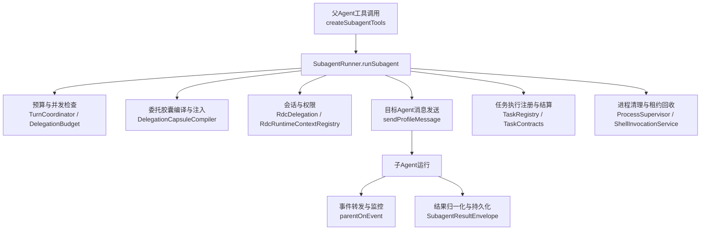
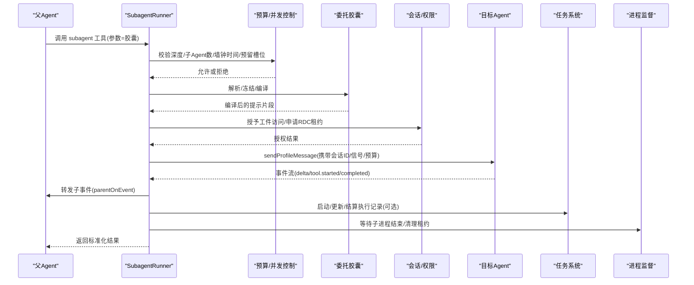
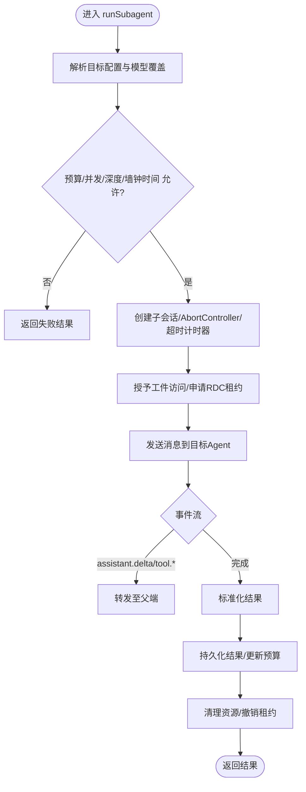
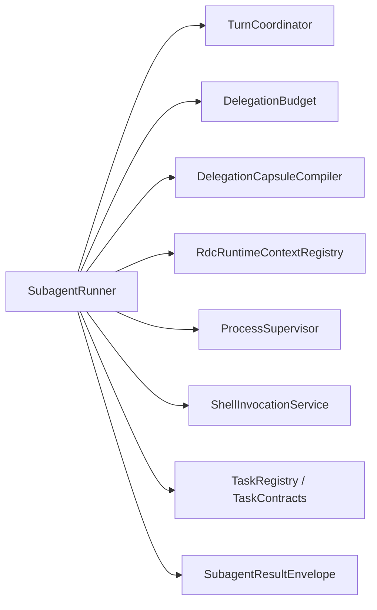

# 子Agent协调机制

<cite>
**本文引用的文件**
- [SubagentRunner.ts](file://src/main/workflow/debugger/SubagentRunner.ts)
- [DelegationBudget.ts](file://src/main/workflow/debugger/DelegationBudget.ts)
- [TaskRootBudget.ts](file://src/main/workflow/debugger/TaskRootBudget.ts)
- [TurnCoordinator.ts](file://src/main/workflow/debugger/TurnCoordinator.ts)
- [subagentModelArg.ts](file://src/main/workflow/debugger/subagentModelArg.ts)
- [DelegationCapsuleCompiler.ts](file://src/main/agent-runtime/prompt/DelegationCapsuleCompiler.ts)
- [RdcDelegation.ts](file://src/main/sessions/RdcDelegation.ts)
- [DelegatedArtifactAccess.ts](file://src/main/sessions/DelegatedArtifactAccess.ts)
- [RdcRuntimeContextRegistry.ts](file://src/main/sessions/RdcRuntimeContextRegistry.ts)
- [ProcessSupervisor.ts](file://src/main/runtime/ProcessSupervisor.ts)
- [ShellInvocationService.ts](file://src/main/tools/ShellInvocationService.ts)
- [TaskContracts.ts](file://src/main/agent-runtime/tasks/TaskContracts.ts)
- [DelegatedTaskScopes.ts](file://src/main/agent-runtime/tasks/DelegatedTaskScopes.ts)
- [delegationCapsule.ts](file://src/shared/types/delegationCapsule.ts)
</cite>

## 目录
1. [简介](#简介)
2. [项目结构](#项目结构)
3. [核心组件](#核心组件)
4. [架构总览](#架构总览)
5. [详细组件分析](#详细组件分析)
6. [依赖关系分析](#依赖关系分析)
7. [性能与并发特性](#性能与并发特性)
8. [故障排查指南](#故障排查指南)
9. [结论](#结论)
10. [附录：协议与数据模型](#附录协议与数据模型)

## 简介
本文件系统性阐述子Agent协调机制，围绕 SubagentRunner 的子任务执行模型展开，覆盖子Agent的创建、调度、监控与结果收集；解释委托预算控制、资源限制、并发管理策略；描述子Agent与父Agent的通信协议、数据共享机制与权限继承；并给出错误传播、超时处理与取消机制的实现要点。文末提供架构图、执行流程图与关键数据模型说明，帮助读者快速理解与排障。

## 项目结构
围绕子Agent协调的关键代码主要分布在以下模块：
- 工作流调试器层：负责子Agent生命周期编排、预算与并发控制、事件转发与结果持久化
- 代理运行时任务层：定义任务契约、执行记录、预算状态与任务作用域
- 会话与权限层：提供RDC能力租约、工件访问授权、进程监督等基础设施
- 共享类型层：定义委托胶囊（Delegation Capsule）结构与校验规则



图表来源
- [SubagentRunner.ts:71-429](file://src/main/workflow/debugger/SubagentRunner.ts#L71-L429)
- [TaskContracts.ts:45-127](file://src/main/agent-runtime/tasks/TaskContracts.ts#L45-L127)

章节来源
- [SubagentRunner.ts:71-429](file://src/main/workflow/debugger/SubagentRunner.ts#L71-L429)
- [TaskContracts.ts:45-127](file://src/main/agent-runtime/tasks/TaskContracts.ts#L45-L127)

## 核心组件
- SubagentRunner：子Agent的创建、调度、监控与结果收集的核心实现，封装了预算校验、超时与取消、事件转发、任务绑定与结果持久化。
- TurnCoordinator / DelegationBudget：提供预留槽位、深度限制、最大子Agent数、墙钟时间等策略预算控制。
- DelegatedTaskScopes：维护父子任务的作用域绑定，确保嵌套委派的目标任务属于拥有者任务的子树。
- delegationCapsule 与编译器：定义并校验委托胶囊，将结构化目标、约束、工件引用、技能需求等编译为子Agent可执行的提示片段。
- RdcDelegation / RdcRuntimeContextRegistry：基于领域扩展声明的能力租约与上下文租约，控制RDC相关工具的可用性与隔离性。
- ProcessSupervisor / ShellInvocationService：保障子进程生命周期管理与未确认进程清理。
- TaskContracts：定义任务与执行记录的契约，包括状态机、预算字段、完成结果结构等。

章节来源
- [SubagentRunner.ts:71-429](file://src/main/workflow/debugger/SubagentRunner.ts#L71-L429)
- [TaskContracts.ts:45-127](file://src/main/agent-runtime/tasks/TaskContracts.ts#L45-L127)
- [DelegatedTaskScopes.ts:1-12](file://src/main/agent-runtime/tasks/DelegatedTaskScopes.ts#L1-L12)
- [delegationCapsule.ts:1-62](file://src/shared/types/delegationCapsule.ts#L1-L62)

## 架构总览
下图展示父子Agent关系、任务依赖与执行流程的关键节点：



图表来源
- [SubagentRunner.ts:80-429](file://src/main/workflow/debugger/SubagentRunner.ts#L80-L429)
- [TaskContracts.ts:67-127](file://src/main/agent-runtime/tasks/TaskContracts.ts#L67-L127)

## 详细组件分析

### SubagentRunner：子任务执行模型
- 创建与初始化
  - 解析并验证目标Agent配置与模型覆盖，失败时直接返回失败结果。
  - 计算并派生子Agent的策略预算与子Agent预算，校验深度、数量、墙钟时间与预留槽位。
  - 生成独立子会话ID，建立AbortController以支持超时与取消。
- 调度与执行
  - 通过 sendProfileMessage 向目标Agent发送消息，附带会话ID、系统提示、有效配置文件、信号、预算、模型覆盖、额外提示片段、技能预加载等。
  - 使用 withDelegatedInteractionOwner 包装执行，确保交互所有权与事件归属正确。
- 监控与事件转发
  - 子Agent产生的 assistant.delta、tool.started/completed/denied 等事件被转换为子Agent事件并转发给父端，用于UI与追踪。
  - 对工具调用进行去重计数，累计到父/子预算的聚合工具调用数。
- 结果收集与持久化
  - 根据执行是否被中止决定状态为 cancelled 或 failed；否则为 complete。
  - 将结果标准化并持久化为任务执行结果，必要时回写预算快照。
- 资源清理
  - 清理定时器、加入子进程、撤销RDC租约、释放工件访问、注销生产者、移除监听器等。



图表来源
- [SubagentRunner.ts:80-429](file://src/main/workflow/debugger/SubagentRunner.ts#L80-L429)

章节来源
- [SubagentRunner.ts:80-429](file://src/main/workflow/debugger/SubagentRunner.ts#L80-L429)

### 委托预算控制与资源限制
- 策略预算（Policy Budget）
  - 通过 deriveChildPolicyBudget 派生子Agent的策略预算，结合父级预算与胶囊中声明的预算约束。
  - 使用 reserveDispatchBudget 预留子Agent槽位，并在必要时刷新观察者以通知上层。
  - 强制校验 maxChildDepth、maxWallTimeMs、maxSubagents，超限抛出策略限制异常。
- 子Agent预算（Subagent Budget）
  - 维护 depth、childrenSpawned、aggregateToolCalls、wallStartedAt 等字段，限制递归深度与工具调用总量。
  - 在事件回调中对 tool.started/completed/denied 进行去重计数，避免重复统计。
- 任务根预算绑定
  - 当存在 taskId 时，通过 bindTaskRootBudget 将当前轮次的策略预算绑定到任务根预算，保证跨执行的一致性。

章节来源
- [SubagentRunner.ts:134-153](file://src/main/workflow/debugger/SubagentRunner.ts#L134-L153)
- [SubagentRunner.ts:547-609](file://src/main/workflow/debugger/SubagentRunner.ts#L547-L609)
- [TaskContracts.ts:34-43](file://src/main/agent-runtime/tasks/TaskContracts.ts#L34-L43)

### 并发管理与取消机制
- 并发
  - 子Agent可并发调度，但受策略预算的 maxSubagents 与预留槽位限制。
  - 工具调用计数按唯一 toolCallId 去重，防止同一调用多次计数。
- 取消
  - 使用 AbortController 与父级 signal 联动，父级取消会触发子Agent取消。
  - 若任务执行已注册取消所有者，外部取消会触发执行控制器中止。
- 超时
  - 基于策略预算的 wallStartedAt 与 maxWallTimeMs 计算剩余时间，设置定时器触发中止。
  - 超时导致 resultStatus 为 cancelled，并向上抛出策略限制异常。

章节来源
- [SubagentRunner.ts:162-177](file://src/main/workflow/debugger/SubagentRunner.ts#L162-L177)
- [SubagentRunner.ts:562-567](file://src/main/workflow/debugger/SubagentRunner.ts#L562-L567)
- [SubagentRunner.ts:386-393](file://src/main/workflow/debugger/SubagentRunner.ts#L386-L393)

### 子Agent与父Agent的通信协议
- 事件通道
  - 子Agent产生的 assistant.delta、tool.started/completed/denied、approval.requested/answered 等事件通过 parentOnEvent 转发到父端。
  - 子Agent事件包含 subagentId、profile、parentToolCallId 等标识，便于追踪与关联。
- 会话隔离
  - 子Agent使用独立的 sessionId（如 parentSessionId::subagent::subagentId），避免污染父线程持久化。
- 指令与上下文
  - 通过 renderDelegationCapsuleInput 与 compileDelegationCapsule 将委托胶囊编译为提示片段，附加到子Agent上下文中。
  - 可注入 reasoningLevel、requiredSkillIds、effectiveProfile 等元信息。

章节来源
- [SubagentRunner.ts:179-382](file://src/main/workflow/debugger/SubagentRunner.ts#L179-L382)
- [delegationCapsule.ts:11-22](file://src/shared/types/delegationCapsule.ts#L11-L22)

### 数据共享机制与权限继承
- 工件访问授权
  - 通过 grantDelegatedArtifactAccess 将父会话中的工件URI授权给子会话，限制仅可访问明确列出的输入工件、挑战引用与已接受事实的来源。
- RDC能力租约
  - 若委托胶囊声明需要RDC能力，则通过 grantDelegatedLease 授予子会话临时租约，并在完成后撤销。
- 任务作用域继承
  - 通过 registerDelegatedTaskScope 将子会话绑定到父任务作用域，确保嵌套委派的目标任务必须属于拥有者任务的子树。

章节来源
- [SubagentRunner.ts:217-263](file://src/main/workflow/debugger/SubagentRunner.ts#L217-L263)
- [DelegatedTaskScopes.ts:1-12](file://src/main/agent-runtime/tasks/DelegatedTaskScopes.ts#L1-L12)

### 错误传播、超时与取消
- 错误传播
  - 解析委托胶囊失败、目标配置不可用、策略限制超限、工件访问拒绝、RDC租约拒绝等均会立即返回失败结果或抛出异常。
  - 工具调用失败或拒绝会被转换为子Agent事件，供父端展示与决策。
- 超时处理
  - 基于策略预算的墙钟时间设置超时定时器，超时时中止子执行并标记为 cancelled。
- 取消机制
  - 父级信号中止会传播到子Agent；任务执行取消会触发执行控制器中止。
  - finally 块确保清理定时器、进程、租约与监听器，避免资源泄漏。

章节来源
- [SubagentRunner.ts:117-153](file://src/main/workflow/debugger/SubagentRunner.ts#L117-L153)
- [SubagentRunner.ts:386-404](file://src/main/workflow/debugger/SubagentRunner.ts#L386-L404)

### 任务依赖图与执行流程图
- 任务依赖
  - 任务记录包含 blockedBy/blocks 字段，表达任务间的依赖关系；执行记录包含 parentExecutionId/rootBudgetId 表示执行链与预算根。
- 执行流程
  - 子Agent执行作为任务执行的一种模式（mode=subagent），支持启动、更新预算、结算结果与状态迁移。

```mermaid
classDiagram
class TaskRecord {
+string id
+string subject
+string description
+TaskStatus status
+string[] blockedBy
+string[] blocks
+string[] completionRequirements
+string[] executionIds
+number revision
}
class TaskExecutionRecord {
+string id
+string taskId
+number generation
+string runtimeInstanceId
+string? parentExecutionId
+string? rootBudgetId
+string mode
+TaskExecutionStatus status
+TaskBudgetState budget
+TaskCompletionResult? result
}
TaskRecord ||--o{ TaskExecutionRecord : "包含多个执行"
```

图表来源
- [TaskContracts.ts:45-127](file://src/main/agent-runtime/tasks/TaskContracts.ts#L45-L127)

章节来源
- [TaskContracts.ts:45-127](file://src/main/agent-runtime/tasks/TaskContracts.ts#L45-L127)

## 依赖关系分析
- SubagentRunner 依赖
  - 预算与并发：TurnCoordinator、DelegationBudget、TaskRootBudget
  - 会话与权限：RdcDelegation、RdcRuntimeContextRegistry、DelegatedArtifactAccess
  - 进程与工具：ProcessSupervisor、ShellInvocationService
  - 提示与模型：DelegationCapsuleCompiler、subagentModelArg
  - 任务系统：TaskRegistry、TaskContracts、DelegatedTaskScopes
  - 结果处理：SubagentResultEnvelope（归一化与持久化）
- 耦合与内聚
  - SubagentRunner 高度内聚于子Agent生命周期管理，通过依赖注入解耦具体实现。
  - 预算与并发控制集中在 TurnCoordinator/DelegationBudget，便于统一策略与审计。
  - 任务系统与子Agent执行紧密集成，支持跨执行预算与结果持久化。



图表来源
- [SubagentRunner.ts:1-60](file://src/main/workflow/debugger/SubagentRunner.ts#L1-L60)
- [TaskContracts.ts:45-127](file://src/main/agent-runtime/tasks/TaskContracts.ts#L45-L127)

章节来源
- [SubagentRunner.ts:1-60](file://src/main/workflow/debugger/SubagentRunner.ts#L1-L60)
- [TaskContracts.ts:45-127](file://src/main/agent-runtime/tasks/TaskContracts.ts#L45-L127)

## 性能与并发特性
- 并发控制
  - 通过策略预算的 maxSubagents 与预留槽位限制并发子Agent数量，避免资源争用。
  - 工具调用计数按唯一 toolCallId 去重，减少重复开销。
- 超时优化
  - 基于剩余墙钟时间动态设置定时器，避免长时间阻塞。
- 资源回收
  - finally 块集中清理定时器、进程、租约与监听器，降低内存与句柄泄漏风险。
- 建议
  - 合理设置 maxChildDepth、maxWallTimeMs、maxSubagents，平衡吞吐与稳定性。
  - 对长耗时任务启用 background 模式，提升用户体验与系统利用率。

[本节为通用指导，不直接分析具体文件]

## 故障排查指南
- 常见问题
  - 策略限制超限：检查 maxChildDepth、maxWallTimeMs、maxSubagents 与预留槽位。
  - 工件访问拒绝：确认父会话是否存在且已授权相应工件URI。
  - RDC租约拒绝：确保父会话与父轮次ID存在，且子会话请求了必要的领域扩展。
  - 任务作用域违规：嵌套委派的目标任务必须是拥有者任务的子任务。
- 定位步骤
  - 查看子Agent事件流（delta/tool.*）定位卡点。
  - 检查任务执行记录的状态与预算快照，确认是否达到限制。
  - 核对委托胶囊内容与大小，避免超出字符上限。
- 恢复措施
  - 调整预算参数或拆分任务以降低复杂度。
  - 延长墙钟时间或增加子Agent配额。
  - 修正工件引用与作用域绑定。

章节来源
- [SubagentRunner.ts:117-153](file://src/main/workflow/debugger/SubagentRunner.ts#L117-L153)
- [SubagentRunner.ts:217-263](file://src/main/workflow/debugger/SubagentRunner.ts#L217-L263)
- [delegationCapsule.ts:24-31](file://src/shared/types/delegationCapsule.ts#L24-L31)

## 结论
SubagentRunner 提供了完整的子Agent协调机制，涵盖创建、调度、监控、结果收集与资源清理；通过策略预算与并发控制确保系统稳定；借助会话与权限机制实现安全的父子通信与数据共享；结合任务系统实现可追溯的执行与结果持久化。建议在复杂场景中合理使用 background 模式与任务分解，以获得更好的性能与可观测性。

[本节为总结，不直接分析具体文件]

## 附录：协议与数据模型
- 委托胶囊（Delegation Capsule）
  - 字段包括 goal、task、scope、acceptedFacts、hypotheses、challengeRefs、negativePaths、inputArtifactRefs、outputRequirements、stopConditions、requiredSkillIds、budget、domainExtensions、profile、model、reasoningLevel。
  - 提供解析与冻结函数，确保不可变与尺寸限制。
- 任务与执行记录
  - TaskRecord：任务定义与依赖关系。
  - TaskExecutionRecord：执行实例、状态、预算、结果与元信息。
  - TaskBudgetState：工具调用、子Agent数、深度、截止时间等预算字段。
  - TaskCompletionResult：完成状态、摘要、输出键值、缺失要求、证据引用等。

章节来源
- [delegationCapsule.ts:11-62](file://src/shared/types/delegationCapsule.ts#L11-L62)
- [TaskContracts.ts:18-127](file://src/main/agent-runtime/tasks/TaskContracts.ts#L18-L127)