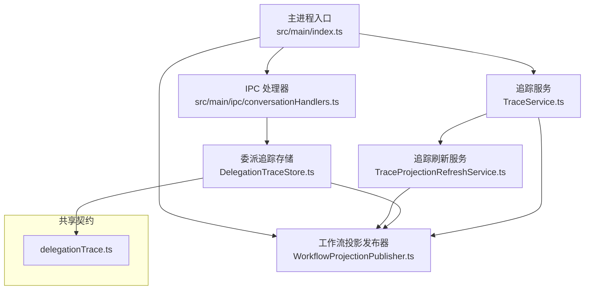
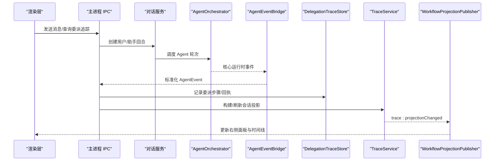
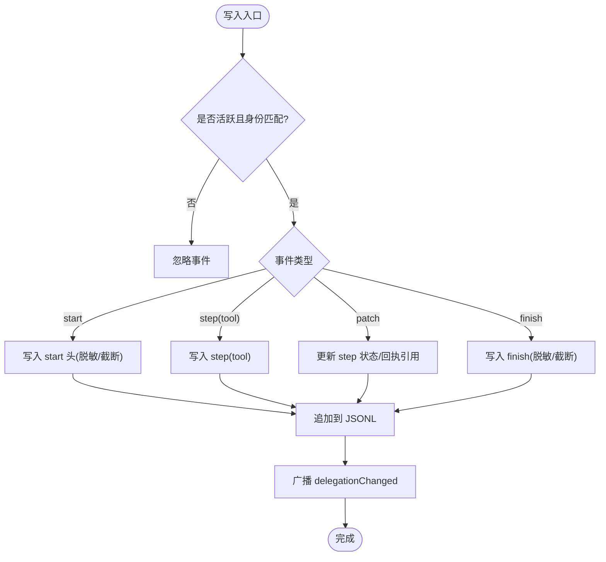
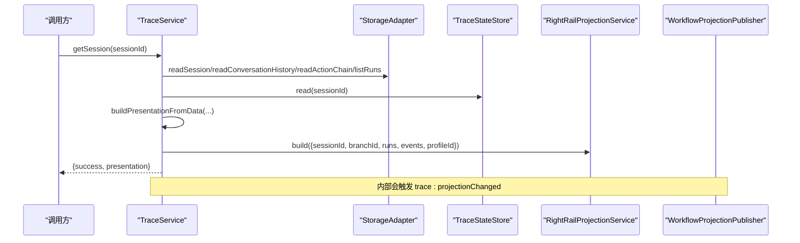
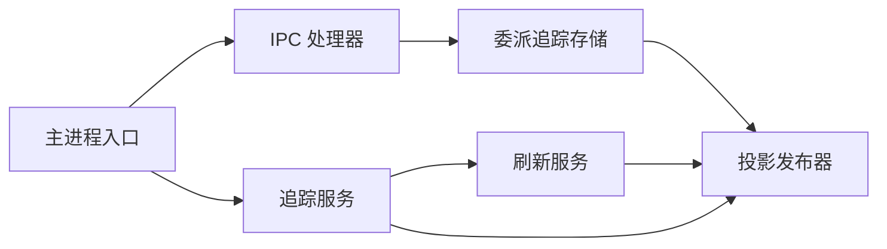

# 委托追踪系统

<cite>
**本文引用的文件**
- [src/main/index.ts](file://src/main/index.ts)
- [package.json](file://package.json)
- [src/main/agent-trace/TraceService.ts](file://src/main/agent-trace/TraceService.ts)
- [src/main/agent-trace/TraceProjectionRefreshService.ts](file://src/main/agent-trace/TraceProjectionRefreshService.ts)
- [src/main/workflow/debugger/WorkflowProjectionPublisher.ts](file://src/main/workflow/debugger/WorkflowProjectionPublisher.ts)
- [src/main/conversation/DelegationTraceStore.ts](file://src/main/conversation/DelegationTraceStore.ts)
- [src/shared/types/delegationTrace.ts](file://src/shared/types/delegationTrace.ts)
- [src/main/agent-runtime/AgentEventBridge.ts](file://src/main/agent-runtime/AgentEventBridge.ts)
- [src/main/ipc/conversationHandlers.ts](file://src/main/ipc/conversationHandlers.ts)
- [docs/architecture/agentic-trace-protocol.md](file://docs/architecture/agentic-trace-protocol.md)
- [docs/architecture/data-flow.md](file://docs/architecture/data-flow.md)
- [resources/agent-runtime/skills/execution-orchestrator/SKILL.md](file://resources/agent-runtime/skills/execution-orchestrator/SKILL.md)
</cite>

## 目录
1. [简介](#简介)
2. [项目结构](#项目结构)
3. [核心组件](#核心组件)
4. [架构总览](#架构总览)
5. [详细组件分析](#详细组件分析)
6. [依赖关系分析](#依赖关系分析)
7. [性能与可靠性](#性能与可靠性)
8. [故障排查指南](#故障排查指南)
9. [结论](#结论)
10. [附录](#附录)

## 简介
本仓库为 RDC-Agent，一个面向 GPU 调试的桌面应用。其“委托追踪系统”围绕 Agent 运行时的可审计、可回放、可投影的工作过程展开：将一次 GPU 帧问题转化为一条可追溯的答案链，并通过 Agentic Trace 协议把运行时事件持久化、投影到右侧面板与 UI，同时支持子代理委派（delegation）的全链路追踪与回执读取。

该系统的目标不是简单暴露更多按钮，而是让 Agent 明确“在调查哪个对象、观察到了什么、哪些假设在竞争、实验如何回滚、结论是否仍为推断”。为此，系统以“调查循环”为产品原语，结合任务系统、会话上下文、调查模式与知识引擎，确保结果既可读又可信。

## 项目结构
从代码组织看，委托追踪相关能力主要分布在以下区域：
- 主进程入口与服务初始化：负责启动 IPC、会话、工作流、设备回放等子系统。
- 代理运行时事件桥接：将核心运行时事件转换为共享事件契约，供 IPC、Trace、对话服务消费。
- 工作流投影发布器：统一向渲染层广播状态变更与投影更新。
- 追踪服务与刷新：聚合会话、对话、动作链，构建并推送可视化时间线。
- 委派追踪存储：持久化子代理执行步骤、回执与状态，提供分页读取与脱敏。
- 共享类型契约：定义委派追踪的数据结构与页面模型。
- IPC 处理：暴露委派追踪查询接口，限制跨会话访问。
- 文档与技能说明：描述数据流、协议与委派编排策略。

图表来源
- [src/main/index.ts:1-757](file://src/main/index.ts#L1-L757)
- [src/main/ipc/conversationHandlers.ts:122-146](file://src/main/ipc/conversationHandlers.ts#L122-L146)
- [src/main/workflow/debugger/WorkflowProjectionPublisher.ts:1-62](file://src/main/workflow/debugger/WorkflowProjectionPublisher.ts#L1-L62)
- [src/main/agent-trace/TraceService.ts:93-431](file://src/main/agent-trace/TraceService.ts#L93-L431)
- [src/main/agent-trace/TraceProjectionRefreshService.ts:1-32](file://src/main/agent-trace/TraceProjectionRefreshService.ts#L1-L32)
- [src/main/conversation/DelegationTraceStore.ts:1-218](file://src/main/conversation/DelegationTraceStore.ts#L1-L218)
- [src/shared/types/delegationTrace.ts:1-45](file://src/shared/types/delegationTrace.ts#L1-L45)

章节来源
- [package.json:1-143](file://package.json#L1-L143)
- [src/main/index.ts:1-757](file://src/main/index.ts#L1-L757)

## 核心组件
- 主进程入口：初始化 IPC、会话、RDC 运行时、设备回放、日志等服务，并在就绪后输出系统日志。
- 事件桥接：将核心运行时事件标准化为共享 AgentEvent，包含 run.started/completed、tool.started/completed/denied、assistant.*、diagnostic 等语义通道。
- 工作流投影发布器：统一通过 Electron 窗口与渲染事件中心广播 workflow、trace、evidence、conversation、agent 等事件。
- 追踪服务：按会话构建 AgentRunPresentation，聚合 runs、events、conversations，生成 timeline 与右侧面板视图，并触发刷新。
- 委派追踪存储：以 JSONL 追加写入子代理执行轨迹，维护活跃实例、分页读取、回执分片与脱敏。
- 追踪刷新服务：对频繁的任务驱动刷新进行合并节流，避免重复计算与过多投影。
- IPC 处理：暴露 conversation:getDelegationTrace / conversation:getDelegationReceipt 等接口，校验当前会话权限。

章节来源
- [src/main/agent-runtime/AgentEventBridge.ts:1-410](file://src/main/agent-runtime/AgentEventBridge.ts#L1-L410)
- [src/main/workflow/debugger/WorkflowProjectionPublisher.ts:1-62](file://src/main/workflow/debugger/WorkflowProjectionPublisher.ts#L1-L62)
- [src/main/agent-trace/TraceService.ts:93-431](file://src/main/agent-trace/TraceService.ts#L93-L431)
- [src/main/agent-trace/TraceProjectionRefreshService.ts:1-32](file://src/main/agent-trace/TraceProjectionRefreshService.ts#L1-L32)
- [src/main/conversation/DelegationTraceStore.ts:1-218](file://src/main/conversation/DelegationTraceStore.ts#L1-L218)
- [src/main/ipc/conversationHandlers.ts:122-146](file://src/main/ipc/conversationHandlers.ts#L122-L146)

## 架构总览
委托追踪系统由“事件采集—持久化—投影—UI 展示”四层组成，贯穿主进程与渲染层。

图表来源
- [docs/architecture/data-flow.md:5-31](file://docs/architecture/data-flow.md#L5-L31)
- [src/main/agent-runtime/AgentEventBridge.ts:83-301](file://src/main/agent-runtime/AgentEventBridge.ts#L83-L301)
- [src/main/conversation/DelegationTraceStore.ts:139-218](file://src/main/conversation/DelegationTraceStore.ts#L139-L218)
- [src/main/agent-trace/TraceService.ts:121-369](file://src/main/agent-trace/TraceService.ts#L121-L369)
- [src/main/workflow/debugger/WorkflowProjectionPublisher.ts:16-62](file://src/main/workflow/debugger/WorkflowProjectionPublisher.ts#L16-L62)

## 详细组件分析

### 委派追踪存储（DelegationTraceStore）
职责
- 记录子代理委派的生命周期：start、step（工具/消息/诊断）、patch（状态更新）、finish。
- 维护活跃委派实例，防止并发冲突与过期身份写入。
- 对敏感信息进行脱敏与截断，控制文本与回执大小上限。
- 提供分页读取与回执分片读取，支持大体积结果按需拉取。
- 写入完成后广播 conversation:delegationChanged，驱动 UI 增量刷新。

关键设计
- 使用 JSONL 追加写入，路径基于会话与父调用 ID 哈希，保证隔离与可定位。
- 解析时仅读取增量字节，维护内存缓存并限制条目数量，避免长追踪导致内存膨胀。
- 通过 active Map 绑定 childIdentity，只接受匹配身份的后续事件。
- 回执超过阈值时落盘，并提供 readReceipt 分页读取；未授权或不存在时返回拒绝错误。

图表来源
- [src/main/conversation/DelegationTraceStore.ts:53-81](file://src/main/conversation/DelegationTraceStore.ts#L53-L81)
- [src/main/conversation/DelegationTraceStore.ts:139-218](file://src/main/conversation/DelegationTraceStore.ts#L139-L218)

章节来源
- [src/main/conversation/DelegationTraceStore.ts:1-218](file://src/main/conversation/DelegationTraceStore.ts#L1-L218)
- [src/shared/types/delegationTrace.ts:1-45](file://src/shared/types/delegationTrace.ts#L1-L45)

### 追踪服务（TraceService）
职责
- 按会话构建 AgentRunPresentation：聚合 runs、conversations、action events，生成 timeline 与右侧面板视图。
- 将会话状态、分支信息、raw audit refs 一并返回，供 UI 渲染。
- 识别并补全阶段（understand/work/summarize），注入思考产物与最终答案。
- 提供 buildConversationPresentation 用于对话驱动的投影路径。

关键流程
- 读取会话、历史对话、动作链与运行时状态。
- 为每个 run 构建 AgentRunViewModel，去重已有节点与阶段标记。
- 根据 profile 与事件序列生成节点树与时间线。
- 构建右侧面板（进度、工件、输出、上下文）。
- 通过刷新服务触发投影变更。

图表来源
- [src/main/agent-trace/TraceService.ts:121-369](file://src/main/agent-trace/TraceService.ts#L121-L369)

章节来源
- [src/main/agent-trace/TraceService.ts:93-431](file://src/main/agent-trace/TraceService.ts#L93-L431)

### 追踪刷新服务（TraceProjectionRefreshService）
职责
- 对任务驱动的投影刷新进行合并节流，避免短时间内多次重建与广播。
- 过滤子代理会话（含特定标识）以避免重复刷新。
- 延迟 flush，批量提交最新投影。

设计要点
- 使用 pending Map 记录待刷新会话与定时器。
- 默认依赖 traceService.getSession 与 workflowProjectionPublisher.publishTraceProjectionChanged。

章节来源
- [src/main/agent-trace/TraceProjectionRefreshService.ts:1-32](file://src/main/agent-trace/TraceProjectionRefreshService.ts#L1-L32)

### 工作流投影发布器（WorkflowProjectionPublisher）
职责
- 统一广播 workflow、trace、evidence、conversation、agent 等事件。
- 通过渲染事件中心与所有 BrowserWindow 的 webContents.send 分发。

常用通道
- workflow:runStatusChanged
- workflow:runUsageChanged
- trace:projectionChanged
- evidence:eventAdded
- conversation:event
- agent:statusChanged / agent:message

章节来源
- [src/main/workflow/debugger/WorkflowProjectionPublisher.ts:1-62](file://src/main/workflow/debugger/WorkflowProjectionPublisher.ts#L1-L62)

### 事件桥接（AgentEventBridge）
职责
- 将核心运行时事件转换为共享 AgentEvent 契约，供 IPC、Trace、对话服务消费。
- 标准化 run.started/completed、tool.started/completed/denied、assistant.delta/thinking_end、approval.requested/answered、context.compacted、diagnostic 等。

关键点
- 保留 providerOutputRef 等溯源信息。
- 将 tool_execution_start/end 映射为 tool.started/completed/denied。
- 将 error 区分 aborted/cancelled/failed。
- 提取 assistant 文本与 thinking 产物。

章节来源
- [src/main/agent-runtime/AgentEventBridge.ts:1-410](file://src/main/agent-runtime/AgentEventBridge.ts#L1-L410)

### IPC 处理（conversationHandlers）
职责
- 暴露 conversation:getDelegationTrace 与 conversation:getDelegationReceipt。
- 校验当前会话权限，拒绝跨会话访问。
- 转发至 DelegationTraceStore 进行分页读取与回执获取。

章节来源
- [src/main/ipc/conversationHandlers.ts:122-146](file://src/main/ipc/conversationHandlers.ts#L122-L146)

### 协议与数据流
- Agentic Trace 协议定义了运行时事件存储、右侧面板投影、IPC 接口与共享类型。
- 数据流文档描述了从渲染层到主进程、再到 Agent 运行时与工具的完整调用链。

章节来源
- [docs/architecture/agentic-trace-protocol.md:1-49](file://docs/architecture/agentic-trace-protocol.md#L1-L49)
- [docs/architecture/data-flow.md:5-31](file://docs/architecture/data-flow.md#L5-L31)

### 委派编排策略（技能说明）
- 强调父回复后继续的工作需先创建托管 Task，再调用 subagent（mode=background），传入 taskId 与有界 Capsule。
- 后台任务应等待而非轮询；有效进展、阻塞、需决策与终态才向父级报告；重启后的 interrupted 必须显式重新准备。
- 委派参数中 profile 是 Agent 身份，model 是 providerId:modelId，reasoningLevel 才是推理强度。

章节来源
- [resources/agent-runtime/skills/execution-orchestrator/SKILL.md:22-28](file://resources/agent-runtime/skills/execution-orchestrator/SKILL.md#L22-L28)

## 依赖关系分析
- 主进程入口依赖 IPC、会话、RDC 运行时、设备回放、日志等子系统，并在就绪后输出系统日志。
- 事件桥接依赖共享类型与 ID 工具，产出标准化事件。
- 委派追踪存储依赖文件系统、会话适配器、脱敏工具与投影发布器。
- 追踪服务依赖存储适配器、状态存储、右侧面板投影服务与事件发射器。
- 刷新服务依赖追踪服务与投影发布器。
- IPC 处理器依赖会话状态与委派追踪存储。

图表来源
- [src/main/index.ts:1-757](file://src/main/index.ts#L1-L757)
- [src/main/ipc/conversationHandlers.ts:122-146](file://src/main/ipc/conversationHandlers.ts#L122-L146)
- [src/main/agent-trace/TraceService.ts:93-431](file://src/main/agent-trace/TraceService.ts#L93-L431)
- [src/main/agent-trace/TraceProjectionRefreshService.ts:1-32](file://src/main/agent-trace/TraceProjectionRefreshService.ts#L1-L32)
- [src/main/workflow/debugger/WorkflowProjectionPublisher.ts:1-62](file://src/main/workflow/debugger/WorkflowProjectionPublisher.ts#L1-L62)
- [src/main/conversation/DelegationTraceStore.ts:1-218](file://src/main/conversation/DelegationTraceStore.ts#L1-L218)

章节来源
- [src/main/index.ts:1-757](file://src/main/index.ts#L1-L757)
- [src/main/ipc/conversationHandlers.ts:122-146](file://src/main/ipc/conversationHandlers.ts#L122-L146)
- [src/main/agent-trace/TraceService.ts:93-431](file://src/main/agent-trace/TraceService.ts#L93-L431)
- [src/main/agent-trace/TraceProjectionRefreshService.ts:1-32](file://src/main/agent-trace/TraceProjectionRefreshService.ts#L1-L32)
- [src/main/workflow/debugger/WorkflowProjectionPublisher.ts:1-62](file://src/main/workflow/debugger/WorkflowProjectionPublisher.ts#L1-L62)
- [src/main/conversation/DelegationTraceStore.ts:1-218](file://src/main/conversation/DelegationTraceStore.ts#L1-L218)

## 性能与可靠性
- 事件桥接与投影发布采用集中式广播，减少多路耦合；刷新服务对高频任务进行节流合并，降低重建成本。
- 委派追踪使用 JSONL 追加写与增量解析，配合内存缓存与条目上限，避免长追踪导致的性能退化。
- 回执分片存储与分页读取，避免一次性加载大体积结果；脱敏与截断保障安全与可控体积。
- 会话与委派身份校验，防止越权访问与冲突写入。

[本节为通用指导，不直接分析具体文件]

## 故障排查指南
常见问题与定位建议
- 委派追踪为空或缺失开始头
  - 检查是否存在 start 记录与父子调用 ID 匹配；若缺失，可能为会话路径或权限问题。
  - 参考错误码：DELEGATION_TRACE_MISSING_START。
- 委派追踪身份冲突
  - 同一 parentToolCallId 下出现不同 childIdentity；检查并发委派与生命周期管理。
  - 参考错误码：DELEGATION_TRACE_ID_CONFLICT。
- 回执读取被拒绝
  - 步骤无 receiptRef 或不在允许范围；检查工具执行结果与脱敏策略。
  - 参考错误码：DELEGATION_RECEIPT_DENIED。
- 跨会话访问被拒绝
  - IPC 请求中的 sessionId 与当前会话不一致；确认调用方上下文。
  - 参考错误码：DELEGATION_TRACE_SESSION_DENIED / DELEGATION_RECEIPT_SESSION_DENIED。
- 投影未更新
  - 检查刷新服务是否被节流或跳过；确认 trace:projectionChanged 是否发出。
  - 检查会话是否为子代理会话（会被忽略）。

章节来源
- [src/main/conversation/DelegationTraceStore.ts:139-218](file://src/main/conversation/DelegationTraceStore.ts#L139-L218)
- [src/main/ipc/conversationHandlers.ts:122-146](file://src/main/ipc/conversationHandlers.ts#L122-L146)
- [src/main/agent-trace/TraceProjectionRefreshService.ts:1-32](file://src/main/agent-trace/TraceProjectionRefreshService.ts#L1-L32)

## 结论
委托追踪系统通过标准化的事件桥接、可靠的 JSONL 持久化、统一的投影发布与安全的委派追踪存储，实现了从 Agent 运行到 UI 展示的端到端可审计链路。它既支持实时流式更新，也支持离线回溯与证据取证。结合任务系统与调查模式，使 GPU 调试从“黑盒调用”走向“透明可验证”的工程实践。

[本节为总结性内容，不直接分析具体文件]

## 附录
- 包信息与脚本：提供开发、构建、测试与检查命令，便于本地验证与质量门禁。
- 协议与数据流文档：进一步说明 Agentic Trace 的存储、投影与 IPC 约定。

章节来源
- [package.json:19-81](file://package.json#L19-L81)
- [docs/architecture/agentic-trace-protocol.md:1-49](file://docs/architecture/agentic-trace-protocol.md#L1-L49)
- [docs/architecture/data-flow.md:5-31](file://docs/architecture/data-flow.md#L5-L31)