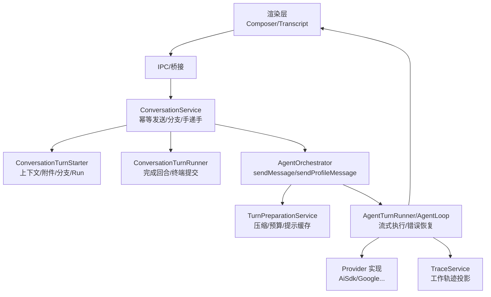
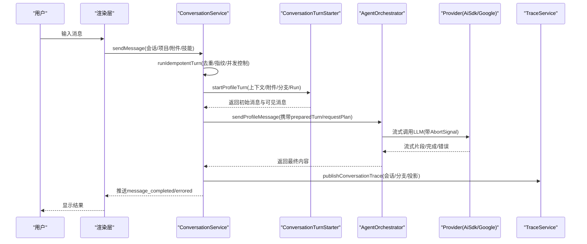
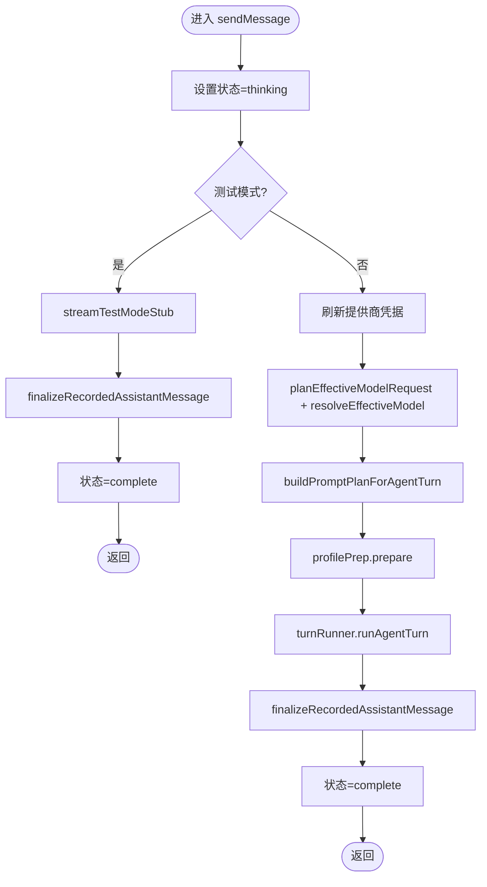
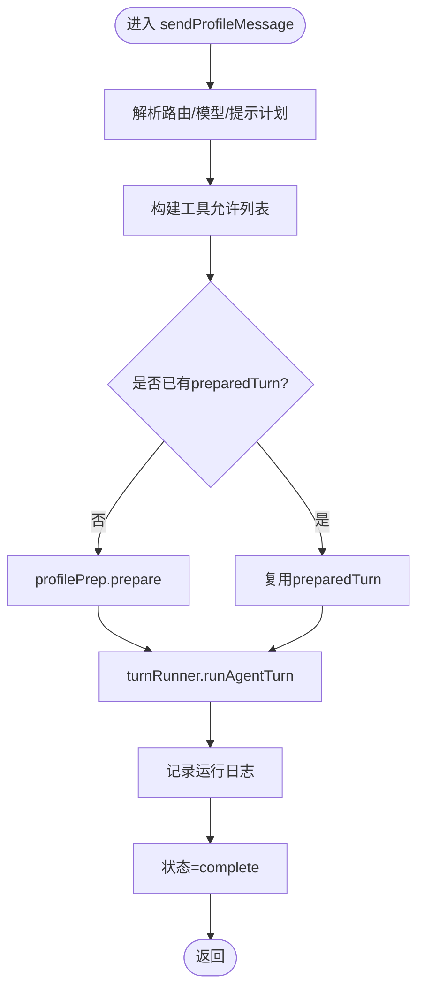
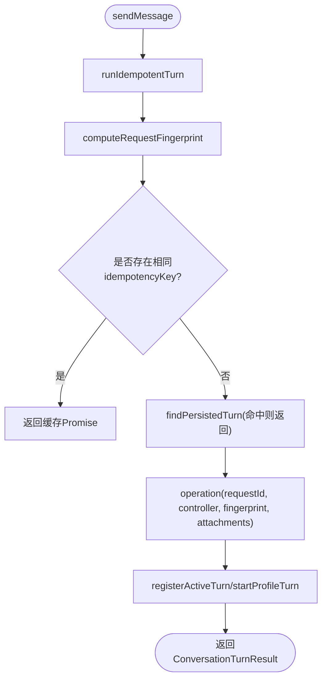
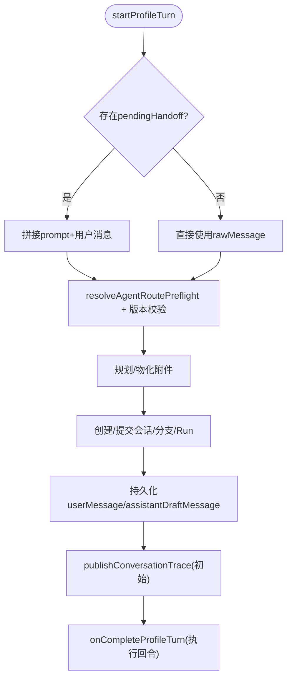
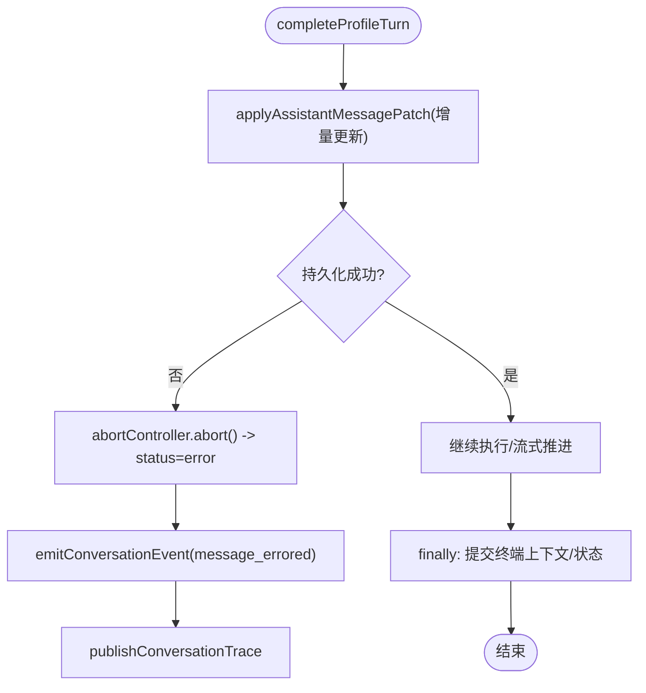
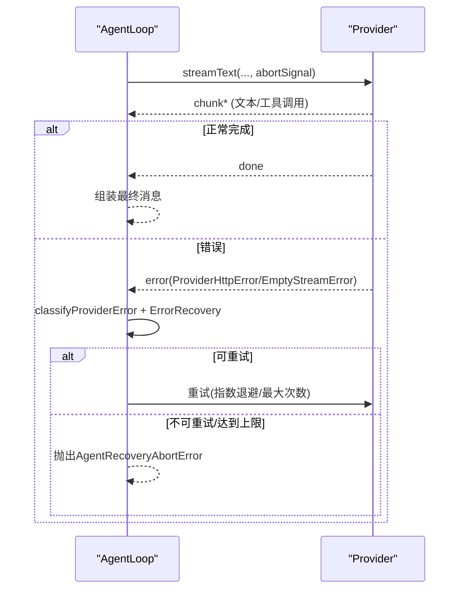
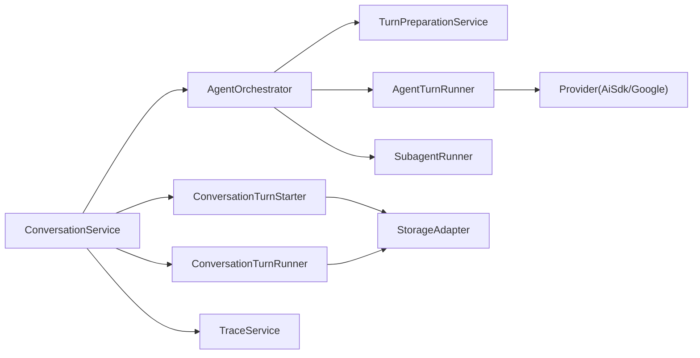

# 消息处理流程

<cite>
**本文引用的文件**
- [AgentOrchestrator.ts](file://src/main/workflow/debugger/AgentOrchestrator.ts)
- [ConversationService.ts](file://src/main/conversation/ConversationService.ts)
- [ConversationTurnStarter.ts](file://src/main/conversation/ConversationTurnStarter.ts)
- [ConversationTurnRunner.ts](file://src/main/conversation/ConversationTurnRunner.ts)
- [AgentLoop.ts](file://src/main/agent-runtime/agent/AgentLoop.ts)
- [AiSdkStreamingProvider.ts](file://src/main/agent-runtime/providers/AiSdkStreamingProvider.ts)
- [GoogleInteractionsProvider.ts](file://src/main/agent-runtime/providers/GoogleInteractionsProvider.ts)
- [TurnPreparationService.ts](file://src/main/workflow/debugger/TurnPreparationService.ts)
- [TraceService.ts](file://src/main/agent-trace/TraceService.ts)
- [conversationEventBatcher.ts](file://src/renderer/app/bootstrap/conversationEventBatcher.ts)
- [errorClassifier.ts](file://src/main/agent-runtime/providers/internal/errorClassifier.ts)
</cite>

## 目录
1. [简介](#简介)
2. [项目结构](#项目结构)
3. [核心组件](#核心组件)
4. [架构总览](#架构总览)
5. [详细组件分析](#详细组件分析)
6. [依赖关系分析](#依赖关系分析)
7. [性能考量](#性能考量)
8. [故障排查指南](#故障排查指南)
9. [结论](#结论)
10. [附录](#附录)

## 简介
本文件聚焦于 RDC-Agent 的消息处理流程，深入解析 AgentOrchestrator 中的 sendMessage 与 sendProfileMessage 方法实现，完整说明用户消息从接收、校验、路由到执行与响应的全链路。文档涵盖：
- 消息上下文构建与会话状态更新
- 错误处理机制（含重试、中止、幂等）
- 消息生命周期管理、异步处理模式与流式响应
- 队列与并发控制（会话级并发、请求去重、后台任务）
- 时序图展示从用户输入到最终响应的完整流程，包括异常与重试路径

## 项目结构
围绕消息处理的代码主要分布在以下模块：
- 编排层：AgentOrchestrator（对外入口，负责配置、凭证、提示计划、运行器协调）
- 对话服务层：ConversationService（幂等发送、分支、历史、手递手、后台延续）
- 回合启动与执行：ConversationTurnStarter（准备上下文、持久化、创建 Run）、ConversationTurnRunner（完成回合、终端提交、事件发布）
- 运行时循环与提供者：AgentLoop（LLM 调用、流转发、错误恢复）、各 Provider（流式输出、中止信号）
- 预处理与追踪：TurnPreparationService（压缩、预算、提示缓存）、TraceService（工作轨迹投影）
- 渲染侧批处理：conversationEventBatcher（UI 批量合并补丁，提升渲染性能）

**图表来源**
- [AgentOrchestrator.ts:195-366](file://src/main/workflow/debugger/AgentOrchestrator.ts#L195-L366)
- [ConversationService.ts:545-569](file://src/main/conversation/ConversationService.ts#L545-L569)
- [ConversationTurnStarter.ts:68-616](file://src/main/conversation/ConversationTurnStarter.ts#L68-L616)
- [ConversationTurnRunner.ts:124-710](file://src/main/conversation/ConversationTurnRunner.ts#L124-L710)
- [AgentLoop.ts:209-254](file://src/main/agent-runtime/agent/AgentLoop.ts#L209-L254)
- [AiSdkStreamingProvider.ts:51-95](file://src/main/agent-runtime/providers/AiSdkStreamingProvider.ts#L51-L95)
- [TurnPreparationService.ts:235-255](file://src/main/workflow/debugger/TurnPreparationService.ts#L235-L255)
- [TraceService.ts:279-310](file://src/main/agent-trace/TraceService.ts#L279-L310)

**章节来源**
- [AgentOrchestrator.ts:1-799](file://src/main/workflow/debugger/AgentOrchestrator.ts#L1-L799)
- [ConversationService.ts:1-800](file://src/main/conversation/ConversationService.ts#L1-L800)

## 核心组件
- AgentOrchestrator：对外暴露 sendMessage/sendProfileMessage，负责凭证刷新、模型规划、提示计划、工具允许列表、运行器调度、状态更新与日志。
- ConversationService：统一入口，提供幂等发送、分支切换、重写重发、手递手自动发送、后台延续、取消活跃回合等能力。
- ConversationTurnStarter：将用户消息与附件物化为可执行的回合上下文，创建会话/分支/Run，并持久化草稿消息。
- ConversationTurnRunner：驱动回合执行，维护助手草稿消息的增量更新、持久化、追踪发布与终端提交。
- AgentLoop/Provider：封装 LLM 调用与流式消费，支持中止信号、错误分类与重试策略。
- TurnPreparationService：在 worker 中做消息压缩、预算评估与提示缓存编译。
- TraceService：将对话消息与工作轨迹组装为投影，供右侧面板与审计使用。
- conversationEventBatcher：在渲染端对 message_patched 进行批量合并，减少频繁重绘。

**章节来源**
- [AgentOrchestrator.ts:75-145](file://src/main/workflow/debugger/AgentOrchestrator.ts#L75-L145)
- [ConversationService.ts:78-109](file://src/main/conversation/ConversationService.ts#L78-L109)
- [ConversationTurnStarter.ts:68-105](file://src/main/conversation/ConversationTurnStarter.ts#L68-L105)
- [ConversationTurnRunner.ts:124-144](file://src/main/conversation/ConversationTurnRunner.ts#L124-L144)
- [AgentLoop.ts:209-254](file://src/main/agent-runtime/agent/AgentLoop.ts#L209-L254)
- [TurnPreparationService.ts:235-255](file://src/main/workflow/debugger/TurnPreparationService.ts#L235-L255)
- [TraceService.ts:279-310](file://src/main/agent-trace/TraceService.ts#L279-L310)
- [conversationEventBatcher.ts:44-76](file://src/renderer/app/bootstrap/conversationEventBatcher.ts#L44-L76)

## 架构总览
下图展示了从用户输入到最终响应的端到端流程，包括幂等控制、上下文准备、流式执行、终端提交与追踪发布。

**图表来源**
- [ConversationService.ts:545-569](file://src/main/conversation/ConversationService.ts#L545-L569)
- [ConversationTurnStarter.ts:356-616](file://src/main/conversation/ConversationTurnStarter.ts#L356-L616)
- [AgentOrchestrator.ts:384-634](file://src/main/workflow/debugger/AgentOrchestrator.ts#L384-L634)
- [AiSdkStreamingProvider.ts:51-95](file://src/main/agent-runtime/providers/AiSdkStreamingProvider.ts#L51-L95)
- [TraceService.ts:279-310](file://src/main/agent-trace/TraceService.ts#L279-L310)

## 详细组件分析

### AgentOrchestrator.sendMessage
职责概述：
- 设置 Agent 状态为“思考”，尝试测试模式 stub 快速返回
- 刷新并冻结提供商凭据，避免并发竞争
- 计算有效模型与提示计划，构建 promptPlan
- 通过 ProfileTurnPreparation 准备 turn 上下文（包含工具允许列表、上下文窗口、压缩阈值等）
- 调用 AgentTurnRunner.runAgentTurn 执行流式生成
- 记录助手消息、更新状态、释放资源

关键要点：
- 凭证租约与临时作用域清理在 finally 中保证
- 若未找到有效 profile 或模型不可用，抛出明确错误码
- 测试模式下直接流式返回，便于调试

**图表来源**
- [AgentOrchestrator.ts:195-366](file://src/main/workflow/debugger/AgentOrchestrator.ts#L195-L366)

**章节来源**
- [AgentOrchestrator.ts:195-366](file://src/main/workflow/debugger/AgentOrchestrator.ts#L195-L366)

### AgentOrchestrator.sendProfileMessage
职责概述：
- 支持传入 preparedTurn/requestPlan/promptPlan，用于会话内复用与跨角色路由
- 根据 frozenDelegationCapsule 与 reasoningLevel 约束，确保一致性
- 构建 toolAllowlist（可选排除 RDC lease 工具），计算 contextWindow 与提示计划
- 调用 runAgentTurn 执行，并在完成后记录日志与状态
- 支持 onTerminalContext 回调，用于上层捕获终端上下文（如手递手、完成声明）

关键要点：
- 当存在 preparedTurn 时，跳过重复准备，降低开销
- 支持子代理会话隔离（sessionId 包含 ::subagent::）
- 失败时回滚租约与临时状态，保持系统一致性

**图表来源**
- [AgentOrchestrator.ts:384-634](file://src/main/workflow/debugger/AgentOrchestrator.ts#L384-L634)

**章节来源**
- [AgentOrchestrator.ts:384-634](file://src/main/workflow/debugger/AgentOrchestrator.ts#L384-L634)

### ConversationService 发送流程与幂等性
职责概述：
- sendMessage 通过 runIdempotentTurn 实现请求去重、并发控制与指纹校验
- 计算请求指纹（包含会话/项目/消息/附件哈希/技能/分支锚点/配置版本）
- 查找已持久化的回合，命中则直接返回，避免重复执行
- 注册活跃回合，支持取消、终止与后台延续

并发与队列：
- activeSendScopes：按 session/project 维度限制并行准备
- preparingRequests：跟踪每个 requestId 的准备阶段与控制器
- sendRequests：缓存 Promise，相同 idempotencyKey 的请求共享结果
- backgroundContinuations：会话空闲后自动继续后台任务

**图表来源**
- [ConversationService.ts:279-543](file://src/main/conversation/ConversationService.ts#L279-L543)
- [ConversationService.ts:545-569](file://src/main/conversation/ConversationService.ts#L545-L569)

**章节来源**
- [ConversationService.ts:279-543](file://src/main/conversation/ConversationService.ts#L279-L543)
- [ConversationService.ts:545-569](file://src/main/conversation/ConversationService.ts#L545-L569)

### ConversationTurnStarter 上下文构建与会话状态更新
职责概述：
- 解析 pendingHandoff（手递手）并拼接提示
- 验证 agent 定义、provider/catalog/route 版本一致性
- 规划附件存储与材料化，创建会话/分支/Run
- 持久化 userMessage、assistantDraftMessage 与 continuationNotice
- 发布初始 trace 投影，并将控制权交给 completeProfileTurn

关键点：
- 分支状态修复与写入，保证多分支场景一致性
- 若中途取消（cancelAfterCommit），仍会持久化 stopped 状态与最终 trace

**图表来源**
- [ConversationTurnStarter.ts:68-616](file://src/main/conversation/ConversationTurnStarter.ts#L68-L616)

**章节来源**
- [ConversationTurnStarter.ts:68-616](file://src/main/conversation/ConversationTurnStarter.ts#L68-L616)

### ConversationTurnRunner 完成回合与终端提交
职责概述：
- 维护 assistantDraftMessage 的增量更新（文本、状态、诊断）
- 持久化快照并发布 conversation event（message_patched/completed/errored）
- 发布工作轨迹（trace），控制发布频率以避免过载
- 在 finally 中提交终端上下文（会话上下文条目、分支归属、状态）

错误与中止：
- 若持久化失败，立即中止并标记 error，发布诊断信息
- 若被中止且尚未持久化，提交 stopped 状态

**图表来源**
- [ConversationTurnRunner.ts:174-232](file://src/main/conversation/ConversationTurnRunner.ts#L174-L232)
- [ConversationTurnRunner.ts:615-680](file://src/main/conversation/ConversationTurnRunner.ts#L615-L680)

**章节来源**
- [ConversationTurnRunner.ts:174-232](file://src/main/conversation/ConversationTurnRunner.ts#L174-L232)
- [ConversationTurnRunner.ts:615-680](file://src/main/conversation/ConversationTurnRunner.ts#L615-L680)

### 流式响应与错误恢复
- 流式执行：Provider 通过 streamText/fetch 建立 SSE 或流式连接，结合 AbortSignal 支持中断
- 错误分类：classifyProviderError 将未知错误标准化为 code/retryable/httpStatus，便于上层决策
- 重试策略：AgentLoop 集成 ErrorRecovery，针对 server_error/empty_stream 等类型进行有限次重试，超过上限后以 AgentRecoveryAbortError 终止

**图表来源**
- [AiSdkStreamingProvider.ts:51-95](file://src/main/agent-runtime/providers/AiSdkStreamingProvider.ts#L51-L95)
- [GoogleInteractionsProvider.ts:64-100](file://src/main/agent-runtime/providers/GoogleInteractionsProvider.ts#L64-L100)
- [AgentLoop.ts:572-601](file://src/main/agent-runtime/agent/AgentLoop.ts#L572-L601)
- [errorClassifier.ts:1-46](file://src/main/agent-runtime/providers/internal/errorClassifier.ts#L1-L46)

**章节来源**
- [AiSdkStreamingProvider.ts:51-95](file://src/main/agent-runtime/providers/AiSdkStreamingProvider.ts#L51-L95)
- [GoogleInteractionsProvider.ts:64-100](file://src/main/agent-runtime/providers/GoogleInteractionsProvider.ts#L64-L100)
- [AgentLoop.ts:572-601](file://src/main/agent-runtime/agent/AgentLoop.ts#L572-L601)
- [errorClassifier.ts:1-46](file://src/main/agent-runtime/providers/internal/errorClassifier.ts#L1-L46)

### 消息队列机制、优先级调度与并发控制
- 幂等队列：sendRequests 缓存 Promise，相同 idempotencyKey 的请求共享结果，避免重复执行
- 并发控制：activeSendScopes 限制同一会话/项目的准备并发；preparingRequests 跟踪每个请求的生命周期
- 后台任务：backgroundContinuations 在会话空闲时自动继续后台任务，避免阻塞主流程
- 优先级：当前实现未显式优先级队列，但通过会话/项目范围串行化与幂等键保障顺序与一致性
- 取消与中止：AbortController 贯穿准备与执行阶段，支持用户停止、编辑重发、分支切换等场景

**章节来源**
- [ConversationService.ts:78-109](file://src/main/conversation/ConversationService.ts#L78-L109)
- [ConversationService.ts:279-543](file://src/main/conversation/ConversationService.ts#L279-L543)

### 渲染端批处理与用户体验
- conversationEventBatcher 将 message_patched 事件批量合并，在 message_completed/errored 时 flush，减少 UI 重绘
- 与后端事件对齐，确保最终一致性与流畅体验

**章节来源**
- [conversationEventBatcher.ts:44-76](file://src/renderer/app/bootstrap/conversationEventBatcher.ts#L44-L76)

## 依赖关系分析
- AgentOrchestrator 依赖 TurnPreparationService、AgentTurnRunner、SubagentRunner、ToolExecutorFactory、settings/storage/provider 服务等
- ConversationService 依赖 StorageAdapter、TraceService、AgentOrchestrator、BackgroundContinuation、HandoffOps
- ConversationTurnStarter/Runner 依赖会话存储、分支解析、权限与交互服务、追踪服务
- Provider 实现依赖网络与流式协议，统一通过 AbortSignal 与错误分类协作

**图表来源**
- [AgentOrchestrator.ts:75-145](file://src/main/workflow/debugger/AgentOrchestrator.ts#L75-L145)
- [ConversationService.ts:78-109](file://src/main/conversation/ConversationService.ts#L78-L109)
- [ConversationTurnStarter.ts:68-105](file://src/main/conversation/ConversationTurnStarter.ts#L68-L105)
- [ConversationTurnRunner.ts:124-144](file://src/main/conversation/ConversationTurnRunner.ts#L124-L144)

**章节来源**
- [AgentOrchestrator.ts:75-145](file://src/main/workflow/debugger/AgentOrchestrator.ts#L75-L145)
- [ConversationService.ts:78-109](file://src/main/conversation/ConversationService.ts#L78-L109)

## 性能考量
- 上下文压缩：TurnPreparationService 在 worker 中压缩历史消息，控制 token 预算，减少首包延迟
- 提示缓存：compile prompt cache，避免重复计算固定部分
- 流式渲染：Provider 流式输出，配合渲染端批处理，提升响应速度
- 并发控制：会话/项目级别串行化准备，避免资源争用
- 追踪发布节流：ConversationTurnRunner 控制 trace 发布频率，降低 I/O 压力

[本节为通用指导，不直接分析具体文件]

## 故障排查指南
常见问题与定位建议：
- 模型不可用：检查 effectiveModel 与 provider catalog 版本一致性，确认 route 与 model 匹配
- 提供商不可用：检查 provider 表面加载与配置，确认密钥与网络可达
- 请求冲突：检查 requestId 与 fingerprint 是否一致，避免重复使用
- 会话繁忙：检查 activeTurns 与 activeSendScopes，确认无并发冲突
- 流式错误：查看 classifyProviderError 的分类结果，判断是否可重试
- 持久化失败：关注 message_errored 的诊断信息，必要时重启会话

**章节来源**
- [ConversationTurnStarter.ts:151-200](file://src/main/conversation/ConversationTurnStarter.ts#L151-L200)
- [ConversationTurnRunner.ts:174-232](file://src/main/conversation/ConversationTurnRunner.ts#L174-L232)
- [errorClassifier.ts:1-46](file://src/main/agent-runtime/providers/internal/errorClassifier.ts#L1-L46)

## 结论
本流程通过分层设计实现了高可靠的消息处理：
- AgentOrchestrator 提供统一的编排接口，屏蔽底层复杂性
- ConversationService 保证幂等、并发安全与可恢复性
- TurnStarter/Runner 负责上下文构建、持久化与终端提交
- Provider 与 AgentLoop 提供流式执行与错误恢复
- TraceService 与渲染批处理提升可观测性与用户体验

该架构在可扩展性、稳定性与性能之间取得平衡，适合复杂的多 Agent、多会话、多分支场景。

[本节为总结，不直接分析具体文件]

## 附录
- 术语
  - 回合（Turn）：一次完整的用户-助手交互过程
  - 分支（Branch）：同一用户消息下的多条变体路径
  - 手递手（Handoff）：会话间或角色间的任务转移
  - 幂等键（Idempotency Key）：基于请求指纹的唯一标识，用于去重

[本节为概念说明，不直接分析具体文件]