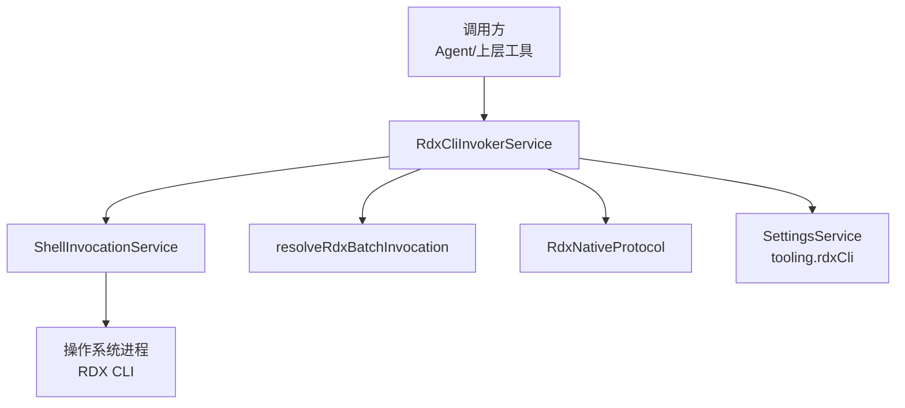
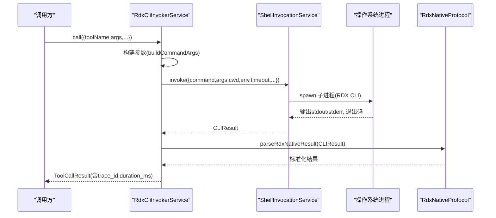

# CLI调用器服务

<cite>
**本文引用的文件**
- [RdxCliInvokerService.ts](file://src/main/tools/RdxCliInvokerService.ts)
- [ShellInvocationService.ts](file://src/main/tools/ShellInvocationService.ts)
- [RdxNativeProtocol.ts](file://src/main/tools/RdxNativeProtocol.ts)
- [resolveRdxBatchInvocation.ts](file://src/main/tools/resolveRdxBatchInvocation.ts)
- [settings.ts](file://src/shared/types/settings.ts)
- [RdxCliInvokerSettingsFields.tsx](file://src/renderer/features/settings/SettingsModal/sections/RdxCliInvokerSettingsFields.tsx)
- [spec-driven-development.md](file://docs/architecture/spec-driven-development.md)
- [RdxCliInvokerService.test.ts](file://src/main/tools/RdxCliInvokerService.test.ts)
</cite>

## 目录
1. [简介](#简介)
2. [项目结构](#项目结构)
3. [核心组件](#核心组件)
4. [架构总览](#架构总览)
5. [详细组件分析](#详细组件分析)
6. [依赖关系分析](#依赖关系分析)
7. [性能考量](#性能考量)
8. [故障排查指南](#故障排查指南)
9. [结论](#结论)
10. [附录：配置与调用示例](#附录配置与调用示例)

## 简介
本文件面向需要理解并正确使用 RDX CLI 调用器的开发者与运维人员，系统性解析 RdxCliInvokerService 的核心能力：工具目录加载、命令参数构建、执行流程管理、可用性检查、运行时元数据生成、错误处理策略、配置与环境变量处理、工作目录管理等。文档同时提供调用示例与最佳实践，帮助在 Agent 或上层工具链中安全、稳定地调用本地 RDX CLI。

## 项目结构
RdxCliInvokerService 位于主进程工具层，负责将上层工具调用请求转换为对本地 RDX CLI 的进程调用，并对结果进行标准化与追踪。其关键协作方包括：
- ShellInvocationService：封装子进程生命周期、超时、隔离与退出码归一化。
- resolveRdxBatchInvocation：在 Windows 平台下将 rdx.bat 调用替换为 PowerShell 启动脚本，以支持非交互模式等场景。
- RdxNativeProtocol：校验并解析 RDX CLI 返回的 JSON 信封，确保协议一致性。
- SettingsService：读取 tooling.rdxCli 配置项（启用开关、命令路径、前缀参数、工作目录、环境变量、超时、目录清单路径等）。



图表来源
- [RdxCliInvokerService.ts:42-221](file://src/main/tools/RdxCliInvokerService.ts#L42-L221)
- [ShellInvocationService.ts:29-105](file://src/main/tools/ShellInvocationService.ts#L29-L105)
- [resolveRdxBatchInvocation.ts:4-20](file://src/main/tools/resolveRdxBatchInvocation.ts#L4-L20)
- [RdxNativeProtocol.ts:12-34](file://src/main/tools/RdxNativeProtocol.ts#L12-L34)

章节来源
- [RdxCliInvokerService.ts:42-221](file://src/main/tools/RdxCliInvokerService.ts#L42-L221)
- [ShellInvocationService.ts:29-105](file://src/main/tools/ShellInvocationService.ts#L29-L105)
- [resolveRdxBatchInvocation.ts:4-20](file://src/main/tools/resolveRdxBatchInvocation.ts#L4-L20)
- [RdxNativeProtocol.ts:12-34](file://src/main/tools/RdxNativeProtocol.ts#L12-L34)

## 核心组件
- RdxCliInvokerService：对外暴露 loadCatalog、getRuntimeSummary、call、executeCLI、onInvocationTrace、abortRun、terminateAll 等方法；内部实现工具目录发现、参数构建、执行与结果标准化。
- ShellInvocationService：统一进程调度、超时控制、环境注入、孤儿进程检测与终止。
- resolveRdxBatchInvocation：Windows 平台下的批处理桥接，确保 rdx.bat 通过 PowerShell 以非交互方式运行。
- RdxNativeProtocol：强制要求 RDX CLI 返回标准 JSON 信封 {ok, result_kind, data}，并在上下文不匹配时抛出异常。

章节来源
- [RdxCliInvokerService.ts:42-366](file://src/main/tools/RdxCliInvokerService.ts#L42-L366)
- [ShellInvocationService.ts:29-127](file://src/main/tools/ShellInvocationService.ts#L29-L127)
- [resolveRdxBatchInvocation.ts:4-20](file://src/main/tools/resolveRdxBatchInvocation.ts#L4-L20)
- [RdxNativeProtocol.ts:12-34](file://src/main/tools/RdxNativeProtocol.ts#L12-L34)

## 架构总览
RdxCliInvokerService 作为“适配器+编排器”，屏蔽了底层进程调用的复杂性，向上提供统一的工具调用接口。其关键流程如下：
- 可用性检查：基于 settings.tooling.rdxCli.enabled 与 command 是否存在且可访问，快速失败。
- 目录清单加载：从 catalogPath 读取工具目录 JSON，缓存并按路径变更刷新。
- 参数构建：合并 argsPrefix、全局参数（如 --daemon-context）、具体命令与参数。
- 执行：委托 ShellInvocationService 启动进程，设置工作目录与环境变量，支持超时与中止信号。
- 结果解析：使用 RdxNativeProtocol 校验返回信封，并将 stdout JSON 映射为标准 ToolCallResult。
- 追踪：通过 onInvocationTrace 回调上报每次调用的 trace。



图表来源
- [RdxCliInvokerService.ts:248-355](file://src/main/tools/RdxCliInvokerService.ts#L248-L355)
- [ShellInvocationService.ts:32-105](file://src/main/tools/ShellInvocationService.ts#L32-L105)
- [RdxNativeProtocol.ts:12-34](file://src/main/tools/RdxNativeProtocol.ts#L12-L34)

## 详细组件分析

### 工具目录加载：loadCatalog()
- 行为
  - 若未配置 catalogPath，返回空目录清单并标记 source 为 unconfigured。
  - 若已存在相同路径的缓存目录清单，直接返回缓存。
  - 若 catalogPath 不存在，返回空目录清单并记录当前路径以避免重复 IO。
  - 否则读取 JSON 并附加 runtime 元信息（包含 schema_version、generated_at、tool_count 等）。
- 复杂度
  - 首次加载为 O(N) 解析 JSON；后续命中缓存为 O(1)。
- 优化点
  - 目录清单较大时可考虑增量更新或按需字段加载。
  - 可加入文件哈希校验避免无效重读。

章节来源
- [RdxCliInvokerService.ts:92-116](file://src/main/tools/RdxCliInvokerService.ts#L92-L116)

### 参数构建：buildCommandArgs()
- 行为
  - normalizeCliArgs：将 --context-id 规范化为 --daemon-context，保证与 RDX CLI 一致。
  - 分离全局参数与命令参数：--daemon-context 及其值被提升到全局段，其余参数跟随命令。
  - 最终顺序：argsPrefix + 全局参数 + 命令 + 命令参数。
- 设计要点
  - 允许用户通过 argsPrefix 注入通用开关（例如 --non-interactive --json）。
  - 保持上下文相关的全局参数不被误放入命令参数段。

章节来源
- [RdxCliInvokerService.ts:143-176](file://src/main/tools/RdxCliInvokerService.ts#L143-L176)

### 执行流程：executeCLI()
- 行为
  - 可用性检查失败则立即返回 exitCode=2 的诊断结果。
  - 通过 resolveRdxBatchInvocation 适配 Windows 平台的 rdx.bat 调用。
  - 合并工作目录：优先 options.cwd，其次 settings.workingDirectory。
  - 合并环境变量：先 settings.env，再覆盖 options.env。
  - 超时：优先 options.timeout，其次 settings.timeoutMs。
  - 委托 ShellInvocationService 执行并返回 CLIResult。
- 错误处理
  - 不可用：exitCode=2，stderr 携带诊断信息。
  - 进程级错误：由 ShellInvocationService 返回不同 reason（spawn_failed、timeout、unconfirmed_orphan）并映射为对应 exitCode。
  - 协议错误：RdxNativeProtocol 抛错，上层捕获后转为 EXECUTION_ERROR。

章节来源
- [RdxCliInvokerService.ts:178-221](file://src/main/tools/RdxCliInvokerService.ts#L178-L221)
- [ShellInvocationService.ts:32-105](file://src/main/tools/ShellInvocationService.ts#L32-L105)
- [resolveRdxBatchInvocation.ts:4-20](file://src/main/tools/resolveRdxBatchInvocation.ts#L4-L20)

### 工具调用入口：call()
- 行为
  - 自动注入 context_id、runtime_owner、owner_lease_id（若未显式提供）。
  - 将 args 序列化为 --args-json 传入。
  - 当存在 contextId 时追加 --daemon-context。
  - 调用 executeCLI('call', ...) 并解析结果。
  - 若 RDX CLI 返回 ok:false，构造 TOOL_ERROR 并上报 trace。
  - 若 stdout 为空或非预期格式，构造 CLI_ERROR。
  - 任何异常均捕获为 EXECUTION_ERROR。
- 追踪
  - 每次调用都会生成 trace_id 并通过 onInvocationTrace 通知监听者。

章节来源
- [RdxCliInvokerService.ts:248-355](file://src/main/tools/RdxCliInvokerService.ts#L248-L355)

### 运行时元数据与摘要
- createRuntimeMetadata：根据 settings 与目录清单生成 source、command、workingDirectory、version、catalog 等信息。
- getRuntimeSummary：汇总 namespace 维度工具数量、CLI 可用性与不可用原因，便于 UI 展示与诊断。

章节来源
- [RdxCliInvokerService.ts:53-90](file://src/main/tools/RdxCliInvokerService.ts#L53-L90)
- [RdxCliInvokerService.ts:118-141](file://src/main/tools/RdxCliInvokerService.ts#L118-L141)

### 工作目录与环境变量
- 工作目录优先级：options.cwd > settings.workingDirectory > 默认（undefined 表示继承父进程）。
- 环境变量合并：process.env 为基础，叠加 settings.env 与 options.env；ShellInvocationService 还会注入 PYTHONIOENCODING=utf-8。

章节来源
- [RdxCliInvokerService.ts:208-220](file://src/main/tools/RdxCliInvokerService.ts#L208-L220)
- [ShellInvocationService.ts:44-57](file://src/main/tools/ShellInvocationService.ts#L44-L57)

### 错误处理策略
- 配置不可用：exitCode=2，stderr 明确提示。
- 进程启动失败：exitCode=2，stderr 包含错误消息。
- 超时：exitCode=124，stderr 包含超时信息。
- 孤儿进程：exitCode=1，附带 processExitReason 标识。
- 协议不一致：抛出异常，上层捕获后转为 EXECUTION_ERROR。
- RDX CLI 业务错误：ok:false 映射为 TOOL_ERROR，保留 error 结构。

章节来源
- [ShellInvocationService.ts:67-97](file://src/main/tools/ShellInvocationService.ts#L67-L97)
- [RdxNativeProtocol.ts:12-34](file://src/main/tools/RdxNativeProtocol.ts#L12-L34)
- [RdxCliInvokerService.ts:290-355](file://src/main/tools/RdxCliInvokerService.ts#L290-L355)

## 依赖关系分析
- 低耦合：RdxCliInvokerService 仅依赖抽象化的 ShellInvocationService 与 SettingsService，便于测试与替换。
- 平台适配：resolveRdxBatchInvocation 仅在 Windows 且命令为 rdx.bat 时生效，其他平台无额外开销。
- 协议约束：RdxNativeProtocol 强制契约，确保上层无需关心 RDX CLI 的具体输出格式。

```mermaid
classDiagram
class RdxCliInvokerService {
+loadCatalog() Promise~ToolCatalog~
+getRuntimeSummary() Promise~ToolRuntimeSummary~
+call(request) Promise~ToolCallResult~
+executeCLI(command,args,options) Promise~CLIResult~
+onInvocationTrace(listener) () => void
+abortRun(runId) void
+terminateAll() void
}
class ShellInvocationService {
+invoke(request) Promise~CLIResult~
+abortRun(runId) void
+terminateAll() void
}
class RdxNativeProtocol {
+parseRdxNativeResult(result, expectedContext?) RdxNativeEnvelope
}
class resolveRdxBatchInvocation {
+resolveRdxBatchInvocation(command,args) {command,args}
}
RdxCliInvokerService --> ShellInvocationService : "委托执行"
RdxCliInvokerService --> RdxNativeProtocol : "解析结果"
RdxCliInvokerService --> resolveRdxBatchInvocation : "平台适配"
```

图表来源
- [RdxCliInvokerService.ts:42-366](file://src/main/tools/RdxCliInvokerService.ts#L42-L366)
- [ShellInvocationService.ts:29-127](file://src/main/tools/ShellInvocationService.ts#L29-L127)
- [RdxNativeProtocol.ts:12-34](file://src/main/tools/RdxNativeProtocol.ts#L12-L34)
- [resolveRdxBatchInvocation.ts:4-20](file://src/main/tools/resolveRdxBatchInvocation.ts#L4-L20)

章节来源
- [RdxCliInvokerService.ts:42-366](file://src/main/tools/RdxCliInvokerService.ts#L42-L366)
- [ShellInvocationService.ts:29-127](file://src/main/tools/ShellInvocationService.ts#L29-L127)
- [RdxNativeProtocol.ts:12-34](file://src/main/tools/RdxNativeProtocol.ts#L12-L34)
- [resolveRdxBatchInvocation.ts:4-20](file://src/main/tools/resolveRdxBatchInvocation.ts#L4-L20)

## 性能考量
- 目录清单缓存：同一 catalogPath 多次调用不会重复 IO。
- 进程复用：ShellInvocationService 维护活跃进程表，支持按 runId 中止与统一终止。
- 超时控制：避免长时间阻塞，建议合理设置 timeoutMs。
- 参数最小化：尽量精简 argsPrefix 与 args，减少序列化与传输成本。
- 日志与追踪：合理使用 onInvocationTrace 收集 trace，避免高频大对象上报。

[本节为通用指导，不直接分析具体文件]

## 故障排查指南
- 无法调用：检查 settings.tooling.rdxCli.enabled 与 command 是否配置正确；isAvailable 会返回 false 并提供 unavailableReason。
- 找不到命令：确认 command 指向可执行文件或脚本，且在 PATH 或绝对路径下存在。
- 超时：增大 timeoutMs 或优化外部 CLI 执行时间；关注 ShellInvocationService 的超时分支。
- 协议错误：确保 RDX CLI 返回标准 JSON 信封；查看 stderr 与 stdout 定位问题。
- 上下文不匹配：当期望 contextId 与实际响应不一致时会抛出异常，需检查 daemon 上下文绑定。
- 孤儿进程：出现 unconfirmed_orphan 时，检查系统资源清理与进程组隔离策略。

章节来源
- [RdxCliInvokerService.ts:70-90](file://src/main/tools/RdxCliInvokerService.ts#L70-L90)
- [ShellInvocationService.ts:67-97](file://src/main/tools/ShellInvocationService.ts#L67-L97)
- [RdxNativeProtocol.ts:12-34](file://src/main/tools/RdxNativeProtocol.ts#L12-L34)

## 结论
RdxCliInvokerService 提供了稳定、可观测、可配置的 RDX CLI 调用能力。通过清晰的参数构建、严格的协议校验、完善的错误处理与追踪机制，上层工具可以专注于业务逻辑，而无需关心进程管理与平台差异。建议在生产环境中：
- 明确配置 catalogPath 与 argsPrefix，确保工具清单与执行开关一致。
- 合理设置 workingDirectory 与 env，避免权限与环境差异导致的失败。
- 使用 onInvocationTrace 收集执行轨迹，结合超时与中止信号提升鲁棒性。

[本节为总结性内容，不直接分析具体文件]

## 附录：配置与调用示例

### 配置选项说明（tooling.rdxCli）
- enabled：是否启用 RDX CLI 调用器。
- command：RDX CLI 可执行文件或脚本路径。
- argsPrefix：每次调用前置的参数数组（例如 ["--non-interactive", "--json"]）。
- workingDirectory：执行工作目录。
- env：环境变量键值对，会与进程环境与 options.env 合并。
- timeoutMs：默认超时毫秒数。
- catalogPath：工具目录清单 JSON 路径。
- jsonMode：JSON 模式（auto/always），用于控制输出格式策略。

章节来源
- [settings.ts:294-303](file://src/shared/types/settings.ts#L294-L303)
- [spec-driven-development.md:15-30](file://docs/architecture/spec-driven-development.md#L15-L30)
- [RdxCliInvokerSettingsFields.tsx:112-167](file://src/renderer/features/settings/SettingsModal/sections/RdxCliInvokerSettingsFields.tsx#L112-L167)

### 典型调用流程
- 准备：在设置中配置 command、argsPrefix、workingDirectory、env、timeoutMs、catalogPath。
- 调用：调用 call({toolName, args, contextId, runId, abortSignal})。
- 解析：service 自动注入必要参数，执行并解析结果。
- 追踪：订阅 onInvocationTrace 获取 trace_id、duration_ms 与错误详情。

章节来源
- [RdxCliInvokerService.ts:248-355](file://src/main/tools/RdxCliInvokerService.ts#L248-L355)
- [RdxCliInvokerService.test.ts:24-47](file://src/main/tools/RdxCliInvokerService.test.ts#L24-L47)

### 最佳实践
- 始终设置合理的 timeoutMs，避免长时间阻塞。
- 使用 --daemon-context 传递上下文，确保 RDX CLI 与 daemon 会话一致。
- 将敏感信息放入 env，不要硬编码到 argsPrefix。
- 使用 catalogPath 管理工具清单，便于版本与权限治理。
- 利用 onInvocationTrace 收集执行轨迹，配合日志系统进行排障。

[本节为通用指导，不直接分析具体文件]