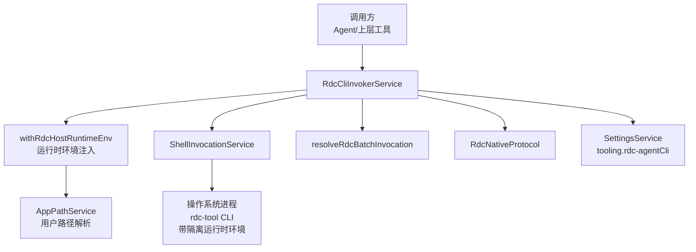
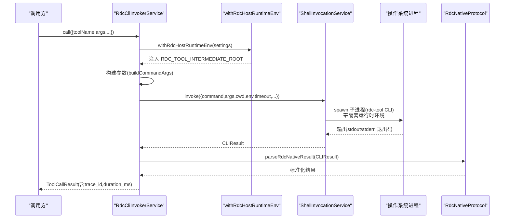

# CLI调用器服务

<cite>
**本文引用的文件**
- [RdcCliInvokerService.ts](file://src/main/tools/RdcCliInvokerService.ts)
- [ShellInvocationService.ts](file://src/main/tools/ShellInvocationService.ts)
- [RdcNativeProtocol.ts](file://src/main/tools/RdcNativeProtocol.ts)
- [resolveRdcBatchInvocation.ts](file://src/main/tools/resolveRdcBatchInvocation.ts)
- [withRdcHostRuntimeEnv.ts](file://src/main/tools/withRdcHostRuntimeEnv.ts)
- [AppPathService.ts](file://src/main/runtime/AppPathService.ts)
- [settings.ts](file://src/shared/types/settings.ts)
- [RdcCliInvokerSettingsFields.tsx](file://src/renderer/features/settings/SettingsModal/sections/RdcCliInvokerSettingsFields.tsx)
- [spec-driven-development.md](file://docs/architecture/spec-driven-development.md)
- [RdcCliInvokerService.test.ts](file://src/main/tools/RdcCliInvokerService.test.ts)
</cite>

## 更新摘要
**所做更改**
- 新增桌面运行时环境注入功能章节，详细说明 RDC_TOOL_INTERMEDIATE_ROOT 环境变量注入机制
- 更新 createRuntimeMetadata 方法说明，包含 intermediateRoot 字段
- 增强 executeCLI 方法的执行流程，添加运行时环境隔离说明
- 更新架构总览图，展示新的环境注入层
- 新增故障排查指南中的运行时路径相关问题

## 目录
1. [简介](#简介)
2. [项目结构](#项目结构)
3. [核心组件](#核心组件)
4. [架构总览](#架构总览)
5. [详细组件分析](#详细组件分析)
6. [依赖关系分析](#依赖关系分析)
7. [性能考量](#性能考量)
8. [故障排查指南](#故障排查指南)
9. [结论](#结论)
10. [附录：配置与调用示例](#附录配置与调用示例)

## 简介
本文件面向需要理解并正确使用 rdc-tool CLI 调用器的开发者与运维人员，系统性解析 RdcCliInvokerService 的核心能力：工具目录加载、命令参数构建、执行流程管理、可用性检查、运行时元数据生成、错误处理策略、配置与环境变量处理、工作目录管理等。**最新更新**：集成了新的桌面运行时环境注入功能，确保CLI调用尊重隔离的运行时路径，同时保持与现有配置的兼容性。文档同时提供调用示例与最佳实践，帮助在 Agent 或上层工具链中安全、稳定地调用本地 rdc-tool CLI。

## 项目结构
RdcCliInvokerService 位于主进程工具层，负责将上层工具调用请求转换为对本地 rdc-tool CLI 的进程调用，并对结果进行标准化与追踪。其关键协作方包括：
- ShellInvocationService：封装子进程生命周期、超时、隔离与退出码归一化。
- resolveRdcBatchInvocation：在 Windows 平台下检测 legacy rdx.bat 并返回拒绝诊断，不替换为 PowerShell 启动脚本。
- withRdcHostRuntimeEnv：**新增** 桌面运行时环境注入器，自动设置 RDC_TOOL_INTERMEDIATE_ROOT 环境变量以实现运行时隔离。
- AppPathService：提供用户级 RDC 路径解析，包括 rdcIntermediateRoot 等隔离路径。
- RdcNativeProtocol：校验并解析 rdc-tool CLI 返回的 JSON 信封，确保协议一致性。
- SettingsService：读取 tooling.rdc-agentCli 配置项（启用开关、命令路径、前缀参数、工作目录、环境变量、超时、目录清单路径等）。



**图表来源**
- [RdcCliInvokerService.ts:19-164](file://src/main/tools/RdcCliInvokerService.ts#L19-L164)
- [withRdcHostRuntimeEnv.ts:10-16](file://src/main/tools/withRdcHostRuntimeEnv.ts#L10-L16)
- [AppPathService.ts:108-123](file://src/main/runtime/AppPathService.ts#L108-L123)

**章节来源**
- [RdcCliInvokerService.ts:19-164](file://src/main/tools/RdcCliInvokerService.ts#L19-L164)
- [withRdcHostRuntimeEnv.ts:10-16](file://src/main/tools/withRdcHostRuntimeEnv.ts#L10-L16)
- [AppPathService.ts:108-123](file://src/main/runtime/AppPathService.ts#L108-L123)

## 核心组件
- RdcCliInvokerService：对外暴露 loadCatalog、getRuntimeSummary、call、executeCLI、onInvocationTrace、abortRun、terminateAll 等方法；内部实现工具目录发现、参数构建、执行与结果标准化，**新增** 集成桌面运行时环境注入。
- ShellInvocationService：统一进程调度、超时控制、环境注入、孤儿进程检测与终止。
- withRdcHostRuntimeEnv：**新增** 桌面运行时环境注入器，自动设置 RDC_TOOL_INTERMEDIATE_ROOT 环境变量到用户级隔离路径。
- AppPathService：提供用户级 RDC 路径解析，包括 rdcIntermediateRoot 等隔离路径。
- resolveRdcBatchInvocation：Windows 平台下的旧批处理拒绝规则，legacy rdx.bat 不通过 PowerShell 运行。
- RdcNativeProtocol：强制要求 rdc-tool CLI 返回标准 JSON 信封 {ok, result_kind, data}，并在上下文不匹配时抛出异常。

**章节来源**
- [RdcCliInvokerService.ts:21-334](file://src/main/tools/RdcCliInvokerService.ts#L21-L334)
- [withRdcHostRuntimeEnv.ts:10-16](file://src/main/tools/withRdcHostRuntimeEnv.ts#L10-L16)
- [AppPathService.ts:108-123](file://src/main/runtime/AppPathService.ts#L108-L123)

## 架构总览
RdcCliInvokerService 作为"适配器+编排器"，屏蔽了底层进程调用的复杂性，向上提供统一的工具调用接口。**更新**：现在集成了桌面运行时环境注入功能，确保每次 CLI 调用都使用隔离的用户级运行时路径。其关键流程如下：
- 可用性检查：基于 settings.tooling.rdc-agentCli.enabled 与 command 是否存在且可访问，快速失败。
- **运行时环境注入**：**新增** 通过 withRdcHostRuntimeEnv 自动设置 RDC_TOOL_INTERMEDIATE_ROOT 环境变量到用户级隔离路径。
- 目录清单加载：从 catalogPath 读取工具目录 JSON，缓存并按路径变更刷新。
- 参数构建：合并 argsPrefix、全局参数（如 --daemon-context）、具体命令与参数。
- 执行：委托 ShellInvocationService 启动进程，设置工作目录与环境变量，支持超时与中止信号。
- 结果解析：使用 RdcNativeProtocol 校验返回信封，并将 stdout JSON 映射为标准 ToolCallResult。
- 追踪：通过 onInvocationTrace 回调上报每次调用的 trace。



**图表来源**
- [RdcCliInvokerService.ts:161-190](file://src/main/tools/RdcCliInvokerService.ts#L161-L190)
- [withRdcHostRuntimeEnv.ts:10-16](file://src/main/tools/withRdcHostRuntimeEnv.ts#L10-L16)
- [ShellInvocationService.ts:32-105](file://src/main/tools/ShellInvocationService.ts#L32-L105)

## 详细组件分析

### 桌面运行时环境注入：withRdcHostRuntimeEnv()
**新增功能** - 桌面运行时环境注入器
- 行为
  - 检查当前设置的 env 中是否已存在 RDC_TOOL_INTERMEDIATE_ROOT 环境变量。
  - 如果不存在或为空，则从 AppPathService 获取用户级隔离路径并注入。
  - 返回新的 settings 对象，包含注入的环境变量。
- 隔离路径
  - 默认路径：~/.rdc-agent/rdc-intermediate（可通过 RDC_AGENT_HOME 环境变量覆盖）
  - 每个用户拥有独立的隔离运行时空间，避免不同用户间的冲突。
- 设计要点
  - 支持显式覆盖：如果用户在 Settings 中明确设置了 RDC_TOOL_INTERMEDIATE_ROOT，则优先使用用户配置。
  - 不可变性：不会修改原始 settings 对象，而是返回新的副本。

**章节来源**
- [withRdcHostRuntimeEnv.ts:10-16](file://src/main/tools/withRdcHostRuntimeEnv.ts#L10-L16)
- [AppPathService.ts:78-123](file://src/main/runtime/AppPathService.ts#L78-L123)

### 运行时元数据增强：createRuntimeMetadata()
**更新** - 新增 intermediateRoot 字段
- 行为
  - 调用 withRdcHostRuntimeEnv 获取注入后的 settings。
  - 提取 RDC_TOOL_INTERMEDIATE_ROOT 环境变量值作为 intermediateRoot。
  - 包含 source、command、workingDirectory、version、catalog 等原有字段。
- 用途
  - 为 UI 和诊断系统提供运行时环境的完整信息。
  - 便于追踪和调试运行时路径问题。

**章节来源**
- [RdcCliInvokerService.ts:33-49](file://src/main/tools/RdcCliInvokerService.ts#L33-L49)

### 工具目录加载：loadCatalog()
- 行为
  - 若未配置 catalogPath，返回空目录清单并标记 source 为 unconfigured。
  - 若已存在相同路径的缓存目录清单，直接返回缓存。
  - 若 catalogPath 不存在，返回空目录清单并记录当前路径以避免重复 IO。
  - 否则读取 JSON 并附加 runtime 元信息（包含 schema_version、generated_at、tool_count 等）。
- 复杂度
  - 首次加载为 O(N) 解析 JSON；后续命中缓存为 O(1)。
- 优化点
  - 目录清单较大时可考虑增量更新或按需字段加载。
  - 可加入文件哈希校验避免无效重读。

**章节来源**
- [RdcCliInvokerService.ts:74-102](file://src/main/tools/RdcCliInvokerService.ts#L74-L102)

### 参数构建：buildCommandArgs()
- 行为
  - normalizeCliArgs：将 --context-id 规范化为 --daemon-context，保证与 rdc-tool CLI 一致。
  - 分离全局参数与命令参数：--daemon-context 及其值被提升到全局段，其余参数跟随命令。
  - 最终顺序：argsPrefix + 全局参数 + 命令 + 命令参数。
- 设计要点
  - 允许用户通过 argsPrefix 注入通用开关（例如 --non-interactive --json）。
  - 保持上下文相关的全局参数不被误放入命令参数段。

**章节来源**
- [RdcCliInvokerService.ts:121-144](file://src/main/tools/RdcCliInvokerService.ts#L121-L144)

### 执行流程：executeCLI()
**更新** - 集成运行时环境注入
- 行为
  - **新增** 调用 withRdcHostRuntimeEnv 注入 RDC_TOOL_INTERMEDIATE_ROOT 环境变量。
  - 可用性检查失败则立即返回 exitCode=2 的诊断结果。
  - 通过 resolveRdcBatchInvocation 拒绝 Windows 平台的 legacy rdx.bat 调用。
  - 合并工作目录：优先 options.cwd，其次 settings.workingDirectory。
  - 合并环境变量：先 settings.env，再覆盖 options.env。
  - 超时：优先 options.timeout，其次 settings.timeoutMs。
  - 委托 ShellInvocationService 执行并返回 CLIResult。
- 错误处理
  - 不可用：exitCode=2，stderr 携带诊断信息。
  - 进程级错误：由 ShellInvocationService 返回不同 reason（spawn_failed、timeout、unconfirmed_orphan）并映射为对应 exitCode。
  - 协议错误：RdcNativeProtocol 抛错，上层捕获后转为 EXECUTION_ERROR。

**章节来源**
- [RdcCliInvokerService.ts:146-191](file://src/main/tools/RdcCliInvokerService.ts#L146-L191)
- [withRdcHostRuntimeEnv.ts:10-16](file://src/main/tools/withRdcHostRuntimeEnv.ts#L10-L16)

### 工具调用入口：call()
- 行为
  - 自动注入 context_id、runtime_owner、owner_lease_id（若未显式提供）。
  - 将 args 序列化为 --args-json 传入。
  - 当存在 contextId 时追加 --daemon-context。
  - 调用 executeCLI('call', ...) 并解析结果。
  - 若 rdc-tool CLI 返回 ok:false，构造 TOOL_ERROR 并上报 trace。
  - 若 stdout 为空或非预期格式，构造 CLI_ERROR。
  - 任何异常均捕获为 EXECUTION_ERROR。
- 追踪
  - 每次调用都会生成 trace_id 并通过 onInvocationTrace 通知监听者。

**章节来源**
- [RdcCliInvokerService.ts:218-325](file://src/main/tools/RdcCliInvokerService.ts#L218-L325)

### 运行时元数据与摘要
- createRuntimeMetadata：**更新** 包含 intermediateRoot 字段，显示隔离运行时路径。
- getRuntimeSummary：汇总 namespace 维度工具数量、CLI 可用性与不可用原因，便于 UI 展示与诊断。

**章节来源**
- [RdcCliInvokerService.ts:33-49](file://src/main/tools/RdcCliInvokerService.ts#L33-L49)
- [RdcCliInvokerService.ts:104-119](file://src/main/tools/RdcCliInvokerService.ts#L104-L119)

### 工作目录与环境变量
- 工作目录优先级：options.cwd > settings.workingDirectory > 默认（undefined 表示继承父进程）。
- 环境变量合并：**更新** 首先通过 withRdcHostRuntimeEnv 注入 RDC_TOOL_INTERMEDIATE_ROOT，然后叠加 settings.env 与 options.env；ShellInvocationService 还会注入 PYTHONIOENCODING=utf-8。

**章节来源**
- [RdcCliInvokerService.ts:161-184](file://src/main/tools/RdcCliInvokerService.ts#L161-L184)
- [withRdcHostRuntimeEnv.ts:10-16](file://src/main/tools/withRdcHostRuntimeEnv.ts#L10-L16)
- [ShellInvocationService.ts:44-57](file://src/main/tools/ShellInvocationService.ts#L44-L57)

### 错误处理策略
- 配置不可用：exitCode=2，stderr 明确提示。
- 进程启动失败：exitCode=2，stderr 包含错误消息。
- 超时：exitCode=124，stderr 包含超时信息。
- 孤儿进程：exitCode=1，附带 processExitReason 标识。
- 协议不一致：抛出异常，上层捕获后转为 EXECUTION_ERROR。
- rdc-tool CLI 业务错误：ok:false 映射为 TOOL_ERROR，保留 error 结构。

**章节来源**
- [ShellInvocationService.ts:67-97](file://src/main/tools/ShellInvocationService.ts#L67-L97)
- [RdcNativeProtocol.ts:12-34](file://src/main/tools/RdcNativeProtocol.ts#L12-L34)
- [RdcCliInvokerService.ts:290-325](file://src/main/tools/RdcCliInvokerService.ts#L290-L325)

## 依赖关系分析
- 低耦合：RdcCliInvokerService 仅依赖抽象化的 ShellInvocationService 与 SettingsService，便于测试与替换。
- 平台适配：resolveRdcBatchInvocation 在 Windows 上仅拒绝 legacy rdx.bat，其他平台无额外开销。
- 协议约束：RdcNativeProtocol 强制契约，确保上层无需关心 rdc-tool CLI 的具体输出格式。
- **新增依赖**：withRdcHostRuntimeEnv 提供桌面运行时环境注入，依赖 AppPathService 解析用户级路径。

```mermaid
classDiagram
class RdcCliInvokerService {
+loadCatalog() Promise~ToolCatalog~
+getRuntimeSummary() Promise~ToolRuntimeSummary~
+call(request) Promise~ToolCallResult~
+executeCLI(command,args,options) Promise~CLIResult~
+onInvocationTrace(listener) () => void
+abortRun(runId) void
+terminateAll() void
}
class withRdcHostRuntimeEnv {
+withRdcHostRuntimeEnv(settings) RdcCliInvokerSettings
+hostRdcIntermediateRoot() string
}
class AppPathService {
+getUserRdcPaths() UserRdcPaths
+getRdcIntermediateRoot() string
}
class ShellInvocationService {
+invoke(request) Promise~CLIResult~
+abortRun(runId) void
+terminateAll() void
}
class RdcNativeProtocol {
+parseRdcNativeResult(result, expectedContext?) RdcNativeEnvelope
}
class resolveRdcBatchInvocation {
+resolveRdcBatchInvocation(command,args) {command,args}
}
RdcCliInvokerService --> withRdcHostRuntimeEnv : "注入运行时环境"
RdcCliInvokerService --> AppPathService : "解析用户路径"
RdcCliInvokerService --> ShellInvocationService : "委托执行"
RdcCliInvokerService --> RdcNativeProtocol : "解析结果"
RdcCliInvokerService --> resolveRdcBatchInvocation : "平台适配"
```

**图表来源**
- [RdcCliInvokerService.ts:21-334](file://src/main/tools/RdcCliInvokerService.ts#L21-L334)
- [withRdcHostRuntimeEnv.ts:10-16](file://src/main/tools/withRdcHostRuntimeEnv.ts#L10-L16)
- [AppPathService.ts:108-123](file://src/main/runtime/AppPathService.ts#L108-L123)

**章节来源**
- [RdcCliInvokerService.ts:21-334](file://src/main/tools/RdcCliInvokerService.ts#L21-L334)
- [withRdcHostRuntimeEnv.ts:10-16](file://src/main/tools/withRdcHostRuntimeEnv.ts#L10-L16)
- [AppPathService.ts:108-123](file://src/main/runtime/AppPathService.ts#L108-L123)

## 性能考量
- 目录清单缓存：同一 catalogPath 多次调用不会重复 IO。
- 进程复用：ShellInvocationService 维护活跃进程表，支持按 runId 中止与统一终止。
- 超时控制：避免长时间阻塞，建议合理设置 timeoutMs。
- 参数最小化：尽量精简 argsPrefix 与 args，减少序列化与传输成本。
- 日志与追踪：合理使用 onInvocationTrace 收集 trace，避免高频大对象上报。
- **新增优化**：运行时环境注入是轻量级操作，仅涉及环境变量设置，性能影响可忽略。

## 故障排查指南
- 无法调用：检查 settings.tooling.rdc-agentCli.enabled 与 command 是否配置正确；isAvailable 会返回 false 并提供 unavailableReason。
- 找不到命令：确认 command 指向可执行文件或脚本，且在 PATH 或绝对路径下存在。
- 超时：增大 timeoutMs 或优化外部 CLI 执行时间；关注 ShellInvocationService 的超时分支。
- 协议错误：确保 rdc-tool CLI 返回标准 JSON 信封；查看 stderr 与 stdout 定位问题。
- 上下文不匹配：当期望 contextId 与实际响应不一致时会抛出异常，需检查 daemon 上下文绑定。
- 孤儿进程：出现 unconfirmed_orphan 时，检查系统资源清理与进程组隔离策略。
- **新增**：运行时路径问题 - 检查 RDC_TOOL_INTERMEDIATE_ROOT 环境变量是否正确设置到用户级隔离路径；确认 ~./rdc_tool/rdc-intermediate 目录存在且有适当权限。

**章节来源**
- [RdcCliInvokerService.ts:51-67](file://src/main/tools/RdcCliInvokerService.ts#L51-L67)
- [ShellInvocationService.ts:67-97](file://src/main/tools/ShellInvocationService.ts#L67-L97)
- [RdcNativeProtocol.ts:12-34](file://src/main/tools/RdcNativeProtocol.ts#L12-L34)
- [withRdcHostRuntimeEnv.ts:10-16](file://src/main/tools/withRdcHostRuntimeEnv.ts#L10-L16)

## 结论
RdcCliInvokerService 提供了稳定、可观测、可配置的 rdc-tool CLI 调用能力。**最新更新**：通过集成桌面运行时环境注入功能，确保了每次 CLI 调用都使用隔离的用户级运行时路径，增强了多用户环境下的安全性和稳定性。通过清晰的参数构建、严格的协议校验、完善的错误处理与追踪机制，上层工具可以专注于业务逻辑，而无需关心进程管理与平台差异。建议在生产环境中：
- 明确配置 catalogPath 与 argsPrefix，确保工具清单与执行开关一致。
- 合理设置 workingDirectory 与 env，避免权限与环境差异导致的失败。
- 利用 onInvocationTrace 收集执行轨迹，配合超时与中止信号提升鲁棒性。
- **新增**：信任默认的 RDC_TOOL_INTERMEDIATE_ROOT 注入机制，或在特殊需求时显式覆盖该环境变量。

## 附录：配置与调用示例

### 配置选项说明（tooling.rdc-agentCli）
- enabled：是否启用 rdc-tool CLI 调用器。
- command：rdc-tool CLI 可执行文件或脚本路径。
- argsPrefix：每次调用前置的参数数组（例如 ["--non-interactive", "--json"]）。
- workingDirectory：执行工作目录。
- env：环境变量键值对，会与进程环境与 options.env 合并。**新增**：可显式设置 RDC_TOOL_INTERMEDIATE_ROOT 覆盖默认的用户级隔离路径。
- timeoutMs：默认超时毫秒数。
- catalogPath：工具目录清单 JSON 路径。
- jsonMode：JSON 模式（auto/always），用于控制输出格式策略。

**章节来源**
- [settings.ts:294-303](file://src/shared/types/settings.ts#L294-L303)
- [spec-driven-development.md:15-30](file://docs/architecture/spec-driven-development.md#L15-L30)
- [RdcCliInvokerSettingsFields.tsx:112-167](file://src/renderer/features/settings/SettingsModal/sections/RdcCliInvokerSettingsFields.tsx#L112-L167)

### 典型调用流程
- 准备：在设置中配置 command、argsPrefix、workingDirectory、env、timeoutMs、catalogPath。
- **新增**：运行时环境自动注入 - 每次调用时自动设置 RDC_TOOL_INTERMEDIATE_ROOT 到用户级隔离路径。
- 调用：调用 call({toolName, args, contextId, runId, abortSignal})。
- 解析：service 自动注入必要参数，执行并解析结果。
- 追踪：订阅 onInvocationTrace 获取 trace_id、duration_ms 与错误详情。

**章节来源**
- [RdcCliInvokerService.ts:218-325](file://src/main/tools/RdcCliInvokerService.ts#L218-L325)
- [RdcCliInvokerService.test.ts:122-127](file://src/main/tools/RdcCliInvokerService.test.ts#L122-L127)

### 最佳实践
- 始终设置合理的 timeoutMs，避免长时间阻塞。
- 使用 --daemon-context 传递上下文，确保 rdc-tool CLI 与 daemon 会话一致。
- 将敏感信息放入 env，不要硬编码到 argsPrefix。
- 使用 catalogPath 管理工具清单，便于版本与权限治理。
- 利用 onInvocationTrace 收集执行轨迹，配合日志系统进行排障。
- **新增**：信任默认的运行时环境注入机制，仅在特殊需求时显式覆盖 RDC_TOOL_INTERMEDIATE_ROOT。
- **新增**：在多用户环境中，确保每个用户都有独立的 ~./rdc_tool/rdc-intermediate 目录权限。