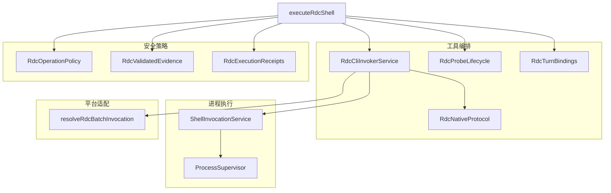
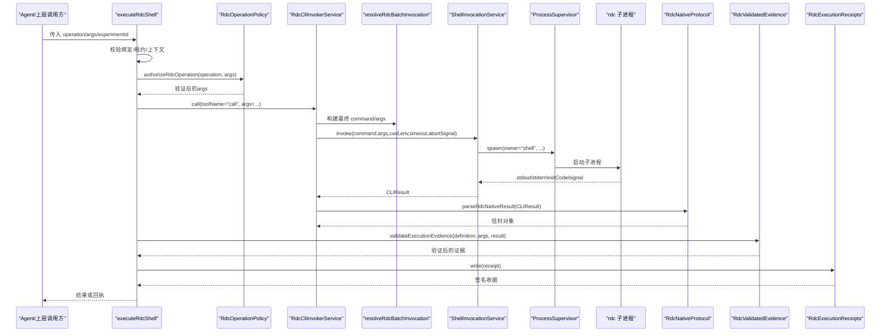
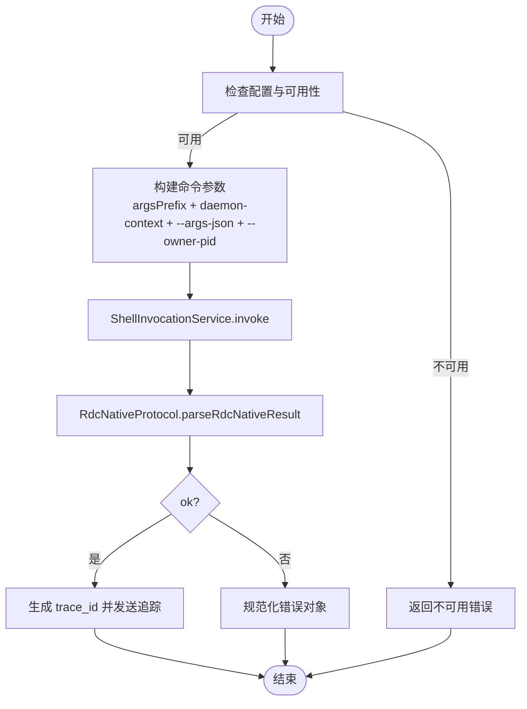
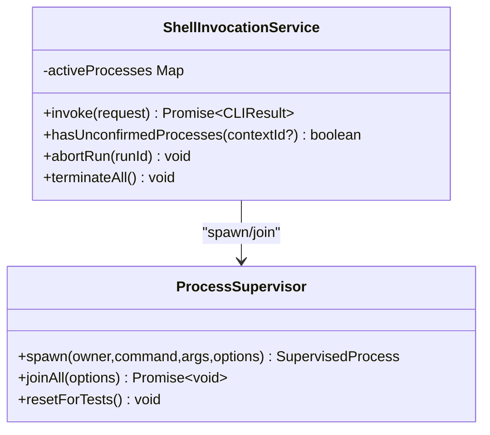
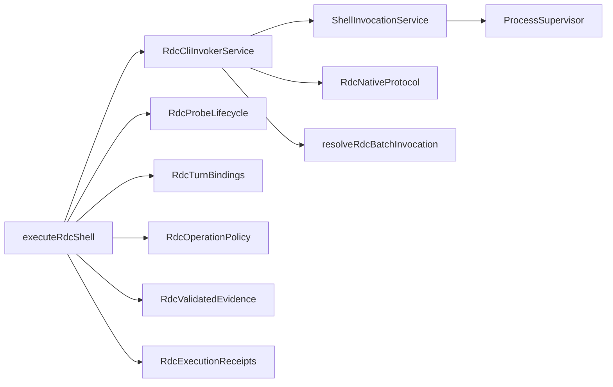
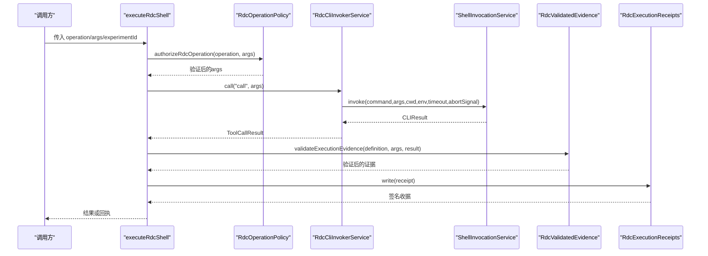

# CLI调用器设计

<cite>
**本文引用的文件**
- [RdcCliInvokerService.ts](file://src/main/tools/RdcCliInvokerService.ts)
- [ShellInvocationService.ts](file://src/main/tools/ShellInvocationService.ts)
- [RdcNativeProtocol.ts](file://src/main/tools/RdcNativeProtocol.ts)
- [RdcProbeLifecycle.ts](file://src/main/tools/RdcProbeLifecycle.ts)
- [executeRdcShell.ts](file://src/main/tools/executeRdcShell.ts)
- [RdcTurnBindings.ts](file://src/main/tools/RdcTurnBindings.ts)
- [RdcOperationPolicy.ts](file://src/main/tools/RdcOperationPolicy.ts)
- [RdcValidatedEvidence.ts](file://src/main/tools/RdcValidatedEvidence.ts)
- [RdcExecutionReceipts.ts](file://src/main/tools/RdcExecutionReceipts.ts)
- [ProcessSupervisor.ts](file://src/main/runtime/ProcessSupervisor.ts)
- [resolveRdcBatchInvocation.ts](file://src/main/tools/resolveRdcBatchInvocation.ts)
</cite>

## 更新摘要
**所做更改**
- 完成 RDX 到 RDC 品牌重命名，所有组件和服务名称已更新为 RDC 标识
- 新增安全绑定验证机制 assertRdcCliBinding，确保 CLI 工具的安全绑定
- 增强所有者上下文支持，通过 --owner-pid 注入实现进程所有权追踪
- 更新原生协议处理以适配 RDC 原生协议规范
- 改进操作目录验证和能力检查机制
- 强化执行收据和签名证据支持系统

## 目录
1. [简介](#简介)
2. [项目结构](#项目结构)
3. [核心组件](#核心组件)
4. [架构总览](#架构总览)
5. [详细组件分析](#详细组件分析)
6. [依赖关系分析](#依赖关系分析)
7. [性能与资源限制](#性能与资源限制)
8. [故障排查指南](#故障排查指南)
9. [结论](#结论)
10. [附录：协议规范与调用流程](#附录协议规范与调用流程)

## 简介
本文件面向"CLI调用器"的设计与实现，聚焦以下目标：
- 解析 RdcCliInvokerService 的外部工具集成机制（配置、参数构建、执行、结果解析）
- 解析 ShellInvocationService 的 shell 执行引擎（进程生命周期、超时、隔离、异常处理）
- 明确 RdcNativeProtocol 的原生协议定义与校验
- 说明 RdcProbeLifecycle 的生命周期管理（打开/关闭捕获上下文）
- 解释进程间通信、命令参数构建、结果解析处理
- 描述安全沙箱机制、权限控制、资源限制实现
- 包含超时处理、错误重试、日志收集功能
- 提供调用流程图和协议规范，展示从工具调用到结果返回的完整交互过程

**更新** 现在集成了增强的操作目录验证、能力检查和执行收据签名支持，提供更安全的原生工具执行环境。

## 项目结构
围绕 CLI 调用器的关键代码位于 src/main/tools 与 src/main/runtime：
- 工具编排与协议层：RdcCliInvokerService、RdcNativeProtocol、RdcProbeLifecycle、RdcTurnBindings
- 进程执行层：ShellInvocationService、ProcessSupervisor
- 安全策略层：RdcOperationPolicy、RdcValidatedEvidence、RdcExecutionReceipts
- 平台适配：resolveRdcBatchInvocation（Windows rdx.bat 启动桥接）
- 上层入口：executeRdcShell（将 Agent 工具调用映射为原生 rdc 操作）

**图表来源**
- [RdcCliInvokerService.ts:22-370](file://src/main/tools/RdcCliInvokerService.ts#L22-L370)
- [ShellInvocationService.ts:30-129](file://src/main/tools/ShellInvocationService.ts#L30-L129)
- [RdcNativeProtocol.ts:3-43](file://src/main/tools/RdcNativeProtocol.ts#L3-L43)
- [RdcProbeLifecycle.ts:7-42](file://src/main/tools/RdcProbeLifecycle.ts#L7-L42)
- [RdcOperationPolicy.ts:49-104](file://src/main/tools/RdcOperationPolicy.ts#L49-L104)
- [executeRdcShell.ts:23-129](file://src/main/tools/executeRdcShell.ts#L23-L129)

## 核心组件
- **RdcCliInvokerService**：负责读取设置、加载工具目录、构建命令行参数、调用 ShellInvocationService、解析原生协议并产出统一 ToolCallResult。支持 trace 监听、取消信号、超时、工作目录与环境变量注入。
- **ShellInvocationService**：封装子进程执行，基于 ProcessSupervisor 管理进程树、超时、孤儿进程检测、退出码归一化、stdout/stderr 环形缓冲。
- **RdcNativeProtocol**：定义并校验原生 rdc 输出信封（ok、result_kind、data），确保上下文一致性，拒绝二进制 stdout。
- **RdcProbeLifecycle**：复用产品捕获生命周期，严格校验 capture 注册、会话所有权、设备选择与上下文分配，避免任意 context id 租约。
- **RdcOperationPolicy**：提供操作授权和参数验证，包括文件系统路径验证、虚拟路径检查、编译器标志白名单等安全约束。
- **RdcValidatedEvidence**：验证执行证据，支持测量、干预和回滚三种证据类型，确保实验场景的可信性。
- **RdcExecutionReceipts**：生成和验证签名的执行收据，提供完整的审计追踪能力。
- **resolveRdcBatchInvocation**：在 Windows 上把 rdx.bat 调用桥接到 PowerShell 脚本，附加非交互等标志。
- **ProcessSupervisor**：统一的子进程注册表，支持进程组隔离、SIGTERM/SIGKILL 优雅终止、超时强制终止、孤儿进程标记、环形缓冲区限流。
- **executeRdcShell**：Agent 工具到原生 rdc 操作的入口，校验绑定与租约、串行执行、写入签名回执（实验场景）。

**章节来源**
- [RdcCliInvokerService.ts:22-370](file://src/main/tools/RdcCliInvokerService.ts#L22-L370)
- [ShellInvocationService.ts:30-129](file://src/main/tools/ShellInvocationService.ts#L30-L129)
- [RdcNativeProtocol.ts:3-43](file://src/main/tools/RdcNativeProtocol.ts#L3-L43)
- [RdcProbeLifecycle.ts:7-42](file://src/main/tools/RdcProbeLifecycle.ts#L7-L42)
- [RdcOperationPolicy.ts:49-104](file://src/main/tools/RdcOperationPolicy.ts#L49-L104)
- [RdcValidatedEvidence.ts:21-86](file://src/main/tools/RdcValidatedEvidence.ts#L21-L86)
- [RdcExecutionReceipts.ts:42-76](file://src/main/tools/RdcExecutionReceipts.ts#L42-L76)
- [resolveRdcBatchInvocation.ts:4-20](file://src/main/tools/resolveRdcBatchInvocation.ts#L4-L20)
- [ProcessSupervisor.ts:167-425](file://src/main/runtime/ProcessSupervisor.ts#L167-L425)
- [executeRdcShell.ts:23-129](file://src/main/tools/executeRdcShell.ts#L23-L129)

## 架构总览
整体调用链路如下：
- Agent 通过 executeRdcShell 发起原生 rdc 操作，校验绑定与租约后，交由 RdcCliInvokerService 构建参数并执行。
- 参数构建阶段会合并全局 argsPrefix、daemon-context、--args-json 等；Windows 下可能经 resolveRdcBatchInvocation 转为 powershell 调用 rdx_bat_launcher.ps1。
- ShellInvocationService 使用 ProcessSupervisor.spawn 启动子进程，设置工作目录、环境变量、超时、隔离进程组等。
- 子进程完成后，RdcNativeProtocol 校验信封格式与上下文一致性；RdcCliInvokerService 将其转换为 ToolCallResult，并触发 trace。
- 对于实验场景，RdcExecutionReceipts 生成签名的执行收据，RdcValidatedEvidence 验证证据的有效性。

**更新** 现在在执行前通过 RdcOperationPolicy 进行严格的目录验证和能力检查，确保只有授权的操作才能执行。

**图表来源**
- [executeRdcShell.ts:23-129](file://src/main/tools/executeRdcShell.ts#L23-L129)
- [RdcOperationPolicy.ts:49-104](file://src/main/tools/RdcOperationPolicy.ts#L49-L104)
- [RdcCliInvokerService.ts:251-358](file://src/main/tools/RdcCliInvokerService.ts#L251-L358)
- [RdcValidatedEvidence.ts:21-86](file://src/main/tools/RdcValidatedEvidence.ts#L21-L86)
- [RdcExecutionReceipts.ts:48-56](file://src/main/tools/RdcExecutionReceipts.ts#L48-L56)

## 详细组件分析

### RdcCliInvokerService：外部工具集成与调用
- 配置与可用性检查：从 Settings 读取 rdcCli 配置（enabled/command/cwd/env/timeoutMs/catalogPath/argsPrefix），未配置则直接返回不可用结果。
- 工具目录加载：可选加载 catalog.json，统计命名空间与工具数量，用于运行时摘要。
- 参数构建：
  - 标准化 --context-id 为 --daemon-context
  - 分离全局参数与命令参数，插入 argsPrefix 与 daemon-context
  - 将请求参数序列化为 --args-json
  - 自动注入 --owner-pid 用于进程所有权追踪
- 执行与结果解析：
  - 调用 ShellInvocationService.invoke
  - 使用 RdcNativeProtocol.parseRdcNativeResult 校验信封
  - 将 ok:false 的错误对象规范化为 ToolCallResult.error
  - 成功时提取 data/artifacts
- Trace 与取消：
  - onInvocationTrace 订阅调用轨迹
  - 支持 AbortSignal 透传，失败时抛出并捕获为 EXECUTION_ERROR
- 资源清理：
  - abortRun/runId 级中止
  - terminateAll 终止所有活跃进程

**图表来源**
- [RdcCliInvokerService.ts:52-72](file://src/main/tools/RdcCliInvokerService.ts#L52-L72)
- [RdcCliInvokerService.ts:133-169](file://src/main/tools/RdcCliInvokerService.ts#L133-L169)
- [RdcCliInvokerService.ts:251-358](file://src/main/tools/RdcCliInvokerService.ts#L251-L358)
- [RdcNativeProtocol.ts:12-43](file://src/main/tools/RdcNativeProtocol.ts#L12-L43)

**章节来源**
- [RdcCliInvokerService.ts:52-72](file://src/main/tools/RdcCliInvokerService.ts#L52-L72)
- [RdcCliInvokerService.ts:133-169](file://src/main/tools/RdcCliInvokerService.ts#L133-L169)
- [RdcCliInvokerService.ts:251-358](file://src/main/tools/RdcCliInvokerService.ts#L251-L358)

### ShellInvocationService：shell 执行引擎
- 进程创建：
  - 根据平台决定是否使用 shell（Windows .bat/.cmd）
  - 合并 process.env 与 request.env，固定 PYTHONIOENCODING=utf-8
  - 非 Windows 启用 isolateProcessGroup，便于按进程组终止
- 生命周期与超时：
  - 使用 ProcessSupervisor.join(timeoutMs) 等待完成
  - 区分 spawn_failed、timeout、unconfirmed_orphan、正常退出
  - 退出码归一化：signal 转 128+signalNumber
- 活跃进程跟踪：
  - activeProcesses 维护 runId/contextId 关联
  - hasUnconfirmedProcesses 检测孤儿进程
  - abortRun/terminateAll 支持批量中止

**图表来源**
- [ShellInvocationService.ts:30-129](file://src/main/tools/ShellInvocationService.ts#L30-L129)
- [ProcessSupervisor.ts:167-425](file://src/main/runtime/ProcessSupervisor.ts#L167-L425)

**章节来源**
- [ShellInvocationService.ts:30-129](file://src/main/tools/ShellInvocationService.ts#L30-L129)
- [ProcessSupervisor.ts:167-425](file://src/main/runtime/ProcessSupervisor.ts#L167-L425)

### RdcNativeProtocol：原生协议定义与校验
- 信封字段：
  - ok: true 表示成功
  - result_kind: 字符串，标识结果类型
  - data: 对象，承载业务数据
  - context_id: 可选，用于上下文匹配
- 校验规则：
  - 要求 exitCode === 0
  - stdout 必须为合法 JSON 对象
  - 必须存在 result_kind 与 data
  - 若指定 expectedContext，需与响应中的 context_id 一致
  - 禁止暴露二进制 stdout

**章节来源**
- [RdcNativeProtocol.ts:3-43](file://src/main/tools/RdcNativeProtocol.ts#L3-L43)

### RdcProbeLifecycle：捕获上下文生命周期
- openProbeLease：
  - 校验 projectId 与 capturePath 已注册
  - 校验当前会话拥有捕获上下文，且未被其他会话占用
  - 校验 replay device 已选择
  - 通过 rdcSessionService.openProjectInput 打开输入并绑定 turn
- closeProbeLease：
  - 校验 project 存在且无委托冲突
  - 通过 rdcSessionService.clearOpenedCaptureForSession 关闭捕获
- 安全约束：
  - 不随意签发任意 context id 的租约
  - 仅允许对已注册的 capture 进行操作
  - 防止委托租约关闭父捕获

**章节来源**
- [RdcProbeLifecycle.ts:7-42](file://src/main/tools/RdcProbeLifecycle.ts#L7-L42)

### RdcOperationPolicy：操作授权与目录验证
**新增** 提供全面的操作授权和文件系统验证机制：
- 操作能力检查：验证操作的作用域（global、context、replay、capture）和效果类型
- 文件系统路径验证：
  - 支持 read_file、read_directory、write_file 等访问模式
  - 使用 safeResolvePath 进行路径规范化
  - 验证路径类型（文件或目录）与预期一致
- 虚拟文件系统（VFS）保护：
  - 限制 VFS 路径只能访问预定义的节点（context、artifacts、draws等）
  - 防止路径遍历攻击（..、. 等）
- 编译器标志白名单：
  - 仅允许特定的优化和调试标志
  - 防止通过 additional_args 绕过安全限制
- 源代码编译保护：
  - 限制 include 文件的深度和大小
  - 验证 include 路径在允许的目录范围内
  - 防止恶意源代码注入

**章节来源**
- [RdcOperationPolicy.ts:49-104](file://src/main/tools/RdcOperationPolicy.ts#L49-L104)

### RdcValidatedEvidence：执行证据验证
**新增** 提供可信的执行证据验证：
- 证据类型支持：
  - measurement：性能测量（事件持续时间、计数器、图像、帧时序）
  - intervention：干预操作（着色器替换等）
  - rollback：回滚操作（撤销之前的干预）
- 数据完整性验证：
  - 验证事件ID的有效性和范围
  - 检查数值类型的边界和精度
  - 确保图像文件的格式和大小限制
- 上下文一致性：
  - 验证捕获文件ID与租约的一致性
  - 检查替换ID的实验归属
  - 确保时间戳的顺序正确性

**章节来源**
- [RdcValidatedEvidence.ts:21-86](file://src/main/tools/RdcValidatedEvidence.ts#L21-L86)

### RdcExecutionReceipts：签名执行收据
**新增** 提供完整的审计追踪能力：
- 收据结构：
  - 包含会话、项目、轮次、工具调用等元数据
  - 记录操作定义指纹、参数指纹、结果哈希
  - 存储验证后的执行证据
- 签名机制：
  - 使用主进程密钥进行HMAC签名
  - 密钥存储在安全存储中，不暴露给工具结果
  - 支持收据的读写和验证
- 完整性保证：
  - 验证收据的签名有效性
  - 检查结果哈希与参数的对应关系
  - 确保实验场景的证据链完整性

**章节来源**
- [RdcExecutionReceipts.ts:42-76](file://src/main/tools/RdcExecutionReceipts.ts#L42-L76)

### resolveRdcBatchInvocation：Windows 批处理桥接
- 当命令为 rdx.bat 且在 Windows 平台时，自动切换到 powershell.exe 并调用 scripts/rdx_bat_launcher.ps1
- 支持 --non-interactive 时追加 -NonInteractive
- 其他情况原样返回 command/args

**章节来源**
- [resolveRdcBatchInvocation.ts:4-20](file://src/main/tools/resolveRdcBatchInvocation.ts#L4-L20)

### executeRdcShell：Agent 到原生 rdc 的入口
**更新** 现在集成了增强的安全验证和执行收据支持：
- 校验：
  - 仅 General agent 可执行
  - 绑定与租约版本一致，且拥有 replay session
  - 拒绝 default context 与未配置 CLI
- 授权验证：
  - 通过 RdcOperationPolicy.authorizeRdcOperation 进行参数验证
  - 检查操作能力和文件系统访问权限
  - 验证虚拟路径和编译器标志
- 执行与证据：
  - 串行执行（通过 withSessionShellLock）
  - 构造 operation/args，调用 RdcCliInvokerService.executeCLI
  - 验证执行结果的一致性
- 收据生成：
  - 若携带 experimentId，验证执行证据
  - 生成签名的执行收据
  - 记录完整的审计信息
- 异常处理：
  - 捕获异常并 quarantine 上下文，提示恢复

**章节来源**
- [executeRdcShell.ts:23-129](file://src/main/tools/executeRdcShell.ts#L23-L129)

## 依赖关系分析
- 松耦合：
  - RdcCliInvokerService 依赖 ShellInvocationService 抽象进程执行，便于替换实现
  - ShellInvocationService 依赖 ProcessSupervisor 统一管理进程生命周期
  - RdcNativeProtocol 独立于执行层，只关注协议校验
- 强内聚：
  - RdcProbeLifecycle 与 sessions/captures 服务紧密协作，保证捕获上下文一致性
  - RdcOperationPolicy 集中处理操作授权和参数验证
  - RdcValidatedEvidence 和 RdcExecutionReceipts 共同提供可信的执行证据
- 外部依赖：
  - Node child_process（通过 ProcessSupervisor）
  - 文件系统（catalog 加载、capture 路径校验）
  - 设置服务（SettingsService）

**图表来源**
- [RdcCliInvokerService.ts:22-370](file://src/main/tools/RdcCliInvokerService.ts#L22-L370)
- [ShellInvocationService.ts:30-129](file://src/main/tools/ShellInvocationService.ts#L30-L129)
- [ProcessSupervisor.ts:167-425](file://src/main/runtime/ProcessSupervisor.ts#L167-L425)
- [RdcNativeProtocol.ts:3-43](file://src/main/tools/RdcNativeProtocol.ts#L3-L43)
- [resolveRdcBatchInvocation.ts:4-20](file://src/main/tools/resolveRdcBatchInvocation.ts#L4-L20)
- [executeRdcShell.ts:23-129](file://src/main/tools/executeRdcShell.ts#L23-L129)
- [RdcProbeLifecycle.ts:7-42](file://src/main/tools/RdcProbeLifecycle.ts#L7-L42)
- [RdcTurnBindings.ts:1-38](file://src/main/tools/RdcTurnBindings.ts#L1-L38)
- [RdcOperationPolicy.ts:49-104](file://src/main/tools/RdcOperationPolicy.ts#L49-L104)
- [RdcValidatedEvidence.ts:21-86](file://src/main/tools/RdcValidatedEvidence.ts#L21-L86)
- [RdcExecutionReceipts.ts:42-76](file://src/main/tools/RdcExecutionReceipts.ts#L42-L76)

## 性能与资源限制
- 进程组隔离：非 Windows 平台使用 detached 进程组，便于按组终止，减少僵尸进程风险
- 环形缓冲：stdout/stderr 采用 RingBuffer 限制内存占用（默认 256 KiB），避免大输出导致 OOM
- 超时与优雅终止：
  - 超时触发 SIGTERM，随后在宽限期内强制 SIGKILL
  - 若子进程未在宽限期内确认退出，标记为 unconfirmed_orphan，并在 join 时返回特定原因
- 资源回收：
  - finally 块中清理 activeProcesses
  - orphaned 进程延迟清理直到 child.close 观察
- 建议优化：
  - 合理设置 timeoutMs，避免长时间阻塞
  - 对高频调用进行批处理或连接复用（如适用）
  - 监控 RingBuffer 大小与溢出率，必要时调整 ringBufferBytes

## 故障排查指南
- 常见错误与定位：
  - 配置缺失：RdcCliInvokerService.getAvailabilityFailure 返回不可用原因，检查 enabled/command/cwd/env
  - 协议不匹配：RdcNativeProtocol 抛错，检查 stdout 是否为合法 JSON 信封，是否包含 result_kind/data
  - 上下文不一致：expectedContext 与响应 context_id 不匹配，检查 --daemon-context 是否正确注入
  - 超时：ShellInvocationService 返回 reason=timeout，检查 timeoutMs 与子进程行为
  - 孤儿进程：reason=unconfirmed_orphan，检查进程组隔离与 kill 逻辑
  - 操作被拒绝：RdcOperationPolicy 验证失败，检查操作能力和文件系统权限
  - 证据无效：RdcValidatedEvidence 验证失败，检查实验证据的完整性和一致性
- 日志与追踪：
  - 使用 RdcCliInvokerService.onInvocationTrace 收集调用轨迹
  - RdcExecutionReceipts 提供完整的审计追踪
- 恢复策略：
  - 使用 RdcProbeLifecycle 重新打开/关闭捕获上下文
  - 对实验场景，依据回执验证执行与回滚

**章节来源**
- [RdcCliInvokerService.ts:52-72](file://src/main/tools/RdcCliInvokerService.ts#L52-L72)
- [RdcNativeProtocol.ts:12-43](file://src/main/tools/RdcNativeProtocol.ts#L12-L43)
- [ShellInvocationService.ts:69-99](file://src/main/tools/ShellInvocationService.ts#L69-L99)
- [ProcessSupervisor.ts:270-343](file://src/main/runtime/ProcessSupervisor.ts#L270-L343)
- [RdcOperationPolicy.ts:49-104](file://src/main/tools/RdcOperationPolicy.ts#L49-L104)
- [RdcValidatedEvidence.ts:21-86](file://src/main/tools/RdcValidatedEvidence.ts#L21-L86)

## 结论
本设计通过分层解耦实现了安全的 CLI 调用器：
- 工具编排层（RdcCliInvokerService）专注参数构建、协议校验与结果标准化
- 执行层（ShellInvocationService/ProcessSupervisor）提供健壮的进程管理与资源控制
- 协议层（RdcNativeProtocol）确保跨进程通信的一致性与安全性
- 生命周期（RdcProbeLifecycle）保障捕获上下文的可信与可控
- 安全策略层（RdcOperationPolicy/RdcValidatedEvidence/RdcExecutionReceipts）提供全面的安全验证和审计追踪
- 入口（executeRdcShell）将 Agent 意图安全地映射到原生 rdc 操作，并支持实验回执

**更新** 新的架构集成了增强的操作目录验证、能力检查和执行收据签名支持，提供了更强大的安全防护和审计能力，适合在生产环境中稳定运行。

## 附录：协议规范与调用流程

### 原生协议规范（RdcNativeEnvelope）
- 必需字段：
  - ok: true
  - result_kind: string
  - data: object
- 可选字段：
  - context_id: string（用于上下文匹配）
- 校验要点：
  - exitCode 必须为 0
  - stdout 必须为 JSON 对象
  - 必须包含 result_kind 与 data
  - 若指定 expectedContext，需与响应 context_id 一致

**章节来源**
- [RdcNativeProtocol.ts:3-43](file://src/main/tools/RdcNativeProtocol.ts#L3-L43)

### 调用流程图（端到端）

**图表来源**
- [executeRdcShell.ts:23-129](file://src/main/tools/executeRdcShell.ts#L23-L129)
- [RdcOperationPolicy.ts:49-104](file://src/main/tools/RdcOperationPolicy.ts#L49-L104)
- [RdcCliInvokerService.ts:251-358](file://src/main/tools/RdcCliInvokerService.ts#L251-L358)
- [RdcValidatedEvidence.ts:21-86](file://src/main/tools/RdcValidatedEvidence.ts#L21-L86)
- [RdcExecutionReceipts.ts:48-56](file://src/main/tools/RdcExecutionReceipts.ts#L48-L56)