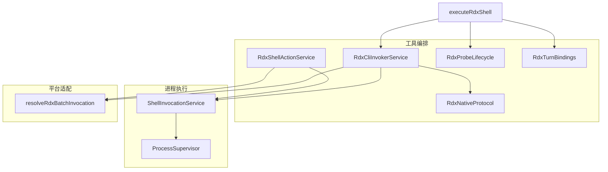
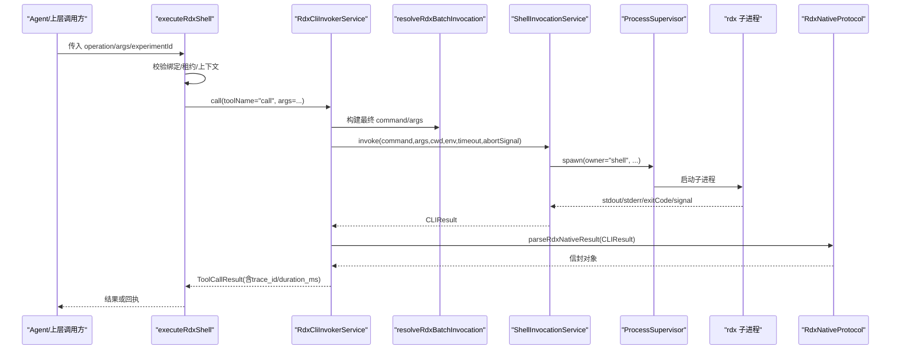
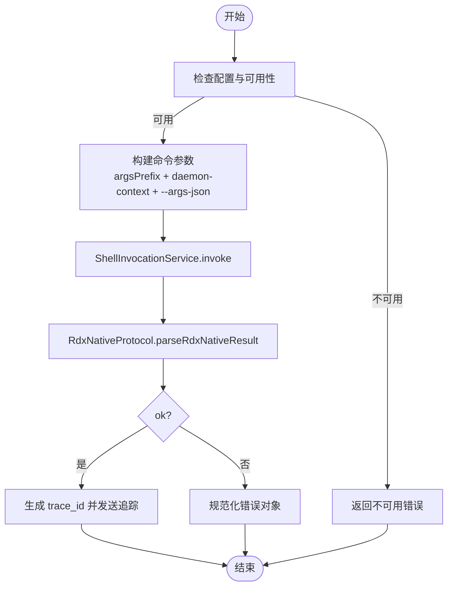
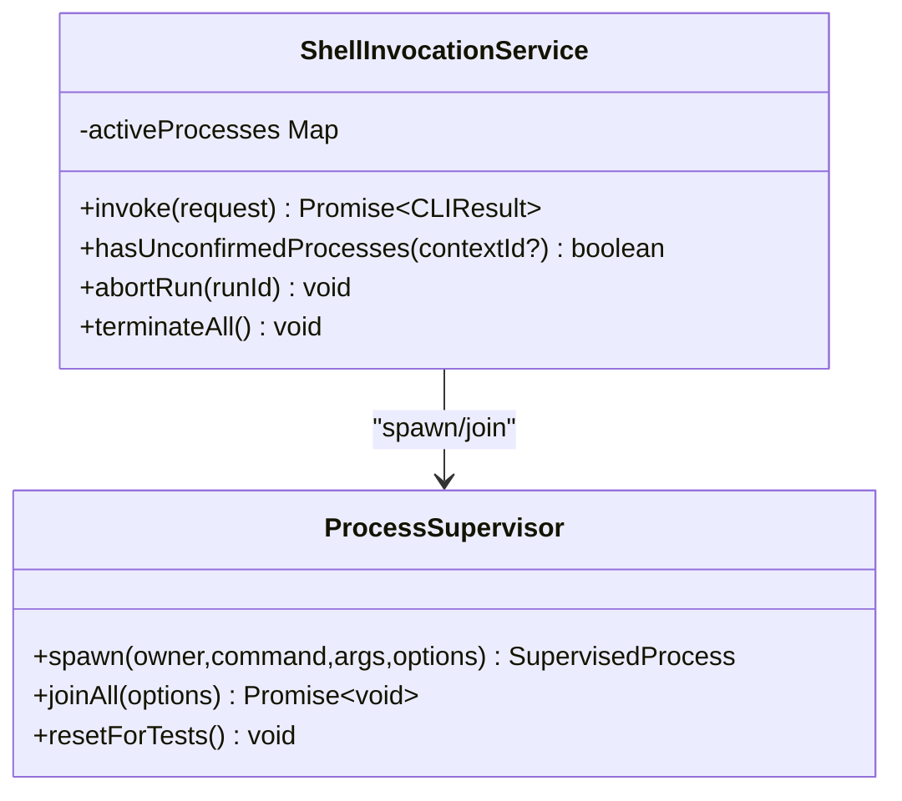
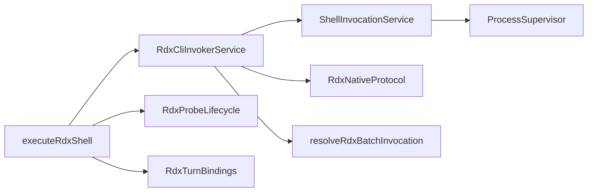
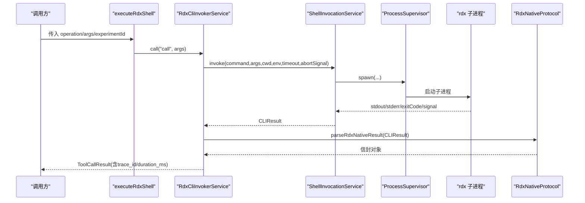

# CLI调用器设计

<cite>
**本文引用的文件**
- [RdxCliInvokerService.ts](file://src/main/tools/RdxCliInvokerService.ts)
- [ShellInvocationService.ts](file://src/main/tools/ShellInvocationService.ts)
- [RdxNativeProtocol.ts](file://src/main/tools/RdxNativeProtocol.ts)
- [RdxProbeLifecycle.ts](file://src/main/tools/RdxProbeLifecycle.ts)
- [RdxShellActionService.ts](file://src/main/tools/RdxShellActionService.ts)
- [resolveRdxBatchInvocation.ts](file://src/main/tools/resolveRdxBatchInvocation.ts)
- [ProcessSupervisor.ts](file://src/main/runtime/ProcessSupervisor.ts)
- [executeRdxShell.ts](file://src/main/tools/executeRdxShell.ts)
- [RdxTurnBindings.ts](file://src/main/tools/RdxTurnBindings.ts)
</cite>

## 目录
1. [简介](#简介)
2. [项目结构](#项目结构)
3. [核心组件](#核心组件)
4. [架构总览](#架构总览)
5. [详细组件分析](#详细组件分析)
6. [依赖关系分析](#依赖关系分析)
7. [性能与资源限制](#性能与资源限制)
8. [故障排查指南](#故障排查指南)
9. [结论](#结论)
10. [附录：协议规范与调用流程](#附录协议规范与调用流程)

## 简介
本文件面向“CLI调用器”的设计与实现，聚焦以下目标：
- 解析 RdxCliInvokerService 的外部工具集成机制（配置、参数构建、执行、结果解析）
- 解析 ShellInvocationService 的 shell 执行引擎（进程生命周期、超时、隔离、异常处理）
- 明确 RdxNativeProtocol 的原生协议定义与校验
- 说明 RdxProbeLifecycle 的生命周期管理（打开/关闭捕获上下文）
- 解释进程间通信、命令参数构建、结果解析处理
- 描述安全沙箱机制、权限控制、资源限制实现
- 包含超时处理、错误重试、日志收集功能
- 提供调用流程图和协议规范，展示从工具调用到结果返回的完整交互过程

## 项目结构
围绕 CLI 调用器的关键代码位于 src/main/tools 与 src/main/runtime：
- 工具编排与协议层：RdxCliInvokerService、RdxNativeProtocol、RdxShellActionService、RdxProbeLifecycle、RdxTurnBindings
- 进程执行层：ShellInvocationService、ProcessSupervisor
- 平台适配：resolveRdxBatchInvocation（Windows rdx.bat 启动桥接）
- 上层入口：executeRdxShell（将 Agent 工具调用映射为原生 rdx 操作）

图表来源
- [RdxCliInvokerService.ts:42-367](file://src/main/tools/RdxCliInvokerService.ts#L42-L367)
- [ShellInvocationService.ts:29-127](file://src/main/tools/ShellInvocationService.ts#L29-L127)
- [RdxNativeProtocol.ts:3-34](file://src/main/tools/RdxNativeProtocol.ts#L3-L34)
- [RdxProbeLifecycle.ts:7-44](file://src/main/tools/RdxProbeLifecycle.ts#L7-L44)
- [resolveRdxBatchInvocation.ts:4-20](file://src/main/tools/resolveRdxBatchInvocation.ts#L4-L20)
- [ProcessSupervisor.ts:167-425](file://src/main/runtime/ProcessSupervisor.ts#L167-L425)
- [executeRdxShell.ts:16-70](file://src/main/tools/executeRdxShell.ts#L16-L70)

章节来源
- [RdxCliInvokerService.ts:42-367](file://src/main/tools/RdxCliInvokerService.ts#L42-L367)
- [ShellInvocationService.ts:29-127](file://src/main/tools/ShellInvocationService.ts#L29-L127)
- [ProcessSupervisor.ts:167-425](file://src/main/runtime/ProcessSupervisor.ts#L167-L425)

## 核心组件
- RdxCliInvokerService：负责读取设置、加载工具目录、构建命令行参数、调用 ShellInvocationService、解析原生协议并产出统一 ToolCallResult。支持 trace 监听、取消信号、超时、工作目录与环境变量注入。
- ShellInvocationService：封装子进程执行，基于 ProcessSupervisor 管理进程树、超时、孤儿进程检测、退出码归一化、stdout/stderr 环形缓冲。
- RdxNativeProtocol：定义并校验原生 rdx 输出信封（ok、result_kind、data），确保上下文一致性，拒绝二进制 stdout。
- RdxProbeLifecycle：复用产品捕获生命周期，严格校验 capture 注册、会话所有权、设备选择与上下文分配，避免任意 context id 租约。
- RdxShellActionService：以“动作”方式运行可配置的 shell 命令，变量替换、环境变量注入、JSON 信封解析、诊断信息格式化与日志记录。
- resolveRdxBatchInvocation：在 Windows 上把 rdx.bat 调用桥接到 PowerShell 脚本，附加非交互等标志。
- ProcessSupervisor：统一的子进程注册表，支持进程组隔离、SIGTERM/SIGKILL 优雅终止、超时强制终止、孤儿进程标记、环形缓冲区限流。
- executeRdxShell：Agent 工具到原生 rdx 操作的入口，校验绑定与租约、串行执行、写入签名回执（实验场景）。

章节来源
- [RdxCliInvokerService.ts:42-367](file://src/main/tools/RdxCliInvokerService.ts#L42-L367)
- [ShellInvocationService.ts:29-127](file://src/main/tools/ShellInvocationService.ts#L29-L127)
- [RdxNativeProtocol.ts:3-34](file://src/main/tools/RdxNativeProtocol.ts#L3-L34)
- [RdxProbeLifecycle.ts:7-44](file://src/main/tools/RdxProbeLifecycle.ts#L7-L44)
- [RdxShellActionService.ts:154-278](file://src/main/tools/RdxShellActionService.ts#L154-L278)
- [resolveRdxBatchInvocation.ts:4-20](file://src/main/tools/resolveRdxBatchInvocation.ts#L4-L20)
- [ProcessSupervisor.ts:167-425](file://src/main/runtime/ProcessSupervisor.ts#L167-L425)
- [executeRdxShell.ts:16-70](file://src/main/tools/executeRdxShell.ts#L16-L70)

## 架构总览
整体调用链路如下：
- Agent 通过 executeRdxShell 发起原生 rdx 操作，校验绑定与租约后，交由 RdxCliInvokerService 构建参数并执行。
- 参数构建阶段会合并全局 argsPrefix、daemon-context、--args-json 等；Windows 下可能经 resolveRdxBatchInvocation 转为 powershell 调用 rdx_bat_launcher.ps1。
- ShellInvocationService 使用 ProcessSupervisor.spawn 启动子进程，设置工作目录、环境变量、超时、隔离进程组等。
- 子进程完成后，RdxNativeProtocol 校验信封格式与上下文一致性；RdxCliInvokerService 将其转换为 ToolCallResult，并触发 trace。
- 对于“动作”模式，RdxShellActionService 同样走 ShellInvocationService，但额外做变量替换、诊断解析与结构化日志。

图表来源
- [executeRdxShell.ts:16-70](file://src/main/tools/executeRdxShell.ts#L16-L70)
- [RdxCliInvokerService.ts:178-355](file://src/main/tools/RdxCliInvokerService.ts#L178-L355)
- [resolveRdxBatchInvocation.ts:4-20](file://src/main/tools/resolveRdxBatchInvocation.ts#L4-L20)
- [ShellInvocationService.ts:32-105](file://src/main/tools/ShellInvocationService.ts#L32-L105)
- [ProcessSupervisor.ts:167-425](file://src/main/runtime/ProcessSupervisor.ts#L167-L425)
- [RdxNativeProtocol.ts:12-34](file://src/main/tools/RdxNativeProtocol.ts#L12-L34)

## 详细组件分析

### RdxCliInvokerService：外部工具集成与调用
- 配置与可用性检查：从 Settings 读取 rdxCli 配置（enabled/command/cwd/env/timeoutMs/catalogPath/argsPrefix），未配置则直接返回不可用结果。
- 工具目录加载：可选加载 catalog.json，统计命名空间与工具数量，用于运行时摘要。
- 参数构建：
  - 标准化 --context-id 为 --daemon-context
  - 分离全局参数与命令参数，插入 argsPrefix 与 daemon-context
  - 将请求参数序列化为 --args-json
- 执行与结果解析：
  - 调用 ShellInvocationService.invoke
  - 使用 RdxNativeProtocol.parseRdxNativeResult 校验信封
  - 将 ok:false 的错误对象规范化为 ToolCallResult.error
  - 成功时提取 data/artifacts
- Trace 与取消：
  - onInvocationTrace 订阅调用轨迹
  - 支持 AbortSignal 透传，失败时抛出并捕获为 EXECUTION_ERROR
- 资源清理：
  - abortRun/runId 级中止
  - terminateAll 终止所有活跃进程

图表来源
- [RdxCliInvokerService.ts:49-176](file://src/main/tools/RdxCliInvokerService.ts#L49-L176)
- [RdxCliInvokerService.ts:178-355](file://src/main/tools/RdxCliInvokerService.ts#L178-L355)
- [RdxNativeProtocol.ts:12-34](file://src/main/tools/RdxNativeProtocol.ts#L12-L34)

章节来源
- [RdxCliInvokerService.ts:49-176](file://src/main/tools/RdxCliInvokerService.ts#L49-L176)
- [RdxCliInvokerService.ts:178-355](file://src/main/tools/RdxCliInvokerService.ts#L178-L355)

### ShellInvocationService：shell 执行引擎
- 进程创建：
  - 根据平台决定是否使用 shell（Windows .bat/.cmd）
  - 合并 process.env 与 request.env，固定 PYTHONIOENCODING=utf-8
  - 非 Windows 启用 isolateProcessGroup，便于按进程组终止
- 生命周期与超时：
  - 使用 ProcessSupervisor.join(timeoutMs) 等待完成
  - 区分 spawn_failed、timeout、unconfirmed_orphan、正常退出
  - 退出码归一化：signal 转 128+signalNumber
- 活跃进程跟踪：
  - activeProcesses 维护 runId/contextId 关联
  - hasUnconfirmedProcesses 检测孤儿进程
  - abortRun/terminateAll 支持批量中止

图表来源
- [ShellInvocationService.ts:29-127](file://src/main/tools/ShellInvocationService.ts#L29-L127)
- [ProcessSupervisor.ts:167-425](file://src/main/runtime/ProcessSupervisor.ts#L167-L425)

章节来源
- [ShellInvocationService.ts:29-127](file://src/main/tools/ShellInvocationService.ts#L29-L127)
- [ProcessSupervisor.ts:167-425](file://src/main/runtime/ProcessSupervisor.ts#L167-L425)

### RdxNativeProtocol：原生协议定义与校验
- 信封字段：
  - ok: true 表示成功
  - result_kind: 字符串，标识结果类型
  - data: 对象，承载业务数据
  - context_id: 可选，用于上下文匹配
- 校验规则：
  - 要求 exitCode === 0
  - stdout 必须为合法 JSON 对象
  - 必须存在 result_kind 与 data
  - 若指定 expectedContext，需与响应中的 context_id 一致
  - 禁止暴露二进制 stdout

章节来源
- [RdxNativeProtocol.ts:3-34](file://src/main/tools/RdxNativeProtocol.ts#L3-L34)

### RdxProbeLifecycle：捕获上下文生命周期
- openProbeLease：
  - 校验 projectId 与 capturePath 已注册
  - 校验当前会话拥有捕获上下文，且未被其他会话占用
  - 校验 replay device 已选择
  - 通过 rdxSessionService.openProjectInput 打开输入并绑定 turn
- closeProbeLease：
  - 校验 project 存在且无委托冲突
  - 通过 rdxSessionService.clearOpenedCaptureForSession 关闭捕获
- 安全约束：
  - 不随意签发任意 context id 的租约
  - 仅允许对已注册的 capture 进行操作
  - 防止委托租约关闭父捕获

章节来源
- [RdxProbeLifecycle.ts:7-44](file://src/main/tools/RdxProbeLifecycle.ts#L7-L44)

### RdxShellActionService：动作式 shell 执行
- 变量替换：支持 {{var}} 语法在工作目录、日志路径、项目路径、知识路径等上下文中替换
- 参数与环境：
  - 从设置中读取 action 配置（command/args/env/workingDirectory/timeoutMs）
  - 合并用户传入 env，支持 contextId/inputId/RDX_CONTEXT_ID 传递
- 结果解析：
  - 要求 stdout 为原生 rdx 信封（ok/result_kind/data）
  - 解析 error 为结构化 diagnostic（message/classification/fixHint/failedStep/renderdocStatus）
- 日志与诊断：
  - 通过 runtimeLogService 记录成功/失败事件
  - 提供 isLocalReplayUnsupportedDiagnostic 判断本地回放不支持的诊断

章节来源
- [RdxShellActionService.ts:154-278](file://src/main/tools/RdxShellActionService.ts#L154-L278)

### resolveRdxBatchInvocation：Windows 批处理桥接
- 当命令为 rdx.bat 且在 Windows 平台时，自动切换到 powershell.exe 并调用 scripts/rdx_bat_launcher.ps1
- 支持 --non-interactive 时追加 -NonInteractive
- 其他情况原样返回 command/args

章节来源
- [resolveRdxBatchInvocation.ts:4-20](file://src/main/tools/resolveRdxBatchInvocation.ts#L4-L20)

### executeRdxShell：Agent 到原生 rdx 的入口
- 校验：
  - 仅 General agent 可执行
  - 绑定与租约版本一致，且拥有 replay session
  - 拒绝 default context 与未配置 CLI
- 执行：
  - 串行执行（通过 withSessionShellLock）
  - 构造 operation/args，调用 RdxCliInvokerService.executeCLI
- 回执：
  - 若携带 experimentId，写入签名回执（sessionId/projectId/turn/toolCall/experiment/context/leaseVersion/replaySession/operation/args指纹/结果hash/时间戳/退出码）
- 异常：
  - 捕获异常并 quarantine 上下文，提示恢复

章节来源
- [executeRdxShell.ts:16-70](file://src/main/tools/executeRdxShell.ts#L16-L70)

## 依赖关系分析
- 松耦合：
  - RdxCliInvokerService 依赖 ShellInvocationService 抽象进程执行，便于替换实现
  - ShellInvocationService 依赖 ProcessSupervisor 统一管理进程生命周期
  - RdxNativeProtocol 独立于执行层，只关注协议校验
- 强内聚：
  - RdxProbeLifecycle 与 sessions/captures 服务紧密协作，保证捕获上下文一致性
  - RdxShellActionService 集中处理动作配置、变量替换、诊断与日志
- 外部依赖：
  - Node child_process（通过 ProcessSupervisor）
  - 文件系统（catalog 加载、capture 路径校验）
  - 设置服务（SettingsService）

图表来源
- [RdxCliInvokerService.ts:42-367](file://src/main/tools/RdxCliInvokerService.ts#L42-L367)
- [ShellInvocationService.ts:29-127](file://src/main/tools/ShellInvocationService.ts#L29-L127)
- [ProcessSupervisor.ts:167-425](file://src/main/runtime/ProcessSupervisor.ts#L167-L425)
- [RdxNativeProtocol.ts:3-34](file://src/main/tools/RdxNativeProtocol.ts#L3-L34)
- [resolveRdxBatchInvocation.ts:4-20](file://src/main/tools/resolveRdxBatchInvocation.ts#L4-L20)
- [executeRdxShell.ts:16-70](file://src/main/tools/executeRdxShell.ts#L16-L70)
- [RdxProbeLifecycle.ts:7-44](file://src/main/tools/RdxProbeLifecycle.ts#L7-L44)
- [RdxTurnBindings.ts:1-36](file://src/main/tools/RdxTurnBindings.ts#L1-L36)

## 性能与资源限制
- 进程组隔离：非 Windows 平台使用 detached 进程组，便于按组终止，减少僵尸进程风险
- 环形缓冲：stdout/stderr 采用 RingBuffer 限制内存占用（默认 256 KiB），避免大输出导致 OOM
- 超时与优雅终止：
  - 超时触发 SIGTERM，随后在宽限期内强制 SIGKILL
  - 若子进程未在宽限期内确认退出，标记为 unconfirmed_orphan，并在 join 时返回特定原因
- 资源回收：
  - finally 块中清理 activeProcesses
  - orphaned 进程延迟清理直到 child.close 观察
- 建议优化：
  - 合理设置 timeoutMs，避免长时间阻塞
  - 对高频调用进行批处理或连接复用（如适用）
  - 监控 RingBuffer 大小与溢出率，必要时调整 ringBufferBytes

[本节为通用指导，无需具体文件引用]

## 故障排查指南
- 常见错误与定位：
  - 配置缺失：RdxCliInvokerService.getAvailabilityFailure 返回不可用原因，检查 enabled/command/cwd/env
  - 协议不匹配：RdxNativeProtocol 抛错，检查 stdout 是否为合法 JSON 信封，是否包含 result_kind/data
  - 上下文不一致：expectedContext 与响应 context_id 不匹配，检查 --daemon-context 是否正确注入
  - 超时：ShellInvocationService 返回 reason=timeout，检查 timeoutMs 与子进程行为
  - 孤儿进程：reason=unconfirmed_orphan，检查进程组隔离与 kill 逻辑
- 日志与追踪：
  - 使用 RdxCliInvokerService.onInvocationTrace 收集调用轨迹
  - RdxShellActionService 通过 runtimeLogService 记录动作执行详情
- 恢复策略：
  - 使用 RdxProbeLifecycle 重新打开/关闭捕获上下文
  - 对实验场景，依据回执验证执行与回滚

章节来源
- [RdxCliInvokerService.ts:70-86](file://src/main/tools/RdxCliInvokerService.ts#L70-L86)
- [RdxNativeProtocol.ts:12-34](file://src/main/tools/RdxNativeProtocol.ts#L12-L34)
- [ShellInvocationService.ts:67-97](file://src/main/tools/ShellInvocationService.ts#L67-L97)
- [ProcessSupervisor.ts:270-343](file://src/main/runtime/ProcessSupervisor.ts#L270-L343)
- [RdxShellActionService.ts:243-258](file://src/main/tools/RdxShellActionService.ts#L243-L258)

## 结论
本设计通过分层解耦实现了安全的 CLI 调用器：
- 工具编排层（RdxCliInvokerService/RdxShellActionService）专注参数构建、协议校验与结果标准化
- 执行层（ShellInvocationService/ProcessSupervisor）提供健壮的进程管理与资源控制
- 协议层（RdxNativeProtocol）确保跨进程通信的一致性与安全性
- 生命周期（RdxProbeLifecycle）保障捕获上下文的可信与可控
- 入口（executeRdxShell）将 Agent 意图安全地映射到原生 rdx 操作，并支持实验回执

该架构具备良好的可扩展性、可观测性与容错能力，适合在生产环境中稳定运行。

[本节为总结，无需具体文件引用]

## 附录：协议规范与调用流程

### 原生协议规范（RdxNativeEnvelope）
- 必需字段：
  - ok: true
  - result_kind: string
  - data: object
- 可选字段：
  - context_id: string（用于上下文匹配）
- 校验要点：
  - exitCode 必须为 0
  - stdout 必须为 JSON 对象
  - 必须包含 result_kind 与 data
  - 若指定 expectedContext，需与响应 context_id 一致

章节来源
- [RdxNativeProtocol.ts:3-34](file://src/main/tools/RdxNativeProtocol.ts#L3-L34)

### 调用流程图（端到端）

图表来源
- [executeRdxShell.ts:16-70](file://src/main/tools/executeRdxShell.ts#L16-L70)
- [RdxCliInvokerService.ts:178-355](file://src/main/tools/RdxCliInvokerService.ts#L178-L355)
- [ShellInvocationService.ts:32-105](file://src/main/tools/ShellInvocationService.ts#L32-L105)
- [ProcessSupervisor.ts:167-425](file://src/main/runtime/ProcessSupervisor.ts#L167-L425)
- [RdxNativeProtocol.ts:12-34](file://src/main/tools/RdxNativeProtocol.ts#L12-L34)