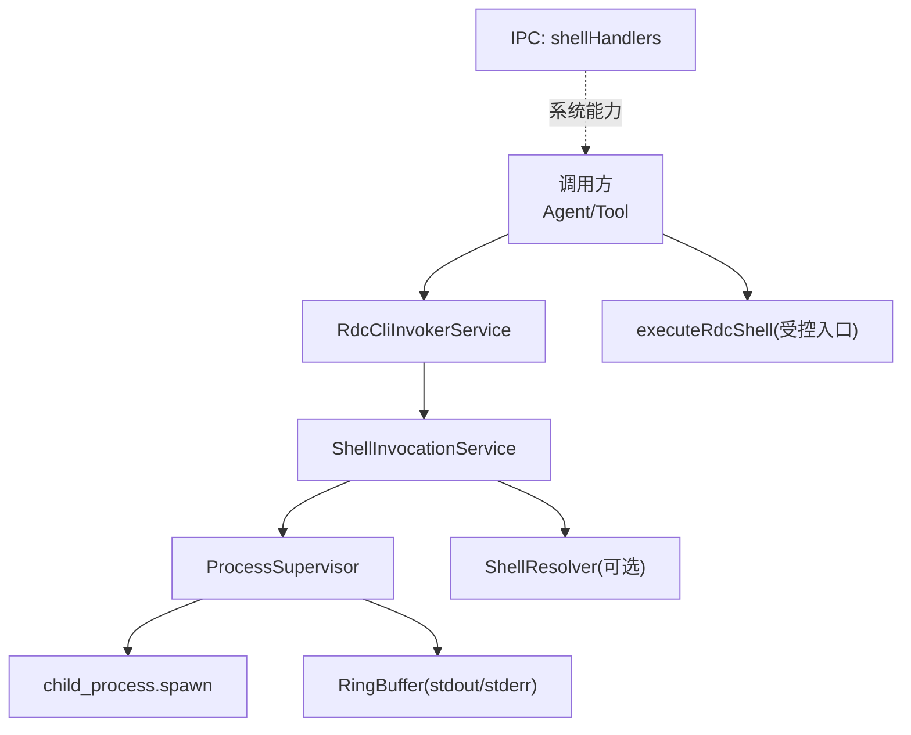
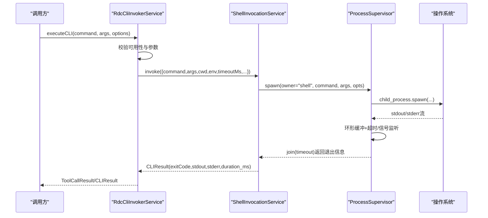
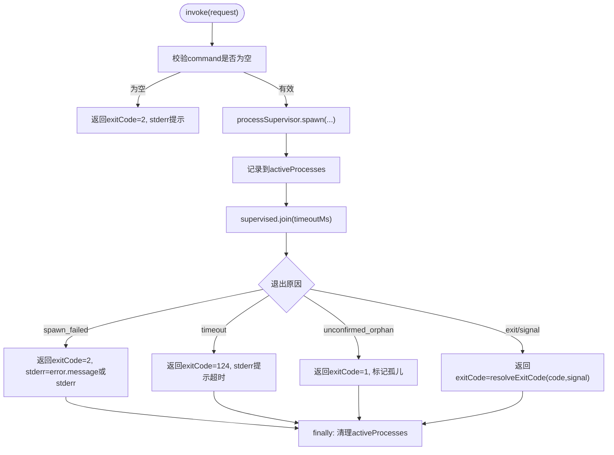
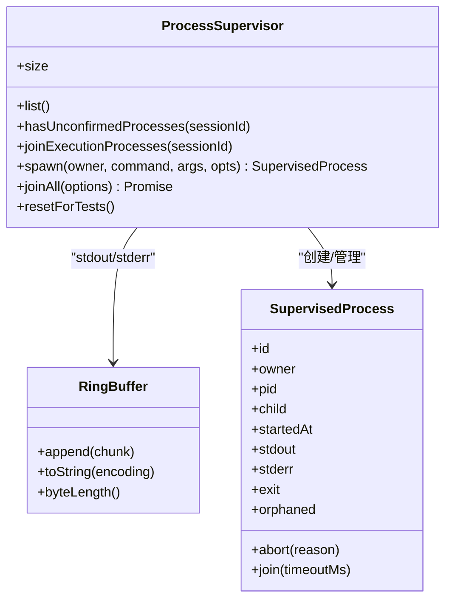
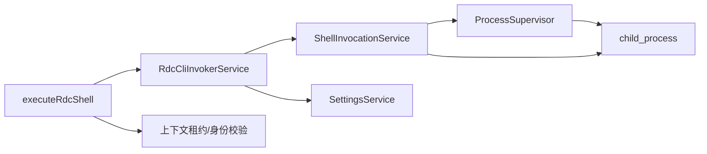

# Shell执行引擎

<cite>
**本文引用的文件**
- [ShellInvocationService.ts](file://src/main/tools/ShellInvocationService.ts)
- [ProcessSupervisor.ts](file://src/main/runtime/ProcessSupervisor.ts)
- [ResourceExecutionLifetime.ts](file://src/main/runtime/ResourceExecutionLifetime.ts)
- [RdcCliInvokerService.ts](file://src/main/tools/RdcCliInvokerService.ts)
- [executeRdcShell.ts](file://src/main/tools/executeRdcShell.ts)
- [ShellResolver.ts](file://src/main/runtime/ShellResolver.ts)
- [shellHandlers.ts](file://src/main/ipc/shellHandlers.ts)
</cite>

## 目录
1. [简介](#简介)
2. [项目结构](#项目结构)
3. [核心组件](#核心组件)
4. [架构总览](#架构总览)
5. [详细组件分析](#详细组件分析)
6. [依赖关系分析](#依赖关系分析)
7. [性能考量](#性能考量)
8. [故障排除指南](#故障排除指南)
9. [结论](#结论)

## 简介
本文件面向RDC-Agent中的“Shell执行引擎”，聚焦于ShellInvocationService的进程管理机制，包括子进程创建、标准输入输出流处理、错误捕获；超时控制、信号处理、资源清理；安全沙箱与权限验证、路径限制；并发执行控制、进程池管理、内存使用监控；并提供性能优化建议与故障排除指南。文档以代码级事实为依据，辅以架构图与时序图帮助理解。

## 项目结构
Shell执行相关能力分布在以下模块：
- 工具层：ShellInvocationService（统一Shell调用）、RdcCliInvokerService（rdc-tool CLI封装）、executeRdcShell（受控的RDC原生操作入口）
- 运行时：ProcessSupervisor（子进程注册、树杀、超时、孤儿检测）、ResourceExecutionLifetime（资源生命周期绑定）
- 解析器：ShellResolver（跨平台Shell探测与参数构造）
- IPC：shellHandlers（Electron主进程IPC，提供对话框、窗口、剪贴板等系统能力）

图表来源
- [ShellInvocationService.ts:29-105](file://src/main/tools/ShellInvocationService.ts#L29-L105)
- [ProcessSupervisor.ts:167-394](file://src/main/runtime/ProcessSupervisor.ts#L167-L394)
- [RdcCliInvokerService.ts:178-221](file://src/main/tools/RdcCliInvokerService.ts#L178-L221)
- [executeRdcShell.ts:16-69](file://src/main/tools/executeRdcShell.ts#L16-L69)
- [ShellResolver.ts:84-113](file://src/main/runtime/ShellResolver.ts#L84-L113)
- [shellHandlers.ts:69-207](file://src/main/ipc/shellHandlers.ts#L69-L207)

章节来源
- [ShellInvocationService.ts:29-105](file://src/main/tools/ShellInvocationService.ts#L29-L105)
- [ProcessSupervisor.ts:167-394](file://src/main/runtime/ProcessSupervisor.ts#L167-L394)
- [RdcCliInvokerService.ts:178-221](file://src/main/tools/RdcCliInvokerService.ts#L178-L221)
- [executeRdcShell.ts:16-69](file://src/main/tools/executeRdcShell.ts#L16-L69)
- [ShellResolver.ts:84-113](file://src/main/runtime/ShellResolver.ts#L84-L113)
- [shellHandlers.ts:69-207](file://src/main/ipc/shellHandlers.ts#L69-L207)

## 核心组件
- ShellInvocationService：对外暴露invoke方法，负责命令校验、环境注入、子进程派生、结果归一化、活跃进程跟踪与清理。
- ProcessSupervisor：统一的子进程注册中心，提供spawn/join/abort/joinAll、超时、信号、孤儿检测、环形缓冲区、进程组隔离。
- ResourceExecutionLifetime：通过AsyncLocalStorage将资源释放与进程退出绑定，避免过早回收。
- RdcCliInvokerService：对rdc-tool CLI的封装，包含可用性检查、参数构建、调用与结果解析、追踪上报。
- executeRdcShell：受控的RDC原生操作入口，进行上下文租约校验、身份一致性校验、参数白名单过滤、执行回执写入。
- ShellResolver：跨平台Shell探测与版本识别，生成非交互式执行参数。
- shellHandlers：Electron主进程IPC，提供安全的系统交互能力（对话框、窗口、剪贴板、路径打开）。

章节来源
- [ShellInvocationService.ts:29-127](file://src/main/tools/ShellInvocationService.ts#L29-L127)
- [ProcessSupervisor.ts:18-72](file://src/main/runtime/ProcessSupervisor.ts#L18-L72)
- [ResourceExecutionLifetime.ts:1-21](file://src/main/runtime/ResourceExecutionLifetime.ts#L1-L21)
- [RdcCliInvokerService.ts:42-221](file://src/main/tools/RdcCliInvokerService.ts#L42-L221)
- [executeRdcShell.ts:9-69](file://src/main/tools/executeRdcShell.ts#L9-L69)
- [ShellResolver.ts:14-113](file://src/main/runtime/ShellResolver.ts#L14-L113)
- [shellHandlers.ts:69-207](file://src/main/ipc/shellHandlers.ts#L69-L207)

## 架构总览
Shell执行引擎采用分层设计：上层工具/代理通过RdcCliInvokerService或executeRdcShell发起调用；中间层ShellInvocationService统一封装命令与环境；底层ProcessSupervisor负责进程生命周期、I/O缓冲、超时与信号；ShellResolver提供跨平台Shell探测；IPC层提供受限的系统能力。

图表来源
- [RdcCliInvokerService.ts:178-221](file://src/main/tools/RdcCliInvokerService.ts#L178-L221)
- [ShellInvocationService.ts:32-105](file://src/main/tools/ShellInvocationService.ts#L32-L105)
- [ProcessSupervisor.ts:167-394](file://src/main/runtime/ProcessSupervisor.ts#L167-L394)

## 详细组件分析

### ShellInvocationService：进程管理与结果归一化
- 子进程创建：基于processSupervisor.spawn，传入owner="shell"，根据平台决定是否使用shell包装（Windows下.bat/.cmd），并设置windowsHide、环境变量（合并进程环境与请求环境，强制PYTHONIOENCODING=utf-8）、工作目录、超时、AbortSignal、进程组隔离（非Windows）。
- 标准输入输出流处理：stdout/stderr由ProcessSupervisor内部RingBuffer收集，join后转换为字符串返回。
- 错误捕获：区分spawn_failed、timeout、unconfirmed_orphan等退出原因，映射为不同exitCode与stderr提示；正常退出时通过resolveExitCode将signal转为POSIX风格退出码。
- 活跃进程跟踪：维护activeProcesses Map，支持按runId中止、终止全部、查询未确认孤儿进程。
- 资源清理：finally中删除记录；若进程被标记orphaned，则等待其exit后再清理。

图表来源
- [ShellInvocationService.ts:32-105](file://src/main/tools/ShellInvocationService.ts#L32-L105)

章节来源
- [ShellInvocationService.ts:29-127](file://src/main/tools/ShellInvocationService.ts#L29-L127)

### ProcessSupervisor：子进程生命周期、超时、信号、资源清理
- 进程注册与隔离：在POSIX上启用detached进程组以便kill(-pid)；Windows使用taskkill /T /F进行进程树终止。
- 标准流缓冲：RingBuffer限制每流最大字节数（默认256 KiB），防止内存无限增长。
- 超时控制：支持两种超时路径——spawn选项timeoutMs触发abort('timeout')；join可选timeoutMs触发deadline并观察是否出现孤儿。
- 信号处理：abort先SIGTERM，宽限期后SIGKILL；同时直接调用child.kill()兜底。
- 孤儿检测：若强制终止后未在宽限期内观察到close，则标记unconfirmed_orphan，并通过retainResourceUntilExit延长资源持有至实际退出。
- 统一退出：exitPromise在close/error/settle时解析，reason区分exit/signal/timeout/abort/spawn_failed/supervisor_kill/unconfirmed_orphan。

图表来源
- [ProcessSupervisor.ts:77-102](file://src/main/runtime/ProcessSupervisor.ts#L77-L102)
- [ProcessSupervisor.ts:140-165](file://src/main/runtime/ProcessSupervisor.ts#L140-L165)
- [ProcessSupervisor.ts:167-394](file://src/main/runtime/ProcessSupervisor.ts#L167-L394)

章节来源
- [ProcessSupervisor.ts:18-72](file://src/main/runtime/ProcessSupervisor.ts#L18-L72)
- [ProcessSupervisor.ts:119-138](file://src/main/runtime/ProcessSupervisor.ts#L119-L138)
- [ProcessSupervisor.ts:167-394](file://src/main/runtime/ProcessSupervisor.ts#L167-L394)
- [ResourceExecutionLifetime.ts:1-21](file://src/main/runtime/ResourceExecutionLifetime.ts#L1-L21)

### RdcCliInvokerService：rdc-tool CLI封装与可用性校验
- 可用性检查：disabled或未配置command、命令路径不存在时返回不可用原因。
- 参数构建：标准化--context-id为--daemon-context，分离全局参数与命令参数，拼接settings.argsPrefix。
- 执行流程：调用resolveRdcBatchInvocation解析批处理命令，再通过ShellInvocationService.invoke执行，透传cwd/env/timeout/runId/contextId/abortSignal。
- 结果解析：将CLIResult转换为ToolCallResult，包含ok/data/artifacts/duration_ms/trace_id，失败时附带stderr/exitCode等细节。
- 追踪上报：onInvocationTrace可订阅每次调用的trace。

章节来源
- [RdcCliInvokerService.ts:42-221](file://src/main/tools/RdcCliInvokerService.ts#L42-L221)
- [RdcCliInvokerService.ts:248-363](file://src/main/tools/RdcCliInvokerService.ts#L248-L363)

### executeRdcShell：受控的RDC原生操作入口（安全沙箱）
- 输入校验：严格schema限定operation格式、args类型、experimentId长度。
- 权限与租约：仅允许general agent的turn执行，校验lease所有权、identity版本与上下文ID一致，禁止覆盖敏感字段（session_id、context_id、daemon_context、owner_session_id）。
- 执行约束：要求存在frozen binding且拥有replay session，否则拒绝。
- 执行与回执：调用rdcCliInvokerService.executeCLI，解析native结果，必要时写入执行回执（含参数指纹、结果哈希、时间戳等）。
- 异常恢复：异常时将上下文置为quarantine状态，阻止后续不安全执行。

章节来源
- [executeRdcShell.ts:9-69](file://src/main/tools/executeRdcShell.ts#L9-L69)

### ShellResolver：跨平台Shell探测与参数构造
- 自动候选：Windows优先pwsh，其次powershell，再bash/sh；POSIX优先$SHELL（限定zsh/bash/sh/dash），再fallback常见路径。
- 版本探测：PowerShell通过$PSVersionTable.PSVersion.ToString()；POSIX通过各自版本变量或echo ok。
- 非交互参数：PowerShell使用-EncodedCommand确保可靠输出；POSIX使用-lc执行命令。
- 安全限制：拒绝WindowsApps别名、不支持的POSIX shell（fish/csh/nu等）。

章节来源
- [ShellResolver.ts:14-113](file://src/main/runtime/ShellResolver.ts#L14-L113)
- [ShellResolver.ts:124-284](file://src/main/runtime/ShellResolver.ts#L124-L284)

### shellHandlers：IPC系统能力（安全边界）
- 对话框：限定扩展名（如.rdc、图片），限制选择数量。
- 窗口：最小化、最大化切换、关闭、查询状态。
- 应用元信息：版本、产品名称、主题、测试模式。
- 头像导入：复制至profileStatePath/avatar，读取data URL。
- 路径打开：目录openPath，文件showItemInFolder，失败回退。
- 剪贴板：读写文本，限制最大负载大小。

章节来源
- [shellHandlers.ts:69-207](file://src/main/ipc/shellHandlers.ts#L69-L207)

## 依赖关系分析
- ShellInvocationService依赖ProcessSupervisor进行进程管理，依赖os/path用于平台判断与退出码转换。
- RdcCliInvokerService依赖ShellInvocationService与SettingsService，间接依赖shellHandlers提供的系统能力（通过上层工具调用）。
- executeRdcShell依赖RdcCliInvokerService与上下文租约服务，形成强约束的安全入口。
- ProcessSupervisor依赖child_process与Node信号机制，结合ResourceExecutionLifetime保证资源释放。

图表来源
- [executeRdcShell.ts:16-69](file://src/main/tools/executeRdcShell.ts#L16-L69)
- [RdcCliInvokerService.ts:178-221](file://src/main/tools/RdcCliInvokerService.ts#L178-L221)
- [ShellInvocationService.ts:32-105](file://src/main/tools/ShellInvocationService.ts#L32-L105)
- [ProcessSupervisor.ts:167-394](file://src/main/runtime/ProcessSupervisor.ts#L167-L394)

章节来源
- [executeRdcShell.ts:16-69](file://src/main/tools/executeRdcShell.ts#L16-L69)
- [RdcCliInvokerService.ts:178-221](file://src/main/tools/RdcCliInvokerService.ts#L178-L221)
- [ShellInvocationService.ts:32-105](file://src/main/tools/ShellInvocationService.ts#L32-L105)
- [ProcessSupervisor.ts:167-394](file://src/main/runtime/ProcessSupervisor.ts#L167-L394)

## 性能考量
- 内存控制：ProcessSupervisor使用RingBuffer限制stdout/stderr最大字节数（默认256 KiB），避免长输出导致内存膨胀。可通过opts.ringBufferBytes调整。
- 超时策略：
  - 短任务：为ShellInvocationService.invoke设置合理的timeoutMs，避免阻塞。
  - 长任务：使用AbortSignal配合上游取消，减少无效等待。
- 进程组隔离：POSIX下启用进程组隔离，便于快速终止整个子进程树，降低僵尸进程风险。
- 并发控制：
  - 当前实现无内置进程池，建议在调用侧（如RdcCliInvokerService或上层调度）增加并发上限与队列，避免过多子进程竞争CPU/IO。
  - 可使用runId分组批量中止，便于按任务粒度控制并发。
- 路径与工作目录：
  - 尽量设置cwd为最小必要目录，减少文件系统扫描开销。
  - 避免在高频路径上进行大量stat/exists检查。
- 日志与追踪：
  - 利用RdcCliInvokerService.onInvocationTrace收集调用耗时与错误，定位瓶颈。
  - 结合RuntimeLogService记录关键步骤，辅助排障。

[本节为通用指导，不直接分析具体文件]

## 故障排除指南
- 命令未配置或不可用：
  - 现象：exitCode=2，stderr提示未配置或命令不存在。
  - 排查：检查Settings中tooling.rdc-agentCli.enabled与command；确认命令路径存在且可执行。
  - 参考：[RdcCliInvokerService.ts:49-86](file://src/main/tools/RdcCliInvokerService.ts#L49-L86)
- 子进程启动失败：
  - 现象：reason=spawn_failed，exitCode=2，stderr包含错误消息。
  - 排查：检查命令与参数、环境变量、工作目录是否存在；确认权限与路径合法性。
  - 参考：[ShellInvocationService.ts:67-74](file://src/main/tools/ShellInvocationService.ts#L67-L74)
- 超时：
  - 现象：reason=timeout，exitCode=124，stderr提示超时。
  - 排查：增大timeoutMs或优化命令逻辑；检查是否有死锁或外部依赖阻塞。
  - 参考：[ShellInvocationService.ts:75-82](file://src/main/tools/ShellInvocationService.ts#L75-L82)
- 孤儿进程：
  - 现象：reason=unconfirmed_orphan，exitCode=1，stderr提示未确认终止。
  - 排查：检查系统信号处理；POSIX下确认进程组隔离；Windows下确认taskkill生效。
  - 参考：[ProcessSupervisor.ts:312-335](file://src/main/runtime/ProcessSupervisor.ts#L312-L335)
- 权限与租约不一致：
  - 现象：executeRdcShell抛出RDC_TOOL_EXECUTION_DENIED或协议不匹配。
  - 排查：确保General turn拥有replay session且binding未变化；禁止覆盖敏感参数。
  - 参考：[executeRdcShell.ts:21-38](file://src/main/tools/executeRdcShell.ts#L21-L38)
- Shell不可用：
  - 现象：ShellUnavailableError或无法解析Shell。
  - 排查：安装支持的Shell（zsh/bash/sh/pwsh），避免WindowsApps别名；检查$SHELL与PATH。
  - 参考：[ShellResolver.ts:124-179](file://src/main/runtime/ShellResolver.ts#L124-L179)

章节来源
- [RdcCliInvokerService.ts:49-86](file://src/main/tools/RdcCliInvokerService.ts#L49-L86)
- [ShellInvocationService.ts:67-82](file://src/main/tools/ShellInvocationService.ts#L67-L82)
- [ProcessSupervisor.ts:312-335](file://src/main/runtime/ProcessSupervisor.ts#L312-L335)
- [executeRdcShell.ts:21-38](file://src/main/tools/executeRdcShell.ts#L21-L38)
- [ShellResolver.ts:124-179](file://src/main/runtime/ShellResolver.ts#L124-L179)

## 结论
Shell执行引擎通过ShellInvocationService与ProcessSupervisor实现了统一的子进程管理，具备完善的超时、信号、孤儿检测与内存缓冲机制；RdcCliInvokerService与executeRdcShell提供了安全可控的CLI与原生操作入口；ShellResolver保障跨平台兼容性；IPC层提供受限的系统能力。建议在生产环境中结合并发控制、路径限制与资源监控进一步提升稳定性与性能。