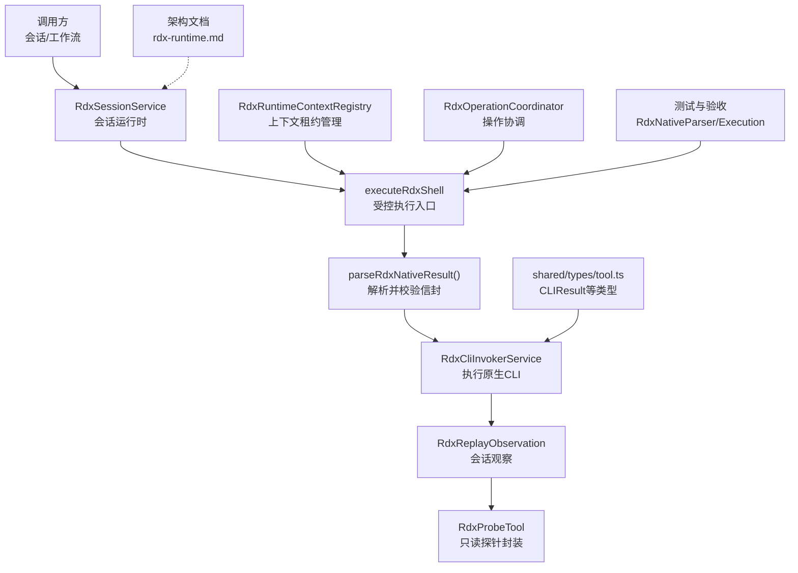
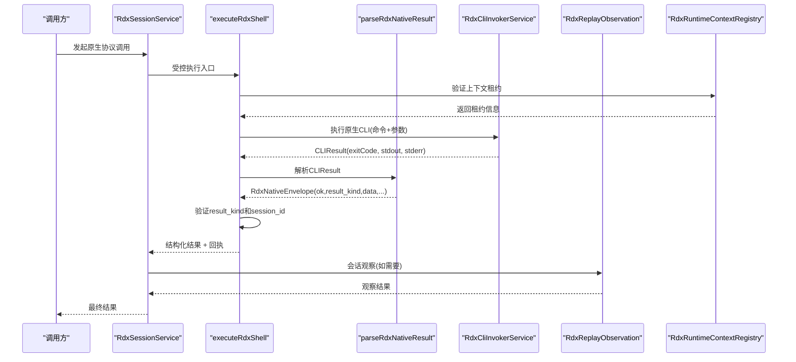
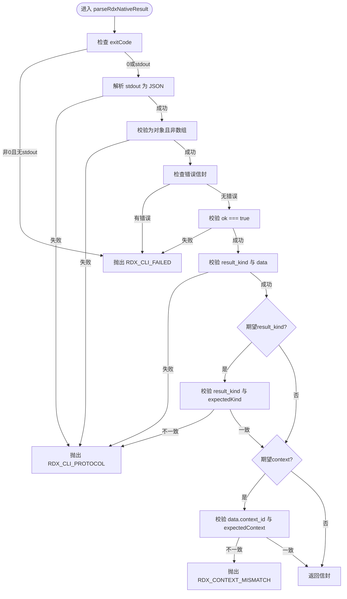
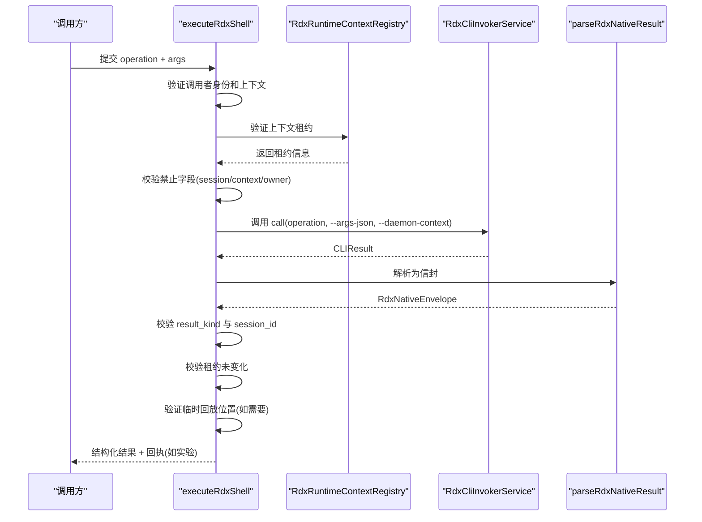
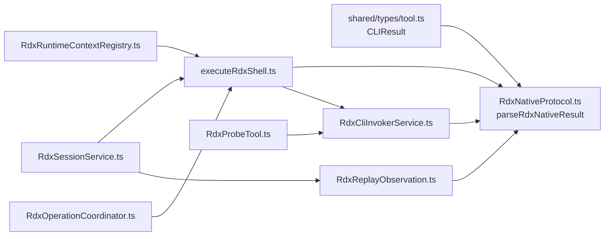

# 原生协议定义

<cite>
**本文引用的文件**
- [RdxNativeProtocol.ts](file://src/main/tools/RdxNativeProtocol.ts)
- [executeRdxShell.ts](file://src/main/tools/executeRdxShell.ts)
- [RdxReplayObservation.ts](file://src/main/sessions/RdxReplayObservation.ts)
- [RdxSessionService.ts](file://src/main/sessions/RdxSessionService.ts)
- [RdxRuntimeContextRegistry.ts](file://src/main/sessions/RdxRuntimeContextRegistry.ts)
- [RdxOperationCoordinator.ts](file://src/main/sessions/RdxOperationCoordinator.ts)
- [tool.ts](file://src/shared/types/tool.ts)
- [RdxCliInvokerService.ts](file://src/main/tools/RdxCliInvokerService.ts)
- [RdxProbeTool.ts](file://src/main/workflow/debugger/RdxProbeTool.ts)
- [RdxNativeParser.test.ts](file://src/main/tools/RdxNativeParser.test.ts)
- [RdxNativeExecution.test.ts](file://src/main/tools/RdxNativeExecution.test.ts)
- [rdx-runtime.md](file://docs/architecture/rdx-runtime.md)
</cite>

## 更新摘要
**变更内容**
- 更新了会话运行时架构，改为直接使用原生协议调用
- 移除了对RdxShellActionService的中间层依赖
- 增强了上下文验证和错误处理机制
- 改进了executeRdxShell的执行流程和安全性检查
- 优化了RdxSessionService的原生协议集成

## 目录
1. [简介](#简介)
2. [项目结构](#项目结构)
3. [核心组件](#核心组件)
4. [架构总览](#架构总览)
5. [详细组件分析](#详细组件分析)
6. [依赖关系分析](#依赖关系分析)
7. [性能考虑](#性能考虑)
8. [故障排查指南](#故障排查指南)
9. [结论](#结论)
10. [附录](#附录)

## 简介
本文件面向 RDX 原生 CLI 与主进程之间的"原生协议"契约，聚焦以下目标：
- 明确请求与响应的数据格式、字段含义与约束。
- 深入解析 parseRdxNativeResult() 的解析逻辑、数据验证规则与类型转换机制。
- 说明协议版本兼容性、扩展字段处理与向后兼容策略。
- 给出协议设计原则、序列化格式与数据传输优化建议。
- 提供使用示例与调试方法，帮助快速定位问题。

该协议通过子进程调用原生 rdx 工具并以 JSON 形式交换结果，主进程在调用前后进行上下文、租约与执行证据校验，确保可审计、可回滚、可追踪。**更新后的架构直接通过会话运行时调用原生协议，移除了中间层依赖，增强了安全性和性能。**

## 项目结构
围绕原生协议的关键代码集中在 main 进程的 tools 层、sessions 层与 shared 类型定义中：
- 协议解析与信封类型：src/main/tools/RdxNativeProtocol.ts
- 受控执行入口（注入 session/context、记录回执）：src/main/tools/executeRdxShell.ts
- 会话运行时观察：src/main/sessions/RdxReplayObservation.ts
- 会话服务管理：src/main/sessions/RdxSessionService.ts
- 运行时上下文注册表：src/main/sessions/RdxRuntimeContextRegistry.ts
- 操作协调器：src/main/sessions/RdxOperationCoordinator.ts
- CLI 执行与工具目录：src/main/tools/RdxCliInvokerService.ts
- 只读探测工具（探针）：src/main/workflow/debugger/RdxProbeTool.ts
- 共享类型（CLI 执行结果等）：src/shared/types/tool.ts
- 测试与验收用例：src/main/tools/RdxNativeParser.test.ts、src/main/tools/RdxNativeExecution.test.ts
- 架构文档补充：docs/architecture/rdx-runtime.md

**图表来源**
- [RdxNativeProtocol.ts:1-43](file://src/main/tools/RdxNativeProtocol.ts#L1-L43)
- [executeRdxShell.ts:23-129](file://src/main/tools/executeRdxShell.ts#L23-L129)
- [RdxReplayObservation.ts:12-88](file://src/main/sessions/RdxReplayObservation.ts#L12-L88)
- [RdxSessionService.ts:221-271](file://src/main/sessions/RdxSessionService.ts#L221-L271)
- [RdxRuntimeContextRegistry.ts:134-154](file://src/main/sessions/RdxRuntimeContextRegistry.ts#L134-L154)
- [RdxOperationCoordinator.ts:17-36](file://src/main/sessions/RdxOperationCoordinator.ts#L17-L36)

**章节来源**
- [RdxNativeProtocol.ts:1-43](file://src/main/tools/RdxNativeProtocol.ts#L1-L43)
- [tool.ts:136-142](file://src/shared/types/tool.ts#L136-L142)

## 核心组件
- **原生协议信封（RdxNativeEnvelope）**
  - ok: 必须为 true，表示原生侧成功返回。
  - result_kind: 字符串，标识本次操作的种类（通常等于被调用的操作名）。
  - data: 对象，承载具体业务数据；可能包含 context_id、session_id 等字段。
  - 扩展字段：允许存在其他未知字段，保证向前兼容。
- **CLI 执行结果（CLIResult）**
  - exitCode: 非零即视为失败。
  - stdout/stderr: 文本输出；协议要求 stdout 为合法 JSON。
  - duration_ms: 耗时。
  - processExitReason: 可选，描述退出原因。
- **解析器（parseRdxNativeResult）**
  - 严格校验 exitCode、JSON 合法性、对象形态、ok/result_kind/data 必填。
  - 支持错误信封解析，将结构化错误转换为统一错误格式。
  - 可选校验 responseContext 与 expectedContext 的一致性。
  - 不暴露二进制 stdout，避免泄露敏感内容。

**章节来源**
- [RdxNativeProtocol.ts:3-42](file://src/main/tools/RdxNativeProtocol.ts#L3-L42)
- [tool.ts:136-142](file://src/shared/types/tool.ts#L136-L142)

## 架构总览
**更新后的架构**采用直接调用模式，移除了中间层依赖：
- 上层服务或工作流通过 RdxSessionService 发起对原生 rdx 的调用。
- executeRdxShell 作为受控执行入口，负责身份验证、上下文注入和执行证据收集。
- parseRdxNativeResult 将原始 CLIResult 转换为强类型的 RdxNativeEnvelope，并进行协议级校验。
- RdxCliInvokerService 负责组装命令、参数与环境，启动子进程并收集结果。
- RdxReplayObservation 提供会话观察能力，用于获取回放状态和图像信息。
- RdxRuntimeContextRegistry 管理会话上下文租约，确保所有权和一致性。

**图表来源**
- [RdxSessionService.ts:221-271](file://src/main/sessions/RdxSessionService.ts#L221-L271)
- [executeRdxShell.ts:23-129](file://src/main/tools/executeRdxShell.ts#L23-L129)
- [RdxNativeProtocol.ts:12-42](file://src/main/tools/RdxNativeProtocol.ts#L12-L42)
- [RdxReplayObservation.ts:29-88](file://src/main/sessions/RdxReplayObservation.ts#L29-L88)
- [RdxRuntimeContextRegistry.ts:134-154](file://src/main/sessions/RdxRuntimeContextRegistry.ts#L134-L154)

## 详细组件分析

### 协议信封与解析器（RdxNativeEnvelope 与 parseRdxNativeResult）
- **信封字段**
  - ok: 布尔值，必须为 true。
  - result_kind: 字符串，标识操作类别。
  - data: 对象，承载业务数据；可能包含 context_id、session_id 等。
  - 任意扩展字段：允许新增字段，保持向后兼容。
- **解析流程**
  - 若 exitCode 非 0 且无 stdout，抛出 RDX_CLI_FAILED 错误。
  - 尝试解析 stdout 为 JSON；失败则抛出 RDX_CLI_PROTOCOL。
  - 校验值为对象且非数组；否则抛出 RDX_CLI_PROTOCOL。
  - 支持错误信封解析，将 {ok: false, error: {code, message}} 转换为统一错误。
  - 校验 envelope.ok 必须为 true；否则抛出 RDX_CLI_FAILED。
  - 校验 result_kind 为非空字符串，data 为对象且非数组；否则抛出 RDX_CLI_PROTOCOL。
  - 若传入 expectedKind，则校验 result_kind 与之相等；否则抛出 RDX_CLI_PROTOCOL。
  - 若传入 expectedContext，则校验 data.context_id 与之相等；否则抛出 RDX_CONTEXT_MISMATCH。
  - 最终返回强类型信封。

**图表来源**
- [RdxNativeProtocol.ts:12-42](file://src/main/tools/RdxNativeProtocol.ts#L12-L42)

**章节来源**
- [RdxNativeProtocol.ts:12-42](file://src/main/tools/RdxNativeProtocol.ts#L12-L42)

### 受控执行入口（executeRdxShell）
**更新后的增强验证流程**：
- **职责**
  - 拒绝直接传递 session_id/context_id 等身份字段，防止伪造。
  - 验证调用者必须是 General agent 且拥有正确的上下文。
  - 验证上下文租约的一致性和所有权。
  - 对变更类操作准备并写入执行回执（experimentId），用于可审计与回滚。
  - 校验返回的 result_kind 与操作名一致，并校验 data.session_id 与当前租约一致。
  - 在执行后再次校验租约未发生变更，否则终止并提示恢复。
- **错误与防护**
  - 身份字段白名单校验，非法字段直接拒绝。
  - 上下文/租约不一致时抛出错误，阻止回执签发。
  - 异常路径会隔离上下文并提示人工恢复。
  - 支持临时回放位置的操作，确保操作前后位置一致。

**图表来源**
- [executeRdxShell.ts:23-129](file://src/main/tools/executeRdxShell.ts#L23-L129)
- [RdxRuntimeContextRegistry.ts:134-154](file://src/main/sessions/RdxRuntimeContextRegistry.ts#L134-L154)

**章节来源**
- [executeRdxShell.ts:23-129](file://src/main/tools/executeRdxShell.ts#L23-L129)

### 会话运行时观察（RdxReplayObservation）
**更新后的直接调用模式**：
- **作用**
  - 提供安全的会话观察能力：读取回放事件、观察回放状态、获取图像信息等。
  - 通过直接调用原生协议，移除了中间层依赖，提升性能和可靠性。
  - 严格验证响应数据的完整性和一致性。
  - 支持临时目录存储图像文件，自动清理资源。
- **限制**
  - 仅用于观察和读取操作，不修改回放状态。
  - 需要有效的 RdxRuntimeContext 和上下文ID。
  - 图像文件存储在临时目录，操作完成后自动清理。

**章节来源**
- [RdxReplayObservation.ts:12-88](file://src/main/sessions/RdxReplayObservation.ts#L12-L88)

### 会话服务集成（RdxSessionService）
**更新后的原生协议集成**：
- **observeAgentOperation 方法**
  - 直接调用 observeReplay 进行会话观察。
  - 验证操作前后的生成号一致性，防止并发冲突。
  - 记录代理操作的影响，包括应用的事件ID和目标信息。
  - 持久化观察结果到回放历史存储。
- **生命周期管理**
  - 使用 runRdxOperation 确保同一上下文的串行执行。
  - 支持已序列化的操作，避免重复锁定。
  - 错误处理和状态发布机制完善。

**章节来源**
- [RdxSessionService.ts:221-271](file://src/main/sessions/RdxSessionService.ts#L221-L271)

### 只读探针（RdxProbeTool）
- **作用**
  - 提供安全的只读能力：enumerate、doctor、version、probe、lease_open/close、preview_status 等。
  - 通过编译后的命令与参数调用原生 CLI，并将结果以结构化方式返回。
  - 支持 reprepareRequired 标记，当运行时身份变化时提示重新准备 turn。
- **限制**
  - 仅只读；不允许破坏性操作。
  - 需要已冻结的 CLI 绑定配置，否则拒绝。

**章节来源**
- [RdxProbeTool.ts:43-64](file://src/main/workflow/debugger/RdxProbeTool.ts#L43-L64)
- [RdxProbeTool.ts:98-127](file://src/main/workflow/debugger/RdxProbeTool.ts#L98-L127)

### 类型与数据结构（CLIResult 等）
- **CLIResult**
  - exitCode: 进程退出码。
  - stdout/stderr: 标准输出/错误输出。
  - duration_ms: 执行耗时。
  - processExitReason: 可选，退出原因分类。
- **工具目录与元信息**
  - ToolCatalog、ToolRuntimeMetadata 等用于描述可用工具、命名空间与运行环境。
- **这些类型作为协议边界的基础，确保跨模块一致的数据形状。**

**章节来源**
- [tool.ts:136-142](file://src/shared/types/tool.ts#L136-L142)
- [tool.ts:92-120](file://src/shared/types/tool.ts#L92-L120)

## 依赖关系分析
**更新后的依赖关系**：
- 解析器依赖 shared 的 CLIResult 类型，确保输入输出一致。
- 受控执行依赖解析器与 CLI 调用服务，同时与租约注册表交互以确保上下文正确。
- 会话服务直接集成原生协议调用，移除了中间层依赖。
- 探针工具依赖设置中的 CLI 绑定，确保只读访问的安全性与可配置性。
- 操作协调器确保同一上下文的串行执行，避免并发冲突。
- 测试覆盖外部解析器行为与端到端执行链路，保障契约稳定。

**图表来源**
- [RdxNativeProtocol.ts:1-43](file://src/main/tools/RdxNativeProtocol.ts#L1-L43)
- [executeRdxShell.ts:23-129](file://src/main/tools/executeRdxShell.ts#L23-L129)
- [RdxReplayObservation.ts:12-88](file://src/main/sessions/RdxReplayObservation.ts#L12-L88)
- [RdxSessionService.ts:221-271](file://src/main/sessions/RdxSessionService.ts#L221-L271)
- [RdxRuntimeContextRegistry.ts:134-154](file://src/main/sessions/RdxRuntimeContextRegistry.ts#L134-L154)
- [RdxOperationCoordinator.ts:17-36](file://src/main/sessions/RdxOperationCoordinator.ts#L17-L36)

**章节来源**
- [RdxNativeProtocol.ts:1-43](file://src/main/tools/RdxNativeProtocol.ts#L1-L43)
- [executeRdxShell.ts:23-129](file://src/main/tools/executeRdxShell.ts#L23-L129)
- [RdxReplayObservation.ts:12-88](file://src/main/sessions/RdxReplayObservation.ts#L12-L88)
- [RdxSessionService.ts:221-271](file://src/main/sessions/RdxSessionService.ts#L221-L271)

## 性能考虑
- **最小化 stdout 体积**：探针与执行路径均对输出进行截断，避免过大响应影响传输与解析。
- **串行调用**：原生 CLI 调用串行执行，降低并发竞争与上下文冲突风险。
- **缓存目录与可用性检查**：在加载工具目录时避免重复 IO，提升冷启动效率。
- **超时与中止**：支持 abortSignal，便于在长耗时操作中及时中断。
- **直接调用优化**：移除中间层依赖，减少调用开销和潜在的错误点。
- **临时文件管理**：观察操作使用临时目录存储图像，操作完成后自动清理。

## 故障排查指南
- **常见错误码与触发条件**
  - RDX_CLI_FAILED：原生进程退出码非 0，或信封 ok 不为 true。
  - RDX_CLI_PROTOCOL：stdout 非合法 JSON、非对象、缺少 result_kind 或 data。
  - RDX_CONTEXT_MISMATCH：响应中的 context_id 与期望不一致。
  - RDX_EXECUTION_DENIED：尝试传递 session_id/context_id 等身份字段，或租约/上下文不满足要求。
  - RDX_PROBE_UNCONFIGURED：探针未配置冻结的 CLI 绑定。
  - RDX_PROBE_OWNER：离线子进程无权访问 RDX。
  - RDX_CLOSE_FAILED：关闭捕获未确认，所有权仍保留。
  - RDX_OBSERVATION_IDENTITY_MISMATCH：观察操作的身份不匹配。
  - RDX_OBSERVE_FAILED：观察操作失败。
- **调试步骤**
  - 启用 --json 模式，确保 stdout 为结构化 JSON。
  - 检查环境变量与 CLI 配置（command、argsPrefix、cwd、env、timeout）。
  - 使用探针 enumerate/doctor/version 确认原生工具可用性与版本。
  - 在变更操作中使用 experimentId 获取回执，核对 receipt 内容与签名。
  - 关注租约版本与 contextId 是否在执行期间发生变化。
  - 检查会话服务的状态和锁状态。
- **参考用例**
  - 外部解析器契约测试：验证生成的 argv 能被原生 parser 接受，并拒绝虚构动词。
  - 端到端执行测试：在临时副本上进行像素介入、签名证据与回滚，最后停止 daemon。

**章节来源**
- [RdxNativeProtocol.ts:12-42](file://src/main/tools/RdxNativeProtocol.ts#L12-L42)
- [executeRdxShell.ts:23-129](file://src/main/tools/executeRdxShell.ts#L23-L129)
- [RdxReplayObservation.ts:12-88](file://src/main/sessions/RdxReplayObservation.ts#L12-L88)
- [RdxNativeParser.test.ts:1-57](file://src/main/tools/RdxNativeParser.test.ts#L1-L57)
- [RdxNativeExecution.test.ts:1-115](file://src/main/tools/RdxNativeExecution.test.ts#L1-L115)
- [rdx-runtime.md:102-105](file://docs/architecture/rdx-runtime.md#L102-L105)

## 结论
**更新后的原生协议**以"信封 + 严格解析 + 受控执行 + 直接调用"为核心，确保：
- 数据格式统一、可扩展、可演进。
- 上下文与租约强一致，防止越权与错配。
- 变更操作具备可审计、可回滚的执行证据。
- 通过直接调用模式提升性能和可靠性。
- 通过探针提供安全的只读能力，便于诊断与监控。
- 增强的错误处理和验证机制提高系统稳定性。

在实际使用中，应始终遵循只传必要参数、使用 --json 模式、关注回执与租约变化的最佳实践。

## 附录

### 协议设计原则
- **最小信任面**：主进程注入身份，禁止调用方伪造 session/context。
- **强契约**：信封字段强制校验，缺失或类型不符立即失败。
- **可扩展**：允许未知字段，保证向前兼容。
- **可观测**：记录耗时、trace_id、回执与错误码，便于排障。
- **安全优先**：默认只读探针；变更操作需显式授权与证据。
- **直接调用**：移除中间层依赖，减少复杂性和潜在故障点。

### 序列化与传输
- **序列化**：stdout 必须为合法 JSON 对象；data 为对象而非数组。
- **传输**：大输出会被截断；必要时分片或落盘并通过引用传递。
- **编码**：UTF-8 文本；避免二进制直出。

### 版本与兼容性
- **信封允许扩展字段**，旧客户端忽略未知字段，新客户端按已知字段解析。
- **工具目录 schema_version** 用于描述工具集版本，便于能力发现与降级。
- **存储与配置采用 fail-closed 策略**，遇到更高版本或不兼容结构时拒绝。

### 使用示例（概念性）
- **打开捕获并获取上下文**：
  - 调用 capture open，解析信封获取 session_id 与 capture_file_id。
  - 设置运行时上下文，后续操作携带 --daemon-context。
- **执行只读探针**：
  - 使用 probe enumerate/doctor/version 检查环境与工具可用性。
- **变更操作与回执**：
  - 使用 executeRdxShell 执行 rd.* 操作，附带 experimentId 获取回执。
  - 比对 baseline/variant/restored 的结果哈希，验证回滚有效性。
- **会话观察**：
  - 通过 RdxSessionService.observeAgentOperation 获取回放状态和图像信息。
  - 验证观察结果的完整性和一致性。

### 调试方法
- **打印 CLI 命令与参数**：通过捕获 invoke 的参数列表，验证 argv 构造。
- **使用 Python 脚本验证原生 parser**：确保生成的 argv 能被原生解析，拒绝非法动词。
- **观察回执与签名**：在变更阶段写入 receipt，并在恢复阶段验证一致性。
- **检查租约与上下文**：确保 contextId 与 version 在执行前后一致。
- **监控会话服务状态**：检查锁状态、操作队列和错误信息。
- **验证直接调用路径**：确认移除了中间层依赖，调用链更加简洁。