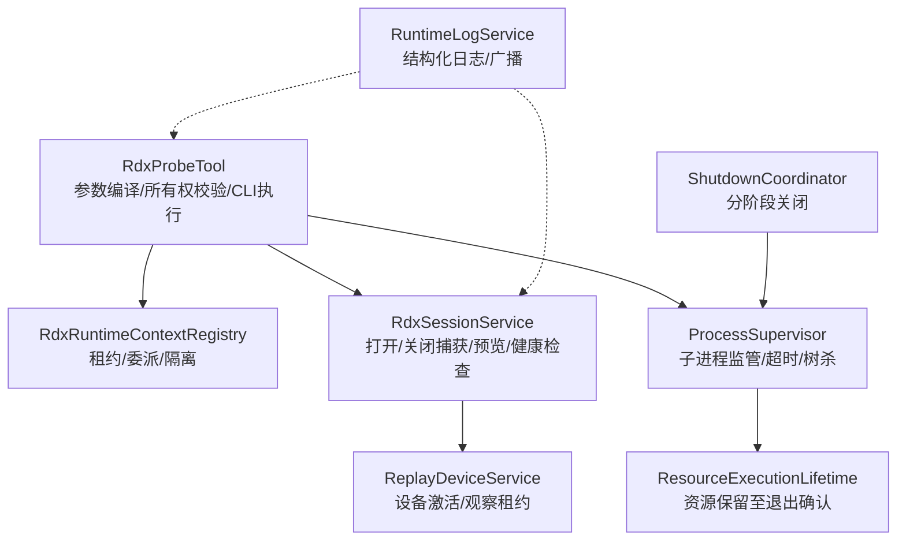
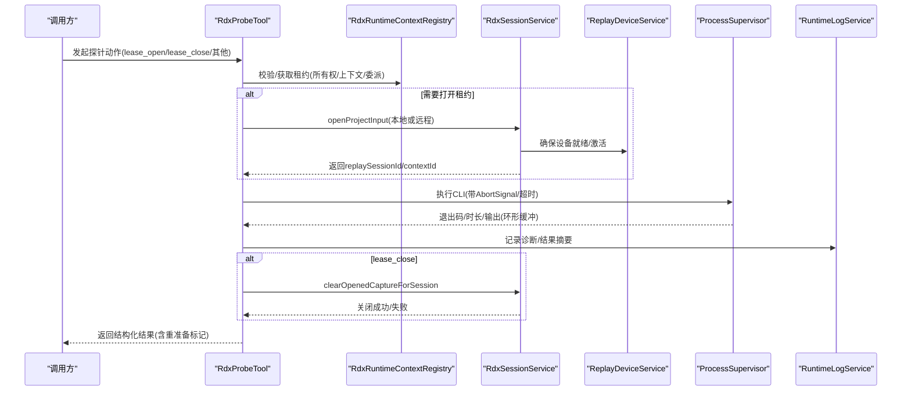
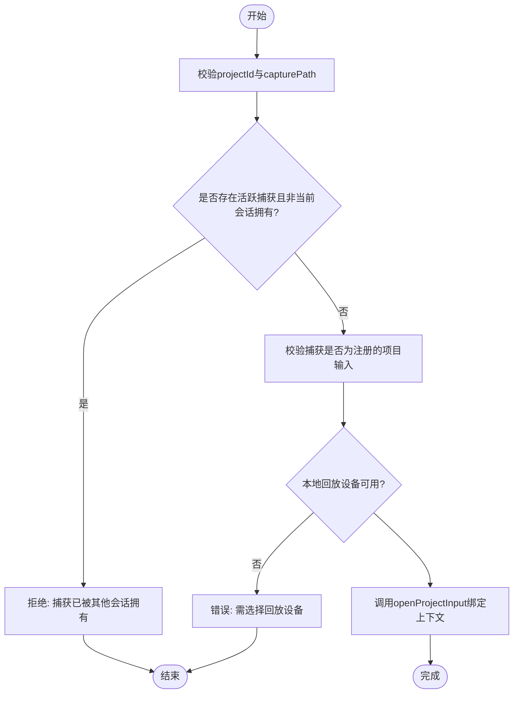
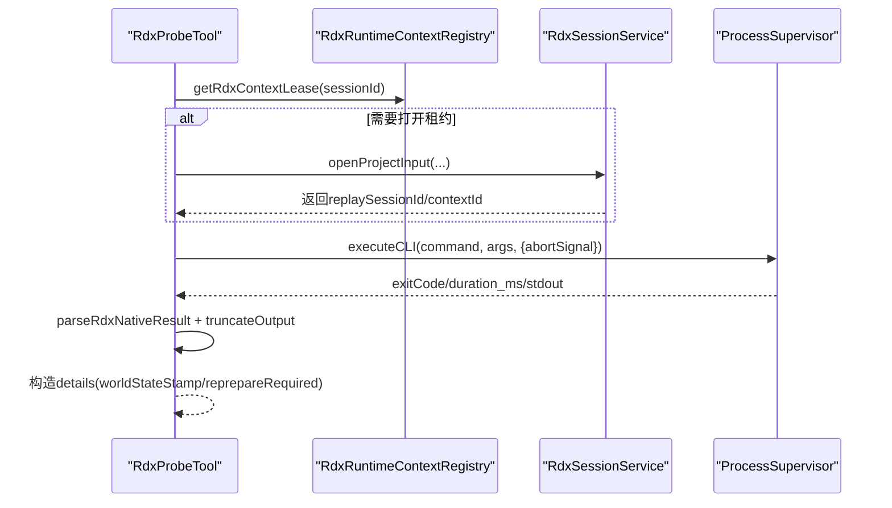
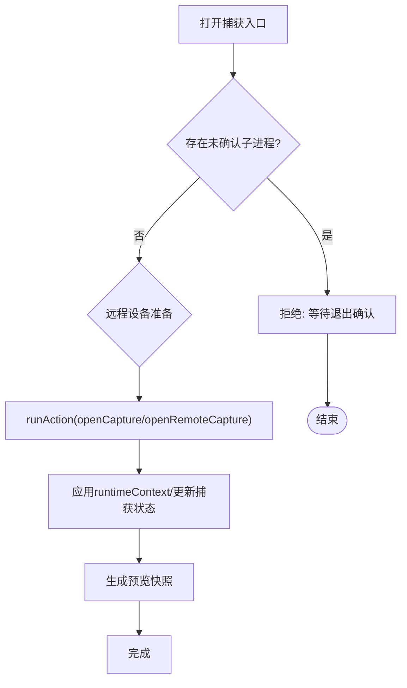
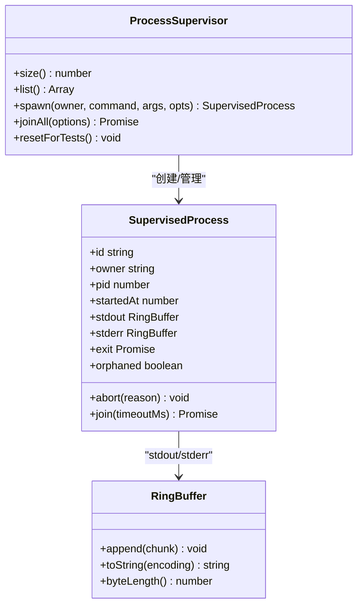
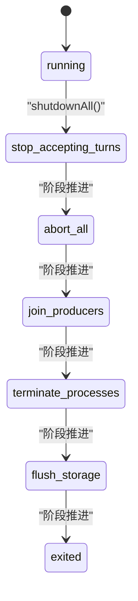
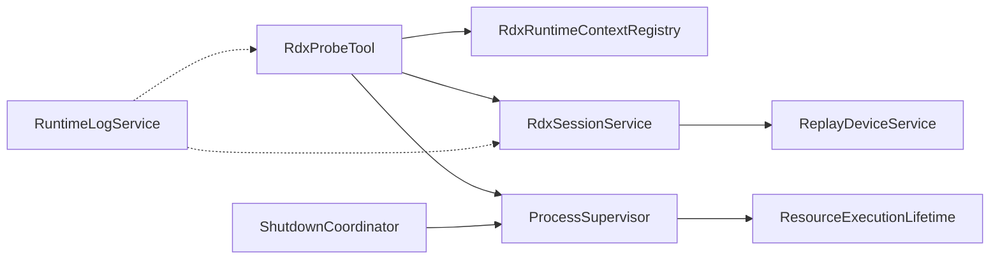

# 探针生命周期管理

<cite>
**本文引用的文件**
- [RdxProbeLifecycle.ts](file://src/main/tools/RdxProbeLifecycle.ts)
- [RdxProbeTool.ts](file://src/main/workflow/debugger/RdxProbeTool.ts)
- [RdxRuntimeContextRegistry.ts](file://src/main/sessions/RdxRuntimeContextRegistry.ts)
- [RdxSessionService.ts](file://src/main/sessions/RdxSessionService.ts)
- [ProcessSupervisor.ts](file://src/main/runtime/ProcessSupervisor.ts)
- [ResourceExecutionLifetime.ts](file://src/main/runtime/ResourceExecutionLifetime.ts)
- [ShutdownCoordinator.ts](file://src/main/lifecycle/ShutdownCoordinator.ts)
- [RuntimeLogService.ts](file://src/main/runtime/RuntimeLogService.ts)
- [ReplayDeviceService.ts](file://src/main/captures/ReplayDeviceService.ts)
</cite>

## 目录
1. [简介](#简介)
2. [项目结构](#项目结构)
3. [核心组件](#核心组件)
4. [架构总览](#架构总览)
5. [详细组件分析](#详细组件分析)
6. [依赖关系分析](#依赖关系分析)
7. [性能与可观测性](#性能与可观测性)
8. [故障排查指南](#故障排查指南)
9. [结论](#结论)
10. [附录：最佳实践与恢复方案](#附录：最佳实践与恢复方案)

## 简介
本文件围绕 RDX 探针的生命周期管理，系统性说明探针从启动、运行监控到优雅关闭的完整流程。重点覆盖以下方面：
- 进程状态管理与租约（Lease）机制
- 健康检查、自动重启策略与异常恢复
- 资源泄漏检测与隔离
- 状态同步、事件通知与诊断信息收集
- 性能监控指标与日志采集
- 生命周期管理的最佳实践与故障恢复方案

## 项目结构
探针生命周期由“工具层—会话服务—运行时上下文—进程监管—关机协调”构成，关键路径如下：
- 工具层：RdxProbeTool 负责编译参数、校验所有权、执行 CLI 并封装结果
- 会话服务：RdxSessionService 负责打开/关闭捕获、设备准备、预览与健康检查
- 运行时上下文：RdxRuntimeContextRegistry 维护 per-session 的 RDX 上下文租约与委派
- 进程监管：ProcessSupervisor 统一子进程注册、超时/中止、树杀与退出确认
- 关机协调：ShutdownCoordinator 提供分阶段有序关闭
- 辅助能力：ResourceExecutionLifetime 用于资源保留至退出确认；RuntimeLogService 提供结构化日志；ReplayDeviceService 处理设备激活与观察租约

**图示来源**
- [RdxProbeTool.ts:24-127](file://src/main/workflow/debugger/RdxProbeTool.ts#L24-L127)
- [RdxRuntimeContextRegistry.ts:61-154](file://src/main/sessions/RdxRuntimeContextRegistry.ts#L61-L154)
- [RdxSessionService.ts:69-200](file://src/main/sessions/RdxSessionService.ts#L69-L200)
- [ProcessSupervisor.ts:140-425](file://src/main/runtime/ProcessSupervisor.ts#L140-L425)
- [ResourceExecutionLifetime.ts:1-21](file://src/main/runtime/ResourceExecutionLifetime.ts#L1-L21)
- [ShutdownCoordinator.ts:35-113](file://src/main/lifecycle/ShutdownCoordinator.ts#L35-L113)
- [RuntimeLogService.ts:94-156](file://src/main/runtime/RuntimeLogService.ts#L94-L156)
- [ReplayDeviceService.ts:187-229](file://src/main/captures/ReplayDeviceService.ts#L187-L229)

**章节来源**
- [RdxProbeTool.ts:24-127](file://src/main/workflow/debugger/RdxProbeTool.ts#L24-L127)
- [RdxRuntimeContextRegistry.ts:61-154](file://src/main/sessions/RdxRuntimeContextRegistry.ts#L61-L154)
- [RdxSessionService.ts:69-200](file://src/main/sessions/RdxSessionService.ts#L69-L200)
- [ProcessSupervisor.ts:140-425](file://src/main/runtime/ProcessSupervisor.ts#L140-L425)
- [ResourceExecutionLifetime.ts:1-21](file://src/main/runtime/ResourceExecutionLifetime.ts#L1-L21)
- [ShutdownCoordinator.ts:35-113](file://src/main/lifecycle/ShutdownCoordinator.ts#L35-L113)
- [RuntimeLogService.ts:94-156](file://src/main/runtime/RuntimeLogService.ts#L94-L156)
- [ReplayDeviceService.ts:187-229](file://src/main/captures/ReplayDeviceService.ts#L187-L229)

## 核心组件
- RdxProbeLifecycle：封装探针租约的打开与关闭，复用产品捕获生命周期，禁止为任意 contextId 创建租约
- RdxProbeTool：将探针动作编译为 CLI 调用，进行所有权校验、上下文绑定、结果解析与截断输出
- RdxRuntimeContextRegistry：维护 per-session 的 RDX 上下文租约、委派、隔离与版本控制
- RdxSessionService：打开/关闭捕获、远程/本地回放设备准备、预览与健康检查、错误诊断格式化
- ProcessSupervisor：子进程统一注册、超时/中止、信号终止、孤儿进程处理与退出确认
- ResourceExecutionLifetime：在当前执行上下文中保留资源直到子进程退出被确认
- ShutdownCoordinator：分阶段有序关闭，支持强制退出与超时保护
- RuntimeLogService：结构化日志写入、限流、脱敏与广播
- ReplayDeviceService：设备激活、并发保护、观察租约到期与刷新调度

**章节来源**
- [RdxProbeLifecycle.ts:1-45](file://src/main/tools/RdxProbeLifecycle.ts#L1-L45)
- [RdxProbeTool.ts:24-127](file://src/main/workflow/debugger/RdxProbeTool.ts#L24-L127)
- [RdxRuntimeContextRegistry.ts:61-268](file://src/main/sessions/RdxRuntimeContextRegistry.ts#L61-L268)
- [RdxSessionService.ts:69-200](file://src/main/sessions/RdxSessionService.ts#L69-L200)
- [ProcessSupervisor.ts:140-425](file://src/main/runtime/ProcessSupervisor.ts#L140-L425)
- [ResourceExecutionLifetime.ts:1-21](file://src/main/runtime/ResourceExecutionLifetime.ts#L1-L21)
- [ShutdownCoordinator.ts:35-113](file://src/main/lifecycle/ShutdownCoordinator.ts#L35-L113)
- [RuntimeLogService.ts:94-156](file://src/main/runtime/RuntimeLogService.ts#L94-L156)
- [ReplayDeviceService.ts:187-229](file://src/main/captures/ReplayDeviceService.ts#L187-L229)

## 架构总览
探针生命周期贯穿“请求进入—租约校验—设备准备—CLI执行—结果返回—租约释放—进程回收—日志记录”的闭环。关键交互如下：

**图示来源**
- [RdxProbeTool.ts:24-127](file://src/main/workflow/debugger/RdxProbeTool.ts#L24-L127)
- [RdxRuntimeContextRegistry.ts:61-154](file://src/main/sessions/RdxRuntimeContextRegistry.ts#L61-L154)
- [RdxSessionService.ts:69-200](file://src/main/sessions/RdxSessionService.ts#L69-L200)
- [ProcessSupervisor.ts:167-394](file://src/main/runtime/ProcessSupervisor.ts#L167-L394)
- [RuntimeLogService.ts:94-156](file://src/main/runtime/RuntimeLogService.ts#L94-L156)

## 详细组件分析

### 探针租约与上下文管理（RdxProbeLifecycle + RdxRuntimeContextRegistry）
- 打开租约（openProbeLease）
  - 校验项目与捕获输入是否已注册且匹配当前会话
  - 禁止为任意 contextId 创建租约，必须复用产品捕获生命周期
  - 通过 ReplayDeviceService 获取本地设备，再调用 RdxSessionService.openProjectInput 完成上下文绑定
- 关闭租约（closeProbeLease）
  - 防止在委派执行未结束或父捕获被误关时关闭
  - 调用 RdxSessionService.clearOpenedCaptureForSession 清理会话级捕获状态
- 租约模型（RdxContextLease）
  - 包含 contextId、version、ownerSessionId、ownerProjectId、captureHash、runtimeContext、updatedAt 等
  - 支持委派（delegatedFrom）、隔离（quarantineReason）与版本一致性校验
  - 提供 assertRdxContextLeaseOwnership 进行严格的所有权验证

**图示来源**
- [RdxProbeLifecycle.ts:7-32](file://src/main/tools/RdxProbeLifecycle.ts#L7-L32)
- [RdxRuntimeContextRegistry.ts:61-154](file://src/main/sessions/RdxRuntimeContextRegistry.ts#L61-L154)

**章节来源**
- [RdxProbeLifecycle.ts:7-44](file://src/main/tools/RdxProbeLifecycle.ts#L7-L44)
- [RdxRuntimeContextRegistry.ts:61-268](file://src/main/sessions/RdxRuntimeContextRegistry.ts#L61-L268)

### 探针工具执行与所有权校验（RdxProbeTool）
- 参数编译与动作枚举：将高层 action 编译为底层 CLI 命令与参数
- 所有权与上下文校验：
  - 校验租约归属、contextId 一致性、委派状态与隔离原因
  - 若检测到 RDX 运行时身份变化，返回 reprepareRequired 提示上层重新准备 turn
- 执行与结果：
  - 使用冻结设置注入 --json，执行 CLI，解析原生结果
  - 输出截断与时长统计，附带 worldStateStamp（sessionId/contextId/version）
- 租约生命周期：
  - lease_open：必要时打开租约并更新上下文
  - lease_close：必要时关闭租约并清理状态

**图示来源**
- [RdxProbeTool.ts:24-127](file://src/main/workflow/debugger/RdxProbeTool.ts#L24-L127)
- [RdxRuntimeContextRegistry.ts:103-154](file://src/main/sessions/RdxRuntimeContextRegistry.ts#L103-L154)
- [RdxSessionService.ts:69-200](file://src/main/sessions/RdxSessionService.ts#L69-L200)
- [ProcessSupervisor.ts:167-394](file://src/main/runtime/ProcessSupervisor.ts#L167-L394)

**章节来源**
- [RdxProbeTool.ts:24-127](file://src/main/workflow/debugger/RdxProbeTool.ts#L24-L127)

### 会话服务与设备管理（RdxSessionService + ReplayDeviceService）
- 打开捕获（openProjectInput）
  - 检查是否有未确认的子进程退出，避免恢复阻塞
  - 区分本地与远程回放：远程需 ensureReplayDeviceReady 与 consumePreparedRemote
  - 调用 rdxShellActionService.runAction 执行 openCapture/openRemoteCapture
  - 提取 runtimeContext 并应用至会话，更新捕获状态与预览
- 关闭捕获（clearOpenedCaptureForSession）
  - 清理 daemon context 与会话级 opened capture 状态
- 设备管理（ReplayDeviceService）
  - activateDevice 并发保护与去重
  - scheduleWatchLeaseExpiry 观察租约到期后停止 watch
  - runRefresh 串行刷新，避免重复工作

**图示来源**
- [RdxSessionService.ts:69-200](file://src/main/sessions/RdxSessionService.ts#L69-L200)
- [ReplayDeviceService.ts:187-229](file://src/main/captures/ReplayDeviceService.ts#L187-L229)

**章节来源**
- [RdxSessionService.ts:69-200](file://src/main/sessions/RdxSessionService.ts#L69-L200)
- [ReplayDeviceService.ts:187-229](file://src/main/captures/ReplayDeviceService.ts#L187-L229)

### 进程监管与资源保留（ProcessSupervisor + ResourceExecutionLifetime）
- 子进程生命周期
  - spawn：注册进程、stdout/stderr 环形缓冲、超时与中止处理
  - abort：发送 SIGTERM，宽限期后 SIGKILL（Windows 使用 taskkill /T /F）
  - join：支持超时与孤儿进程检测（unconfirmed_orphan），保留资源直至 close 事件
- 资源保留
  - retainResourceUntilExit：在当前执行上下文中保留 Promise，直到子进程退出被确认
  - withProcessExecutionOwner：标记执行所有者，便于追踪与审计

**图示来源**
- [ProcessSupervisor.ts:140-425](file://src/main/runtime/ProcessSupervisor.ts#L140-L425)
- [ResourceExecutionLifetime.ts:1-21](file://src/main/runtime/ResourceExecutionLifetime.ts#L1-L21)

**章节来源**
- [ProcessSupervisor.ts:140-425](file://src/main/runtime/ProcessSupervisor.ts#L140-L425)
- [ResourceExecutionLifetime.ts:1-21](file://src/main/runtime/ResourceExecutionLifetime.ts#L1-L21)

### 优雅关闭与阶段化停机（ShutdownCoordinator）
- 阶段顺序：stop_accepting_turns → abort_all → join_producers → terminate_processes → flush_storage → exited
- 每个阶段并行执行注册的 disposable，支持超时保护与强制退出回调
- 与进程监管集成：在 terminate_processes 阶段对所有受管进程执行 abort 并等待退出

**图示来源**
- [ShutdownCoordinator.ts:35-113](file://src/main/lifecycle/ShutdownCoordinator.ts#L35-L113)

**章节来源**
- [ShutdownCoordinator.ts:35-113](file://src/main/lifecycle/ShutdownCoordinator.ts#L35-L113)

## 依赖关系分析
- RdxProbeTool 依赖 RdxRuntimeContextRegistry 进行所有权校验，依赖 RdxSessionService 进行捕获打开/关闭，依赖 ProcessSupervisor 执行 CLI
- RdxSessionService 依赖 ReplayDeviceService 进行设备准备与观察租约管理
- ProcessSupervisor 依赖 ResourceExecutionLifetime 进行资源保留与执行所有者追踪
- ShutdownCoordinator 与 ProcessSupervisor 协同完成优雅关闭
- RuntimeLogService 贯穿各组件，提供结构化日志与广播

**图示来源**
- [RdxProbeTool.ts:24-127](file://src/main/workflow/debugger/RdxProbeTool.ts#L24-L127)
- [RdxRuntimeContextRegistry.ts:61-154](file://src/main/sessions/RdxRuntimeContextRegistry.ts#L61-L154)
- [RdxSessionService.ts:69-200](file://src/main/sessions/RdxSessionService.ts#L69-L200)
- [ProcessSupervisor.ts:140-425](file://src/main/runtime/ProcessSupervisor.ts#L140-L425)
- [ResourceExecutionLifetime.ts:1-21](file://src/main/runtime/ResourceExecutionLifetime.ts#L1-L21)
- [ShutdownCoordinator.ts:35-113](file://src/main/lifecycle/ShutdownCoordinator.ts#L35-L113)
- [RuntimeLogService.ts:94-156](file://src/main/runtime/RuntimeLogService.ts#L94-L156)

**章节来源**
- [RdxProbeTool.ts:24-127](file://src/main/workflow/debugger/RdxProbeTool.ts#L24-L127)
- [RdxRuntimeContextRegistry.ts:61-154](file://src/main/sessions/RdxRuntimeContextRegistry.ts#L61-L154)
- [RdxSessionService.ts:69-200](file://src/main/sessions/RdxSessionService.ts#L69-L200)
- [ProcessSupervisor.ts:140-425](file://src/main/runtime/ProcessSupervisor.ts#L140-L425)
- [ResourceExecutionLifetime.ts:1-21](file://src/main/runtime/ResourceExecutionLifetime.ts#L1-L21)
- [ShutdownCoordinator.ts:35-113](file://src/main/lifecycle/ShutdownCoordinator.ts#L35-L113)
- [RuntimeLogService.ts:94-156](file://src/main/runtime/RuntimeLogService.ts#L94-L156)

## 性能与可观测性
- 进程输出环形缓冲：stdout/stderr 默认 256 KiB，避免内存无限增长
- 日志条目大小限制：单条日志最大 64 KiB，自动截断与脱敏
- 会话与应用日志分离：按 session/app 维度限流（会话 500 条，应用 1000 条）
- 诊断与度量：
  - CLI 执行耗时 duration_ms、退出码 exitCode、输出截断标志 truncated
  - 世界状态戳 worldStateStamp（sessionId/contextId/version）用于一致性校验
  - 重准备标记 reprepareRequired 指示运行时身份变化需重新准备 turn
- 设备观察租约：watchLeaseDeadline 到期后自动停止 watch，避免资源泄露

**章节来源**
- [ProcessSupervisor.ts:74-102](file://src/main/runtime/ProcessSupervisor.ts#L74-L102)
- [RuntimeLogService.ts:12-156](file://src/main/runtime/RuntimeLogService.ts#L12-L156)
- [RdxProbeTool.ts:106-123](file://src/main/workflow/debugger/RdxProbeTool.ts#L106-L123)
- [ReplayDeviceService.ts:187-199](file://src/main/captures/ReplayDeviceService.ts#L187-L199)

## 故障排查指南
- 常见错误码与含义
  - RDX_PROBE_CAPTURE_REQUIRED：未先打开注册的项目捕获
  - RDX_PROBE_OWNER：会话/项目不匹配、上下文不合法、委派冲突或租约变更
  - RDX_PROBE_DEVICE_REQUIRED：未选择回放设备
  - RDX_LEASE_DUAL_OWNER：委派执行未结束或双重拥有冲突
  - LOCAL_REPLAY_UNSUPPORTED：本地回放不支持或失败
- 排查步骤
  - 检查租约所有权与上下文一致性（assertRdxContextLeaseOwnership）
  - 确认设备状态与远程准备（ensureReplayDeviceReady/consumePreparedRemote）
  - 查看子进程退出原因（timeout/signal/unconfirmed_orphan/spawn_failed）
  - 检索 RuntimeLogService 中的相关日志条目（session/app 维度）
  - 若 reprepareRequired 为真，重新准备 turn 后再执行后续操作

**章节来源**
- [RdxProbeLifecycle.ts:10-44](file://src/main/tools/RdxProbeLifecycle.ts#L10-L44)
- [RdxRuntimeContextRegistry.ts:134-154](file://src/main/sessions/RdxRuntimeContextRegistry.ts#L134-L154)
- [RdxSessionService.ts:142-186](file://src/main/sessions/RdxSessionService.ts#L142-L186)
- [ProcessSupervisor.ts:18-72](file://src/main/runtime/ProcessSupervisor.ts#L18-L72)
- [RuntimeLogService.ts:94-156](file://src/main/runtime/RuntimeLogService.ts#L94-L156)

## 结论
RDX 探针生命周期以“租约为中心、会话服务为枢纽、进程监管为保障、关机协调为兜底”，形成安全、可观测、可恢复的执行闭环。通过严格的租约所有权校验、设备准备与观察租约管理、进程超时与孤儿检测、以及结构化日志与诊断输出，系统能够在复杂环境下保持稳健运行并快速定位问题。

## 附录：最佳实践与恢复方案
- 启动前准备
  - 确保已打开注册的项目捕获并选择回放设备
  - 使用冻结的 action binding 与 --json 模式执行 CLI
  - 对需要上下文的动作，先 lease_open 并校验 ownership/contextId
- 运行中监控
  - 关注 reprepareRequired 与世界状态戳，及时重新准备 turn
  - 利用 RuntimeLogService 的 session/app 日志与诊断字段进行排障
  - 对远程回放，确保设备在线与 prepared remote 有效
- 关闭与回收
  - 优先调用 lease_close 清理租约，再触发 ShutdownCoordinator 分阶段关闭
  - 对长时间运行的 CLI，设置合理 timeoutMs 与 AbortSignal
  - 遇到 unconfirmed_orphan，等待 child.close 或通过 joinExecutionProcesses 聚合等待
- 异常恢复
  - 委派执行结束后，若未确认退出，应 quarantine 父租约并拒绝进一步执行
  - 对 LOCAL_REPLAY_UNSUPPORTED，根据 diagnostic 提示切换设备或修复环境
  - 对权限/信任问题（如 MCP/Hook），遵循 trust/revoke 流程后再重试

[无章节来源：本节为通用指导，不直接分析具体文件]