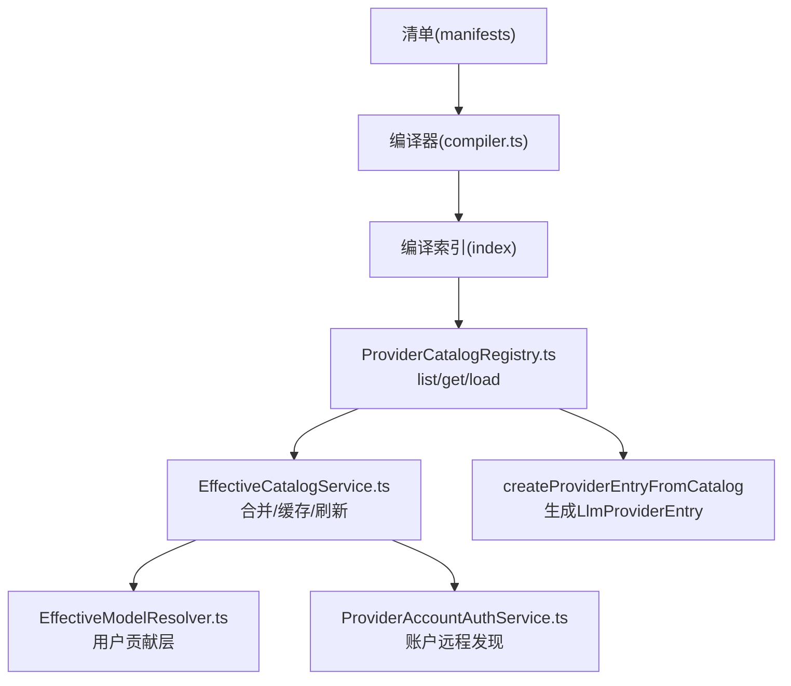
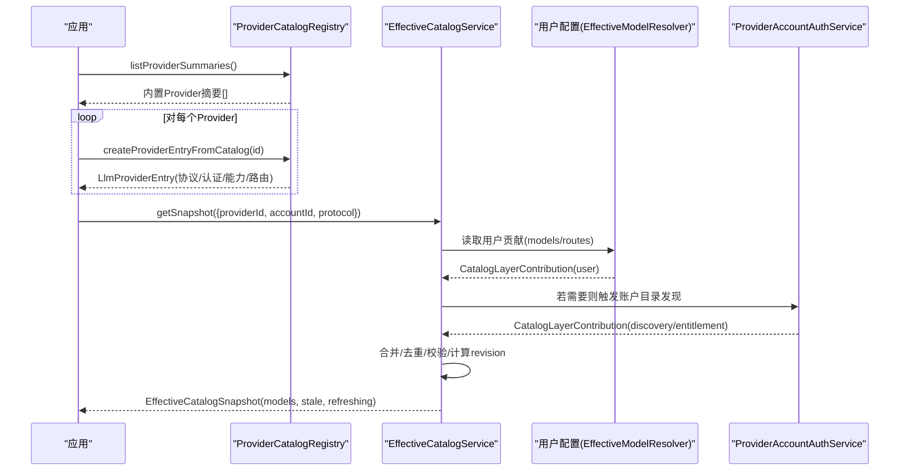
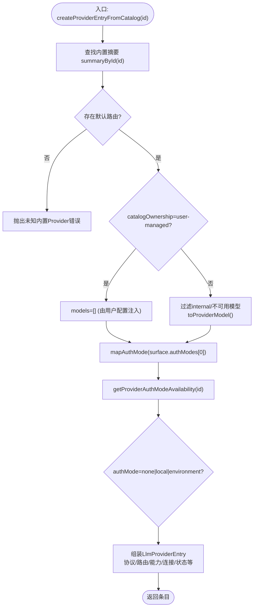
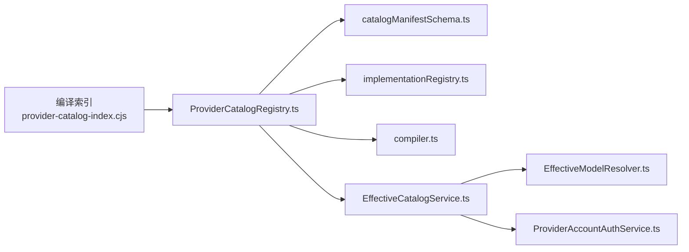

# Provider发现机制

<cite>
**本文引用的文件**
- [ProviderCatalogRegistry.ts](file://src/main/provider-catalog/ProviderCatalogRegistry.ts)
- [compiler.ts](file://src/shared/provider-catalog/compiler.ts)
- [catalogManifestSchema.ts](file://src/shared/provider-catalog/catalogManifestSchema.ts)
- [implementationRegistry.ts](file://src/shared/provider-catalog/implementationRegistry.ts)
- [EffectiveCatalogService.ts](file://src/main/settings/EffectiveCatalogService.ts)
- [effectiveModelResolver.ts](file://src/main/settings/EffectiveModelResolver.ts)
- [ProviderAccountAuthService.ts](file://src/main/settings/ProviderAccountAuthService.ts)
- [provider-catalog-index.cjs](file://scripts/provider-catalog-index.cjs)
</cite>

## 目录
1. [简介](#简介)
2. [项目结构](#项目结构)
3. [核心组件](#核心组件)
4. [架构总览](#架构总览)
5. [详细组件分析](#详细组件分析)
6. [依赖关系分析](#依赖关系分析)
7. [性能考量](#性能考量)
8. [故障排查指南](#故障排查指南)
9. [结论](#结论)

## 简介
本文件系统性解析 RDC-Agent 的 Provider 发现与注册机制，重点围绕以下目标：
- 深入说明 ProviderCatalogRegistry 的目录注册与发现算法
- 解释 createProviderEntryFromCatalog 的实现原理（元数据提取、能力探测、版本兼容性检查）
- 阐述 listProviderSummaries 的工作原理及多来源聚合（内置、用户配置、远程）
- 梳理 Provider 分类体系、协议支持检测、认证模式识别的实现细节
- 提供端到端的流程示例，展示从发现到注册的完整链路

## 项目结构
Provider 发现机制由“编译期目录 + 运行时服务”两部分组成：
- 编译期：将声明式清单（manifests）编译为紧凑索引与可加载表面（surface），供运行时快速消费
- 运行时：基于内置目录构建基础 Provider 条目，结合用户配置与账户远程发现，生成最终可用模型集合

图表来源
- [provider-catalog-index.cjs:1-19](file://scripts/provider-catalog-index.cjs#L1-L19)
- [compiler.ts:622-716](file://src/shared/provider-catalog/compiler.ts#L622-L716)
- [ProviderCatalogRegistry.ts:106-270](file://src/main/provider-catalog/ProviderCatalogRegistry.ts#L106-L270)
- [EffectiveCatalogService.ts:150-244](file://src/main/settings/EffectiveCatalogService.ts#L150-L244)
- [effectiveModelResolver.ts:233-263](file://src/main/settings/EffectiveModelResolver.ts#L233-L263)
- [ProviderAccountAuthService.ts:296-473](file://src/main/settings/ProviderAccountAuthService.ts#L296-L473)

章节来源
- [provider-catalog-index.cjs:1-19](file://scripts/provider-catalog-index.cjs#L1-L19)
- [compiler.ts:622-716](file://src/shared/provider-catalog/compiler.ts#L622-L716)
- [ProviderCatalogRegistry.ts:106-270](file://src/main/provider-catalog/ProviderCatalogRegistry.ts#L106-L270)

## 核心组件
- 编译期目录与索引
  - 清单编译与校验：compiler.ts 负责将 identity/profile/surface 等清单编译为带 revision 的索引与 surface，并进行严格校验（协议、适配器、能力、冲突等）
  - 索引加载：provider-catalog-index.cjs 导出 index 和按需加载 surface 的能力
- 运行时目录服务
  - ProviderCatalogRegistry.ts：提供 listProviderSummaries、loadProviderSurface、createProviderEntryFromCatalog 等接口，封装内置目录的读取、缓存、版本一致性检查与条目构造
- 有效目录与服务
  - EffectiveCatalogService.ts：管理 discovery/entitlement/observed 等多层贡献，执行 TTL、回退、持久化与监听广播
  - EffectiveModelResolver.ts：将用户配置的 models/routes 等转换为 CatalogLayerContribution，参与合并
  - ProviderAccountAuthService.ts：针对账户类 Provider 进行远程目录发现（OAuth/设备码等），产出 account catalog 贡献

章节来源
- [compiler.ts:622-716](file://src/shared/provider-catalog/compiler.ts#L622-L716)
- [ProviderCatalogRegistry.ts:106-270](file://src/main/provider-catalog/ProviderCatalogRegistry.ts#L106-L270)
- [EffectiveCatalogService.ts:150-244](file://src/main/settings/EffectiveCatalogService.ts#L150-L244)
- [effectiveModelResolver.ts:233-263](file://src/main/settings/EffectiveModelResolver.ts#L233-L263)
- [ProviderAccountAuthService.ts:296-473](file://src/main/settings/ProviderAccountAuthService.ts#L296-L473)

## 架构总览
Provider 发现的整体流程如下：
1) 启动时加载编译后的内置目录索引（schemaVersion/catalogRevision/surfaces）
2) 通过 listProviderSummaries 获取所有内置 Provider 摘要
3) 对每个 Provider 调用 createProviderEntryFromCatalog 生成初始 LlmProviderEntry（含协议、认证模式、默认路由、能力、推荐模型等）
4) 根据 Provider 类型与用户配置，进入 EffectiveCatalogService 的多层合并：
   - 内置层（catalog）
   - 用户配置层（user）
   - 账户远程发现层（account/discovery）
   - 运行时观测层（observed）
5) 输出最终的 EffectiveCatalogSnapshot，包含稳定化的 catalogRevision、模型列表、配额与证据等

图表来源
- [ProviderCatalogRegistry.ts:110-270](file://src/main/provider-catalog/ProviderCatalogRegistry.ts#L110-L270)
- [EffectiveCatalogService.ts:150-244](file://src/main/settings/EffectiveCatalogService.ts#L150-L244)
- [effectiveModelResolver.ts:233-263](file://src/main/settings/EffectiveModelResolver.ts#L233-L263)
- [ProviderAccountAuthService.ts:296-473](file://src/main/settings/ProviderAccountAuthService.ts#L296-L473)

## 详细组件分析

### ProviderCatalogRegistry：目录注册与发现算法
- 索引加载与校验
  - 通过虚拟模块导入编译后的索引，并校验 schemaVersion/catalogRevision/surfaces 等字段
  - 若索引无效直接抛出错误，确保运行期安全
- 表面加载与缓存
  - loadProviderSurface 按 id 懒加载 surface，使用 Map 缓存已加载结果，避免重复 IO
  - 解析时校验 schemaVersion 与 catalogRevision 一致，防止版本不匹配
- 摘要与模型查询
  - listProviderSummaries 返回克隆后的 surfaces 摘要
  - getProviderModelSummaries 过滤 internal 可见性，并按 presencePolicy 调整 availability
- 认证模式映射与可用性
  - mapAuthMode 将原始 authModes 映射为统一枚举（none/api-key/oauth/device/environment/local/account）
  - getProviderAuthModeAvailability 聚合每种认证模式的可用性，考虑 provider 级与 mode 级 availability
- 创建 Provider 条目
  - createProviderEntryFromCatalog 综合路由、认证模式、能力、连接模式、推荐模型等，生成 LlmProviderEntry
  - 对 user-managed 目录仅暴露空 models（由用户配置注入），非 user-managed 则暴露筛选后的内置模型
- 工具方法
  - defaultRoute、getProviderDefaultBaseUrl、isBuiltinProviderId、getProviderCatalogOwnership 等辅助函数

章节来源
- [ProviderCatalogRegistry.ts:21-270](file://src/main/provider-catalog/ProviderCatalogRegistry.ts#L21-L270)

#### 关键流程图：createProviderEntryFromCatalog

图表来源
- [ProviderCatalogRegistry.ts:210-266](file://src/main/provider-catalog/ProviderCatalogRegistry.ts#L210-L266)

### 编译期目录与清单校验（compiler.ts）
- 编译入口 compileProviderCatalog
  - 解析 identities/profiles/surfaces，排序并去重
  - 校验 identity 数量与快照一致性
  - 校验 surface 的 category/endpointClass/ownership 形状、profile 引用、authSchema、discoveryPolicy
  - 校验 routes 的 adapterId 与协议支持、baseUrl、contracts、协议所有者
  - 校验 models 的 factSource、contextTiers、executionBindings、routeOptions、recommendedModels、protocolOverrides
  - 生成 catalogRevision（稳定哈希）与 summaries/index
- 公开契约与策略
  - DiscoveryStrategySchema 支持 json-catalog/custom-parser/null
  - CatalogFactSourceSchema 记录来源种类（models.dev/opencode/hermes/rdc-agent 等）
  - PROVIDER_ADAPTER_IMPLEMENTATIONS 定义适配器与协议映射，用于协议支持检测
  - PROVIDER_AUTH_SCHEMA_IDS / PROVIDER_DISCOVERY_POLICY_IDS 限定认证与发现策略白名单

章节来源
- [compiler.ts:97-620](file://src/shared/provider-catalog/compiler.ts#L97-L620)
- [compiler.ts:622-716](file://src/shared/provider-catalog/compiler.ts#L622-L716)
- [catalogManifestSchema.ts:97-235](file://src/shared/provider-catalog/catalogManifestSchema.ts#L97-L235)
- [implementationRegistry.ts:31-178](file://src/shared/provider-catalog/implementationRegistry.ts#L31-L178)

### 有效目录服务（EffectiveCatalogService）
- 多层贡献合并
  - 维护 discoveries/entitlements/observed 三层贡献，按请求键（providerId/accountId/protocol）缓存
  - 支持 discoveryTTL、失败回退（指数退避）、持久化与监听广播
- 快照生成
  - createSnapshot 合并各层贡献，计算 catalogRevision，标记 stale/refreshing，附加 quota/evidence
- 刷新与失效
  - refreshDiscovery 异步刷新 discovery 层，写入持久化状态并通知订阅者
  - invalidateDiscovery 清理相关缓存与观察证据，触发重新计算

章节来源
- [EffectiveCatalogService.ts:84-453](file://src/main/settings/EffectiveCatalogService.ts#L84-L453)

### 用户配置层（EffectiveModelResolver）
- 将用户配置的 models/routes/authMode/connectionValues 等转换为 CatalogLayerContribution
- 对 user-managed 且 additive 的 surface，允许暴露完整的 route matrix 作为 per-model 选项
- 与内置目录合并后，形成最终可用模型集

章节来源
- [effectiveModelResolver.ts:233-263](file://src/main/settings/EffectiveModelResolver.ts#L233-L263)

### 账户远程发现（ProviderAccountAuthService）
- 针对账户类 Provider（如 github-copilot/chatgpt-account/claude-account/grok-account/nous/openrouter）
- 通过 OAuth/设备码等方式获取访问令牌，调用各自 API 拉取账户目录（models/entitlements）
- 将 discovery/entitlement 贡献写入 EffectiveCatalogService，参与合并

章节来源
- [ProviderAccountAuthService.ts:296-473](file://src/main/settings/ProviderAccountAuthService.ts#L296-L473)

### Provider 分类体系、协议支持与认证模式识别
- 分类体系（category）
  - login-authorization / official-direct / cloud-platform / coding-token-plan / compatible-access / local
  - 对应 surfaceKind/endpointClass/endpointOwnership 的形状约束，保证语义一致性
- 协议支持检测
  - 通过 implementationRegistry.ts 中的 PROVIDER_ADAPTER_IMPLEMENTATIONS 判断某 adapter 是否支持指定 protocol
  - 编译期校验 route.adapterId 与 route.protocol 的匹配性
- 认证模式识别
  - 清单中声明 authModes（none/api-key/oauth/device/environment/local）
  - 运行时 mapAuthMode 归一化为 account/api-key/environment/local/none
  - getProviderAuthModeAvailability 聚合每种模式的可用性，考虑 provider 级与 mode 级 availability

章节来源
- [catalogManifestSchema.ts:148-235](file://src/shared/provider-catalog/catalogManifestSchema.ts#L148-L235)
- [implementationRegistry.ts:120-178](file://src/shared/provider-catalog/implementationRegistry.ts#L120-L178)
- [ProviderCatalogRegistry.ts:64-73](file://src/main/provider-catalog/ProviderCatalogRegistry.ts#L64-L73)

## 依赖关系分析

图表来源
- [provider-catalog-index.cjs:1-19](file://scripts/provider-catalog-index.cjs#L1-L19)
- [ProviderCatalogRegistry.ts:1-270](file://src/main/provider-catalog/ProviderCatalogRegistry.ts#L1-L270)
- [compiler.ts:622-716](file://src/shared/provider-catalog/compiler.ts#L622-L716)
- [catalogManifestSchema.ts:148-235](file://src/shared/provider-catalog/catalogManifestSchema.ts#L148-L235)
- [implementationRegistry.ts:120-178](file://src/shared/provider-catalog/implementationRegistry.ts#L120-L178)
- [EffectiveCatalogService.ts:150-244](file://src/main/settings/EffectiveCatalogService.ts#L150-L244)
- [effectiveModelResolver.ts:233-263](file://src/main/settings/EffectiveModelResolver.ts#L233-L263)
- [ProviderAccountAuthService.ts:296-473](file://src/main/settings/ProviderAccountAuthService.ts#L296-L473)

章节来源
- [ProviderCatalogRegistry.ts:1-270](file://src/main/provider-catalog/ProviderCatalogRegistry.ts#L1-L270)
- [compiler.ts:622-716](file://src/shared/provider-catalog/compiler.ts#L622-L716)
- [EffectiveCatalogService.ts:150-244](file://src/main/settings/EffectiveCatalogService.ts#L150-L244)

## 性能考量
- 懒加载与缓存
  - loadProviderSurface 使用 Map 缓存已加载 surface，避免重复 IO；并发加载通过 Promise 共享
- 版本一致性
  - 编译索引与 surface 均携带 schemaVersion/catalogRevision，解析时校验，防止不兼容数据
- 合并与快照
  - EffectiveCatalogService 对 discovery/entitlement/observed 分层缓存，按 TTL 过期与回退策略减少频繁刷新
  - 使用指纹去重 emit，避免无意义渲染更新
- 协议与适配器
  - 编译期校验协议与适配器支持，降低运行期错误成本

[本节为通用指导，无需具体文件引用]

## 故障排查指南
- 索引无效或版本不匹配
  - 现象：启动时报错“Bundled Provider Catalog index is invalid”或“Compiled Provider surface revision does not match the Catalog index”
  - 处理：检查编译脚本与清单一致性，确保 schemaVersion/catalogRevision 正确
  - 参考路径
    - [ProviderCatalogRegistry.ts:28-54](file://src/main/provider-catalog/ProviderCatalogRegistry.ts#L28-L54)
    - [compiler.ts:652-658](file://src/shared/provider-catalog/compiler.ts#L652-L658)
- 未知内置 Provider
  - 现象：createProviderEntryFromCatalog 抛出“Unknown builtin provider”
  - 处理：确认 id 存在于编译索引的 surfaces 中
  - 参考路径
    - [ProviderCatalogRegistry.ts:210-213](file://src/main/provider-catalog/ProviderCatalogRegistry.ts#L210-L213)
- 协议不支持
  - 现象：编译期报错“adapter does not implement protocol”
  - 处理：在 implementationRegistry 中添加/修正适配器协议映射
  - 参考路径
    - [compiler.ts:569-572](file://src/shared/provider-catalog/compiler.ts#L569-L572)
    - [implementationRegistry.ts:126-141](file://src/shared/provider-catalog/implementationRegistry.ts#L126-L141)
- 认证模式不可用
  - 现象：getProviderAuthModeAvailability 返回 unavailable/unset
  - 处理：检查 surface.authModes 与 authModeAvailability 配置，确认环境/凭据满足要求
  - 参考路径
    - [ProviderCatalogRegistry.ts:158-177](file://src/main/provider-catalog/ProviderCatalogRegistry.ts#L158-L177)
- 账户目录刷新失败
  - 现象：EffectiveCatalogService 记录 lastRefreshError，进入回退窗口
  - 处理：检查网络/凭据/速率限制，等待回退窗口后重试
  - 参考路径
    - [EffectiveCatalogService.ts:246-298](file://src/main/settings/EffectiveCatalogService.ts#L246-L298)
    - [EffectiveCatalogService.ts:390-415](file://src/main/settings/EffectiveCatalogService.ts#L390-L415)

章节来源
- [ProviderCatalogRegistry.ts:28-54](file://src/main/provider-catalog/ProviderCatalogRegistry.ts#L28-L54)
- [ProviderCatalogRegistry.ts:210-213](file://src/main/provider-catalog/ProviderCatalogRegistry.ts#L210-L213)
- [compiler.ts:569-572](file://src/shared/provider-catalog/compiler.ts#L569-L572)
- [implementationRegistry.ts:126-141](file://src/shared/provider-catalog/implementationRegistry.ts#L126-L141)
- [ProviderCatalogRegistry.ts:158-177](file://src/main/provider-catalog/ProviderCatalogRegistry.ts#L158-L177)
- [EffectiveCatalogService.ts:246-298](file://src/main/settings/EffectiveCatalogService.ts#L246-L298)
- [EffectiveCatalogService.ts:390-415](file://src/main/settings/EffectiveCatalogService.ts#L390-L415)

## 结论
RDC-Agent 的 Provider 发现机制以“编译期目录 + 运行时服务”为核心，通过严格的清单校验、版本控制与多源合并，实现了稳定、可扩展的 LLM 提供商发现与注册。ProviderCatalogRegistry 负责内置目录的加载与条目构造；EffectiveCatalogService 整合用户配置与账户远程发现，输出最终可用模型集合。该设计在保证安全与一致性的同时，提供了良好的扩展性与性能表现。

[本节为总结，无需具体文件引用]