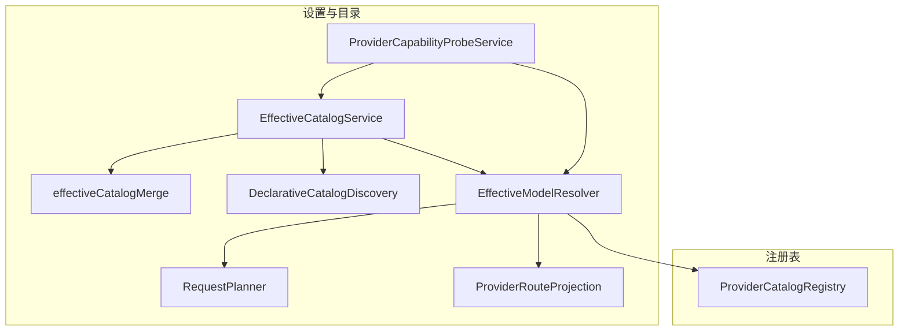
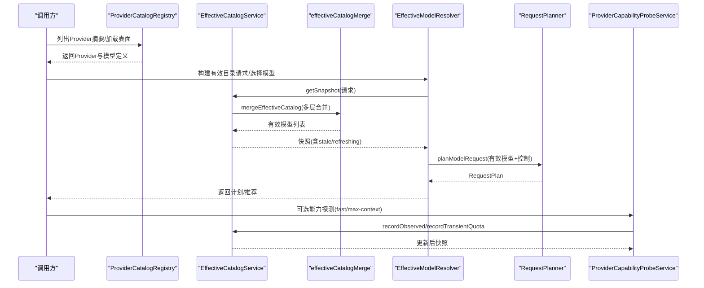
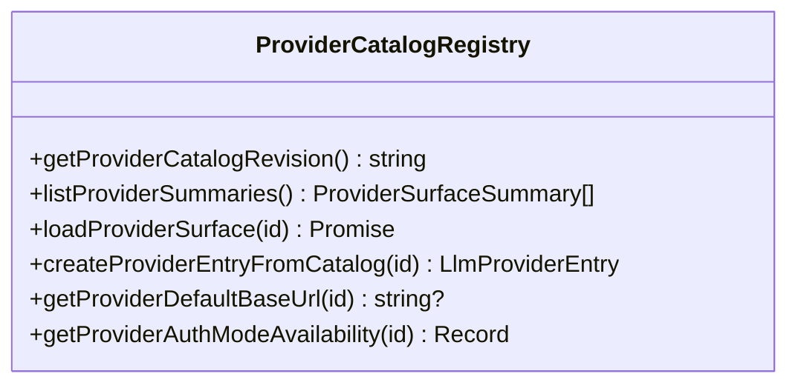
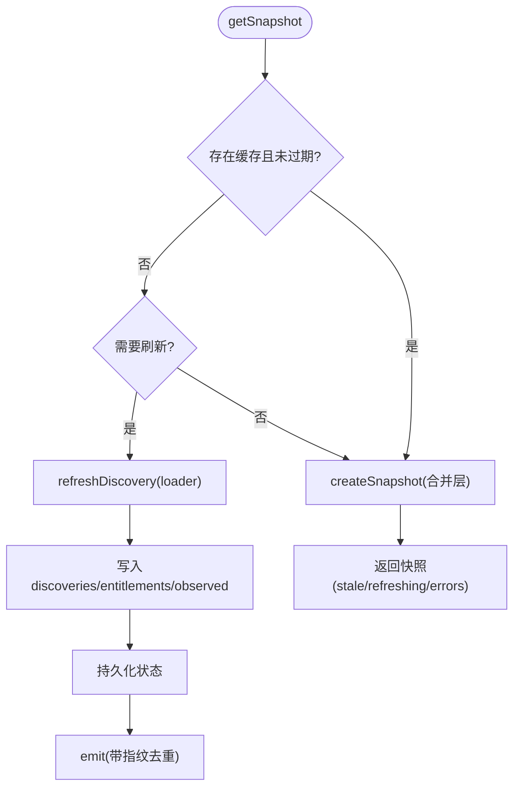
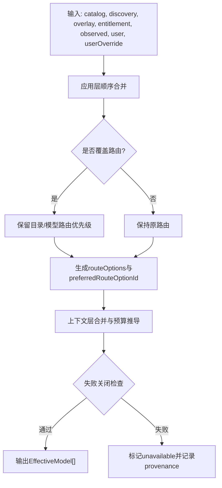
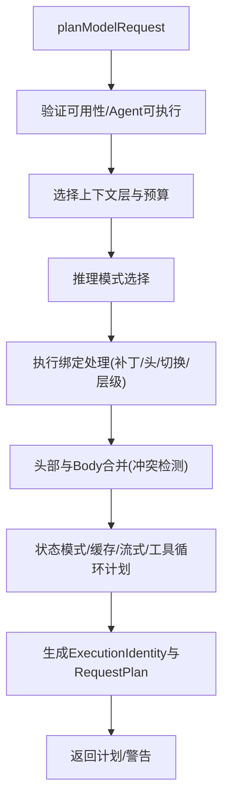
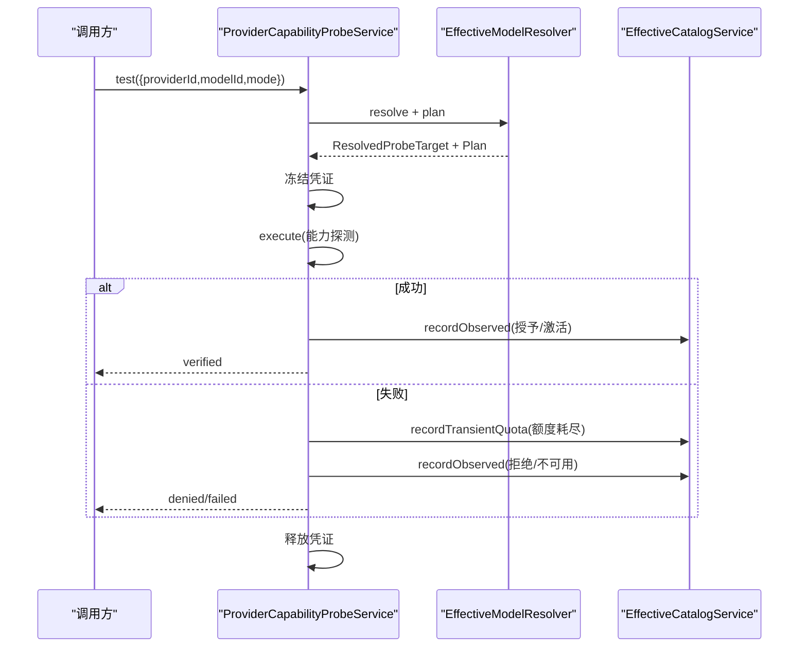
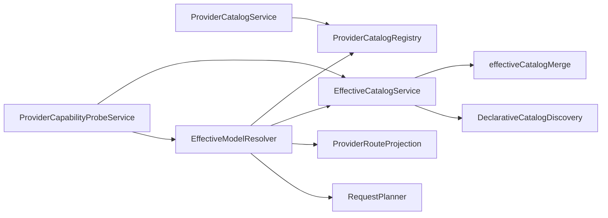
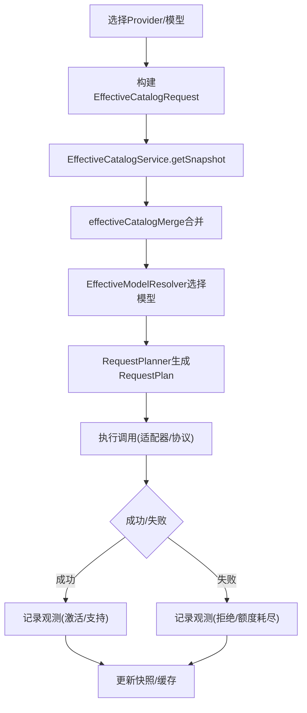
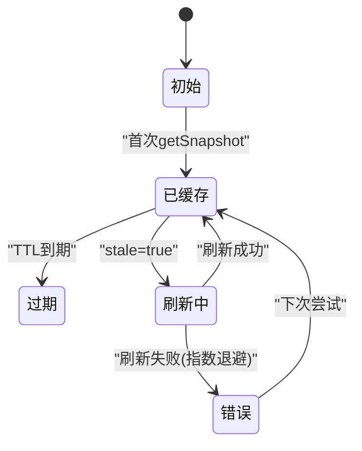

# Provider目录服务设计

<cite>
**本文引用的文件**
- [ProviderCatalogService.ts](file://src/main/settings/ProviderCatalogService.ts)
- [EffectiveCatalogService.ts](file://src/main/settings/EffectiveCatalogService.ts)
- [RequestPlanner.ts](file://src/main/settings/RequestPlanner.ts)
- [ProviderCatalogRegistry.ts](file://src/main/provider-catalog/ProviderCatalogRegistry.ts)
- [effectiveCatalogMerge.ts](file://src/main/settings/effectiveCatalogMerge.ts)
- [effectiveCatalogTypes.ts](file://src/main/settings/effectiveCatalogTypes.ts)
- [DeclarativeCatalogDiscovery.ts](file://src/main/settings/DeclarativeCatalogDiscovery.ts)
- [EffectiveModelResolver.ts](file://src/main/settings/EffectiveModelResolver.ts)
- [ProviderRouteProjection.ts](file://src/main/settings/ProviderRouteProjection.ts)
- [ProviderCapabilityProbeService.ts](file://src/main/settings/ProviderCapabilityProbeService.ts)
</cite>

## 目录
1. [简介](#简介)
2. [项目结构](#项目结构)
3. [核心组件](#核心组件)
4. [架构总览](#架构总览)
5. [详细组件分析](#详细组件分析)
6. [依赖关系分析](#依赖关系分析)
7. [性能与可用性](#性能与可用性)
8. [故障排查指南](#故障排查指南)
9. [结论](#结论)
10. [附录：数据流与流程图](#附录数据流与流程图)

## 简介
本文件面向“Provider目录服务”的设计与实现，聚焦以下目标：
- 解析 ProviderCatalogService 的服务发现与目录管理职责
- 深入 EffectiveCatalogService 的有效配置计算、缓存与刷新机制
- 说明 RequestPlanner 的请求规划算法（模型选择、上下文预算、推理模式、状态模式、工具循环等）
- 解释 ProviderCatalogRegistry 的注册表管理与多Provider支持
- 阐述动态发现、配置合并策略、能力探测、版本兼容性检查、健康检查与故障转移
- 提供架构图与数据流图，展示从Provider选择到服务调用的完整过程

## 项目结构
围绕Provider目录服务的核心代码主要分布在 settings 与 provider-catalog 两个模块中：
- settings
  - EffectiveCatalogService：有效目录快照、持久化、TTL、回退与监听
  - effectiveCatalogMerge：多层配置合并（catalog/discovery/overlay/entitlement/observed/user）
  - RequestPlanner：将有效模型转换为可执行的请求计划
  - DeclarativeCatalogDiscovery：声明式目录发现解析
  - EffectiveModelResolver：组装请求、选择有效模型、刷新发现
  - ProviderRouteProjection：路由优先级与协议覆盖投影
  - ProviderCapabilityProbeService：能力探测与配额/鉴权失败分类
- provider-catalog
  - ProviderCatalogRegistry：编译期Provider目录索引与表面加载、摘要导出

图表来源
- [EffectiveCatalogService.ts:84-163](file://src/main/settings/EffectiveCatalogService.ts#L84-L163)
- [effectiveCatalogMerge.ts:472-596](file://src/main/settings/effectiveCatalogMerge.ts#L472-L596)
- [RequestPlanner.ts:123-539](file://src/main/settings/RequestPlanner.ts#L123-L539)
- [ProviderCatalogRegistry.ts:106-284](file://src/main/provider-catalog/ProviderCatalogRegistry.ts#L106-L284)
- [DeclarativeCatalogDiscovery.ts:120-242](file://src/main/settings/DeclarativeCatalogDiscovery.ts#L120-L242)
- [EffectiveModelResolver.ts:421-479](file://src/main/settings/EffectiveModelResolver.ts#L421-L479)
- [ProviderRouteProjection.ts:11-53](file://src/main/settings/ProviderRouteProjection.ts#L11-L53)
- [ProviderCapabilityProbeService.ts:277-355](file://src/main/settings/ProviderCapabilityProbeService.ts#L277-L355)

章节来源
- [EffectiveCatalogService.ts:84-163](file://src/main/settings/EffectiveCatalogService.ts#L84-L163)
- [ProviderCatalogRegistry.ts:106-284](file://src/main/provider-catalog/ProviderCatalogRegistry.ts#L106-L284)

## 核心组件
- ProviderCatalogService：聚合Provider目录摘要、分类与协议定义，按类别排序输出。用于UI展示与上层查询。
- ProviderCatalogRegistry：维护编译期Provider目录索引，提供表面加载、模型定义查询、默认路由、所有权与发现权限等。
- EffectiveCatalogService：负责有效目录快照的生成、缓存、持久化、失效与增量刷新；支持TTL、指数退避、观察证据与配额临时限制。
- effectiveCatalogMerge：将多层贡献（catalog、discovery、overlay、entitlement、observed、user、userOverride）按优先级合并为EffectiveModel列表，并记录字段级溯源。
- RequestPlanner：基于有效模型与控制项，产出RequestPlan，包含路由、头部、上下文预算、推理模式、状态模式、缓存、工具循环、流式等执行计划。
- EffectiveModelResolver：构建EffectiveCatalogRequest，选择有效模型，刷新发现，并将成功/失败观测写回目录。
- DeclarativeCatalogDiscovery：解析声明式目录发现结果，映射为模型贡献，含准入规则、路由推导、上下文窗口与能力状态。
- ProviderRouteProjection：决定模型路由优先级与协议覆盖，保证模型自有路由优先于目录默认路由。
- ProviderCapabilityProbeService：对模型进行能力探测（fast/max-context），根据HTTP状态与清单匹配判定失败原因，更新观察证据或临时配额。

章节来源
- [ProviderCatalogService.ts:57-73](file://src/main/settings/ProviderCatalogService.ts#L57-L73)
- [ProviderCatalogRegistry.ts:106-284](file://src/main/provider-catalog/ProviderCatalogRegistry.ts#L106-L284)
- [EffectiveCatalogService.ts:84-163](file://src/main/settings/EffectiveCatalogService.ts#L84-L163)
- [effectiveCatalogMerge.ts:472-596](file://src/main/settings/effectiveCatalogMerge.ts#L472-L596)
- [RequestPlanner.ts:123-539](file://src/main/settings/RequestPlanner.ts#L123-L539)
- [EffectiveModelResolver.ts:421-479](file://src/main/settings/EffectiveModelResolver.ts#L421-L479)
- [DeclarativeCatalogDiscovery.ts:120-242](file://src/main/settings/DeclarativeCatalogDiscovery.ts#L120-L242)
- [ProviderRouteProjection.ts:11-53](file://src/main/settings/ProviderRouteProjection.ts#L11-L53)
- [ProviderCapabilityProbeService.ts:277-355](file://src/main/settings/ProviderCapabilityProbeService.ts#L277-L355)

## 架构总览
下图展示了从Provider目录到请求计划的端到端流程，包括目录发现、有效配置合并、模型选择、请求规划与能力探测。

图表来源
- [ProviderCatalogRegistry.ts:106-284](file://src/main/provider-catalog/ProviderCatalogRegistry.ts#L106-L284)
- [EffectiveCatalogService.ts:150-244](file://src/main/settings/EffectiveCatalogService.ts#L150-L244)
- [effectiveCatalogMerge.ts:472-596](file://src/main/settings/effectiveCatalogMerge.ts#L472-L596)
- [EffectiveModelResolver.ts:421-479](file://src/main/settings/EffectiveModelResolver.ts#L421-L479)
- [RequestPlanner.ts:123-539](file://src/main/settings/RequestPlanner.ts#L123-L539)
- [ProviderCapabilityProbeService.ts:277-355](file://src/main/settings/ProviderCapabilityProbeService.ts#L277-L355)

## 详细组件分析

### ProviderCatalogService：目录服务门面
- 职责：汇总Provider分类、协议定义与Provider条目，按类别与标签排序，供外部消费。
- 关键点：
  - 通过注册表获取Provider摘要，构造标准化条目
  - 使用内置分类与协议常量，确保UI一致性
  - 排序策略：先按类别优先级，再按标签本地化比较

章节来源
- [ProviderCatalogService.ts:11-73](file://src/main/settings/ProviderCatalogService.ts#L11-L73)

### ProviderCatalogRegistry：注册表与多Provider支持
- 职责：维护编译期目录索引，提供表面加载、模型定义查询、默认路由、所有权与发现权限等。
- 关键点：
  - 索引校验与版本兼容（schemaVersion/catalogRevision）
  - 表面懒加载与并发保护（Map缓存与Promise去重）
  - 模型可见性过滤（internal/presencePolicy）
  - 认证模式映射与可用性组合
  - 默认路由选择与baseUrl规范化
  - 创建Provider条目时综合surface信息、可用性与连接Schema

图表来源
- [ProviderCatalogRegistry.ts:106-284](file://src/main/provider-catalog/ProviderCatalogRegistry.ts#L106-L284)

章节来源
- [ProviderCatalogRegistry.ts:106-284](file://src/main/provider-catalog/ProviderCatalogRegistry.ts#L106-L284)

### EffectiveCatalogService：有效配置计算与缓存
- 职责：生成有效目录快照，管理发现缓存、授权层、观察证据、配额限制与持久化。
- 关键点：
  - 快照键：providerId/accountId/protocol
  - TTL过期与stale标记，按需触发刷新
  - 指数退避避免频繁刷新失败
  - 观察证据与配额临时限制（如429）
  - 监听器通知最新快照，防抖指纹避免重复广播
  - 持久化状态读写与版本兼容

图表来源
- [EffectiveCatalogService.ts:150-244](file://src/main/settings/EffectiveCatalogService.ts#L150-L244)
- [EffectiveCatalogService.ts:246-298](file://src/main/settings/EffectiveCatalogService.ts#L246-L298)
- [EffectiveCatalogService.ts:300-340](file://src/main/settings/EffectiveCatalogService.ts#L300-L340)
- [EffectiveCatalogService.ts:353-388](file://src/main/settings/EffectiveCatalogService.ts#L353-L388)
- [EffectiveCatalogService.ts:390-449](file://src/main/settings/EffectiveCatalogService.ts#L390-L449)

章节来源
- [EffectiveCatalogService.ts:84-163](file://src/main/settings/EffectiveCatalogService.ts#L84-L163)
- [EffectiveCatalogService.ts:246-298](file://src/main/settings/EffectiveCatalogService.ts#L246-L298)
- [EffectiveCatalogService.ts:300-340](file://src/main/settings/EffectiveCatalogService.ts#L300-L340)
- [EffectiveCatalogService.ts:353-388](file://src/main/settings/EffectiveCatalogService.ts#L353-L388)
- [EffectiveCatalogService.ts:390-449](file://src/main/settings/EffectiveCatalogService.ts#L390-L449)

### effectiveCatalogMerge：多层配置合并策略
- 层级顺序（高优先级在后）：catalog → discovery → overlay → entitlement → observed → maintainedSurface → user → userOverride
- 关键行为：
  - 保守基线：未知能力以unknown呈现，逐步被观察/授权证实
  - 字段级溯源：每个字段变更记录source、时间戳、冲突信息
  - 上下文层合并：按tier id合并，保护目录最大层
  - 用户贡献裁剪：非用户管理的目录仅允许偏好，不制造成员
  - 发现层安全：仅允许白名单模型，防止注入
  - 路由选项投影：若显式routeOptions则保留，否则生成单选项
  - 失败关闭门控：无正预算或Provider不可用则置unavailable

图表来源
- [effectiveCatalogMerge.ts:472-596](file://src/main/settings/effectiveCatalogMerge.ts#L472-L596)
- [effectiveCatalogMerge.ts:249-284](file://src/main/settings/effectiveCatalogMerge.ts#L249-L284)
- [effectiveCatalogMerge.ts:286-305](file://src/main/settings/effectiveCatalogMerge.ts#L286-L305)
- [effectiveCatalogMerge.ts:446-470](file://src/main/settings/effectiveCatalogMerge.ts#L446-L470)

章节来源
- [effectiveCatalogMerge.ts:472-596](file://src/main/settings/effectiveCatalogMerge.ts#L472-L596)

### RequestPlanner：请求规划算法
- 输入：有效模型、控制项、温度、压缩阈值、状态模式、工具循环阶段等
- 关键步骤：
  - 可用性校验与Agent工具可执行性检查
  - 上下文层选择（normal/max）、预算与输出上限计算
  - 推理模式选择与抑制策略
  - 执行绑定处理（request-patch、headers、model-switch、client-tier）
  - 路由与头部合并（冲突检测）
  - 状态模式与缓存/流式/工具循环计划
  - 生成ExecutionIdentity与RequestPlan（含合同哈希、变体键、适配器等）

图表来源
- [RequestPlanner.ts:123-539](file://src/main/settings/RequestPlanner.ts#L123-L539)

章节来源
- [RequestPlanner.ts:123-539](file://src/main/settings/RequestPlanner.ts#L123-L539)

### EffectiveModelResolver：有效模型选择与刷新
- 职责：构建EffectiveCatalogRequest，选择有效模型，刷新发现，记录成功/失败观测
- 关键点：
  - 构建catalog/overlay/entitlement/user/userOverride贡献
  - 应用发现权威策略（authoritative-list/candidate-validation/additive）
  - 选择有效模型（exact/alias/recommendations）
  - 刷新发现并投影fast/executionBindings
  - 成功后记录激活证据（context tier/fast/binding）

章节来源
- [EffectiveModelResolver.ts:421-479](file://src/main/settings/EffectiveModelResolver.ts#L421-L479)
- [EffectiveModelResolver.ts:526-591](file://src/main/settings/EffectiveModelResolver.ts#L526-L591)
- [EffectiveModelResolver.ts:643-745](file://src/main/settings/EffectiveModelResolver.ts#L643-L745)

### DeclarativeCatalogDiscovery：声明式目录发现
- 职责：解析声明式发现结果，映射为模型贡献，含准入规则、路由推导、上下文窗口与能力状态
- 关键点：
  - 路径读取、字符串/数组/数值转换
  - 能力状态映射（includes/equals/boolean）
  - 路由规则匹配（allowPatterns/glob）
  - 准入规则（allow/deny patterns、modalities、contextWindow要求）
  - 生成默认上下文层与预算

章节来源
- [DeclarativeCatalogDiscovery.ts:120-242](file://src/main/settings/DeclarativeCatalogDiscovery.ts#L120-L242)

### ProviderRouteProjection：路由优先级与协议覆盖
- 职责：决定模型路由优先级，应用协议覆盖投影
- 关键点：
  - 模型自有路由优先于目录默认路由
  - 协议覆盖按模型首选协议过滤
  - 锁定模型路由（source=model）

章节来源
- [ProviderRouteProjection.ts:11-53](file://src/main/settings/ProviderRouteProjection.ts#L11-L53)

### ProviderCapabilityProbeService：能力探测与健康检查
- 职责：对模型进行能力探测（fast/max-context），根据HTTP状态与清单匹配判定失败原因，更新观察证据或临时配额
- 关键点：
  - 失败分类：额度耗尽、鉴权失败、路由不可用、授权拒绝
  - 成功/失败补丁：更新context tier、fast控制、执行绑定
  - 临时配额：429等情况下延迟重试
  - 凭证冻结与释放，避免并发泄露

图表来源
- [ProviderCapabilityProbeService.ts:277-355](file://src/main/settings/ProviderCapabilityProbeService.ts#L277-L355)
- [ProviderCapabilityProbeService.ts:109-182](file://src/main/settings/ProviderCapabilityProbeService.ts#L109-L182)
- [ProviderCapabilityProbeService.ts:184-246](file://src/main/settings/ProviderCapabilityProbeService.ts#L184-L246)

章节来源
- [ProviderCapabilityProbeService.ts:277-355](file://src/main/settings/ProviderCapabilityProbeService.ts#L277-L355)

## 依赖关系分析
- ProviderCatalogService 依赖 ProviderCatalogRegistry 获取Provider摘要
- EffectiveCatalogService 依赖 effectiveCatalogMerge 进行合并，依赖 DiscoveryLoader/Normalizer 进行发现与归一化
- EffectiveModelResolver 依赖 ProviderCatalogRegistry、EffectiveCatalogService、RequestPlanner、ProviderRouteProjection
- RequestPlanner 依赖共享类型与工具函数（上下文预算、模型控制、适配器ID）
- DeclarativeCatalogDiscovery 提供发现层贡献，被EffectiveCatalogService/EffectiveModelResolver使用
- ProviderCapabilityProbeService 依赖 EffectiveCatalogService 记录观测与配额

图表来源
- [ProviderCatalogService.ts:57-73](file://src/main/settings/ProviderCatalogService.ts#L57-L73)
- [EffectiveCatalogService.ts:84-163](file://src/main/settings/EffectiveCatalogService.ts#L84-L163)
- [EffectiveModelResolver.ts:421-479](file://src/main/settings/EffectiveModelResolver.ts#L421-L479)
- [ProviderRouteProjection.ts:11-53](file://src/main/settings/ProviderRouteProjection.ts#L11-L53)
- [ProviderCapabilityProbeService.ts:277-355](file://src/main/settings/ProviderCapabilityProbeService.ts#L277-L355)

章节来源
- [EffectiveCatalogService.ts:84-163](file://src/main/settings/EffectiveCatalogService.ts#L84-L163)
- [EffectiveModelResolver.ts:421-479](file://src/main/settings/EffectiveModelResolver.ts#L421-L479)

## 性能与可用性
- 缓存与TTL：有效目录快照按provider/account/protocol缓存，支持TTL与stale标记，减少重复计算
- 指数退避：刷新失败时采用指数退避，避免雪崩
- 并发保护：注册表表面加载使用Promise去重，避免重复网络请求
- 观察证据与配额：能力探测结果与额度耗尽状态短期缓存，提升响应速度
- 失败关闭：无正预算或Provider不可用时直接标记不可用，降低无效调用
- 监听器去重：快照指纹去重，避免重复广播

[本节为通用指导，无需特定文件引用]

## 故障排查指南
- 模型不可用：检查availability与enabled，确认上下文预算与路由可用
- 计划冲突：检查执行绑定、头部与Body补丁冲突，确认路由协议一致
- 额度耗尽：关注429/402等状态，查看临时配额与重试间隔
- 鉴权失败：401状态归类为鉴权失败，检查凭证与账户
- 路由不可用：404状态归类为路由不可用，检查baseUrl与协议
- 授权拒绝：清单匹配或状态码指示授权拒绝，调整模式或账户

章节来源
- [ProviderCapabilityProbeService.ts:41-58](file://src/main/settings/ProviderCapabilityProbeService.ts#L41-L58)
- [RequestPlanner.ts:123-151](file://src/main/settings/RequestPlanner.ts#L123-L151)
- [RequestPlanner.ts:261-326](file://src/main/settings/RequestPlanner.ts#L261-L326)

## 结论
Provider目录服务通过分层合并、动态发现、能力探测与稳健的缓存/刷新机制，实现了多Provider的统一接入与高效调度。EffectiveCatalogService保障快照一致性与时效性，RequestPlanner将复杂策略转化为可执行计划，ProviderCatalogRegistry提供稳定的目录基础。结合健康检查与故障转移策略，系统在高可用与可扩展方面具备良好表现。

[本节为总结，无需特定文件引用]

## 附录：数据流与流程图

### 数据流图：从Provider选择到服务调用

图表来源
- [EffectiveModelResolver.ts:421-479](file://src/main/settings/EffectiveModelResolver.ts#L421-L479)
- [EffectiveCatalogService.ts:150-244](file://src/main/settings/EffectiveCatalogService.ts#L150-L244)
- [effectiveCatalogMerge.ts:472-596](file://src/main/settings/effectiveCatalogMerge.ts#L472-L596)
- [RequestPlanner.ts:123-539](file://src/main/settings/RequestPlanner.ts#L123-L539)
- [ProviderCapabilityProbeService.ts:277-355](file://src/main/settings/ProviderCapabilityProbeService.ts#L277-L355)

### 状态图：有效目录快照生命周期

图表来源
- [EffectiveCatalogService.ts:150-244](file://src/main/settings/EffectiveCatalogService.ts#L150-L244)
- [EffectiveCatalogService.ts:390-449](file://src/main/settings/EffectiveCatalogService.ts#L390-L449)