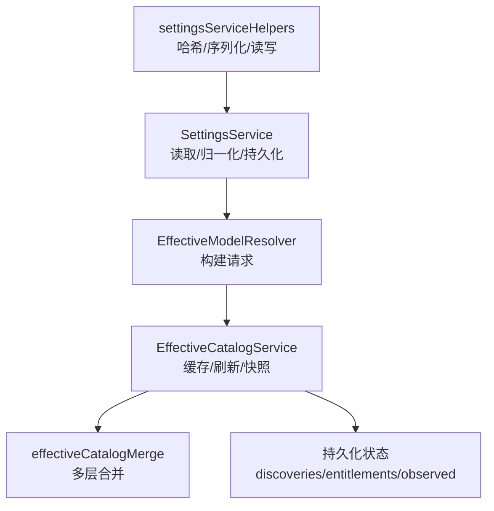
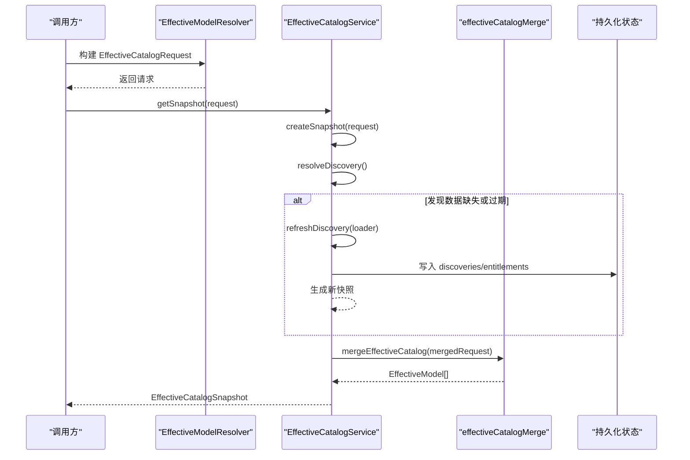
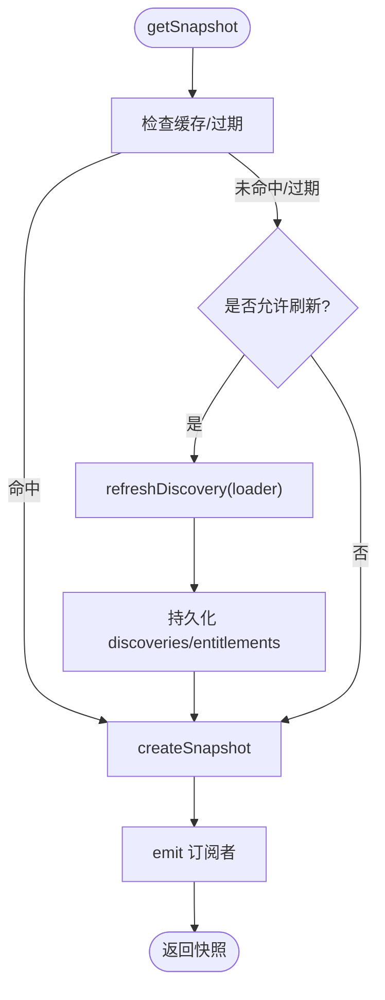
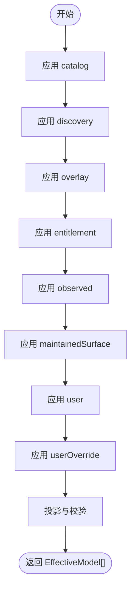
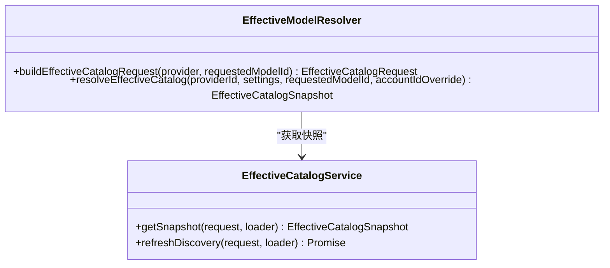
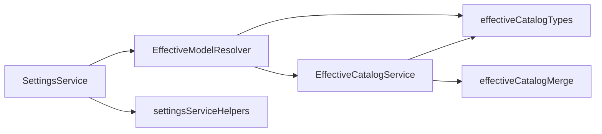

# 有效配置计算

<cite>
**本文引用的文件**
- [EffectiveCatalogService.ts](file://src/main/settings/EffectiveCatalogService.ts)
- [effectiveCatalogMerge.ts](file://src/main/settings/effectiveCatalogMerge.ts)
- [effectiveCatalogTypes.ts](file://src/main/settings/effectiveCatalogTypes.ts)
- [EffectiveModelResolver.ts](file://src/main/settings/EffectiveModelResolver.ts)
- [SettingsService.ts](file://src/main/settings/SettingsService.ts)
- [settingsServiceHelpers.ts](file://src/main/settings/settingsServiceHelpers.ts)
- [EffectiveCatalogService.test.ts](file://src/main/settings/EffectiveCatalogService.test.ts)
</cite>

## 目录
1. [简介](#简介)
2. [项目结构](#项目结构)
3. [核心组件](#核心组件)
4. [架构总览](#架构总览)
5. [详细组件分析](#详细组件分析)
6. [依赖关系分析](#依赖关系分析)
7. [性能与可扩展性](#性能与可扩展性)
8. [故障排查指南](#故障排查指南)
9. [结论](#结论)
10. [附录：最佳实践与示例路径](#附录最佳实践与示例路径)

## 简介
本文件聚焦于“有效配置计算”的完整实现，围绕 EffectiveCatalogService 的配置合并策略展开，解释多层配置的优先级、冲突解决、验证规则、类型转换与字段映射，并说明热重载、增量更新与回滚机制。文档同时给出关键流程图与时序图，帮助读者理解 effectiveCatalogMerge 的算法细节以及从请求到最终快照的全链路过程。

## 项目结构
与有效配置计算相关的代码主要位于 settings 模块中，核心由服务层（EffectiveCatalogService）、合并引擎（effectiveCatalogMerge）、类型定义（effectiveCatalogTypes）和解析器（EffectiveModelResolver）组成；设置持久化与变更处理由 SettingsService 及其辅助函数提供。

**图表来源**
- [EffectiveModelResolver.ts:421-479](file://src/main/settings/EffectiveModelResolver.ts#L421-L479)
- [EffectiveCatalogService.ts:150-244](file://src/main/settings/EffectiveCatalogService.ts#L150-L244)
- [effectiveCatalogMerge.ts:472-595](file://src/main/settings/effectiveCatalogMerge.ts#L472-L595)
- [SettingsService.ts:103-139](file://src/main/settings/SettingsService.ts#L103-L139)
- [settingsServiceHelpers.ts:81-110](file://src/main/settings/settingsServiceHelpers.ts#L81-L110)

**章节来源**
- [EffectiveCatalogService.ts:1-120](file://src/main/settings/EffectiveCatalogService.ts#L1-L120)
- [effectiveCatalogMerge.ts:1-60](file://src/main/settings/effectiveCatalogMerge.ts#L1-L60)
- [effectiveCatalogTypes.ts:20-105](file://src/main/settings/effectiveCatalogTypes.ts#L20-L105)
- [EffectiveModelResolver.ts:421-479](file://src/main/settings/EffectiveModelResolver.ts#L421-L479)
- [SettingsService.ts:103-139](file://src/main/settings/SettingsService.ts#L103-L139)
- [settingsServiceHelpers.ts:81-110](file://src/main/settings/settingsServiceHelpers.ts#L81-L110)

## 核心组件
- EffectiveCatalogService：负责有效目录快照的生成、发现数据与权限数据的缓存与过期管理、增量刷新、错误退避、监听器广播与持久化。
- effectiveCatalogMerge：实现多层配置的合并算法，包括默认保守基线、目录、发现、覆盖、授权、观测、用户与用户覆盖等层的顺序与冲突处理，以及上下文层级、控制项、执行绑定与可用性门控。
- EffectiveModelResolver：将运行时提供者配置转换为 EffectiveCatalogRequest，注入协议覆盖、授权、用户偏好等贡献层。
- SettingsService：负责应用设置的读取、归一化、持久化与变更后的清理与重建。

**章节来源**
- [EffectiveCatalogService.ts:84-163](file://src/main/settings/EffectiveCatalogService.ts#L84-L163)
- [effectiveCatalogMerge.ts:472-595](file://src/main/settings/effectiveCatalogMerge.ts#L472-L595)
- [EffectiveModelResolver.ts:421-479](file://src/main/settings/EffectiveModelResolver.ts#L421-L479)
- [SettingsService.ts:103-139](file://src/main/settings/SettingsService.ts#L103-L139)

## 架构总览
有效配置计算的总体流程如下：
- 上层通过 EffectiveModelResolver 根据当前提供者配置构建 EffectiveCatalogRequest。
- EffectiveCatalogService 基于请求生成快照：若发现数据过期或缺失且存在加载器，则异步刷新发现数据，并在完成后重新生成快照。
- 合并阶段调用 effectiveCatalogMerge，按固定顺序逐层应用模型补丁，记录每个字段的来源证据（provenance），并输出最终的 EffectiveModel 列表。
- 快照包含 catalogRevision、stale、refreshing、lastRefreshError 等元信息，并通过订阅者通知渲染端。

**图表来源**
- [EffectiveModelResolver.ts:421-479](file://src/main/settings/EffectiveModelResolver.ts#L421-L479)
- [EffectiveCatalogService.ts:150-298](file://src/main/settings/EffectiveCatalogService.ts#L150-L298)
- [effectiveCatalogMerge.ts:472-595](file://src/main/settings/effectiveCatalogMerge.ts#L472-L595)

## 详细组件分析

### EffectiveCatalogService：缓存、刷新与快照
- 缓存键：providerId + accountId + protocol，用于隔离不同账户与协议的快照。
- 发现数据 TTL：默认 24 小时，支持自定义 discoveryTtlMs。
- SWR 模式：首次冷读后，在 TTL 内直接返回缓存；过期时触发异步刷新，期间仍返回旧快照。
- 观察层：recordObserved 可追加观测证据（如能力探测结果），支持 expiresAt 过期。
- 临时配额：recordTransientQuota 为模型附加短期配额限制，并注入 provenance。
- 错误退避：refreshDiscovery 失败时指数退避，避免频繁重试。
- 持久化：使用原子写（先写 .tmp 再 rename）保证状态文件一致性。

**图表来源**
- [EffectiveCatalogService.ts:150-244](file://src/main/settings/EffectiveCatalogService.ts#L150-L244)
- [EffectiveCatalogService.ts:246-298](file://src/main/settings/EffectiveCatalogService.ts#L246-L298)
- [EffectiveCatalogService.ts:300-340](file://src/main/settings/EffectiveCatalogService.ts#L300-L340)
- [EffectiveCatalogService.ts:390-421](file://src/main/settings/EffectiveCatalogService.ts#L390-L421)
- [EffectiveCatalogService.ts:423-449](file://src/main/settings/EffectiveCatalogService.ts#L423-L449)

**章节来源**
- [EffectiveCatalogService.ts:84-163](file://src/main/settings/EffectiveCatalogService.ts#L84-L163)
- [EffectiveCatalogService.ts:165-244](file://src/main/settings/EffectiveCatalogService.ts#L165-L244)
- [EffectiveCatalogService.ts:246-340](file://src/main/settings/EffectiveCatalogService.ts#L246-L340)
- [EffectiveCatalogService.ts:353-449](file://src/main/settings/EffectiveCatalogService.ts#L353-L449)

### effectiveCatalogMerge：多层合并算法
合并顺序（高优先级在后）：
1. catalog（编译目录）
2. discovery（动态发现）
3. overlay（协议覆盖）
4. entitlement（授权）
5. observed（观测证据，可能多条）
6. maintainedSurface（维护面）
7. user（用户配置，受 ownership 限制）
8. userOverride（用户覆盖，最高优先级）

关键规则：
- 保守基线：对未知模型创建最小可用结构，确保下游稳定。
- 字段级来源追踪：每个字段写入 provenance，支持 fieldFactSources 精确到子字段。
- 上下文层级合并：按 id 匹配合并，保护 catalog 拥有的 Max tier 不被授权层随意降级。
- 可用性门控：
  - 若 provider 不可用，强制 unavailable。
  - 若 available 但 defaultBudgetTokens <= 0，标记 unavailable 并附带原因。
- 路由选择：优先使用 preferredRouteOptionId，否则回退到 model.route。
- 执行绑定与控制项：解析 executionBindings 与 resolvedControls，形成最终可执行配置。

**图表来源**
- [effectiveCatalogMerge.ts:472-497](file://src/main/settings/effectiveCatalogMerge.ts#L472-L497)
- [effectiveCatalogMerge.ts:498-595](file://src/main/settings/effectiveCatalogMerge.ts#L498-L595)

**章节来源**
- [effectiveCatalogMerge.ts:57-127](file://src/main/settings/effectiveCatalogMerge.ts#L57-L127)
- [effectiveCatalogMerge.ts:129-247](file://src/main/settings/effectiveCatalogMerge.ts#L129-L247)
- [effectiveCatalogMerge.ts:249-305](file://src/main/settings/effectiveCatalogMerge.ts#L249-L305)
- [effectiveCatalogMerge.ts:307-444](file://src/main/settings/effectiveCatalogMerge.ts#L307-L444)
- [effectiveCatalogMerge.ts:446-470](file://src/main/settings/effectiveCatalogMerge.ts#L446-L470)
- [effectiveCatalogMerge.ts:472-595](file://src/main/settings/effectiveCatalogMerge.ts#L472-L595)

### EffectiveModelResolver：请求构建与协议覆盖
- 构建 EffectiveCatalogRequest：
  - 从 Provider 表面加载路由与协议覆盖。
  - 注入 catalogOwnership、discoveryAuthority、fallbackRoute。
  - 组装 catalog、overlay、entitlement、user、userOverride、providerAvailability。
- 协议覆盖：projectModelProtocolOverlays 将 surface 中的协议覆盖映射到具体模型的 route 与 routeOptions。
- 授权贡献：针对特定提供商（如 Copilot）解析账户计费上下文，生成 entitlement 层。

**图表来源**
- [EffectiveModelResolver.ts:421-479](file://src/main/settings/EffectiveModelResolver.ts#L421-L479)
- [EffectiveCatalogService.ts:150-244](file://src/main/settings/EffectiveCatalogService.ts#L150-L244)

**章节来源**
- [EffectiveModelResolver.ts:421-479](file://src/main/settings/EffectiveModelResolver.ts#L421-L479)

### SettingsService：设置持久化与变更处理
- 初始化：读取并校验 schemaVersion，执行 rebuildPersistedSettings 进行兼容性与修复。
- 读取：toRuntimeSettings 将持久化结构转换为运行时 AppSettings。
- 密钥与连接值：安全地读取与掩码预览，支持 OAuth 与 API Key 等多种凭证。
- 变更清理：删除不再使用的 secret 引用，清理 shell 解析器缓存。

**章节来源**
- [SettingsService.ts:103-139](file://src/main/settings/SettingsService.ts#L103-L139)
- [SettingsService.ts:141-200](file://src/main/settings/SettingsService.ts#L141-L200)
- [settingsServiceHelpers.ts:81-110](file://src/main/settings/settingsServiceHelpers.ts#L81-L110)

## 依赖关系分析
- EffectiveCatalogService 依赖 effectiveCatalogMerge 完成合并，依赖 effectiveCatalogTypes 定义类型与常量。
- EffectiveModelResolver 依赖 ProviderCatalogRegistry、ProviderRouteProjection 等以构建请求。
- SettingsService 依赖 settingsDefaults、settingsSanitize、SecretStorageService 等完成设置归一化与安全存储。

**图表来源**
- [EffectiveModelResolver.ts:1-38](file://src/main/settings/EffectiveModelResolver.ts#L1-L38)
- [EffectiveCatalogService.ts:1-27](file://src/main/settings/EffectiveCatalogService.ts#L1-L27)
- [effectiveCatalogMerge.ts:1-18](file://src/main/settings/effectiveCatalogMerge.ts#L1-L18)
- [SettingsService.ts:34-90](file://src/main/settings/SettingsService.ts#L34-L90)

**章节来源**
- [EffectiveModelResolver.ts:1-38](file://src/main/settings/EffectiveModelResolver.ts#L1-L38)
- [EffectiveCatalogService.ts:1-27](file://src/main/settings/EffectiveCatalogService.ts#L1-L27)
- [effectiveCatalogMerge.ts:1-18](file://src/main/settings/effectiveCatalogMerge.ts#L1-L18)
- [SettingsService.ts:34-90](file://src/main/settings/SettingsService.ts#L34-L90)

## 性能与可扩展性
- 缓存与 TTL：发现数据默认 24 小时 TTL，减少重复网络开销；SWR 模式保障低延迟读取。
- 增量更新：仅当发现数据过期或缺失时才触发刷新；观测层与临时配额可局部更新而不影响整体稳定性。
- 错误退避：指数退避防止雪崩式重试。
- 原子持久化：临时文件 + rename 保证状态文件一致性。
- 可扩展点：
  - DiscoveryLoaderResolver：按需注入发现加载器。
  - DiscoveryLayerNormalizer：对发现数据进行标准化。
  - 字段级 factSource：细粒度追踪与审计。

[本节为通用指导，不直接分析具体文件]

## 故障排查指南
- 发现数据刷新失败：
  - 查看 lastRefreshError 与 refreshing 标志，确认是否在退避窗口。
  - 检查 loader 是否正确返回 discovery 与 entitlement。
- 模型不可用：
  - 检查 availability 与 unavailableReason，确认是否因 budget 不足或 provider 不可用导致。
- 字段来源追溯：
  - 通过 provenance 定位具体字段来源与冲突信息，便于定位配置覆盖问题。
- 设置持久化异常：
  - 检查 schemaVersion 与 JSON 格式，必要时触发 rebuildPersistedSettings。

**章节来源**
- [EffectiveCatalogService.ts:246-298](file://src/main/settings/EffectiveCatalogService.ts#L246-L298)
- [effectiveCatalogMerge.ts:550-579](file://src/main/settings/effectiveCatalogMerge.ts#L550-L579)
- [SettingsService.ts:103-139](file://src/main/settings/SettingsService.ts#L103-L139)

## 结论
EffectiveCatalogService 与 effectiveCatalogMerge 共同构成了一个稳健的多层配置合并系统。通过严格的合并顺序、字段级来源追踪、可用性门控与上下文层级保护，系统在保证一致性的同时提供了灵活的用户覆盖与动态发现能力。配合 SWR 缓存、错误退避与原子持久化，实现了高性能与高可用的有效配置计算。

[本节为总结，不直接分析具体文件]

## 附录：最佳实践与示例路径
- 多层配置优先级
  - 目录层提供基础能力与路由；发现层补充运行时能力；授权层调整预算与层级；用户层做偏好选择；用户覆盖层拥有最高优先级。
  - 参考测试用例展示各层组合行为与字段来源。
- 常见场景
  - 仅发现模型无预算：自动标记不可用，避免误选。
  - 用户偏好路由选项：仅投影到具体模型，不改变 provider 全局路由。
  - 最大上下文层级保护：catalog 拥有的 Max tier 不被授权层降级。
- 热重载与增量更新
  - 通过 invalidateDiscovery 清除相关缓存并触发重新计算。
  - 使用 recordObserved 与 recordTransientQuota 进行局部更新。
- 回滚机制
  - 前端在保存失败时回滚本地草稿至最近有效状态，避免不一致。

**章节来源**
- [EffectiveCatalogService.test.ts:66-95](file://src/main/settings/EffectiveCatalogService.test.ts#L66-L95)
- [EffectiveCatalogService.test.ts:166-210](file://src/main/settings/EffectiveCatalogService.test.ts#L166-L210)
- [EffectiveCatalogService.test.ts:252-278](file://src/main/settings/EffectiveCatalogService.test.ts#L252-L278)
- [EffectiveCatalogService.test.ts:365-390](file://src/main/settings/EffectiveCatalogService.test.ts#L365-L390)
- [EffectiveCatalogService.test.ts:542-578](file://src/main/settings/EffectiveCatalogService.test.ts#L542-L578)
- [EffectiveCatalogService.test.ts:669-692](file://src/main/settings/EffectiveCatalogService.test.ts#L669-L692)