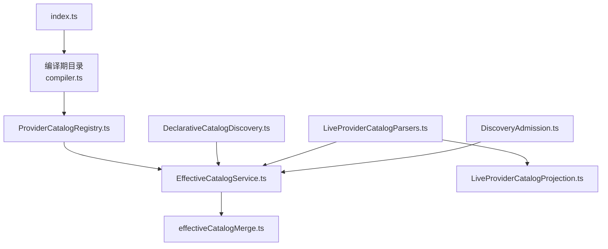
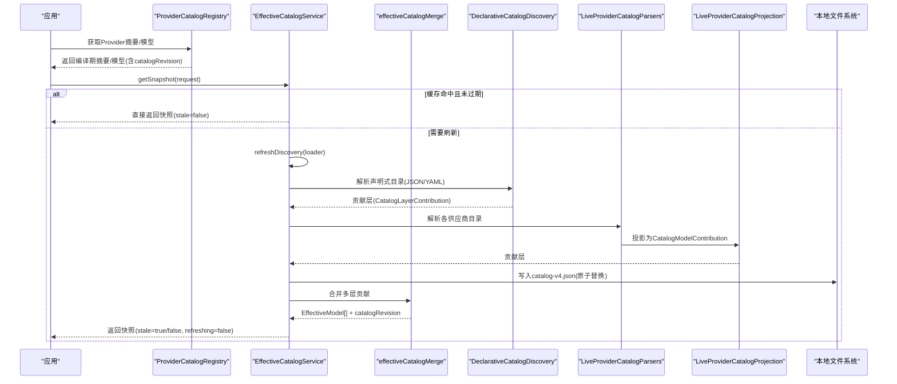
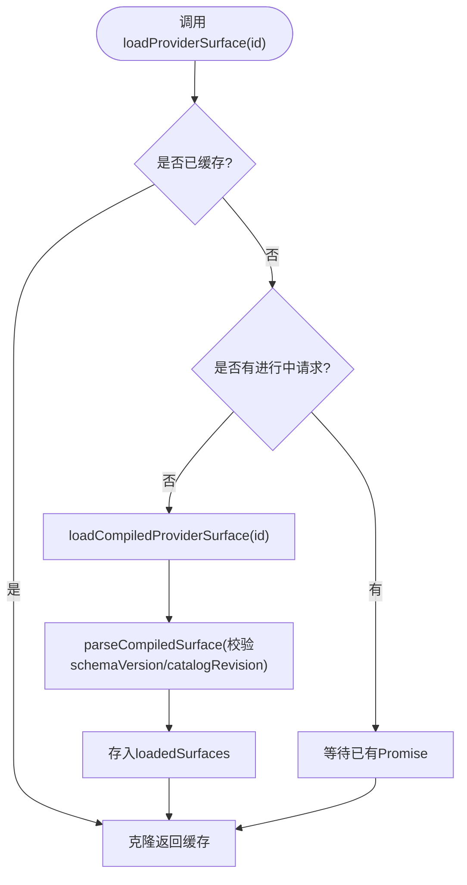
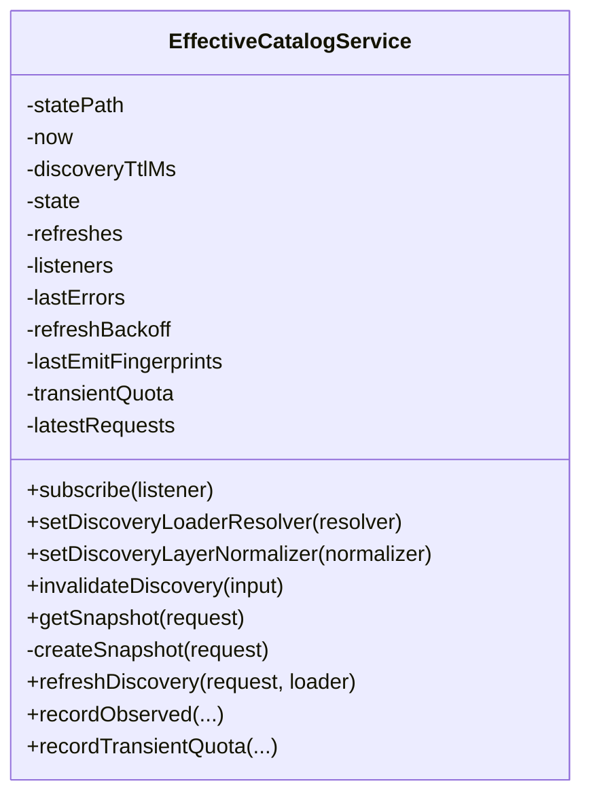
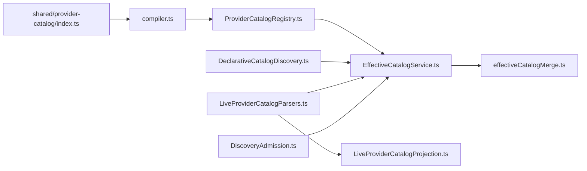

# 目录管理服务

<cite>
**本文引用的文件**
- [ProviderCatalogRegistry.ts](file://src/main/provider-catalog/ProviderCatalogRegistry.ts)
- [compiler.ts](file://src/shared/provider-catalog/compiler.ts)
- [EffectiveCatalogService.ts](file://src/main/settings/EffectiveCatalogService.ts)
- [effectiveCatalogMerge.ts](file://src/main/settings/effectiveCatalogMerge.ts)
- [DiscoveryAdmission.ts](file://src/main/settings/DiscoveryAdmission.ts)
- [DeclarativeCatalogDiscovery.ts](file://src/main/settings/DeclarativeCatalogDiscovery.ts)
- [LiveProviderCatalogParsers.ts](file://src/main/settings/LiveProviderCatalogParsers.ts)
- [LiveProviderCatalogProjection.ts](file://src/main/settings/LiveProviderCatalogProjection.ts)
- [index.ts](file://src/shared/provider-catalog/index.ts)
</cite>

## 目录
1. [简介](#简介)
2. [项目结构](#项目结构)
3. [核心组件](#核心组件)
4. [架构总览](#架构总览)
5. [详细组件分析](#详细组件分析)
6. [依赖关系分析](#依赖关系分析)
7. [性能与可扩展性](#性能与可扩展性)
8. [故障排查指南](#故障排查指南)
9. [结论](#结论)
10. [附录：生命周期示例与扩展开发指南](#附录生命周期示例与扩展开发指南)

## 简介
本文件面向“目录管理服务”，聚焦 ProviderCatalogRegistry 的服务注册表管理、声明式目录发现机制（YAML/JSON 解析、远程同步、本地缓存）、LiveProviderCatalogParsers 的动态解析器实现，以及目录版本控制、变更检测与增量更新。目标是帮助读者理解从“编译期目录”到“运行时有效目录”的完整数据流，并掌握如何扩展新的目录来源与解析器。

## 项目结构
目录管理服务由三层构成：
- 编译期目录层：将 provider 表面、身份、配置编译为可分发的索引与表面清单，提供稳定的 schemaVersion 与 catalogRevision。
- 运行期目录服务层：负责加载、合并、缓存、刷新、持久化“有效目录”，并提供快照与监听能力。
- 动态解析与投影层：对多种远端/账户目录进行解析与规范化，投影为统一的 CatalogModelContribution，再并入有效目录。

图表来源
- [compiler.ts:622-716](file://src/shared/provider-catalog/compiler.ts#L622-L716)
- [ProviderCatalogRegistry.ts:1-284](file://src/main/provider-catalog/ProviderCatalogRegistry.ts#L1-L284)
- [EffectiveCatalogService.ts:84-453](file://src/main/settings/EffectiveCatalogService.ts#L84-L453)
- [effectiveCatalogMerge.ts:472-596](file://src/main/settings/effectiveCatalogMerge.ts#L472-L596)
- [DeclarativeCatalogDiscovery.ts:120-242](file://src/main/settings/DeclarativeCatalogDiscovery.ts#L120-L242)
- [LiveProviderCatalogParsers.ts:1-698](file://src/main/settings/LiveProviderCatalogParsers.ts#L1-L698)
- [LiveProviderCatalogProjection.ts:336-357](file://src/main/settings/LiveProviderCatalogProjection.ts#L336-L357)
- [DiscoveryAdmission.ts:86-137](file://src/main/settings/DiscoveryAdmission.ts#L86-L137)
- [index.ts:1-5](file://src/shared/provider-catalog/index.ts#L1-L5)

章节来源
- [compiler.ts:622-716](file://src/shared/provider-catalog/compiler.ts#L622-L716)
- [ProviderCatalogRegistry.ts:1-284](file://src/main/provider-catalog/ProviderCatalogRegistry.ts#L1-L284)
- [EffectiveCatalogService.ts:84-453](file://src/main/settings/EffectiveCatalogService.ts#L84-L453)

## 核心组件
- ProviderCatalogRegistry：加载编译后的目录索引与表面，维护已加载表面的内存缓存与并发加载保护，提供 Provider 摘要、模型列表、默认路由、认证模式可用性、条目构建等能力。
- EffectiveCatalogService：统一的有效目录服务，负责多源合并、TTL 过期、失败退避、本地持久化、增量刷新、订阅广播、配额记录等。
- effectiveCatalogMerge：将编译目录、声明式发现、覆盖层、授权层、观测层、用户层按优先级合并，生成带证据链的 EffectiveModel，并计算 revision。
- DeclarativeCatalogDiscovery：基于 JSON/YAML 声明的目录发现策略，支持路径映射、准入规则、路由规则、能力状态映射。
- LiveProviderCatalogParsers：针对多个供应商/账户的目录格式进行解析，产出 ParsedLiveCatalog。
- LiveProviderCatalogProjection：将原始观察值投影为 CatalogModelContribution，处理上下文窗口、推理能力、执行绑定等。
- DiscoveryAdmission：对发现的模型进行白名单/黑名单/模态过滤，确保仅安全可信的模型进入有效目录。

章节来源
- [ProviderCatalogRegistry.ts:106-270](file://src/main/provider-catalog/ProviderCatalogRegistry.ts#L106-L270)
- [EffectiveCatalogService.ts:150-298](file://src/main/settings/EffectiveCatalogService.ts#L150-L298)
- [effectiveCatalogMerge.ts:472-596](file://src/main/settings/effectiveCatalogMerge.ts#L472-L596)
- [DeclarativeCatalogDiscovery.ts:114-242](file://src/main/settings/DeclarativeCatalogDiscovery.ts#L114-L242)
- [LiveProviderCatalogParsers.ts:303-698](file://src/main/settings/LiveProviderCatalogParsers.ts#L303-L698)
- [LiveProviderCatalogProjection.ts:230-357](file://src/main/settings/LiveProviderCatalogProjection.ts#L230-L357)
- [DiscoveryAdmission.ts:86-137](file://src/main/settings/DiscoveryAdmission.ts#L86-L137)

## 架构总览
下图展示了从“编译期目录”到“运行时有效目录”的端到端流程，包括远程目录同步、本地缓存、版本控制与增量更新。

图表来源
- [ProviderCatalogRegistry.ts:106-270](file://src/main/provider-catalog/ProviderCatalogRegistry.ts#L106-L270)
- [EffectiveCatalogService.ts:150-298](file://src/main/settings/EffectiveCatalogService.ts#L150-L298)
- [effectiveCatalogMerge.ts:472-596](file://src/main/settings/effectiveCatalogMerge.ts#L472-L596)
- [DeclarativeCatalogDiscovery.ts:120-242](file://src/main/settings/DeclarativeCatalogDiscovery.ts#L120-L242)
- [LiveProviderCatalogParsers.ts:303-698](file://src/main/settings/LiveProviderCatalogParsers.ts#L303-L698)
- [LiveProviderCatalogProjection.ts:336-357](file://src/main/settings/LiveProviderCatalogProjection.ts#L336-L357)

## 详细组件分析

### ProviderCatalogRegistry：服务注册表与生命周期
- 职责
  - 加载编译后的目录索引与表面，校验 schemaVersion 与 catalogRevision 一致性。
  - 维护已加载表面的内存缓存 Map，避免重复加载；使用 Promise 去重保证并发安全。
  - 提供 Provider 摘要、模型列表、默认路由、认证模式可用性、条目构建等查询接口。
  - 暴露测试辅助方法以重置缓存与检查待加载项。
- 关键点
  - 通过 loadCompiledProviderSurface 动态加载表面，并在 parseCompiledSurface 中校验版本与修订号。
  - createProviderEntryFromCatalog 将表面信息转换为 LlmProviderEntry，包含 authMode、availability、connectionSchema、models、recommendedModels 等。
  - 提供 isBuiltinProviderId、getProviderCatalogOwnership、getProviderAuthModeAvailability 等元信息查询。
- 生命周期
  - 启动时加载内置索引；按需懒加载表面；成功后缓存至 loadedSurfaces；失败清理 surfaceLoads。
- 错误处理
  - 索引无效或表面缺失会抛出错误；版本不匹配会拒绝加载。

图表来源
- [ProviderCatalogRegistry.ts:119-138](file://src/main/provider-catalog/ProviderCatalogRegistry.ts#L119-L138)
- [ProviderCatalogRegistry.ts:47-54](file://src/main/provider-catalog/ProviderCatalogRegistry.ts#L47-L54)

章节来源
- [ProviderCatalogRegistry.ts:1-284](file://src/main/provider-catalog/ProviderCatalogRegistry.ts#L1-L284)

### EffectiveCatalogService：有效目录服务、版本控制与增量更新
- 职责
  - 提供 getSnapshot 获取当前有效目录快照；若缓存过期或缺失则触发 refreshDiscovery。
  - 管理 discovery、entitlement、observed 等多层贡献，持久化到 catalog-v4.json。
  - 支持失效 invalidateDiscovery、记录观测 recordObserved、记录临时配额 recordTransientQuota。
  - 失败退避、指纹去抖、监听器广播、最新请求重发。
- 版本控制与变更检测
  - 每次刷新后计算 catalogRevision（基于稳定化的模型集合），用于前端 SWR 与预检。
  - 通过 lastEmitFingerprints 避免相同快照重复广播。
- 本地缓存与 TTL
  - 所有 discovery 结果带有 observedAt 与 expiresAt；过期即 stale。
  - 失败时记录 lastRefreshError，并按指数退避限制重试频率。
- 增量更新
  - 仅当 discovery 或 entitlement 变化时才重写持久化状态；observed 层按协议与 evidenceKey 过滤更新。
  - emitLatestSnapshots 向最近请求的订阅者推送最新快照。

图表来源
- [EffectiveCatalogService.ts:84-453](file://src/main/settings/EffectiveCatalogService.ts#L84-L453)

章节来源
- [EffectiveCatalogService.ts:84-453](file://src/main/settings/EffectiveCatalogService.ts#L84-L453)

### effectiveCatalogMerge：多层合并与证据链
- 职责
  - 将 catalog、discovery、overlay、entitlement、observed、maintainedSurface、user、userOverride 按顺序合并。
  - 为每个字段记录 CapabilityEvidence，包含 source、observedAt、sourceRevision、conflict 等。
  - 处理 contextTiers 合并、默认预算推导、可用性与不可用原因传播。
  - 生成 EffectiveModel，包含 routeOptions、preferredRouteOptionId、resolvedControls、provenance。
- 关键规则
  - 对 discovery 层中的 route.source === 'catalog' 的情况，不覆盖已 admitted 模型的 manifest-owned 路由。
  - 对无上下文窗口的 discovery 行，不覆盖编译期的正预算。
  - 若 provider 运行时不可用，强制标记 unavailable。
- 输出
  - 每层贡献都附带证据链，便于审计与冲突定位。

章节来源
- [effectiveCatalogMerge.ts:472-596](file://src/main/settings/effectiveCatalogMerge.ts#L472-L596)

### DeclarativeCatalogDiscovery：声明式目录发现
- 职责
  - 根据 discovery 配置（collectionPath、mapping、admission、routeRules）解析任意 JSON/YAML 目录。
  - 支持 glob 模式匹配、能力状态映射、上下文窗口与最大输出令牌推断。
  - 将解析结果转换为 CatalogModelContribution，并注入路由与预算信息。
- 特性
  - resolveDeclarativeDiscoveryUrl：拼接 baseUrl 与 path。
  - discoveredModelRoute：决定 model 级路由来源（model 或 catalog）。
  - toDeclarativeCatalogContributions：生成贡献层，包含 contextTiers、controls、toolCalling 等。

章节来源
- [DeclarativeCatalogDiscovery.ts:114-242](file://src/main/settings/DeclarativeCatalogDiscovery.ts#L114-L242)

### LiveProviderCatalogParsers：动态解析器
- 职责
  - 针对不同供应商/账户的目录格式进行解析，产出 ParsedLiveCatalog（models 与 contributions）。
  - 支持的解析器包括：KimiCode、ChatGptAccount、ClaudeAccount、OpenCodeGo、Cline、ClinePass、FreeModel、OpenRouter、GrokBuilder 等。
  - 对 GrokBuilder 提供诊断信息（envelopeKind、candidateCount、admittedCount、filtered）。
- 兼容处理
  - 对不同字段名进行归一化（如 id/name/model、context_window/contextWindow）。
  - 对 reasoning levels、effort、thinkingType 等进行映射与默认选择。
  - 对 OpenAI Responses 与 OpenAI Compatible 协议进行区分。

章节来源
- [LiveProviderCatalogParsers.ts:1-698](file://src/main/settings/LiveProviderCatalogParsers.ts#L1-L698)

### LiveProviderCatalogProjection：观察值投影
- 职责
  - 将 LiveModelObservation 投影为 CatalogModelContribution，处理上下文窗口、推理能力、执行绑定、默认预算等。
  - 对 compiled model 与 dynamic model 分别采用不同投影策略。
  - 对 maxContext 与 fast 能力进行执行绑定与授权判定。
- 关键逻辑
  - projectReasoning：根据模板与观察值生成 ReasoningControl。
  - projectContext：更新 contextTiers 与 controls.maxContext。
  - resolveProjectedDefaultBudget：优先使用编译期预算，其次投影或观察值。

章节来源
- [LiveProviderCatalogProjection.ts:230-357](file://src/main/settings/LiveProviderCatalogProjection.ts#L230-L357)

### DiscoveryAdmission：准入控制
- 职责
  - 对发现的模型进行白名单/黑名单/模态过滤，确保仅安全可信的模型进入有效目录。
  - 支持 allowPatterns、denyPatterns、allowedModalities、predicates 等规则。
  - 提取模型 identity（id、aliases），处理别名与规范 ID。

章节来源
- [DiscoveryAdmission.ts:86-137](file://src/main/settings/DiscoveryAdmission.ts#L86-L137)

## 依赖关系分析
- ProviderCatalogRegistry 依赖 compiler 产出的索引与表面，提供运行时查询入口。
- EffectiveCatalogService 依赖 effectiveCatalogMerge 进行合并，依赖 DiscoveryAdmission 进行准入过滤。
- DeclarativeCatalogDiscovery 与 LiveProviderCatalogParsers 产出 CatalogLayerContribution/CatalogModelContribution，被 EffectiveCatalogService 消费。
- LiveProviderCatalogProjection 作为中间层，将原始观察值标准化为贡献层。
- index.ts 聚合 shared 层的 schema 与编译器导出，供上层使用。

图表来源
- [compiler.ts:622-716](file://src/shared/provider-catalog/compiler.ts#L622-L716)
- [ProviderCatalogRegistry.ts:1-284](file://src/main/provider-catalog/ProviderCatalogRegistry.ts#L1-L284)
- [EffectiveCatalogService.ts:84-453](file://src/main/settings/EffectiveCatalogService.ts#L84-L453)
- [effectiveCatalogMerge.ts:472-596](file://src/main/settings/effectiveCatalogMerge.ts#L472-L596)
- [DeclarativeCatalogDiscovery.ts:120-242](file://src/main/settings/DeclarativeCatalogDiscovery.ts#L120-L242)
- [LiveProviderCatalogParsers.ts:303-698](file://src/main/settings/LiveProviderCatalogParsers.ts#L303-L698)
- [LiveProviderCatalogProjection.ts:336-357](file://src/main/settings/LiveProviderCatalogProjection.ts#L336-L357)
- [DiscoveryAdmission.ts:86-137](file://src/main/settings/DiscoveryAdmission.ts#L86-L137)
- [index.ts:1-5](file://src/shared/provider-catalog/index.ts#L1-L5)

章节来源
- [EffectiveCatalogService.ts:84-453](file://src/main/settings/EffectiveCatalogService.ts#L84-L453)
- [effectiveCatalogMerge.ts:472-596](file://src/main/settings/effectiveCatalogMerge.ts#L472-L596)

## 性能与可扩展性
- 性能
  - 内存缓存：ProviderCatalogRegistry 对已加载表面进行缓存，减少重复 IO。
  - 并发安全：surfaceLoads 使用 Promise 去重，避免重复网络请求。
  - 本地持久化：EffectiveCatalogService 使用原子写入（tmp+rename）避免损坏。
  - 失败退避：指数退避限制频繁重试，降低负载。
  - 指纹去抖：lastEmitFingerprints 避免相同快照重复广播。
- 可扩展性
  - 新增解析器：在 LiveProviderCatalogParsers 中添加新函数，遵循 ParsedLiveCatalog 结构。
  - 新增声明式发现：在 DeclarativeCatalogDiscovery 中扩展 mapping/admission/routeRules。
  - 新增投影规则：在 LiveProviderCatalogProjection 中扩展 reasoning/context/capabilities 投影。
  - 新增准入规则：在 DiscoveryAdmission 中扩展 denyPatterns/allowedModalities/predicates。

[本节为通用指导，无需特定文件引用]

## 故障排查指南
- 常见问题
  - 编译索引无效：检查 schemaVersion 与 catalogRevision 是否一致。
  - 表面缺失：确认 loadCompiledProviderSurface 返回非空。
  - 刷新失败：查看 lastRefreshError 与 backoff 状态，检查网络与权限。
  - 模型不可用：检查 availability/unavailableReason，确认上下文预算为正。
  - 重复模型 ID：LiveProviderCatalogProjection 会抛出重复 ID 错误。
- 调试建议
  - 使用 __testing 工具重置缓存与检查待加载项。
  - 启用诊断信息（如 GrokBuilder 的 diagnostic）。
  - 检查持久化文件 catalog-v4.json 的 schemaVersion 与内容完整性。

章节来源
- [ProviderCatalogRegistry.ts:272-284](file://src/main/provider-catalog/ProviderCatalogRegistry.ts#L272-L284)
- [EffectiveCatalogService.ts:286-298](file://src/main/settings/EffectiveCatalogService.ts#L286-L298)
- [LiveProviderCatalogProjection.ts:340-346](file://src/main/settings/LiveProviderCatalogProjection.ts#L340-L346)

## 结论
目录管理服务通过“编译期目录 + 运行期服务 + 动态解析投影”的分层架构，实现了高内聚、低耦合、可扩展的 Provider 目录管理能力。ProviderCatalogRegistry 提供稳定的查询接口，EffectiveCatalogService 负责合并、缓存、持久化与版本控制，DeclarativeCatalogDiscovery 与 LiveProviderCatalogParsers 支持多源目录接入，DiscoveryAdmission 保障安全性。整体设计兼顾性能、可靠性与可维护性。

[本节为总结，无需特定文件引用]

## 附录：生命周期示例与扩展开发指南

### 完整生命周期示例
- 启动阶段
  - 加载编译期目录索引与表面，建立内存缓存。
  - 初始化 EffectiveCatalogService，读取本地持久化状态。
- 查询阶段
  - 调用 getSnapshot，若缓存命中且未过期，直接返回。
  - 否则触发 refreshDiscovery，并行解析声明式与动态目录。
- 刷新阶段
  - 解析各供应商目录，投影为 CatalogModelContribution。
  - 合并多层贡献，计算 catalogRevision，持久化状态。
  - 广播最新快照给订阅者。
- 失效与恢复
  - 调用 invalidateDiscovery 清除相关缓存。
  - 记录观测与临时配额，影响后续快照。

章节来源
- [ProviderCatalogRegistry.ts:106-270](file://src/main/provider-catalog/ProviderCatalogRegistry.ts#L106-L270)
- [EffectiveCatalogService.ts:150-298](file://src/main/settings/EffectiveCatalogService.ts#L150-L298)
- [effectiveCatalogMerge.ts:472-596](file://src/main/settings/effectiveCatalogMerge.ts#L472-L596)

### 扩展开发指南
- 新增解析器
  - 在 LiveProviderCatalogParsers 中添加新函数，返回 ParsedLiveCatalog。
  - 遵循 strictCatalogRecords 或 records 模式，确保字段归一化。
- 新增声明式发现
  - 在 DeclarativeCatalogDiscovery 中扩展 mapping/admission/routeRules。
  - 使用 readPath 与 capabilityState 进行灵活映射。
- 新增投影规则
  - 在 LiveProviderCatalogProjection 中扩展 reasoning/context/capabilities 投影。
  - 注意 defaultBudgetTokens 的推导与约束。
- 新增准入规则
  - 在 DiscoveryAdmission 中扩展 denyPatterns/allowedModalities/predicates。
  - 确保 normalizeDiscoveredModelMatchKey 的一致性。

章节来源
- [LiveProviderCatalogParsers.ts:303-698](file://src/main/settings/LiveProviderCatalogParsers.ts#L303-L698)
- [DeclarativeCatalogDiscovery.ts:120-242](file://src/main/settings/DeclarativeCatalogDiscovery.ts#L120-L242)
- [LiveProviderCatalogProjection.ts:230-357](file://src/main/settings/LiveProviderCatalogProjection.ts#L230-L357)
- [DiscoveryAdmission.ts:86-137](file://src/main/settings/DiscoveryAdmission.ts#L86-L137)