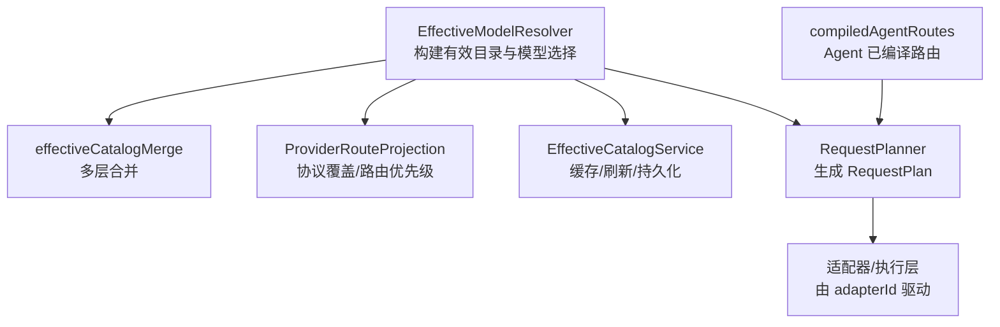
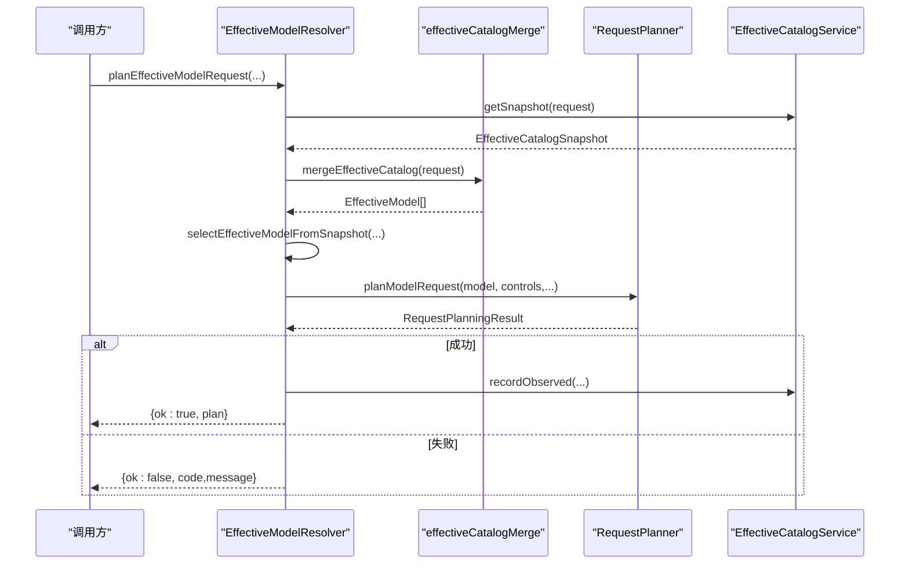
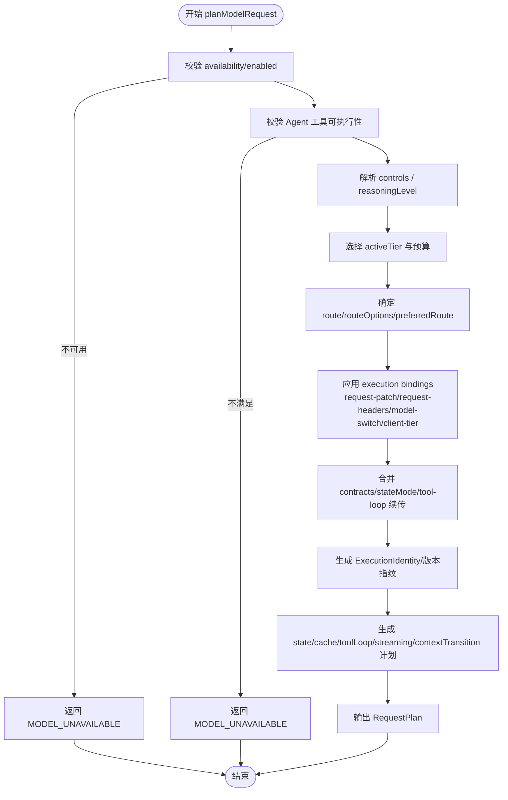
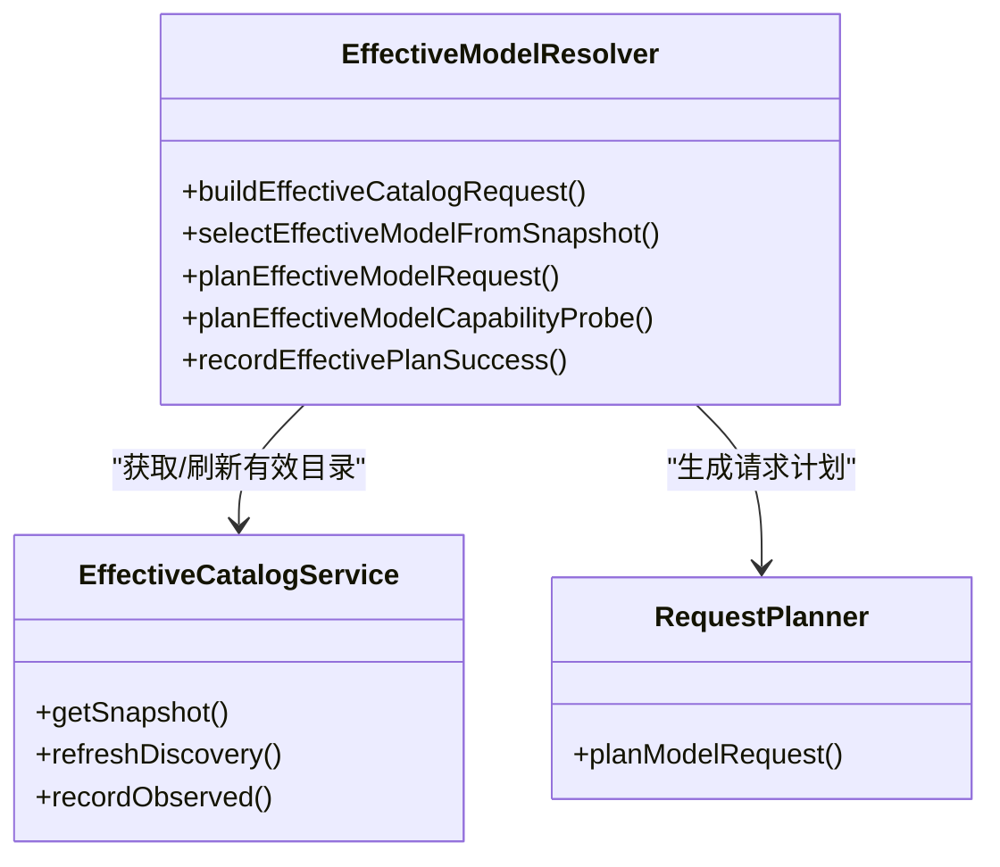
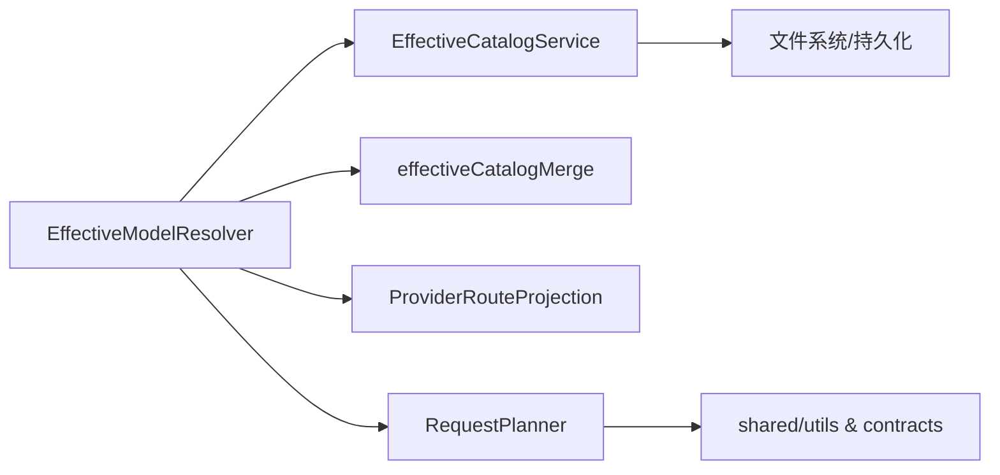
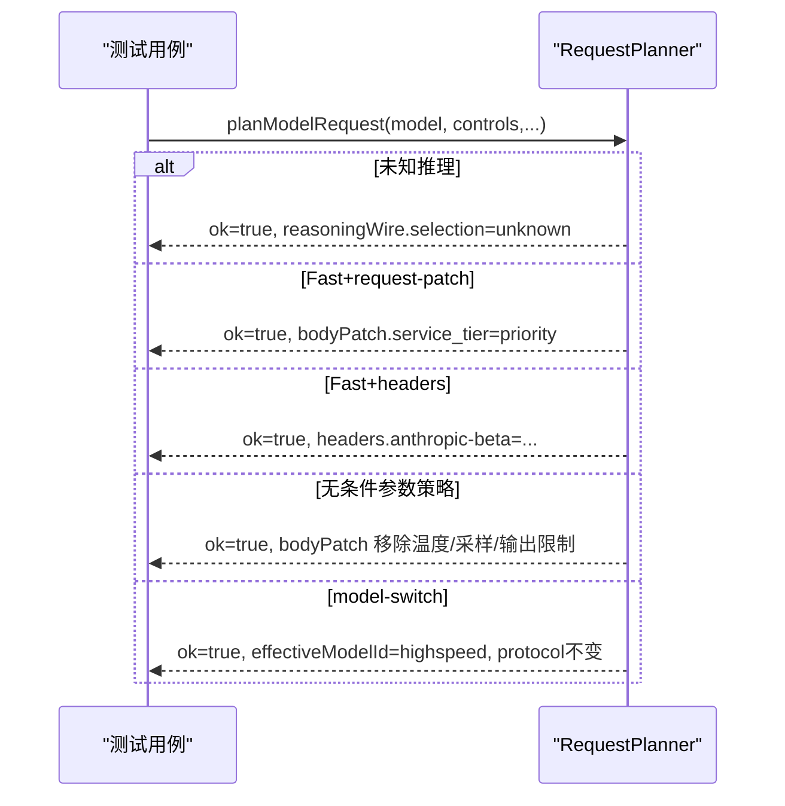

# 请求规划算法

<cite>
**本文引用的文件**
- [RequestPlanner.ts](file://src/main/settings/RequestPlanner.ts)
- [EffectiveModelResolver.ts](file://src/main/settings/EffectiveModelResolver.ts)
- [effectiveCatalogMerge.ts](file://src/main/settings/effectiveCatalogMerge.ts)
- [ProviderRouteProjection.ts](file://src/main/settings/ProviderRouteProjection.ts)
- [compiledAgentRoutes.ts](file://src/main/settings/compiledAgentRoutes.ts)
- [EffectiveCatalogService.ts](file://src/main/settings/EffectiveCatalogService.ts)
- [RequestPlanner.test.ts](file://src/main/settings/RequestPlanner.test.ts)
</cite>

## 目录
1. [简介](#简介)
2. [项目结构](#项目结构)
3. [核心组件](#核心组件)
4. [架构总览](#架构总览)
5. [详细组件分析](#详细组件分析)
6. [依赖关系分析](#依赖关系分析)
7. [性能与优化](#性能与优化)
8. [故障转移、重试与超时](#故障转移重试与超时)
9. [请求缓存机制](#请求缓存机制)
10. [决策流程示例](#决策流程示例)
11. [结论](#结论)

## 简介
本文件系统性解析 RDC-Agent 的请求规划算法，聚焦 RequestPlanner 如何根据任务类型、模型能力、成本约束选择最优 Provider 与模型；并说明编译后的 Agent 路由系统（路由匹配、条件判断、参数传递）、负载均衡策略、故障转移逻辑、性能优化技巧，以及请求缓存、重试机制、超时处理的实现要点。文档以代码级为依据，提供可视化流程图与时序图，帮助读者从高层到细节全面理解。

## 项目结构
围绕请求规划的关键模块位于 settings 层：
- EffectiveModelResolver：构建“有效目录”（Effective Catalog），合并多来源贡献，完成模型选择与推荐。
- effectiveCatalogMerge：将 catalog、discovery、overlay、entitlement、observed、user、userOverride 等层按优先级合并，生成 EffectiveModel。
- ProviderRouteProjection：处理协议覆盖、路由优先级与锁定。
- RequestPlanner：基于 EffectiveModel 与运行时控制参数，产出可执行的 RequestPlan（包含路由、头部、补丁、预算、推理模式、状态模式、缓存计划等）。
- EffectiveCatalogService：管理有效目录的缓存、刷新、过期、回退与持久化。
- compiledAgentRoutes：将 Agent 清单中的已编译路由投影为 LlmAgentRoute，供上层调度使用。

图表来源
- [EffectiveModelResolver.ts:421-479](file://src/main/settings/EffectiveModelResolver.ts#L421-L479)
- [effectiveCatalogMerge.ts:472-596](file://src/main/settings/effectiveCatalogMerge.ts#L472-L596)
- [ProviderRouteProjection.ts:11-53](file://src/main/settings/ProviderRouteProjection.ts#L11-L53)
- [RequestPlanner.ts:123-539](file://src/main/settings/RequestPlanner.ts#L123-L539)
- [EffectiveCatalogService.ts:150-244](file://src/main/settings/EffectiveCatalogService.ts#L150-L244)
- [compiledAgentRoutes.ts:6-43](file://src/main/settings/compiledAgentRoutes.ts#L6-L43)

章节来源
- [EffectiveModelResolver.ts:421-479](file://src/main/settings/EffectiveModelResolver.ts#L421-L479)
- [effectiveCatalogMerge.ts:472-596](file://src/main/settings/effectiveCatalogMerge.ts#L472-L596)
- [ProviderRouteProjection.ts:11-53](file://src/main/settings/ProviderRouteProjection.ts#L11-L53)
- [RequestPlanner.ts:123-539](file://src/main/settings/RequestPlanner.ts#L123-L539)
- [EffectiveCatalogService.ts:150-244](file://src/main/settings/EffectiveCatalogService.ts#L150-L244)
- [compiledAgentRoutes.ts:6-43](file://src/main/settings/compiledAgentRoutes.ts#L6-L43)

## 核心组件
- EffectiveModelResolver：负责聚合多来源数据，生成 EffectiveModel 并做模型选择与推荐；提供 planEffectiveModelRequest 作为统一入口。
- effectiveCatalogMerge：定义严格的合并顺序与字段级证据追踪，确保可审计性与稳定性。
- ProviderRouteProjection：决定最终使用的协议与 baseUrl，支持 per-model 协议覆盖与路由锁定。
- RequestPlanner：将 EffectiveModel + 用户/运行时控制参数转化为 RequestPlan，包括：
  - 路由与协议族、契约、头部补丁
  - 上下文预算与压缩阈值
  - 推理模式与线控配置
  - 状态模式（本地无状态 vs Provider 托管）
  - 缓存计划、流式计划、工具循环计划
  - 执行身份指纹（用于缓存键、兼容性分组）
- EffectiveCatalogService：维护有效目录的 SWR 缓存、发现刷新、观察证据、配额、错误与回退窗口。
- compiledAgentRoutes：将 Agent 清单中已编译的路由映射为 providerId/modelId 对，便于上层直接调度。

章节来源
- [EffectiveModelResolver.ts:526-640](file://src/main/settings/EffectiveModelResolver.ts#L526-L640)
- [effectiveCatalogMerge.ts:472-596](file://src/main/settings/effectiveCatalogMerge.ts#L472-L596)
- [ProviderRouteProjection.ts:11-53](file://src/main/settings/ProviderRouteProjection.ts#L11-L53)
- [RequestPlanner.ts:123-539](file://src/main/settings/RequestPlanner.ts#L123-L539)
- [EffectiveCatalogService.ts:150-244](file://src/main/settings/EffectiveCatalogService.ts#L150-L244)
- [compiledAgentRoutes.ts:6-43](file://src/main/settings/compiledAgentRoutes.ts#L6-L43)

## 架构总览
请求规划的整体流程如下：
1. 构建有效目录请求（EffectiveCatalogRequest），聚合 catalog、discovery、overlay、entitlement、observed、user、userOverride 等层。
2. 通过 mergeEffectiveCatalog 合并得到 EffectiveModel 列表，并计算 resolvedControls、bindingResolutions。
3. 选择目标模型（精确匹配或别名），必要时给出同 Provider 推荐。
4. 调用 RequestPlanner.planModelRequest，结合 controls、compactionThresholdPercent、temperature 等输入，生成 RequestPlan。
5. 若成功执行，记录观测证据（如激活了某 context tier、fast mode、执行绑定等），以便后续刷新时生效。

图表来源
- [EffectiveModelResolver.ts:593-640](file://src/main/settings/EffectiveModelResolver.ts#L593-L640)
- [effectiveCatalogMerge.ts:472-596](file://src/main/settings/effectiveCatalogMerge.ts#L472-L596)
- [RequestPlanner.ts:123-539](file://src/main/settings/RequestPlanner.ts#L123-L539)
- [EffectiveCatalogService.ts:300-327](file://src/main/settings/EffectiveCatalogService.ts#L300-L327)

## 详细组件分析

### RequestPlanner：请求路由与优化策略
- 可用性校验：检查 model.availability 与 enabled，否则返回 MODEL_UNAVAILABLE。
- Agent 工具可执行性：当 requireAgentToolEligibility 为真时，要求模型具备 Agent 工具执行能力。
- 控制参数解析：resolveModelControls 生成 controls，处理 reasoningLevel、fast/maxContext 等。
- 上下文层级选择：根据 maxMode 与可用 tier 选择 activeTier，并计算 contextWindowTokens、maxOutputTokens、compactionThresholdTokens。
- 路由与协议：
  - 支持 preferredRouteOptionId 指定首选路由选项。
  - 支持 execution binding 的 model-switch 切换至内部目标模型（隐藏 UI），保持协议一致。
  - 合并 headers/bodyPatch，冲突则返回 PLAN_CONFLICT。
- 契约与状态模式：
  - 根据 route.contracts 设置 stateMode（provider-managed 或 local-stateless）。
  - 校验 stateMode 是否受支持。
- 执行身份与版本：
  - 生成 ExecutionIdentity，包含 providerId、credentialScopeHash、endpointHash、protocolFamily/Dialect/Version、catalogRevision、routeRevision、modelSnapshotId、compatibilityGroup、variantKey、reasoningMode、contextMode、stateMode、artifactFormat/Version、contractHash、toolLoopPhase、fingerprint。
- 计划产物：
  - statePlan、cachePlan、toolLoopPlan、streamingPlan、contextTransitionPlan。
  - bodyPatch、headers、contracts、executionIdentity、budgets、reasoningWire、temperature。

图表来源
- [RequestPlanner.ts:123-539](file://src/main/settings/RequestPlanner.ts#L123-L539)

章节来源
- [RequestPlanner.ts:123-539](file://src/main/settings/RequestPlanner.ts#L123-L539)

### EffectiveModelResolver：模型选择与推荐
- 构建 EffectiveCatalogRequest：聚合 catalog、discovery、overlay、entitlement、user、userOverride、providerAvailability。
- 选择模型：优先 exact match，其次 alias；过滤 internal 选择项；生成同 Provider 推荐列表（最多 3 个）。
- 统一规划入口：planEffectiveModelRequest 封装选择与 planModelRequest 调用，并在别名重映射时附加警告。
- 能力探测：planEffectiveModelCapabilityProbe 允许在 fast/max-context 模式下临时授予 entitlement 进行探测，且不强制要求 Agent 工具可执行。

图表来源
- [EffectiveModelResolver.ts:421-479](file://src/main/settings/EffectiveModelResolver.ts#L421-L479)
- [EffectiveModelResolver.ts:526-640](file://src/main/settings/EffectiveModelResolver.ts#L526-L640)
- [EffectiveCatalogService.ts:150-244](file://src/main/settings/EffectiveCatalogService.ts#L150-L244)
- [RequestPlanner.ts:123-539](file://src/main/settings/RequestPlanner.ts#L123-L539)

章节来源
- [EffectiveModelResolver.ts:421-479](file://src/main/settings/EffectiveModelResolver.ts#L421-L479)
- [EffectiveModelResolver.ts:526-640](file://src/main/settings/EffectiveModelResolver.ts#L526-L640)

### effectiveCatalogMerge：多层合并与证据追踪
- 合并顺序：catalog → discovery → overlay → entitlement → observed → maintainedSurface → user → userOverride。
- 字段级证据：每个字段变更都记录 source、observedAt、conflict 等，保证可审计。
- 上下文层级合并：保护 catalog 的 max tier，避免被非授权层覆盖。
- 可用性门控：若 provider 不可用或默认预算无效，标记 unavailable。
- 路由选项投影：为每个模型生成 routeOptions，并计算 routeRevision。

章节来源
- [effectiveCatalogMerge.ts:472-596](file://src/main/settings/effectiveCatalogMerge.ts#L472-L596)

### ProviderRouteProjection：协议覆盖与路由优先级
- resolveModelRoutePrecedence：优先使用 model 层显式路由（source=model），否则回退到 catalog 路由；合并 headers。
- projectModelProtocolOverlays：按 per-model 协议覆盖规则生成 overlay 贡献。
- isModelRouteLocked：当 source=model 时视为锁定，防止被其他层覆盖。

章节来源
- [ProviderRouteProjection.ts:11-53](file://src/main/settings/ProviderRouteProjection.ts#L11-L53)

### compiledAgentRoutes：编译后的 Agent 路由
- compiledRouteFromDefinition：从 Agent 清单中提取已编译路由（providerId/modelId）。
- resolveCompiledRouteForAgent：根据 settings.paths 或内置 definitions 解析 agentId 对应的路由。

章节来源
- [compiledAgentRoutes.ts:6-43](file://src/main/settings/compiledAgentRoutes.ts#L6-L43)

## 依赖关系分析
- EffectiveModelResolver 依赖 EffectiveCatalogService 获取/刷新有效目录，依赖 effectiveCatalogMerge 进行合并，依赖 ProviderRouteProjection 进行协议覆盖。
- RequestPlanner 依赖 shared 工具（modelControls、contextTiers、agentToolCapability）与 providerContracts。
- EffectiveCatalogService 依赖文件系统持久化、TTL、回退窗口、监听器事件。

图表来源
- [EffectiveModelResolver.ts:421-479](file://src/main/settings/EffectiveModelResolver.ts#L421-L479)
- [RequestPlanner.ts:123-539](file://src/main/settings/RequestPlanner.ts#L123-L539)
- [EffectiveCatalogService.ts:150-244](file://src/main/settings/EffectiveCatalogService.ts#L150-L244)

章节来源
- [EffectiveModelResolver.ts:421-479](file://src/main/settings/EffectiveModelResolver.ts#L421-L479)
- [RequestPlanner.ts:123-539](file://src/main/settings/RequestPlanner.ts#L123-L539)
- [EffectiveCatalogService.ts:150-244](file://src/main/settings/EffectiveCatalogService.ts#L150-L244)

## 性能与优化
- 稳定哈希与版本控制：
  - stableJson/revisionFor 用于生成稳定的 JSON 指纹，避免无关顺序导致的缓存失效。
  - routeRevision、catalogRevision、modelSnapshotId、contractHash、fingerprint 等多级版本保障缓存一致性。
- 上下文预算与压缩：
  - 根据 activeTier 计算 contextWindowTokens、maxOutputTokens、compactionThresholdTokens，避免溢出与浪费。
- 最小化头部/主体补丁冲突：
  - mergeHeaders/mergePatch 检测冲突，尽早失败，减少无效网络请求。
- 快速路径与保守默认：
  - 未知推理能力采用保守默认（关闭推理），避免不必要的 wire 开销。
- 批量刷新与去抖：
  - EffectiveCatalogService 对同一 key 的刷新进行并发合并，避免重复 IO。

章节来源
- [RequestPlanner.ts:104-117](file://src/main/settings/RequestPlanner.ts#L104-L117)
- [RequestPlanner.ts:346-387](file://src/main/settings/RequestPlanner.ts#L346-L387)
- [EffectiveCatalogService.ts:246-298](file://src/main/settings/EffectiveCatalogService.ts#L246-L298)

## 故障转移、重试与超时
- 故障转移（Failover）：
  - 路由选项（routeOptions）支持多个协议/端点；当首选不可用时，RequestPlanner 会尝试匹配协议一致的备选选项。
  - 执行绑定（execution binding）支持 model-switch，可在 Fast/Max 模式下切换到隐藏的高性能目标模型。
- 重试与回退：
  - EffectiveCatalogService 在发现刷新失败时启用指数退避（base=30s，max=10min），避免雪崩。
  - 观察证据（observed）带 TTL，过期后重新评估能力。
- 超时处理：
  - 当前模块未直接实现 HTTP 超时；超时策略由上层适配器/网络层实现。RequestPlan 中的 streamingPlan、cachePlan 等元信息可用于上层超时与缓存策略配置。

章节来源
- [RequestPlanner.ts:199-258](file://src/main/settings/RequestPlanner.ts#L199-L258)
- [EffectiveCatalogService.ts:390-415](file://src/main/settings/EffectiveCatalogService.ts#L390-L415)

## 请求缓存机制
- 有效目录缓存：
  - EffectiveCatalogService.getSnapshot 基于 providerId/accountId/protocol 生成缓存键，返回 SWR 快照。
  - 若发现数据过期或不存在，且不在回退窗口内，触发 refreshDiscovery。
- 观察证据缓存：
  - recordObserved 写入 observed 层，带 evidenceKey 与可选 expiresAt，影响后续合并结果。
- 临时配额缓存：
  - recordTransientQuota 针对模型维度设置短期配额，影响可用性展示。
- 持久化：
  - 状态文件 catalog-v4.json 原子写入（先写 tmp 再 rename），保证一致性。

章节来源
- [EffectiveCatalogService.ts:150-244](file://src/main/settings/EffectiveCatalogService.ts#L150-L244)
- [EffectiveCatalogService.ts:300-327](file://src/main/settings/EffectiveCatalogService.ts#L300-L327)
- [EffectiveCatalogService.ts:423-449](file://src/main/settings/EffectiveCatalogService.ts#L423-L449)

## 决策流程示例
以下示例来自测试用例，展示不同场景下的决策与路由选择：
- 未知推理能力：不发射 Off 选择或 wire 补丁，保持 unknown 推理模式。
- 执行绑定 request-patch：在 Fast 模式下注入 service_tier=priority。
- 条件头部：Fast 模式添加 anthropic-beta 头，但不在 body 中出现。
- 无条件路由参数策略：移除 temperature/top_p/max_output_tokens。
- 模型切换：Kimi Fast 切换到隐藏的 highspeed 目标模型，保持协议一致。

图表来源
- [RequestPlanner.test.ts:56-192](file://src/main/settings/RequestPlanner.test.ts#L56-L192)

章节来源
- [RequestPlanner.test.ts:56-192](file://src/main/settings/RequestPlanner.test.ts#L56-L192)

## 结论
RDC-Agent 的请求规划体系以 EffectiveCatalog 为核心，通过多层合并与严格证据追踪，确保模型选择与路由决策的可审计性与稳定性。RequestPlanner 将 EffectiveModel 与运行时控制参数转化为可执行的 RequestPlan，涵盖路由、头部、补丁、预算、推理模式、状态模式、缓存与流式计划等关键要素。配合 EffectiveCatalogService 的缓存、刷新与回退机制，系统在复杂环境下仍能保持高可用与高性能。对于上层而言，通过 compiledAgentRoutes 可直接获得已编译的 Agent 路由，简化调度复杂度。