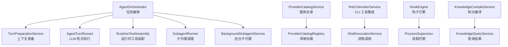
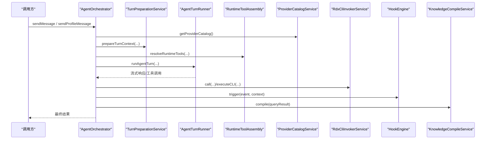
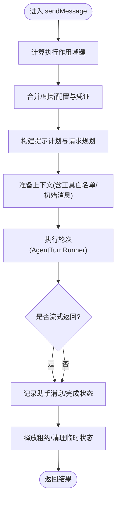
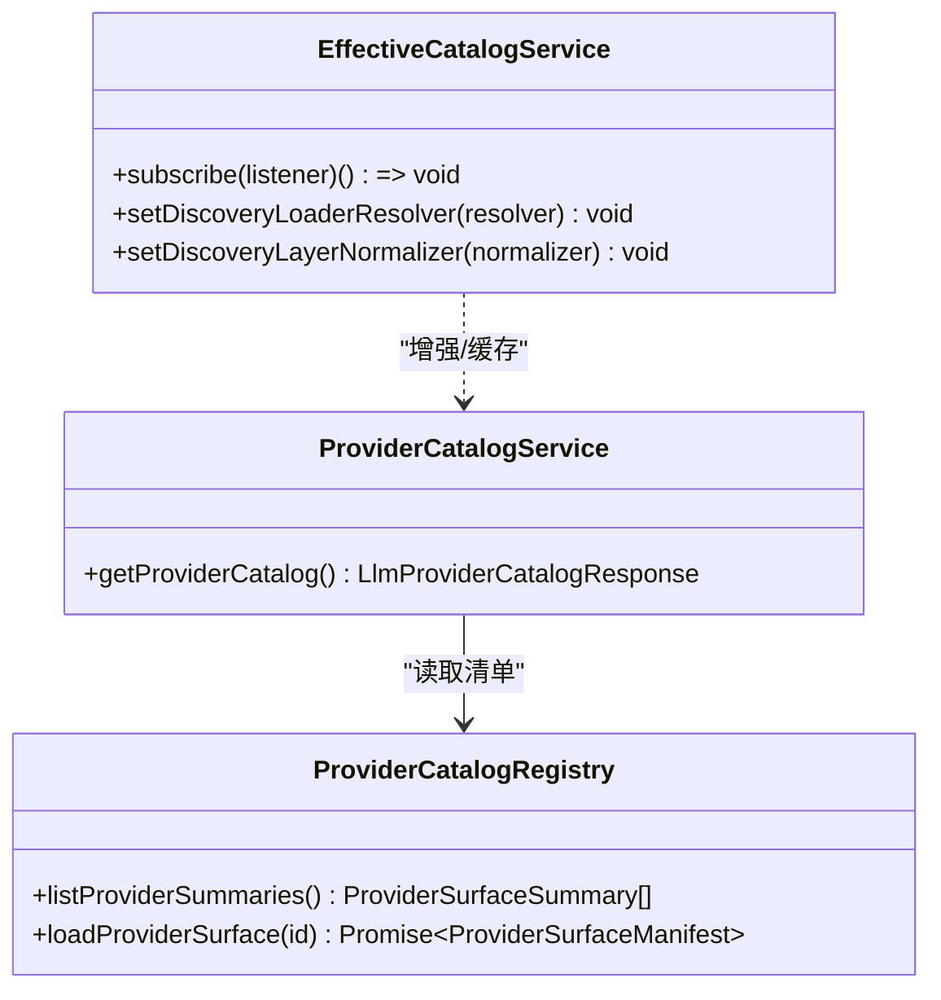
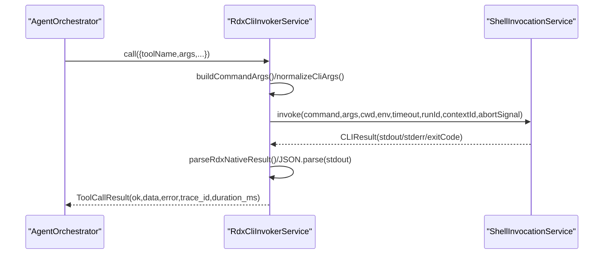
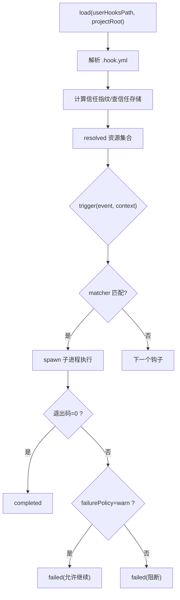
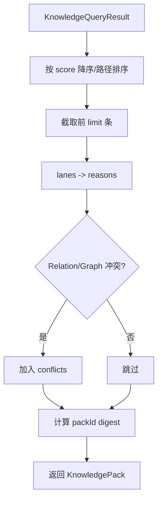
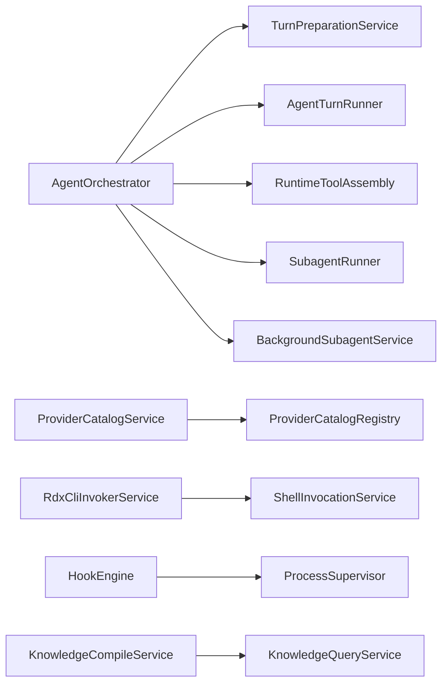

# 核心组件设计

<cite>
**本文引用的文件**
- [AgentOrchestrator.ts](file://src/main/workflow/debugger/AgentOrchestrator.ts)
- [ProviderCatalogService.ts](file://src/main/settings/ProviderCatalogService.ts)
- [ProviderCatalogRegistry.ts](file://src/main/provider-catalog/ProviderCatalogRegistry.ts)
- [RdxCliInvokerService.ts](file://src/main/tools/RdxCliInvokerService.ts)
- [HookEngine.ts](file://src/main/hooks/HookEngine.ts)
- [KnowledgeCompileService.ts](file://src/main/knowledge/KnowledgeCompileService.ts)
- [EffectiveCatalogService.ts](file://src/main/settings/EffectiveCatalogService.ts)
- [DeclarativeCatalogDiscovery.test.ts](file://src/main/settings/DeclarativeCatalogDiscovery.test.ts)
- [executeRdxShell.ts](file://src/main/tools/executeRdxShell.ts)
</cite>

## 目录
1. [简介](#简介)
2. [项目结构](#项目结构)
3. [核心组件](#核心组件)
4. [架构总览](#架构总览)
5. [详细组件分析](#详细组件分析)
6. [依赖关系分析](#依赖关系分析)
7. [性能考量](#性能考量)
8. [故障排查指南](#故障排查指南)
9. [结论](#结论)
10. [附录：接口与扩展点](#附录接口与扩展点)

## 简介
本文件聚焦 RDC-Agent 的核心组件设计与实现细节，围绕以下关键能力展开：
- AgentOrchestrator 的任务编排与轮次执行流程
- ProviderCatalogService 的服务发现与目录聚合
- RdxCliInvokerService 的外部工具集成与生命周期管理
- HookEngine 的钩子系统与安全信任模型
- KnowledgeCompileService 的知识编译打包流程
同时总结组件间的解耦策略、接口抽象、依赖注入方式、插件化与扩展点设计，以及版本兼容性与可观测性。

## 项目结构
RDC-Agent 采用分层与领域划分相结合的目录组织：
- main/workflow/debugger：编排与运行期控制（AgentOrchestrator 所在）
- main/settings：提供者目录、能力探测、请求规划等
- main/provider-catalog：提供者表面清单与索引加载
- main/tools：外部 CLI 工具调用封装
- main/hooks：钩子引擎与信任存储
- main/knowledge：知识检索与编译打包

图表来源
- [AgentOrchestrator.ts:75-145](file://src/main/workflow/debugger/AgentOrchestrator.ts#L75-L145)
- [ProviderCatalogService.ts:57-70](file://src/main/settings/ProviderCatalogService.ts#L57-L70)
- [ProviderCatalogRegistry.ts:110-138](file://src/main/provider-catalog/ProviderCatalogRegistry.ts#L110-L138)
- [RdxCliInvokerService.ts:42-141](file://src/main/tools/RdxCliInvokerService.ts#L42-L141)
- [HookEngine.ts:71-129](file://src/main/hooks/HookEngine.ts#L71-L129)
- [KnowledgeCompileService.ts:15-48](file://src/main/knowledge/KnowledgeCompileService.ts#L15-L48)

章节来源
- [AgentOrchestrator.ts:75-145](file://src/main/workflow/debugger/AgentOrchestrator.ts#L75-L145)
- [ProviderCatalogService.ts:57-70](file://src/main/settings/ProviderCatalogService.ts#L57-L70)
- [ProviderCatalogRegistry.ts:110-138](file://src/main/provider-catalog/ProviderCatalogRegistry.ts#L110-L138)
- [RdxCliInvokerService.ts:42-141](file://src/main/tools/RdxCliInvokerService.ts#L42-L141)
- [HookEngine.ts:71-129](file://src/main/hooks/HookEngine.ts#L71-L129)
- [KnowledgeCompileService.ts:15-48](file://src/main/knowledge/KnowledgeCompileService.ts#L15-L48)

## 核心组件
- AgentOrchestrator：面向外的编排门面，负责消息入队、配置合并、提示计划构建、轮次执行、状态更新与资源释放。内部组合 TurnPreparationService、AgentTurnRunner、RuntimeToolAssembly、SubagentRunner、BackgroundSubagentService 等。
- ProviderCatalogService：聚合并排序提供者目录，输出分类、协议与提供者列表，供上层 UI 或路由选择使用。
- RdxCliInvokerService：将 Agent 的工具调用映射为外部 RDX CLI 命令执行，提供目录加载、可用性检查、参数归一化、超时与中止、追踪事件。
- HookEngine：扫描内置/用户/项目钩子，计算信任指纹，维护信任存储，按事件触发钩子并安全地隔离执行。
- KnowledgeCompileService：对查询结果进行排序、裁剪、冲突检测与摘要生成，产出可复用的知识包。

章节来源
- [AgentOrchestrator.ts:75-145](file://src/main/workflow/debugger/AgentOrchestrator.ts#L75-L145)
- [ProviderCatalogService.ts:57-70](file://src/main/settings/ProviderCatalogService.ts#L57-L70)
- [RdxCliInvokerService.ts:42-141](file://src/main/tools/RdxCliInvokerService.ts#L42-L141)
- [HookEngine.ts:71-129](file://src/main/hooks/HookEngine.ts#L71-L129)
- [KnowledgeCompileService.ts:15-48](file://src/main/knowledge/KnowledgeCompileService.ts#L15-L48)

## 架构总览
下图展示关键组件之间的协作关系与数据流向。AgentOrchestrator 作为编排中心，协调上下文准备、工具装配、轮次执行与子代理；ProviderCatalogService 提供提供者目录；RdxCliInvokerService 桥接外部工具；HookEngine 在关键阶段注入安全与审计；KnowledgeCompileService 将检索结果编译为知识包。

图表来源
- [AgentOrchestrator.ts:195-366](file://src/main/workflow/debugger/AgentOrchestrator.ts#L195-L366)
- [ProviderCatalogService.ts:57-70](file://src/main/settings/ProviderCatalogService.ts#L57-L70)
- [RdxCliInvokerService.ts:248-355](file://src/main/tools/RdxCliInvokerService.ts#L248-L355)
- [HookEngine.ts:214-246](file://src/main/hooks/HookEngine.ts#L214-L246)
- [KnowledgeCompileService.ts:18-48](file://src/main/knowledge/KnowledgeCompileService.ts#L18-L48)

## 详细组件分析

### AgentOrchestrator：任务编排算法与控制流
- 职责边界：对外暴露 sendMessage/sendProfileMessage/getAgentState/configureAgent/prepareTurnContext；内部组合 TurnPreparationService、AgentTurnRunner、RuntimeToolAssembly、SubagentRunner、BackgroundSubagentService。
- 编排要点：
  - 会话与作用域：通过 sessionTurnKey 与 executionScopeId 区分会话级与临时作用域，避免状态泄漏。
  - 凭证与配置：按需刷新 provider 运行时凭证，合并系统提示、模型与温度等配置。
  - 提示计划：基于 provider/model/能力/上下文窗口构建 PromptPlan，支持压缩阈值与推理级别控制。
  - 轮次执行：将 prepared runtime、tool allowlist、initial messages 等传入 AgentTurnRunner 执行。
  - 资源释放：finally 中释放 MCP 租约、清理临时状态、释放凭证句柄。
  - 状态与日志：统一更新 agent 状态并发布到工作流投影与日志系统。

图表来源
- [AgentOrchestrator.ts:195-366](file://src/main/workflow/debugger/AgentOrchestrator.ts#L195-L366)
- [AgentOrchestrator.ts:384-634](file://src/main/workflow/debugger/AgentOrchestrator.ts#L384-L634)

章节来源
- [AgentOrchestrator.ts:75-145](file://src/main/workflow/debugger/AgentOrchestrator.ts#L75-L145)
- [AgentOrchestrator.ts:195-366](file://src/main/workflow/debugger/AgentOrchestrator.ts#L195-L366)
- [AgentOrchestrator.ts:384-634](file://src/main/workflow/debugger/AgentOrchestrator.ts#L384-L634)

### ProviderCatalogService：服务发现机制
- 入口：getProviderCatalog 列出所有提供者摘要，转换为统一目录条目并按类别与标签排序。
- 数据来源：ProviderCatalogRegistry 从编译后的索引加载提供者表面清单，支持缓存与并发加载保护。
- 能力增强：EffectiveCatalogService 提供动态发现层、TTL 缓存与持久化状态，支持声明式目录解析与协议映射。

图表来源
- [ProviderCatalogService.ts:57-70](file://src/main/settings/ProviderCatalogService.ts#L57-L70)
- [ProviderCatalogRegistry.ts:110-138](file://src/main/provider-catalog/ProviderCatalogRegistry.ts#L110-L138)
- [EffectiveCatalogService.ts:100-121](file://src/main/settings/EffectiveCatalogService.ts#L100-L121)

章节来源
- [ProviderCatalogService.ts:57-70](file://src/main/settings/ProviderCatalogService.ts#L57-L70)
- [ProviderCatalogRegistry.ts:110-138](file://src/main/provider-catalog/ProviderCatalogRegistry.ts#L110-L138)
- [EffectiveCatalogService.ts:100-121](file://src/main/settings/EffectiveCatalogService.ts#L100-L121)
- [DeclarativeCatalogDiscovery.test.ts:32-179](file://src/main/settings/DeclarativeCatalogDiscovery.test.ts#L32-L179)

### RdxCliInvokerService：外部工具集成
- 目录与可用性：loadCatalog 读取外部工具目录，isAvailable/getRuntimeSummary 暴露可用性与命名空间统计。
- 参数与执行：buildCommandArgs 规范化参数（如 --context-id -> --daemon-context），resolveRdxBatchInvocation 组装命令，executeCLI 委托 ShellInvocationService 执行。
- 结果与追踪：call 方法统一包装为 ToolCallResult，解析 stdout JSON，标准化错误，并通过 onInvocationTrace 发布追踪事件。
- 生命周期：abortRun/terminateAll 透传到 ShellInvocationService 以中止进程。

图表来源
- [RdxCliInvokerService.ts:143-221](file://src/main/tools/RdxCliInvokerService.ts#L143-L221)
- [RdxCliInvokerService.ts:248-355](file://src/main/tools/RdxCliInvokerService.ts#L248-L355)
- [executeRdxShell.ts:1-14](file://src/main/tools/executeRdxShell.ts#L1-L14)

章节来源
- [RdxCliInvokerService.ts:42-141](file://src/main/tools/RdxCliInvokerService.ts#L42-L141)
- [RdxCliInvokerService.ts:178-221](file://src/main/tools/RdxCliInvokerService.ts#L178-L221)
- [RdxCliInvokerService.ts:248-355](file://src/main/tools/RdxCliInvokerService.ts#L248-L355)
- [executeRdxShell.ts:1-14](file://src/main/tools/executeRdxShell.ts#L1-L14)

### HookEngine：钩子系统与安全信任
- 钩子加载：load 扫描 builtin/user/project 目录中的 .hook.yml，解析定义，结合 scopedResourceResolver 去重与来源追溯。
- 信任模型：computeHookTrustFingerprint 计算指纹，trustStore 持久化信任记录；builtin 默认可信，user/project 需显式信任。
- 触发与执行：trigger 根据 event/matcher 过滤，按 failurePolicy 决定 block/warn；run 通过 ProcessSupervisor 隔离执行，限制输出大小与超时。
- 管理接口：trustUserHook/trustProjectHook/revoke* 提供信任与撤销操作。

图表来源
- [HookEngine.ts:76-129](file://src/main/hooks/HookEngine.ts#L76-L129)
- [HookEngine.ts:214-246](file://src/main/hooks/HookEngine.ts#L214-L246)
- [HookEngine.ts:293-368](file://src/main/hooks/HookEngine.ts#L293-L368)

章节来源
- [HookEngine.ts:71-129](file://src/main/hooks/HookEngine.ts#L71-L129)
- [HookEngine.ts:214-246](file://src/main/hooks/HookEngine.ts#L214-L246)
- [HookEngine.ts:293-368](file://src/main/hooks/HookEngine.ts#L293-L368)

### KnowledgeCompileService：知识编译流程
- 输入：KnowledgeQueryResult（包含 hits、lanes、score）。
- 处理：按 score 降序与路径字典序排序，截取 limit；将 lanes 转为 reasons；检测 Relation/Graph 冲突。
- 输出：KnowledgePack（packId、compiledAt、hits、conflicts），digest 基于 cardId 序列哈希。

图表来源
- [KnowledgeCompileService.ts:18-48](file://src/main/knowledge/KnowledgeCompileService.ts#L18-L48)

章节来源
- [KnowledgeCompileService.ts:15-48](file://src/main/knowledge/KnowledgeCompileService.ts#L15-L48)

## 依赖关系分析
- 低耦合：各服务通过构造函数注入依赖（如 HookEngine 的 trustStorePath、KnowledgeCompileService 的 now 覆盖），便于测试与替换。
- 明确边界：AgentOrchestrator 不直接实现工具执行与 LLM 通信，而是委派给 RuntimeToolAssembly 与 AgentTurnRunner。
- 可插拔：ProviderCatalogRegistry 通过虚拟模块加载编译后的提供者清单，支持热更新与多版本共存；EffectiveCatalogService 提供发现层与 TTL 缓存。
- 可观测性：RdxCliInvokerService 与 HookEngine 均提供追踪/日志输出，便于问题定位。

图表来源
- [AgentOrchestrator.ts:75-145](file://src/main/workflow/debugger/AgentOrchestrator.ts#L75-L145)
- [ProviderCatalogService.ts:57-70](file://src/main/settings/ProviderCatalogService.ts#L57-L70)
- [ProviderCatalogRegistry.ts:110-138](file://src/main/provider-catalog/ProviderCatalogRegistry.ts#L110-L138)
- [RdxCliInvokerService.ts:42-141](file://src/main/tools/RdxCliInvokerService.ts#L42-L141)
- [HookEngine.ts:71-129](file://src/main/hooks/HookEngine.ts#L71-L129)
- [KnowledgeCompileService.ts:15-48](file://src/main/knowledge/KnowledgeCompileService.ts#L15-L48)

章节来源
- [AgentOrchestrator.ts:75-145](file://src/main/workflow/debugger/AgentOrchestrator.ts#L75-L145)
- [ProviderCatalogService.ts:57-70](file://src/main/settings/ProviderCatalogService.ts#L57-L70)
- [ProviderCatalogRegistry.ts:110-138](file://src/main/provider-catalog/ProviderCatalogRegistry.ts#L110-L138)
- [RdxCliInvokerService.ts:42-141](file://src/main/tools/RdxCliInvokerService.ts#L42-L141)
- [HookEngine.ts:71-129](file://src/main/hooks/HookEngine.ts#L71-L129)
- [KnowledgeCompileService.ts:15-48](file://src/main/knowledge/KnowledgeCompileService.ts#L15-L48)

## 性能考量
- 目录缓存与并发加载：ProviderCatalogRegistry 对已加载 surface 进行内存缓存，并使用 Map 防止重复加载同一资源的并发竞态。
- 超时与限流：HookEngine 设置默认超时与最大输出字节数，避免长尾阻塞；RdxCliInvokerService 支持超时与中止信号。
- 上下文压缩：AgentOrchestrator 依据 compactionThresholdPercent 与模型能力调整上下文窗口，减少不必要传输。
- 批量与批处理：RdxCliInvokerService 支持批量参数拼装与一次性调用，降低进程启动开销。

[本节为通用指导，不直接分析具体文件]

## 故障排查指南
- 提供者不可用：检查 ProviderCatalogService 返回的 unavailableReason；确认 EffectiveCatalogService 的 discovery TTL 与持久化状态。
- CLI 工具失败：查看 RdxCliInvokerService 的 ToolCallResult.error.details（stdout/stderr/exitCode），确认命令路径、环境变量与工作目录。
- 钩子未执行或被阻断：确认 HookEngine 的信任状态（needsRetrust）、failurePolicy 与 matcher 条件；检查子进程超时与输出截断。
- 知识编译冲突：关注 KnowledgeCompileService 输出的 conflicts，尤其是 Relation/Graph 类型卡片标题不一致导致的矛盾。

章节来源
- [ProviderCatalogService.ts:57-70](file://src/main/settings/ProviderCatalogService.ts#L57-L70)
- [EffectiveCatalogService.ts:100-121](file://src/main/settings/EffectiveCatalogService.ts#L100-L121)
- [RdxCliInvokerService.ts:248-355](file://src/main/tools/RdxCliInvokerService.ts#L248-L355)
- [HookEngine.ts:214-246](file://src/main/hooks/HookEngine.ts#L214-L246)
- [KnowledgeCompileService.ts:18-48](file://src/main/knowledge/KnowledgeCompileService.ts#L18-L48)

## 结论
RDC-Agent 的核心组件通过清晰的职责划分与依赖注入实现了高内聚、低耦合的设计。AgentOrchestrator 作为编排门面，将上下文准备、工具装配、轮次执行与子代理调度解耦；ProviderCatalogService 与 Registry 提供稳定可扩展的服务发现；RdxCliInvokerService 将外部工具调用标准化并可观测；HookEngine 提供安全的钩子执行与信任管理；KnowledgeCompileService 将检索结果结构化并支持冲突检测。整体架构具备良好的插件化能力与版本兼容性基础，适合持续演进与生态扩展。

[本节为总结性内容，不直接分析具体文件]

## 附录：接口与扩展点
- AgentOrchestrator
  - 公开接口：sendMessage、sendProfileMessage、prepareTurnContext、configureAgent、getAgentState、getToolsForRole、isToolAllowedForRole、abortAndJoin。
  - 扩展点：通过 TurnPreparationService 与 RuntimeToolAssembly 注入自定义工具与上下文准备逻辑；通过 SubagentRunner 扩展子代理能力。
- ProviderCatalogService
  - 公开接口：getProviderCatalog。
  - 扩展点：EffectiveCatalogService 支持 discoveryLoaderResolver 与 discoveryLayerNormalizer 注入，实现动态发现与归一化。
- RdxCliInvokerService
  - 公开接口：loadCatalog、getRuntimeSummary、executeCLI、call、onInvocationTrace、abortRun、terminateAll。
  - 扩展点：ShellInvocationService 可替换以实现不同进程调用后端；支持自定义参数归一化与批处理策略。
- HookEngine
  - 公开接口：load、list、trustUserHook/trustProjectHook、revoke*、trigger、test。
  - 扩展点：信任存储路径可注入；matcher 支持 agent/tool 过滤；failurePolicy 支持 warn/block。
- KnowledgeCompileService
  - 公开接口：compile。
  - 扩展点：now 依赖可注入用于测试；limit 与冲突检测规则可扩展。

章节来源
- [AgentOrchestrator.ts:75-145](file://src/main/workflow/debugger/AgentOrchestrator.ts#L75-L145)
- [AgentOrchestrator.ts:195-366](file://src/main/workflow/debugger/AgentOrchestrator.ts#L195-L366)
- [ProviderCatalogService.ts:57-70](file://src/main/settings/ProviderCatalogService.ts#L57-L70)
- [EffectiveCatalogService.ts:100-121](file://src/main/settings/EffectiveCatalogService.ts#L100-L121)
- [RdxCliInvokerService.ts:42-141](file://src/main/tools/RdxCliInvokerService.ts#L42-L141)
- [RdxCliInvokerService.ts:248-355](file://src/main/tools/RdxCliInvokerService.ts#L248-L355)
- [HookEngine.ts:71-129](file://src/main/hooks/HookEngine.ts#L71-L129)
- [HookEngine.ts:214-246](file://src/main/hooks/HookEngine.ts#L214-L246)
- [KnowledgeCompileService.ts:15-48](file://src/main/knowledge/KnowledgeCompileService.ts#L15-L48)