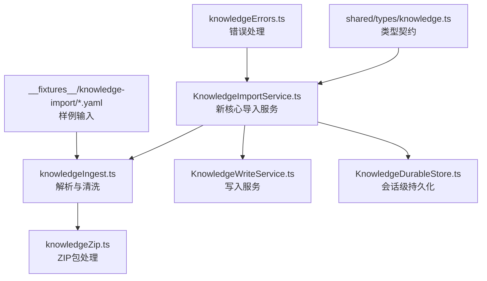
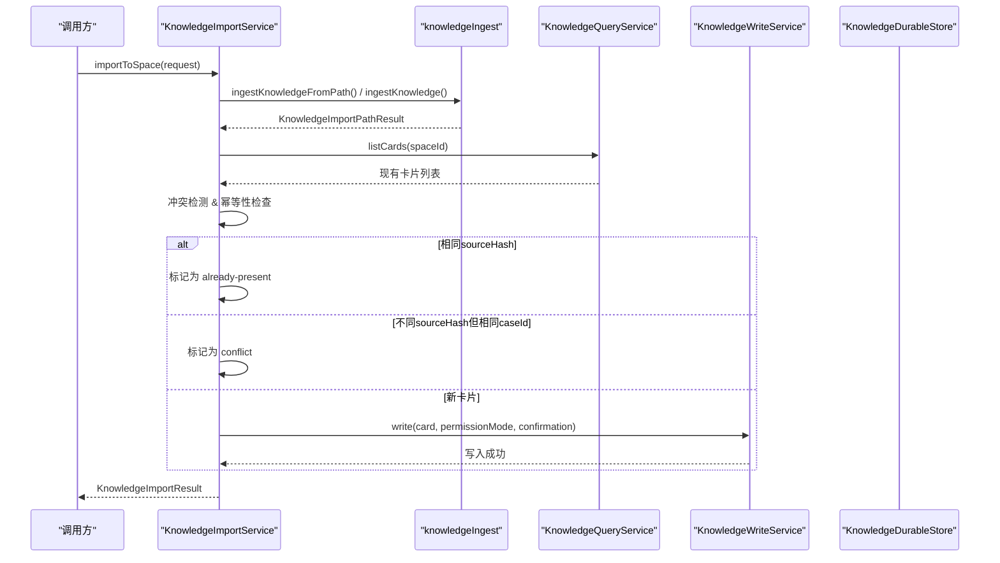
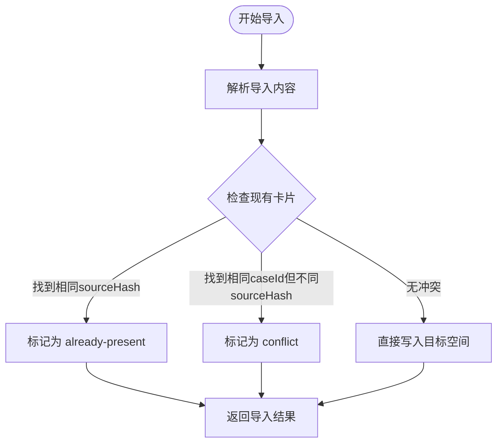
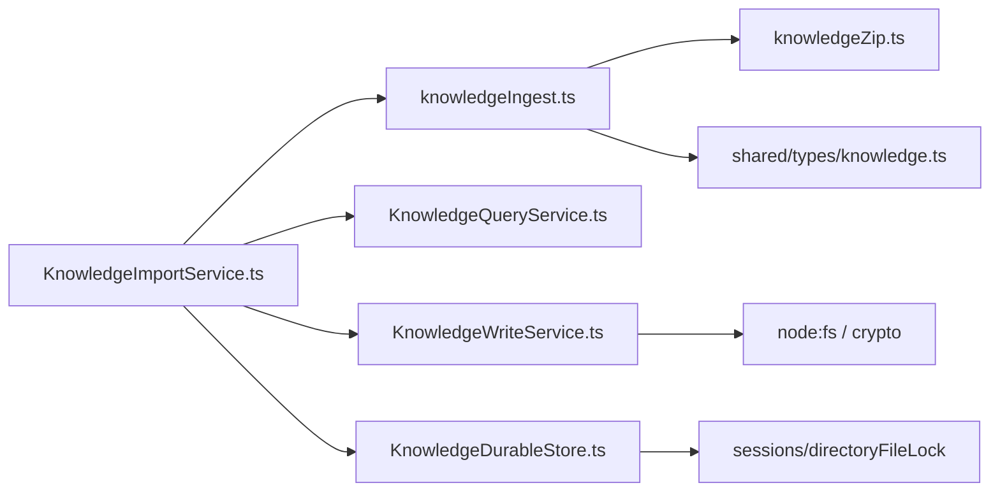

# 冷数据导入

<cite>
**本文引用的文件**
- [KnowledgeImportService.ts](file://src/main/knowledge/KnowledgeImportService.ts)
- [knowledgeIngest.ts](file://src/main/knowledge/knowledgeIngest.ts)
- [knowledgeZip.ts](file://src/main/knowledge/knowledgeZip.ts)
- [knowledge.ts](file://src/shared/types/knowledge.ts)
- [KnowledgeWriteService.ts](file://src/main/knowledge/KnowledgeWriteService.ts)
- [KnowledgeDurableStore.ts](file://src/main/knowledge/KnowledgeDurableStore.ts)
- [knowledgeErrors.ts](file://src/main/knowledge/knowledgeErrors.ts)
- [hair-adreno-sanitized.yaml](file://src/main/knowledge/__fixtures__/knowledge-import/hair-adreno-sanitized.yaml)
</cite>

## 更新摘要
**变更内容**
- **架构重构**：从基于会话的草稿工作流完全重构为直接空间导入，支持复杂的冲突解决和幂等性处理
- **新核心服务**：新增 KnowledgeImportService.ts，提供统一的导入接口，替代之前的会话级流程
- **三种导入场景**：实现从文件路径导入、内联源文本处理和遗留会话草稿迁移
- **增强冲突解决**：支持基于 sourceHash 的幂等性检测，避免重复导入相同内容
- **改进错误处理**：新增 KnowledgeDraftMigrationConflictError 等专门错误类型
- **保留兼容性**：继续支持 ZIP 包格式和 YAML 解析功能

## 目录
1. [简介](#简介)
2. [项目结构](#项目结构)
3. [核心组件](#核心组件)
4. [架构总览](#架构总览)
5. [详细组件分析](#详细组件分析)
6. [依赖关系分析](#依赖关系分析)
7. [性能考虑](#性能考虑)
8. [故障排查指南](#故障排查指南)
9. [结论](#结论)
10. [附录](#附录)

## 简介
本文件面向"知识导入"能力，围绕重构后的知识导入系统进行系统化说明。新的系统采用直接空间导入模式，替代了之前的会话级草稿工作流，提供了更强大和灵活的导入机制。内容涵盖：
- **新架构设计**：KnowledgeImportService 作为统一入口，支持多种导入场景
- **支持的格式**：YAML 文件和 ZIP 包格式，保持向后兼容
- **智能冲突解决**：基于 sourceHash 的幂等性检测和冲突识别
- **批量导入机制**：支持多卡片、图片和资源的打包传输
- **会话迁移**：自动迁移遗留会话中的草稿到目标空间
- **数据验证与清洗**：严格的安全校验、脱敏处理和标准化流程

该功能将外部 YAML 格式的"案例/知识卡片"源数据转换为系统内部的知识卡片记录，通过直接写入目标空间而非创建候选对象，简化了工作流程并提高了效率。

## 项目结构
重构后的知识导入系统主要由以下组件构成：
- **KnowledgeImportService**：新的核心导入服务，提供统一的导入接口
- **knowledgeIngest**：保留原有的解析和清洗逻辑，增强了对新架构的支持
- **knowledgeZip**：ZIP 包处理模块，保持不变
- **KnowledgeWriteService**：写入服务，负责将卡片持久化到目标空间
- **KnowledgeDurableStore**：会话级持久化存储，支持遗留草稿迁移
- **类型定义**：shared/types/knowledge.ts 中定义了所有相关的数据结构

**图表来源**
- [KnowledgeImportService.ts:151-287](file://src/main/knowledge/KnowledgeImportService.ts#L151-L287)
- [knowledgeIngest.ts:423-552](file://src/main/knowledge/knowledgeIngest.ts#L423-L552)
- [knowledgeZip.ts:1-80](file://src/main/knowledge/knowledgeZip.ts#L1-L80)
- [KnowledgeWriteService.ts:70-178](file://src/main/knowledge/KnowledgeWriteService.ts#L70-L178)
- [KnowledgeDurableStore.ts:60-220](file://src/main/knowledge/KnowledgeDurableStore.ts#L60-L220)

**章节来源**
- [KnowledgeImportService.ts:1-329](file://src/main/knowledge/KnowledgeImportService.ts#L1-L329)
- [knowledgeIngest.ts:1-808](file://src/main/knowledge/knowledgeIngest.ts#L1-L808)
- [knowledgeZip.ts:1-80](file://src/main/knowledge/knowledgeZip.ts#L1-L80)
- [knowledge.ts:111-296](file://src/shared/types/knowledge.ts#L111-L296)
- [KnowledgeWriteService.ts:1-178](file://src/main/knowledge/KnowledgeWriteService.ts#L1-L178)
- [KnowledgeDurableStore.ts:1-220](file://src/main/knowledge/KnowledgeDurableStore.ts#L1-L220)
- [knowledgeErrors.ts:1-72](file://src/main/knowledge/knowledgeErrors.ts#L1-L72)

## 核心组件
- **KnowledgeImportService（新）**
  - 提供统一的导入接口 `importToSpace()`，支持从文件或内联文本导入
  - 实现智能冲突解决：基于 sourceHash 检测重复导入，返回 'already-present' 状态
  - 支持会话草稿迁移：`migrateSessionDrafts()` 方法处理遗留会话中的草稿
  - 维护导入结果的状态跟踪：draft/quarantine/conflict 三种状态
- **知识导入解析与清洗（knowledgeIngest.ts）**
  - 支持 YAML 格式和 ZIP 包格式，严格校验必填字段（case_id/title）
  - 资产引用收集与匿名化映射，生成不可逆的 asset-id
  - 构建知识卡片的 body、preview、chapters，并进行二次脱敏校验
  - 返回 KnowledgeImportResult，包含状态、缺失资产、冲突等元信息
- **ZIP包处理（knowledgeZip.ts）**
  - 支持ZIP包的压缩和解压，限制最大解压大小为32MB
  - 提供ZIP包路径验证，防止zip-slip攻击
  - 自动识别knowledge.yaml或根目录下的单个YAML文件
- **写入服务（KnowledgeWriteService.ts）**
  - 负责将卡片写入目标空间，校验权限、审批令牌、生命周期规则与完整性
  - 支持 promote 操作，限制合法的生命周期转换
  - 原子写入确保数据一致性
- **会话级持久化（KnowledgeDurableStore.ts）**
  - 提供遗留草稿的读取和迁移功能
  - 通过目录锁保证并发安全，写后校验一致性
  - 支持空文档初始化和迁移策略

**章节来源**
- [KnowledgeImportService.ts:151-287](file://src/main/knowledge/KnowledgeImportService.ts#L151-L287)
- [knowledgeIngest.ts:423-552](file://src/main/knowledge/knowledgeIngest.ts#L423-L552)
- [knowledgeZip.ts:1-80](file://src/main/knowledge/knowledgeZip.ts#L1-L80)
- [KnowledgeWriteService.ts:70-178](file://src/main/knowledge/KnowledgeWriteService.ts#L70-L178)
- [KnowledgeDurableStore.ts:60-220](file://src/main/knowledge/KnowledgeDurableStore.ts#L60-L220)

## 架构总览
重构后的知识导入系统采用直接空间导入模式，整体流程如下：
- **请求接收**：KnowledgeImportService 接收导入请求，支持文件路径或内联文本
- **内容解析**：调用 knowledgeIngest 进行 YAML 或 ZIP 包解析，执行安全校验和清洗
- **冲突检测**：查询目标空间中现有卡片，基于 caseId 和 sourceHash 进行冲突判断
- **幂等性处理**：如果检测到相同 sourceHash 的已存在卡片，标记为 'already-present'
- **冲突解决**：对于不同 sourceHash 但相同 caseId 的情况，标记为 'conflict'
- **直接写入**：对无冲突的新卡片直接写入目标空间，跳过候选阶段
- **结果聚合**：汇总所有导入项的状态，返回统一的导入结果

**图表来源**
- [KnowledgeImportService.ts:167-268](file://src/main/knowledge/KnowledgeImportService.ts#L167-L268)
- [knowledgeIngest.ts:632-808](file://src/main/knowledge/knowledgeIngest.ts#L632-L808)
- [KnowledgeWriteService.ts:73-113](file://src/main/knowledge/KnowledgeWriteService.ts#L73-L113)

## 详细组件分析

### KnowledgeImportService（新核心服务）
**更新** 这是重构后的核心导入服务，完全替代了之前的会话级工作流

- **主要功能**
  - `importToSpace()`：统一的导入入口，支持文件路径和内联文本两种模式
  - `migrateSessionDrafts()`：迁移遗留会话中的草稿到目标空间
  - 智能冲突解决：基于 caseId 和 sourceHash 的双重检测机制
  - 幂等性保证：相同 sourceHash 的导入不会重复写入
- **冲突处理策略**
  - `alreadyPresentItem()`：当检测到相同 sourceHash 时，返回 'already-present' 状态
  - `spaceConflictItem()`：当检测到相同 caseId 但不同 sourceHash 时，返回 'conflict' 状态
  - 正常导入：无冲突时直接写入目标空间
- **会话迁移**
  - 读取遗留会话中的 leftoverDrafts
  - 检查是否与目标空间中的卡片冲突
  - 成功迁移的草稿从会话中移除，冲突的保留供后续处理

**图表来源**
- [KnowledgeImportService.ts:223-268](file://src/main/knowledge/KnowledgeImportService.ts#L223-L268)
- [KnowledgeImportService.ts:188-221](file://src/main/knowledge/KnowledgeImportService.ts#L188-L221)

**章节来源**
- [KnowledgeImportService.ts:151-287](file://src/main/knowledge/KnowledgeImportService.ts#L151-L287)

### 知识导入解析与清洗（knowledgeIngest.ts）
**更新** 增强了与新导入服务的集成，支持更多选项和更好的错误处理

- **输入与限制**
  - 支持从路径读取或内存字符串导入；默认最大 2MB，ZIP包最大32MB
  - 读取前后双重校验文件大小、修改时间与哈希，避免竞态与篡改
- **格式检测与ZIP处理**
  - 自动检测ZIP包格式：通过文件扩展名(.zip)或文件头标识(0x50 0x4b)
  - ZIP包解压限制：最大解压大小32MB，防止内存溢出攻击
  - 路径验证：防止zip-slip攻击，拒绝包含../、绝对路径等危险路径
- **解析与校验**
  - 使用 YAML 解析器；要求存在 case_id 与 title；否则返回 quarantine/yaml-broken
  - 全量字符串扫描，拒绝包含密钥模式或绝对路径的内容
- **资产与脱敏**
  - 自动收集 assets 中 file/role/sha256，并为每个原始文件名生成 opaque asset-id
  - 对 title/body/chapters/preview 中的文件名与敏感信息进行替换与清理
- **构建与标准化**
  - 根据 environment 映射出 scope（平台、API、GPU 厂商/架构、引擎/版本、设备/驱动等）
  - 将 root_cause/fix/generalization/notes 等结构化字段映射到 chapters
  - 生成相对路径 cases/{sanitized_case_id}.md 作为卡片位置

**章节来源**
- [knowledgeIngest.ts:423-552](file://src/main/knowledge/knowledgeIngest.ts#L423-L552)
- [knowledgeIngest.ts:632-808](file://src/main/knowledge/knowledgeIngest.ts#L632-L808)

### ZIP包处理（knowledgeZip.ts）
**更新** 保持原有功能，与新导入服务无缝集成

- **包格式规范**
  - 支持标准ZIP格式，使用fflate库进行压缩解压
  - 最大解压大小限制：32MB，防止内存耗尽攻击
  - 文件路径规范化：统一使用正斜杠，去除危险字符
- **安全验证**
  - zip-slip防护：拒绝包含../、空路径、绝对路径的条目
  - 路径白名单：只允许相对路径，防止文件系统逃逸
  - 大小限制：在解压过程中累计检查总大小
- **智能识别**
  - 优先选择knowledge.yaml作为清单文件
  - 支持根目录下单个YAML文件作为清单
  - 多YAML文件时返回null，要求明确指定

**章节来源**
- [knowledgeZip.ts:1-80](file://src/main/knowledge/knowledgeZip.ts#L1-L80)

### 写入服务（KnowledgeWriteService.ts）
**更新** 支持新的导入流程，提供更严格的写入控制

- **写入前校验**
  - 人类确认与审批令牌消费；禁止将 candidate 直接写入；限制 fixed 状态不可被验证
  - 若目标为 verified 且类型为 case，必须补齐必要章节
- **写入过程**
  - 解析空间根路径，构造绝对路径；递归创建父目录；原子写入并做写后哈希校验
  - 可选重建索引
- **提升（promote）**
  - 限制生命周期转换：draft 不能直接 promote；verified/promoted 有前置条件
  - 复用 write 完成持久化

**章节来源**
- [KnowledgeWriteService.ts:70-178](file://src/main/knowledge/KnowledgeWriteService.ts#L70-L178)

### 会话级持久化（KnowledgeDurableStore.ts）
**更新** 新增遗留草稿迁移功能，支持新旧系统共存

- **草稿/候选/评审存储**
  - 以 sessionId 为作用域，维护 drafts/candidates/reviews 列表
  - 每次写入计算 contentHash，基于 revision 实现乐观锁，避免覆盖冲突
- **并发与一致性**
  - 使用目录锁保护状态文件读写；写后读取校验，确保原子替换成功
  - 支持迁移策略与空文档初始化
- **遗留草稿管理**
  - `listLeftoverDrafts()`：获取会话中的遗留草稿
  - `replaceLeftoverDrafts()`：替换遗留草稿列表，支持部分迁移

**章节来源**
- [KnowledgeDurableStore.ts:60-220](file://src/main/knowledge/KnowledgeDurableStore.ts#L60-L220)

### 错误处理（knowledgeErrors.ts）
**更新** 新增专门的迁移冲突错误类型

- **新增错误类型**
  - `KnowledgeDraftMigrationConflictError`：处理会话草稿迁移时的冲突情况
  - 保留了原有的各种知识相关错误类型
- **错误码规范**
  - 所有错误都包含明确的错误码，便于上层处理
  - 错误消息包含详细的上下文信息

**章节来源**
- [knowledgeErrors.ts:1-72](file://src/main/knowledge/knowledgeErrors.ts#L1-L72)

### 示例输入（hair-adreno-sanitized.yaml）
**更新** 保持原有示例，用于理解字段映射与章节构建效果

- 展示了一个最小化的案例条目，包含 case_id/title/meta/environment/repro/assets/symptoms/evidence/investigation/root_cause/fix/verification_plan/generalization/notes 等字段
- 可用于理解字段映射与章节构建效果

**章节来源**
- [hair-adreno-sanitized.yaml:1-43](file://src/main/knowledge/__fixtures__/knowledge-import/hair-adreno-sanitized.yaml#L1-L43)

## 依赖关系分析
**更新** 新的依赖关系反映了重构后的架构

- **KnowledgeImportService 依赖**
  - knowledgeIngest：用于内容解析和清洗
  - KnowledgeQueryService：用于查询目标空间中的现有卡片
  - KnowledgeWriteService：用于将卡片写入目标空间
  - KnowledgeDurableStore：用于处理遗留会话草稿
- **knowledgeIngest 依赖**
  - node:crypto 用于哈希；node:fs 用于文件 IO；yaml 解析器；共享类型
  - knowledgeZip 用于ZIP包处理
- **与持久化层的耦合**
  - 通过 DurableStore 在会话内维护遗留草稿，保证并发安全与一致性

**图表来源**
- [KnowledgeImportService.ts:1-28](file://src/main/knowledge/KnowledgeImportService.ts#L1-L28)
- [knowledgeIngest.ts:1-30](file://src/main/knowledge/knowledgeIngest.ts#L1-L30)
- [knowledgeZip.ts:1-2](file://src/main/knowledge/knowledgeZip.ts#L1-L2)
- [KnowledgeWriteService.ts:1-18](file://src/main/knowledge/KnowledgeWriteService.ts#L1-L18)
- [KnowledgeDurableStore.ts:1-25](file://src/main/knowledge/KnowledgeDurableStore.ts#L1-L25)

**章节来源**
- [KnowledgeImportService.ts:1-329](file://src/main/knowledge/KnowledgeImportService.ts#L1-L329)
- [knowledgeIngest.ts:1-808](file://src/main/knowledge/knowledgeIngest.ts#L1-L808)
- [knowledgeZip.ts:1-80](file://src/main/knowledge/knowledgeZip.ts#L1-L80)
- [KnowledgeWriteService.ts:1-178](file://src/main/knowledge/KnowledgeWriteService.ts#L1-L178)
- [KnowledgeDurableStore.ts:1-220](file://src/main/knowledge/KnowledgeDurableStore.ts#L1-L220)

## 性能考虑
**更新** 新的架构提供了更好的性能优化机会

- **大文件与内存控制**
  - 默认限制 2MB（YAML）或 32MB（ZIP包），可通过 maxBytes 调优
  - 读取前后统计 size/mtime/hash，避免重复解析与竞态
  - ZIP包解压时累计检查总大小，防止内存溢出
- **解析与扫描复杂度**
  - YAML 解析 O(n)；字符串扫描与正则匹配 O(n)；资产收集与脱敏替换 O(n)
  - ZIP包解压 O(n)，路径验证 O(m)（m为文件数量）
- **批量导入优化**
  - 新的 KnowledgeImportService 支持批量导入，减少多次网络调用
  - 建议按批次提交（如每批 50-200 条），结合事务或幂等键减少重试成本
  - 使用并发度控制（worker pool）与背压，避免阻塞主线程
- **冲突检测优化**
  - 基于 caseId 的快速索引查找，避免全表扫描
  - sourceHash 比较使用预计算的哈希值，提高比较效率
- **缓存与去重**
  - 利用 sourceHash/contentHash 做增量导入与去重，跳过无变更条目
  - 新的架构支持更好的缓存策略，减少重复解析开销
- **监控与可观测性**
  - 记录各阶段耗时、错误码、缺失资产数量、隔离原因等指标
  - 对异常路径（quarantine/conflict）集中告警

## 故障排查指南
**更新** 新增了迁移相关的故障排查指导

- **常见隔离原因**
  - secret-detected：检测到疑似密钥或凭证片段
  - absolute-path：包含 Windows/UNC/POSIX 绝对路径
  - yaml-broken：YAML 解析失败或缺少必填字段
  - filename-leaked：脱敏后仍存在原始文件名
  - source-too-large：超过最大字节限制（YAML 2MB，ZIP包 32MB）
  - source-unreadable：无法读取源文件
  - source-changed：读取期间文件被修改（size/mtime/hash 不一致）
  - duplicate-case-id：与现有 case_id 冲突
  - missing-assets：部分资产不在可用集合中
  - zip-invalid：ZIP包格式错误或损坏
  - zip-path-invalid：ZIP包包含危险路径（zip-slip攻击）
  - zip-too-large：ZIP包解压后超过32MB限制
- **新架构特有错误**
  - KNOWLEDGE_SPACE_UNKNOWN：指定的知识空间不存在
  - KNOWLEDGE_DRAFT_MIGRATION_CONFLICT：会话草稿迁移时发生冲突
  - already-present：相同 sourceHash 的卡片已存在于目标空间
  - duplicate-case-id：相同 caseId 但不同 sourceHash 的冲突
- **定位步骤**
  - 查看 KnowledgeImportResult.reason 与 missingAssets
  - 检查 YAML 中是否存在敏感词或绝对路径
  - 核对 availableAssetNames 是否覆盖所有 assets.file
  - 确认文件系统权限与路径有效性
  - 对于ZIP包问题，检查包结构和文件路径
  - 对于迁移冲突，检查会话草稿和目标空间的对应关系
- **恢复策略**
  - 修正 YAML 内容或移除敏感信息
  - 补充缺失资产或扩大 availableAssetNames
  - 对冲突 case_id 进行重命名或合并策略处理
  - 对过大文件拆分或提高 maxBytes（谨慎评估安全风险）
  - 修复ZIP包结构，确保路径安全
  - 对于迁移冲突，手动处理冲突的草稿

**章节来源**
- [KnowledgeImportService.ts:167-268](file://src/main/knowledge/KnowledgeImportService.ts#L167-L268)
- [knowledgeIngest.ts:423-552](file://src/main/knowledge/knowledgeIngest.ts#L423-L552)
- [knowledgeZip.ts:6-18](file://src/main/knowledge/knowledgeZip.ts#L6-L18)
- [knowledgeErrors.ts:63-72](file://src/main/knowledge/knowledgeErrors.ts#L63-L72)
- [knowledge.ts:275-296](file://src/shared/types/knowledge.ts#L275-L296)

## 结论
重构后的知识导入系统通过引入 KnowledgeImportService 提供了更加强大和灵活的导入能力。新的架构实现了从会话级工作流向直接空间导入的转变，带来了以下优势：

- **简化的工作流程**：跳过候选阶段，直接写入目标空间，提高效率
- **增强的冲突解决**：基于 sourceHash 的幂等性检测，避免重复导入
- **更好的兼容性**：支持遗留会话草稿的自动迁移
- **更强的安全性**：保持原有的严格安全校验和脱敏机制
- **更好的可扩展性**：模块化设计便于未来功能扩展

配合原有的 ZIP 包支持、YAML 解析、图片处理等功能，新系统为大规模知识导入提供了稳定高效的解决方案。对于企业级应用场景，建议采用分批导入、并发控制和完善的监控机制，以获得最佳的性能和可靠性。

## 附录
- **字段映射要点**
  - environment -> scope：platform/api/gpuVendor/gpuArch/engine/engineVersion/device/driver/featureConfiguration
  - root_cause/fix/generalization/notes -> chapters：claim/symptoms/evidence/rootCause/experimentVerification/fix/negative/openChallenges/derived
- **ZIP包格式规范**
  - 清单文件：knowledge.yaml 或根目录下单个YAML文件
  - 资源文件：与YAML同目录的图片文件会自动关联
  - 大小限制：解压后总大小不超过32MB
  - 路径安全：只允许相对路径，防止zip-slip攻击
- **新导入特性**
  - 幂等性保证：相同 sourceHash 的导入不会产生重复数据
  - 冲突检测：基于 caseId 的智能冲突识别和处理
  - 会话迁移：自动处理遗留会话中的草稿数据
- **示例参考**
  - 参见 hair-adreno-sanitized.yaml，了解典型字段组织与章节构建效果

**章节来源**
- [knowledgeIngest.ts:171-189](file://src/main/knowledge/knowledgeIngest.ts#L171-L189)
- [knowledgeIngest.ts:303-341](file://src/main/knowledge/knowledgeIngest.ts#L303-L341)
- [knowledgeZip.ts:3-63](file://src/main/knowledge/knowledgeZip.ts#L3-L63)
- [KnowledgeImportService.ts:167-268](file://src/main/knowledge/KnowledgeImportService.ts#L167-L268)
- [hair-adreno-sanitized.yaml:1-43](file://src/main/knowledge/__fixtures__/knowledge-import/hair-adreno-sanitized.yaml#L1-L43)