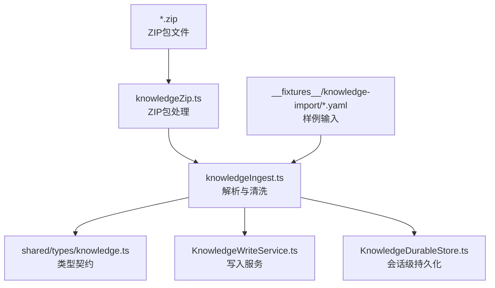
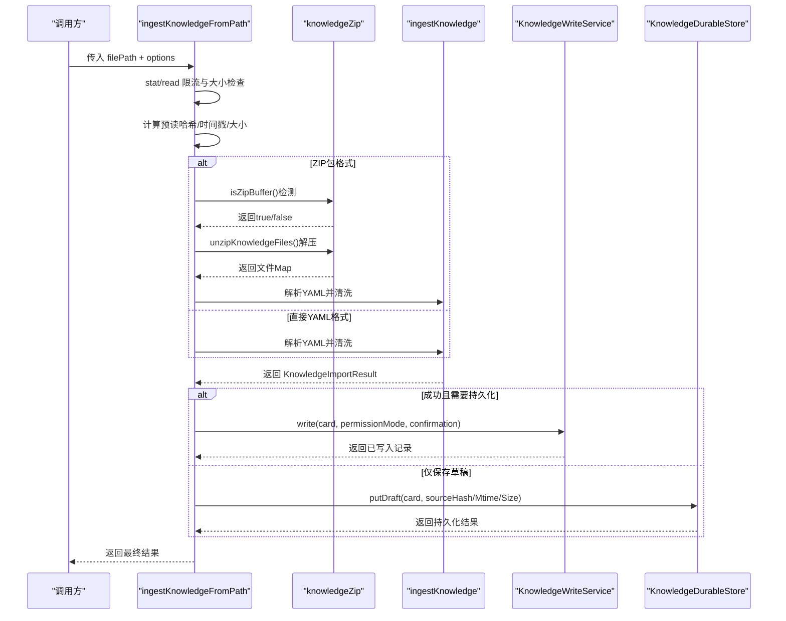
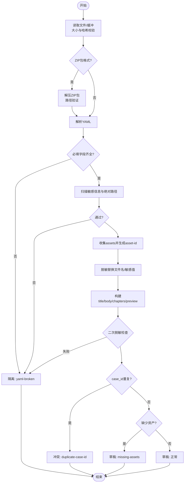
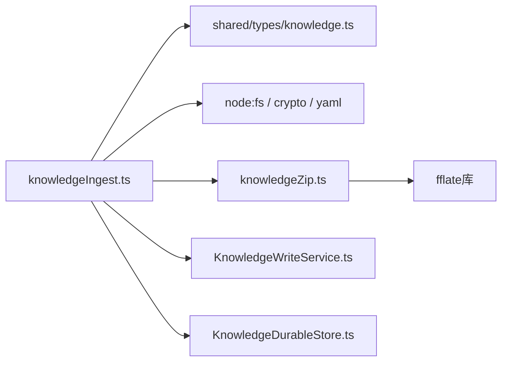

# 知识导入

<cite>
**本文引用的文件**
- [knowledgeIngest.ts](file://src/main/knowledge/knowledgeIngest.ts)
- [knowledgeZip.ts](file://src/main/knowledge/knowledgeZip.ts)
- [knowledge.ts](file://src/shared/types/knowledge.ts)
- [KnowledgeWriteService.ts](file://src/main/knowledge/KnowledgeWriteService.ts)
- [KnowledgeDurableStore.ts](file://src/main/knowledge/KnowledgeDurableStore.ts)
- [hair-adreno-sanitized.yaml](file://src/main/knowledge/__fixtures__/knowledge-import/hair-adreno-sanitized.yaml)
</cite>

## 更新摘要
**变更内容**
- 新增ZIP包格式支持，包括knowledgeZip.ts模块、ZIP导入导出功能
- 支持32MB大小限制的ZIP包处理
- 更新了导入流程以支持ZIP文件自动检测和提取
- 改进了错误处理和部分成功场景的处理机制
- 增强了图片打包处理和路径验证安全机制

## 目录
1. [简介](#简介)
2. [项目结构](#项目结构)
3. [核心组件](#核心组件)
4. [架构总览](#架构总览)
5. [详细组件分析](#详细组件分析)
6. [依赖关系分析](#依赖关系分析)
7. [性能考虑](#性能考虑)
8. [故障排查指南](#故障排查指南)
9. [结论](#结论)
10. [附录](#附录)

## 简介
本文件面向"知识导入"能力，围绕 knowledgeIngest 模块的数据导入流程进行系统化说明。内容涵盖：
- 支持的文件格式与解析策略（YAML文件和ZIP包格式）
- 数据验证、清洗与标准化（脱敏、去重、关系建立）
- 批量导入机制、进度跟踪、错误处理与回滚策略
- 大数据量处理与性能优化建议
- 导入监控与日志记录实践

该功能将外部 YAML 格式的"案例/知识卡片"源数据转换为系统内部的知识卡片记录，并在安全校验通过后进入草稿状态，供后续审核与发布。现已支持ZIP包格式导入，可一次性导入多个知识卡片及相关资源文件。

## 项目结构
知识导入相关代码主要位于 knowledge 子系统中，核心入口为 knowledgeIngest.ts；ZIP包处理由knowledgeZip.ts负责；类型定义集中在 shared/types/knowledge.ts；写入持久化由 KnowledgeWriteService.ts 负责；会话级草稿/候选/评审的持久化由 KnowledgeDurableStore.ts 管理；示例输入见 __fixtures__/knowledge-import。

**图表来源**
- [knowledgeIngest.ts:341-475](file://src/main/knowledge/knowledgeIngest.ts#L341-L475)
- [knowledgeZip.ts:1-80](file://src/main/knowledge/knowledgeZip.ts#L1-L80)
- [knowledge.ts:111-132](file://src/shared/types/knowledge.ts#L111-L132)
- [KnowledgeWriteService.ts:73-113](file://src/main/knowledge/KnowledgeWriteService.ts#L73-L113)
- [KnowledgeDurableStore.ts:89-183](file://src/main/knowledge/KnowledgeDurableStore.ts#L89-L183)
- [hair-adreno-sanitized.yaml:1-43](file://src/main/knowledge/__fixtures__/knowledge-import/hair-adreno-sanitized.yaml#L1-L43)

**章节来源**
- [knowledgeIngest.ts:1-776](file://src/main/knowledge/knowledgeIngest.ts#L1-L776)
- [knowledgeZip.ts:1-80](file://src/main/knowledge/knowledgeZip.ts#L1-L80)
- [knowledge.ts:111-292](file://src/shared/types/knowledge.ts#L111-L292)
- [KnowledgeWriteService.ts:1-178](file://src/main/knowledge/KnowledgeWriteService.ts#L1-L178)
- [KnowledgeDurableStore.ts:1-211](file://src/main/knowledge/KnowledgeDurableStore.ts#L1-L211)
- [hair-adreno-sanitized.yaml:1-43](file://src/main/knowledge/__fixtures__/knowledge-import/hair-adreno-sanitized.yaml#L1-L43)

## 核心组件
- 知识导入解析与清洗（knowledgeIngest.ts）
  - 支持 YAML 格式和 ZIP 包格式，严格校验必填字段（case_id/title），并执行敏感信息与绝对路径检测。
  - 资产引用收集与匿名化映射，生成不可逆的 asset-id。
  - 构建知识卡片的 body、preview、chapters，并进行二次脱敏校验。
  - 返回 KnowledgeImportResult，包含状态、缺失资产、冲突等元信息。
- ZIP包处理（knowledgeZip.ts）
  - 支持ZIP包的压缩和解压，限制最大解压大小为32MB。
  - 提供ZIP包路径验证，防止zip-slip攻击。
  - 自动识别knowledge.yaml或根目录下的单个YAML文件。
  - 支持UTF-8编码的文本转换。
- 类型契约（shared/types/knowledge.ts）
  - 定义 KnowledgeCardRecord、KnowledgeImportResult、KnowledgeCaseChapters 等关键类型。
  - 约束生命周期、范围、章节结构与来源哈希等字段。
- 写入服务（KnowledgeWriteService.ts）
  - 负责将卡片写入目标空间，校验权限、审批令牌、生命周期规则与完整性。
  - 支持 promote 操作，限制合法的生命周期转换。
- 会话级持久化（KnowledgeDurableStore.ts）
  - 提供 putDraft/putCandidate/putReview 等原子写入，带版本号与内容哈希防冲突。
  - 通过目录锁保证并发安全，写后校验一致性。

**章节来源**
- [knowledgeIngest.ts:341-475](file://src/main/knowledge/knowledgeIngest.ts#L341-L475)
- [knowledgeZip.ts:1-80](file://src/main/knowledge/knowledgeZip.ts#L1-L80)
- [knowledge.ts:111-292](file://src/shared/types/knowledge.ts#L111-L292)
- [KnowledgeWriteService.ts:73-178](file://src/main/knowledge/KnowledgeWriteService.ts#L73-L178)
- [KnowledgeDurableStore.ts:89-183](file://src/main/knowledge/KnowledgeDurableStore.ts#L89-L183)

## 架构总览
知识导入的整体流程如下：
- 读取与限流：从文件或内存缓冲读取 YAML 或 ZIP 包，限制最大字节数，防止资源耗尽。
- 格式检测：自动检测ZIP包格式，使用文件扩展名或文件头标识。
- 解析与校验：解析 YAML，校验必填字段，扫描敏感信息与绝对路径。
- 资产与脱敏：收集 assets 引用，生成匿名 asset-id，对文本与字段进行脱敏替换。
- 构建与再校验：组装 title/body/chapters/preview，再次检查是否泄露文件名或敏感信息。
- 结果输出：返回 draft/quarantine/conflict 状态及 record、missingAssets、reason 等。
- 持久化：通过 WriteService 或 DurableStore 落盘，确保原子性与一致性。

**图表来源**
- [knowledgeIngest.ts:600-776](file://src/main/knowledge/knowledgeIngest.ts#L600-L776)
- [knowledgeIngest.ts:341-475](file://src/main/knowledge/knowledgeIngest.ts#L341-L475)
- [knowledgeZip.ts:34-56](file://src/main/knowledge/knowledgeZip.ts#L34-L56)
- [KnowledgeWriteService.ts:73-113](file://src/main/knowledge/KnowledgeWriteService.ts#L73-L113)
- [KnowledgeDurableStore.ts:89-183](file://src/main/knowledge/KnowledgeDurableStore.ts#L89-L183)

## 详细组件分析

### 知识导入解析与清洗（knowledgeIngest.ts）
- 输入与限制
  - 支持从路径读取或内存字符串导入；默认最大 2MB，ZIP包最大32MB，可通过 maxBytes 调整。
  - 读取前后双重校验文件大小、修改时间与哈希，避免竞态与篡改。
- 格式检测与ZIP处理
  - 自动检测ZIP包格式：通过文件扩展名(.zip)或文件头标识(0x50 0x4b)。
  - ZIP包解压限制：最大解压大小32MB，防止内存溢出攻击。
  - 路径验证：防止zip-slip攻击，拒绝包含../、绝对路径等危险路径。
- 解析与校验
  - 使用 YAML 解析器；要求存在 case_id 与 title；否则返回 quarantine/yaml-broken。
  - 全量字符串扫描，拒绝包含密钥模式或绝对路径的内容。
- 资产与脱敏
  - 自动收集 assets 中 file/role/sha256，并为每个原始文件名生成 opaque asset-id。
  - 对 title/body/chapters/preview 中的文件名与敏感信息进行替换与清理。
  - 若发现文件名仍出现在最终文本中，视为 filename-leaked 并隔离。
- 构建与标准化
  - 根据 environment 映射出 scope（平台、API、GPU 厂商/架构、引擎/版本、设备/驱动等）。
  - 将 root_cause/fix/generalization/notes 等结构化字段映射到 chapters，并序列化为章节内容。
  - 生成相对路径 cases/{sanitized_case_id}.md 作为卡片位置。
- 冲突与缺失
  - 若 existingCaseIds 包含相同 case_id，返回 conflict/duplicate-case-id。
  - 若 availableAssetNames 未覆盖全部 assets，返回 missing-assets 列表。
- 输出
  - 成功时返回 status=draft 与 record；失败时返回 quarantine/conflict 与 reason。

**图表来源**
- [knowledgeIngest.ts:341-475](file://src/main/knowledge/knowledgeIngest.ts#L341-L475)
- [knowledgeIngest.ts:600-776](file://src/main/knowledge/knowledgeIngest.ts#L600-L776)

**章节来源**
- [knowledgeIngest.ts:1-776](file://src/main/knowledge/knowledgeIngest.ts#L1-L776)

### ZIP包处理（knowledgeZip.ts）
- 包格式规范
  - 支持标准ZIP格式，使用fflate库进行压缩解压。
  - 最大解压大小限制：32MB，防止内存耗尽攻击。
  - 文件路径规范化：统一使用正斜杠，去除危险字符。
- 安全验证
  - zip-slip防护：拒绝包含../、空路径、绝对路径的条目。
  - 路径白名单：只允许相对路径，防止文件系统逃逸。
  - 大小限制：在解压过程中累计检查总大小。
- 智能识别
  - 优先选择knowledge.yaml作为清单文件。
  - 支持根目录下单个YAML文件作为清单。
  - 多YAML文件时返回null，要求明确指定。
- 工具函数
  - zipKnowledgeFiles：创建ZIP包，支持多文件打包。
  - unzipKnowledgeFiles：解压ZIP包，返回文件Map。
  - pickKnowledgeYamlEntry：智能选择YAML清单文件。
  - isZipBuffer：通过文件头标识检测ZIP格式。

**章节来源**
- [knowledgeZip.ts:1-80](file://src/main/knowledge/knowledgeZip.ts#L1-L80)

### 类型与数据结构（shared/types/knowledge.ts）
- KnowledgeCardRecord
  - 包含 cardId/spaceId/relativePath/type/lifecycle/title/scope/relations/body/preview 等。
  - 新增 sourceStatus/sourceHash/sourceMtimeMs/sourceSize 用于知识导入溯源与一致性校验。
- KnowledgeImportResult
  - 状态包括 draft/quarantine/conflict；附带 missingAssets/reason/existingCaseId 等上下文。
- KnowledgeCaseChapters
  - 定义 claim/symptoms/evidence/rootCause/fix/negative/openChallenges/derived 等章节键。

**章节来源**
- [knowledge.ts:111-292](file://src/shared/types/knowledge.ts#L111-L292)

### 写入服务（KnowledgeWriteService.ts）
- 写入前校验
  - 人类确认与审批令牌消费；禁止将 candidate 直接写入；限制 fixed 状态不可被验证。
  - 若目标为 verified 且类型为 case，必须补齐必要章节。
- 写入过程
  - 解析空间根路径，构造绝对路径；递归创建父目录；原子写入并做写后哈希校验。
  - 可选重建索引。
- 提升（promote）
  - 限制生命周期转换：draft 不能直接 promote；verified/promoted 有前置条件。
  - 复用 write 完成持久化。

**章节来源**
- [KnowledgeWriteService.ts:73-178](file://src/main/knowledge/KnowledgeWriteService.ts#L73-L178)

### 会话级持久化（KnowledgeDurableStore.ts）
- 草稿/候选/评审存储
  - 以 sessionId 为作用域，维护 drafts/candidates/reviews 列表。
  - 每次写入计算 contentHash，基于 revision 实现乐观锁，避免覆盖冲突。
- 并发与一致性
  - 使用目录锁保护状态文件读写；写后读取校验，确保原子替换成功。
  - 支持迁移策略与空文档初始化。

**章节来源**
- [KnowledgeDurableStore.ts:89-183](file://src/main/knowledge/KnowledgeDurableStore.ts#L89-L183)

### 示例输入（hair-adreno-sanitized.yaml）
- 展示了一个最小化的案例条目，包含 case_id/title/meta/environment/repro/assets/symptoms/evidence/investigation/root_cause/fix/verification_plan/generalization/notes 等字段。
- 可用于理解字段映射与章节构建效果。

**章节来源**
- [hair-adreno-sanitized.yaml:1-43](file://src/main/knowledge/__fixtures__/knowledge-import/hair-adreno-sanitized.yaml#L1-L43)

## 依赖关系分析
- knowledgeIngest.ts 依赖
  - node:crypto 用于哈希；node:fs 用于文件 IO；yaml 解析器；共享类型。
  - knowledgeZip.ts 用于ZIP包处理。
- 与写入服务的耦合
  - 知识导入通常先产出 draft 记录，再由上层编排调用 WriteService 完成发布或提升。
- 与持久化层的耦合
  - 通过 DurableStore 在会话内维护草稿/候选/评审，保证并发安全与一致性。

**图表来源**
- [knowledgeIngest.ts:1-29](file://src/main/knowledge/knowledgeIngest.ts#L1-L29)
- [knowledgeZip.ts:1-2](file://src/main/knowledge/knowledgeZip.ts#L1-L2)
- [KnowledgeWriteService.ts:1-18](file://src/main/knowledge/KnowledgeWriteService.ts#L1-L18)
- [KnowledgeDurableStore.ts:1-23](file://src/main/knowledge/KnowledgeDurableStore.ts#L1-L23)
- [knowledge.ts:111-132](file://src/shared/types/knowledge.ts#L111-L132)

**章节来源**
- [knowledgeIngest.ts:1-776](file://src/main/knowledge/knowledgeIngest.ts#L1-L776)
- [knowledgeZip.ts:1-80](file://src/main/knowledge/knowledgeZip.ts#L1-L80)
- [KnowledgeWriteService.ts:1-178](file://src/main/knowledge/KnowledgeWriteService.ts#L1-L178)
- [KnowledgeDurableStore.ts:1-211](file://src/main/knowledge/KnowledgeDurableStore.ts#L1-L211)
- [knowledge.ts:111-292](file://src/shared/types/knowledge.ts#L111-L292)

## 性能考虑
- 大文件与内存控制
  - 默认限制 2MB（YAML）或 32MB（ZIP包），可通过 maxBytes 调优；对超大文件建议分片或流式处理。
  - 读取前后统计 size/mtime/hash，避免重复解析与竞态。
  - ZIP包解压时累计检查总大小，防止内存溢出。
- 解析与扫描复杂度
  - YAML 解析 O(n)；字符串扫描与正则匹配 O(n)；资产收集与脱敏替换 O(n)。
  - ZIP包解压 O(n)，路径验证 O(m)（m为文件数量）。
  - 建议对超大型 YAML 启用分块解析或预处理过滤。
- 批量导入
  - 建议按批次提交（如每批 50-200 条），结合事务或幂等键减少重试成本。
  - 使用并发度控制（worker pool）与背压，避免阻塞主线程。
  - ZIP包支持多卡片批量导入，提高传输效率。
- 索引与写入
  - 写入后按需重建索引；大批量时可合并重建以减少开销。
  - 使用原子写入与写后校验，降低不一致风险。
- 缓存与去重
  - 利用 sourceHash/contentHash 做增量导入与去重，跳过无变更条目。
- 监控与可观测性
  - 记录各阶段耗时、错误码、缺失资产数量、隔离原因等指标。
  - 对异常路径（quarantine/conflict）集中告警。

## 故障排查指南
- 常见隔离原因
  - secret-detected：检测到疑似密钥或凭证片段。
  - absolute-path：包含 Windows/UNC/POSIX 绝对路径。
  - yaml-broken：YAML 解析失败或缺少必填字段。
  - filename-leaked：脱敏后仍存在原始文件名。
  - source-too-large：超过最大字节限制（YAML 2MB，ZIP包 32MB）。
  - source-unreadable：无法读取源文件。
  - source-changed：读取期间文件被修改（size/mtime/hash 不一致）。
  - duplicate-case-id：与现有 case_id 冲突。
  - missing-assets：部分资产不在可用集合中。
  - zip-invalid：ZIP包格式错误或损坏。
  - zip-path-invalid：ZIP包包含危险路径（zip-slip攻击）。
  - zip-too-large：ZIP包解压后超过32MB限制。
- 定位步骤
  - 查看 KnowledgeImportResult.reason 与 missingAssets。
  - 检查 YAML 中是否存在敏感词或绝对路径。
  - 核对 availableAssetNames 是否覆盖所有 assets.file。
  - 确认文件系统权限与路径有效性。
  - 对于ZIP包问题，检查包结构和文件路径。
- 恢复策略
  - 修正 YAML 内容或移除敏感信息。
  - 补充缺失资产或扩大 availableAssetNames。
  - 对冲突 case_id 进行重命名或合并策略处理。
  - 对过大文件拆分或提高 maxBytes（谨慎评估安全风险）。
  - 修复ZIP包结构，确保路径安全。

**章节来源**
- [knowledgeIngest.ts:341-475](file://src/main/knowledge/knowledgeIngest.ts#L341-L475)
- [knowledgeIngest.ts:600-776](file://src/main/knowledge/knowledgeIngest.ts#L600-L776)
- [knowledgeZip.ts:6-18](file://src/main/knowledge/knowledgeZip.ts#L6-L18)
- [knowledge.ts:276-292](file://src/shared/types/knowledge.ts#L276-L292)

## 结论
knowledgeIngest 模块提供了安全、健壮且可扩展的知识导入能力。通过严格的校验与脱敏、资产匿名化、冲突检测与缺失提示，确保导入数据的质量与合规性。新增的ZIP包支持功能使得批量导入更加便捷，支持多卡片、图片和资源的打包传输。配合 WriteService 与 DurableStore，可实现从草稿到发布的完整生命周期管理。对于大规模导入场景，建议采用分批、并发、去重与监控等手段，以获得稳定高效的导入体验。

## 附录
- 字段映射要点
  - environment -> scope：platform/api/gpuVendor/gpuArch/engine/engineVersion/device/driver/featureConfiguration。
  - root_cause/fix/generalization/notes -> chapters：claim/symptoms/evidence/rootCause/experimentVerification/fix/negative/openChallenges/derived。
- ZIP包格式规范
  - 清单文件：knowledge.yaml 或根目录下单个YAML文件。
  - 资源文件：与YAML同目录的图片文件会自动关联。
  - 大小限制：解压后总大小不超过32MB。
  - 路径安全：只允许相对路径，防止zip-slip攻击。
- 示例参考
  - 参见 hair-adreno-sanitized.yaml，了解典型字段组织与章节构建效果。

**章节来源**
- [knowledgeIngest.ts:102-120](file://src/main/knowledge/knowledgeIngest.ts#L102-L120)
- [knowledgeIngest.ts:234-251](file://src/main/knowledge/knowledgeIngest.ts#L234-L251)
- [knowledgeZip.ts:3-63](file://src/main/knowledge/knowledgeZip.ts#L3-L63)
- [hair-adreno-sanitized.yaml:1-43](file://src/main/knowledge/__fixtures__/knowledge-import/hair-adreno-sanitized.yaml#L1-L43)