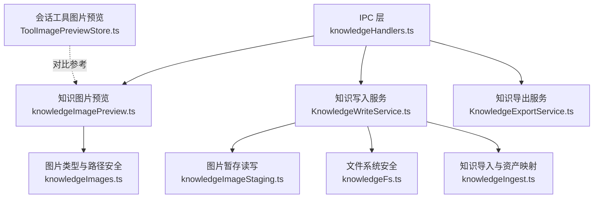
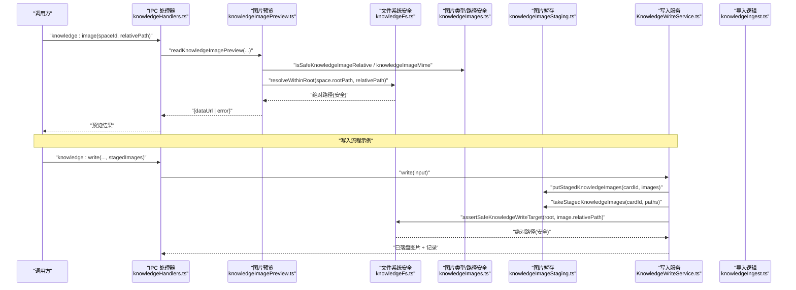
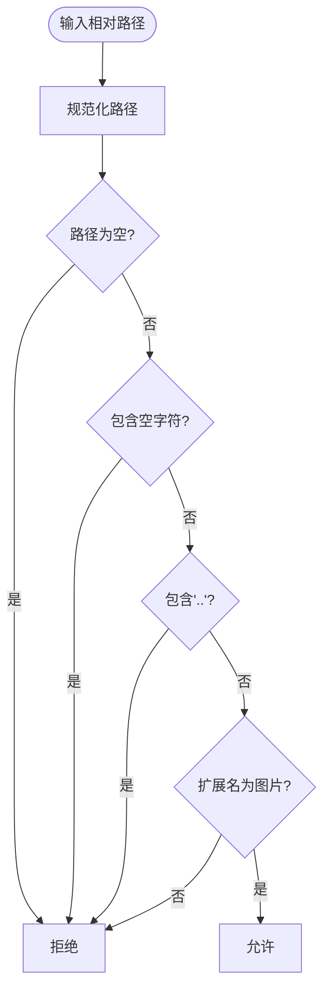
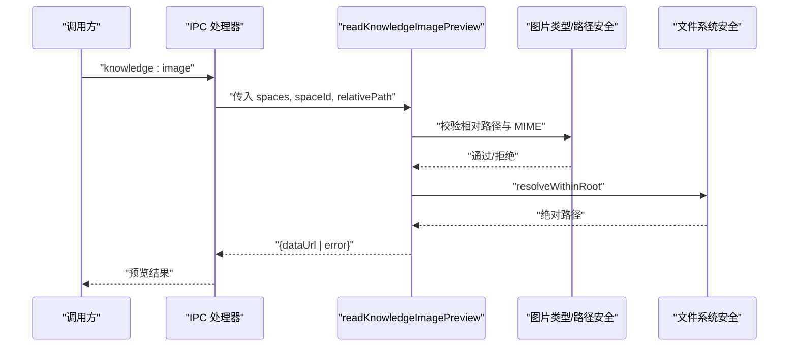
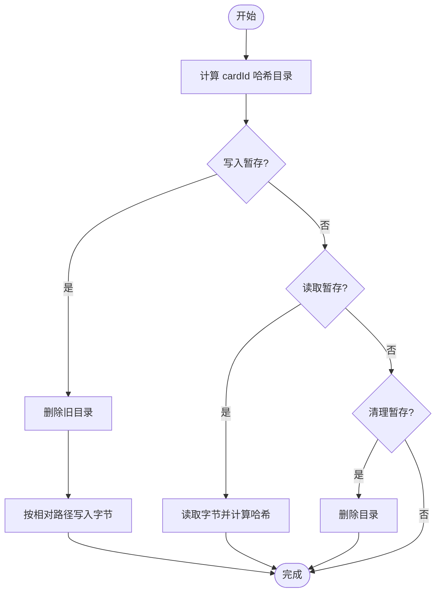
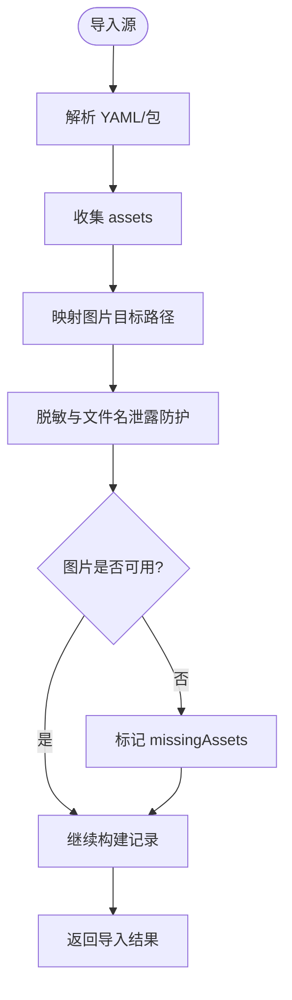
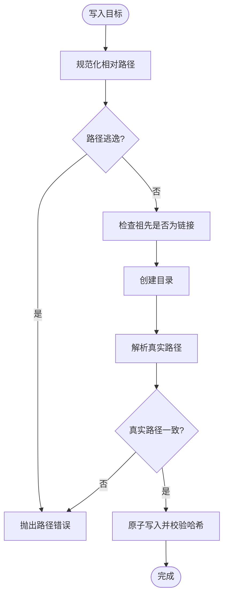
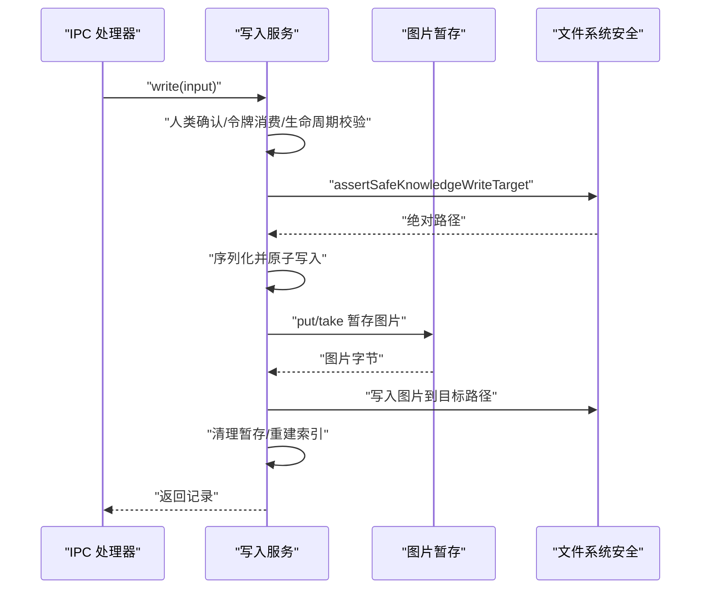
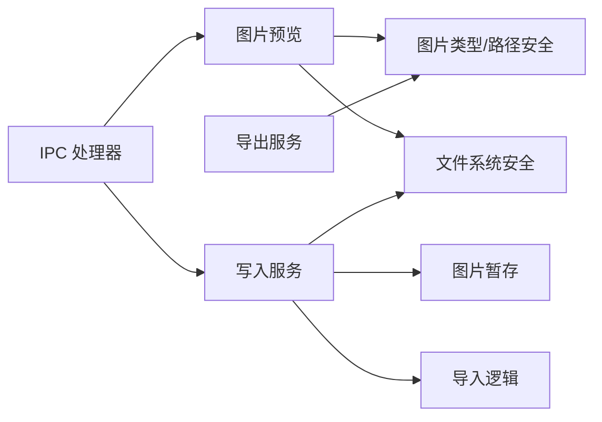

# 知识中心图片支持

<cite>
**本文引用的文件**
- [knowledgeImagePreview.ts](file://src/main/knowledge/knowledgeImagePreview.ts)
- [knowledgeImages.ts](file://src/main/knowledge/knowledgeImages.ts)
- [knowledgeImageStaging.ts](file://src/main/knowledge/knowledgeImageStaging.ts)
- [knowledgeIngest.ts](file://src/main/knowledge/knowledgeIngest.ts)
- [knowledgeFs.ts](file://src/main/knowledge/knowledgeFs.ts)
- [KnowledgeWriteService.ts](file://src/main/knowledge/KnowledgeWriteService.ts)
- [KnowledgeExportService.ts](file://src/main/knowledge/KnowledgeExportService.ts)
- [knowledgeHandlers.ts](file://src/main/ipc/knowledgeHandlers.ts)
- [ToolImagePreviewStore.ts](file://src/main/conversation/ToolImagePreviewStore.ts)
</cite>

## 目录
1. [简介](#简介)
2. [项目结构](#项目结构)
3. [核心组件](#核心组件)
4. [架构总览](#架构总览)
5. [详细组件分析](#详细组件分析)
6. [依赖关系分析](#依赖关系分析)
7. [性能考虑](#性能考虑)
8. [故障排查指南](#故障排查指南)
9. [结论](#结论)

## 简介
本章节聚焦 RDC-Agent 中“知识中心”的图片支持能力，涵盖图片的导入、暂存、校验、持久化与预览读取。系统通过严格的相对路径与安全策略，确保知识卡片中的图片引用安全可控；同时提供 IPC 接口供前端或工具调用，实现安全的图片预览与写入流程。

## 项目结构
围绕知识中心图片支持的关键代码分布在 main 进程的知识模块与 IPC 层：
- 知识图片类型与路径安全：knowledgeImages.ts
- 图片预览读取：knowledgeImagePreview.ts
- 图片暂存与清理：knowledgeImageStaging.ts
- 知识导入与资产映射：knowledgeIngest.ts
- 文件系统安全与原子写入：knowledgeFs.ts
- 知识写入服务（含图片落盘）：KnowledgeWriteService.ts
- 知识导出（包含图片元信息）：KnowledgeExportService.ts
- IPC 处理器（暴露 knowledge:image 等接口）：knowledgeHandlers.ts
- 会话内工具图片预览（对比参考）：ToolImagePreviewStore.ts

图表来源
- [knowledgeHandlers.ts:300-315](file://src/main/ipc/knowledgeHandlers.ts#L300-L315)
- [knowledgeImagePreview.ts:11-34](file://src/main/knowledge/knowledgeImagePreview.ts#L11-L34)
- [KnowledgeWriteService.ts:73-131](file://src/main/knowledge/KnowledgeWriteService.ts#L73-L131)
- [knowledgeImageStaging.ts:17-58](file://src/main/knowledge/knowledgeImageStaging.ts#L17-L58)
- [knowledgeFs.ts:139-182](file://src/main/knowledge/knowledgeFs.ts#L139-L182)
- [knowledgeImages.ts:19-79](file://src/main/knowledge/knowledgeImages.ts#L19-L79)
- [knowledgeIngest.ts:208-226](file://src/main/knowledge/knowledgeIngest.ts#L208-L226)
- [KnowledgeExportService.ts:28-43](file://src/main/knowledge/KnowledgeExportService.ts#L28-L43)
- [ToolImagePreviewStore.ts:69-127](file://src/main/conversation/ToolImagePreviewStore.ts#L69-L127)

章节来源
- [knowledgeHandlers.ts:300-315](file://src/main/ipc/knowledgeHandlers.ts#L300-L315)
- [knowledgeImagePreview.ts:11-34](file://src/main/knowledge/knowledgeImagePreview.ts#L11-L34)
- [knowledgeImages.ts:19-79](file://src/main/knowledge/knowledgeImages.ts#L19-L79)
- [knowledgeImageStaging.ts:17-58](file://src/main/knowledge/knowledgeImageStaging.ts#L17-L58)
- [knowledgeFs.ts:139-182](file://src/main/knowledge/knowledgeFs.ts#L139-L182)
- [knowledgeIngest.ts:208-226](file://src/main/knowledge/knowledgeIngest.ts#L208-L226)
- [KnowledgeWriteService.ts:73-131](file://src/main/knowledge/KnowledgeWriteService.ts#L73-L131)
- [KnowledgeExportService.ts:28-43](file://src/main/knowledge/KnowledgeExportService.ts#L28-L43)
- [ToolImagePreviewStore.ts:69-127](file://src/main/conversation/ToolImagePreviewStore.ts#L69-L127)

## 核心组件
- 图片类型与路径安全
  - 定义支持的图片扩展名与 MIME 映射，规范化相对路径，校验图片角色，限制图片只能位于卡片同级目录或指定 caseId 目录下，防止路径穿越与越权访问。
- 图片预览读取
  - 基于空间根路径解析相对路径，校验 MIME 类型与存在性，生成 data URL 返回给调用方用于预览。
- 图片暂存
  - 为每次导入/写入操作建立隔离的暂存目录，按相对路径写入图片字节并计算哈希，便于后续批量落盘与清理。
- 知识导入与资产映射
  - 从 YAML/包格式解析 assets，识别图片资产，映射到目标相对路径，收集缺失资产，并对文本进行脱敏与文件名泄露防护。
- 文件系统安全与原子写入
  - 严格校验写入目标在空间根内，拒绝符号链接与硬链接，原子写入后校验哈希一致性。
- 知识写入服务
  - 负责生命周期校验、人类确认与令牌消费，将暂存图片复制到最终位置，并在写入完成后重建索引。
- 知识导出服务
  - 将知识卡片序列化为包或 Markdown，保留 images 元信息，但不会输出二进制图片内容。
- IPC 处理器
  - 暴露 knowledge:image 等接口，封装权限校验与服务调用，统一错误码与参数校验。

章节来源
- [knowledgeImages.ts:9-79](file://src/main/knowledge/knowledgeImages.ts#L9-L79)
- [knowledgeImagePreview.ts:11-34](file://src/main/knowledge/knowledgeImagePreview.ts#L11-L34)
- [knowledgeImageStaging.ts:8-58](file://src/main/knowledge/knowledgeImageStaging.ts#L8-L58)
- [knowledgeIngest.ts:208-226](file://src/main/knowledge/knowledgeIngest.ts#L208-L226)
- [knowledgeFs.ts:139-182](file://src/main/knowledge/knowledgeFs.ts#L139-L182)
- [KnowledgeWriteService.ts:73-131](file://src/main/knowledge/KnowledgeWriteService.ts#L73-L131)
- [KnowledgeExportService.ts:28-43](file://src/main/knowledge/KnowledgeExportService.ts#L28-L43)
- [knowledgeHandlers.ts:300-315](file://src/main/ipc/knowledgeHandlers.ts#L300-L315)

## 架构总览
知识中心图片支持贯穿“导入—暂存—校验—落盘—预览—导出”的全链路，所有路径均受安全策略约束，并通过 IPC 对外暴露能力。

图表来源
- [knowledgeHandlers.ts:300-315](file://src/main/ipc/knowledgeHandlers.ts#L300-L315)
- [knowledgeImagePreview.ts:11-34](file://src/main/knowledge/knowledgeImagePreview.ts#L11-L34)
- [knowledgeFs.ts:26-42](file://src/main/knowledge/knowledgeFs.ts#L26-L42)
- [knowledgeImages.ts:55-79](file://src/main/knowledge/knowledgeImages.ts#L55-L79)
- [knowledgeImageStaging.ts:17-58](file://src/main/knowledge/knowledgeImageStaging.ts#L17-L58)
- [KnowledgeWriteService.ts:115-131](file://src/main/knowledge/KnowledgeWriteService.ts#L115-L131)
- [knowledgeIngest.ts:208-226](file://src/main/knowledge/knowledgeIngest.ts#L208-L226)

## 详细组件分析

### 图片类型与路径安全（knowledgeImages.ts）
- 支持扩展名与 MIME 映射：png/jpg/jpeg/gif/webp
- 路径规范化与安全检查：去除前导斜杠、禁止空字符、禁止 ..、仅允许图片扩展名
- 角色推断与归一：observed/before/symptom -> observed；reference/after/expected -> reference；其余 -> illustration
- 目标路径生成：按 caseId 与 role 生成 cases/{caseId}/{role}[index].ext，避免冲突
- 路径允许规则：图片必须位于卡片同级目录或同一 caseId 目录下
- 图片清单清洗：去重、过滤非法角色、裁剪 alt 空白

图表来源
- [knowledgeImages.ts:19-29](file://src/main/knowledge/knowledgeImages.ts#L19-L29)
- [knowledgeImages.ts:55-79](file://src/main/knowledge/knowledgeImages.ts#L55-L79)

章节来源
- [knowledgeImages.ts:9-79](file://src/main/knowledge/knowledgeImages.ts#L9-L79)

### 图片预览读取（knowledgeImagePreview.ts）
- 根据 spaceId 定位空间，校验相对路径安全性与 MIME 类型
- 解析绝对路径并检查文件存在性
- 读取附件预览数据并转换为 data URL
- 返回错误或成功预览

图表来源
- [knowledgeHandlers.ts:300-315](file://src/main/ipc/knowledgeHandlers.ts#L300-L315)
- [knowledgeImagePreview.ts:11-34](file://src/main/knowledge/knowledgeImagePreview.ts#L11-L34)
- [knowledgeImages.ts:55-79](file://src/main/knowledge/knowledgeImages.ts#L55-L79)
- [knowledgeFs.ts:26-42](file://src/main/knowledge/knowledgeFs.ts#L26-L42)

章节来源
- [knowledgeImagePreview.ts:11-34](file://src/main/knowledge/knowledgeImagePreview.ts#L11-L34)
- [knowledgeHandlers.ts:300-315](file://src/main/ipc/knowledgeHandlers.ts#L300-L315)

### 图片暂存与清理（knowledgeImageStaging.ts）
- 基于 cardId 的哈希子目录作为暂存根，隔离不同导入/写入任务
- put：清空旧暂存，按相对路径写入字节，创建必要目录
- take：按相对路径读取字节并计算 sha256，构建 KnowledgeStagedImage
- clear：删除暂存目录

图表来源
- [knowledgeImageStaging.ts:8-58](file://src/main/knowledge/knowledgeImageStaging.ts#L8-L58)

章节来源
- [knowledgeImageStaging.ts:8-58](file://src/main/knowledge/knowledgeImageStaging.ts#L8-L58)

### 知识导入与资产映射（knowledgeIngest.ts）
- 收集 assets，识别图片资产，映射到目标相对路径（cases/{caseId}/{role}.ext），处理重复命名
- 对文本进行脱敏与文件名泄露防护，拒绝包含敏感信息与绝对路径的内容
- 若图片不存在于可用资源集合，则标记为 missingAssets
- 支持包格式导入，复用相同的安全策略

图表来源
- [knowledgeIngest.ts:208-226](file://src/main/knowledge/knowledgeIngest.ts#L208-L226)
- [knowledgeIngest.ts:341-475](file://src/main/knowledge/knowledgeIngest.ts#L341-L475)

章节来源
- [knowledgeIngest.ts:208-226](file://src/main/knowledge/knowledgeIngest.ts#L208-L226)
- [knowledgeIngest.ts:341-475](file://src/main/knowledge/knowledgeIngest.ts#L341-L475)

### 文件系统安全与原子写入（knowledgeFs.ts）
- resolveWithinRoot：校验相对路径不在根外，解析真实路径并验证
- assertSafeKnowledgeWriteTarget：拒绝符号链接与硬链接，递归检查祖先节点，确保写入目标安全
- writeKnowledgeCardAtomic：原子写入并校验哈希一致性

图表来源
- [knowledgeFs.ts:26-42](file://src/main/knowledge/knowledgeFs.ts#L26-L42)
- [knowledgeFs.ts:139-182](file://src/main/knowledge/knowledgeFs.ts#L139-L182)

章节来源
- [knowledgeFs.ts:26-42](file://src/main/knowledge/knowledgeFs.ts#L26-L42)
- [knowledgeFs.ts:139-182](file://src/main/knowledge/knowledgeFs.ts#L139-L182)

### 知识写入服务（KnowledgeWriteService.ts）
- 人类确认与令牌消费：确保写操作经用户授权
- 生命周期校验：禁止将 fixed 状态设为 verified，case 需满足章节完整性
- 写入流程：序列化记录、创建目录、原子写入、校验哈希、写入暂存图片、重建索引
- 图片落盘：将暂存图片复制到最终位置，并清理暂存

图表来源
- [KnowledgeWriteService.ts:73-131](file://src/main/knowledge/KnowledgeWriteService.ts#L73-L131)
- [knowledgeImageStaging.ts:17-58](file://src/main/knowledge/knowledgeImageStaging.ts#L17-L58)
- [knowledgeFs.ts:139-182](file://src/main/knowledge/knowledgeFs.ts#L139-L182)

章节来源
- [KnowledgeWriteService.ts:73-131](file://src/main/knowledge/KnowledgeWriteService.ts#L73-L131)

### 知识导出服务（KnowledgeExportService.ts）
- 导出包或 Markdown，保留 images 元信息但不包含二进制图片
- 复用导入侧的敏感信息与绝对路径检测，保证导出安全

章节来源
- [KnowledgeExportService.ts:28-43](file://src/main/knowledge/KnowledgeExportService.ts#L28-L43)
- [KnowledgeExportService.ts:46-49](file://src/main/knowledge/KnowledgeExportService.ts#L46-L49)
- [KnowledgeExportService.ts:86-114](file://src/main/knowledge/KnowledgeExportService.ts#L86-L114)

### IPC 处理器（knowledgeHandlers.ts）
- 注册 knowledge:image 处理器，接收 spaceId 与 relativePath，调用预览服务并返回 data URL 或错误码
- 其他知识相关接口（查询、编译、导入、写入、导出等）在此集中管理

章节来源
- [knowledgeHandlers.ts:300-315](file://src/main/ipc/knowledgeHandlers.ts#L300-L315)

### 会话工具图片预览（ToolImagePreviewStore.ts）
- 用于会话内工具调用的图片预览，支持缩略图生成与大小限制
- 与知识中心图片预览形成对比：前者面向会话临时资源，后者面向知识空间持久资源

章节来源
- [ToolImagePreviewStore.ts:69-127](file://src/main/conversation/ToolImagePreviewStore.ts#L69-L127)

## 依赖关系分析
- 耦合与内聚
  - knowledgeImagePreview 依赖 knowledgeImages 与 knowledgeFs，职责单一且内聚度高
  - KnowledgeWriteService 聚合了生命周期校验、令牌消费、图片暂存与文件系统安全，承担编排职责
  - knowledgeImageStaging 独立管理暂存生命周期，降低主写入流程复杂度
- 直接/间接依赖
  - IPC 层仅依赖服务入口，不直接操作文件系统
  - 导入逻辑与导出逻辑共享安全策略（敏感信息与绝对路径检测）
- 外部集成点
  - Electron 对话框用于人类确认（IPC 层）
  - 文件系统 API 用于读取/写入与统计
- 潜在循环依赖
  - 当前模块间依赖方向清晰，未见循环依赖迹象

图表来源
- [knowledgeHandlers.ts:300-315](file://src/main/ipc/knowledgeHandlers.ts#L300-L315)
- [knowledgeImagePreview.ts:11-34](file://src/main/knowledge/knowledgeImagePreview.ts#L11-L34)
- [KnowledgeWriteService.ts:73-131](file://src/main/knowledge/KnowledgeWriteService.ts#L73-L131)
- [knowledgeImageStaging.ts:17-58](file://src/main/knowledge/knowledgeImageStaging.ts#L17-L58)
- [knowledgeImages.ts:55-79](file://src/main/knowledge/knowledgeImages.ts#L55-L79)
- [knowledgeFs.ts:139-182](file://src/main/knowledge/knowledgeFs.ts#L139-L182)
- [knowledgeIngest.ts:208-226](file://src/main/knowledge/knowledgeIngest.ts#L208-L226)
- [KnowledgeExportService.ts:28-43](file://src/main/knowledge/KnowledgeExportService.ts#L28-L43)

章节来源
- [knowledgeHandlers.ts:300-315](file://src/main/ipc/knowledgeHandlers.ts#L300-L315)
- [knowledgeImagePreview.ts:11-34](file://src/main/knowledge/knowledgeImagePreview.ts#L11-L34)
- [KnowledgeWriteService.ts:73-131](file://src/main/knowledge/KnowledgeWriteService.ts#L73-L131)
- [knowledgeImageStaging.ts:17-58](file://src/main/knowledge/knowledgeImageStaging.ts#L17-L58)
- [knowledgeImages.ts:55-79](file://src/main/knowledge/knowledgeImages.ts#L55-L79)
- [knowledgeFs.ts:139-182](file://src/main/knowledge/knowledgeFs.ts#L139-L182)
- [knowledgeIngest.ts:208-226](file://src/main/knowledge/knowledgeIngest.ts#L208-L226)
- [KnowledgeExportService.ts:28-43](file://src/main/knowledge/KnowledgeExportService.ts#L28-L43)

## 性能考虑
- 预览读取
  - 仅在必要时读取文件并转换为 data URL，适合小尺寸预览；大图建议在前端按需加载
- 图片暂存
  - 使用哈希目录隔离，避免并发冲突；写入前清理旧目录，减少磁盘占用
- 导入与导出
  - 导入时对文本进行脱敏与文件名泄露防护，可能带来额外开销；建议在批量导入时合并处理
- 原子写入
  - 写入后校验哈希，确保一致性；在高并发场景下注意文件系统锁与性能

[本节为通用指导，无需特定文件来源]

## 故障排查指南
- 预览失败常见原因
  - 路径不安全或被拒绝：检查相对路径是否包含 ..、空字符或非图片扩展名
  - MIME 类型不匹配：确保文件头与实际扩展名一致
  - 文件不存在：确认空间根路径与相对路径正确
- 写入失败常见原因
  - 路径逃逸或链接风险：检查写入目标是否在空间根内，是否存在符号链接或硬链接
  - 人类确认未通过：确认已通过主进程对话框授权或启用测试模式
  - 令牌无效：确认 approvalToken 有效且未被重复消费
- 导入失败常见原因
  - 检测到敏感信息或绝对路径：检查 YAML 内容与 assets 引用
  - 文件名泄露：检查发布文本中是否包含原始文件名
  - 图片缺失：检查 availableAssetNames 是否包含所需图片

章节来源
- [knowledgeImagePreview.ts:11-34](file://src/main/knowledge/knowledgeImagePreview.ts#L11-L34)
- [knowledgeImages.ts:55-79](file://src/main/knowledge/knowledgeImages.ts#L55-L79)
- [knowledgeFs.ts:139-182](file://src/main/knowledge/knowledgeFs.ts#L139-L182)
- [KnowledgeWriteService.ts:73-131](file://src/main/knowledge/KnowledgeWriteService.ts#L73-L131)
- [knowledgeIngest.ts:341-475](file://src/main/knowledge/knowledgeIngest.ts#L341-L475)

## 结论
知识中心图片支持通过严格的路径安全策略、安全的文件系统操作与清晰的暂存机制，实现了从导入到预览再到落盘的完整闭环。IPC 层提供了统一的调用入口，便于前端或工具安全地获取图片预览与管理知识卡片中的图片资源。整体设计在保证安全性的同时，兼顾了可维护性与可扩展性。

[本节为总结性内容，无需特定文件来源]