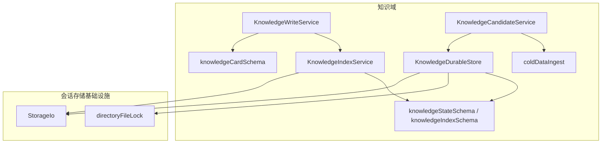
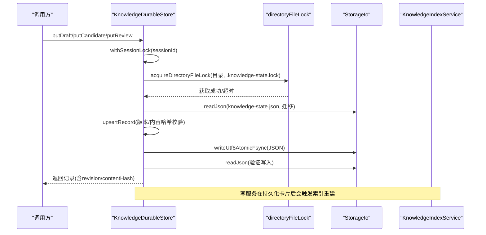
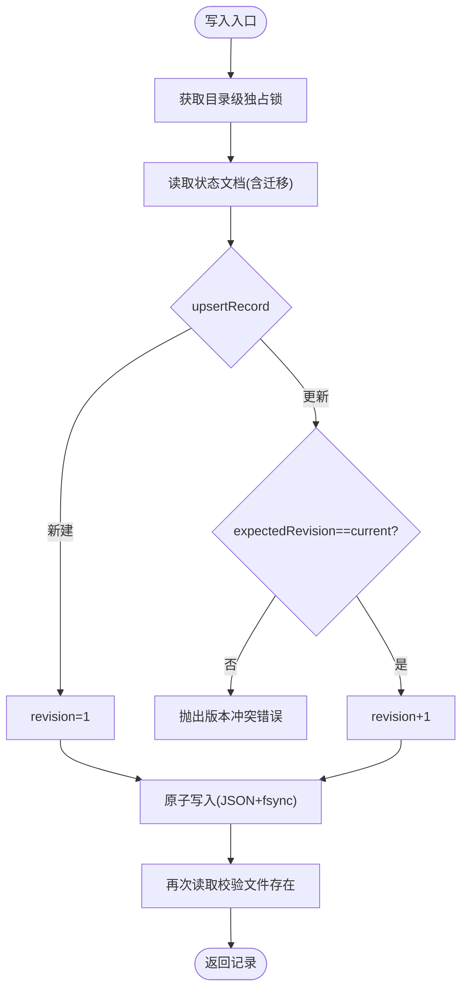
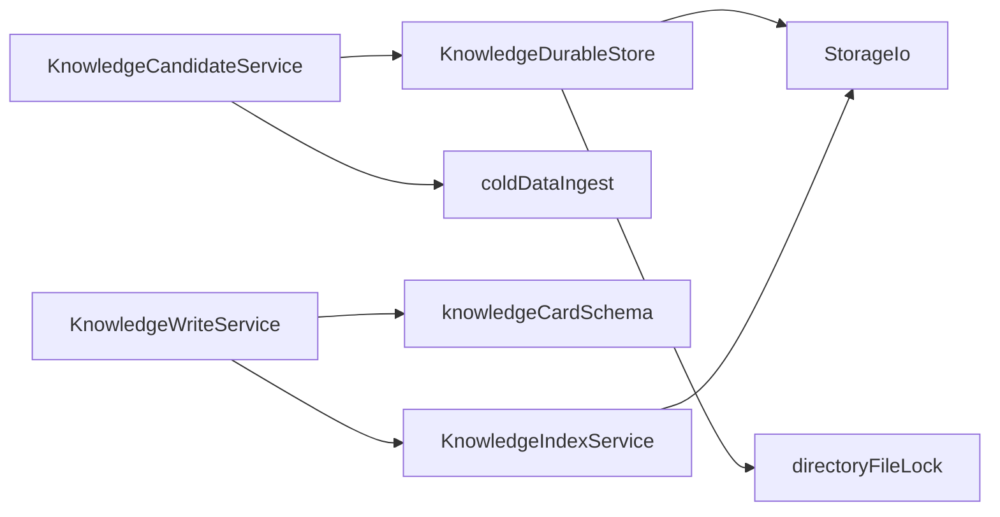

# 知识持久化存储

<cite>
**本文引用的文件**
- [KnowledgeDurableStore.ts](file://src/main/knowledge/KnowledgeDurableStore.ts)
- [knowledgeStateSchema.ts](file://src/main/knowledge/knowledgeStateSchema.ts)
- [knowledgeIndexSchema.ts](file://src/main/knowledge/knowledgeIndexSchema.ts)
- [knowledgeCardSchema.ts](file://src/main/knowledge/knowledgeCardSchema.ts)
- [coldDataIngest.ts](file://src/main/knowledge/coldDataIngest.ts)
- [KnowledgeWriteService.ts](file://src/main/knowledge/KnowledgeWriteService.ts)
- [KnowledgeCandidateService.ts](file://src/main/knowledge/KnowledgeCandidateService.ts)
- [StorageIo.ts](file://src/main/sessions/StorageIo.ts)
- [directoryFileLock.ts](file://src/main/sessions/directoryFileLock.ts)
- [KnowledgeIndexService.ts](file://src/main/knowledge/KnowledgeIndexService.ts)
- [knowledgeLanes.ts](file://src/main/knowledge/knowledgeLanes.ts)
- [knowledgeErrors.ts](file://src/main/knowledge/knowledgeErrors.ts)
</cite>

## 目录
1. [简介](#简介)
2. [项目结构](#项目结构)
3. [核心组件](#核心组件)
4. [架构总览](#架构总览)
5. [详细组件分析](#详细组件分析)
6. [依赖关系分析](#依赖关系分析)
7. [性能与容量规划](#性能与容量规划)
8. [故障排查指南](#故障排查指南)
9. [结论](#结论)
10. [附录：迁移与备份恢复](#附录：迁移与备份恢复)

## 简介
本文件围绕知识持久化存储系统，系统性解析 KnowledgeDurableStore 的存储机制、数据序列化、事务处理、并发访问控制、数据完整性校验与恢复、索引构建与缓存策略，以及性能调优、容量规划、数据迁移和备份恢复方案。目标是帮助读者在不深入源码的情况下理解该子系统的设计与实现要点，并在生产环境中进行安全、稳定、高效的运维与优化。

## 项目结构
知识持久化相关代码集中在 src/main/knowledge 与 src/main/sessions 两个区域：
- knowledge 子目录负责知识卡片、状态文档、索引、写入与候选流程、冷数据导入等。
- sessions 子目录提供通用的 StorageIo（原子写、JSON/YAML 读写、损坏隔离）与跨进程目录级文件锁。

图表来源
- [KnowledgeDurableStore.ts:52-183](file://src/main/knowledge/KnowledgeDurableStore.ts#L52-L183)
- [StorageIo.ts:27-234](file://src/main/sessions/StorageIo.ts#L27-L234)
- [directoryFileLock.ts:95-148](file://src/main/sessions/directoryFileLock.ts#L95-L148)
- [KnowledgeWriteService.ts:69-107](file://src/main/knowledge/KnowledgeWriteService.ts#L69-L107)
- [KnowledgeCandidateService.ts:42-141](file://src/main/knowledge/KnowledgeCandidateService.ts#L42-L141)
- [KnowledgeIndexService.ts:103-168](file://src/main/knowledge/KnowledgeIndexService.ts#L103-L168)

章节来源
- [KnowledgeDurableStore.ts:52-183](file://src/main/knowledge/KnowledgeDurableStore.ts#L52-L183)
- [StorageIo.ts:27-234](file://src/main/sessions/StorageIo.ts#L27-L234)
- [directoryFileLock.ts:95-148](file://src/main/sessions/directoryFileLock.ts#L95-L148)

## 核心组件
- KnowledgeDurableStore：按会话维度持久化草稿、候选、评审三类记录；提供内容哈希、版本冲突检测、原子落盘与跨进程锁保护。
- StorageIo：统一的 JSON/YAML 读写、原子替换、损坏文件隔离与恢复、fsync 支持。
- directoryFileLock：基于目录级独占锁文件的跨进程互斥，支持死锁恢复与超时错误码。
- KnowledgeWriteService：受人类确认与审批令牌保护的卡片持久化与生命周期提升，包含路径安全校验与写后一致性校验。
- KnowledgeCandidateService：会话内候选与草稿管理，冷数据导入（含敏感信息脱敏与大小限制），并持久化到 DurableStore。
- KnowledgeIndexService：扫描知识空间生成索引快照，计算语料修订号以判断是否过期，按需重建。
- Schema 层：Zod 校验与迁移定义，确保存储格式演进兼容性与运行时强类型约束。

章节来源
- [KnowledgeDurableStore.ts:66-183](file://src/main/knowledge/KnowledgeDurableStore.ts#L66-L183)
- [StorageIo.ts:20-234](file://src/main/sessions/StorageIo.ts#L20-L234)
- [directoryFileLock.ts:95-148](file://src/main/sessions/directoryFileLock.ts#L95-L148)
- [KnowledgeWriteService.ts:66-147](file://src/main/knowledge/KnowledgeWriteService.ts#L66-L147)
- [KnowledgeCandidateService.ts:35-141](file://src/main/knowledge/KnowledgeCandidateService.ts#L35-L141)
- [KnowledgeIndexService.ts:93-168](file://src/main/knowledge/KnowledgeIndexService.ts#L93-L168)
- [knowledgeStateSchema.ts:6-98](file://src/main/knowledge/knowledgeStateSchema.ts#L6-L98)
- [knowledgeIndexSchema.ts:13-46](file://src/main/knowledge/knowledgeIndexSchema.ts#L13-L46)

## 架构总览
下图展示从写入到持久化的完整调用链，包括并发锁、原子写、版本冲突检测与索引更新。

图表来源
- [KnowledgeDurableStore.ts:89-183](file://src/main/knowledge/KnowledgeDurableStore.ts#L89-L183)
- [directoryFileLock.ts:95-148](file://src/main/sessions/directoryFileLock.ts#L95-L148)
- [StorageIo.ts:27-234](file://src/main/sessions/StorageIo.ts#L27-L234)
- [KnowledgeWriteService.ts:69-107](file://src/main/knowledge/KnowledgeWriteService.ts#L69-L107)

## 详细组件分析

### KnowledgeDurableStore：会话级持久化与并发控制
- 存储目标：每个会话一个 knowledge-state.json，包含 drafts、candidates、reviews 三个数组。
- 数据模型：每条记录包含 revision、contentHash 与业务对象，使用 Zod 严格校验。
- 写入流程：
  - 通过 withSessionLock 获取目录级独占锁，避免多进程并发写同一会话。
  - 读取当前文档（若不存在则返回空文档）。
  - 对目标记录执行 upsertRecord：
    - 新建时校验 expectedRevision 必须为 0 或未指定。
    - 更新时校验 expectedRevision 与现有 revision 一致。
    - 若 contentHash 未变化且 revision 一致，直接返回旧记录（幂等）。
  - 原子写入 JSON（带 fsync），随后再次读取校验文件存在性，防止“幽灵写入”。
- 并发与锁：
  - 锁文件名为 .knowledge-state.lock，支持可配置最大尝试次数与超时错误码。
  - 锁持有者信息包含 pid 与创建时间，支持死锁恢复（仅当进程已死亡）。
- 数据完整性：
  - 内容哈希基于 JSON 序列化后的字符串计算，保证内容变更可被检测。
  - 写后二次读取校验，避免原子替换失败导致的数据丢失。

图表来源
- [KnowledgeDurableStore.ts:89-183](file://src/main/knowledge/KnowledgeDurableStore.ts#L89-L183)
- [directoryFileLock.ts:95-148](file://src/main/sessions/directoryFileLock.ts#L95-L148)

章节来源
- [KnowledgeDurableStore.ts:66-208](file://src/main/knowledge/KnowledgeDurableStore.ts#L66-L208)
- [knowledgeStateSchema.ts:6-98](file://src/main/knowledge/knowledgeStateSchema.ts#L6-L98)
- [directoryFileLock.ts:95-148](file://src/main/sessions/directoryFileLock.ts#L95-L148)

### StorageIo：原子写、损坏隔离与恢复
- 原子写：
  - 先写入临时文件（含进程ID与短ID），再 rename 为目标文件，Windows 下采用 bak-swap 策略避免竞态。
  - 可选 fsync 确保数据落盘。
- 读取与校验：
  - 支持 JSON/YAML 读取，结合 Zod 或迁移列表进行运行时校验。
  - 遇到未知 schemaVersion 会快速失败（STORAGE_SCHEMA_UNSUPPORTED）。
- 损坏恢复：
  - 解析失败时尝试从 .bak 恢复；若仍失败，将原文件重命名为 .corrupt.<timestamp> 并抛出明确错误。
  - 提供 quarantineCorrupt 方法用于统一隔离损坏文件。

章节来源
- [StorageIo.ts:27-234](file://src/main/sessions/StorageIo.ts#L27-L234)

### directoryFileLock：跨进程目录级锁
- 锁文件位于目标目录，内容为 {pid, createdAt}。
- 获取锁时循环尝试，若 EEXIST 则检查锁文件是否属于存活进程；否则删除死锁并重试。
- 释放锁时仅在当前进程为所有者或所有者已死亡时删除锁文件。
- 超时错误使用可配置的 timeoutCode，便于上层区分异常。

章节来源
- [directoryFileLock.ts:95-148](file://src/main/sessions/directoryFileLock.ts#L95-L148)

### KnowledgeWriteService：受控写入与生命周期管理
- 人类确认与审批令牌：
  - 所有写操作需显式 human confirmation；可选 approvalToken 一次性消费，防止重复授权。
- 路径安全：
  - 拒绝符号链接、硬链接、junction、.. 逃逸路径等不安全目标。
- 生命周期规则：
  - 禁止将 sourceStatus=fixed 视为 verified。
  - case 类型 verified 需要补齐必要章节。
- 写后一致性：
  - 自定义 writeFile 模式会读回文件并比对哈希，不一致则抛错。
- 索引更新：
  - 写成功后触发索引重建，保持查询索引与磁盘一致。

章节来源
- [KnowledgeWriteService.ts:66-147](file://src/main/knowledge/KnowledgeWriteService.ts#L66-L147)
- [knowledgeCardSchema.ts:209-236](file://src/main/knowledge/knowledgeCardSchema.ts#L209-L236)

### KnowledgeCandidateService：候选与草稿、冷数据导入
- 候选创建：
  - 要求 explicitUserIntent=true，生成 candidateId 与 createdAt，持久化到 DurableStore。
- 草稿与评审：
  - 冷数据导入结果若为 draft，则持久化为草稿；支持队列化评审（write/promote）。
- 冷数据处理：
  - 大小限制（默认 2MB）、绝对路径与密钥检测、文件名泄露防护、资产引用匿名化。
  - 源文件在读取前后进行 stat/hash/mtime/size 一致性校验，中途变化则隔离。

章节来源
- [KnowledgeCandidateService.ts:35-141](file://src/main/knowledge/KnowledgeCandidateService.ts#L35-L141)
- [coldDataIngest.ts:224-431](file://src/main/knowledge/coldDataIngest.ts#L224-L431)

### KnowledgeIndexService：索引构建与缓存失效
- 扫描所有知识空间（用户与项目），遍历 Markdown 文件，解析 frontmatter 与正文，构建索引条目。
- 计算语料修订号（基于 cardId + contentHash 排序拼接的 SHA-256），用于判断快照是否过期。
- 提供 getSnapshot、getOrRebuild、isSnapshotStale、computeLiveRevision 等方法。
- 索引快照同样通过 StorageIo 原子写入，并支持迁移。

章节来源
- [KnowledgeIndexService.ts:93-168](file://src/main/knowledge/KnowledgeIndexService.ts#L93-L168)
- [knowledgeIndexSchema.ts:13-46](file://src/main/knowledge/knowledgeIndexSchema.ts#L13-L46)
- [knowledgeLanes.ts:22-55](file://src/main/knowledge/knowledgeLanes.ts#L22-L55)

### 数据模型与序列化
- 状态文档：
  - schemaVersion、drafts、candidates、reviews 三数组，每项包含 revision、contentHash 与业务对象。
- 卡片记录：
  - 包含 id、space、path、type、lifecycle、title、scope、relations、body、preview、source* 元信息等。
  - 序列化为 YAML frontmatter + Markdown 正文，便于人类阅读与编辑。
- 索引快照：
  - 包含 schemaVersion、revision、builtAt、cards 数组，card 条目包含标题、词法、结构、关系、时间戳与内容哈希。

章节来源
- [knowledgeStateSchema.ts:6-98](file://src/main/knowledge/knowledgeStateSchema.ts#L6-L98)
- [knowledgeCardSchema.ts:57-75](file://src/main/knowledge/knowledgeCardSchema.ts#L57-L75)
- [knowledgeIndexSchema.ts:13-46](file://src/main/knowledge/knowledgeIndexSchema.ts#L13-L46)

## 依赖关系分析
- KnowledgeDurableStore 依赖 StorageIo 进行文件读写，依赖 directoryFileLock 进行并发控制。
- KnowledgeWriteService 依赖 knowledgeCardSchema 进行序列化，依赖 KnowledgeIndexService 更新索引。
- KnowledgeCandidateService 依赖 coldDataIngest 进行冷数据处理，并通过 KnowledgeDurableStore 持久化。
- KnowledgeIndexService 依赖 StorageIo 与文件系统 API，输出索引快照供检索使用。

图表来源
- [KnowledgeDurableStore.ts:66-183](file://src/main/knowledge/KnowledgeDurableStore.ts#L66-L183)
- [KnowledgeCandidateService.ts:35-141](file://src/main/knowledge/KnowledgeCandidateService.ts#L35-L141)
- [KnowledgeWriteService.ts:66-147](file://src/main/knowledge/KnowledgeWriteService.ts#L66-L147)
- [KnowledgeIndexService.ts:93-168](file://src/main/knowledge/KnowledgeIndexService.ts#L93-L168)

## 性能与容量规划
- 并发与锁粒度：
  - 以会话为单位加锁，避免全局锁瓶颈；合理设置 lockMaxAttempts 与超时，避免长时间阻塞。
- 原子写与 fsync：
  - 关键写路径使用 writeUtf8AtomicFsync，确保崩溃恢复能力；在高吞吐场景可根据风险权衡是否启用 fsync。
- 索引重建频率：
  - 写服务在每次写后重建索引，适合中小规模知识库；大规模建议异步批重建或增量更新。
- 冷数据大小限制：
  - 默认 2MB，避免大文件拖慢导入；可按业务调整 maxBytes。
- 内存与缓存：
  - 当前实现无 LRU 缓存；索引快照常驻内存由调用方管理；可通过外部缓存层（如内存映射或进程外缓存）提升读取性能。
- 批量操作：
  - 当前以单条 upsert 为主；如需批量，可在应用层合并多次写入并减少锁竞争。
- 容量规划建议：
  - 估算每会话状态文件大小（草稿/候选/评审数量 × 平均记录大小），结合会话数评估磁盘占用。
  - 索引快照大小与卡片总数线性增长，定期清理过期快照或归档历史。

[本节为通用指导，不直接分析具体文件]

## 故障排查指南
- 版本冲突：
  - 现象：更新时抛出版本冲突错误。
  - 原因：expectedRevision 与当前 revision 不一致。
  - 处理：先读取最新 revision 后再提交更新。
- 锁超时：
  - 现象：获取锁超时。
  - 原因：其他进程持有锁或死锁。
  - 处理：检查是否存在僵尸进程，必要时手动删除锁文件。
- 存储损坏：
  - 现象：读取 JSON/YAML 失败。
  - 原因：文件损坏或 schema 不支持。
  - 处理：查看 .bak 或 .corrupt.* 文件，恢复或修复后重试。
- 写后不一致：
  - 现象：自定义 writeFile 模式下写后哈希不一致。
  - 原因：文件系统或中间件篡改了写入内容。
  - 处理：检查磁盘权限、防病毒软件、网络挂载等。
- 冷数据隔离：
  - 现象：导入结果为 quarantine。
  - 原因：检测到密钥、绝对路径、过大文件或源文件变化。
  - 处理：修正输入内容或重新导入。

章节来源
- [knowledgeErrors.ts:1-62](file://src/main/knowledge/knowledgeErrors.ts#L1-62)
- [StorageIo.ts:27-170](file://src/main/sessions/StorageIo.ts#L27-L170)
- [directoryFileLock.ts:95-148](file://src/main/sessions/directoryFileLock.ts#L95-L148)
- [coldDataIngest.ts:224-431](file://src/main/knowledge/coldDataIngest.ts#L224-L431)

## 结论
KnowledgeDurableStore 提供了会话级、强一致、跨进程安全的知识持久化能力，配合 StorageIo 的原子写与损坏恢复、directoryFileLock 的并发控制、KnowledgeWriteService 的人类确认与路径安全、KnowledgeCandidateService 的冷数据处理与草稿/候选管理，以及 KnowledgeIndexService 的索引构建与失效检测，形成了一套完整、健壮的知识存储体系。在生产环境中，应关注锁超时、索引重建成本与容量规划，并结合业务需求引入缓存与批处理优化。

[本节为总结，不直接分析具体文件]

## 附录：迁移与备份恢复
- 数据迁移：
  - 状态文档与索引快照均通过 Migration 列表声明 schemaVersion 与校验器，升级时需向后兼容；未知高版本会快速失败，避免误用。
  - 建议在升级前备份状态文件与索引快照，并在测试环境验证迁移逻辑。
- 备份策略：
  - 定期备份 knowledge-state.json 与 knowledge-index.json；利用 StorageIo 的 .bak 与 .corrupt.* 辅助恢复。
  - 对于大规模知识库，建议对索引快照进行增量备份与压缩归档。
- 恢复流程：
  - 若主文件损坏，优先尝试 .bak 恢复；若不可用，使用 .corrupt.* 文件进行人工修复。
  - 恢复后触发索引重建，确保查询一致。

章节来源
- [knowledgeStateSchema.ts:83-98](file://src/main/knowledge/knowledgeStateSchema.ts#L83-L98)
- [knowledgeIndexSchema.ts:40-46](file://src/main/knowledge/knowledgeIndexSchema.ts#L40-L46)
- [StorageIo.ts:27-170](file://src/main/sessions/StorageIo.ts#L27-L170)