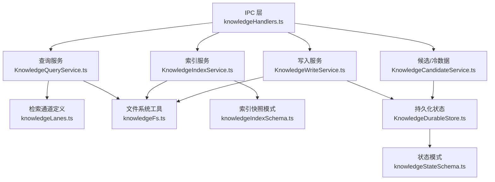
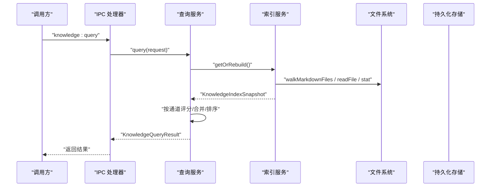
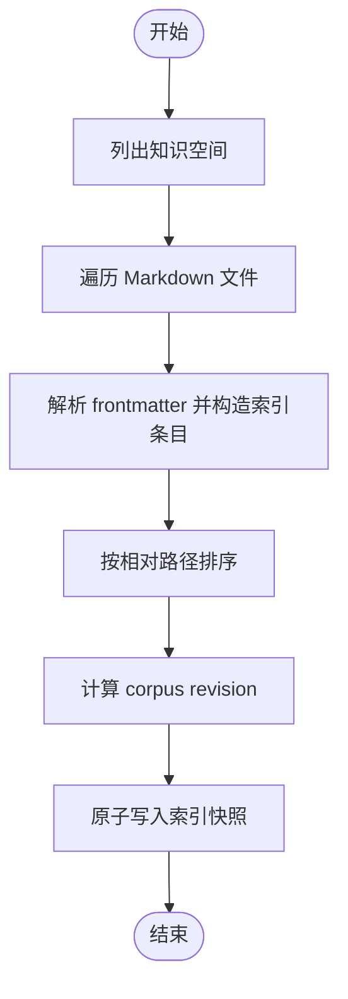
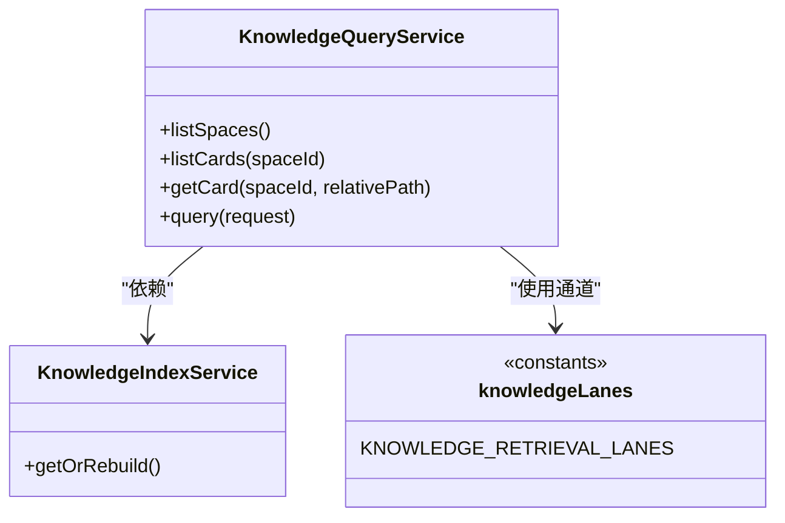
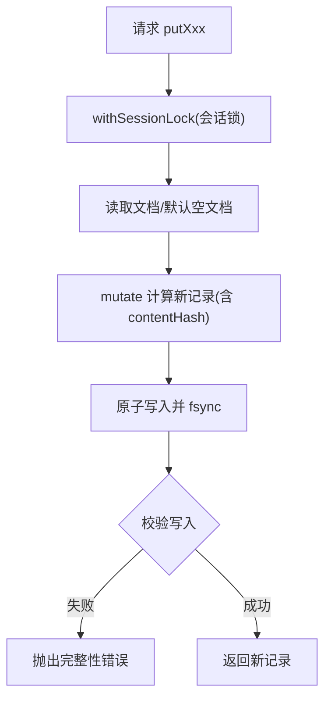
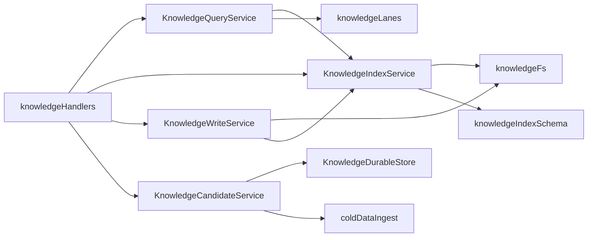

# 知识索引服务

<cite>
**本文引用的文件**
- [KnowledgeIndexService.ts](file://src/main/knowledge/KnowledgeIndexService.ts)
- [KnowledgeQueryService.ts](file://src/main/knowledge/KnowledgeQueryService.ts)
- [knowledgeLanes.ts](file://src/main/knowledge/knowledgeLanes.ts)
- [knowledgeCardSchema.ts](file://src/main/knowledge/knowledgeCardSchema.ts)
- [knowledgeFs.ts](file://src/main/knowledge/knowledgeFs.ts)
- [KnowledgeDurableStore.ts](file://src/main/knowledge/KnowledgeDurableStore.ts)
- [knowledgeStateSchema.ts](file://src/main/knowledge/knowledgeStateSchema.ts)
- [KnowledgeWriteService.ts](file://src/main/knowledge/KnowledgeWriteService.ts)
- [KnowledgeCandidateService.ts](file://src/main/knowledge/KnowledgeCandidateService.ts)
- [coldDataIngest.ts](file://src/main/knowledge/coldDataIngest.ts)
- [knowledgeHandlers.ts](file://src/main/ipc/knowledgeHandlers.ts)
</cite>

## 目录
1. [简介](#简介)
2. [项目结构](#项目结构)
3. [核心组件](#核心组件)
4. [架构总览](#架构总览)
5. [详细组件分析](#详细组件分析)
6. [依赖关系分析](#依赖关系分析)
7. [性能与优化](#性能与优化)
8. [故障排除指南](#故障排除指南)
9. [结论](#结论)
10. [附录](#附录)

## 简介
本文件面向知识索引服务的实现与维护，聚焦 KnowledgeIndexService 的索引构建、更新、查询等能力，并系统阐述索引结构设计、存储策略、增量更新机制与版本控制方案。同时说明检索“通道（lanes）”算法（全文、结构化、关联、时间维度等），并提供性能调优、监控指标与最佳实践建议。

## 项目结构
知识索引相关代码集中在 src/main/knowledge 目录下，围绕“索引快照 + 多通道检索 + 持久化状态”展开：
- 索引构建与快照：KnowledgeIndexService 负责扫描 Markdown 知识卡片，生成带修订号的索引快照，落盘到应用状态目录。
- 查询与检索：KnowledgeQueryService 基于索引快照执行多通道评分合并，返回命中结果。
- 文件系统工具：knowledgeFs 提供安全路径解析、Markdown 遍历、原子写入与完整性校验。
- 数据模型与模式：knowledgeCardSchema、knowledgeIndexSchema、knowledgeStateSchema 定义卡片、索引条目、会话状态的结构与迁移。
- 持久化与并发：KnowledgeDurableStore 维护会话级 knowledge-state.json，使用文件锁与乐观版本控制保证一致性。
- 写入与候选：KnowledgeWriteService 负责卡片持久化与生命周期推进；KnowledgeCandidateService 管理候选与冷数据导入。
- IPC 暴露：knowledgeHandlers 将上述能力以 IPC 接口暴露给渲染进程。

图表来源
- [knowledgeHandlers.ts:170-348](file://src/main/ipc/knowledgeHandlers.ts#L170-L348)
- [KnowledgeQueryService.ts:94-191](file://src/main/knowledge/KnowledgeQueryService.ts#L94-L191)
- [KnowledgeIndexService.ts:93-168](file://src/main/knowledge/KnowledgeIndexService.ts#L93-L168)
- [KnowledgeWriteService.ts:66-155](file://src/main/knowledge/KnowledgeWriteService.ts#L66-L155)
- [KnowledgeCandidateService.ts:35-155](file://src/main/knowledge/KnowledgeCandidateService.ts#L35-L155)
- [knowledgeLanes.ts:1-56](file://src/main/knowledge/knowledgeLanes.ts#L1-L56)
- [knowledgeFs.ts:1-202](file://src/main/knowledge/knowledgeFs.ts#L1-L202)
- [knowledgeIndexSchema.ts:1-46](file://src/main/knowledge/knowledgeIndexSchema.ts#L1-L46)
- [KnowledgeDurableStore.ts:66-211](file://src/main/knowledge/KnowledgeDurableStore.ts#L66-L211)
- [knowledgeStateSchema.ts:1-98](file://src/main/knowledge/knowledgeStateSchema.ts#L1-L98)

章节来源
- [knowledgeHandlers.ts:170-348](file://src/main/ipc/knowledgeHandlers.ts#L170-L348)
- [KnowledgeIndexService.ts:93-168](file://src/main/knowledge/KnowledgeIndexService.ts#L93-L168)
- [KnowledgeQueryService.ts:94-191](file://src/main/knowledge/KnowledgeQueryService.ts#L94-L191)

## 核心组件
- KnowledgeIndexService：索引构建、快照读取、增量检查（revision 对比）、懒加载重建。
- KnowledgeQueryService：基于索引快照的多通道检索、评分合并、过滤与排序。
- KnowledgeDurableStore：会话级草稿、候选、评审的持久化，带文件锁与乐观版本冲突检测。
- KnowledgeWriteService：卡片原子写入、生命周期推进、审批令牌与人类确认。
- KnowledgeCandidateService：候选创建、冷数据导入与暂存、评审队列。
- 文件系统与安全：knowledgeFs 提供安全路径校验、Markdown 遍历、原子写入与完整性校验。
- 模式与迁移：knowledgeCardSchema、knowledgeIndexSchema、knowledgeStateSchema 定义数据结构与迁移。

章节来源
- [KnowledgeIndexService.ts:93-168](file://src/main/knowledge/KnowledgeIndexService.ts#L93-L168)
- [KnowledgeQueryService.ts:94-191](file://src/main/knowledge/KnowledgeQueryService.ts#L94-L191)
- [KnowledgeDurableStore.ts:66-211](file://src/main/knowledge/KnowledgeDurableStore.ts#L66-L211)
- [KnowledgeWriteService.ts:66-155](file://src/main/knowledge/KnowledgeWriteService.ts#L66-L155)
- [KnowledgeCandidateService.ts:35-155](file://src/main/knowledge/KnowledgeCandidateService.ts#L35-L155)
- [knowledgeFs.ts:1-202](file://src/main/knowledge/knowledgeFs.ts#L1-L202)
- [knowledgeCardSchema.ts:1-251](file://src/main/knowledge/knowledgeCardSchema.ts#L1-L251)
- [knowledgeIndexSchema.ts:1-46](file://src/main/knowledge/knowledgeIndexSchema.ts#L1-L46)
- [knowledgeStateSchema.ts:1-98](file://src/main/knowledge/knowledgeStateSchema.ts#L1-L98)

## 架构总览
知识索引服务采用“索引快照 + 多通道检索 + 持久化状态”的分层设计：
- 索引层：按空间（user/project）扫描 Markdown，提取 frontmatter、标题、正文、关系、范围等，生成 KnowledgeIndexEntry 列表，计算 corpus revision 并持久化为 KnowledgeIndexSnapshot。
- 查询层：从快照中过滤出目标集合，按通道（Identity/Path、Scope/Metadata、Lexical、Structural、Relation/Graph、Temporal/Version）分别打分，合并去重后排序输出。
- 持久化层：会话级 knowledge-state.json 通过文件锁与乐观版本控制保障并发安全；写入侧对卡片进行原子写入与完整性校验。
- IPC 层：对外暴露 overview、query、card、compile、index:rebuild、write、promote 等接口，统一参数校验与错误码。

图表来源
- [knowledgeHandlers.ts:179-190](file://src/main/ipc/knowledgeHandlers.ts#L179-L190)
- [KnowledgeQueryService.ts:154-191](file://src/main/knowledge/KnowledgeQueryService.ts#L154-L191)
- [KnowledgeIndexService.ts:103-168](file://src/main/knowledge/KnowledgeIndexService.ts#L103-L168)
- [knowledgeFs.ts:44-66](file://src/main/knowledge/knowledgeFs.ts#L44-L66)

## 详细组件分析

### 索引服务 KnowledgeIndexService
职责
- 列出所有知识空间（用户空间与项目空间）。
- 递归扫描 Markdown 文件，解析 frontmatter，抽取标题、正文、关系、范围、更新时间戳等，构造索引条目。
- 计算 corpus revision（基于 cardId + contentHash + relativePath 的有序哈希），生成并原子写入索引快照。
- 提供快照读取、增量检查（比较 live revision 与快照 revision）、懒重建（getOrRebuild）。

关键流程
- rebuild：遍历空间 -> 遍历文件 -> toEntry -> 排序 -> 生成快照 -> 原子写入。
- getSnapshot：读取快照并进行 schema 迁移。
- computeLiveRevision：实时计算当前 corpus 的 revision。
- isSnapshotStale：比较快照 revision 与 live revision。
- getOrRebuild：若快照存在且未过期则直接返回，否则重建。

图表来源
- [KnowledgeIndexService.ts:103-130](file://src/main/knowledge/KnowledgeIndexService.ts#L103-L130)
- [knowledgeLanes.ts:48-55](file://src/main/knowledge/knowledgeLanes.ts#L48-L55)
- [knowledgeIndexSchema.ts:30-46](file://src/main/knowledge/knowledgeIndexSchema.ts#L30-L46)

章节来源
- [KnowledgeIndexService.ts:18-168](file://src/main/knowledge/KnowledgeIndexService.ts#L18-L168)
- [knowledgeLanes.ts:22-55](file://src/main/knowledge/knowledgeLanes.ts#L22-L55)
- [knowledgeIndexSchema.ts:13-46](file://src/main/knowledge/knowledgeIndexSchema.ts#L13-L46)

### 查询服务 KnowledgeQueryService
职责
- 列出空间、列举卡片、获取卡片详情。
- 基于索引快照执行多通道检索：支持按 spaceIds、type、lifecycle、asOf、scope 过滤，以及文本、关系目标、通道选择等条件。
- 多通道评分与合并：每个通道独立打分，相同 cardId 合并分数，最终按总分降序返回。

通道与评分要点
- Identity/Path：精确匹配 cardId 或 relativePath，其次包含文本匹配。
- Scope/Metadata：按 type、lifecycle、scope 匹配加权。
- Lexical：全文词法匹配（小写化后的 lexical 字段）。
- Structural：标题层级匹配（headings）。
- Relation/Graph：根据 relations 中的 targetCardId 匹配。
- Temporal/Version：依据 updatedAt 是否存在给予基础分。

图表来源
- [KnowledgeQueryService.ts:94-191](file://src/main/knowledge/KnowledgeQueryService.ts#L94-L191)
- [knowledgeLanes.ts:4-20](file://src/main/knowledge/knowledgeLanes.ts#L4-L20)

章节来源
- [KnowledgeQueryService.ts:26-231](file://src/main/knowledge/KnowledgeQueryService.ts#L26-L231)
- [knowledgeLanes.ts:1-56](file://src/main/knowledge/knowledgeLanes.ts#L1-L56)

### 持久化与并发 KnowledgeDurableStore
职责
- 维护会话级 knowledge-state.json，包含 drafts、candidates、reviews 三张表。
- 提供 putDraft、putCandidate、putReview 等方法，内部使用 withSessionLock 保证并发安全。
- 使用内容哈希与期望版本号进行乐观并发控制，冲突时抛出版本冲突错误。

关键点
- 文件锁：基于目录锁文件，避免多进程/线程竞争。
- 原子写入：写入后二次读取校验，确保磁盘落盘一致。
- 版本控制：upsertRecord 根据 expectedRevision 判断是否允许覆盖，防止脏写。

图表来源
- [KnowledgeDurableStore.ts:147-183](file://src/main/knowledge/KnowledgeDurableStore.ts#L147-L183)
- [KnowledgeDurableStore.ts:186-208](file://src/main/knowledge/KnowledgeDurableStore.ts#L186-L208)

章节来源
- [KnowledgeDurableStore.ts:24-211](file://src/main/knowledge/KnowledgeDurableStore.ts#L24-L211)
- [knowledgeStateSchema.ts:6-98](file://src/main/knowledge/knowledgeStateSchema.ts#L6-L98)

### 写入服务 KnowledgeWriteService
职责
- 验证人类确认与审批令牌。
- 校验生命周期合法性（如 case 类型 verified 必须补齐章节）。
- 安全路径校验与原子写入，写入后触发索引重建。
- promote 方法在合法生命周期转换下复用 write。

安全与一致性
- 路径安全：拒绝符号链接、硬链接、越界路径。
- 原子写入：写入后哈希校验，确保内容与磁盘一致。
- 索引联动：写入成功后重建索引，保证查询可见性。

章节来源
- [KnowledgeWriteService.ts:17-155](file://src/main/knowledge/KnowledgeWriteService.ts#L17-L155)
- [knowledgeFs.ts:139-182](file://src/main/knowledge/knowledgeFs.ts#L139-L182)

### 候选与冷数据 KnowledgeCandidateService 与 coldDataIngest
职责
- 创建候选（candidate），用于显式用户意图的知识沉淀。
- 冷数据导入：解析 YAML，清洗敏感信息、绝对路径、文件名泄露，映射环境为 scope，生成 case 类型的 draft。
- 暂存与评审：将冷数据结果持久化为草稿，并可入队评审。

安全与质量
- 敏感信息检测：正则匹配密钥、凭据等。
- 绝对路径检测：拒绝包含绝对路径的内容。
- 资产脱敏：将外部资源文件替换为匿名 ID，避免泄露真实路径。
- 重复 caseId 检测：避免重复导入。

章节来源
- [KnowledgeCandidateService.ts:1-155](file://src/main/knowledge/KnowledgeCandidateService.ts#L1-L155)
- [coldDataIngest.ts:14-432](file://src/main/knowledge/coldDataIngest.ts#L14-L432)

### IPC 暴露 knowledgeHandlers
职责
- 注册 knowledge:* 系列 IPC 处理器，包括 overview、query、card、compile、index:rebuild、write、promote、candidates、coldDataImport、issueApprovalToken。
- 参数校验、空间白名单校验、人类确认弹窗、审批令牌消费。
- 统一错误处理，保留错误码以便上层区分。

章节来源
- [knowledgeHandlers.ts:1-348](file://src/main/ipc/knowledgeHandlers.ts#L1-L348)

## 依赖关系分析
- 模块耦合
  - KnowledgeQueryService 依赖 KnowledgeIndexService 与 knowledgeLanes。
  - KnowledgeIndexService 依赖 knowledgeFs、knowledgeLanes、knowledgeIndexSchema。
  - KnowledgeWriteService 依赖 knowledgeFs、knowledgeCardSchema、KnowledgeIndexService。
  - KnowledgeCandidateService 依赖 KnowledgeDurableStore 与 coldDataIngest。
  - IPC 层聚合各服务，作为对外入口。
- 外部依赖
  - Node.js fs/crypto/path。
  - Electron ipcMain/dialog。
  - Zod 用于模式校验。
  - yaml 解析器用于冷数据与 frontmatter。

图表来源
- [KnowledgeQueryService.ts:94-191](file://src/main/knowledge/KnowledgeQueryService.ts#L94-L191)
- [KnowledgeIndexService.ts:93-168](file://src/main/knowledge/KnowledgeIndexService.ts#L93-L168)
- [KnowledgeWriteService.ts:66-155](file://src/main/knowledge/KnowledgeWriteService.ts#L66-L155)
- [KnowledgeCandidateService.ts:35-155](file://src/main/knowledge/KnowledgeCandidateService.ts#L35-L155)
- [knowledgeHandlers.ts:170-348](file://src/main/ipc/knowledgeHandlers.ts#L170-L348)

章节来源
- [KnowledgeQueryService.ts:94-191](file://src/main/knowledge/KnowledgeQueryService.ts#L94-L191)
- [KnowledgeIndexService.ts:93-168](file://src/main/knowledge/KnowledgeIndexService.ts#L93-L168)
- [KnowledgeWriteService.ts:66-155](file://src/main/knowledge/KnowledgeWriteService.ts#L66-L155)
- [KnowledgeCandidateService.ts:35-155](file://src/main/knowledge/KnowledgeCandidateService.ts#L35-L155)
- [knowledgeHandlers.ts:170-348](file://src/main/ipc/knowledgeHandlers.ts#L170-L348)

## 性能与优化
- 索引构建
  - 批量扫描：walkMarkdownFiles 限制最大深度，跳过隐藏文件，减少无效 IO。
  - 排序稳定：按相对路径排序，保证 revision 可复现。
  - 原子写入：避免部分写入导致的损坏。
- 增量更新
  - 使用 corpus revision（基于 cardId + contentHash + relativePath 的有序哈希）快速判断快照是否过期。
  - getOrRebuild 优先使用缓存快照，仅在 stale 时重建。
- 查询优化
  - 多通道并行评分：可在未来扩展为并行 lane 评分以提升吞吐。
  - 过滤前置：先按 spaceIds/type/lifecycle/asOf/scope 过滤再进入通道评分，减少无用计算。
  - 合并去重：Map 合并同 cardId 的得分，避免重复排序。
- 存储与并发
  - 会话级文件锁避免竞态。
  - 原子写入 + 二次校验确保数据一致性。
  - 乐观版本控制避免覆盖冲突。
- 监控指标建议
  - 索引构建耗时、文件数量、空间数量、快照大小、revision 变化频率。
  - 查询耗时、命中率、通道贡献分布、合并后命中数。
  - 写入成功率、重试次数、版本冲突次数、锁等待时长。
  - 冷数据导入成功率、隔离原因（secret-detected、absolute-path、yaml-broken 等）。

[本节为通用指导，不直接分析具体文件]

## 故障排除指南
- 索引快照陈旧
  - 现象：查询结果与预期不一致。
  - 排查：检查 isSnapshotStale 逻辑与 computeLiveRevision 结果；必要时调用 index:rebuild。
  - 参考：[KnowledgeIndexService.ts:139-168](file://src/main/knowledge/KnowledgeIndexService.ts#L139-L168)
- 路径安全问题
  - 现象：写入失败或拒绝访问。
  - 排查：确认相对路径不包含 ..、NUL；确认目标不在空间根之外；确认无符号链接/硬链接。
  - 参考：[knowledgeFs.ts:26-42](file://src/main/knowledge/knowledgeFs.ts#L26-L42)、[knowledgeFs.ts:139-166](file://src/main/knowledge/knowledgeFs.ts#L139-L166)
- 原子写入失败
  - 现象：post-write hash mismatch。
  - 排查：检查磁盘权限、防病毒软件拦截、fsync 行为；确认写入内容与预期一致。
  - 参考：[knowledgeFs.ts:168-182](file://src/main/knowledge/knowledgeFs.ts#L168-L182)
- 版本冲突
  - 现象：更新草稿/候选/评审时报版本冲突。
  - 排查：检查 expectedRevision 是否正确；确认并发写入未发生。
  - 参考：[KnowledgeDurableStore.ts:186-208](file://src/main/knowledge/KnowledgeDurableStore.ts#L186-L208)
- 冷数据导入被隔离
  - 现象：status=quarantine，reason 为 secret-detected/absolute-path/yaml-broken/filename-leaked。
  - 排查：清理敏感信息、移除绝对路径、修正 YAML、避免文件名泄露。
  - 参考：[coldDataIngest.ts:224-341](file://src/main/knowledge/coldDataIngest.ts#L224-L341)
- 审批令牌无效
  - 现象：write/promote 报令牌无效。
  - 排查：确认令牌已发放且未被消费；确认作用域（user/project）与路径匹配。
  - 参考：[knowledgeHandlers.ts:106-122](file://src/main/ipc/knowledgeHandlers.ts#L106-L122)、[KnowledgeWriteService.ts:139-147](file://src/main/knowledge/KnowledgeWriteService.ts#L139-L147)

章节来源
- [KnowledgeIndexService.ts:139-168](file://src/main/knowledge/KnowledgeIndexService.ts#L139-L168)
- [knowledgeFs.ts:26-42](file://src/main/knowledge/knowledgeFs.ts#L26-L42)
- [knowledgeFs.ts:139-182](file://src/main/knowledge/knowledgeFs.ts#L139-L182)
- [KnowledgeDurableStore.ts:186-208](file://src/main/knowledge/KnowledgeDurableStore.ts#L186-L208)
- [coldDataIngest.ts:224-341](file://src/main/knowledge/coldDataIngest.ts#L224-L341)
- [knowledgeHandlers.ts:106-122](file://src/main/ipc/knowledgeHandlers.ts#L106-L122)
- [KnowledgeWriteService.ts:139-147](file://src/main/knowledge/KnowledgeWriteService.ts#L139-L147)

## 结论
知识索引服务通过“索引快照 + 多通道检索 + 持久化状态”的设计，实现了高效、可靠的知识检索与治理。索引构建具备可复现性与增量更新能力；查询层通过多通道评分满足多种检索需求；持久化层通过文件锁与乐观版本控制保障并发安全；写入与候选流程兼顾安全性与合规性。建议在大规模场景下引入并行通道评分、更细粒度的监控指标与自动化健康检查，进一步提升性能与可观测性。

[本节为总结，不直接分析具体文件]

## 附录
- 索引结构
  - 索引条目包含 cardId、spaceId、relativePath、title、type、lifecycle、scope、relations、headings、lexical、updatedAt、contentHash、sourceStatus、caseId。
  - 索引快照包含 schemaVersion、revision、builtAt、cards。
  - 参考：[knowledgeIndexSchema.ts:13-46](file://src/main/knowledge/knowledgeIndexSchema.ts#L13-L46)、[knowledgeLanes.ts:22-46](file://src/main/knowledge/knowledgeLanes.ts#L22-L46)
- 状态结构
  - 状态文档包含 schemaVersion、drafts、candidates、reviews。
  - 参考：[knowledgeStateSchema.ts:48-98](file://src/main/knowledge/knowledgeStateSchema.ts#L48-L98)
- 卡片模式
  - 卡片记录包含 cardId、spaceId、relativePath、type、lifecycle、title、scope、relations、body、preview、updatedAt、sourceStatus、caseId、chapters、sourceHash、sourceMtimeMs、sourceSize。
  - 参考：[knowledgeCardSchema.ts:57-75](file://src/main/knowledge/knowledgeCardSchema.ts#L57-L75)

章节来源
- [knowledgeIndexSchema.ts:13-46](file://src/main/knowledge/knowledgeIndexSchema.ts#L13-L46)
- [knowledgeLanes.ts:22-46](file://src/main/knowledge/knowledgeLanes.ts#L22-L46)
- [knowledgeStateSchema.ts:48-98](file://src/main/knowledge/knowledgeStateSchema.ts#L48-L98)
- [knowledgeCardSchema.ts:57-75](file://src/main/knowledge/knowledgeCardSchema.ts#L57-L75)