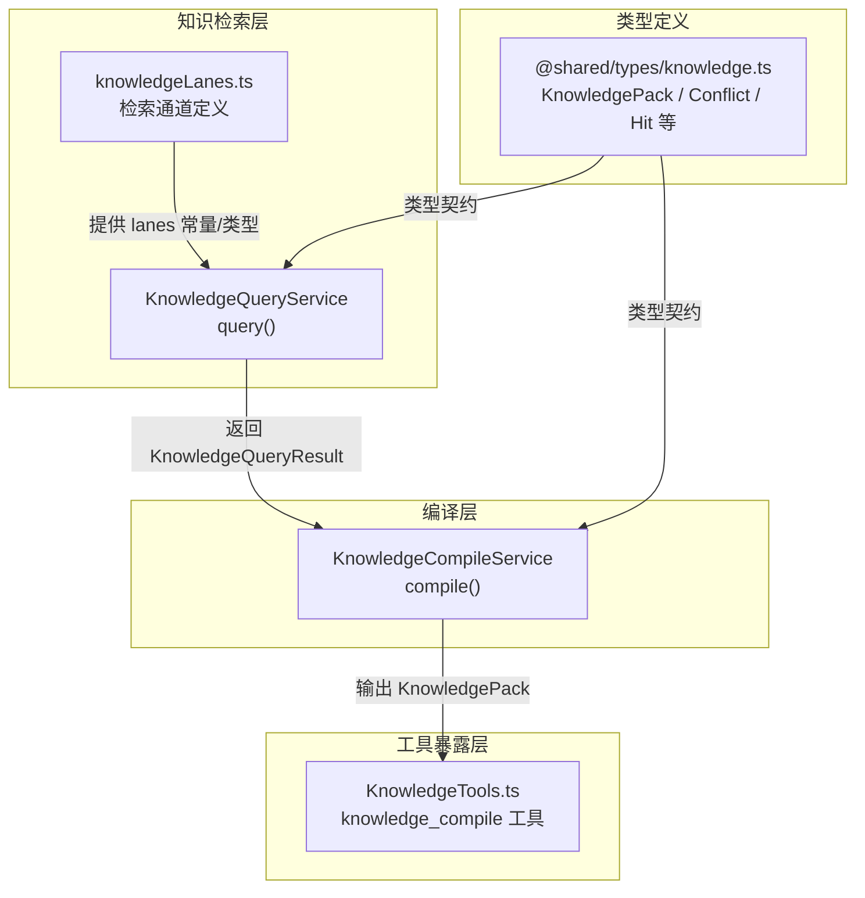
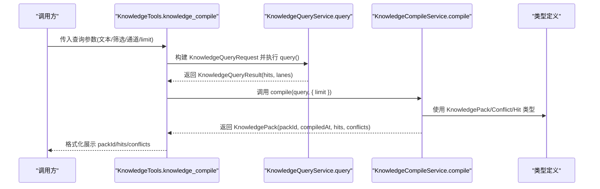
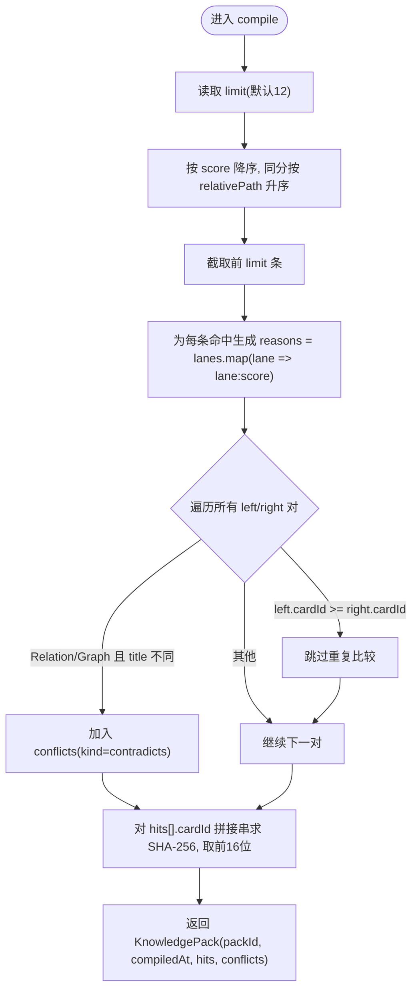
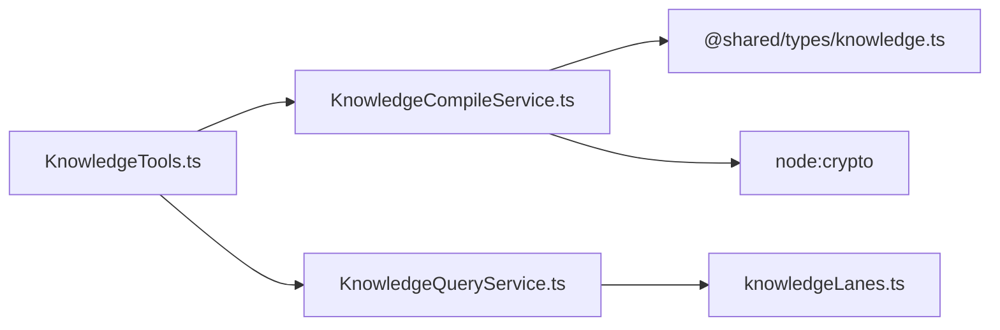

# 知识编译服务核心

<cite>
**本文引用的文件**
- [KnowledgeCompileService.ts](file://src/main/knowledge/KnowledgeCompileService.ts)
- [knowledge.ts](file://src/shared/types/knowledge.ts)
- [knowledgeLanes.ts](file://src/main/knowledge/knowledgeLanes.ts)
- [KnowledgeQueryService.ts](file://src/main/knowledge/KnowledgeQueryService.ts)
- [KnowledgeTools.ts](file://src/main/knowledge/KnowledgeTools.ts)
- [knowledgeErrors.ts](file://src/main/knowledge/knowledgeErrors.ts)
</cite>

## 目录
1. [简介](#简介)
2. [项目结构](#项目结构)
3. [核心组件](#核心组件)
4. [架构总览](#架构总览)
5. [详细组件分析](#详细组件分析)
6. [依赖关系分析](#依赖关系分析)
7. [性能考虑](#性能考虑)
8. [故障排查指南](#故障排查指南)
9. [结论](#结论)
10. [附录：调用示例与结果处理](#附录调用示例与结果处理)

## 简介
本文件聚焦于知识编译服务的核心实现，围绕 KnowledgeCompileService 的 compile 方法展开，系统解析查询结果排序、冲突检测、摘要计算等关键流程。同时说明 KnowledgePack 与 KnowledgePackConflict 数据结构的设计目的与使用场景，并提供调用方式与结果处理建议，以及性能优化与错误处理策略。

## 项目结构
知识编译服务位于 main/knowledge 模块中，主要职责是将查询结果（KnowledgeQueryResult）编译为可消费的“知识包”（KnowledgePack），并在此过程中完成排序、冲突标注与摘要生成。

图表来源
- [KnowledgeQueryService.ts:154-191](file://src/main/knowledge/KnowledgeQueryService.ts#L154-L191)
- [KnowledgeCompileService.ts:18-47](file://src/main/knowledge/KnowledgeCompileService.ts#L18-L47)
- [knowledgeLanes.ts:1-20](file://src/main/knowledge/knowledgeLanes.ts#L1-L20)
- [knowledge.ts:168-242](file://src/shared/types/knowledge.ts#L168-L242)
- [KnowledgeTools.ts:236-283](file://src/main/knowledge/KnowledgeTools.ts#L236-L283)

章节来源
- [KnowledgeQueryService.ts:154-191](file://src/main/knowledge/KnowledgeQueryService.ts#L154-L191)
- [KnowledgeCompileService.ts:18-47](file://src/main/knowledge/KnowledgeCompileService.ts#L18-L47)
- [knowledge.ts:168-242](file://src/shared/types/knowledge.ts#L168-L242)
- [knowledgeLanes.ts:1-20](file://src/main/knowledge/knowledgeLanes.ts#L1-L20)
- [KnowledgeTools.ts:236-283](file://src/main/knowledge/KnowledgeTools.ts#L236-L283)

## 核心组件
- KnowledgeCompileService：负责将查询结果编译为知识包，包含排序、冲突检测、摘要计算。
- KnowledgeQueryService：负责基于多通道检索返回 hits 与 lanes。
- KnowledgeTools：对外暴露 knowledge_compile 工具，串联 query + compile。
- 类型定义：KnowledgePack、KnowledgePackConflict、KnowledgeCompiledHit、KnowledgeLaneHit 等。

章节来源
- [KnowledgeCompileService.ts:15-47](file://src/main/knowledge/KnowledgeCompileService.ts#L15-L47)
- [KnowledgeQueryService.ts:94-191](file://src/main/knowledge/KnowledgeQueryService.ts#L94-L191)
- [KnowledgeTools.ts:236-283](file://src/main/knowledge/KnowledgeTools.ts#L236-L283)
- [knowledge.ts:180-242](file://src/shared/types/knowledge.ts#L180-L242)

## 架构总览
下图展示了从用户发起搜索到生成知识包的完整调用链，包括查询、编译、工具封装与类型契约。

图表来源
- [KnowledgeTools.ts:236-283](file://src/main/knowledge/KnowledgeTools.ts#L236-L283)
- [KnowledgeQueryService.ts:154-191](file://src/main/knowledge/KnowledgeQueryService.ts#L154-L191)
- [KnowledgeCompileService.ts:18-47](file://src/main/knowledge/KnowledgeCompileService.ts#L18-L47)
- [knowledge.ts:180-242](file://src/shared/types/knowledge.ts#L180-L242)

## 详细组件分析

### KnowledgeCompileService.compile 方法
compile 的核心逻辑分为四步：
1) 排序与截断：按分数降序，分数相同按相对路径字典序升序；默认限制前 12 条。
2) 命中增强：为每个命中附加 reasons，形式为“通道名:分数”，便于溯源。
3) 冲突检测：在命中集合内两两比较，若两者均来自 Relation/Graph 通道且标题不同，则标记为 contradicts。
4) 摘要计算：对命中 cardId 序列拼接后做 SHA-256，取前 16 位作为 packId 后缀，形成稳定可复现的包标识。

图表来源
- [KnowledgeCompileService.ts:18-47](file://src/main/knowledge/KnowledgeCompileService.ts#L18-L47)

章节来源
- [KnowledgeCompileService.ts:18-47](file://src/main/knowledge/KnowledgeCompileService.ts#L18-L47)

#### 排序算法细节
- 主键：score 降序，确保高相关度优先。
- 次键：relativePath 字典序升序，保证同分时的确定性顺序。
- 复杂度：O(n log n)，n 为 hits 数量。

章节来源
- [KnowledgeCompileService.ts:20-22](file://src/main/knowledge/KnowledgeCompileService.ts#L20-L22)

#### 冲突检测机制
- 触发条件：左右两条命中均包含 Relation/Graph 通道，且标题不同。
- 语义：同一图关系通道下出现不同标题的卡片，可能指向同一实体但命名不一致，需提示矛盾。
- 复杂度：O(k^2)，k 为截断后的命中数（通常较小）。

章节来源
- [KnowledgeCompileService.ts:27-36](file://src/main/knowledge/KnowledgeCompileService.ts#L27-L36)

#### 摘要计算过程
- 输入：按排序后的 hits 的 cardId 列表，以“|”连接。
- 哈希：SHA-256，取前 16 个十六进制字符。
- 用途：packId 由固定前缀与 digest 组成，用于缓存、去重与幂等性。

章节来源
- [KnowledgeCompileService.ts:37-43](file://src/main/knowledge/KnowledgeCompileService.ts#L37-L43)

### KnowledgePack 与 KnowledgePackConflict 设计
- KnowledgePack：表示一次编译产出的“知识包”，包含唯一标识 packId、编译时间 compiledAt、命中列表 hits、冲突列表 conflicts。用于上层消费（如 UI 展示、缓存、审计）。
- KnowledgePackConflict：描述一对命中之间的冲突关系，当前仅支持 kind='contradicts'，用于提示上游或下游进行消歧。

章节来源
- [knowledge.ts:227-242](file://src/shared/types/knowledge.ts#L227-L242)

### 与查询服务的协作
- KnowledgeQueryService.query 通过多通道（Identity/Path、Scope/Metadata、Lexical、Structural、Relation/Graph、Temporal/Version）评分合并，最终返回 hits 与 lanes。
- compile 依赖该结果进行后续处理；若需要限定通道，可在 query 请求中指定 lanes。

章节来源
- [KnowledgeQueryService.ts:154-191](file://src/main/knowledge/KnowledgeQueryService.ts#L154-L191)
- [knowledgeLanes.ts:1-20](file://src/main/knowledge/knowledgeLanes.ts#L1-L20)

### 工具层暴露
- KnowledgeTools 提供 knowledge_compile 工具，内部先调用 query，再调用 compile，并将结果格式化为可读文本，便于 Agent 或外部调用者消费。

章节来源
- [KnowledgeTools.ts:236-283](file://src/main/knowledge/KnowledgeTools.ts#L236-L283)

## 依赖关系分析
- KnowledgeCompileService 依赖 Node crypto 进行摘要计算。
- 类型来自 @shared/types/knowledge，确保跨模块一致性。
- 工具层 KnowledgeTools 组合 QueryService 与 CompileService，屏蔽内部细节。

图表来源
- [KnowledgeCompileService.ts:1-9](file://src/main/knowledge/KnowledgeCompileService.ts#L1-L9)
- [KnowledgeTools.ts:16-23](file://src/main/knowledge/KnowledgeTools.ts#L16-L23)
- [knowledgeLanes.ts:1-20](file://src/main/knowledge/knowledgeLanes.ts#L1-L20)
- [knowledge.ts:168-242](file://src/shared/types/knowledge.ts#L168-L242)

章节来源
- [KnowledgeCompileService.ts:1-9](file://src/main/knowledge/KnowledgeCompileService.ts#L1-L9)
- [KnowledgeTools.ts:16-23](file://src/main/knowledge/KnowledgeTools.ts#L16-L23)
- [knowledgeLanes.ts:1-20](file://src/main/knowledge/knowledgeLanes.ts#L1-L20)
- [knowledge.ts:168-242](file://src/shared/types/knowledge.ts#L168-L242)

## 性能考虑
- 排序复杂度 O(n log n)，适合常规规模命中集；若命中量极大，建议在 query 阶段提前裁剪或分页。
- 冲突检测 O(k^2)，k 为截断后的命中数；可通过增大 limit 提升召回但会增加冲突检测成本，需权衡。
- 摘要计算为线性拼接+哈希，开销极低。
- 时间戳 by now 注入，便于测试与可重现性。

[本节为通用指导，不直接分析具体代码]

## 故障排查指南
- 权限与确认类错误：当涉及持久化写入时，可能出现需要人工确认的错误（例如 KnowledgeHumanConfirmationRequiredError）。编译本身为只读流程，但若上层工具链涉及写操作，需遵循相应权限模型。
- 候选创建意图校验：创建会话级候选需要显式用户意图，否则返回特定错误。
- 生命周期与完整性错误：在知识写入链路中可能出现生命周期非法、路径拒绝、版本冲突、完整性校验失败等错误。编译阶段不涉及这些错误，但上层集成需注意。

章节来源
- [knowledgeErrors.ts:3-61](file://src/main/knowledge/knowledgeErrors.ts#L3-L61)

## 结论
KnowledgeCompileService 提供了轻量而稳定的知识包编译能力：通过确定性的排序、针对图关系的冲突检测与可复现的摘要生成，使上层能够可靠地消费“已排序、已标注、已摘要”的知识集合。结合 KnowledgeTools 的工具化封装，便于在 Agent 工作流中无缝集成。

[本节为总结性内容，不直接分析具体代码]

## 附录：调用示例与结果处理

### 通过工具调用
- 使用 knowledge_compile 工具，传入查询参数（文本、空间、类型、生命周期、通道、limit）。
- 工具内部会执行查询并编译，返回包含 packId、命中列表与冲突列表的结果。

章节来源
- [KnowledgeTools.ts:236-283](file://src/main/knowledge/KnowledgeTools.ts#L236-L283)

### 直接调用服务
- 先调用 KnowledgeQueryService.query 获取 KnowledgeQueryResult。
- 再调用 KnowledgeCompileService.compile(query, { limit }) 得到 KnowledgePack。
- 根据 needs 选择是否展示 conflicts，或使用 packId 做缓存/去重。

章节来源
- [KnowledgeQueryService.ts:154-191](file://src/main/knowledge/KnowledgeQueryService.ts#L154-L191)
- [KnowledgeCompileService.ts:18-47](file://src/main/knowledge/KnowledgeCompileService.ts#L18-L47)

### 结果字段说明
- KnowledgePack.packId：由 SHA-256 摘要派生，可用于幂等与缓存。
- KnowledgePack.compiledAt：编译时间戳。
- KnowledgePack.hits：排序后的命中，附带 reasons 便于溯源。
- KnowledgePack.conflicts：冲突对列表，当前仅支持 contradicts。

章节来源
- [knowledge.ts:227-242](file://src/shared/types/knowledge.ts#L227-L242)
- [KnowledgeCompileService.ts:18-47](file://src/main/knowledge/KnowledgeCompileService.ts#L18-L47)