# 知识编译服务设计

<cite>
**本文引用的文件**
- [KnowledgeCompileService.ts](file://src/main/knowledge/KnowledgeCompileService.ts)
- [KnowledgeIndexService.ts](file://src/main/knowledge/KnowledgeIndexService.ts)
- [KnowledgeDurableStore.ts](file://src/main/knowledge/KnowledgeDurableStore.ts)
- [coldDataIngest.ts](file://src/main/knowledge/coldDataIngest.ts)
- [KnowledgeQueryService.ts](file://src/main/knowledge/KnowledgeQueryService.ts)
- [knowledgeLanes.ts](file://src/main/knowledge/knowledgeLanes.ts)
- [knowledgeCardSchema.ts](file://src/main/knowledge/knowledgeCardSchema.ts)
- [knowledgeFs.ts](file://src/main/knowledge/knowledgeFs.ts)
- [knowledgeStateSchema.ts](file://src/main/knowledge/knowledgeStateSchema.ts)
- [KnowledgeTools.ts](file://src/main/knowledge/KnowledgeTools.ts)
- [KnowledgeWriteService.ts](file://src/main/knowledge/KnowledgeWriteService.ts)
- [KnowledgeCandidateService.ts](file://src/main/knowledge/KnowledgeCandidateService.ts)
- [KnowledgeExportService.ts](file://src/main/knowledge/KnowledgeExportService.ts)
- [useKnowledgeExport.ts](file://src/renderer/features/knowledge/KnowledgeCenterModal/useKnowledgeExport.ts)
- [useKnowledgeImport.ts](file://src/renderer/features/knowledge/KnowledgeCenterModal/useKnowledgeImport.ts)
- [ExportKnowledgeDialog.tsx](file://src/renderer/features/knowledge/KnowledgeCenterModal/panels/ExportKnowledgeDialog.tsx)
- [ImportKnowledgeDialog.tsx](file://src/renderer/features/knowledge/KnowledgeCenterModal/panels/ImportKnowledgeDialog.tsx)
- [knowledgeExport.ts](file://src/shared/types/knowledgeExport.ts)
- [knowledgeHandlers.ts](file://src/main/ipc/knowledgeHandlers.ts)
</cite>

## 更新摘要
**变更内容**
- 新增导出/导入功能章节，涵盖 YAML 包序列化、安全扫描、绝对路径移除等机制
- 更新架构总览图，增加导出/导入流程
- 新增 KnowledgeExportService 详细组件分析
- 更新 IPC 处理器和对话框组件说明
- 增强冷数据导入的安全措施说明

## 目录
1. [简介](#简介)
2. [项目结构](#项目结构)
3. [核心组件](#核心组件)
4. [架构总览](#架构总览)
5. [详细组件分析](#详细组件分析)
6. [依赖关系分析](#依赖关系分析)
7. [性能与优化](#性能与优化)
8. [故障排查指南](#故障排查指南)
9. [结论](#结论)
10. [附录：流程图与数据结构图](#附录：流程图与数据结构图)

## 简介
本文件系统性阐述知识编译服务的设计，重点覆盖以下方面：
- KnowledgeCompileService 的知识编译流程与输出打包机制
- KnowledgeIndexService 的索引构建、增量更新与快照管理
- KnowledgeDurableStore 的持久化存储、版本控制与一致性保证
- coldDataIngest 的冷数据导入、安全清洗与草稿落盘
- **新增** KnowledgeExportService 的知识导出功能，支持 YAML 包和 Markdown 格式
- **新增** 完整的导入/导出工作流，包含专用对话框组件和安全验证
- 知识图谱构建（关系字段）、语义搜索优化（多路检索评分）、增量更新策略（修订号/内容哈希）
- 缓存机制（索引快照）、版本管理（schemaVersion/revision）、数据一致性（原子写入、锁、校验）
- 查询优化、全文检索、关联分析能力
- 从原始知识到可搜索索引的完整转换过程（流程图与数据结构图）

## 项目结构
知识子系统位于 src/main/knowledge，围绕"读-写-编-存-导-入"六个维度组织：
- 读：KnowledgeQueryService 提供空间列举、卡片列表、详情读取与多路检索
- 写：KnowledgeWriteService 负责卡片持久化、生命周期推进与索引重建触发
- 编：KnowledgeCompileService 将检索结果编译为可交付的知识包
- 存：KnowledgeDurableStore 维护会话级状态（草稿、候选、评审），保障并发与一致性
- 索引：KnowledgeIndexService 扫描 Markdown 源，构建并缓存索引快照
- **导出**：KnowledgeExportService 将知识卡片导出为 YAML 包或 Markdown 格式
- **导入**：coldDataIngest 将外部 YAML 案例导入为草稿，并进行敏感信息与路径脱敏
- **界面**：ExportKnowledgeDialog 和 ImportKnowledgeDialog 提供用户友好的操作界面
- 工具层：KnowledgeTools 暴露 Agent 工具，封装查询、浏览、编译、候选创建等能力

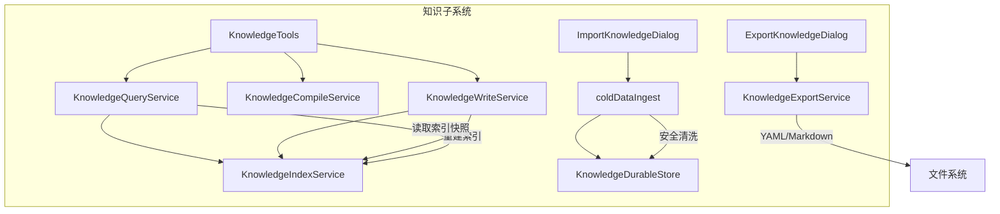

**图表来源**
- [KnowledgeQueryService.ts:94-191](file://src/main/knowledge/KnowledgeQueryService.ts#L94-L191)
- [KnowledgeIndexService.ts:93-168](file://src/main/knowledge/KnowledgeIndexService.ts#L93-L168)
- [KnowledgeCompileService.ts:15-47](file://src/main/knowledge/KnowledgeCompileService.ts#L15-L47)
- [KnowledgeDurableStore.ts:66-183](file://src/main/knowledge/KnowledgeDurableStore.ts#L66-L183)
- [KnowledgeWriteService.ts:66-137](file://src/main/knowledge/KnowledgeWriteService.ts#L66-L137)
- [KnowledgeExportService.ts:71-114](file://src/main/knowledge/KnowledgeExportService.ts#L71-L114)
- [coldDataIngest.ts:224-341](file://src/main/knowledge/coldDataIngest.ts#L224-L341)
- [ExportKnowledgeDialog.tsx:15-130](file://src/renderer/features/knowledge/KnowledgeCenterModal/panels/ExportKnowledgeDialog.tsx#L15-L130)
- [ImportKnowledgeDialog.tsx:17-175](file://src/renderer/features/knowledge/KnowledgeCenterModal/panels/ImportKnowledgeDialog.tsx#L17-L175)

**章节来源**
- [KnowledgeQueryService.ts:94-191](file://src/main/knowledge/KnowledgeQueryService.ts#L94-L191)
- [KnowledgeIndexService.ts:93-168](file://src/main/knowledge/KnowledgeIndexService.ts#L93-L168)
- [KnowledgeCompileService.ts:15-47](file://src/main/knowledge/KnowledgeCompileService.ts#L15-L47)
- [KnowledgeDurableStore.ts:66-183](file://src/main/knowledge/KnowledgeDurableStore.ts#L66-L183)
- [KnowledgeExportService.ts:71-114](file://src/main/knowledge/KnowledgeExportService.ts#L71-L114)
- [coldDataIngest.ts:224-341](file://src/main/knowledge/coldDataIngest.ts#L224-L341)
- [ExportKnowledgeDialog.tsx:15-130](file://src/renderer/features/knowledge/KnowledgeCenterModal/panels/ExportKnowledgeDialog.tsx#L15-L130)
- [ImportKnowledgeDialog.tsx:17-175](file://src/renderer/features/knowledge/KnowledgeCenterModal/panels/ImportKnowledgeDialog.tsx#L17-L175)

## 核心组件
- KnowledgeIndexService：扫描用户与项目空间下的 Markdown，解析 frontmatter，抽取标题、正文、结构化章节、关系、范围元数据，生成索引条目；按 corpus 计算 revision 并持久化快照，支持增量判断与按需重建。
- KnowledgeQueryService：基于索引快照执行六路检索（Identity/Path、Scope/Metadata、Lexical、Structural、Relation/Graph、Temporal/Version），合并得分并返回命中集合。
- KnowledgeCompileService：对查询结果排序、裁剪、生成 reasons 与冲突检测，产出带 packId 的知识包。
- KnowledgeDurableStore：以会话为单位持久化草稿、候选、评审记录，使用内容哈希与版本号实现乐观锁，配合目录锁避免并发写冲突。
- **KnowledgeExportService**：将知识卡片导出为 YAML 包或 Markdown 格式，进行安全扫描和绝对路径移除，确保机器无关性。
- **coldDataIngest**：将 YAML 案例转换为结构化知识卡片草稿，进行敏感信息过滤、绝对路径检测、资产脱敏与完整性校验。
- **ExportKnowledgeDialog/ImportKnowledgeDialog**：提供用户友好的导出/导入界面，支持多种格式选择和范围配置。
- KnowledgeWriteService：在人类确认与权限令牌校验后，原子写入卡片并触发索引重建。
- KnowledgeTools：对外暴露只读/受限写操作的工具集，屏蔽底层复杂性。

**章节来源**
- [KnowledgeIndexService.ts:93-168](file://src/main/knowledge/KnowledgeIndexService.ts#L93-L168)
- [KnowledgeQueryService.ts:94-191](file://src/main/knowledge/KnowledgeQueryService.ts#L94-L191)
- [KnowledgeCompileService.ts:15-47](file://src/main/knowledge/KnowledgeCompileService.ts#L15-L47)
- [KnowledgeDurableStore.ts:66-183](file://src/main/knowledge/KnowledgeDurableStore.ts#L66-L183)
- [KnowledgeExportService.ts:71-114](file://src/main/knowledge/KnowledgeExportService.ts#L71-L114)
- [coldDataIngest.ts:224-341](file://src/main/knowledge/coldDataIngest.ts#L224-L341)
- [ExportKnowledgeDialog.tsx:15-130](file://src/renderer/features/knowledge/KnowledgeCenterModal/panels/ExportKnowledgeDialog.tsx#L15-L130)
- [ImportKnowledgeDialog.tsx:17-175](file://src/renderer/features/knowledge/KnowledgeCenterModal/panels/ImportKnowledgeDialog.tsx#L17-L175)
- [KnowledgeWriteService.ts:66-137](file://src/main/knowledge/KnowledgeWriteService.ts#L66-L137)
- [KnowledgeTools.ts:102-114](file://src/main/knowledge/KnowledgeTools.ts#L102-L114)

## 架构总览
知识编译服务的整体数据流如下：
- 原始知识（Markdown/YAML）被解析为结构化记录
- 索引服务扫描并构建索引快照，提供高效检索
- 查询服务通过多路检索聚合命中，得到高相关度结果
- 编译服务将命中结果打包为知识包，附带冲突提示
- **导出服务将知识卡片序列化为 YAML 包或 Markdown 格式，进行安全验证**
- **导入服务将外部 YAML 案例清洗后进入草稿区，等待人工审核**
- 持久化存储管理草稿/候选/评审，确保版本一致性与并发安全
- 冷数据导入将外部案例清洗后进入草稿区，等待人工审核

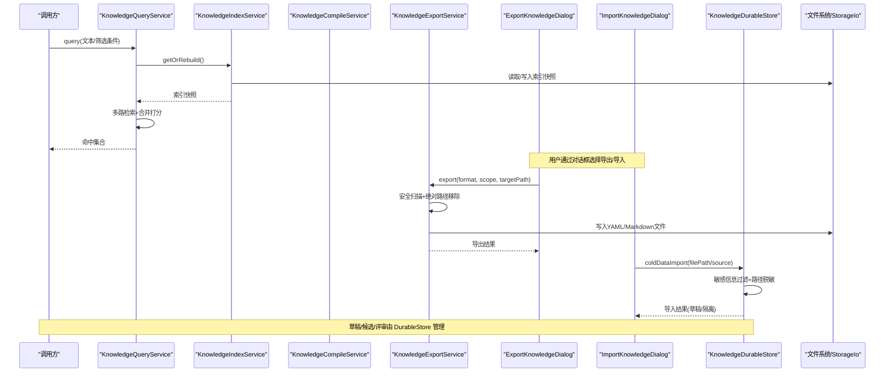

**图表来源**
- [KnowledgeQueryService.ts:154-191](file://src/main/knowledge/KnowledgeQueryService.ts#L154-L191)
- [KnowledgeIndexService.ts:103-168](file://src/main/knowledge/KnowledgeIndexService.ts#L103-L168)
- [KnowledgeCompileService.ts:18-47](file://src/main/knowledge/KnowledgeCompileService.ts#L18-L47)
- [KnowledgeExportService.ts:85-114](file://src/main/knowledge/KnowledgeExportService.ts#L85-L114)
- [ExportKnowledgeDialog.tsx:52-76](file://src/renderer/features/knowledge/KnowledgeCenterModal/panels/ExportKnowledgeDialog.tsx#L52-L76)
- [ImportKnowledgeDialog.tsx:70-91](file://src/renderer/features/knowledge/KnowledgeCenterModal/panels/ImportKnowledgeDialog.tsx#L70-L91)
- [KnowledgeDurableStore.ts:89-183](file://src/main/knowledge/KnowledgeDurableStore.ts#L89-L183)

## 详细组件分析

### KnowledgeIndexService：索引构建与增量更新
- 扫描所有空间（用户空间 + 项目空间）下的 Markdown 文件
- 解析 frontmatter，提取 cardId、title、type、lifecycle、scope、relations、headings、body 等
- 构建 lexical 字符串用于全文匹配，计算 contentHash 用于变更检测
- 生成 KnowledgeIndexSnapshot，包含 schemaVersion、revision（corpus 哈希）、builtAt、cards
- 提供 isSnapshotStale/getOrRebuild 实现增量判断与懒加载
- 通过 StorageIo 原子写入快照，保证一致性

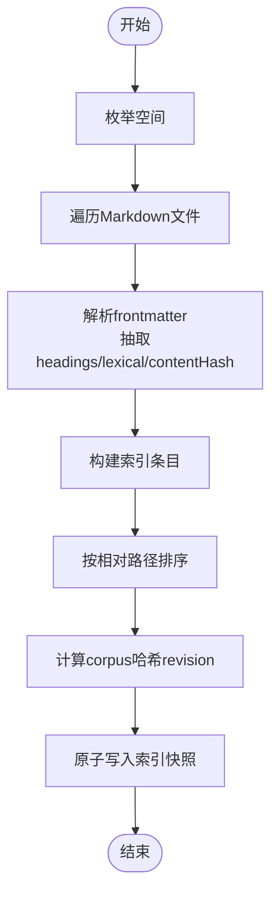

**图表来源**
- [KnowledgeIndexService.ts:103-168](file://src/main/knowledge/KnowledgeIndexService.ts#L103-L168)
- [knowledgeLanes.ts:22-55](file://src/main/knowledge/knowledgeLanes.ts#L22-L55)
- [knowledgeCardSchema.ts:174-206](file://src/main/knowledge/knowledgeCardSchema.ts#L174-L206)

**章节来源**
- [KnowledgeIndexService.ts:103-168](file://src/main/knowledge/KnowledgeIndexService.ts#L103-L168)
- [knowledgeLanes.ts:22-55](file://src/main/knowledge/knowledgeLanes.ts#L22-L55)
- [knowledgeCardSchema.ts:174-206](file://src/main/knowledge/knowledgeCardSchema.ts#L174-L206)

### KnowledgeQueryService：多路检索与评分
- 支持六路检索：Identity/Path、Scope/Metadata、Lexical、Structural、Relation/Graph、Temporal/Version
- 每路独立打分，合并去重并按总分排序
- 支持 spaceIds、type、lifecycle、asOf、scope 等过滤
- 返回 lanes 明细与 hits 汇总，便于上层分析与解释

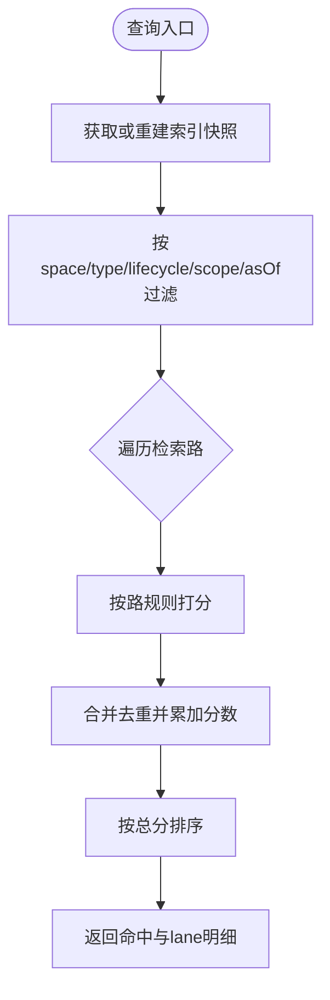

**图表来源**
- [KnowledgeQueryService.ts:154-191](file://src/main/knowledge/KnowledgeQueryService.ts#L154-L191)
- [knowledgeLanes.ts:5-12](file://src/main/knowledge/knowledgeLanes.ts#L5-L12)

**章节来源**
- [KnowledgeQueryService.ts:154-191](file://src/main/knowledge/KnowledgeQueryService.ts#L154-L191)
- [knowledgeLanes.ts:5-12](file://src/main/knowledge/knowledgeLanes.ts#L5-L12)

### KnowledgeCompileService：知识包编译与冲突检测
- 对查询结果按分数降序与路径字典序排序，截取前 N 条
- 为每条命中生成 reasons（lane:score）
- 检测 Relation/Graph 同 title 冲突，标记 contradicts
- 基于命中 cardId 序列计算 digest，生成 packId
- 输出 compiledAt 时间戳与冲突列表

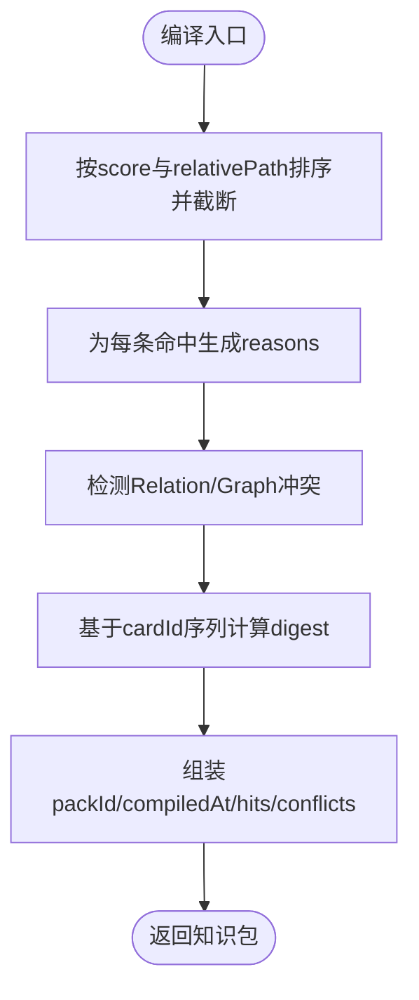

**图表来源**
- [KnowledgeCompileService.ts:18-47](file://src/main/knowledge/KnowledgeCompileService.ts#L18-L47)

**章节来源**
- [KnowledgeCompileService.ts:18-47](file://src/main/knowledge/KnowledgeCompileService.ts#L18-L47)

### KnowledgeExportService：知识导出与安全验证
- **新增功能**：支持两种导出格式 - YAML 包（可重新导入）和 Markdown（仅阅读）
- 安全扫描：检测敏感信息和绝对路径，确保导出内容的机器无关性
- 范围选择：支持选中卡片、过滤结果、整个空间的导出
- 原子写入：使用临时文件加重命名确保写入完整性
- 结果统计：返回实际导出数量、排除数量和文件大小

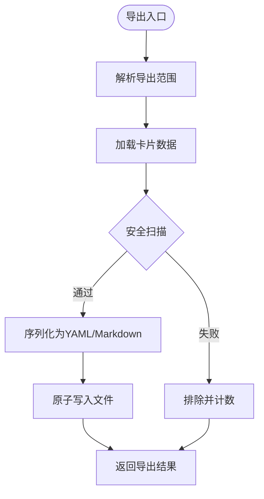

**图表来源**
- [KnowledgeExportService.ts:85-114](file://src/main/knowledge/KnowledgeExportService.ts#L85-L114)
- [KnowledgeExportService.ts:44-48](file://src/main/knowledge/KnowledgeExportService.ts#L44-L48)
- [KnowledgeExportService.ts:50-69](file://src/main/knowledge/KnowledgeExportService.ts#L50-L69)

**章节来源**
- [KnowledgeExportService.ts:71-114](file://src/main/knowledge/KnowledgeExportService.ts#L71-L114)
- [KnowledgeExportService.ts:44-48](file://src/main/knowledge/KnowledgeExportService.ts#L44-L48)
- [KnowledgeExportService.ts:50-69](file://src/main/knowledge/KnowledgeExportService.ts#L50-L69)

### KnowledgeDurableStore：持久化存储与一致性
- 会话级状态文档包含 drafts、candidates、reviews
- 每次写入计算 contentHash，结合 revision 实现乐观锁
- 使用目录锁防止并发写冲突，超时码明确
- 写入后二次读取校验，确保原子替换成功
- 提供 withSessionLock 包装任意操作

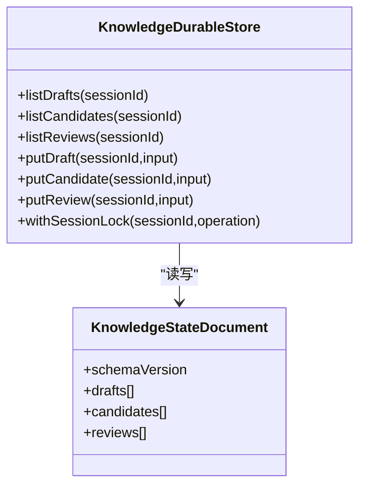

**图表来源**
- [KnowledgeDurableStore.ts:66-183](file://src/main/knowledge/KnowledgeDurableStore.ts#L66-L183)
- [knowledgeStateSchema.ts:48-81](file://src/main/knowledge/knowledgeStateSchema.ts#L48-L81)

**章节来源**
- [KnowledgeDurableStore.ts:66-183](file://src/main/knowledge/KnowledgeDurableStore.ts#L66-L183)
- [knowledgeStateSchema.ts:48-81](file://src/main/knowledge/knowledgeStateSchema.ts#L48-L81)

### coldDataIngest：冷数据导入与安全清洗
- 输入 YAML 案例，严格校验必填字段（case_id/title）
- 扫描文本中的敏感词与绝对路径，命中则隔离
- 收集 assets，生成不透明 assetId，并对文本进行脱敏替换
- 构造结构化 chapters，生成 Markdown 正文与预览
- 若存在缺失资源，返回 missingAssets 提示
- 从路径导入时进行大小限制、哈希与 mtime 一致性检查

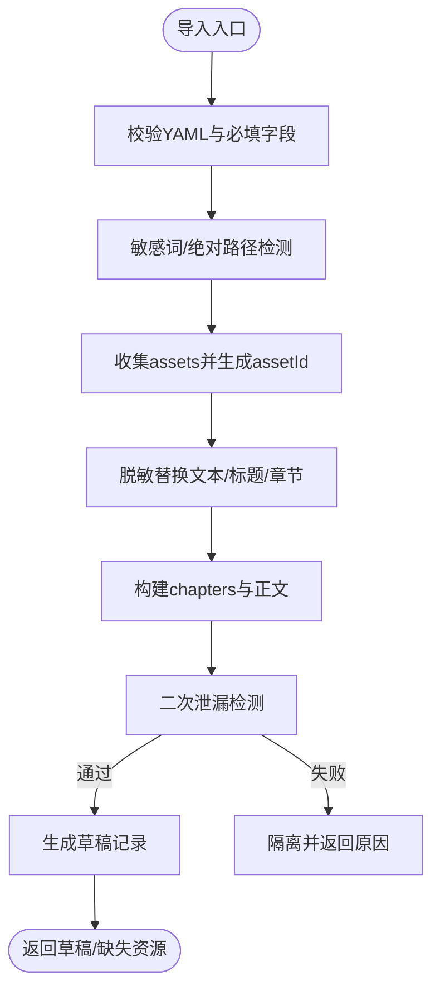

**图表来源**
- [coldDataIngest.ts:224-341](file://src/main/knowledge/coldDataIngest.ts#L224-L341)
- [coldDataIngest.ts:363-431](file://src/main/knowledge/coldDataIngest.ts#L363-L431)

**章节来源**
- [coldDataIngest.ts:224-341](file://src/main/knowledge/coldDataIngest.ts#L224-L341)
- [coldDataIngest.ts:363-431](file://src/main/knowledge/coldDataIngest.ts#L363-L431)

### ExportKnowledgeDialog：导出界面组件
- **新增组件**：提供用户友好的导出界面
- 支持三种导出范围：选中卡片、过滤结果、整个空间
- 支持两种导出格式：YAML 包（可重新导入）和 Markdown（仅阅读）
- 实时显示待导出数量，禁用无效操作
- 显示导出结果和排除原因

**章节来源**
- [ExportKnowledgeDialog.tsx:15-130](file://src/renderer/features/knowledge/KnowledgeCenterModal/panels/ExportKnowledgeDialog.tsx#L15-L130)
- [useKnowledgeExport.ts:15-97](file://src/renderer/features/knowledge/KnowledgeCenterModal/useKnowledgeExport.ts#L15-L97)

### ImportKnowledgeDialog：导入界面组件
- **新增组件**：提供用户友好的导入界面
- 支持两种导入模式：文件上传和内容粘贴
- 显示导入结果状态：草稿、隔离、冲突
- 支持创建候选项直接进入工作流
- 实时刷新收件箱，显示待处理项目

**章节来源**
- [ImportKnowledgeDialog.tsx:17-175](file://src/renderer/features/knowledge/KnowledgeCenterModal/panels/ImportKnowledgeDialog.tsx#L17-L175)
- [useKnowledgeImport.ts:12-136](file://src/renderer/features/knowledge/KnowledgeCenterModal/useKnowledgeImport.ts#L12-L136)

### KnowledgeWriteService：写入与生命周期推进
- 需要人类确认与可选审批令牌
- 校验生命周期合法性（如 case 必须补齐章节才可 verified）
- 安全目标路径校验（防符号链接/硬链接逃逸）
- 原子写入并验证写入完整性
- 成功后触发索引重建

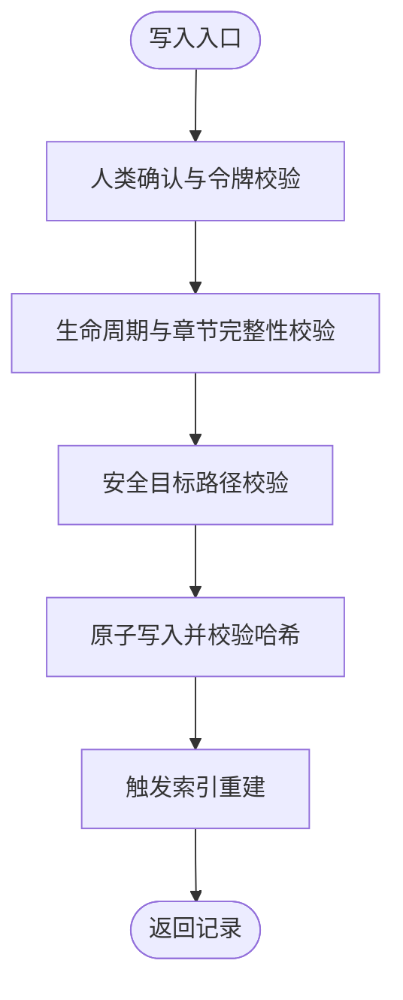

**图表来源**
- [KnowledgeWriteService.ts:66-137](file://src/main/knowledge/KnowledgeWriteService.ts#L66-L137)
- [knowledgeFs.ts:139-182](file://src/main/knowledge/knowledgeFs.ts#L139-L182)

**章节来源**
- [KnowledgeWriteService.ts:66-137](file://src/main/knowledge/KnowledgeWriteService.ts#L66-L137)
- [knowledgeFs.ts:139-182](file://src/main/knowledge/knowledgeFs.ts#L139-L182)

### KnowledgeCandidateService：候选与冷数据入仓
- 仅在有显式用户意图时创建候选，落盘至会话状态
- 冷数据导入进入 staging 空间，作为草稿保存
- 提供评审队列与列表能力

**章节来源**
- [KnowledgeCandidateService.ts:35-142](file://src/main/knowledge/KnowledgeCandidateService.ts#L35-L142)
- [coldDataIngest.ts:224-341](file://src/main/knowledge/coldDataIngest.ts#L224-L341)

### KnowledgeTools：Agent 工具封装
- knowledge_browse：列出空间或卡片
- knowledge_search：执行多路检索并展示 top-N
- knowledge_read：按空间与相对路径读取卡片
- knowledge_compile：基于查询编译知识包
- knowledge_candidate_create：创建会话候选（需显式意图）

**章节来源**
- [KnowledgeTools.ts:102-114](file://src/main/knowledge/KnowledgeTools.ts#L102-L114)
- [KnowledgeTools.ts:116-367](file://src/main/knowledge/KnowledgeTools.ts#L116-L367)

## 依赖关系分析
- KnowledgeQueryService 依赖 KnowledgeIndexService 提供的快照
- KnowledgeIndexService 依赖文件系统与 StorageIo，以及 knowledgeCardSchema 解析
- KnowledgeCompileService 依赖查询结果，无外部 IO
- **KnowledgeExportService 依赖查询服务和文件系统，进行安全验证**
- **对话框组件依赖 useKnowledgeExport/useKnowledgeImport hooks 和 IPC 接口**
- KnowledgeDurableStore 依赖 StorageIo 与目录锁，保障并发安全
- coldDataIngest 依赖 YAML 解析与文本处理工具
- KnowledgeWriteService 依赖文件系统安全校验与索引重建

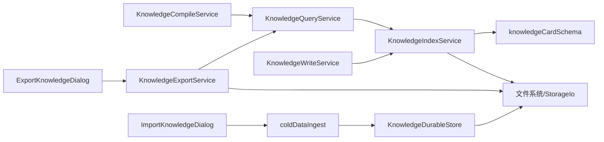

**图表来源**
- [KnowledgeQueryService.ts:94-191](file://src/main/knowledge/KnowledgeQueryService.ts#L94-L191)
- [KnowledgeIndexService.ts:93-168](file://src/main/knowledge/KnowledgeIndexService.ts#L93-L168)
- [KnowledgeCompileService.ts:15-47](file://src/main/knowledge/KnowledgeCompileService.ts#L15-L47)
- [KnowledgeExportService.ts:71-114](file://src/main/knowledge/KnowledgeExportService.ts#L71-L114)
- [ExportKnowledgeDialog.tsx:15-130](file://src/renderer/features/knowledge/KnowledgeCenterModal/panels/ExportKnowledgeDialog.tsx#L15-L130)
- [ImportKnowledgeDialog.tsx:17-175](file://src/renderer/features/knowledge/KnowledgeCenterModal/panels/ImportKnowledgeDialog.tsx#L17-L175)
- [KnowledgeDurableStore.ts:66-183](file://src/main/knowledge/KnowledgeDurableStore.ts#L66-L183)
- [coldDataIngest.ts:224-341](file://src/main/knowledge/coldDataIngest.ts#L224-L341)
- [KnowledgeWriteService.ts:66-137](file://src/main/knowledge/KnowledgeWriteService.ts#L66-L137)

**章节来源**
- [KnowledgeQueryService.ts:94-191](file://src/main/knowledge/KnowledgeQueryService.ts#L94-L191)
- [KnowledgeIndexService.ts:93-168](file://src/main/knowledge/KnowledgeIndexService.ts#L93-L168)
- [KnowledgeCompileService.ts:15-47](file://src/main/knowledge/KnowledgeCompileService.ts#L15-L47)
- [KnowledgeExportService.ts:71-114](file://src/main/knowledge/KnowledgeExportService.ts#L71-L114)
- [ExportKnowledgeDialog.tsx:15-130](file://src/renderer/features/knowledge/KnowledgeCenterModal/panels/ExportKnowledgeDialog.tsx#L15-L130)
- [ImportKnowledgeDialog.tsx:17-175](file://src/renderer/features/knowledge/KnowledgeCenterModal/panels/ImportKnowledgeDialog.tsx#L17-L175)
- [KnowledgeDurableStore.ts:66-183](file://src/main/knowledge/KnowledgeDurableStore.ts#L66-L183)
- [coldDataIngest.ts:224-341](file://src/main/knowledge/coldDataIngest.ts#L224-L341)
- [KnowledgeWriteService.ts:66-137](file://src/main/knowledge/KnowledgeWriteService.ts#L66-L137)

## 性能与优化
- 索引快照缓存：getOrRebuild 仅在快照过期时重建，减少重复扫描
- 增量更新策略：revision 基于 cards 的 cardId 与 contentHash 计算，任何内容变化都会导致 revision 变化
- 多路检索合并：先按 lane 独立打分，再合并去重累加，提升召回与精度平衡
- **原子写入与校验：写入后二次读取并比对哈希，避免静默损坏**
- **并发安全：目录锁保护状态文件，避免竞态条件**
- **导出优化：使用临时文件加重命名确保写入完整性，避免部分文件**
- **导入限制：最大字节数限制与哈希/mtime 一致性检查，防止恶意或异常输入**
- **安全扫描：导入导出共用敏感信息检测逻辑，保持一致性**

## 故障排查指南
- 索引快照不一致：检查 isSnapshotStale 逻辑与 computeLiveRevision 是否稳定；确认 snapshot 文件是否被外部修改
- 写入失败：查看 writeKnowledgeCardAtomic 的哈希校验错误；确认路径未逃逸且非符号链接/硬链接
- 并发冲突：检查 withSessionLock 的超时码与重试次数；确认目录锁文件未被残留
- **导出失败：检查 KNOWLEDGE_EXPORT_TARGET_INVALID、KNOWLEDGE_EXPORT_EMPTY_SELECTION、KNOWLEDGE_EXPORT_EMPTY_RESULT 错误**
- **导入失败：根据 reason 定位问题（secret-detected、absolute-path、yaml-broken、duplicate-case-id、filename-leaked、source-too-large、source-changed）**
- 查询结果为空：确认 scope/type/lifecycle 过滤条件是否正确；检查 lanes 是否包含所需维度

**章节来源**
- [KnowledgeIndexService.ts:139-168](file://src/main/knowledge/KnowledgeIndexService.ts#L139-L168)
- [knowledgeFs.ts:139-182](file://src/main/knowledge/knowledgeFs.ts#L139-L182)
- [KnowledgeDurableStore.ts:147-183](file://src/main/knowledge/KnowledgeDurableStore.ts#L147-L183)
- [KnowledgeExportService.ts:85-114](file://src/main/knowledge/KnowledgeExportService.ts#L85-L114)
- [coldDataIngest.ts:224-341](file://src/main/knowledge/coldDataIngest.ts#L224-L341)
- [coldDataIngest.ts:363-431](file://src/main/knowledge/coldDataIngest.ts#L363-L431)

## 结论
知识编译服务通过"索引快照 + 多路检索 + 编译打包 + 持久化状态 + 导出导入"形成完整闭环：
- 索引服务提供高效、可增量更新的检索基础
- 查询服务通过多路评分实现语义与结构兼顾的检索
- 编译服务将结果转化为可消费的知识包，附带冲突提示
- **导出服务提供安全的知识分享能力，支持 YAML 包和 Markdown 格式**
- **导入服务提供安全的知识获取能力，进行严格的敏感信息检测**
- 持久化存储保障草稿/候选/评审的版本一致性与并发安全
- 冷数据导入提供安全的批量入仓能力
该设计在保证数据一致性的同时，兼顾了可扩展性、安全性和可维护性。

## 附录：流程图与数据结构图

### 从原始知识到可搜索索引的完整转换流程
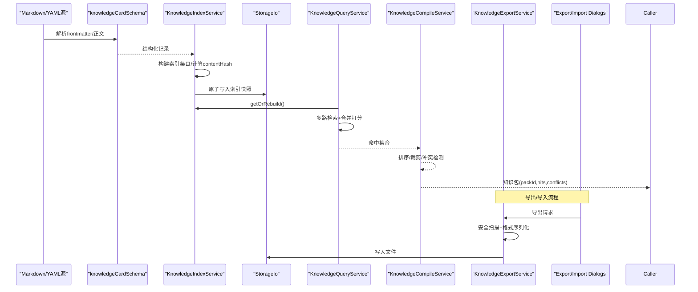

**图表来源**
- [knowledgeCardSchema.ts:174-206](file://src/main/knowledge/knowledgeCardSchema.ts#L174-L206)
- [KnowledgeIndexService.ts:103-168](file://src/main/knowledge/KnowledgeIndexService.ts#L103-L168)
- [KnowledgeQueryService.ts:154-191](file://src/main/knowledge/KnowledgeQueryService.ts#L154-L191)
- [KnowledgeCompileService.ts:18-47](file://src/main/knowledge/KnowledgeCompileService.ts#L18-L47)
- [KnowledgeExportService.ts:85-114](file://src/main/knowledge/KnowledgeExportService.ts#L85-L114)
- [ExportKnowledgeDialog.tsx:52-76](file://src/renderer/features/knowledge/KnowledgeCenterModal/panels/ExportKnowledgeDialog.tsx#L52-L76)

### 关键数据结构图
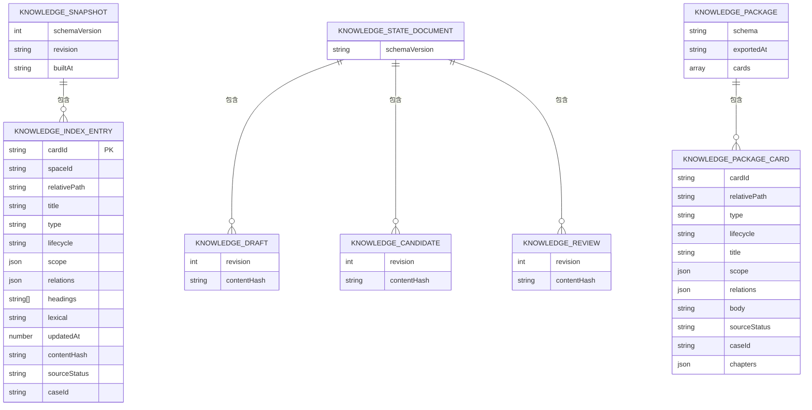

**图表来源**
- [knowledgeLanes.ts:22-55](file://src/main/knowledge/knowledgeLanes.ts#L22-L55)
- [knowledgeStateSchema.ts:48-81](file://src/main/knowledge/knowledgeStateSchema.ts#L48-L81)
- [knowledgeExport.ts:20-39](file://src/shared/types/knowledgeExport.ts#L20-L39)
- [knowledgeExport.ts:35-39](file://src/shared/types/knowledgeExport.ts#L35-L39)