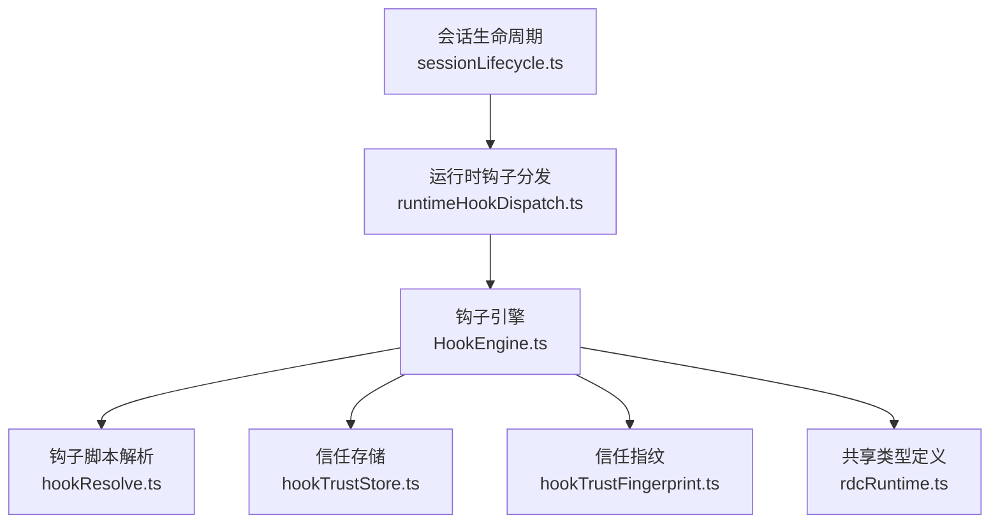
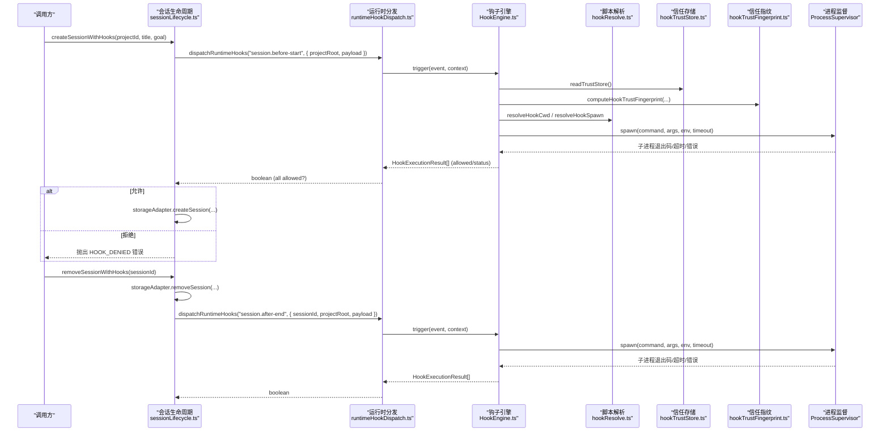
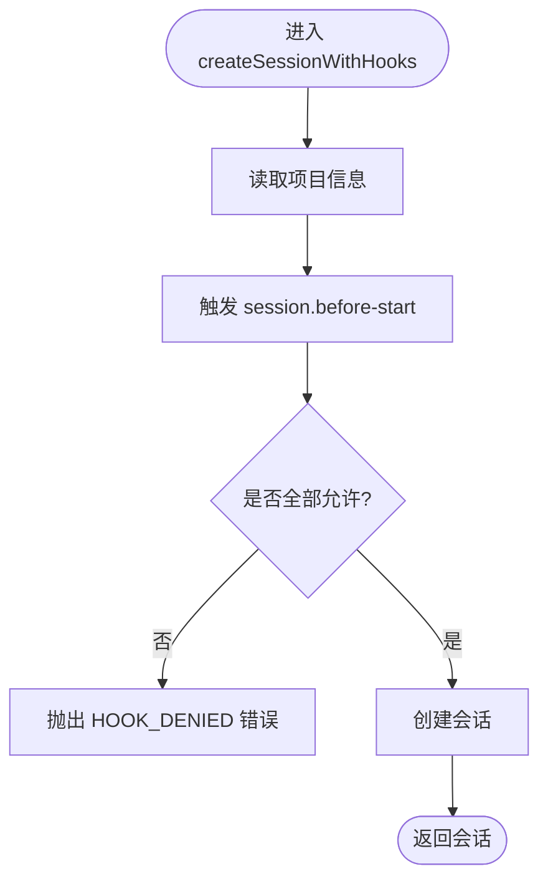
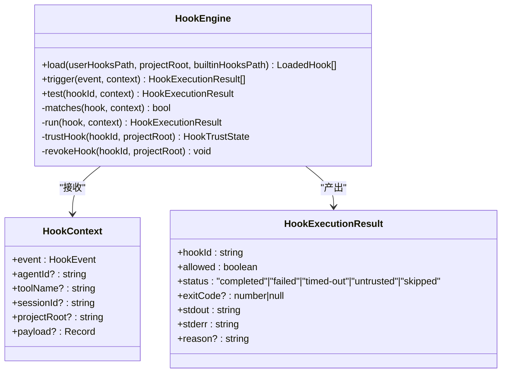
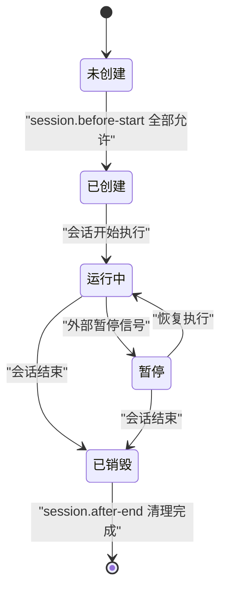
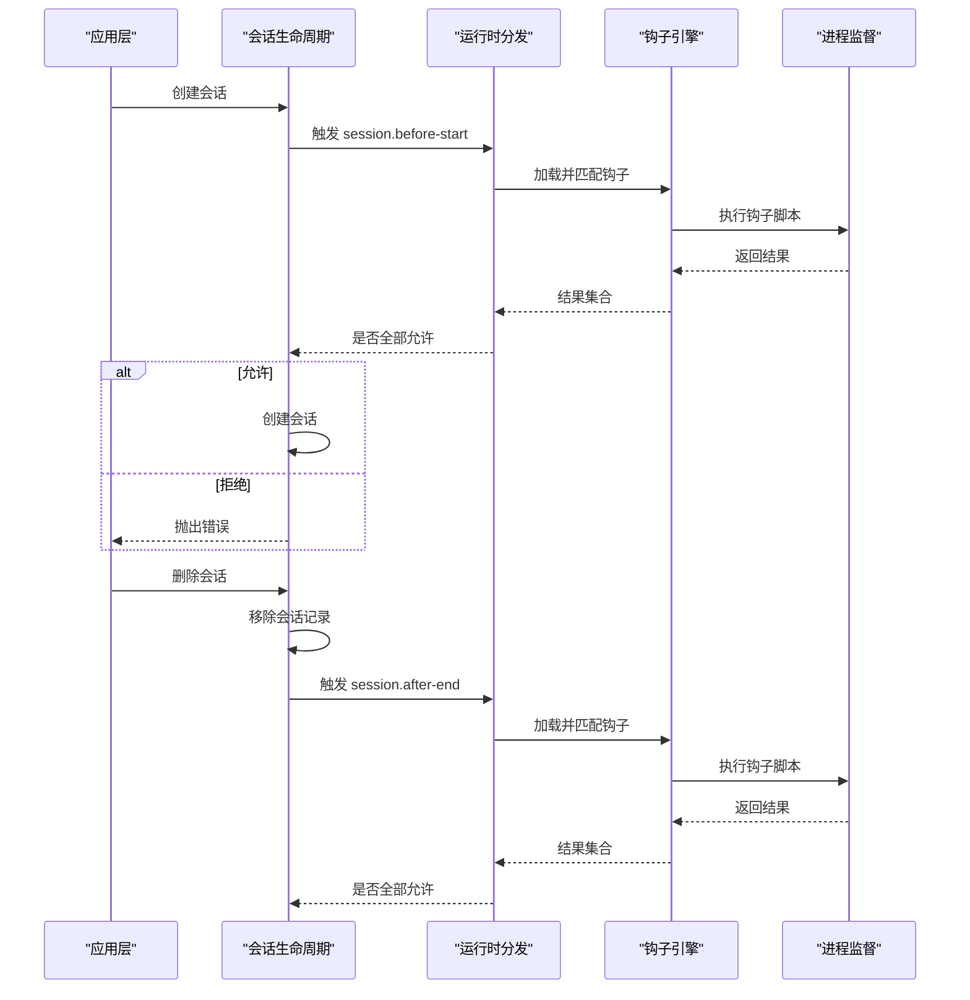
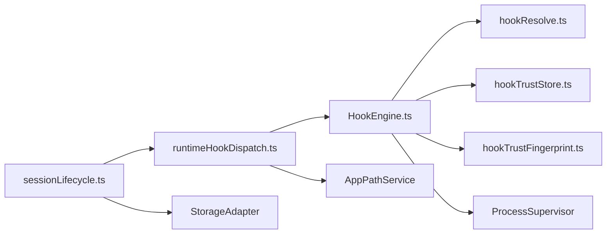

# 会话生命周期集成

<cite>
**本文引用的文件**
- [sessionLifecycle.ts](file://src/main/hooks/sessionLifecycle.ts)
- [HookEngine.ts](file://src/main/hooks/HookEngine.ts)
- [runtimeHookDispatch.ts](file://src/main/hooks/runtimeHookDispatch.ts)
- [hookResolve.ts](file://src/main/hooks/hookResolve.ts)
- [hookTrustStore.ts](file://src/main/hooks/hookTrustStore.ts)
- [hookTrustFingerprint.ts](file://src/main/hooks/hookTrustFingerprint.ts)
- [rdcRuntime.ts](file://src/shared/types/rdcRuntime.ts)
- [sessionLifecycle.test.ts](file://src/main/hooks/sessionLifecycle.test.ts)
</cite>

## 目录
1. [简介](#简介)
2. [项目结构](#项目结构)
3. [核心组件](#核心组件)
4. [架构总览](#架构总览)
5. [详细组件分析](#详细组件分析)
6. [依赖关系分析](#依赖关系分析)
7. [性能考量](#性能考量)
8. [故障排查指南](#故障排查指南)
9. [结论](#结论)
10. [附录](#附录)

## 简介
本文件聚焦于“会话生命周期集成”，系统性说明 sessionLifecycle 模块如何将钩子系统与应用程序会话管理进行集成，覆盖会话启动、运行、暂停、恢复、销毁等阶段的钩子触发点与上下文构建。文档还解释会话级钩子的作用域隔离、资源清理、状态同步机制，以及钩子执行结果对会话状态的影响、错误恢复策略与回滚机制，并提供完整的会话生命周期图与钩子触发时序图，帮助读者从创建到销毁完整理解钩子调用链。

## 项目结构
围绕会话生命周期与钩子系统的关键代码分布在以下位置：
- 会话生命周期入口：src/main/hooks/sessionLifecycle.ts
- 钩子引擎与执行：src/main/hooks/HookEngine.ts
- 运行时钩子分发：src/main/hooks/runtimeHookDispatch.ts
- 钩子脚本解析与参数解析：src/main/hooks/hookResolve.ts
- 信任存储与指纹计算：src/main/hooks/hookTrustStore.ts、src/main/hooks/hookTrustFingerprint.ts
- 钩子事件类型定义：src/shared/types/rdcRuntime.ts
- 单元测试（验证行为）：src/main/hooks/sessionLifecycle.test.ts

图表来源
- [sessionLifecycle.ts:1-34](file://src/main/hooks/sessionLifecycle.ts#L1-L34)
- [runtimeHookDispatch.ts:1-20](file://src/main/hooks/runtimeHookDispatch.ts#L1-L20)
- [HookEngine.ts:71-381](file://src/main/hooks/HookEngine.ts#L71-L381)
- [hookResolve.ts:1-95](file://src/main/hooks/hookResolve.ts#L1-L95)
- [hookTrustStore.ts:1-101](file://src/main/hooks/hookTrustStore.ts#L1-L101)
- [hookTrustFingerprint.ts:1-150](file://src/main/hooks/hookTrustFingerprint.ts#L1-L150)
- [rdcRuntime.ts:103-131](file://src/shared/types/rdcRuntime.ts#L103-L131)

章节来源
- [sessionLifecycle.ts:1-34](file://src/main/hooks/sessionLifecycle.ts#L1-L34)
- [runtimeHookDispatch.ts:1-20](file://src/main/hooks/runtimeHookDispatch.ts#L1-L20)
- [HookEngine.ts:71-381](file://src/main/hooks/HookEngine.ts#L71-L381)
- [hookResolve.ts:1-95](file://src/main/hooks/hookResolve.ts#L1-L95)
- [hookTrustStore.ts:1-101](file://src/main/hooks/hookTrustStore.ts#L1-L101)
- [hookTrustFingerprint.ts:1-150](file://src/main/hooks/hookTrustFingerprint.ts#L1-L150)
- [rdcRuntime.ts:103-131](file://src/shared/types/rdcRuntime.ts#L103-L131)

## 核心组件
- 会话生命周期入口（sessionLifecycle.ts）
  - createSessionWithHooks：在创建会话前触发 session.before-start 钩子；若被拒绝则阻止创建并抛出错误。
  - removeSessionWithHooks：在删除会话后触发 session.after-end 钩子，用于清理与审计。
- 运行时钩子分发（runtimeHookDispatch.ts）
  - runRuntimeHooks：加载用户与项目钩子，并将事件与上下文注入 HookEngine。
  - dispatchRuntimeHooks：聚合所有钩子结果，仅当全部 allowed 为真时返回 true。
- 钩子引擎（HookEngine.ts）
  - 加载与匹配：按 scope（builtin/user/project）加载 .hook.yml，基于 matcher（agents/tools）过滤。
  - 信任控制：通过 hookTrustStore 与 hookTrustFingerprint 校验钩子可信度。
  - 执行与结果：使用 ProcessSupervisor 以独立进程执行钩子脚本，支持超时、输出截断、失败策略（block/warn）。
  - 上下文传递：将 agentId、toolName、sessionId、projectRoot、payload 等注入子进程 stdin。
- 钩子脚本解析（hookResolve.ts）
  - 解析命令与参数，内置脚本路径解析、相对路径查找、cwd 设置。
- 信任存储（hookTrustStore.ts）
  - 持久化信任记录，支持 schema 版本迁移与向后兼容。
- 信任指纹（hookTrustFingerprint.ts）
  - 基于可执行文件与引用文件的哈希生成唯一指纹，确保钩子变更可检测。
- 类型定义（rdcRuntime.ts）
  - 定义 CANONICAL_HOOK_EVENTS（包含 session.before-start、session.after-end 等）、HookDefinition、HookContext 等。

章节来源
- [sessionLifecycle.ts:1-34](file://src/main/hooks/sessionLifecycle.ts#L1-L34)
- [runtimeHookDispatch.ts:1-20](file://src/main/hooks/runtimeHookDispatch.ts#L1-L20)
- [HookEngine.ts:20-46](file://src/main/hooks/HookEngine.ts#L20-L46)
- [HookEngine.ts:71-381](file://src/main/hooks/HookEngine.ts#L71-L381)
- [hookResolve.ts:1-95](file://src/main/hooks/hookResolve.ts#L1-L95)
- [hookTrustStore.ts:1-101](file://src/main/hooks/hookTrustStore.ts#L1-L101)
- [hookTrustFingerprint.ts:1-150](file://src/main/hooks/hookTrustFingerprint.ts#L1-L150)
- [rdcRuntime.ts:103-131](file://src/shared/types/rdcRuntime.ts#L103-L131)

## 架构总览
下图展示从会话创建到销毁的完整钩子调用链，包括上下文构建、信任校验、进程执行与结果聚合。

图表来源
- [sessionLifecycle.ts:4-33](file://src/main/hooks/sessionLifecycle.ts#L4-L33)
- [runtimeHookDispatch.ts:5-19](file://src/main/hooks/runtimeHookDispatch.ts#L5-L19)
- [HookEngine.ts:214-369](file://src/main/hooks/HookEngine.ts#L214-L369)
- [hookResolve.ts:49-94](file://src/main/hooks/hookResolve.ts#L49-L94)
- [hookTrustStore.ts:65-100](file://src/main/hooks/hookTrustStore.ts#L65-L100)
- [hookTrustFingerprint.ts:131-149](file://src/main/hooks/hookTrustFingerprint.ts#L131-L149)

## 详细组件分析

### 会话生命周期入口（sessionLifecycle.ts）
- 创建会话前拦截
  - 通过 storageAdapter.getProjectById 获取项目根路径。
  - 调用 dispatchRuntimeHooks('session.before-start', { projectRoot, payload })。
  - 若任一钩子返回 allowed=false，则抛出 HOOK_DENIED 错误，阻止创建。
  - 否则继续 storageAdapter.createSession。
- 删除会话后清理
  - 先移除会话记录，再触发 session.after-end 钩子，携带 sessionId、projectRoot、payload。
  - 便于审计、资源释放、外部系统通知。

图表来源
- [sessionLifecycle.ts:4-21](file://src/main/hooks/sessionLifecycle.ts#L4-L21)

章节来源
- [sessionLifecycle.ts:4-33](file://src/main/hooks/sessionLifecycle.ts#L4-L33)
- [sessionLifecycle.test.ts:41-68](file://src/main/hooks/sessionLifecycle.test.ts#L41-L68)

### 运行时钩子分发（runtimeHookDispatch.ts）
- runRuntimeHooks：每次触发前加载用户与项目钩子，确保最新配置生效。
- dispatchRuntimeHooks：将所有钩子结果合并，只有全部 allowed 为真才返回 true。
- 该设计保证会话关键操作具备强一致性拦截能力。

章节来源
- [runtimeHookDispatch.ts:5-19](file://src/main/hooks/runtimeHookDispatch.ts#L5-L19)

### 钩子引擎（HookEngine.ts）
- 加载与匹配
  - 扫描 builtin/user/project 三处钩子目录，解析 .hook.yml。
  - 使用 matcher.agents/matcher.tools 精确匹配上下文中的 agentId/toolName。
- 信任控制
  - 通过 computeHookTrustFingerprint 计算指纹，结合 hookTrustStore 判断是否 trusted。
  - 未信任且 failurePolicy=block 时直接中断后续钩子。
- 执行与结果
  - 使用 ProcessSupervisor 以独立进程执行，stdin 传入 JSON 化的 HookContext。
  - 支持超时、输出大小限制、spawn 失败处理。
  - 根据 exit code 与 failurePolicy 决定 allowed 与 status。
- 上下文构建
  - HookContext 包含 event、agentId、toolName、sessionId、projectRoot、payload。
  - 这些字段由上层调用方构造，并在触发时注入。

图表来源
- [HookEngine.ts:20-46](file://src/main/hooks/HookEngine.ts#L20-L46)
- [HookEngine.ts:71-381](file://src/main/hooks/HookEngine.ts#L71-L381)

章节来源
- [HookEngine.ts:20-46](file://src/main/hooks/HookEngine.ts#L20-L46)
- [HookEngine.ts:71-381](file://src/main/hooks/HookEngine.ts#L71-L381)

### 钩子脚本解析（hookResolve.ts）
- 解析命令：若 command 为 node，则替换为当前进程执行路径，并设置 ELECTRON_RUN_AS_NODE。
- 解析参数：内置脚本优先在官方目录中查找；用户/项目脚本在源目录或 cwd 向上递归查找。
- 工作目录：根据 definition.cwd 与 projectRoot 确定。
- 安全约束：内置脚本必须位于官方目录，防止任意路径执行。

章节来源
- [hookResolve.ts:1-95](file://src/main/hooks/hookResolve.ts#L1-L95)

### 信任存储与指纹（hookTrustStore.ts、hookTrustFingerprint.ts）
- 信任存储
  - 维护 schemaVersion 与 records，支持 v1 向 v2 迁移。
  - 高版本 schema 不支持时 fail-closed，避免未知格式破坏。
- 指纹计算
  - 基于可执行文件与引用文件哈希，结合 scope、sourcePath、projectRoot 生成唯一指纹。
  - 用于检测钩子内容变更，强制重新信任。

章节来源
- [hookTrustStore.ts:1-101](file://src/main/hooks/hookTrustStore.ts#L1-L101)
- [hookTrustFingerprint.ts:1-150](file://src/main/hooks/hookTrustFingerprint.ts#L1-L150)

### 会话生命周期图（创建到销毁）

[此图为概念性流程图，不直接映射具体源码文件]

### 钩子触发时序图（会话级）

图表来源
- [sessionLifecycle.ts:4-33](file://src/main/hooks/sessionLifecycle.ts#L4-L33)
- [runtimeHookDispatch.ts:5-19](file://src/main/hooks/runtimeHookDispatch.ts#L5-L19)
- [HookEngine.ts:214-369](file://src/main/hooks/HookEngine.ts#L214-L369)

## 依赖关系分析
- 耦合关系
  - sessionLifecycle 依赖 runtimeHookDispatch 与 storageAdapter。
  - runtimeHookDispatch 依赖 HookEngine 与 AppPathService。
  - HookEngine 依赖 hookResolve、hookTrustStore、hookTrustFingerprint、ProcessSupervisor。
- 外部依赖
  - 共享类型 rdcRuntime.ts 提供 HookEvent、HookDefinition 等契约。
- 潜在循环依赖
  - 当前模块间单向依赖，未见循环导入迹象。

图表来源
- [sessionLifecycle.ts:1-34](file://src/main/hooks/sessionLifecycle.ts#L1-L34)
- [runtimeHookDispatch.ts:1-20](file://src/main/hooks/runtimeHookDispatch.ts#L1-L20)
- [HookEngine.ts:71-381](file://src/main/hooks/HookEngine.ts#L71-L381)
- [hookResolve.ts:1-95](file://src/main/hooks/hookResolve.ts#L1-L95)
- [hookTrustStore.ts:1-101](file://src/main/hooks/hookTrustStore.ts#L1-L101)
- [hookTrustFingerprint.ts:1-150](file://src/main/hooks/hookTrustFingerprint.ts#L1-L150)

章节来源
- [sessionLifecycle.ts:1-34](file://src/main/hooks/sessionLifecycle.ts#L1-L34)
- [runtimeHookDispatch.ts:1-20](file://src/main/hooks/runtimeHookDispatch.ts#L1-L20)
- [HookEngine.ts:71-381](file://src/main/hooks/HookEngine.ts#L71-L381)

## 性能考量
- 钩子执行开销
  - 每个钩子以独立进程执行，存在进程创建与通信成本。
  - 默认超时 30 秒，可通过 definition.timeoutMs 调整。
  - 输出限制 64KB，避免大输出阻塞。
- 加载与匹配
  - 每次触发前加载用户与项目钩子，建议减少频繁触发场景。
  - matcher 过滤可减少不必要执行。
- 信任检查
  - 指纹计算涉及文件哈希，建议在批量操作中缓存结果。
- 优化建议
  - 合并多次触发，降低进程启动频率。
  - 合理设置 failurePolicy=warn 的非关键钩子，提升鲁棒性。
  - 使用缓存与懒加载减少重复 IO。

[本节提供通用指导，无需特定文件分析]

## 故障排查指南
- 常见错误与恢复
  - HOOK_DENIED：session.before-start 被拒绝，检查钩子逻辑与信任状态。
  - untrusted：钩子未信任，需重新信任或更新指纹。
  - timed-out：钩子执行超时，检查脚本性能与超时配置。
  - failed：脚本非零退出码或异常，查看 stderr 与 reason。
  - spawn_failed：无法启动子进程，检查命令与权限。
- 调试步骤
  - 查看 HookExecutionResult.stdout/stderr 定位问题。
  - 使用 test(hookId, context) 单独测试指定钩子。
  - 检查 hookTrustStore 记录与 schemaVersion 兼容性。
- 回滚与一致性
  - session.before-start 拒绝时，不会创建会话，保持无副作用。
  - session.after-end 在删除后触发，用于清理；若失败不影响已删除状态。

章节来源
- [HookEngine.ts:214-369](file://src/main/hooks/HookEngine.ts#L214-L369)
- [hookTrustStore.ts:65-100](file://src/main/hooks/hookTrustStore.ts#L65-L100)
- [sessionLifecycle.test.ts:50-68](file://src/main/hooks/sessionLifecycle.test.ts#L50-L68)

## 结论
sessionLifecycle 模块通过严格的钩子前置拦截与后置清理，实现了会话生命周期的可控性与可观测性。HookEngine 提供了强大的钩子加载、匹配、信任校验与执行框架，结合 runtimeHookDispatch 的聚合策略，确保关键操作的强一致性与安全性。通过上下文构建（agentId、toolName、sessionId、projectRoot、payload），钩子能够精准感知执行环境，实现细粒度的作用域隔离与资源管理。错误恢复与回滚机制保障了系统在异常下的稳定性。

[本节总结整体发现，无需特定文件分析]

## 附录
- 钩子事件列表（来自共享类型）
  - session.before-start、session.after-end
  - turn.before-start、turn.after-end
  - tool.before-call、tool.after-call、tool.on-error
  - context.before-compact、context.after-compact
  - agent.before-handoff、agent.after-handoff
  - permission.denied
- 上下文字段说明
  - agentId：触发钩子的代理标识。
  - toolName：触发钩子的工具名称。
  - sessionId：会话标识。
  - projectRoot：项目根路径。
  - payload：业务相关附加数据。

章节来源
- [rdcRuntime.ts:103-131](file://src/shared/types/rdcRuntime.ts#L103-L131)
- [HookEngine.ts:20-46](file://src/main/hooks/HookEngine.ts#L20-L46)